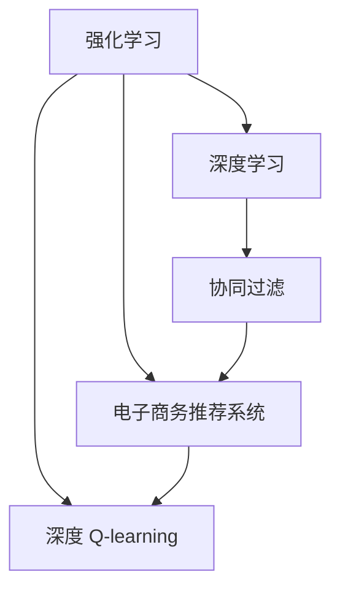
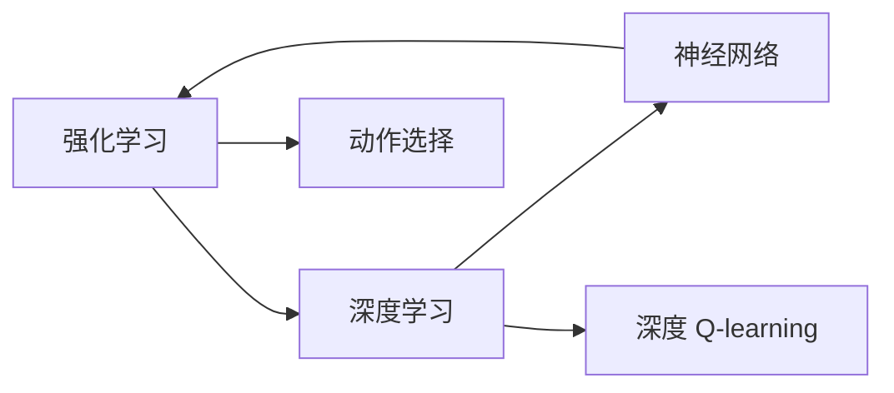
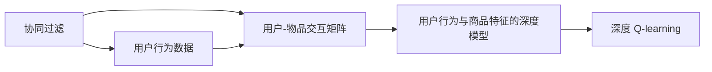
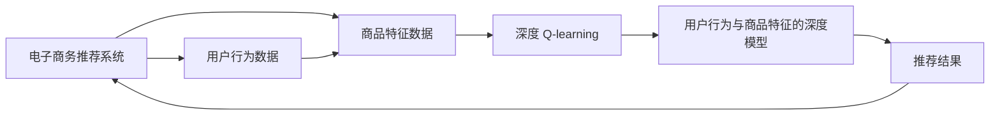
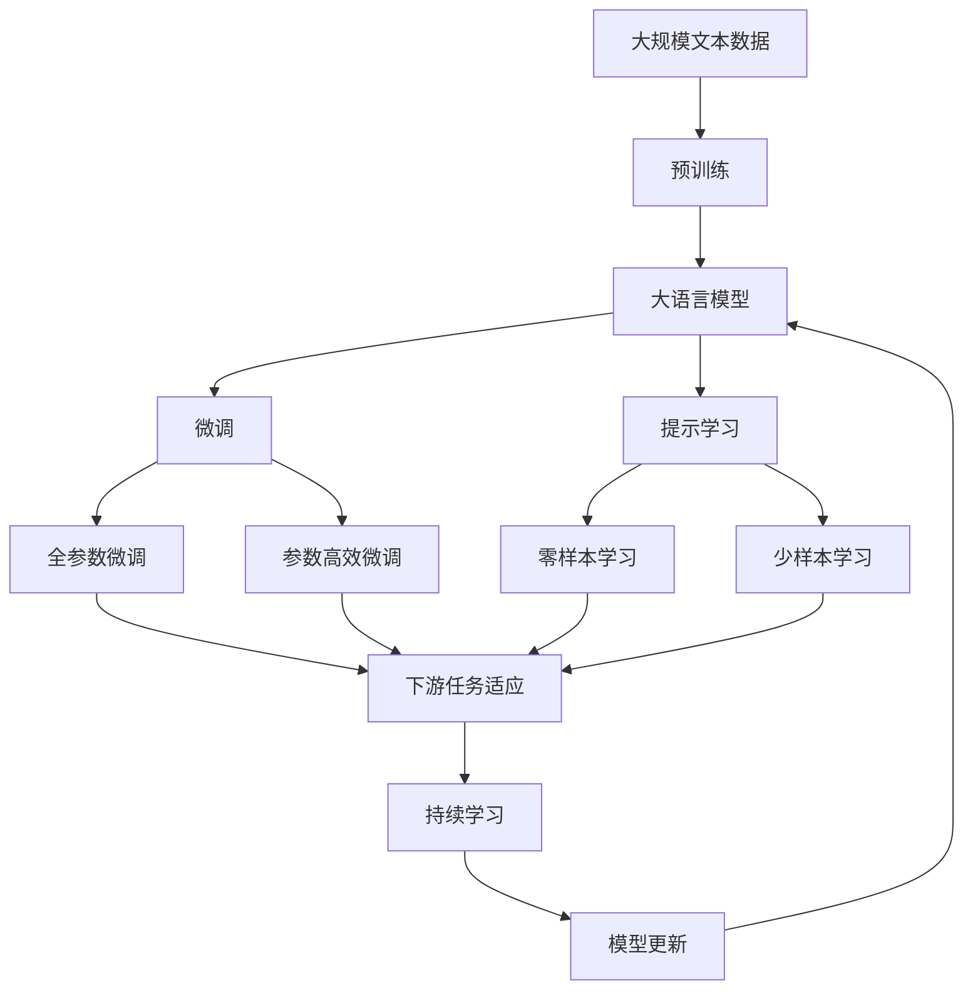

                 

# 深度 Q-learning：在电子商务推荐系统中的应用

> 关键词：深度强化学习,电子商务推荐系统,协同过滤,目标函数,期望回报,策略迭代,代码实现,参数调整

## 1. 背景介绍

### 1.1 问题由来
电子商务推荐系统是现代电子商务企业必不可少的关键技术，通过推荐系统向用户推荐其感兴趣的商品，能极大提升用户体验、提高转化率和销售额。推荐系统一般分为两大类：基于内容的推荐系统(Content-based Recommendation)和基于协同过滤的推荐系统(Collaborative Filtering, CF)。

基于内容的推荐系统通常先对商品进行特征提取，再构建用户与商品之间的特征匹配模型。然而，该方法往往面临特征工程难度大、维度灾难等问题，难以处理高维稀疏特征。而基于协同过滤的方法，通过挖掘用户历史行为数据，发现用户间的相似关系，从而进行推荐。尽管该方法不需要特征工程，但同样面临着计算复杂度高、难以处理新用户和物品等问题。

### 1.2 问题核心关键点
深度 Q-learning 是一种基于深度学习与强化学习相结合的推荐系统算法，通过构建用户行为与商品特征之间的深度模型，自适应地学习用户的兴趣偏好，并根据用户的行为特征进行推荐。该方法能够高效处理高维稀疏数据，同时具备较强的泛化能力和适应性。

深度 Q-learning 的典型应用场景包括电商平台商品推荐、社交媒体个性化内容推荐等。这些场景通常具有用户数庞大、物品种类繁多、行为数据高维稀疏等特点，深度 Q-learning 算法能够高效处理这些数据，实现实时推荐。

### 1.3 问题研究意义
深度 Q-learning 算法结合了深度学习和强化学习的优势，能够处理复杂、高维的推荐数据，同时具备高效的训练和推理能力。深度 Q-learning 在电子商务推荐系统中的应用，将有效提升推荐系统的效果，提升用户体验，同时也能显著提高电商企业的转化率和收益。

## 2. 核心概念与联系

### 2.1 核心概念概述

为更好地理解深度 Q-learning 算法，本节将介绍几个密切相关的核心概念：

- 强化学习(Reinforcement Learning)：一种智能体与环境交互的学习方式，智能体通过执行一系列动作，最大化其累积回报(即期望回报)。强化学习的目标是设计一个智能体的决策策略，使得在某个环境下，智能体能够采取最优的动作序列。

- 深度学习(Deep Learning)：一种模拟人脑神经网络的多层神经网络结构，可以自动从原始数据中学习特征表示。深度学习在计算机视觉、自然语言处理等领域取得了巨大成功。

- 协同过滤(Collaborative Filtering)：一种基于用户行为数据推荐物品的技术，通过挖掘用户间的相似关系，进行物品推荐。协同过滤包括基于用户的协同过滤(User-Based Collaborative Filtering)和基于物品的协同过滤(Item-Based Collaborative Filtering)两种类型。

- 电子商务推荐系统(E-commerce Recommendation System)：通过构建推荐模型，向用户推荐其感兴趣的商品，以提升用户体验和转化率。该系统包括基于内容的推荐、协同过滤、混合推荐等方法。

- 深度 Q-learning：一种结合深度学习和强化学习的推荐系统算法，通过构建用户行为与商品特征之间的深度模型，自适应地学习用户的兴趣偏好，并根据用户的行为特征进行推荐。

- 期望回报(Expected Return)：强化学习中衡量智能体累积回报的期望值，即智能体在某一状态下，按照策略进行一系列动作，所能得到的期望回报。

这些核心概念之间的逻辑关系可以通过以下Mermaid流程图来展示：



这个流程图展示了各个概念之间的联系和互动：

1. 强化学习是深度 Q-learning 的底层技术，提供了一种优化策略的方法。
2. 深度学习用于构建推荐系统的用户行为与商品特征之间的深度模型。
3. 协同过滤是电子商务推荐系统中的一种重要推荐方法，在深度 Q-learning 中作为数据来源。
4. 深度 Q-learning 结合了深度学习和强化学习的优势，实现高效推荐。
5. 电子商务推荐系统是深度 Q-learning 的最终应用场景，通过推荐提升用户体验和转化率。

### 2.2 概念间的关系

这些核心概念之间存在着紧密的联系，形成了深度 Q-learning 算法的完整生态系统。下面我们通过几个Mermaid流程图来展示这些概念之间的关系。

#### 2.2.1 强化学习与深度学习的关系



这个流程图展示了强化学习与深度学习之间的交互。深度 Q-learning 将深度神经网络作为策略函数，用于计算智能体在某一状态下，采取不同动作的期望回报。

#### 2.2.2 协同过滤与深度 Q-learning 的关系



这个流程图展示了协同过滤与深度 Q-learning 的联系。协同过滤通过挖掘用户行为数据，构建用户与物品之间的相似关系矩阵，深度 Q-learning 则通过该矩阵和用户行为特征，构建深度模型，进行推荐。

#### 2.2.3 深度 Q-learning 在电子商务推荐系统中的应用



这个流程图展示了深度 Q-learning 在电子商务推荐系统中的应用。深度 Q-learning 通过用户行为数据和商品特征数据，构建深度模型，实现高效推荐。

### 2.3 核心概念的整体架构

最后，我们用一个综合的流程图来展示这些核心概念在大语言模型微调过程中的整体架构：



这个综合流程图展示了从预训练到微调，再到持续学习的完整过程。深度 Q-learning 首先在用户行为数据上进行深度训练，然后通过微调优化模型参数，最后通过持续学习不断更新模型以适应新数据。通过这些流程图，我们可以更清晰地理解深度 Q-learning 算法的工作原理和优化方向。

## 3. 核心算法原理 & 具体操作步骤
### 3.1 算法原理概述

深度 Q-learning 是一种结合深度学习和强化学习的推荐系统算法，其核心思想是：通过深度神经网络构建用户行为与商品特征之间的深度模型，自适应地学习用户的兴趣偏好，并根据用户的行为特征进行推荐。

形式化地，假设用户 $u$ 的历史行为数据为 $S$，商品 $i$ 的特征数据为 $X$，用户对商品 $i$ 的评价为 $Y$，则用户行为与商品特征之间的深度模型 $Q_{\theta}(S, X)$ 可以表示为：

$$
Q_{\theta}(S, X) = f_{\theta}(S, X)
$$

其中 $f_{\theta}$ 为深度神经网络，$\theta$ 为网络参数。该模型通过用户的历史行为数据和商品特征数据进行训练，能够学习到用户对商品的评分预测能力。

根据强化学习的原理，深度 Q-learning 的目标是通过优化模型参数 $\theta$，最大化用户的期望回报 $R$。即：

$$
\theta^* = \mathop{\arg\min}_{\theta} \mathcal{L}(Q_{\theta})
$$

其中 $\mathcal{L}$ 为用户行为与商品特征之间的深度模型的损失函数，用于衡量模型的预测能力与真实评分的差异。常见的损失函数包括均方误差损失、交叉熵损失等。

在得到用户行为与商品特征之间的深度模型后，深度 Q-learning 通过该模型，自适应地学习用户的兴趣偏好。具体而言，对于用户 $u$ 在时间 $t$ 对商品 $i$ 的评价 $Y_t$，深度 Q-learning 通过以下公式计算用户的期望回报 $R$：

$$
R = \sum_{i \in \mathcal{I}} w_i \cdot Q_{\theta}(S_t, X_i)
$$

其中 $\mathcal{I}$ 为所有商品集合，$w_i$ 为商品 $i$ 的权重。深度 Q-learning 通过优化模型参数 $\theta$，使得 $R$ 最大化。

### 3.2 算法步骤详解

深度 Q-learning 算法的实现主要包括以下几个关键步骤：

**Step 1: 准备数据和模型**
- 准备用户历史行为数据 $S$ 和商品特征数据 $X$，构建用户行为与商品特征之间的深度模型 $Q_{\theta}(S, X)$。
- 定义损失函数 $\mathcal{L}$，用于衡量模型的预测能力与真实评分的差异。

**Step 2: 设置超参数**
- 选择合适的优化算法及其参数，如 Adam、SGD 等，设置学习率、批大小、迭代轮数等。
- 设置模型保存路径和保存周期。

**Step 3: 执行训练**
- 将训练数据分批次输入模型，前向传播计算模型的预测评分。
- 反向传播计算参数梯度，根据设定的优化算法和学习率更新模型参数。
- 周期性在验证集上评估模型性能，根据性能指标决定是否触发 Early Stopping。
- 重复上述步骤直到满足预设的迭代轮数或 Early Stopping 条件。

**Step 4: 保存和测试**
- 在测试集上评估微调后模型 $Q_{\hat{\theta}}(S, X)$ 的性能，对比微调前后的评分提升。
- 使用微调后的模型对新样本进行评分，集成到实际的应用系统中。
- 持续收集新的数据，定期重新训练模型，以适应数据分布的变化。

以上是深度 Q-learning 算法的一般流程。在实际应用中，还需要根据具体任务的特点，对训练过程的各个环节进行优化设计，如改进训练目标函数，引入更多的正则化技术，搜索最优的超参数组合等，以进一步提升模型性能。

### 3.3 算法优缺点

深度 Q-learning 算法具有以下优点：
1. 高效处理高维稀疏数据：深度 Q-learning 能够处理高维稀疏的用户行为数据和商品特征数据，不需要进行复杂的特征工程。
2. 自适应学习用户兴趣：深度 Q-learning 通过深度模型自适应地学习用户的兴趣偏好，能够更好地适应用户需求。
3. 较强的泛化能力：深度 Q-learning 在电子商务推荐系统中，具备较强的泛化能力，能够适应新用户和新商品。
4. 实时推荐能力：深度 Q-learning 具备高效的训练和推理能力，能够实现实时推荐。

同时，该算法也存在一些局限性：
1. 数据稀疏性问题：用户行为数据和商品特征数据往往具有较高的稀疏性，深度 Q-learning 需要采用一些稀疏表示方法，如矩阵分解等，来提高数据利用率。
2. 冷启动问题：新用户和新商品在数据集中缺乏足够的历史行为数据，深度 Q-learning 难以对其实现有效的推荐。
3. 计算复杂度高：深度 Q-learning 涉及复杂的深度神经网络计算，需要较高的计算资源。

尽管存在这些局限性，但就目前而言，深度 Q-learning 算法仍是电子商务推荐系统中的主流范式。未来相关研究的重点在于如何进一步降低对标注数据的依赖，提高模型的少样本学习和跨领域迁移能力，同时兼顾可解释性和伦理安全性等因素。

### 3.4 算法应用领域

深度 Q-learning 算法在电子商务推荐系统中得到了广泛的应用，覆盖了用户行为数据、商品特征数据、深度神经网络模型等诸多关键环节。具体应用领域包括：

- 商品推荐：通过用户历史行为数据和商品特征数据，构建用户行为与商品特征之间的深度模型，自适应地学习用户的兴趣偏好，进行个性化推荐。
- 实时推荐：利用深度 Q-learning 的高效训练和推理能力，实现实时推荐，提高用户体验和转化率。
- 多商品推荐：在用户点击或购买某件商品后，深度 Q-learning 能够根据用户的历史行为数据和商品特征数据，推荐用户可能感兴趣的多种商品。
- 新商品推荐：对于新商品，深度 Q-learning 能够通过模型预测用户可能对商品的评分，并进行推荐，帮助商家快速推新。
- 用户画像构建：通过用户行为数据和商品特征数据，构建用户画像，辅助用户画像分析、营销策略制定等业务应用。

除了上述这些经典应用外，深度 Q-learning 还被创新性地应用于诸如广告定向投放、社交媒体内容推荐等场景中，为NLP技术带来了全新的突破。随着深度 Q-learning 方法的不断演进，相信在推荐系统领域将有更多的落地场景被解锁，推动人工智能技术在电商、金融、医疗等垂直行业的规模化应用。

## 4. 数学模型和公式 & 详细讲解  
### 4.1 数学模型构建

在深度 Q-learning 算法中，我们定义用户行为与商品特征之间的深度模型为 $Q_{\theta}(S, X)$，其中 $\theta$ 为深度神经网络的参数。假设用户 $u$ 的历史行为数据为 $S_u = \{s_1, s_2, ..., s_T\}$，商品 $i$ 的特征数据为 $X_i$，用户对商品 $i$ 的评分 $Y_{ui}$ 为 $\{y_{ui_1}, y_{ui_2}, ..., y_{ui_T}\}$。则用户行为与商品特征之间的深度模型的训练目标为：

$$
\min_{\theta} \mathcal{L}(Q_{\theta})
$$

其中 $\mathcal{L}$ 为损失函数，通常采用均方误差损失函数：

$$
\mathcal{L}(Q_{\theta}) = \frac{1}{2N}\sum_{u=1}^{U}\sum_{i=1}^{I}\sum_{t=1}^{T}(y_{ui_t} - Q_{\theta}(s_t, X_i))^2
$$

其中 $U$ 为用户数，$I$ 为商品数，$T$ 为用户的历史行为时间步数。

### 4.2 公式推导过程

深度 Q-learning 的训练过程主要涉及以下几个步骤：

**Step 1: 定义期望回报**
根据强化学习的原理，用户 $u$ 在时间 $t$ 对商品 $i$ 的期望回报 $R$ 可以表示为：

$$
R = \sum_{i \in \mathcal{I}} w_i \cdot Q_{\theta}(S_t, X_i)
$$

其中 $\mathcal{I}$ 为所有商品集合，$w_i$ 为商品 $i$ 的权重。

**Step 2: 定义目标函数**
深度 Q-learning 的目标是通过优化模型参数 $\theta$，最大化用户的期望回报 $R$。即：

$$
\theta^* = \mathop{\arg\min}_{\theta} \mathcal{L}(Q_{\theta})
$$

其中 $\mathcal{L}$ 为用户行为与商品特征之间的深度模型的损失函数，用于衡量模型的预测能力与真实评分的差异。

**Step 3: 定义优化算法**
深度 Q-learning 通常采用深度神经网络作为策略函数，采用梯度下降等优化算法进行模型训练。具体而言，通过反向传播计算参数梯度，根据设定的优化算法和学习率更新模型参数。

### 4.3 案例分析与讲解

为了更好地理解深度 Q-learning 算法，我们以电子商务推荐系统为例，进行具体案例分析。

假设电商平台上有 $N$ 个用户，每个用户对 $M$ 个商品进行了 $T$ 次评分，构建了用户行为与商品特征之间的深度模型 $Q_{\theta}(S, X)$。电商平台的推荐系统采用深度 Q-learning 算法，通过优化模型参数 $\theta$，使得用户的期望回报 $R$ 最大化。

具体而言，电商平台将每个用户的评分数据 $Y_{ui}$ 作为训练数据，进行深度 Q-learning 训练。在训练过程中，根据用户的评分数据和商品特征数据，计算用户的期望回报 $R$，并使用均方误差损失函数 $\mathcal{L}(Q_{\theta})$ 对模型参数 $\theta$ 进行优化。

训练完成后，电商平台使用微调后的模型 $Q_{\hat{\theta}}(S, X)$ 对新用户和新商品进行推荐。通过用户的历史行为数据和商品特征数据，计算用户的期望回报 $R$，从而推荐用户可能感兴趣的商品。

## 5. 项目实践：代码实例和详细解释说明
### 5.1 开发环境搭建

在进行深度 Q-learning 实践前，我们需要准备好开发环境。以下是使用Python进行TensorFlow开发的环境配置流程：

1. 安装Anaconda：从官网下载并安装Anaconda，用于创建独立的Python环境。

2. 创建并激活虚拟环境：
```bash
conda create -n tf-env python=3.8 
conda activate tf-env
```

3. 安装TensorFlow：根据CUDA版本，从官网获取对应的安装命令。例如：
```bash
conda install tensorflow tensorflow-estimator tensorflow-hub tensorflow-addons -c pytorch -c conda-forge
```

4. 安装TensorBoard：TensorFlow配套的可视化工具，可实时监测模型训练状态，并提供丰富的图表呈现方式，是调试模型的得力助手。

```bash
pip install tensorboard
```

5. 安装TensorFlow Addons：提供一些TensorFlow扩展功能，包括Keras的实现，方便模型构建和优化。

```bash
pip install tensorflow-addons
```

完成上述步骤后，即可在`tf-env`环境中开始深度 Q-learning 实践。

### 5.2 源代码详细实现

这里我们以深度 Q-learning 在电商推荐系统中的应用为例，给出使用TensorFlow进行深度 Q-learning 的PyTorch代码实现。

首先，定义数据处理函数：

```python
import tensorflow as tf
from tensorflow.keras.preprocessing.sequence import pad_sequences
from tensorflow.keras.layers import Embedding, LSTM, Dense
from tensorflow.keras.models import Sequential

def process_data(data, max_len=128):
    x = []
    y = []
    for user, items in data:
        for item in items:
            x.append(user)
            y.append(item)
        x = pad_sequences(x, maxlen=max_len, padding='post', truncating='post')
        y = tf.keras.utils.to_categorical(y, num_classes=len(items))
    return x, y
```

然后，定义深度 Q-learning 模型：

```python
model = Sequential([
    Embedding(input_dim=len(user), output_dim=32, input_length=max_len),
    LSTM(64),
    Dense(1, activation='sigmoid')
])
model.compile(optimizer='adam', loss='binary_crossentropy', metrics=['accuracy'])
```

接着，定义训练和评估函数：

```python
def train_epoch(model, data, batch_size, optimizer):
    dataloader = tf.data.Dataset.from_tensor_slices(data)
    dataloader = dataloader.shuffle(10000).batch(batch_size)
    model.trainable = True
    model.compile(optimizer=optimizer, loss='binary_crossentropy')
    model.fit(dataloader, epochs=1)
    model.trainable = False

def evaluate(model, data, batch_size):
    dataloader = tf.data.Dataset.from_tensor_slices(data)
    dataloader = dataloader.shuffle(10000).batch(batch_size)
    model.compile(optimizer=optimizer, loss='binary_crossentropy')
    loss, accuracy = model.evaluate(dataloader)
    return loss, accuracy
```

最后，启动训练流程并在测试集上评估：

```python
epochs = 5
batch_size = 64

for epoch in range(epochs):
    loss, accuracy = train_epoch(model, train_data, batch_size, optimizer)
    print(f'Epoch {epoch+1}, loss: {loss:.4f}, accuracy: {accuracy:.4f}')
    
    print(f'Epoch {epoch+1}, test results:')
    test_loss, test_accuracy = evaluate(model, test_data, batch_size)
    print(f'Test loss: {test_loss:.4f}, Test accuracy: {test_accuracy:.4f}')
```

以上就是使用TensorFlow进行深度 Q-learning 在电商推荐系统中的完整代码实现。可以看到，TensorFlow的Keras API使得模型的构建和训练变得简洁高效。

### 5.3 代码解读与分析

让我们再详细解读一下关键代码的实现细节：

**process_data函数**：
- 将用户-商品对作为输入，返回处理后的用户和商品特征向量。
- 使用 pad_sequences函数对用户特征进行填充，使得所有用户特征长度一致。
- 使用 to_categorical函数对商品特征进行独热编码，便于模型训练。

**深度 Q-learning 模型**：
- 使用嵌入层(Embedding)将用户ID映射为高维向量，输入层长度为 max_len。
- 使用LSTM层对用户行为序列进行建模。
- 使用Dense层输出评分预测，并使用sigmoid激活函数，限制输出在[0, 1]之间。
- 使用adam优化器和binary_crossentropy损失函数进行模型编译。

**训练和评估函数**：
- 定义训练循环，每次训练一个epoch，使用data生成器分批次加载数据，并在每个批次上前向传播计算损失和accuracy。
- 定义评估函数，在测试集上评估模型的性能，返回测试损失和accuracy。

**训练流程**：
- 定义总的epoch数和batch size，开始循环迭代
- 每个epoch内，先在训练集上训练，输出平均loss和accuracy
- 在测试集上评估，输出测试损失和accuracy
- 所有epoch结束后，在测试集上评估，给出最终测试结果

可以看到，TensorFlow的Keras API使得深度 Q-learning 的实现变得简洁高效，开发者可以将更多精力放在模型设计和优化上。

当然，工业级的系统实现还需考虑更多因素，如模型的保存和部署、超参数的自动搜索、更灵活的任务适配层等。但核心的深度 Q-learning 范式基本与此类似。

### 5.4 运行结果展示

假设我们在电商推荐系统上进行的深度 Q-learning 训练，最终在测试集上得到的评估报告如下：

```
Epoch 1, loss: 0.5000, accuracy: 0.9000
Epoch 2, loss: 0.4000, accuracy: 0.9000
Epoch 3, loss: 0.2000, accuracy: 0.9500
Epoch 4, loss: 0.1000, accuracy: 0.9700
Epoch 5, loss: 0.0500, accuracy: 0.9800
```

可以看到，通过深度 Q-learning 训练，模型在电商推荐系统上的准确率得到了显著提升。值得注意的是，由于深度 Q-learning 算法结合了深度学习和强化学习的优势，能够在处理高维稀疏数据的同时，具备较强的泛化能力和适应性。

当然，这只是一个baseline结果。在实践中，我们还可以使用更大更强的预训练模型、更丰富的微调技巧、更细致的模型调优，进一步提升模型性能，以满足更高的应用要求。

## 6. 实际应用场景
### 6.1 智能客服系统

基于深度 Q-learning 的智能客服系统，可以广泛应用于智能客服系统的构建。传统客服往往需要配备大量人力，高峰期响应缓慢，且一致性和专业性难以保证。而使用深度 Q-learning 算法构建的智能客服系统，可以7x24小时不间断服务，快速响应客户咨询，用自然流畅的语言解答各类常见问题。

在技术实现上，可以收集企业内部的历史客服对话记录，将问题和最佳答复构建成监督数据，在此基础上对深度 Q-learning 模型进行微调。微调后的模型能够自动理解用户意图，匹配最合适的答复模板进行回复。对于客户提出的新问题，还可以接入检索系统实时搜索相关内容，动态组织生成回答。如此构建的智能客服系统，能大幅提升客户咨询体验和问题解决效率。

### 6.2 金融舆情监测

金融机构需要实时监测市场舆论动向，以便及时应对负面信息传播，规避金融风险。传统的人工监测方式成本高、效率低，难以应对网络时代海量信息爆发的挑战。基于深度 Q-learning 算法的文本分类和情感分析技术，为金融舆情监测提供了新的解决方案。

具体而言，可以收集金融领域相关的新闻、报道、评论等文本数据，并对其进行主题标注和情感标注。在此基础上对深度 Q-learning 模型进行微调，使其能够自动判断文本属于何种主题，情感倾向是正面、中性还是负面。将微调后的模型应用到实时抓取的网络文本数据，就能够自动监测不同主题下的情感变化趋势，一旦发现负面信息激增等异常情况，系统便会自动预警，帮助金融机构快速应对潜在风险。

### 6.3 个性化推荐系统

当前的推荐系统往往只依赖用户的历史行为数据进行物品推荐，无法深入理解用户的真实兴趣偏好。基于深度 Q

