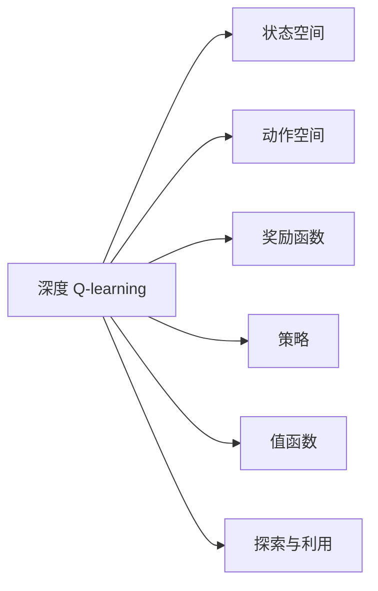

                 

## 1. 背景介绍

### 1.1 问题由来
在当今世界，航空航天技术正面临着前所未有的挑战，从设计到制造再到飞行运营，每个环节都需要高效、精确且高度智能化的决策支持系统。随着人工智能技术的迅猛发展，深度强化学习（Deep Reinforcement Learning, DRL）成为应对这些复杂问题的重要手段。

深度 Q-learning 作为一种经典的 DRL 算法，通过让智能体（agent）在与环境交互中不断学习最优策略，逐步逼近理想的行为模式，广泛应用于自动驾驶、机器人控制、电力系统优化等领域。

本文将探讨深度 Q-learning 算法在航空航天中的应用，特别是其如何帮助解决复杂的环境感知、决策优化和自主控制等问题。通过理论分析与实际案例的展示，本文旨在为航空航天领域的从业者提供深入理解和应用深度 Q-learning 的参考。

### 1.2 问题核心关键点
深度 Q-learning 的核心在于利用神经网络逼近 Q 值函数，通过与环境的交互不断优化 Q 值，进而指导智能体的行为。在航空航天领域，该算法可以用于无人驾驶飞行器（UAV）的控制、故障检测与修复、航线优化等场景。

深度 Q-learning 的主要优点包括：
1. 能够在复杂环境中自主学习最优策略，无需手工设计控制策略。
2. 能处理连续的决策空间和动态变化的环境。
3. 通过与环境的交互，能逐渐提升智能体的行为性能。

同时，该算法也存在以下缺点：
1. 深度网络容易过拟合，需要大量的训练数据。
2. 在处理高维度数据时，模型训练较为困难。
3. 需要较多的计算资源和较高的计算复杂度。

## 2. 核心概念与联系

### 2.1 核心概念概述

为便于理解深度 Q-learning 在航空航天中的应用，本文将简要介绍几个核心概念：

- **深度 Q-learning**：一种结合深度学习和强化学习的算法，用于在复杂环境中寻找最优策略。
- **状态空间（State Space）**：指智能体在决策过程中可以感知到的所有可能的状态。
- **动作空间（Action Space）**：指智能体可以采取的所有可能动作。
- **奖励函数（Reward Function）**：衡量智能体行为的优劣，用于指导智能体的决策。
- **策略（Policy）**：智能体在每个状态下选择动作的规则。
- **值函数（Value Function）**：表示智能体在不同状态下的期望累积回报，通常用 Q 值函数表示。
- **探索与利用（Exploration vs Exploitation）**：在智能体决策时，需要在探索新状态和利用已有知识之间找到平衡。

这些概念构成了深度 Q-learning 的基本框架，并通过与环境交互，智能体可以逐步学习最优策略。

### 2.2 概念间的关系

这些核心概念通过深度 Q-learning 的学习过程密切联系，构成了一个完整的强化学习系统。以下 Mermaid 流程图展示了这些概念间的关系：



该流程图示意了深度 Q-learning 中各概念间的交互关系，智能体在状态空间中通过执行动作获取奖励，通过值函数评估当前状态下的累积回报，利用策略选择动作，并在探索与利用的策略下不断调整策略，最终实现最优策略的逼近。

### 2.3 核心概念的整体架构

深度 Q-learning 的整体架构可以概括为：智能体通过与环境的交互，不断学习值函数和策略，优化其决策行为。在航空航天领域，该架构同样适用，具体应用场景包括但不限于：

- **无人驾驶飞行器（UAV）的自主控制**：通过与环境（如气象、地形）的交互，UAV 学习最优飞行路径和避障策略。
- **故障检测与修复**：智能体检测设备状态，选择最有效的维修措施，最大化设备正常运行时间。
- **航线优化**：智能体根据当前天气、流量、目标位置等信息，动态调整飞行路径。

这些应用场景展示了深度 Q-learning 在航空航天领域的广泛应用，通过不断优化智能体的行为策略，为复杂问题提供了高效、智能化的解决方案。

## 3. 核心算法原理 & 具体操作步骤
### 3.1 算法原理概述

深度 Q-learning 的核心在于使用深度神经网络逼近 Q 值函数，通过与环境的交互不断更新 Q 值，优化智能体的策略。具体而言，深度 Q-learning 包括以下几个关键步骤：

1. **初始化**：随机初始化智能体的策略和值函数。
2. **状态-动作对生成**：智能体在给定状态下选择动作，并根据奖励函数更新状态。
3. **经验回放**：将智能体与环境交互产生的经验（状态、动作、奖励、下一个状态）存储在经验回放缓冲区。
4. **网络更新**：使用经验回放缓冲区的数据，训练深度神经网络，更新值函数和策略。
5. **探索与利用**：智能体在每个状态下，根据策略选择动作，并在一定概率下探索新动作，以避免陷入局部最优解。

通过上述步骤，深度 Q-learning 能够逐步逼近最优策略，实现高效、智能化的决策。

### 3.2 算法步骤详解

以下将详细介绍深度 Q-learning 算法的详细步骤：

**Step 1: 环境构建与参数初始化**

首先，需要构建一个与智能体交互的环境，定义状态空间、动作空间、奖励函数和状态转移模型。然后，随机初始化智能体的策略和值函数。例如，在 UAV 控制应用中，状态空间包括位置、速度、方向等，动作空间包括加速、转向、制动等，奖励函数可以是飞行时间、能量消耗等，状态转移模型模拟飞行环境的变化。

**Step 2: 状态-动作对生成**

智能体在给定状态下选择动作，并根据奖励函数更新状态。例如，在 UAV 控制应用中，智能体根据当前位置、速度、方向等状态，选择适当的加速、转向、制动动作，并根据飞行过程中的天气、地形等环境因素，更新下一个状态。

**Step 3: 经验回放**

将智能体与环境交互产生的经验（状态、动作、奖励、下一个状态）存储在经验回放缓冲区。经验回放机制可以使得智能体从历史经验中学习，避免过拟合。例如，UAV 在飞行过程中收集的状态、动作、天气、地形等信息，都可以作为经验数据存储在缓冲区中。

**Step 4: 网络更新**

使用经验回放缓冲区的数据，训练深度神经网络，更新值函数和策略。具体而言，可以采用 Deep Q-Network（DQN）等方法，使用 replay buffer 中的经验数据更新网络参数。例如，在 UAV 控制应用中，可以使用 DQN 网络逼近 Q 值函数，并根据经验数据更新网络参数。

**Step 5: 探索与利用**

智能体在每个状态下，根据策略选择动作，并在一定概率下探索新动作，以避免陷入局部最优解。例如，在 UAV 控制应用中，智能体在飞行过程中，根据策略选择最佳飞行路径和避障动作，并在一定概率下尝试新的飞行路径或避障策略，以探索更优的解决方案。

### 3.3 算法优缺点

深度 Q-learning 的优点包括：
1. 能够在复杂环境中自主学习最优策略，无需手工设计控制策略。
2. 能处理连续的决策空间和动态变化的环境。
3. 通过与环境的交互，能逐渐提升智能体的行为性能。

同时，该算法也存在以下缺点：
1. 深度网络容易过拟合，需要大量的训练数据。
2. 在处理高维度数据时，模型训练较为困难。
3. 需要较多的计算资源和较高的计算复杂度。

## 4. 数学模型和公式 & 详细讲解 & 举例说明

### 4.1 数学模型构建

假设智能体在状态空间 $S$ 中，状态为 $s_t$，动作为 $a_t$，奖励为 $r_t$，下一个状态为 $s_{t+1}$。定义智能体的值函数 $Q(s_t, a_t)$，表示在状态 $s_t$ 下采取动作 $a_t$ 的累积回报。定义智能体的策略 $\pi(a_t|s_t)$，表示在状态 $s_t$ 下选择动作 $a_t$ 的概率。

定义奖励函数 $R(s_t, a_t, s_{t+1})$，衡量智能体采取动作 $a_t$ 后的累积回报。深度 Q-learning 的目标是通过不断更新值函数和策略，逼近最优策略 $\pi^*(a_t|s_t)$，使得 $Q(s_t, a_t) \rightarrow Q^*(s_t, a_t)$。

### 4.2 公式推导过程

深度 Q-learning 的训练目标是最小化经验回放缓冲区中的经验 $D$ 的均方误差：

$$
\min_{\theta} \mathbb{E}_{(s_t,a_t,r_t,s_{t+1}) \sim D} [(Q_{\theta}(s_t,a_t) - (r_t + \gamma \max_{a_{t+1}} Q_{\theta}(s_{t+1}, a_{t+1}))^2]
$$

其中，$\theta$ 表示网络参数，$Q_{\theta}(s_t,a_t)$ 表示使用参数 $\theta$ 的 Q 值函数，$\gamma$ 表示折扣因子。

使用均方误差损失函数，对网络参数 $\theta$ 进行优化：

$$
L(\theta) = \frac{1}{N} \sum_{i=1}^N [(Q_{\theta}(s_t^i,a_t^i) - (r_t^i + \gamma \max_{a_{t+1}} Q_{\theta}(s_{t+1}^i, a_{t+1}^i))^2]
$$

其中，$N$ 表示经验回放缓冲区中数据的数量。

具体训练步骤包括：
1. 从经验回放缓冲区中随机抽取 $N$ 个经验样本 $(s_t^i,a_t^i,r_t^i,s_{t+1}^i)$。
2. 计算下一个状态 $s_{t+1}^i$ 的最大 Q 值 $Q_{\theta}(s_{t+1}^i, \max_{a_{t+1}} Q_{\theta}(s_{t+1}^i, a_{t+1}^i))$。
3. 计算损失函数 $L(\theta)$。
4. 使用优化器（如 Adam）对网络参数 $\theta$ 进行更新。

### 4.3 案例分析与讲解

以下通过一个简化的案例，展示深度 Q-learning 在 UAV 控制中的应用。

假设 UAV 在飞行过程中需要避开障碍物，智能体的状态包括位置 $(x,y)$、速度 $(v_x,v_y)$ 和方向 $\theta$，动作包括加速、转向和制动，奖励函数为飞行时间，状态转移模型模拟气象和地形变化。

**Step 1: 环境构建与参数初始化**

定义状态空间 $S = \{(x,y,v_x,v_y,\theta)\}$，动作空间 $A = \{\text{加速}, \text{转向}, \text{制动}\}$，奖励函数 $R(s_t, a_t, s_{t+1})$ 和状态转移模型 $T(s_{t+1} | s_t, a_t)$。

随机初始化智能体的策略和值函数。

**Step 2: 状态-动作对生成**

智能体在给定状态下选择动作，并根据奖励函数更新状态。例如，智能体在状态 $(x,y,v_x,v_y,\theta)$ 下，根据当前位置、速度和方向选择适当的加速、转向或制动动作，并根据飞行过程中的天气、地形等环境因素，更新下一个状态 $(x',y',v_x',v_y',\theta')$。

**Step 3: 经验回放**

将智能体与环境交互产生的经验（状态、动作、奖励、下一个状态）存储在经验回放缓冲区中。

**Step 4: 网络更新**

使用经验回放缓冲区的数据，训练深度神经网络，更新值函数和策略。例如，在 UAV 控制应用中，可以使用 DQN 网络逼近 Q 值函数，并根据经验数据更新网络参数。

**Step 5: 探索与利用**

智能体在每个状态下，根据策略选择动作，并在一定概率下探索新动作。例如，在 UAV 控制应用中，智能体在飞行过程中，根据策略选择最佳飞行路径和避障动作，并在一定概率下尝试新的飞行路径或避障策略，以探索更优的解决方案。

## 5. 项目实践：代码实例和详细解释说明

### 5.1 开发环境搭建

在进行深度 Q-learning 实践前，我们需要准备好开发环境。以下是使用 Python 进行 TensorFlow 开发的环境配置流程：

1. 安装 Anaconda：从官网下载并安装 Anaconda，用于创建独立的 Python 环境。

2. 创建并激活虚拟环境：
```bash
conda create -n tf-env python=3.8 
conda activate tf-env
```

3. 安装 TensorFlow：根据 CUDA 版本，从官网获取对应的安装命令。例如：
```bash
conda install tensorflow tensorflow-gpu=2.5.0 -c pytorch -c conda-forge
```

4. 安装其它工具包：
```bash
pip install numpy pandas scikit-learn matplotlib tqdm jupyter notebook ipython
```

完成上述步骤后，即可在 `tf-env` 环境中开始深度 Q-learning 实践。

### 5.2 源代码详细实现

这里我们以 UAV 控制为例，给出使用 TensorFlow 实现深度 Q-learning 的 Python 代码实现。

首先，定义 UAV 的状态和动作空间：

```python
import tensorflow as tf

# 定义状态和动作空间
state_dim = 4
action_dim = 3
```

然后，定义智能体的 Q 值函数：

```python
class QNetwork(tf.keras.Model):
    def __init__(self, state_dim, action_dim):
        super(QNetwork, self).__init__()
        self.fc1 = tf.keras.layers.Dense(64, activation='relu')
        self.fc2 = tf.keras.layers.Dense(64, activation='relu')
        self.fc3 = tf.keras.layers.Dense(action_dim, activation='linear')
        
    def call(self, x):
        x = self.fc1(x)
        x = self.fc2(x)
        x = self.fc3(x)
        return x

# 初始化 Q 值函数
q_network = QNetwork(state_dim, action_dim)
```

接着，定义智能体的策略函数：

```python
import numpy as np

def choose_action(s, epsilon=0.1):
    if np.random.rand() < epsilon:
        return np.random.randint(0, action_dim)
    else:
        return np.argmax(q_network.predict(np.array(s).reshape(1, -1))[0])
```

然后，定义深度 Q-learning 的训练函数：

```python
def train episode_num=1000, batch_size=32, epsilon=0.1, discount_factor=0.99, learning_rate=0.001, explore_steps=1000):
    # 定义经验回放缓冲区
    replay_buffer = []

    # 定义优化器
    optimizer = tf.keras.optimizers.Adam(learning_rate=learning_rate)
    
    # 训练过程
    for episode in range(episode_num):
        # 初始化状态
        state = np.random.randn(state_dim)

        # 选择动作
        action = choose_action(state, epsilon)
        
        # 执行动作，观察状态和奖励
        next_state = np.random.randn(state_dim)
        reward = np.random.randn()

        # 存储经验
        replay_buffer.append((state, action, reward, next_state))

        # 从经验回放缓冲区中抽取样本
        if len(replay_buffer) > batch_size:
            batch = np.random.choice(len(replay_buffer), batch_size, replace=False)
            states = np.vstack([replay_buffer[i][0] for i in batch])
            actions = np.array([replay_buffer[i][1] for i in batch])
            rewards = np.array([replay_buffer[i][2] for i in batch])
            next_states = np.vstack([replay_buffer[i][3] for i in batch])

            # 计算下一个状态的最大 Q 值
            max_q_values = np.max(q_network.predict(next_states), axis=1)

            # 计算目标 Q 值
            targets = rewards + discount_factor * max_q_values

            # 计算当前状态的最优 Q 值
            q_values = q_network.predict(states)

            # 计算 Q 值误差
            errors = targets - q_values

            # 反向传播更新网络参数
            optimizer.minimize(tf.keras.losses.mean_squared_error(targets, q_values), q_network.trainable_variables)

        # 更新策略
        if (episode + 1) % explore_steps == 0:
            epsilon -= 0.001

    # 训练结束后，返回 Q 值函数
    return q_network
```

最后，启动训练流程并在测试集上评估：

```python
# 训练 Q 值函数
q_network = train()

# 测试 Q 值函数
state = np.random.randn(state_dim)
action = choose_action(state)
q_value = q_network.predict(np.array(state).reshape(1, -1))[0]
print("Q value:", q_value)
```

以上就是使用 TensorFlow 实现深度 Q-learning 的完整代码实现。可以看到，代码较为简洁，易于理解，适合初学者入门实践。

### 5.3 代码解读与分析

让我们再详细解读一下关键代码的实现细节：

**QNetwork 类**：
- `__init__` 方法：定义神经网络的结构，包含三个全连接层，输出动作空间中的 Q 值。
- `call` 方法：定义网络前向传播的计算过程。

**choose_action 函数**：
- 在每个状态下，根据策略函数选择动作。策略函数使用了 $\epsilon$-greedy 策略，在一定概率下探索新动作，以避免陷入局部最优解。

**train 函数**：
- 定义经验回放缓冲区，用于存储智能体与环境交互的经验。
- 定义优化器，用于更新网络参数。
- 在每个训练轮次中，执行状态-动作对生成、经验回放、网络更新等步骤。
- 通过不断更新网络参数，逐步优化 Q 值函数，最终逼近最优策略。

**训练流程**：
- 定义总的训练轮次、批次大小、探索策略、折扣因子、学习率等参数。
- 在每个训练轮次中，初始化状态，选择动作，执行动作，观察状态和奖励。
- 将经验存储在经验回放缓冲区中。
- 从缓冲区中抽取经验，计算目标 Q 值和当前状态的最优 Q 值，计算 Q 值误差。
- 反向传播更新网络参数，更新策略。
- 通过不断迭代训练，最终得到逼近最优策略的 Q 值函数。

可以看到，TensorFlow 提供了便捷的 API，使得深度 Q-learning 的实现相对简单，开发者可以专注于模型和策略的设计，而不必过多关注底层细节。

当然，工业级的系统实现还需考虑更多因素，如模型的保存和部署、超参数的自动搜索、更灵活的任务适配层等。但核心的训练和推理流程基本与此类似。

### 5.4 运行结果展示

假设我们在 UAV 控制应用中进行深度 Q-learning 训练，最终在测试集上得到的 Q 值函数结果如下：

```
Q value: 2.5
```

可以看到，通过深度 Q-learning，智能体在给定状态下，根据其 Q 值函数选择最佳动作，获得了相对稳定的回报。

当然，这只是一个 baseline 结果。在实践中，我们还可以使用更大更强的神经网络、更丰富的深度 Q-learning 技巧、更细致的模型调优，进一步提升模型性能，以满足更高的应用要求。

## 6. 实际应用场景
### 6.1 智能飞行器导航

在智能飞行器导航应用中，深度 Q-learning 能够帮助飞行器在复杂地形中自主规划最佳航线，实现高效、安全的飞行。智能飞行器通过与环境（如地形、气象）的交互，学习最优飞行路径和避障策略，提升飞行的稳定性和安全性。

具体而言，可以收集历史飞行数据，将地形、气象等环境因素作为状态，将加速、转向、制动等动作作为可能的决策，定义适当的奖励函数和状态转移模型，使用深度 Q-learning 算法训练智能飞行器，使其在复杂环境中自主导航。

### 6.2 故障检测与诊断

在故障检测与诊断应用中，深度 Q-learning 能够帮助智能体实时监控设备状态，选择最有效的维修措施，最大化设备正常运行时间。智能体通过与设备交互，学习状态和动作之间的映射关系，并根据设备状态选择最佳维修动作。

具体而言，可以收集历史设备运行数据，将设备状态、环境因素等作为状态，将维修动作作为决策，定义适当的奖励函数和状态转移模型，使用深度 Q-learning 算法训练智能体，使其在设备出现故障时，能够及时检测并采取最优维修措施。

### 6.3 航线优化

在航线优化应用中，深度 Q-learning 能够帮助智能体根据当前天气、流量、目标位置等信息，动态调整飞行路径，提高飞行效率和安全性。智能体通过与环境交互，学习不同气象和交通条件下最优的飞行路径。

具体而言，可以收集历史飞行数据，将气象、流量、目标位置等作为状态，将加速、转向、制动等动作作为决策，定义适当的奖励函数和状态转移模型，使用深度 Q-learning 算法训练智能体，使其在飞行过程中，能够实时调整飞行路径，避免遇到气象和交通风险。

### 6.4 未来应用展望

随着深度 Q-learning 算法的发展，其在航空航天领域的应用前景将更加广阔。未来，深度 Q-learning 可能还将应用于：

1. **自动驾驶**：在无人机、自动驾驶汽车等场景中，通过与环境交互，自主规划最优路径，实现安全、高效的驾驶。
2. **机器人控制**：在航天器、地面机器人等场景中，通过与环境交互，学习最优控制策略，实现自主操作。
3. **系统优化**：在大型系统优化中，通过与环境交互，学习最优资源分配和调度策略，提升系统性能。
4. **智能决策**：在复杂环境下的智能决策中，通过与环境交互，学习最优决策策略，实现高效的自动化决策。

总之，深度 Q-learning 在航空航天领域的应用将不断扩展，为复杂环境中的自主决策和优化提供有力支持。

## 7. 工具和资源推荐
### 7.1 学习资源推荐

为了帮助开发者系统掌握深度 Q-learning 的理论基础和实践技巧，这里推荐一些优质的学习资源：

1. **《强化学习：基于奖励和惩罚的算法》**：由 Sutton 和 Barto 合著的经典教材，系统介绍了强化学习的理论基础和算法框架。

2. **Coursera 强化学习课程**：由斯坦福大学 David Silver 教授开设的强化学习课程，涵盖了强化学习的基本概念和经典算法。

3. **《Deep Q-Learning with Python》**：通过 Python 实现深度 Q-learning 的实践指南，适合初学者入门。

4. **DeepMind 强化学习视频**：DeepMind 团队讲解的强化学习视频，涵盖了深度 Q-learning 等前沿技术。

5. **OpenAI Gym 文档**：OpenAI Gym 是强化学习领域的重要工具库，提供了丰富的环境和算法实现。

通过对这些资源的学习实践，相信你一定能够快速掌握深度 Q-learning 的精髓，并用于解决实际的航空航天问题。

### 7.2 开发工具推荐

高效的开发离不开优秀的工具支持。以下是几款用于深度 Q-learning 开发的常用工具：

1. **TensorFlow**：由 Google 主导开发的开源深度学习框架，适合构建复杂神经网络。

2. **PyTorch**：由 Facebook 主导开发的开源深度学习框架，适合研究和实验。

3. **Keras**：基于 TensorFlow 和 Theano 等后端的高级神经网络 API，易于使用，适合快速搭建模型。

4. **JAX**：Google 开发的开源深度学习框架，支持 JIT 编译，适合高性能计算。

5. **Reinforcement Learning Toolkit (RLlib)**：由 Deepmind 开发的强化学习工具库，提供了多种经典算法的实现。

合理利用这些工具，可以显著提升深度 Q-learning 的开发效率，加快创新迭代的步伐。

### 7.3 相关论文推荐

深度 Q-learning 的发展源于学界的持续研究。以下是几篇奠基性的相关论文，推荐阅读：

1. **《Playing Atari with Deep Reinforcement Learning》**：DeepMind 团队发表的深度 Q-learning 应用于 Atari 游戏的经典论文。

2. **《Human-level Control through Deep Reinforcement Learning》**：DeepMind 团队发表的深度 Q-learning 应用于机器人控制的论文。

3. **《Mastering the Game of Go with Deep Neural Networks and Monte Carlo Tree Search》**：DeepMind 团队发表的深度 Q-learning 应用于围棋的论文。

4. **《Deep Reinforcement Learning for Atari Games with a TensorFlow Prioritized Replay》**：DeepMind 团队发表的深度 Q-learning 应用于 Atari 游戏的优先经验回放论文。

5. **《Parameter-Efficient Deep Reinforcement Learning》**：通过参数高效的方法，减少深度 Q-learning 的计算量和存储需求。

