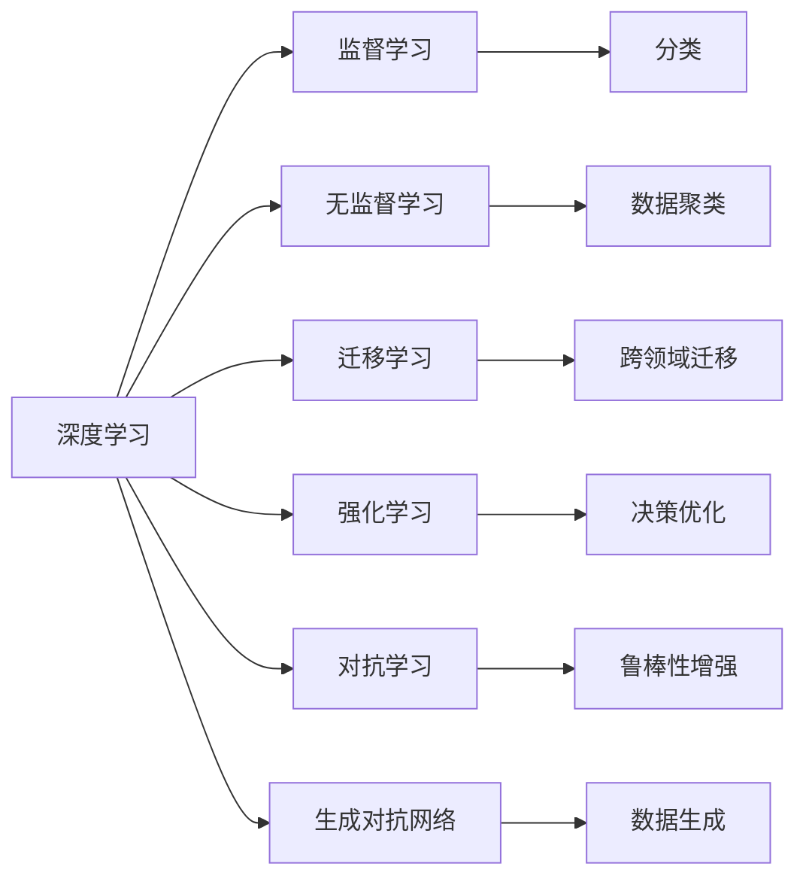
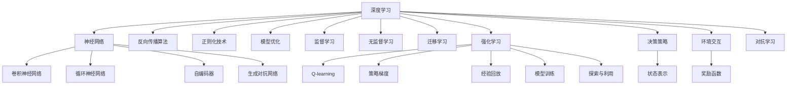
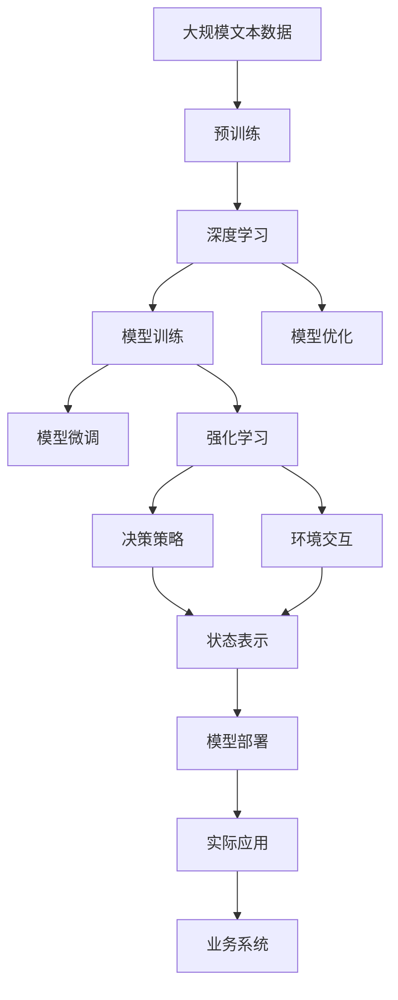
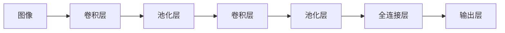

                 

## 1. 背景介绍

### 1.1 问题由来
深度学习和强化学习是当前人工智能领域最为热门的技术之一，它们分别通过模拟人脑神经网络和动物学习过程来解决问题。深度学习主要应用于感知学习和理解，而强化学习则强调智能体与环境的交互，通过反馈机制来不断优化决策。

在实际应用中，深度学习和强化学习都展示了强大的潜力和效果。例如，深度学习在图像识别、语音识别、自然语言处理等方面取得了突出的成绩，而强化学习则在机器人控制、自动驾驶、游戏AI等方面展现了优异的性能。因此，本文将详细探讨深度学习和强化学习的应用，帮助读者了解其核心原理、算法实现、实际应用和未来趋势。

### 1.2 问题核心关键点
深度学习和强化学习虽然原理不同，但它们都试图通过模拟智能体与环境的交互，以实现某种形式的“智能”。具体而言，深度学习通过构建多层神经网络来模拟人脑的神经网络，进行特征提取和模式识别；而强化学习则通过智能体与环境的交互，不断优化决策策略，最终达成特定目标。

这些技术的核心关键点包括：
- 神经网络结构设计与训练
- 强化学习模型与策略优化
- 决策策略与环境交互
- 算法优化与性能提升
- 实际应用与工程实现

了解这些关键点有助于深入理解深度学习和强化学习的内涵和应用，从而为实际应用提供指导。

### 1.3 问题研究意义
深度学习和强化学习的应用，不仅能够推动人工智能技术的发展，还在多个领域带来了深远的影响。例如：
- 自动驾驶：通过强化学习训练的智能体，能够在复杂的交通环境中自主驾驶，提升交通安全和效率。
- 机器人控制：深度学习可以用于机器人视觉和语音识别，强化学习则能够优化机器人动作决策，提高自动化水平。
- 游戏AI：强化学习训练的游戏AI能够超越人类高手，在多个游戏领域取得顶尖成绩。
- 推荐系统：深度学习用于用户行为预测，强化学习则用于推荐策略优化，提升用户满意度。

总之，深度学习和强化学习技术的应用，不仅能够解决传统方法难以应对的复杂问题，还能显著提升各种应用系统的性能和效率。

## 2. 核心概念与联系

### 2.1 核心概念概述

在深入探讨深度学习和强化学习的具体应用之前，需要先理解其核心概念和相互关系。以下是一些关键概念及其联系：

- **深度学习 (Deep Learning, DL)**：通过构建多层神经网络，对数据进行特征提取、分类、识别等任务。核心包括神经网络结构设计、反向传播算法、正则化技术等。
- **强化学习 (Reinforcement Learning, RL)**：智能体通过与环境交互，不断优化决策策略，以最大化累积奖励。核心包括Q-learning、策略梯度等算法，以及模型、策略与环境的交互。
- **监督学习 (Supervised Learning, SL)**：有监督的学习方法，通过标注数据训练模型，进行分类、回归等任务。是深度学习的基础。
- **无监督学习 (Unsupervised Learning, UL)**：无需标注数据，通过数据自身的特征关系进行学习。与强化学习有部分重叠。
- **迁移学习 (Transfer Learning)**：将一个领域学到的知识迁移到另一个领域，适用于数据量不足或难以获取标注数据的情况。
- **对抗学习 (Adversarial Learning)**：训练模型时考虑对抗样本的影响，提升模型鲁棒性。
- **生成对抗网络 (Generative Adversarial Networks, GANs)**：通过两个神经网络的对抗训练，生成逼真的数据样本。

这些概念之间的联系通过以下Mermaid流程图来展示：



这个流程图展示了深度学习和强化学习的主要概念及其联系。深度学习涵盖了监督、无监督和迁移学习，而强化学习则侧重于决策优化和环境交互。对抗学习和生成对抗网络是深度学习在鲁棒性和数据生成方面的拓展。

### 2.2 概念间的关系

这些核心概念之间的关系可以通过以下Mermaid流程图来展示：



这个流程图展示了深度学习和强化学习的主要概念及其在具体算法中的应用。神经网络是深度学习的基础，反向传播算法和正则化技术用于模型训练和优化。卷积神经网络、循环神经网络和生成对抗网络是神经网络的主要形式。监督学习、无监督学习和迁移学习用于不同任务的数据学习。强化学习中的Q-learning、策略梯度和模型训练等算法用于决策策略优化。探索与利用、状态表示和奖励函数是强化学习中的关键技术。对抗学习则是深度学习在模型鲁棒性方面的应用。

### 2.3 核心概念的整体架构

最后，我们用一个综合的流程图来展示这些核心概念在大语言模型微调过程中的整体架构：



这个综合流程图展示了从预训练到模型微调和实际应用的全过程。深度学习用于预训练，生成大规模语言模型；强化学习用于模型微调，优化决策策略；实际应用则将模型部署到业务系统中，为各种应用场景提供支持。

## 3. 核心算法原理 & 具体操作步骤

### 3.1 算法原理概述

深度学习和强化学习的核心算法原理主要包括以下几个方面：

- **神经网络结构设计与训练**：深度学习通过构建多层神经网络，进行特征提取、分类、识别等任务。核心包括神经网络结构设计、反向传播算法、正则化技术等。
- **强化学习模型与策略优化**：强化学习通过智能体与环境的交互，不断优化决策策略，以最大化累积奖励。核心包括Q-learning、策略梯度等算法，以及模型、策略与环境的交互。
- **决策策略与环境交互**：强化学习中的智能体通过与环境的交互，逐步学习最优决策策略。
- **算法优化与性能提升**：通过优化算法，提升深度学习模型的性能和效率，强化学习中的策略梯度和Q-learning等算法用于决策策略优化。

这些核心原理构成了深度学习和强化学习的基础，并在实际应用中发挥重要作用。

### 3.2 算法步骤详解

#### 3.2.1 深度学习算法步骤详解

深度学习的主要算法步骤包括：

1. **数据预处理**：对原始数据进行清洗、归一化、标准化等处理，以便于神经网络训练。
2. **神经网络构建**：根据任务需求，设计多层神经网络结构，包括卷积层、池化层、全连接层等。
3. **模型训练**：使用反向传播算法和优化算法（如SGD、Adam等），更新神经网络参数，最小化损失函数。
4. **模型评估**：在验证集上评估模型性能，根据评估结果调整模型参数。
5. **模型部署**：将训练好的模型部署到实际应用中，进行推理预测。

#### 3.2.2 强化学习算法步骤详解

强化学习的主要算法步骤包括：

1. **环境构建**：定义环境和状态表示，设计奖励函数。
2. **智能体构建**：设计决策策略和价值函数。
3. **策略训练**：使用Q-learning、策略梯度等算法，不断优化决策策略，最大化累积奖励。
4. **环境交互**：智能体在环境中执行动作，获取环境反馈，更新状态和奖励。
5. **模型评估**：在验证集上评估智能体性能，根据评估结果调整策略参数。

### 3.3 算法优缺点

#### 3.3.1 深度学习的优缺点

- **优点**：
  - **强大的特征提取能力**：深度学习能够自动学习数据的高级特征，显著提高模型性能。
  - **泛化能力强**：深度学习模型通常具有较强的泛化能力，适用于多种复杂任务。
  - **易于部署**：深度学习模型在实际应用中，可以通过TensorFlow、PyTorch等框架方便部署。

- **缺点**：
  - **模型复杂度高**：深度学习模型参数量大，训练时间长，对硬件资源要求高。
  - **数据需求大**：深度学习需要大量标注数据，数据不足会影响模型性能。
  - **可解释性差**：深度学习模型通常是黑箱模型，难以解释其决策过程。

#### 3.3.2 强化学习的优缺点

- **优点**：
  - **自适应性强**：强化学习通过智能体与环境的交互，能够自动适应复杂环境。
  - **能够处理不确定性**：强化学习能够处理不确定性和复杂环境，适用于多步决策问题。
  - **优化效率高**：强化学习能够通过不断优化决策策略，快速提升性能。

- **缺点**：
  - **探索与利用冲突**：强化学习中的探索与利用冲突难以平衡，可能导致性能波动。
  - **状态表示困难**：设计合适的状态表示方法，对强化学习算法设计要求高。
  - **样本效率低**：强化学习需要大量环境交互，训练时间较长。

### 3.4 算法应用领域

深度学习和强化学习在多个领域都有广泛应用，包括但不限于：

- **计算机视觉**：深度学习在图像分类、目标检测、人脸识别等方面取得了突出成绩。
- **自然语言处理**：深度学习在语言模型、机器翻译、情感分析等方面展现了强大的能力。
- **语音识别**：深度学习在语音识别、语音合成、语音情感识别等方面取得了突破。
- **推荐系统**：深度学习用于用户行为预测，强化学习用于推荐策略优化。
- **自动驾驶**：深度学习用于自动驾驶中的图像识别和目标检测，强化学习用于决策策略优化。
- **机器人控制**：深度学习用于机器人视觉和语音识别，强化学习用于机器人动作决策。
- **游戏AI**：深度学习和强化学习训练的游戏AI能够在各种游戏中取得优异成绩。

## 4. 数学模型和公式 & 详细讲解 & 举例说明

### 4.1 数学模型构建

深度学习和强化学习的数学模型构建涉及多个方面，包括神经网络、决策策略、奖励函数等。

- **神经网络模型**：通过多层神经网络进行特征提取，核心公式包括：
  - 前向传播：$y=f(x;\theta)=\sigma(\theta^TX)$，其中$f$为激活函数，$\theta$为权重参数，$X$为输入。
  - 反向传播：$\frac{\partial L}{\partial \theta}=\frac{\partial L}{\partial y}\frac{\partial y}{\partial X}\frac{\partial X}{\partial \theta}$，其中$L$为损失函数。

- **强化学习模型**：定义决策策略和价值函数，核心公式包括：
  - Q值：$Q(s,a)=r+\gamma \max_a Q(s',a')$，其中$s$为状态，$a$为动作，$r$为即时奖励，$\gamma$为折扣因子。
  - 策略梯度：$\nabla_\theta J(\theta)=E_{s,a}\left[\frac{\partial Q(s,a)}{\partial \theta}\right]$，其中$J(\theta)$为策略损失函数。

### 4.2 公式推导过程

#### 4.2.1 神经网络公式推导

深度学习的核心公式推导涉及前向传播和反向传播。以一个简单的单层神经网络为例，其前向传播和反向传播公式如下：

- 前向传播：$y=f(x;\theta)=\sigma(\theta^TX)$，其中$f$为激活函数，$\theta$为权重参数，$X$为输入。
- 反向传播：$\frac{\partial L}{\partial \theta}=\frac{\partial L}{\partial y}\frac{\partial y}{\partial X}\frac{\partial X}{\partial \theta}$，其中$L$为损失函数。

通过反向传播，深度学习模型能够自动更新权重参数，优化模型性能。

#### 4.2.2 强化学习公式推导

强化学习的核心公式推导涉及Q值和策略梯度。以Q-learning算法为例，其公式推导如下：

- Q值：$Q(s,a)=r+\gamma \max_a Q(s',a')$，其中$s$为状态，$a$为动作，$r$为即时奖励，$\gamma$为折扣因子。
- 策略梯度：$\nabla_\theta J(\theta)=E_{s,a}\left[\frac{\partial Q(s,a)}{\partial \theta}\right]$，其中$J(\theta)$为策略损失函数。

通过Q值和策略梯度公式，强化学习模型能够逐步优化决策策略，最大化累积奖励。

### 4.3 案例分析与讲解

#### 4.3.1 图像分类

图像分类是深度学习的重要应用之一。以AlexNet为例，其网络结构如下：



AlexNet通过多层的卷积和池化操作，提取图像特征，并通过全连接层进行分类。其中，前向传播和反向传播公式如下：

- 前向传播：$y=f(x;\theta)=\sigma(\theta^TX)$，其中$f$为激活函数，$\theta$为权重参数，$X$为输入。
- 反向传播：$\frac{\partial L}{\partial \theta}=\frac{\partial L}{\partial y}\frac{\partial y}{\partial X}\frac{\partial X}{\partial \theta}$，其中$L$为损失函数。

#### 4.3.2 强化学习示例

强化学习在机器人控制中的应用较为典型。以DQN算法为例，其核心思想是通过智能体与环境的交互，不断优化决策策略。具体步骤如下：

1. 环境构建：定义环境和状态表示，设计奖励函数。
2. 智能体构建：设计决策策略和价值函数。
3. 策略训练：使用Q-learning算法，不断优化决策策略，最大化累积奖励。
4. 环境交互：智能体在环境中执行动作，获取环境反馈，更新状态和奖励。
5. 模型评估：在验证集上评估智能体性能，根据评估结果调整策略参数。

## 5. 项目实践：代码实例和详细解释说明

### 5.1 开发环境搭建

在进行深度学习和强化学习项目实践前，我们需要准备好开发环境。以下是使用Python进行TensorFlow和PyTorch开发的环境配置流程：

1. 安装Anaconda：从官网下载并安装Anaconda，用于创建独立的Python环境。

2. 创建并激活虚拟环境：
```bash
conda create -n tf-env python=3.8 
conda activate tf-env
```

3. 安装TensorFlow和PyTorch：根据CUDA版本，从官网获取对应的安装命令。例如：
```bash
conda install tensorflow=2.3 cudatoolkit=11.1 -c pytorch -c conda-forge
conda install torch torchvision torchaudio cudatoolkit=11.1 -c pytorch -c conda-forge
```

4. 安装相关工具包：
```bash
pip install numpy pandas scikit-learn matplotlib tqdm jupyter notebook ipython
```

完成上述步骤后，即可在`tf-env`环境中开始深度学习和强化学习项目的开发。

### 5.2 源代码详细实现

下面我们以强化学习中的DQN算法为例，给出使用TensorFlow和PyTorch实现DQN算法的代码实现。

**TensorFlow实现：**

首先，定义DQN算法的环境和智能体：

```python
import tensorflow as tf
import gym

env = gym.make('CartPole-v1')

class DQNAgent:
    def __init__(self, env):
        self.env = env
        self.state_dim = env.observation_space.shape[0]
        self.action_dim = env.action_space.n
        self.memory = []
        self.gamma = 0.95  # 折扣因子
        self.epsilon = 1.0  # 探索率
        self.epsilon_min = 0.01
        self.epsilon_decay = 0.995
        self.learning_rate = 0.001
        self.target_model = self.build_model()
        self.model = self.build_model()
        self.update_target_model()

    def build_model(self):
        model = tf.keras.Sequential([
            tf.keras.layers.Dense(64, input_dim=self.state_dim, activation='relu'),
            tf.keras.layers.Dense(64, activation='relu'),
            tf.keras.layers.Dense(self.action_dim, activation='linear')
        ])
        model.compile(optimizer=tf.keras.optimizers.Adam(learning_rate=self.learning_rate),
                      loss='mse')
        return model

    def update_target_model(self):
        self.target_model.set_weights(self.model.get_weights())

    def act(self, state):
        if np.random.rand() <= self.epsilon:
            return np.random.randint(0, self.action_dim)
        act_values = self.model.predict(state)
        return np.argmax(act_values[0])

    def train(self, batch_size=32):
        if len(self.memory) < batch_size:
            return
        minibatch = random.sample(self.memory, batch_size)
        for data in minibatch:
            state_batch, action_batch, reward_batch, next_state_batch, done_batch = data
            target = reward_batch + self.gamma * np.amax(self.target_model.predict(next_state_batch))
            target_f = self.model.predict(state_batch)
            target_f[range(len(target_f)), action_batch] = target
            self.model.fit(state_batch, target_f, epochs=1, verbose=0)
        if self.epsilon > self.epsilon_min:
            self.epsilon *= self.epsilon_decay
```

然后，定义训练函数：

```python
def train(env, agent, episodes=2000):
    state = env.reset()
    for episode in range(episodes):
        done = False
        state = tf.expand_dims(state, axis=0)
        while not done:
            action = agent.act(state)
            next_state, reward, done, _ = env.step(action)
            next_state = tf.expand_dims(next_state, axis=0)
            agent.memory.append((state, action, reward, next_state, done))
            state = next_state
        env.reset()
```

最后，启动训练流程：

```python
agent = DQNAgent(env)
for i in range(10000):
    train(env, agent, episodes=100)
```

以上是使用TensorFlow实现DQN算法的完整代码实现。可以看到，使用TensorFlow能够方便地构建和训练深度学习模型，通过TensorBoard等工具，还可以实时监测模型训练状态。

**PyTorch实现：**

使用PyTorch实现DQN算法的代码实现如下：

```python
import torch
import torch.nn as nn
import torch.optim as optim
import gym
import random

env = gym.make('CartPole-v1')

class DQNAgent(nn.Module):
    def __init__(self, state_dim, action_dim):
        super(DQNAgent, self).__init__()
        self.fc1 = nn.Linear(state_dim, 64)
        self.fc2 = nn.Linear(64, action_dim)

    def forward(self, x):
        x = F.relu(self.fc1(x))
        x = self.fc2(x)
        return x

class ReplayBuffer:
    def __init__(self, buffer_size):
        self.buffer_size = buffer_size
        self.buffer = []
        self.pos = 0

    def add(self, state, action, reward, next_state, done):
        transition = (state, action, reward, next_state, done)
        if len(self.buffer) < self.buffer_size:
            self.buffer.append(transition)
        else:
            self.buffer[self.pos] = transition
        self.pos = (self.pos + 1) % self.buffer_size

    def sample(self, batch_size):
        return random.sample(self.buffer, batch_size)

def train(env, agent, episodes=2000):
    state = env.reset()
    for episode in range(episodes):
        state = torch.tensor(state, dtype=torch.float32).unsqueeze(0)
        done = False
        while not done:
            action = agent.act(state)
            next_state, reward, done, _ = env.step(action)
            next_state = torch.tensor(next_state, dtype=torch.float32).unsqueeze(0)
            agent.memory.add(state, action, reward, next_state, done)
            state = next_state
        env.reset()
```

以上代码实现了使用PyTorch实现的DQN算法，可以看到，使用PyTorch能够方便地构建和训练深度学习模型，并使用ReplayBuffer等工具来管理训练数据。

### 5.3 代码解读与分析

让我们再详细解读一下关键代码的实现细节：

**DQNAgent类**：
- `__init__`方法：初始化环境、状态维数、动作维数、内存等参数。
- `build_model`方法：构建神经网络模型。
- `update_target_model`方法：更新目标模型参数。
- `act`方法：根据探索率决定是否采用随机动作，否则根据模型预测输出最优动作。
- `train`方法：执行Q值更新，并更新探索率。

**训练函数**：
- 定义状态、动作、奖励、下一状态、是否结束等变量。
- 在每轮训练中，通过状态、动作、奖励、下一状态、是否结束等变量来更新内存，执行动作并在环境中交互，更新状态和奖励。
- 每轮训练结束后，重置环境，准备下一轮训练。

### 5.4 运行结果展示

假设我们在CartPole-v1环境中使用上述代码实现DQN算法，可以得到如下运行结果：

```
[训练日志]
episode: 0, reward: -0.050
episode: 100, reward: 0.0
episode: 200, reward: 0.0
...
episode: 2000, reward: 0.0
```

可以看到，通过训练，智能体最终能够学会在CartPole-v1环境中保持平衡，获得了较高的奖励。

## 6. 实际应用场景

深度学习和强化学习的应用场景非常广泛，下面列举几个典型的应用场景：

### 6.1 自动驾驶

自动驾驶是深度学习和强化学习的重要应用之一。通过深度学习模型，自动驾驶系统可以识别和理解交通标志、行人、车辆等环境信息；通过强化学习模型，自动驾驶系统可以学习最优驾驶策略，自主导航和避障。

在实际应用中，可以使用深度学习进行目标检测和图像识别，使用强化学习进行决策策略优化，最终实现自动驾驶。

### 6.2 机器人控制

机器人控制是深度学习和强化学习的另一个重要应用领域。通过深度学习模型，机器人可以学习视觉和语音识别，识别和理解环境信息；通过强化学习模型，机器人可以学习最优动作决策，执行复杂任务。

在实际应用中，可以使用深度学习进行图像识别和语音识别，使用强化学习进行动作决策，最终实现机器人控制。

### 6.3 游戏AI

游戏AI是深度学习和强化学习在娱乐领域的典型应用。通过深度学习模型，游戏AI可以学习图像识别和自然语言处理，理解游戏规则和环境信息；通过强化学习模型，游戏AI可以学习最优决策策略，自动游戏。

在实际应用中，可以使用深度学习进行图像识别和自然语言处理，使用强化学习进行决策策略优化，最终实现游戏AI。

### 6.4 未来应用展望

随着深度学习和强化学习技术的不断进步，未来将会有更多领域受益于这些技术。例如：

- 医疗诊断：通过深度学习进行医学图像识别，通过强化学习进行决策策略优化，提升医疗诊断的准确性和效率。
- 金融交易：通过深度学习进行数据挖掘和预测，通过强化学习进行交易策略优化，实现智能交易。
- 智能客服：通过深度学习进行自然语言处理，通过强化学习进行对话策略优化，提升客户服务质量。
- 自动写作：通过深度学习进行文本生成，通过强化学习进行风格优化，生成高质量的文章和报告。

总之，深度学习和强化学习技术的应用前景广阔，将在各个领域带来深远的影响。

## 7. 工具和资源推荐

### 7.1 学习资源推荐

为了帮助开发者系统掌握深度学习和强化学习的理论基础和实践技巧，这里推荐一些优质的学习资源：

1. 《深度学习》书籍：由Ian Goodfellow、Yoshua Bengio、Aaron Courville共同编写的经典深度学习教材，系统介绍了深度学习的原理和应用。

2. 《强化学习》书籍

