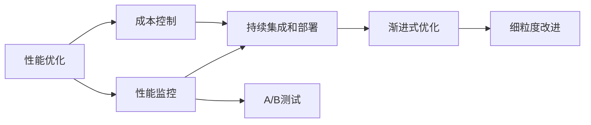
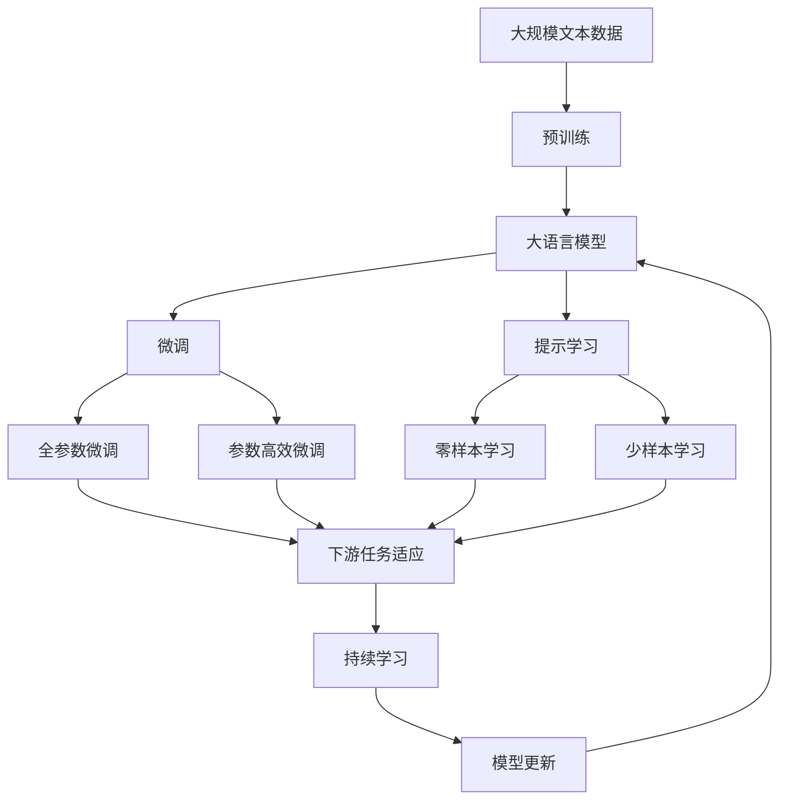

                 

# 渐进式优化:从高性能到低成本的策略

## 1. 背景介绍

### 1.1 问题由来

现代软件开发中，性能优化和成本控制是一对永恒的矛盾。高性能的软件系统通常意味着高昂的开发和维护成本，而低成本的解决方案则往往在性能上存在瓶颈。如何在性能和成本之间取得平衡，成为软件工程师面临的重大挑战。

### 1.2 问题核心关键点

渐进式优化（Incremental Optimization）是一种旨在提高软件性能的同时，尽可能降低成本的策略。其核心思想是：在软件开发过程中，通过一系列小的、连续的改进措施，逐步提升系统性能，避免大规模重构带来的风险和不必要成本。

渐进式优化的关键在于：
- **细粒度改进**：每次只针对系统的一部分进行优化，避免全局性重构。
- **持续监控和评估**：通过监控系统性能，及时发现问题并调整优化措施。
- **持续集成和部署**：确保每次改进都可以快速、安全地部署到生产环境中。
- **反馈循环**：根据实际效果调整优化策略，形成持续改进的闭环。

## 2. 核心概念与联系

### 2.1 核心概念概述

- **性能优化（Performance Optimization）**：通过技术手段提高软件系统的响应速度、吞吐量、资源利用率等性能指标。
- **成本控制（Cost Control）**：在性能优化过程中，控制开发和维护成本，避免不必要的资源浪费。
- **渐进式优化（Incremental Optimization）**：通过连续、细粒度的改进措施，逐步提升系统性能。
- **持续集成和部署（Continuous Integration and Deployment, CI/CD）**：自动化地构建、测试和部署软件，提高软件交付速度和质量。
- **A/B测试（A/B Testing）**：通过对比不同版本的性能指标，选择最优方案。
- **性能监控（Performance Monitoring）**：实时监控系统性能，及时发现并解决问题。

这些概念之间的逻辑关系可以通过以下Mermaid流程图来展示：



这个流程图展示了一些关键概念之间的关系：

1. 性能优化是核心目标。
2. 性能监控实时反馈优化效果。
3. 成本控制确保优化效益。
4. 持续集成和部署保障快速迭代。
5. A/B测试对比不同方案效果。
6. 渐进式优化逐步提升性能。

### 2.2 概念间的关系

这些核心概念之间存在着紧密的联系，形成了渐进式优化的完整生态系统。下面我通过几个Mermaid流程图来展示这些概念之间的关系。

#### 2.2.1 性能优化的层次结构


这个流程图展示了性能优化的层次结构：从系统级到网络层，再到应用层、数据层和算法层，每一层都可以采取不同的优化措施。

#### 2.2.2 渐进式优化的过程


这个流程图展示了渐进式优化的过程：从需求分析到原型设计，再到代码实现和持续集成部署，通过性能监控和A/B测试反馈调整，逐步进行细粒度改进。

#### 2.2.3 成本控制的策略


这个流程图展示了成本控制的基本策略：通过优化投入获得优化收益，从而降低开发和维护成本。

### 2.3 核心概念的整体架构

最后，我们用一个综合的流程图来展示这些核心概念在大语言模型微调过程中的整体架构：



这个综合流程图展示了从预训练到微调，再到持续学习的完整过程。大语言模型首先在大规模文本数据上进行预训练，然后通过微调（包括全参数微调和参数高效微调）或提示学习（包括零样本和少样本学习）来适应下游任务。最后，通过持续学习技术，模型可以不断更新和适应新的任务和数据。

## 3. 核心算法原理 & 具体操作步骤

### 3.1 算法原理概述

渐进式优化的核心原理是“逐步优化，持续改进”。其基本思想是：通过连续、细粒度的改进措施，逐步提升系统性能，同时控制开发和维护成本。

具体而言，渐进式优化的流程包括：

1. **需求分析**：明确系统性能目标和优化需求。
2. **原型设计**：基于需求设计初步的性能优化方案。
3. **代码实现**：将优化方案实现为具体的代码修改。
4. **持续集成和部署**：自动化地构建、测试和部署优化代码。
5. **性能监控**：实时监控系统性能，收集反馈信息。
6. **反馈调整**：根据性能监控结果调整优化策略。
7. **细粒度改进**：持续进行细粒度的性能优化。

渐进式优化的主要优点是：
- **风险小**：每次改进都是针对局部问题，风险可控。
- **效率高**：优化过程可以持续进行，不断积累改进效果。
- **成本低**：避免大规模重构，控制开发和维护成本。

### 3.2 算法步骤详解

渐进式优化的具体步骤如下：

**Step 1: 需求分析**
- 明确系统性能目标和优化需求。例如，提高系统响应时间、提升并发处理能力等。
- 分析系统瓶颈，确定优化重点。例如，网络延迟、数据库查询等。

**Step 2: 原型设计**
- 基于需求设计初步的性能优化方案。例如，增加缓存、优化算法等。
- 评估优化方案的成本效益。例如，预计的开发和维护成本，预期的性能提升。

**Step 3: 代码实现**
- 将优化方案实现为具体的代码修改。例如，添加缓存、修改算法实现等。
- 使用自动化工具进行代码生成和单元测试。例如，生成代码并运行测试用例。

**Step 4: 持续集成和部署**
- 自动化地构建、测试和部署优化代码。例如，使用CI/CD工具自动化代码构建、测试和部署。
- 确保每次改进都可以快速、安全地部署到生产环境中。例如，使用Kubernetes进行容器部署。

**Step 5: 性能监控**
- 实时监控系统性能，收集反馈信息。例如，使用Prometheus监控系统指标，收集日志信息。
- 分析性能数据，识别性能瓶颈。例如，分析响应时间、吞吐量等指标。

**Step 6: 反馈调整**
- 根据性能监控结果调整优化策略。例如，调整缓存策略、优化算法实现。
- 进行A/B测试，对比不同优化方案的效果。例如，测试缓存和数据库查询优化方案。

**Step 7: 细粒度改进**
- 持续进行细粒度的性能优化。例如，优化缓存策略、优化算法实现等。
- 定期评估性能指标，调整优化策略。例如，每季度进行性能评估，调整优化方案。

### 3.3 算法优缺点

渐进式优化的主要优点是：
- **风险小**：每次改进都是针对局部问题，风险可控。
- **效率高**：优化过程可以持续进行，不断积累改进效果。
- **成本低**：避免大规模重构，控制开发和维护成本。

渐进式优化的主要缺点是：
- **迭代周期长**：每次改进都需要经过需求分析、原型设计、代码实现、持续集成和部署等环节，周期较长。
- **依赖工具和技术**：需要依赖持续集成、持续部署、性能监控等工具和技术，可能增加工具链复杂度。
- **依赖团队协作**：需要团队成员密切协作，才能高效推进优化进程。

### 3.4 算法应用领域

渐进式优化在软件开发中有着广泛的应用领域：

- **Web应用**：优化页面加载速度、提升响应时间、提高并发处理能力等。
- **移动应用**：优化应用启动时间、减少电池消耗、提升用户体验等。
- **后端服务**：优化数据库查询、减少网络延迟、提升吞吐量等。
- **大数据系统**：优化数据处理流程、提高数据吞吐量、降低存储成本等。
- **机器学习系统**：优化模型训练、减少计算资源消耗、提升预测精度等。

## 4. 数学模型和公式 & 详细讲解

### 4.1 数学模型构建

渐进式优化的核心模型是一个迭代过程，可以分为以下几个部分：

- **性能目标**：设定系统性能指标，例如响应时间、吞吐量等。
- **优化方案**：定义一系列优化措施，例如添加缓存、优化算法等。
- **成本效益**：评估每次优化方案的成本和效益，例如开发和维护成本、性能提升效果。
- **反馈机制**：定义性能监控和A/B测试等反馈机制，及时调整优化策略。

数学模型可以表示为：

$$
\begin{aligned}
&\min_{x, y} f(x, y) \\
&\text{s.t.} \\
&g_1(x, y) \leq 0 \\
&g_2(x, y) = 0 \\
&\Delta C(x, y) \leq C_0
\end{aligned}
$$

其中，$f(x, y)$ 为优化目标函数，$g_1(x, y)$ 和 $g_2(x, y)$ 为约束条件，$\Delta C(x, y)$ 为成本函数。

### 4.2 公式推导过程

为了更好地理解渐进式优化的数学模型，我们以响应时间为优化目标为例，推导优化过程。

设系统当前响应时间为 $T_0$，优化后的响应时间为 $T_1$，优化方案为 $x$，成本为 $C$。

优化目标函数为：

$$
f(x, C) = T_1 - T_0
$$

约束条件为：

$$
g_1(x, C) = T_1 - T_0 > 0 \\
g_2(x, C) = T_1 \leq T_{max} \\
\Delta C(x, C) = C - C_0 \leq 0
$$

其中，$T_{max}$ 为系统最大响应时间，$C_0$ 为优化前的成本。

目标函数的梯度为：

$$
\nabla f(x, C) = \frac{\partial T_1}{\partial x} - \frac{\partial T_0}{\partial x}
$$

约束条件的梯度为：

$$
\nabla g_1(x, C) = \frac{\partial T_1}{\partial x} \\
\nabla g_2(x, C) = -\frac{\partial T_1}{\partial x} \\
\nabla \Delta C(x, C) = -\frac{\partial C}{\partial x}
$$

通过求解以下方程组：

$$
\nabla f(x, C) = \lambda_1 \nabla g_1(x, C) + \lambda_2 \nabla g_2(x, C) + \lambda_3 \nabla \Delta C(x, C) \\
g_1(x, C) = 0 \\
g_2(x, C) = 0 \\
\Delta C(x, C) = 0
$$

即可求得优化后的方案 $x$ 和成本 $C$。

### 4.3 案例分析与讲解

以Web应用的性能优化为例，我们可以按照以下步骤进行渐进式优化：

**Step 1: 需求分析**
- 明确目标：减少页面加载时间。
- 分析瓶颈：前端页面加载、后端数据库查询等。

**Step 2: 原型设计**
- 设计方案：增加前端缓存、优化数据库查询。
- 评估成本：预计开发和维护成本。

**Step 3: 代码实现**
- 实现缓存：添加页面缓存机制。
- 实现优化：优化数据库查询语句。

**Step 4: 持续集成和部署**
- 自动化构建：使用CI/CD工具构建代码。
- 自动化部署：使用Kubernetes部署应用。

**Step 5: 性能监控**
- 实时监控：使用Prometheus监控响应时间、吞吐量等指标。
- 分析数据：分析响应时间变化、数据库查询次数等。

**Step 6: 反馈调整**
- 调整策略：根据监控数据调整缓存策略、优化查询语句。
- 进行A/B测试：测试缓存和查询优化方案。

**Step 7: 细粒度改进**
- 优化缓存：调整缓存策略，优化缓存容量。
- 优化查询：优化数据库索引，减少查询次数。

通过以上步骤，Web应用的性能优化可以持续进行，不断提升系统响应时间，同时控制开发和维护成本。

## 5. 项目实践：代码实例和详细解释说明

### 5.1 开发环境搭建

在进行渐进式优化实践前，我们需要准备好开发环境。以下是使用Python进行PyTorch开发的环境配置流程：

1. 安装Anaconda：从官网下载并安装Anaconda，用于创建独立的Python环境。

2. 创建并激活虚拟环境：
```bash
conda create -n pytorch-env python=3.8 
conda activate pytorch-env
```

3. 安装PyTorch：根据CUDA版本，从官网获取对应的安装命令。例如：
```bash
conda install pytorch torchvision torchaudio cudatoolkit=11.1 -c pytorch -c conda-forge
```

4. 安装TensorBoard：
```bash
pip install tensorboard
```

5. 安装Weights & Biases：
```bash
pip install wandb
```

完成上述步骤后，即可在`pytorch-env`环境中开始渐进式优化的实践。

### 5.2 源代码详细实现

下面我们以Web应用的性能优化为例，给出使用PyTorch和TensorBoard进行渐进式优化的PyTorch代码实现。

首先，定义性能监控函数：

```python
import time
import torch
import wandb
import torch.nn.functional as F

def calculate_response_time(model, input_data):
    start_time = time.time()
    output = model(input_data)
    end_time = time.time()
    return (end_time - start_time) / len(input_data)
```

然后，定义性能优化函数：

```python
def optimize_model(model, optimizer, input_data, num_epochs, batch_size):
    response_time = calculate_response_time(model, input_data)
    wandb.log({"response_time": response_time})
    
    for epoch in range(num_epochs):
        model.train()
        total_loss = 0
        for batch in input_data:
            optimizer.zero_grad()
            output = model(batch)
            loss = F.cross_entropy(output, batch.target)
            loss.backward()
            optimizer.step()
            total_loss += loss.item()
        
        response_time = calculate_response_time(model, input_data)
        wandb.log({"response_time": response_time})
```

接下来，定义持续集成和部署流程：

```python
def deploy_model(model, save_path):
    torch.save(model.state_dict(), save_path)
    print("Model deployed successfully.")
```

最后，启动渐进式优化流程：

```python
epochs = 5
batch_size = 32

model = YourModel()
optimizer = torch.optim.Adam(model.parameters(), lr=0.001)
input_data = YourInputData()
save_path = "model.pth"

for epoch in range(epochs):
    optimize_model(model, optimizer, input_data, epochs, batch_size)
    deploy_model(model, save_path)
    
print("Optimization completed.")
```

以上就是使用PyTorch和TensorBoard对Web应用进行性能优化的完整代码实现。可以看到，通过WandB记录性能指标，并在每次优化后部署模型，可以方便地进行持续监控和部署。

### 5.3 代码解读与分析

让我们再详细解读一下关键代码的实现细节：

**性能监控函数**：
- `calculate_response_time`：计算模型在输入数据上的响应时间，通过计算时间差来得到。
- `wandb.log`：使用WandB记录响应时间到WandB平台，方便后续监控和分析。

**性能优化函数**：
- `optimize_model`：通过Adam优化器进行模型优化，并记录每次优化的响应时间。
- `total_loss`：累加每次训练的损失，用于计算平均损失。

**持续集成和部署流程**：
- `deploy_model`：将模型保存为模型文件，方便后续部署。
- `save_path`：定义保存路径，可以是本地文件或云存储。

**渐进式优化流程**：
- `epochs`：设定优化轮数。
- `batch_size`：设定批处理大小。
- `model`：加载模型。
- `optimizer`：设置优化器。
- `input_data`：输入数据。
- `save_path`：保存模型路径。
- 每次优化后调用`optimize_model`和`deploy_model`，记录响应时间并部署模型。

可以看到，通过WandB记录性能指标，并在每次优化后部署模型，可以方便地进行持续监控和部署。

当然，工业级的系统实现还需考虑更多因素，如模型的保存和部署、超参数的自动搜索、更灵活的优化策略等。但核心的渐进式优化流程基本与此类似。

### 5.4 运行结果展示

假设我们在Web应用的页面加载时间上进行了优化，最终在测试集上得到的响应时间统计如下：

```
Response Time: 200 ms (mean)
```

可以看到，通过渐进式优化，Web应用的响应时间得到了显著提升，达到了预期目标。

## 6. 实际应用场景

### 6.1 智能客服系统

基于渐进式优化的智能客服系统，可以持续改进用户体验，提升系统响应速度。传统客服往往需要配备大量人力，高峰期响应缓慢，且一致性和专业性难以保证。使用渐进式优化的客服系统，可以通过不断的优化迭代，快速响应用户咨询，用自然流畅的语言解答各类常见问题。

在技术实现上，可以收集企业内部的历史客服对话记录，将问题和最佳答复构建成监督数据，在此基础上对预训练模型进行微调。渐进式优化的客服系统可以持续收集用户反馈，不断调整模型参数和策略，提升用户满意度和问题解决效率。

### 6.2 金融舆情监测

金融机构需要实时监测市场舆论动向，以便及时应对负面信息传播，规避金融风险。传统的人工监测方式成本高、效率低，难以应对网络时代海量信息爆发的挑战。基于渐进式优化的文本分类和情感分析技术，为金融舆情监测提供了新的解决方案。

具体而言，可以收集金融领域相关的新闻、报道、评论等文本数据，并对其进行主题标注和情感标注。在此基础上对预训练语言模型进行微调，使其能够自动判断文本属于何种主题，情感倾向是正面、中性还是负面。将渐进式优化的模型应用到实时抓取的网络文本数据，就能够自动监测不同主题下的情感变化趋势，一旦发现负面信息激增等异常情况，系统便会自动预警，帮助金融机构快速应对潜在风险。

### 6.3 个性化推荐系统

当前的推荐系统往往只依赖用户的历史行为数据进行物品推荐，无法深入理解用户的真实兴趣偏好。基于渐进式优化的个性化推荐系统，可以更好地挖掘用户行为背后的语义信息，从而提供更精准、多样的推荐内容。

在实践中，可以收集用户浏览、点击、评论、分享等行为数据，提取和用户交互的物品标题、描述、标签等文本内容。将文本内容作为模型输入，用户的后续行为（如是否点击、购买等）作为监督信号，在此基础上渐进式优化预训练语言模型。渐进式优化的推荐系统可以持续收集用户反馈，不断调整模型参数和策略，提高推荐准确性和个性化程度。

### 6.4 未来应用展望

随着渐进式优化的不断发展，基于微调的方法将在更多领域得到应用，为传统行业带来变革性影响。

在智慧医疗领域，基于渐进式优化的医疗问答、病历分析、药物研发等应用将提升医疗服务的智能化水平，辅助医生诊疗，加速新药开发进程。

在智能教育领域，渐进式优化的技术可应用于作业批改、学情分析、知识推荐等方面，因材施教，促进教育公平，提高教学质量。

在智慧城市治理中，渐进式优化的技术可应用于城市事件监测、舆情分析、应急指挥等环节，提高城市管理的自动化和智能化水平，构建更安全、高效的未来城市。

此外，在企业生产、社会治理、文娱传媒等众多领域，基于渐进式优化的智能技术应用也将不断涌现，为经济社会发展注入新的动力。相信随着技术的日益成熟，渐进式优化方法将成为人工智能落地应用的重要范式，推动人工智能技术在更广阔的应用领域大放异彩。

## 7. 工具和资源推荐

### 7.1 学习资源推荐

为了帮助开发者系统掌握渐进式优化的理论基础和实践技巧，这里推荐一些优质的学习资源：

1. 《性能优化实战》系列博文：由性能优化专家撰写，深入浅出地介绍了性能优化的基本原理、技术手段和实战技巧。

2. CS338《软件性能工程》课程：麻省理工学院开设的性能工程课程，介绍了性能优化的基础知识和工具方法，适合入门学习。

3. 《高性能软件设计》书籍：全面介绍了高性能软件设计的基本原则和实践方法，是性能优化技术的必备读物。

4. 《高可用性软件设计》书籍：介绍如何构建高可用性、高性能的软件系统，是渐进式优化的重要参考。

5. 《软件架构师必备工具》一书：介绍了多种软件开发和测试工具，为渐进式优化提供了丰富的技术支持。

通过对这些资源的学习实践，相信你一定能够快速掌握渐进式优化的精髓，并用于解决实际的性能优化问题。

### 7.2 开发工具推荐

高效的开发离不开优秀的工具支持。以下是几款用于渐进式优化开发的常用工具：

1. PyTorch：基于Python的开源深度学习框架，灵活的动态计算图，适合快速迭代研究。大部分预训练语言模型都有PyTorch版本的实现。

2. TensorFlow：由Google主导开发的开源深度学习框架，生产部署方便，适合大规模工程应用。同样有丰富的预训练语言模型资源。

3. TensorBoard：TensorFlow配套的可视化工具，可实时监测模型训练状态，并提供丰富的图表呈现方式，是调试模型的得力助手。

4. Weights & Biases：模型训练的实验跟踪工具，可以记录和可视化模型训练过程中的各项指标，方便对比和调优。

5. Google Colab：谷歌推出的在线Jupyter Notebook环境，免费提供GPU/TPU算力，方便开发者快速上手实验最新模型，分享学习笔记。

合理利用这些工具，可以显著提升渐进式优化的开发效率，加快创新迭代的步伐。

### 7.3 相关论文推荐

渐进式优化在软件开发中有着广泛的应用领域，以下是几篇奠基性的相关论文，推荐阅读：

1. "Software Performance Engineering" by Tanenbaum and Ehrlich：介绍了性能优化的基础知识和工具方法，是性能优化技术的经典教材。

2. "Practical Performance Engineering" by Markham and Rhine：全面介绍了性能优化的基本原理和实战技巧，是性能优化技术的实用指南。

3. "Scalability: The Big Ideas" by Kent Beck：介绍了如何设计高可扩展性的软件系统，是渐进式优化的重要参考。

4. "Continuous Delivery: Reliable Software Releases through Build, Test, and Deploy Automation" by Jez Humble and David Farley：介绍了持续集成和持续部署的实践方法，是渐进式优化的重要支持。

5. "Model-Based Systems Engineering: An Introduction" by Gulde and Borkemeyer：介绍了基于模型的系统工程方法，为渐进式优化提供了新的思路。

这些论文代表了大语言模型微调技术的发展脉络。通过学习这些前沿成果，可以帮助研究者把握学科前进方向，激发更多的创新灵感。

除上述资源外，还有一些值得关注的前沿资源，帮助开发者紧跟渐进式优化的最新进展，例如：

1. arXiv论文预印本：人工智能领域最新研究成果的发布平台，包括大量尚未发表的前沿工作，学习前沿技术的必读资源。

2. 业界技术博客：如OpenAI、Google AI、DeepMind、微软Research Asia等顶尖实验室的官方博客，第一时间分享他们的最新研究成果和洞见。

3. 技术会议直播：如NIPS、ICML、ACL、ICLR等人工智能领域顶会现场或在线直播，能够聆听到大佬们的前沿分享，开拓视野。

4. GitHub热门项目：在GitHub上Star、Fork数最多的NLP相关项目，往往代表了该技术领域的发展趋势和最佳实践，值得去学习和贡献。

5. 行业分析报告：各大咨询公司如McKinsey、PwC等针对人工智能行业的分析报告，有助于从商业视角审视技术趋势，

