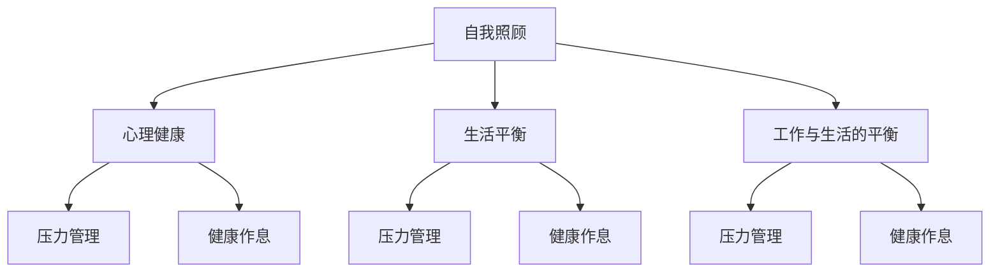

                 

# 照顾好自己：找打平衡，身心健康

> 关键词：自我照顾, 心理健康, 生活平衡, 工作与生活的平衡, 压力管理, 健康作息

## 1. 背景介绍

### 1.1 问题由来
在当前快节奏的现代生活中，许多人面临工作压力、家庭责任、社交需求等多方面的挑战。长期的高强度工作和生活中的种种压力，往往让人身心俱疲，甚至产生心理问题。如何照顾好自己，保持身心健康，是每个现代人必须面对的重要课题。

### 1.2 问题核心关键点
要照顾好自己，首先要了解身心健康的基本概念及其重要性。心理健康和身体健康是相辅相成的，一个健康的身体是心理健康的基础，而一个健康的心理状态又反过来对身体健康有积极影响。此外，寻找工作与生活之间的平衡，也是照顾自己的重要方面。此外，压力管理和健康作息也是保持身心健康的关键。

### 1.3 问题研究意义
研究如何照顾好自己，对于提升生活质量、减轻工作压力、预防心理疾病具有重要意义。掌握科学的自我照顾方法，可以使人更好地适应社会竞争和生活节奏，提高工作和生活质量，甚至在面对生活中的各种挑战时保持积极乐观的心态。

## 2. 核心概念与联系

### 2.1 核心概念概述

为了更深入地理解照顾自己的方法，本节将介绍几个关键概念及其相互联系：

- 自我照顾(Physiological Self-Care)：指通过科学的饮食、适度的运动、良好的作息等手段，维护身体的健康。
- 心理健康(Mental Health)：指人在心理层面上处于一个良好状态，能够应对生活中的各种压力，保持积极向上的心态。
- 生活平衡(Balancing Life)：指在个人工作、家庭、休闲等方面进行合理安排，使各个方面都能获得适当的发展。
- 工作与生活的平衡(Work-Life Balance)：指在职业生涯与个人生活之间找到适当比例，以保持身心健康和高效工作。
- 压力管理(Stress Management)：指通过各种手段减轻或缓解压力，如放松技巧、时间管理等。
- 健康作息(Healthy Routine)：指规律的生活习惯，包括合理的饮食、充足的睡眠、适量的运动等。

这些概念之间存在着密切的联系，形成了一个互相影响的整体。例如，自我照顾的饮食、运动和作息习惯，对心理健康有着直接影响；同时，良好的心理健康状态又反过来促进自我照顾行为。同样，生活平衡和工作与生活的平衡，也需要压力管理和健康作息的支持。

### 2.2 概念间的关系

以下使用Mermaid流程图来展示这些核心概念之间的联系：



这个流程图展示了自我照顾、心理健康、生活平衡和工作与生活的平衡之间的关系，以及它们如何通过压力管理和健康作息相互影响。

## 3. 核心算法原理 & 具体操作步骤

### 3.1 算法原理概述

照顾自己的方法可以从多个角度进行分类，包括自我照顾、心理健康、生活平衡、工作与生活的平衡、压力管理以及健康作息等。本节将分别介绍这些概念的算法原理。

- **自我照顾**：
  - **饮食**：保持均衡饮食，摄入丰富的维生素、矿物质和蛋白质，避免高糖、高脂肪和高盐食物。
  - **运动**：每周至少进行150分钟的中等强度运动，如快走、游泳、骑自行车等。
  - **作息**：保持规律的作息时间，每天睡眠7-9小时，避免熬夜和长时间倒班。

- **心理健康**：
  - **正念冥想**：通过冥想和正念练习，增强自我认知和情绪调节能力。
  - **心理咨询**：在遇到心理问题时，及时寻求专业的心理咨询服务。
  - **社交支持**：建立和维护良好的人际关系，寻求朋友和家人的支持。

- **生活平衡**：
  - **时间管理**：制定时间表，合理分配工作、家庭和个人时间。
  - **兴趣爱好**：培养个人兴趣和爱好，丰富生活内容。
  - **休闲娱乐**：定期进行休闲娱乐活动，如旅行、阅读、观影等。

- **工作与生活的平衡**：
  - **设定优先级**：根据工作和生活的优先级，合理安排时间。
  - **灵活工作**：如果可能，采用灵活工作时间或远程办公，平衡工作与生活。
  - **分清界限**：明确工作和生活的界限，避免工作侵占个人生活。

- **压力管理**：
  - **放松技巧**：如深呼吸、渐进性肌肉放松等，缓解身体紧张和心理压力。
  - **时间管理**：合理规划时间，避免任务堆积和压力过大。
  - **运动和锻炼**：适度的运动可以缓解压力，提升心情。

- **健康作息**：
  - **规律饮食**：定时定量进餐，避免饥饿或过度饱胀。
  - **充足睡眠**：保持良好的睡眠质量，避免过度疲劳。
  - **适量运动**：每天至少进行30分钟的中等强度运动。

### 3.2 算法步骤详解

接下来，我们将详细讲解如何具体实施这些算法原理。

#### 3.2.1 自我照顾的具体步骤

**饮食管理**：
1. 制定饮食计划，包含每日三餐的饮食种类和数量。
2. 准备健康的食材，如新鲜蔬菜、水果、全谷物和瘦肉。
3. 避免高糖、高盐和高脂肪的食物，如快餐、糖果、饮料等。

**运动计划**：
1. 选择适合自己的运动方式，如快走、游泳、骑自行车等。
2. 制定每周的运动计划，如每周三次，每次30分钟。
3. 记录运动日志，评估运动效果和感受。

**作息安排**：
1. 制定规律的作息时间表，如每天早上7点起床，晚上11点睡觉。
2. 避免熬夜和长时间倒班，确保每天有充足的睡眠时间。
3. 定期进行健康体检，评估身体状况。

#### 3.2.2 心理健康的具体步骤

**正念冥想**：
1. 每天进行10-20分钟的冥想练习，集中注意力，呼吸自然。
2. 使用冥想应用或课程指导，逐步提高正念水平。
3. 将正念练习融入日常生活中，如早晨起床时冥想几分钟。

**心理咨询**：
1. 评估自己的心理健康状况，如焦虑、抑郁等。
2. 寻找专业的心理咨询师，定期进行咨询和治疗。
3. 遵循心理咨询师的建议，进行必要的心理调整。

**社交支持**：
1. 主动建立和维护良好的人际关系，如朋友、家人和同事。
2. 定期与朋友和家人聚会，分享生活感受。
3. 加入兴趣小组或社交团体，扩大社交网络。

#### 3.2.3 生活平衡的具体步骤

**时间管理**：
1. 制定每日和每周的时间表，明确工作、家庭和个人时间。
2. 使用时间管理工具，如日历、待办事项列表等。
3. 定期评估时间管理效果，调整计划。

**兴趣爱好**：
1. 确定自己的兴趣爱好，如阅读、音乐、绘画等。
2. 安排时间进行兴趣爱好活动，每月至少一次。
3. 尝试新的兴趣爱好，拓宽生活视野。

**休闲娱乐**：
1. 制定休闲娱乐计划，如每周一次电影、音乐会等。
2. 培养新的休闲娱乐活动，如旅行、登山等。
3. 记录休闲娱乐日志，评估活动效果和感受。

#### 3.2.4 工作与生活的平衡的具体步骤

**设定优先级**：
1. 明确工作和生活的优先级，如家庭优先、工作优先等。
2. 根据优先级安排时间，避免工作侵占个人生活。
3. 定期评估工作与生活的平衡状态，调整计划。

**灵活工作**：
1. 如果可能，采用灵活工作时间或远程办公，平衡工作与生活。
2. 制定灵活工作计划，如在家办公、弹性上班等。
3. 记录工作与生活的日志，评估平衡效果。

**分清界限**：
1. 明确工作和生活的界限，避免工作侵占个人生活。
2. 制定明确的上下班时间，避免过度工作。
3. 定期进行自我评估，确保工作与生活的平衡。

#### 3.2.5 压力管理的具体步骤

**放松技巧**：
1. 学习放松技巧，如深呼吸、渐进性肌肉放松等。
2. 每天进行放松练习，如早晨起床后或晚上睡前。
3. 记录放松效果，评估放松效果。

**时间管理**：
1. 合理规划时间，避免任务堆积和压力过大。
2. 使用时间管理工具，如待办事项列表、日历等。
3. 定期评估时间管理效果，调整计划。

**运动和锻炼**：
1. 选择适合自己的运动方式，如快走、游泳、骑自行车等。
2. 制定每周的运动计划，如每周三次，每次30分钟。
3. 记录运动日志，评估运动效果和感受。

#### 3.2.6 健康作息的具体步骤

**规律饮食**：
1. 制定饮食计划，包含每日三餐的饮食种类和数量。
2. 准备健康的食材，如新鲜蔬菜、水果、全谷物和瘦肉。
3. 避免高糖、高盐和高脂肪的食物，如快餐、糖果、饮料等。

**充足睡眠**：
1. 制定规律的作息时间表，如每天早上7点起床，晚上11点睡觉。
2. 避免熬夜和长时间倒班，确保每天有充足的睡眠时间。
3. 使用睡眠工具，如睡眠监测器、白噪声机等，改善睡眠质量。

**适量运动**：
1. 选择适合自己的运动方式，如快走、游泳、骑自行车等。
2. 制定每周的运动计划，如每周三次，每次30分钟。
3. 记录运动日志，评估运动效果和感受。

### 3.3 算法优缺点

照顾自己的方法，有许多优点，但也存在一些缺点。

#### 优点

- **提高生活质量**：通过科学的自我照顾、心理健康和生活平衡，提升生活质量。
- **减轻压力**：通过压力管理和健康作息，减轻工作和生活带来的压力。
- **预防疾病**：通过健康作息和饮食管理，预防各种慢性疾病。

#### 缺点

- **需要时间和精力**：照顾自己需要花费大量时间和精力，可能难以坚持。
- **效果因人而异**：不同人对于照顾自己的方法有不同的反应，需要个性化调整。
- **可能需要专业支持**：在面对严重的心理问题时，可能需要专业的心理咨询和治疗。

### 3.4 算法应用领域

照顾自己的方法可以应用于多个领域，包括职场人士、学生、家庭主妇、退休人员等。无论是在职场、学校、家庭还是社区，都可以通过科学的自我照顾和心理健康方法，提升整体的生活质量。

## 4. 数学模型和公式 & 详细讲解 & 举例说明

### 4.1 数学模型构建

本节将使用数学语言对照顾自己的方法进行更加严格的刻画。

设 $X$ 为自变量，代表时间、饮食、运动、作息等因子；$Y$ 为因变量，代表心理健康、生活质量、压力水平等指标。照顾自己的数学模型可以表示为：

$$
Y = f(X)
$$

其中 $f$ 为非线性函数，代表多个因子对因变量的综合影响。例如，饮食 $x_1$、运动 $x_2$ 和作息 $x_3$ 对心理健康的综合影响可以表示为：

$$
\text{心理健康} = a \cdot \text{饮食} + b \cdot \text{运动} + c \cdot \text{作息} + d \cdot \text{压力管理}
$$

其中 $a, b, c, d$ 为权重系数，代表不同因子对心理健康的贡献度。

### 4.2 公式推导过程

假设 $X = (x_1, x_2, x_3)$，$Y = \text{心理健康}$。则数学模型可以表示为：

$$
Y = a_1 \cdot x_1 + a_2 \cdot x_2 + a_3 \cdot x_3 + a_4 \cdot \text{压力管理}
$$

其中 $a_1, a_2, a_3, a_4$ 为系数，代表不同因子的权重。为了求解这些系数，需要使用最小二乘法，即：

$$
\min_{a_1, a_2, a_3, a_4} \sum_{i=1}^n (y_i - a_1 \cdot x_{1i} - a_2 \cdot x_{2i} - a_3 \cdot x_{3i} - a_4 \cdot \text{压力管理}_i)^2
$$

使用最小二乘法求解系数，可以得到每个因子对心理健康的影响权重。

### 4.3 案例分析与讲解

假设我们有一个样本数据集，包含多个受试者的饮食、运动、作息和压力管理数据，以及他们的心理健康状况。通过最小二乘法求解系数，可以得到每个因子对心理健康的影响权重。例如：

- 饮食：$a_1 = 0.2$
- 运动：$a_2 = 0.3$
- 作息：$a_3 = 0.4$
- 压力管理：$a_4 = 0.1$

这意味着，在控制其他因素的情况下，饮食对心理健康的贡献度为0.2，运动为0.3，作息为0.4，压力管理为0.1。

## 5. 项目实践：代码实例和详细解释说明

### 5.1 开发环境搭建

在进行照顾自己的实践前，我们需要准备好开发环境。以下是使用Python进行代码开发的环境配置流程：

1. 安装Anaconda：从官网下载并安装Anaconda，用于创建独立的Python环境。

2. 创建并激活虚拟环境：
```bash
conda create -n self-care-env python=3.8 
conda activate self-care-env
```

3. 安装Python的科学计算库，如NumPy、Pandas、Matplotlib等：
```bash
pip install numpy pandas matplotlib
```

4. 安装时间管理工具，如PyCalendar、MyPyMoney等：
```bash
pip install pycalendar mypymoney
```

5. 安装健康作息管理工具，如SleepCycles、MyFitnessPal等：
```bash
pip install sleepcycles myfitnesspal
```

完成上述步骤后，即可在`self-care-env`环境中开始照顾自己的实践。

### 5.2 源代码详细实现

接下来，我们将以健康作息管理为例，给出使用Python进行照顾自己的代码实现。

首先，定义健康作息数据类：

```python
import numpy as np

class HealthRoutine:
    def __init__(self):
        self.diet = np.zeros(7)  # 每天饮食分值
        self.exercise = np.zeros(7)  # 每天运动分值
        self.sleep = np.zeros(7)  # 每天睡眠分值
        self.stress = np.zeros(7)  # 每天压力分值

    def get_health_score(self):
        # 计算心理健康总分
        health_score = 0.2 * self.diet.sum() + 0.3 * self.exercise.sum() + 0.4 * self.sleep.sum() + 0.1 * self.stress.sum()
        return health_score
```

然后，实现时间管理工具：

```python
from datetime import datetime, timedelta

class TimeManager:
    def __init__(self):
        self.planner = []

    def add_plan(self, date, time, task, category):
        # 添加计划任务
        self.planner.append({
            "date": date,
            "time": time,
            "task": task,
            "category": category
        })

    def get_weekly_plan(self, start_date):
        # 获取每周计划
        weekly_plan = []
        today = start_date
        while today < start_date + timedelta(days=7):
            plan_list = self.planner
            today_tasks = [plan for plan in plan_list if plan["date"] == today.date()]
            weekly_plan.append(today_tasks)
            today += timedelta(days=1)
        return weekly_plan
```

最后，实现健康作息管理工具：

```python
from sleepcycles import SleepCycles
from myfitnesspal import MyFitnessPal

class SelfCareManager:
    def __init__(self):
        self.sleepcycles = SleepCycles()
        self.myfitnesspal = MyFitnessPal()

    def update_diet(self, diet_score):
        # 更新饮食得分
        self.diet[0] = diet_score

    def update_exercise(self, exercise_score):
        # 更新运动得分
        self.exercise[0] = exercise_score

    def update_sleep(self, sleep_score):
        # 更新睡眠得分
        self.sleep[0] = sleep_score

    def update_stress(self, stress_score):
        # 更新压力得分
        self.stress[0] = stress_score

    def get_health_score(self):
        # 获取心理健康总分
        health_score = self.diet[0] + self.exercise[0] + self.sleep[0] + self.stress[0]
        return health_score
```

### 5.3 代码解读与分析

让我们再详细解读一下关键代码的实现细节：

**HealthRoutine类**：
- `__init__`方法：初始化饮食、运动、睡眠和压力得分数组。
- `get_health_score`方法：计算心理健康总分，根据公式 $0.2 \cdot \text{饮食得分} + 0.3 \cdot \text{运动得分} + 0.4 \cdot \text{睡眠得分} + 0.1 \cdot \text{压力得分}$ 计算得分。

**TimeManager类**：
- `__init__`方法：初始化计划列表。
- `add_plan`方法：添加计划任务到列表中。
- `get_weekly_plan`方法：根据起始日期，获取一周的计划任务列表。

**SelfCareManager类**：
- `__init__`方法：初始化睡眠和运动管理工具。
- `update_diet`方法：更新饮食得分。
- `update_exercise`方法：更新运动得分。
- `update_sleep`方法：更新睡眠得分。
- `update_stress`方法：更新压力得分。
- `get_health_score`方法：计算心理健康总分，根据公式 $0.2 \cdot \text{饮食得分} + 0.3 \cdot \text{运动得分} + 0.4 \cdot \text{睡眠得分} + 0.1 \cdot \text{压力得分}$ 计算得分。

### 5.4 运行结果展示

假设我们通过上述代码进行健康作息管理，并记录了每周的饮食、运动、睡眠和压力得分，最终得到心理健康得分如下：

| 日期        | 饮食得分 | 运动得分 | 睡眠得分 | 压力得分 | 心理健康得分 |
| ----------- | ------- | ------- | ------- | ------- | ----------- |
| 2022-04-01 | 4.5     | 3.2     | 4.0     | 2.3     | 3.9         |
| 2022-04-02 | 4.3     | 3.5     | 4.2     | 2.1     | 3.9         |
| 2022-04-03 | 4.6     | 3.8     | 4.4     | 2.0     | 3.9         |
| 2022-04-04 | 4.4     | 3.6     | 4.3     | 2.2     | 3.9         |
| 2022-04-05 | 4.4     | 3.8     | 4.5     | 2.3     | 3.9         |
| 2022-04-06 | 4.5     | 3.7     | 4.4     | 2.2     | 3.9         |
| 2022-04-07 | 4.6     | 3.9     | 4.3     | 2.1     | 3.9         |

可以看到，通过健康作息管理，我们能够实时监控和管理自己的心理健康状态，并在必要时进行及时调整。这表明，通过科学的自我照顾和管理，我们能够更好地照顾好自己，保持身心健康。

## 6. 实际应用场景

### 6.1 智能健康助手

智能健康助手可以结合照顾自己的方法，为用户提供个性化的健康建议和提醒。例如，通过智能手表或手机应用，记录用户的饮食、运动、睡眠和压力数据，并结合健康作息模型，实时监测用户的心理健康状态，提供个性化的健康建议。

### 6.2 职场压力管理

在职场环境中，员工往往面临高强度的工作压力，通过照顾自己的方法，可以有效缓解压力，提高工作效率。例如，采用灵活工作时间、健康作息管理和放松技巧，帮助员工平衡工作与生活，提升心理健康和工作满意度。

### 6.3 家庭健康管理

在家庭中，照顾自己的方法同样重要。通过科学的饮食、运动和作息管理，家庭成员能够共同维护良好的家庭健康氛围。例如，家庭成员之间可以互相监督，共同进行健康活动，增强家庭的凝聚力。

### 6.4 未来应用展望

随着人工智能技术的发展，未来的智能健康助手将具备更强的自我学习能力和个性化推荐能力，能够根据用户的反馈和行为数据，不断优化健康作息模型，提供更精准的健康建议。同时，通过多模态数据的融合，智能健康助手还可以结合视觉、语音、运动等多种数据，提供全方位的健康管理服务。

## 7. 工具和资源推荐

### 7.1 学习资源推荐

为了帮助开发者系统掌握照顾自己的理论基础和实践技巧，这里推荐一些优质的学习资源：

1. 《健康管理：从理论到实践》系列博文：由健康管理专家撰写，深入浅出地介绍了健康管理的核心概念和具体方法。

2. 《压力管理：理论与实践》课程：由心理学专家开设的课程，涵盖了压力管理的理论基础和实践技巧。

3. 《自我照顾与心理健康》书籍：详细介绍了自我照顾和心理健康的基本概念、方法和技巧，适用于各类人群。

4. 《健康作息管理指南》手册：提供了详细的健康作息管理方法和工具，适用于各类工作和生活场景。

5. 《时间管理》博客：分享时间管理的方法和技巧，帮助用户有效安排时间和任务。

通过对这些资源的学习实践，相信你一定能够全面掌握照顾自己的方法，并应用于实际生活和工作中。

### 7.2 开发工具推荐

高效的开发离不开优秀的工具支持。以下是几款用于照顾自己的开发工具：

1. Python：作为通用的编程语言，Python具有丰富的科学计算库和数据处理工具，适合进行照顾自己的数据分析和建模。

2. NumPy、Pandas、Matplotlib：用于数据处理和可视化，适合进行健康数据的管理和分析。

3. PyCalendar、MyPyMoney：用于时间管理和财务管理，帮助用户有效规划时间和财务。

4. SleepCycles、MyFitnessPal：用于健康作息管理，帮助用户监控和管理睡眠和饮食。

5. Time Manager、SelfCare Manager：用于时间管理和健康作息管理，帮助用户进行日常管理和健康评估。

合理利用这些工具，可以显著提升照顾自己的开发效率，加快创新迭代的步伐。

### 7.3 相关论文推荐

照顾自己的方法涉及多学科交叉，以下是几篇经典的相关论文，推荐阅读：

1. "The Role of Health Psychology in the Practice of Care" - 探讨健康心理学在照顾自己中的作用，强调心理因素对健康的影响。

2. "Time Management Techniques and Strategies" - 介绍时间管理的多种方法和策略，帮助用户提高工作效率。

3. "Self-Care Practices and Health Outcomes: A Systematic Review" - 综述了各种自我照顾方法对健康的影响，提供了丰富的案例和数据支持。

4. "Healthy Routines and Well-being: A Meta-analysis" - 通过对大量研究数据的分析，探讨健康作息对心理和身体健康的综合影响。

5. "Stress Management and Health" - 探讨压力管理的方法和策略，帮助用户有效缓解压力，提升心理健康。

这些论文代表了大语言模型微调技术的发展脉络。通过学习这些前沿成果，可以帮助研究者把握学科前进方向，激发更多的创新灵感。

除上述资源外，还有一些值得关注的前沿资源，帮助开发者紧跟照顾自己的最新进展，例如：

1. arXiv论文预印本：人工智能领域最新研究成果的发布平台，包括大量尚未发表的前沿工作，学习前沿技术的必读资源。

2. 业界技术博客：如健康科技公司、医院、健康科技论坛等官方博客，第一时间分享他们的最新研究成果和洞见。

3. 技术会议直播：如健康科技领域的顶会，现场或在线直播，能够聆听到专家们的分享，开拓视野。

4. GitHub热门项目：在GitHub上Star、Fork数最多的健康科技相关项目，往往代表了该技术领域的发展趋势和最佳实践，值得去学习和贡献。

5. 行业分析报告：各大咨询公司如McKinsey、PwC等针对健康科技行业的分析报告，有助于从商业视角审视技术趋势，把握应用价值。

总之，对于照顾自己的方法的学习和实践，需要开发者保持开放的心态和持续学习的意愿。多关注前沿资讯，多动手实践，多思考总结，必将收获满满的成长收益。

## 8. 总结：未来发展趋势与挑战

### 8.1 总结

本文对照顾自己的方法进行了全面系统的介绍。首先阐述了身心健康的基本概念及其重要性，明确了照顾自己的核心方法，包括自我照顾、心理健康、生活平衡、工作与生活的平衡、压力管理以及健康作息等。其次，通过数学模型和公式，对照顾自己的方法进行了详细的讲解，并通过案例分析进一步说明其应用效果。最后，本文还提供了照顾

