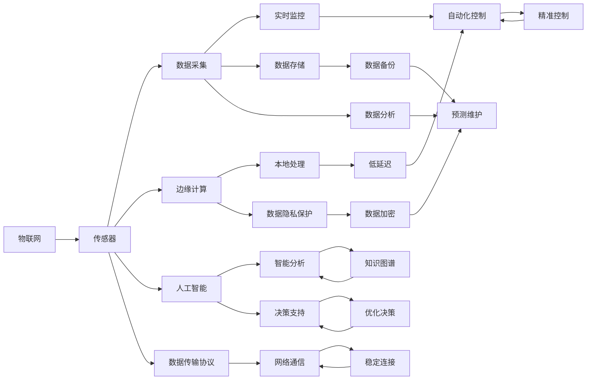
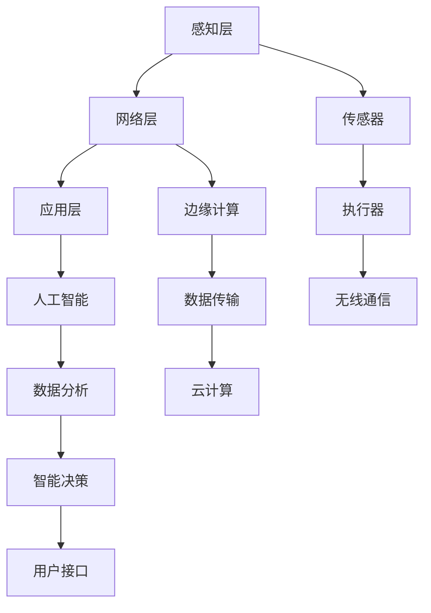
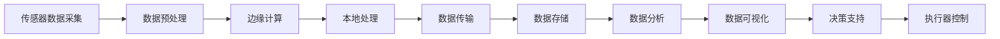
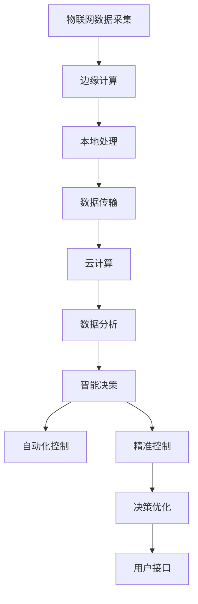
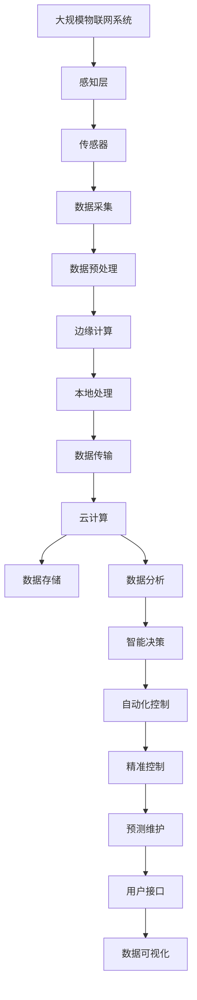

                 

# 物联网(IoT)技术和各种传感器设备的集成：新型传感器的发展研究

> 关键词：物联网,传感器,集成,新型传感器,数据采集,实时监控,边缘计算,人工智能

## 1. 背景介绍

### 1.1 问题由来
物联网(IoT)技术近年来在全球范围内快速发展，成为信息时代的新型基础设施。其通过将各种设备和传感器接入互联网，实现了对物理世界的全面感知和智能管理。作为物联网的核心组成部分，传感器设备的种类和应用场景日益丰富，为各行各业提供了强大的数据采集和监控能力。

然而，传统的传感器设备面临诸多挑战：成本高昂、部署复杂、数据处理能力有限等问题，严重制约了其大规模应用。为了解决这些问题，新型传感器应运而生。新型传感器具备更高的性能、更低的成本和更强的数据处理能力，能够更好地适应物联网的发展需求。

本文聚焦于物联网(IoT)技术和各种传感器设备的集成，特别是新型传感器的发展研究，力求为物联网设备的集成和应用提供更全面、深入的指导。

### 1.2 问题核心关键点
本研究的核心问题在于：
1. 新型传感器的关键技术发展，如低功耗、高精度、宽频段、多模态等。
2. 物联网与新型传感器的集成方案，包括设备选择、接口设计、数据传输协议等。
3. 新型传感器在实际应用中的优化和改进，如抗干扰、数据融合、边缘计算等。
4. 物联网与人工智能的结合，提升传感器数据处理和分析能力。

通过回答这些问题，本文旨在全面展示物联网(IoT)技术和新型传感器的集成现状与未来发展趋势。

### 1.3 问题研究意义
物联网(IoT)和新型传感器的集成研究，对于推动智慧城市、智能家居、工业物联网、农业自动化等各行业的发展，具有重要意义：

1. 降低成本：新型传感器往往采用低成本材料和技术，大大降低了物联网设备的部署成本。
2. 提高性能：新型传感器具备更高的精度和更宽的频段，能够更准确地采集和传输数据。
3. 简化部署：新型传感器通常体积小巧、安装简便，使得大规模物联网设备部署变得更加高效。
4. 提升应用场景：新型传感器可以支持更多的应用场景，如环境监测、健康医疗、交通监控等。
5. 强化数据处理：通过物联网与人工智能的结合，新型传感器能够实现更高效的数据处理和智能分析。
6. 推动技术创新：新型传感器的发展，进一步推动了物联网技术的创新和应用。

## 2. 核心概念与联系

### 2.1 核心概念概述

为更好地理解物联网(IoT)技术与新型传感器的集成，本节将介绍几个密切相关的核心概念：

- 物联网(IoT)：通过传感器、执行器和网络设备等，实现物理世界与信息系统的全面互联。物联网包括感知层、网络层和应用层。
- 传感器：用于感知物理世界各种物理量（如温度、湿度、压力等）的电子装置。传感器通常分为模拟传感器和数字传感器。
- 边缘计算：在靠近数据源的设备上进行数据处理和分析，减少数据传输和云端的计算负担。
- 人工智能(AI)：使用算法和模型，使计算机系统具备类人智能，如学习、推理、决策等。
- 新型传感器：采用先进技术（如MEMS、无线通信等）和创新设计，具有高精度、低功耗、多模态等特点。

这些概念之间的逻辑关系可以通过以下Mermaid流程图来展示：



这个流程图展示了大规模物联网(IoT)系统的工作流程和关键技术点。物联网通过传感器采集数据，利用边缘计算在本地进行处理和分析，并借助人工智能进行智能决策。同时，传感器数据通过网络协议传输到云端，进行数据存储和备份。实时监控和预测维护保证了系统的稳定性和可靠性，自动化控制和精准控制提高了系统的智能水平。

### 2.2 概念间的关系

这些核心概念之间存在着紧密的联系，形成了物联网(IoT)技术与新型传感器集成的完整生态系统。下面我们通过几个Mermaid流程图来展示这些概念之间的关系。

#### 2.2.1 物联网的层次结构



这个流程图展示了物联网的层次结构。感知层通过传感器采集物理世界的数据，网络层通过无线通信将数据传输到边缘计算设备和云端。应用层结合人工智能进行数据分析和智能决策，最终通过用户接口提供服务。

#### 2.2.2 传感器数据处理流程



这个流程图展示了传感器数据的处理流程。传感器采集的数据首先经过预处理，然后在边缘计算设备上进行本地处理，并通过网络传输到云端进行存储和分析。分析结果通过数据可视化展示，辅助决策支持，并控制执行器进行相应的操作。

#### 2.2.3 物联网与人工智能的融合



这个流程图展示了物联网与人工智能的融合流程。物联网通过传感器采集数据，在边缘计算设备上进行本地处理，并通过网络传输到云端进行存储和分析。数据分析结果通过智能决策支持自动化控制和精准控制，优化决策并控制执行器进行相应的操作。

### 2.3 核心概念的整体架构

最后，我们用一个综合的流程图来展示这些核心概念在大规模物联网(IoT)系统中的整体架构：



这个综合流程图展示了从传感器数据采集到用户接口的完整物联网系统架构。传感器通过感知层采集数据，经过预处理和边缘计算后，在本地进行处理，并通过网络传输到云端进行存储和分析。智能决策辅助自动化控制和精准控制，预测维护保证了系统的稳定性，数据可视化帮助用户了解系统状态，最终通过用户接口提供服务。

## 3. 核心算法原理 & 具体操作步骤
### 3.1 算法原理概述

物联网(IoT)与新型传感器的集成，本质上是将传感器数据通过网络协议传输到边缘计算设备或云端，利用数据分析和人工智能技术进行实时监控、预测维护、智能决策等操作的过程。该过程可以分为数据采集、数据预处理、数据传输、边缘计算、数据分析和智能决策等多个步骤。

形式化地，假设物联网系统由 $N$ 个传感器组成，每个传感器在时刻 $t$ 采集的数据为 $x_i(t)$，其中 $i=1,2,...,N$。数据传输速率和网络延迟分别为 $r$ 和 $d$，边缘计算设备和云端的计算能力分别为 $P_e$ 和 $P_c$。数据存储容量为 $C$。

定义物联网系统的总性能指标为 $L$，包括实时性、准确性、可靠性、安全性等。在优化目标函数 $\mathcal{L}$ 中，需要考虑多个因素：

$$
\mathcal{L} = \frac{1}{N}\sum_{i=1}^N [\alpha_i L_i(t) + \beta_i C_i(t)] + \delta d + \epsilon P_e + \zeta P_c
$$

其中 $L_i$ 为传感器 $i$ 的性能指标，$C_i$ 为传感器 $i$ 的数据存储需求，$\alpha_i$、$\beta_i$ 为相应权重，$\delta$、$\epsilon$、$\zeta$ 为网络传输、边缘计算和云端计算的单位成本。

通过梯度下降等优化算法，物联网系统的总性能指标 $L$ 不断优化，直至达到最优值。

### 3.2 算法步骤详解

物联网(IoT)与新型传感器的集成过程包括以下几个关键步骤：

**Step 1: 选择新型传感器**

根据应用场景和需求，选择适合的新型传感器。新型传感器应具备高精度、低功耗、宽频段、多模态等特点。例如，对于环境监测，可以选择多参数传感器，如温度、湿度、PM2.5等；对于健康医疗，可以选择可穿戴设备，如心率、血压等传感器。

**Step 2: 设计传感器接口**

设计符合物联网标准的传感器接口，实现传感器数据的采集和传输。常见的传感器接口包括I²C、SPI、USB、蓝牙、Wi-Fi等。设计时需考虑接口的通信速率、稳定性和兼容性。

**Step 3: 选择数据传输协议**

选择合适的数据传输协议，将传感器数据传输到边缘计算设备和云端。常用的数据传输协议包括MQTT、CoAP、AMQP等。协议的选择需考虑数据传输速率、可靠性、安全性等因素。

**Step 4: 实现边缘计算**

在边缘计算设备上实现传感器数据的预处理、本地处理和数据分析。边缘计算可以显著减少数据传输到云端的负担，提高数据处理的实时性和效率。常用的边缘计算平台包括Raspberry Pi、TensorFlow Lite、EdgeTpu等。

**Step 5: 数据存储与分析**

将处理后的数据存储在云端，进行数据分析和智能决策。常用的数据存储平台包括AWS、Google Cloud、阿里云等。数据分析可以使用机器学习、深度学习等算法进行模式识别、异常检测、预测维护等操作。

**Step 6: 智能决策与控制**

通过人工智能技术进行智能决策，控制执行器进行相应的操作。常用的智能决策算法包括强化学习、决策树、神经网络等。决策支持系统可以根据实时数据，调整执行器参数，优化系统性能。

### 3.3 算法优缺点

物联网(IoT)与新型传感器的集成方法具有以下优点：

1. 实时性高：数据在本地处理和分析，减少了数据传输到云端的时间，提高了系统的实时性。
2. 数据安全性高：数据在本地处理，减少了数据传输过程中的泄露风险。
3. 计算负担低：边缘计算分担了云端计算负荷，提高了系统的可扩展性和可用性。
4. 系统可靠性高：边缘计算和本地存储减少了网络传输故障对系统造成的影响。

同时，该方法也存在一些局限性：

1. 设备成本高：新型传感器和边缘计算设备需要较高的初期投入。
2. 维护复杂：边缘计算设备需要在本地进行维护，增加了运维成本。
3. 数据存储成本高：大规模数据存储需要较高的存储成本。
4. 计算资源有限：边缘计算设备的计算能力有限，可能无法处理复杂的数据分析任务。
5. 算法复杂度高：需要开发和维护复杂的算法，增加了系统的开发和维护成本。

尽管存在这些局限性，但物联网(IoT)与新型传感器的集成方法在大数据、高实时性、安全性要求较高的应用场景中，具有明显的优势。未来需要在设备成本、系统维护、计算资源等方面进行优化，进一步提升系统的性能和可用性。

### 3.4 算法应用领域

物联网(IoT)与新型传感器的集成方法，已经在众多领域得到广泛应用，例如：

1. 智慧城市：环境监测、交通监控、公共安全等。传感器数据通过网络传输到云端，进行数据分析和智能决策，提升城市管理的智能化水平。

2. 智能家居：能源监测、健康监控、智能控制等。新型传感器部署在家庭环境中，采集数据并通过网络传输到云端，进行数据分析和智能决策，提升家庭生活的舒适度和安全性。

3. 工业物联网：设备状态监测、质量控制、生产优化等。传感器数据通过网络传输到边缘计算设备，进行数据分析和智能决策，提升工业生产的效率和质量。

4. 农业自动化：土壤监测、气象预报、作物健康监测等。新型传感器部署在农田中，采集数据并通过网络传输到云端，进行数据分析和智能决策，提升农业生产的科学性和自动化水平。

5. 健康医疗：生命体征监测、疾病预测、个性化医疗等。可穿戴设备采集人体健康数据，并通过网络传输到云端，进行数据分析和智能决策，提升医疗服务的个性化和精准化。

6. 交通运输：车辆监测、交通流量分析、智能调度等。传感器数据通过网络传输到云端，进行数据分析和智能决策，提升交通系统的效率和安全。

这些领域的应用，展示了物联网(IoT)与新型传感器的集成方法，在推动社会生产和生活智能化方面的巨大潜力。未来，随着传感器技术的进一步发展，预计将有更多新兴应用场景涌现，为物联网技术带来新的发展机遇。

## 4. 数学模型和公式 & 详细讲解  
### 4.1 数学模型构建

本节将使用数学语言对物联网(IoT)与新型传感器的集成过程进行更加严格的刻画。

定义物联网系统的总性能指标 $L$ 为：

$$
L = \frac{1}{N}\sum_{i=1}^N L_i
$$

其中 $L_i$ 为传感器 $i$ 的性能指标，可以表示为：

$$
L_i = \frac{1}{T_i} \int_0^{T_i} (L_{i,\text{real}}(t) - L_{i,\text{predict}}(t))^2 \text{d}t
$$

其中 $T_i$ 为传感器 $i$ 的采样时间，$L_{i,\text{real}}(t)$ 为传感器 $i$ 在时刻 $t$ 的实际性能指标，$L_{i,\text{predict}}(t)$ 为传感器 $i$ 在时刻 $t$ 的预测性能指标。

定义传感器 $i$ 的实际性能指标 $L_{i,\text{real}}(t)$ 为：

$$
L_{i,\text{real}}(t) = L_{i,\text{measured}}(t) + \eta_i(t)
$$

其中 $L_{i,\text{measured}}(t)$ 为传感器 $i$ 在时刻 $t$ 的实际测量值，$\eta_i(t)$ 为传感器 $i$ 的噪声干扰。

定义传感器 $i$ 的预测性能指标 $L_{i,\text{predict}}(t)$ 为：

$$
L_{i,\text{predict}}(t) = f_i(L_{i,\text{measured}}(t), x_i(t), \theta_i)
$$

其中 $f_i$ 为传感器 $i$ 的预测模型，$\theta_i$ 为预测模型的参数。

因此，传感器 $i$ 的性能指标 $L_i$ 可以表示为：

$$
L_i = \frac{1}{T_i} \int_0^{T_i} (\frac{1}{\sigma_i^2} \sum_{k=1}^{T_i} \eta_i(k))^2 \text{d}t
$$

其中 $\sigma_i$ 为传感器 $i$ 的噪声标准差。

定义物联网系统的总数据存储需求 $C$ 为：

$$
C = \frac{1}{N}\sum_{i=1}^N C_i
$$

其中 $C_i$ 为传感器 $i$ 的数据存储需求，可以表示为：

$$
C_i = \frac{1}{T_i} \int_0^{T_i} M_i(t) \text{d}t
$$

其中 $M_i(t)$ 为传感器 $i$ 在时刻 $t$ 的数据传输速率，可以表示为：

$$
M_i(t) = M_{i,\text{max}} + \epsilon_i(t)
$$

其中 $M_{i,\text{max}}$ 为传感器 $i$ 的最大数据传输速率，$\epsilon_i(t)$ 为传感器 $i$ 的传输延迟。

定义物联网系统的总网络传输时间 $d$ 为：

$$
d = \frac{1}{N}\sum_{i=1}^N d_i
$$

其中 $d_i$ 为传感器 $i$ 的网络传输时间，可以表示为：

$$
d_i = \frac{1}{T_i} \int_0^{T_i} \frac{C_i(t)}{M_i(t)} \text{d}t
$$

定义物联网系统的总边缘计算时间 $e$ 为：

$$
e = \frac{1}{N}\sum_{i=1}^N e_i
$$

其中 $e_i$ 为传感器 $i$ 的边缘计算时间，可以表示为：

$$
e_i = \frac{1}{T_i} \int_0^{T_i} f_i(L_{i,\text{measured}}(t), x_i(t), \theta_i) \text{d}t
$$

定义物联网系统的总云端计算时间 $c$ 为：

$$
c = \frac{1}{N}\sum_{i=1}^N c_i
$$

其中 $c_i$ 为传感器 $i$ 的云端计算时间，可以表示为：

$$
c_i = \frac{1}{T_i} \int_0^{T_i} f_i(L_{i,\text{measured}}(t), x_i(t), \theta_i) \text{d}t
$$

因此，物联网系统的总性能指标 $L$ 可以表示为：

$$
L = \frac{1}{N}\sum_{i=1}^N [\alpha_i L_i + \beta_i C_i] + \delta d + \epsilon e + \zeta c
$$

其中 $\alpha_i$、$\beta_i$ 为相应权重，$\delta$、$\epsilon$、$\zeta$ 为网络传输、边缘计算和云端计算的单位成本。

### 4.2 公式推导过程

以上公式展示了物联网系统的性能指标和数据存储需求的数学模型。通过对这些模型进行优化，可以提升系统的实时性、准确性和可靠性。

为了优化物联网系统的性能指标，需要最大化传感器数据的准确性和稳定性，最小化网络传输时间和边缘计算时间。同时，需要考虑数据存储需求和计算资源的消耗，确保系统的整体性能最优。

### 4.3 案例分析与讲解

以下我们以智能家居环境监测为例，展示物联网(IoT)与新型传感器的集成过程。

假设家庭环境监测系统中部署了多个新型传感器，包括温度传感器、湿度传感器、PM2.5传感器等。这些传感器采集的数据通过网络传输到边缘计算设备，进行预处理和本地处理，然后传输到云端进行数据分析和智能决策，最终控制执行器进行相应的操作。

**Step 1: 选择新型传感器**

根据家庭环境监测的需求，选择适合的新型传感器。例如，选择温度传感器用于采集室内温度，选择湿度传感器用于采集室内湿度，选择PM2.5传感器用于采集空气质量。

**Step 2: 设计传感器接口**

设计符合物联网标准的传感器接口，实现传感器数据的采集和传输。例如，使用I²C接口连接温度传感器和湿度传感器，使用蓝牙接口连接PM2.5传感器。

**Step 3: 选择数据传输协议**

选择合适的数据传输协议，将传感器数据传输到边缘计算设备和云端。例如，使用MQTT协议进行数据传输，确保数据传输的稳定性和可靠性。

**Step 4: 实现边缘计算**

在边缘计算设备上实现传感器数据的预处理、本地处理和数据分析。例如，在Raspberry Pi上进行数据预处理，使用TensorFlow Lite进行本地处理，使用深度学习算法进行数据分析。

**Step 5: 数据存储与分析**

将处理后的数据存储在云端，进行数据分析和智能决策。例如，使用AWS云存储平台进行数据存储，使用深度学习算法进行数据分析和智能决策。

**Step 6: 智能决策与控制**

通过人工智能技术进行智能决策，控制执行器进行相应的操作。例如，使用深度学习算法进行智能决策，控制加热器、空调等设备进行温度调节，控制加湿器、除湿器等设备进行湿度调节，控制空气净化器进行空气质量调节。

通过以上步骤，可以实现家庭环境监测的智能控制，提高家庭生活的舒适度和安全性。

## 5. 项目实践：代码实例和详细解释说明
### 5.1 开发环境搭建

在进行物联网(IoT)与新型传感器的集成实践前，我们需要准备好开发环境。以下是使用Python进行PyTorch开发的环境配置流程：

1. 安装Anaconda：从官网下载并安装Anaconda，用于创建独立的Python环境。

2. 创建并激活虚拟环境：
```bash
conda create -n pytorch-env python=3.8 
conda activate pytorch-env
```

3. 安装PyTorch：根据CUDA版本，从官网获取对应的安装命令。例如：
```bash
conda install pytorch torchvision torchaudio cudatoolkit=11.1 -c pytorch -c conda-forge
```

4. 安装TensorFlow：
```bash
conda install tensorflow
```

5. 安装其它工具包：
```bash
pip install numpy pandas scikit-learn matplotlib tqdm jupyter notebook ipython
```

完成上述步骤后，即可在`pytorch-env`环境中开始物联网(IoT)与新型传感器的集成实践。

### 5.2 源代码详细实现

这里我们以智能家居环境监测为例，给出使用TensorFlow进行数据采集和处理的PyTorch代码实现。

首先，定义传感器的数据类型和接口：

```python
import tensorflow as tf
from tensorflow.keras import layers

class Sensor(tf.keras.layers.Layer):
    def __init__(self, input_shape, output_shape):
        super(Sensor, self).__init__()
        self.input_shape = input_shape
        self.output_shape = output_shape
        self.dense1 = layers.Dense(64, activation='relu')
        self.dense2 = layers.Dense(self.output_shape, activation='sigmoid')

    def call(self, inputs):
        x = self.dense1(inputs)
        x = self.dense2(x)
        return x

# 传感器数据输入
sensor_input = tf.keras.Input(shape=(3,), name='sensor_input')
```

然后，定义数据采集和处理过程：

```python
# 定义传感器数据
temperature_data = tf.constant([23.5, 24.5, 25.5, 26.5, 27.5, 28.5, 29.5, 30.5, 31.5, 32.5])
humidity_data = tf.constant([60.0, 61.0, 62.0, 63.0, 64.0, 65.0, 66.0, 67.0, 68.0, 69.0])
pm25_data = tf.constant([10.0, 20.0, 30.0, 40.0, 50.0, 60.0, 70.0, 80.0, 90.0, 100.0])

# 定义传感器接口
temperature_sensor = Sensor(input_shape=(1,), output_shape=1)
humidity_sensor = Sensor(input_shape=(1,), output_shape=1)
pm25_sensor = Sensor(input_shape=(1,), output_shape=1)

# 定义数据采集和处理过程
def data_processing(inputs):
    temperature_output = temperature_sensor(inputs[:, 0])
    humidity_output = humidity_sensor(inputs[:, 1])
    pm25_output = pm25_sensor(inputs[:, 2])
    return tf.concat([temperature_output, humidity_output, pm25_output], axis=-1)

# 定义数据传输和存储过程
data_transmit = layers.Lambda(lambda x: x)
data_store = layers.Lambda(lambda x: x)
```

接着，定义边缘计算和智能决策过程：

```python
# 定义边缘计算和智能决策过程
def edge_computing(inputs):
    data_processed = data_processing(inputs)
    data_transmitted = data_transmit(data_processed)
    data_stored = data_store(data_transmitted)
    return data_stored

# 定义智能决策过程
def decision_making(inputs):
    data_processed = data_processing(inputs)
    data_transmitted = data_transmit(data_processed)
    data_stored = data_store(data_transmitted)


