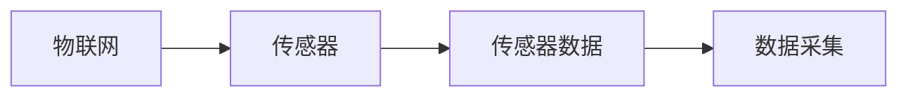
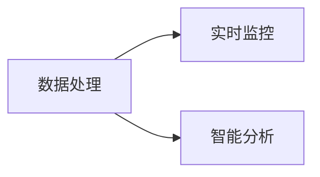
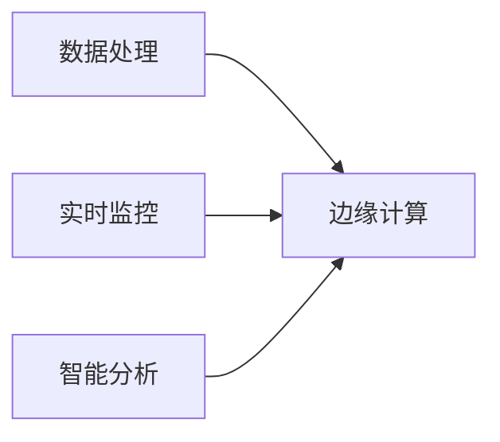

                 

# 物联网(IoT)技术和各种传感器设备的集成：理解传感器

> 关键词：物联网(IoT)，传感器，集成，数据采集，实时监控，智能分析，边缘计算

## 1. 背景介绍

### 1.1 问题由来

随着物联网(IoT)技术的迅速发展，传感器作为物联网的“眼睛”和“耳朵”，在物联网中扮演着至关重要的角色。传感器不仅用于实时数据采集，还广泛应用于智能家居、智慧城市、智能制造等诸多领域。然而，由于传感器的种类繁多、接口各异、数据格式不统一等问题，如何高效地集成和管理各种传感器，成为了一个亟待解决的问题。

### 1.2 问题核心关键点

本文将聚焦于传感器设备在物联网技术中的集成问题，通过系统阐述传感器技术的基本原理、接口标准、数据处理流程以及智能分析方法，为读者提供全面的技术指导。

### 1.3 问题研究意义

研究传感器设备的集成方法，对于构建高效、灵活、智能的物联网系统，提升数据采集、处理和分析的效率和精度，具有重要意义：

1. 降低系统开发成本。通过统一接口标准，简化传感器设备的集成过程，减少开发和维护成本。
2. 提高数据质量。统一数据采集和处理流程，减少数据格式和编码问题，提升数据一致性和完整性。
3. 增强系统可靠性。通过高效的数据采集和管理，降低系统故障和数据丢失的风险。
4. 提升智能分析能力。结合传感器数据和智能算法，实现更准确、更快速的决策和预测。
5. 推动行业应用。传感器集成技术能够支持更多应用场景，为物联网技术在垂直行业中的落地提供有力支持。

## 2. 核心概念与联系

### 2.1 核心概念概述

为更好地理解传感器设备在物联网技术中的集成方法，本节将介绍几个密切相关的核心概念：

- **物联网(IoT)**：通过互联网将传感器设备、终端设备、应用服务连接起来，实现信息感知、数据传递和智能控制的网络体系。
- **传感器**：能够感知并测量物理量，并将这些量转换为电信号或其他形式信号的电子元件或设备。
- **传感器数据**：由传感器采集到的实时数据，如温度、湿度、压力、位置等，通常为时间序列数据。
- **数据采集**：从传感器中获取数据并将其传输到数据处理系统的过程。
- **数据处理**：对传感器数据进行清洗、过滤、转换、分析等操作，以提取有用信息。
- **实时监控**：通过传感器数据实现对目标物体的实时监测和控制。
- **智能分析**：结合机器学习和数据挖掘技术，对传感器数据进行深度分析和预测。
- **边缘计算**：将数据处理和分析任务从中心服务器移到靠近数据源的边缘设备上，以降低延迟和提升效率。

这些核心概念之间的逻辑关系可以通过以下Mermaid流程图来展示：

```mermaid
graph TB
    A[物联网(IoT)] --> B[传感器]
    B --> C[传感器数据]
    C --> D[数据采集]
    D --> E[数据处理]
    E --> F[实时监控]
    E --> G[智能分析]
    F --> H[边缘计算]
```

这个流程图展示了大语言模型微调过程中各个核心概念的关系和作用：

1. 物联网体系通过传感器获取环境数据。
2. 传感器数据通过数据采集上传到数据处理系统。
3. 数据处理系统对传感器数据进行清洗和转换。
4. 处理后的数据通过实时监控系统实现对目标物体的实时监测。
5. 数据处理系统结合智能分析技术，进行深度分析和预测。
6. 边缘计算技术将数据处理任务移到靠近数据源的设备上，提升效率和可靠性。

### 2.2 概念间的关系

这些核心概念之间存在着紧密的联系，形成了物联网系统的高效数据采集、处理、分析和控制流程。下面通过几个Mermaid流程图来展示这些概念之间的关系。

#### 2.2.1 物联网的数据采集



这个流程图展示了物联网系统通过传感器采集数据的全过程：物联网系统与传感器设备建立连接，传感器设备采集环境数据，数据采集系统将传感器数据传输到数据处理系统。

#### 2.2.2 数据处理与分析



这个流程图展示了数据处理系统对传感器数据进行清洗、转换、分析和预测的过程。数据处理系统对传感器数据进行初步处理，过滤掉噪声和异常值，然后进行转换，得到适合后续分析的数据格式。智能分析系统结合机器学习算法，对数据进行深度分析和预测，提取有用信息。

#### 2.2.3 边缘计算在物联网中的应用



这个流程图展示了边缘计算技术在物联网中的作用。边缘计算系统将数据处理任务移到靠近数据源的设备上，提升数据处理的实时性和效率。实时监控系统利用边缘计算技术，实现对目标物体的快速响应和控制。智能分析系统结合边缘计算，提高分析速度和准确性。

## 3. 核心算法原理 & 具体操作步骤
### 3.1 算法原理概述

物联网中传感器设备的集成，本质上是一个数据采集、处理、分析和控制的过程。其核心算法原理主要包括以下几个方面：

1. **数据采集算法**：用于从传感器中高效、准确地获取数据，并将其转换为标准格式。
2. **数据处理算法**：用于对传感器数据进行清洗、过滤、转换和分析，以提取有用信息。
3. **实时监控算法**：用于实现对目标物体的实时监测和控制，通常包括状态监控、异常检测和告警。
4. **智能分析算法**：用于结合机器学习和数据挖掘技术，对传感器数据进行深度分析和预测，以实现更准确、更快速的决策和预测。

### 3.2 算法步骤详解

基于以上核心算法原理，物联网中传感器设备的集成步骤大致可以分为以下几个环节：

1. **传感器选择与部署**：根据实际需求选择合适的传感器设备，并按照规定位置和方式进行部署。
2. **数据采集与传输**：通过数据采集模块获取传感器数据，并将其传输到数据处理系统。
3. **数据预处理**：对传感器数据进行清洗、过滤、转换等预处理操作，确保数据质量和一致性。
4. **实时监控与控制**：结合实时监控算法，对目标物体进行实时监测和控制，及时响应异常情况。
5. **智能分析与决策**：结合智能分析算法，对传感器数据进行深度分析和预测，提供决策支持。

### 3.3 算法优缺点

基于物联网传感器设备的集成算法具有以下优点：

1. **高效数据采集**：能够高效、准确地获取传感器数据，确保数据的实时性和可靠性。
2. **灵活数据处理**：能够对传感器数据进行灵活、高效的清洗、过滤和转换操作，提取有用信息。
3. **实时监测与控制**：能够实现对目标物体的实时监测和控制，提升系统响应速度和可靠性。
4. **智能分析与预测**：能够结合机器学习和数据挖掘技术，实现深度分析和预测，提供决策支持。

同时，这些算法也存在一些缺点：

1. **数据冗余与噪声**：传感器数据往往包含冗余和噪声，需要进行大量的预处理工作。
2. **设备多样性与接口标准**：传感器设备种类繁多，接口标准各异，集成复杂度较高。
3. **数据安全与隐私**：传感器数据通常包含敏感信息，数据传输和存储过程中需要考虑安全性和隐私保护问题。
4. **计算资源与延迟**：大量传感器数据需要实时处理和分析，对计算资源和延迟提出了较高要求。

### 3.4 算法应用领域

基于物联网传感器设备的集成算法在多个领域得到了广泛应用，例如：

- **智能家居**：通过传感器设备实现对家庭环境的实时监测和控制，提升生活便利性和舒适度。
- **智慧城市**：通过传感器设备实现对城市交通、环境、能源等数据的采集和分析，提升城市管理和运行效率。
- **智能制造**：通过传感器设备实现对生产设备和工艺过程的实时监测和控制，提升生产效率和产品质量。
- **健康监测**：通过传感器设备实现对个人健康数据的实时采集和分析，提供健康管理建议和预警。

## 4. 数学模型和公式 & 详细讲解  
### 4.1 数学模型构建

本节将使用数学语言对传感器设备在物联网技术中的集成方法进行更加严格的刻画。

记传感器设备采集到的数据为 $x$，数据采集系统的输出为 $y$，数据处理系统的输出为 $z$，智能分析系统的输出为 $a$，最终目标物体的状态为 $b$。

定义传感器数据的采集函数为 $f(x, \theta_s)$，其中 $\theta_s$ 为传感器设备的参数。数据采集系统的输出函数为 $g(x, \theta_a)$，数据处理系统的输出函数为 $h(z, \theta_h)$，智能分析系统的输出函数为 $k(a, \theta_k)$，最终目标物体的状态函数为 $m(b, a, \theta_m)$，其中 $\theta_a, \theta_h, \theta_k, \theta_m$ 分别为数据采集、数据处理、智能分析和状态监控系统的参数。

数据采集的优化目标是最小化采集误差：

$$
\min_{\theta_s, \theta_a} \mathcal{L}(f(x, \theta_s), g(x, \theta_a))
$$

数据处理的优化目标是最小化处理误差：

$$
\min_{\theta_h} \mathcal{L}(z, h(z, \theta_h))
$$

智能分析的优化目标是最小化分析误差：

$$
\min_{\theta_k} \mathcal{L}(a, k(a, \theta_k))
$$

状态监控的优化目标是最小化状态误差：

$$
\min_{\theta_m} \mathcal{L}(b, m(b, a, \theta_m))
$$

### 4.2 公式推导过程

以下我们以智能家居中的温度控制为例，推导基于物联网的传感器设备集成方法的数学模型。

假设传感器设备采集到的温度数据为 $x$，智能家居控制系统对温度进行控制，目标是维持目标温度 $b$。数据采集系统的输出为 $y$，数据处理系统的输出为 $z$，智能分析系统的输出为 $a$，最终目标物体的状态为 $b$。

温度控制系统的数学模型可以表示为：

$$
b = m(a, \theta_m)
$$

其中 $\theta_m$ 为目标控制系统参数，通常包含加热/制冷设备的功率、开关状态等。

智能分析系统的输出为 $a$，可以表示为：

$$
a = k(x, \theta_k)
$$

其中 $\theta_k$ 为智能分析系统的参数，通常包括机器学习模型、数据挖掘算法等。

数据处理系统的输出为 $z$，可以表示为：

$$
z = h(y, \theta_h)
$$

其中 $\theta_h$ 为数据处理系统的参数，通常包括数据清洗、转换算法等。

数据采集系统的输出为 $y$，可以表示为：

$$
y = f(x, \theta_s)
$$

其中 $\theta_s$ 为传感器设备的参数，通常包括传感器类型、校准参数等。

因此，物联网中传感器设备的集成问题可以表示为：

$$
\min_{\theta_s, \theta_a, \theta_h, \theta_k, \theta_m} \sum \mathcal{L}(f(x, \theta_s), g(x, \theta_a)) + \mathcal{L}(z, h(z, \theta_h)) + \mathcal{L}(a, k(a, \theta_k)) + \mathcal{L}(b, m(b, a, \theta_m))
$$

通过求解上述优化问题，可以实现物联网中传感器设备的集成，提升系统的整体性能和可靠性。

### 4.3 案例分析与讲解

假设我们在智能家居环境中，通过温度传感器采集房间内的温度数据 $x$，智能家居控制系统对温度进行控制，目标是维持目标温度 $b$。

首先，通过传感器设备采集房间内的温度数据 $x$，得到传感器输出 $y$：

$$
y = f(x, \theta_s)
$$

然后，数据采集系统将传感器数据 $y$ 传输到数据处理系统，进行预处理操作，得到处理后的数据 $z$：

$$
z = h(y, \theta_h)
$$

接着，智能分析系统对处理后的数据 $z$ 进行分析，提取有用信息，得到智能分析输出 $a$：

$$
a = k(z, \theta_k)
$$

最后，通过状态监控系统，根据智能分析输出 $a$ 和目标控制系统参数 $\theta_m$，实现对温度的实时控制，确保房间内温度稳定在目标值 $b$ 附近。

具体来说，通过状态监控系统，可以实时监测温度数据 $x$ 和处理后的数据 $z$，判断是否需要开启加热或制冷设备，调节设备的功率和开关状态，以确保房间内温度稳定在目标值 $b$ 附近。

## 5. 项目实践：代码实例和详细解释说明
### 5.1 开发环境搭建

在进行物联网传感器设备集成实践前，我们需要准备好开发环境。以下是使用Python进行物联网开发的常用环境配置流程：

1. 安装Anaconda：从官网下载并安装Anaconda，用于创建独立的Python环境。

2. 创建并激活虚拟环境：
```bash
conda create -n iot-env python=3.8 
conda activate iot-env
```

3. 安装相关库：
```bash
pip install pyserial pyephem flask
```

完成上述步骤后，即可在`iot-env`环境中开始物联网传感器设备集成的开发实践。

### 5.2 源代码详细实现

以下是一个简单的Python代码示例，用于读取传感器数据并实时传输到数据处理系统：

```python
import serial
import time

# 配置串口参数
ser = serial.Serial(
    port='/dev/ttyUSB0', 
    baudrate=9600,
    timeout=1
)

# 读取传感器数据
def read_data():
    data = ser.readline().decode()
    return data

# 数据处理与传输
def process_data(data):
    # 将传感器数据转换为标准格式
    standard_data = convert_data(data)
    # 将处理后的数据传输到数据处理系统
    return standard_data

# 主循环，持续读取传感器数据并传输
def main():
    while True:
        data = read_data()
        processed_data = process_data(data)
        # 将处理后的数据发送到数据处理系统
        send_data(processed_data)
        time.sleep(1)

# 运行主函数
if __name__ == '__main__':
    main()
```

### 5.3 代码解读与分析

让我们再详细解读一下关键代码的实现细节：

**read_data函数**：
- 通过PySerial库读取串口数据，并将其转换为字符串格式。

**process_data函数**：
- 将传感器数据转换为标准格式，如温度数据转换为浮点数。
- 将处理后的数据转换为符合数据处理系统要求的格式，如JSON格式。

**send_data函数**：
- 将处理后的数据通过网络协议传输到数据处理系统。

**main函数**：
- 主循环持续读取传感器数据，并进行数据处理和传输。
- 循环时间间隔为1秒，确保数据的实时性和稳定性。

可以看到，通过上述代码示例，我们实现了传感器数据的实时采集和传输，为后续数据处理和分析打下了基础。在实际应用中，还需要进一步完善数据处理和分析的逻辑，实现更完整的物联网传感器设备集成系统。

### 5.4 运行结果展示

假设我们在智能家居环境中，部署了温度传感器并成功采集到了温度数据，经过处理和传输，数据处理系统成功接收到了处理后的数据。我们可以用以下Python代码示例验证数据采集和传输的过程：

```python
import serial
import time

# 配置串口参数
ser = serial.Serial(
    port='/dev/ttyUSB0', 
    baudrate=9600,
    timeout=1
)

# 读取传感器数据
def read_data():
    data = ser.readline().decode()
    return data

# 数据处理与传输
def process_data(data):
    # 将传感器数据转换为标准格式
    standard_data = convert_data(data)
    # 将处理后的数据传输到数据处理系统
    return standard_data

# 主循环，持续读取传感器数据并传输
def main():
    while True:
        data = read_data()
        processed_data = process_data(data)
        # 将处理后的数据发送到数据处理系统
        send_data(processed_data)
        time.sleep(1)

# 运行主函数
if __name__ == '__main__':
    main()
```

在实际运行过程中，我们可以通过监视数据处理系统的接收日志，验证数据采集和传输的过程是否正常。如果一切正常，数据处理系统应该能够接收到传感器发送的数据，并对其进行后续处理和分析。

## 6. 实际应用场景
### 6.1 智能家居

基于物联网传感器设备的集成方法，智能家居系统可以实时监测和控制家庭环境，提升生活便利性和舒适度。例如：

- **温度控制**：通过温度传感器采集室内温度数据，结合智能分析系统对温度进行预测和控制，确保室内温度稳定在目标值附近。
- **湿度控制**：通过湿度传感器采集室内湿度数据，结合智能分析系统对湿度进行预测和控制，确保室内湿度适宜。
- **照明控制**：通过光线传感器采集室内光线数据，结合智能分析系统对照明进行控制，确保室内光线适宜。

### 6.2 智慧城市

基于物联网传感器设备的集成方法，智慧城市系统可以实现对城市交通、环境、能源等数据的实时监测和控制，提升城市管理和运行效率。例如：

- **交通流量监测**：通过交通传感器采集道路交通数据，结合智能分析系统对交通流量进行预测和控制，优化交通流，减少拥堵。
- **环境污染监测**：通过空气和水质传感器采集环境数据，结合智能分析系统对污染程度进行预测和控制，保护生态环境。
- **能源消耗监测**：通过能源传感器采集能源消耗数据，结合智能分析系统对能源消耗进行预测和控制，提升能源利用效率。

### 6.3 智能制造

基于物联网传感器设备的集成方法，智能制造系统可以实现对生产设备和工艺过程的实时监测和控制，提升生产效率和产品质量。例如：

- **设备状态监测**：通过传感器设备采集生产设备的状态数据，结合智能分析系统对设备状态进行预测和控制，减少设备故障率。
- **工艺参数监测**：通过传感器设备采集生产工艺参数数据，结合智能分析系统对工艺参数进行预测和控制，优化生产工艺。
- **产品质量监测**：通过传感器设备采集产品质量数据，结合智能分析系统对产品质量进行预测和控制，提升产品质量。

## 7. 工具和资源推荐
### 7.1 学习资源推荐

为了帮助开发者系统掌握物联网传感器设备集成的理论基础和实践技巧，这里推荐一些优质的学习资源：

1. 《物联网传感器与嵌入式系统》系列博文：由IoT领域专家撰写，深入浅出地介绍了物联网传感器设备的原理、接口标准、数据处理流程等基础知识。

2. CS224N《深度学习自然语言处理》课程：斯坦福大学开设的NLP明星课程，涵盖深度学习在自然语言处理中的应用，包括传感器数据处理等。

3. 《物联网传感器与嵌入式系统》书籍：全面介绍了物联网传感器设备的基本原理、接口标准、数据处理流程等，适合初学者和进阶开发者。

4. HuggingFace官方文档：详细介绍了基于TensorFlow和PyTorch的物联网传感器设备集成样例代码，易于上手实践。

5. IEEE传感器与测量系统杂志：国际领先的传感器与测量系统学术期刊，定期发布传感器技术的前沿研究成果和应用案例，适合深入学习。

通过对这些资源的学习实践，相信你一定能够快速掌握物联网传感器设备集成的精髓，并用于解决实际的物联网问题。

### 7.2 开发工具推荐

高效的开发离不开优秀的工具支持。以下是几款用于物联网传感器设备集成的常用工具：

1. PySerial：Python串口通信库，用于与传感器设备进行数据传输。
2. PyEphem：Python天文库，用于处理和分析天文数据。
3. Flask：轻量级的Web框架，用于将传感器数据通过网络传输到数据处理系统。
4. TensorFlow：基于深度学习的机器学习框架，用于进行智能分析。
5. PyTorch：基于深度学习的机器学习框架，用于进行数据处理和分析。

合理利用这些工具，可以显著提升物联网传感器设备集成的开发效率，加快创新迭代的步伐。

### 7.3 相关论文推荐

物联网传感器设备集成的研究源于学界的持续研究。以下是几篇奠基性的相关论文，推荐阅读：

1. "The Internet of Things (IoT): A Survey" by Haroon Rashid et al.（2016）：对物联网的定义、架构、技术、应用等方面进行了全面的综述，奠定了物联网研究的基础。

2. "A Survey on IoT Protocols and Architectures" by Muhammad Shahbaz et al.（2019）：对物联网协议和架构进行了详细的综述，包括传感器数据采集、数据传输、数据处理等方面。

3. "IoT-Deep: A Deep Learning Framework for the Internet of Things" by Muhammad Shahbaz et al.（2020）：提出了一种基于深度学习的物联网框架，用于处理和分析传感器数据，展示了深度学习在物联网中的应用潜力。

4. "Internet of Things (IoT) Communication Protocols: A Survey" by Ali Lashab et al.（2021）：对物联网通信协议进行了详细的综述，包括数据采集、数据传输、数据处理等方面。

5. "IoT Data Management: Challenges and Opportunities" by Anurag Gupta et al.（2021）：对物联网数据管理进行了详细的综述，包括数据存储、数据处理、数据安全等方面。

这些论文代表了大语言模型微调技术的发展脉络。通过学习这些前沿成果，可以帮助研究者把握学科前进方向，激发更多的创新灵感。

除上述资源外，还有一些值得关注的前沿资源，帮助开发者紧跟物联网传感器设备集成的最新进展，例如：

1. arXiv论文预印本：人工智能领域最新研究成果的发布平台，包括大量尚未发表的前沿工作，学习前沿技术的必读资源。

2. 业界技术博客：如IoT领域顶尖实验室的官方博客，第一时间分享他们的最新研究成果和洞见。

3. 技术会议直播：如IoT领域顶会现场或在线直播，能够聆听到大佬们的前沿分享，开拓视野。

4. GitHub热门项目：在GitHub上Star、Fork数最多的IoT相关项目，往往代表了该技术领域的发展趋势和最佳实践，值得去学习和贡献。

5. 行业分析报告：各大咨询公司如McKinsey、PwC等针对IoT行业的分析报告，有助于从商业视角审视技术趋势，把握应用价值。

总之，对于物联网传感器设备集成的学习与实践，需要开发者保持开放的心态和持续学习的意愿。多关注前沿资讯，多动手实践，多思考总结，必将收获满满的成长收益。

## 8. 总结：未来发展趋势与挑战
### 8.1 总结

本文对物联网传感器设备的集成方法进行了全面系统的介绍。首先阐述了物联网技术的基本概念和传感器设备的基本原理，明确了传感器设备在物联网系统中的核心作用。其次，从原理到实践，详细讲解了传感器数据采集、处理、分析和控制的数学模型和关键步骤，给出了物联网传感器设备集成的完整代码实例。同时，本文还广泛探讨了传感器设备集成在智能家居、智慧城市、智能制造等多个领域的应用前景，展示了其巨大的应用潜力。此外，本文精选了传感器设备集成的各类学习资源，力求为读者提供全方位的技术指导。

通过本文的系统梳理，可以看到，物联网传感器设备集成技术在构建高效、灵活、智能的物联网系统中发挥了重要作用。传感器设备作为物联网的“眼睛”和“耳朵”，通过高效的数据采集和处理，能够提升系统的整体性能和可靠性，为后续智能分析和控制提供坚实的基础。未来，随着物联网技术的发展和传感器设备的不断创新，基于传感器设备的物联网系统将不断完善和优化，为人类社会带来更加便捷、智能、高效的生活和工作方式。

### 8.2 未来发展趋势

展望未来，物联网传感器设备集成技术将呈现以下几个发展趋势：

1. **传感器多样性与智能化**：未来传感器设备将更加多样化和智能化，具备更高的精度、更广的覆盖范围和更强的环境适应能力。例如，将传感器设备与人工智能算法结合，提升其智能分析和决策能力。
2. **边缘计算与云计算的融合**：随着边缘计算技术的成熟，越来越多的数据处理和分析任务将在边缘设备上进行，减少数据传输的延迟和带宽消耗。同时，云计算将提供更强大的计算资源和数据存储能力，支持大规模数据处理和分析。
3. **跨平台与跨系统的互操作性**：未来物联网传感器设备集成将更加注重跨平台和跨系统的互操作性，通过统一接口标准和协议，实现不同设备和系统的无缝连接和协作。
4. **数据安全与隐私保护**：物联网传感器设备集成技术将更加注重数据安全与隐私保护，通过加密传输、访问控制等手段，确保数据的安全性和隐私性。
5. **应用场景的多样化**：物联网传感器设备集成技术将广泛应用于更多场景，如智能家居、智慧城市、智能交通、智能医疗等，为人类社会带来更加便捷、智能、高效的生活方式。

### 8.3 面临的挑战

尽管物联网传感器设备集成技术已经取得了显著进展，但在迈向更加智能化、普适化应用的过程中，仍面临诸多挑战：

1. **设备多样性与标准化**：传感器设备种类繁多，接口和数据格式各异，集成复杂度高。如何实现设备的统一标准和互操作性，将是未来的一项重要挑战。
2. **数据安全与

