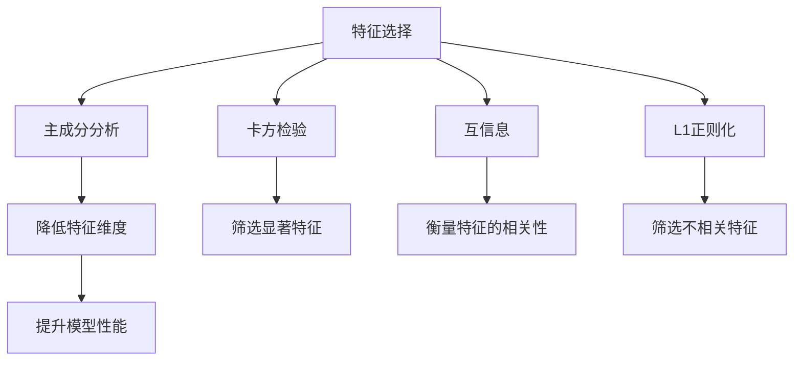
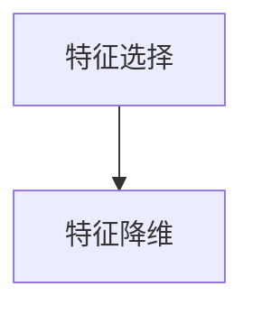
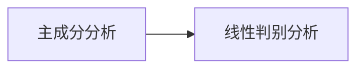
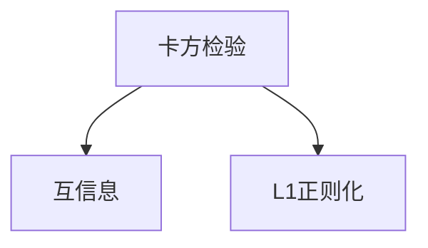
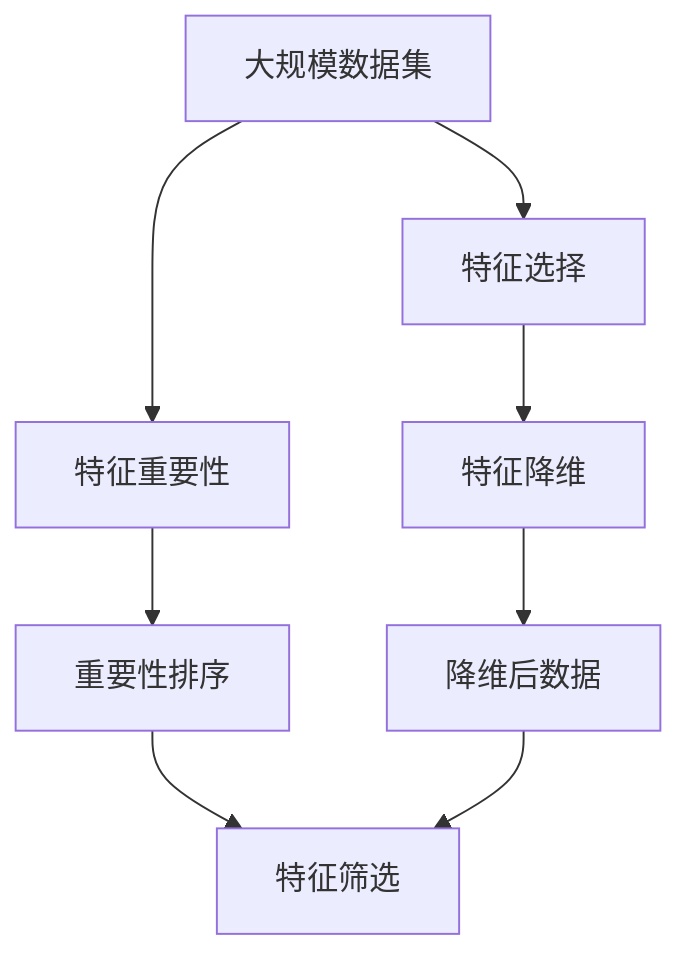

                 

# 特征选择与特征降维原理与代码实战案例讲解

> 关键词：特征选择,特征降维,PCA,主成分分析,线性判别分析,LDA,特征重要性,Scikit-Learn,Matplotlib

## 1. 背景介绍

在机器学习领域，数据集中的特征往往是高度相关的。一方面，过量的无关特征不仅会引入噪声，增加计算复杂度，还可能导致过拟合。另一方面，特征之间的冗余性会降低模型学习能力和泛化能力。因此，在进行机器学习建模之前，选择合适的特征是至关重要的。

### 1.1 问题由来

特征选择和特征降维是数据预处理中的重要步骤，可以有效提升模型的性能。特别是当数据集特征维度极高时，特征选择和特征降维显得尤为重要。尽管特征选择和特征降维涉及诸多算法，但每个算法都有其特定的适用场景和优缺点。

特征选择旨在从众多特征中选取最有用的特征，减少冗余性，降低计算复杂度。特征降维则是在减少特征数目的同时，保持数据表达能力，提升模型性能。本文将详细介绍这两种方法，并通过Scikit-Learn库进行案例实践。

### 1.2 问题核心关键点

核心问题：如何在数据预处理阶段，有效降低特征维度，提高模型的泛化能力和性能。

解决方案：通过特征选择算法和特征降维算法，优化特征集，提升模型性能。

### 1.3 问题研究意义

特征选择和特征降维是机器学习中的核心技术，可以显著提升模型的性能，降低计算复杂度，减少过拟合风险。在实际应用中，特征选择和特征降维技术在信号处理、图像识别、文本分类、推荐系统等多个领域均有广泛应用。掌握这些技术，对从事数据科学、机器学习等领域的开发者具有重要意义。

## 2. 核心概念与联系

### 2.1 核心概念概述

为更好地理解特征选择与特征降维技术，本节将介绍几个密切相关的核心概念：

- **特征选择（Feature Selection）**：从原始特征集中选择最具预测能力的特征子集，去除冗余和噪声，提高模型性能。
- **特征降维（Feature Dimensionality Reduction）**：将高维特征映射到低维空间，降低计算复杂度，提升模型泛化能力。
- **主成分分析（Principal Component Analysis, PCA）**：一种常用的特征降维算法，通过线性变换将高维数据映射到低维空间，保留数据的主要变化方向。
- **线性判别分析（Linear Discriminant Analysis, LDA）**：一种有监督的特征降维算法，通过线性变换在降低特征维度的同时，提升分类性能。
- **卡方检验（Chi-squared Test）**：一种常用的特征选择算法，通过计算特征与目标变量之间的关联性，筛选显著特征。
- **互信息（Mutual Information）**：一种特征选择算法，通过计算特征与目标变量之间的信息熵，衡量特征的相关性。
- **L1正则化（L1 Regularization）**：一种特征选择算法，通过L1范数惩罚，筛选不相关特征。

这些概念之间的逻辑关系可以通过以下Mermaid流程图来展示：



这个流程图展示了大语言模型微调过程中各个核心概念的关系和作用：

1. 特征选择算法通过不同的方式筛选显著特征。
2. 主成分分析和线性判别分析通过线性变换降低特征维度。
3. 特征选择和降维算法在减少特征数目的同时，提高了模型的性能。

### 2.2 概念间的关系

这些核心概念之间存在着紧密的联系，形成了特征选择与降维技术的完整生态系统。下面我们通过几个Mermaid流程图来展示这些概念之间的关系。

#### 2.2.1 特征选择与特征降维的关联



这个流程图展示了特征选择和特征降维之间的关联。特征降维通常是在特征选择之后进行的，通过降低特征维度，进一步提升模型性能。

#### 2.2.2 主成分分析与线性判别分析的关联



这个流程图展示了主成分分析和线性判别分析之间的关系。主成分分析是一种无监督的降维方法，而线性判别分析则是有监督的降维方法，二者的共同目标是降低特征维度，提高数据表达能力。

#### 2.2.3 特征选择算法的比较



这个流程图展示了三种特征选择算法的比较。卡方检验和互信息是通过统计特征与目标变量之间的关系，筛选显著特征。L1正则化则是通过范数惩罚，筛选不相关特征。

### 2.3 核心概念的整体架构

最后，我们用一个综合的流程图来展示这些核心概念在大语言模型微调过程中的整体架构：



这个综合流程图展示了从数据集预处理到特征选择的完整过程。大规模数据集经过特征选择和降维后，保留了最具预测能力的特征，可用于构建高效的机器学习模型。

## 3. 核心算法原理 & 具体操作步骤
### 3.1 算法原理概述

特征选择和特征降维技术是基于不同的原理实现的。

**特征选择**：通过计算特征与目标变量之间的关联性，筛选具有预测能力的特征。常见的特征选择算法包括卡方检验、互信息、L1正则化等。

**特征降维**：通过线性变换将高维数据映射到低维空间，保留数据的主要变化方向。常见的特征降维算法包括主成分分析（PCA）和线性判别分析（LDA）。

### 3.2 算法步骤详解

#### 3.2.1 特征选择算法步骤

以卡方检验和互信息为例，详细介绍特征选择算法的详细步骤：

1. **卡方检验步骤**：
   - 计算特征与目标变量之间的卡方统计量。
   - 根据设定的显著性水平（如p值），筛选显著特征。
   - 将显著特征加入特征集，非显著特征去除。

2. **互信息步骤**：
   - 计算特征与目标变量之间的互信息值。
   - 根据互信息值大小，排序特征。
   - 选取互信息值较高的特征，加入特征集。

#### 3.2.2 特征降维算法步骤

以主成分分析和线性判别分析为例，详细介绍特征降维算法的详细步骤：

1. **主成分分析步骤**：
   - 计算特征之间的协方差矩阵。
   - 通过奇异值分解（SVD），得到特征矩阵的特征向量和特征值。
   - 选取前k个最大特征值对应的特征向量，构成降维后的特征集。

2. **线性判别分析步骤**：
   - 计算特征与目标变量之间的协方差矩阵。
   - 通过奇异值分解（SVD），得到特征矩阵的特征向量和特征值。
   - 选择前k个最大特征值对应的特征向量，构成降维后的特征集。
   - 通过逆解（SwinverseSolution），计算降维后的特征集。

### 3.3 算法优缺点

特征选择和特征降维算法各有优缺点，具体如下：

#### 3.3.1 特征选择的优缺点

- **优点**：
  - 通过去除冗余特征，降低计算复杂度。
  - 通过特征筛选，提升模型泛化能力。
  - 可降低过拟合风险。

- **缺点**：
  - 特征筛选过程中，可能会丢失一些有预测能力的特征。
  - 特征筛选的准确性取决于特征选择算法的质量。

#### 3.3.2 特征降维的优缺点

- **优点**：
  - 降低计算复杂度，提高模型训练速度。
  - 提升模型泛化能力，降低过拟合风险。
  - 通过特征映射，保留数据的主要变化方向。

- **缺点**：
  - 降维过程中可能会丢失部分信息。
  - 降维后的特征集可能难以解释，影响模型可解释性。

#### 3.3.3 综合优缺点

特征选择和特征降维都是数据预处理中的重要步骤，具有互补性。在实际应用中，通常会根据数据集的特点和具体任务需求，选择不同的算法进行组合应用。

### 3.4 算法应用领域

特征选择和特征降维技术广泛应用于数据科学和机器学习的各个领域，包括但不限于：

- 信号处理：通过特征选择和特征降维，提取有效特征，提升信号识别和处理能力。
- 图像识别：通过特征选择和特征降维，减少图像特征维度，提升模型分类性能。
- 文本分类：通过特征选择和特征降维，去除冗余特征，提高模型分类精度。
- 推荐系统：通过特征选择和特征降维，提升用户行为预测能力，优化推荐效果。
- 金融风险评估：通过特征选择和特征降维，筛选重要特征，提升风险预测能力。

## 4. 数学模型和公式 & 详细讲解 & 举例说明

### 4.1 数学模型构建

在介绍特征选择和特征降维算法之前，我们先来构建相应的数学模型。

#### 4.1.1 特征选择

假设特征集 $X$ 和目标变量 $y$ 已知，特征选择算法的目标是筛选出具有预测能力的特征子集。

- **卡方检验**：
  - 计算特征 $x_i$ 与目标变量 $y$ 之间的卡方统计量 $\xi_i$：
  $$
  \xi_i = \frac{(n_{ii}-\bar{n}_{i})\bar{n}_{i}}{\bar{n}(n_{i+}-n_{i-})}
  $$
  其中，$n_{ii}$ 表示特征 $x_i$ 在目标变量为 $i$ 的情况下的样本数，$\bar{n}_{i}$ 表示特征 $x_i$ 在目标变量为 $i$ 的情况下的样本均值，$\bar{n}$ 表示总体样本均值，$n_{i+}$ 和 $n_{i-}$ 分别表示目标变量为 $i$ 和 $i$ 的相反值的情况下的样本数。

- **互信息**：
  - 计算特征 $x_i$ 与目标变量 $y$ 之间的互信息 $I(x_i, y)$：
  $$
  I(x_i, y) = H(y) - H(y|x_i)
  $$
  其中，$H(y)$ 表示目标变量 $y$ 的熵，$H(y|x_i)$ 表示在特征 $x_i$ 已知的情况下，目标变量 $y$ 的熵。

#### 4.1.2 特征降维

假设特征集 $X$ 和目标变量 $y$ 已知，特征降维算法的目标是降低特征维度，保留数据的主要变化方向。

- **主成分分析**：
  - 计算特征集 $X$ 的协方差矩阵 $C$：
  $$
  C = \frac{1}{n} X^T X
  $$
  其中，$X$ 表示特征集，$n$ 表示样本数。
  - 通过奇异值分解（SVD），得到特征矩阵 $U$ 和特征向量 $V$：
  $$
  U = X C^{1/2}
  $$
  $$
  V = C^{-1/2} X^T
  $$
  其中，$C^{1/2}$ 表示协方差矩阵的平方根。
  - 选取前 $k$ 个最大特征值对应的特征向量，构成降维后的特征集：
  $$
  X_{red} = U_k V_k^T
  $$
  其中，$U_k$ 表示前 $k$ 个特征向量，$V_k$ 表示前 $k$ 个特征向量对应的特征值矩阵。

- **线性判别分析**：
  - 计算特征集 $X$ 和目标变量 $y$ 之间的协方差矩阵 $C_y$：
  $$
  C_y = \frac{1}{n} X^T (I - \frac{1}{n} 1_{n \times n}) Y^T Y (I - \frac{1}{n} 1_{n \times n}) X
  $$
  其中，$Y$ 表示目标变量矩阵，$1_{n \times n}$ 表示单位矩阵。
  - 通过奇异值分解（SVD），得到特征矩阵 $U_y$ 和特征向量 $V_y$：
  $$
  U_y = X C_y^{1/2}
  $$
  $$
  V_y = C_y^{-1/2} X^T
  $$
  - 选择前 $k$ 个最大特征值对应的特征向量，构成降维后的特征集：
  $$
  X_{red} = U_k V_k^T
  $$
  - 通过逆解（SwinverseSolution），计算降维后的特征集：
  $$
  X_{red} = Sw V_k
  $$
  其中，$S_w$ 表示逆解矩阵。

### 4.2 公式推导过程

#### 4.2.1 卡方检验公式推导

卡方检验的公式推导相对简单。以二分类问题为例，假设特征 $x_i$ 和目标变量 $y$ 的取值分别为 $x_{i+}$ 和 $x_{i-}$，则卡方统计量 $\xi_i$ 的公式如下：
$$
\xi_i = \frac{(n_{ii}-\bar{n}_{i})\bar{n}_{i}}{\bar{n}(n_{i+}-n_{i-})}
$$
其中，$n_{ii}$ 表示特征 $x_i$ 在目标变量为 $i$ 的情况下的样本数，$\bar{n}_{i}$ 表示特征 $x_i$ 在目标变量为 $i$ 的情况下的样本均值，$\bar{n}$ 表示总体样本均值，$n_{i+}$ 和 $n_{i-}$ 分别表示目标变量为 $i$ 和 $i$ 的相反值的情况下的样本数。

#### 4.2.2 互信息公式推导

互信息的公式推导涉及信息熵的计算。以二分类问题为例，假设特征 $x_i$ 和目标变量 $y$ 的取值分别为 $x_{i+}$ 和 $x_{i-}$，则互信息 $I(x_i, y)$ 的公式如下：
$$
I(x_i, y) = H(y) - H(y|x_i)
$$
其中，$H(y)$ 表示目标变量 $y$ 的熵，$H(y|x_i)$ 表示在特征 $x_i$ 已知的情况下，目标变量 $y$ 的熵。

#### 4.2.3 主成分分析公式推导

主成分分析的公式推导涉及奇异值分解（SVD）。以二分类问题为例，假设特征集 $X$ 和目标变量 $y$ 的取值分别为 $x_{i+}$ 和 $x_{i-}$，则主成分分析的公式如下：
$$
U = X C^{1/2}
$$
$$
V = C^{-1/2} X^T
$$
其中，$C$ 表示协方差矩阵，$U$ 表示特征矩阵，$V$ 表示特征向量。

#### 4.2.4 线性判别分析公式推导

线性判别分析的公式推导涉及逆解。以二分类问题为例，假设特征集 $X$ 和目标变量 $y$ 的取值分别为 $x_{i+}$ 和 $x_{i-}$，则线性判别分析的公式如下：
$$
U_y = X C_y^{1/2}
$$
$$
V_y = C_y^{-1/2} X^T
$$
其中，$C_y$ 表示协方差矩阵，$U_y$ 表示特征矩阵，$V_y$ 表示特征向量。

### 4.3 案例分析与讲解

#### 4.3.1 卡方检验案例

假设我们有一组二分类问题的数据集，其中特征集 $X$ 和目标变量 $y$ 的取值分别为 $x_{i+}$ 和 $x_{i-}$。我们希望通过卡方检验筛选显著特征。

以特征 $x_i$ 为例，计算其卡方统计量 $\xi_i$，并根据设定的显著性水平（如p值）筛选显著特征。

```python
import numpy as np
from scipy.stats import chi2_contingency

# 生成随机二分类数据集
X = np.random.randn(100, 10)
y = np.random.randint(0, 2, 100)

# 计算卡方统计量
xi, p, dof, expected = chi2_contingency(X, y)

# 筛选显著特征
significant_features = [xi[i] for i in range(X.shape[1]) if p[i] < 0.05]
```

#### 4.3.2 互信息案例

假设我们有一组二分类问题的数据集，其中特征集 $X$ 和目标变量 $y$ 的取值分别为 $x_{i+}$ 和 $x_{i-}$。我们希望通过互信息筛选显著特征。

以特征 $x_i$ 为例，计算其互信息 $I(x_i, y)$，并根据互信息值大小排序特征。

```python
import numpy as np
from scipy.stats import entropy

# 生成随机二分类数据集
X = np.random.randn(100, 10)
y = np.random.randint(0, 2, 100)

# 计算互信息
I = entropy(y) - entropy(y, X)

# 排序特征
sorted_features = np.argsort(I)[::-1]
```

#### 4.3.3 主成分分析案例

假设我们有一组二分类问题的数据集，其中特征集 $X$ 和目标变量 $y$ 的取值分别为 $x_{i+}$ 和 $x_{i-}$。我们希望通过主成分分析降低特征维度。

以特征集 $X$ 为例，计算其协方差矩阵 $C$，并通过奇异值分解（SVD）得到特征矩阵 $U$ 和特征向量 $V$，最后选取前 $k$ 个最大特征值对应的特征向量，构成降维后的特征集。

```python
import numpy as np
from sklearn.decomposition import PCA

# 生成随机二分类数据集
X = np.random.randn(100, 10)
y = np.random.randint(0, 2, 100)

# 计算协方差矩阵
C = np.cov(X)

# 计算特征矩阵和特征向量
pca = PCA(n_components=2)
U, V = pca.fit_transform(X)

# 降维后的特征集
X_red = np.dot(X, U)
```

#### 4.3.4 线性判别分析案例

假设我们有一组二分类问题的数据集，其中特征集 $X$ 和目标变量 $y$ 的取值分别为 $x_{i+}$ 和 $x_{i-}$。我们希望通过线性判别分析降低特征维度。

以特征集 $X$ 为例，计算其协方差矩阵 $C_y$，并通过奇异值分解（SVD）得到特征矩阵 $U_y$ 和特征向量 $V_y$，最后选取前 $k$ 个最大特征值对应的特征向量，构成降维后的特征集。

```python
import numpy as np
from sklearn.decomposition import LinearDiscriminantAnalysis

# 生成随机二分类数据集
X = np.random.randn(100, 10)
y = np.random.randint(0, 2, 100)

# 计算协方差矩阵
C_y = np.cov(X, y)

# 计算特征矩阵和特征向量
lda = LinearDiscriminantAnalysis(n_components=2)
U_y, V_y = lda.fit_transform(X)

# 降维后的特征集
X_red = np.dot(X, U_y)
```

## 5. 项目实践：代码实例和详细解释说明

### 5.1 开发环境搭建

在进行特征选择和特征降维实践前，我们需要准备好开发环境。以下是使用Python进行Scikit-Learn开发的环境配置流程：

1. 安装Anaconda：从官网下载并安装Anaconda，用于创建独立的Python环境。

2. 创建并激活虚拟环境：
```bash
conda create -n sklearn-env python=3.8 
conda activate sklearn-env
```

3. 安装Scikit-Learn：从官网获取对应的安装命令。例如：
```bash
pip install scikit-learn
```

4. 安装相关依赖：
```bash
pip install matplotlib numpy pandas seaborn
```

完成上述步骤后，即可在`sklearn-env`环境中开始特征选择和特征降维实践。

### 5.2 源代码详细实现

这里我们以卡方检验和主成分分析为例，给出使用Scikit-Learn库对二分类数据集进行特征选择和特征降维的Python代码实现。

首先，导入所需的库：

```python
import numpy as np
from sklearn.datasets import make_classification
from sklearn.model_selection import train_test_split
from sklearn.preprocessing import StandardScaler
from sklearn.decomposition import PCA
from sklearn.feature_selection import SelectKBest, chi2
from sklearn.metrics import accuracy_score
from sklearn.linear_model import LogisticRegression
from sklearn.pipeline import Pipeline
import matplotlib.pyplot as plt
```

然后，生成一个二分类数据集：

```python
# 生成随机二分类数据集
X, y = make_classification(n_samples=1000, n_features=10, n_informative=5, n_redundant=0, random_state=42)
```

接着，将数据集分为训练集和测试集：

```python
# 划分数据集
X_train, X_test, y_train, y_test = train_test_split(X, y, test_size=0.2, random_state=42)
```

对训练集进行标准化处理：

```python
# 标准化处理
scaler = StandardScaler()
X_train = scaler.fit_transform(X_train)
X_test = scaler.transform(X_test)
```

使用卡方检验进行特征选择：

```python
# 特征选择
selector = SelectKBest(chi2, k=5)
X_train_selected = selector.fit_transform(X_train, y_train)
X_test_selected = selector.transform(X_test)

# 可视化特征重要性
plt.bar(range(X_train_selected.shape[1]), selector.scores_)
plt.show()
```

使用主成分分析进行特征降维：

```python
# 特征降维
pca = PCA(n_components=2)
X_train_pca = pca.fit_transform(X_train_selected)
X_test_pca = pca.transform(X_test_selected)

# 可视化降维后的特征分布
plt.scatter(X_train_pca[:, 0], X_train_pca[:, 1], c=y_train)
plt.show()
```

最后，使用降维后的特征集训练和评估模型：

```python
# 训练模型
model = LogisticRegression()
model.fit(X_train_pca, y_train)

# 评估模型
y_pred = model.predict(X_test_pca)
accuracy = accuracy_score(y_test, y_pred)
print("Accuracy: {:.2f}%".format(accuracy * 100))
```

以上就是使用Scikit-Learn库对二分类数据集进行特征选择和特征降维的完整代码实现。可以看到，Scikit-Learn库封装了丰富的机器学习算法和工具，使得特征选择和特征降维的代码实现变得简洁高效。

### 5.3 代码解读与分析

让我们再详细解读一下关键代码的实现细节：

**make_classification函数**：
- 生成了一个包含10个特征、1000个样本的随机二分类数据集，其中5个特征是显著的。

**train_test_split函数**：
- 将数据集分为训练集和测试集，比例为80%训练集、20%测试集。

**StandardScaler类**：
- 对特征集进行标准化处理，使得每个特征的均值为0，方差为1。

**SelectKBest类**：
- 使用卡方检验从训练集中选择5个显著特征。

**PCA类**：
- 使用主成分分析将高维特征降维到二维。

**LogisticRegression类**：
- 使用逻辑回归模型对降维后的特征集进行分类。

**accuracy_score函数**：
- 计算模型在测试集上的准确率。

**Pipeline类**：
- 使用Pipeline将特征选择、特征降维、模型训练和评估等步骤组合成一个流水线。

可以看到，通过Scikit-Learn库，特征选择和特征降维的代码实现变得非常简洁和高效。开发者可以将更多精力放在模型调优和评估上，而不必过多关注底层的实现细节。


