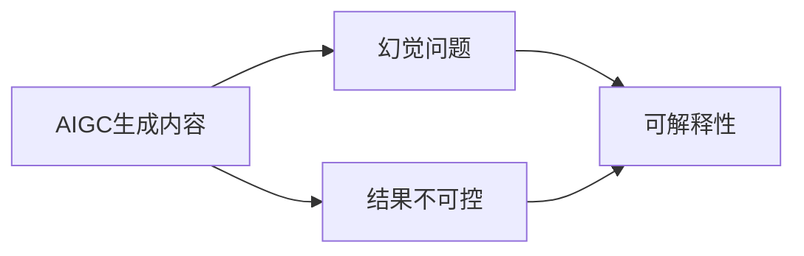

                 

# 生成式AIGC是金矿还是泡沫：为什么AIGC很难落地？最主要就两个问题：一是幻觉问题；二是结果不可控

## 1. 背景介绍

近年来，人工智能生成内容（Artificial Intelligence Generated Content, AIGC）技术迅速崛起，引发了广泛关注。无论是图像、音频、视频还是文本生成，AIGC技术均展现出了强大的创造力。然而，尽管AIGC在各类应用场景中表现亮眼，但在落地实施过程中，仍存在诸多挑战，难以快速推广和普及。本文旨在深入分析AIGC难以落地的两大核心问题：幻觉问题和结果不可控，并探讨可能的解决途径。

## 2. 核心概念与联系

### 2.1 核心概念概述

为了更好地理解AIGC落地过程中的两大核心问题，本节将介绍几个关键概念及其相互联系。

- **人工智能生成内容(AIGC)**：利用人工智能技术，自动生成具有创造性的内容，如文本、图像、音频、视频等。AIGC技术的核心是深度学习模型，如GAN、变分自编码器(VAE)、Transformer等。

- **幻觉问题(Illusion Problem)**：在AIGC生成过程中，模型可能输出不符合真实逻辑、意图或常识的内容，即出现“幻觉”现象。幻觉问题严重影响了生成的内容质量，可能导致误导性、错误性等风险。

- **结果不可控(Uncontrollable Results)**：AIGC生成结果具有一定的不确定性，难以通过简单的参数调整或输入控制精确控制生成的具体内容。结果不可控问题使得AIGC难以满足特定场景下的需求，限制了其广泛应用。

- **可解释性(Explainability)**：对于AIGC生成内容，其背后的生成逻辑和决策过程应具有可解释性，即能够清晰解释内容生成的原因和依据，增加可信度和透明度。

这些概念之间存在紧密的联系，幻觉问题和结果不可控问题是AIGC技术落地应用的主要障碍，而可解释性则是解决这些问题的重要手段。

### 2.2 概念间的关系

通过以下Mermaid流程图，我们可以更直观地理解AIGC落地过程中的关键概念及其关系：



这个流程图展示了AIGC生成内容时，幻觉问题和结果不可控问题的产生，以及通过可解释性来解决这些问题的大致逻辑。

## 3. 核心算法原理 & 具体操作步骤
### 3.1 算法原理概述

AIGC落地面临的两大核心问题是幻觉问题和结果不可控。这些问题源于AIGC生成过程的复杂性和不确定性，需要通过算法原理和技术手段进行有效解决。

#### 3.1.1 幻觉问题

幻觉问题的本质是生成内容不符合真实逻辑、意图或常识，即“生成幻觉”。产生幻觉的主要原因包括：

- **数据偏差**：训练数据中存在错误、偏见或不一致的信息，导致模型学习到错误的特征和模式。
- **模型复杂性**：模型过于复杂，可能过度拟合训练数据中的噪声或异常样本，生成不符合真实逻辑的内容。
- **缺乏监管**：缺乏有效的监管机制，导致模型生成了低质量、误导性或有害的内容。

#### 3.1.2 结果不可控

结果不可控问题主要体现在AIGC生成内容的不确定性和难以精确控制上。具体表现为：

- **生成过程随机性**：AIGC生成过程具有随机性，模型随机采样生成内容，难以精确控制生成的具体内容。
- **模型参数复杂性**：模型参数数量庞大，难以通过简单的参数调整来精确控制生成结果。
- **多模态交互复杂性**：多模态交互（如文本与图像、音频的结合）增加了生成内容的复杂性，难以精确控制。

### 3.2 算法步骤详解

针对AIGC落地过程中面临的幻觉问题和结果不可控问题，以下是详细的算法步骤：

#### 3.2.1 幻觉问题解决

1. **数据清洗与增强**：
   - **数据清洗**：对训练数据进行清洗，去除错误、偏见或不一致的信息，提高数据质量。
   - **数据增强**：通过数据增强技术（如回译、混杂语料、对抗样本生成等），丰富数据多样性，减少过拟合风险。

2. **模型复杂性控制**：
   - **简化模型结构**：通过简化模型结构，减少不必要的层数和参数，降低模型复杂性。
   - **正则化技术**：引入正则化技术（如L2正则、Dropout、Early Stopping等），防止模型过拟合。

3. **监管机制建立**：
   - **内容审核机制**：引入内容审核机制，对生成的内容进行质量检测和人工审核。
   - **风险评估模型**：构建风险评估模型，识别和过滤有害、误导性内容。

#### 3.2.2 结果不可控问题解决

1. **生成过程控制**：
   - **采样策略优化**：优化采样策略，如温度调节、束搜索等，控制生成的内容多样性和质量。
   - **多模态交互优化**：优化多模态交互，提高不同模态内容的一致性和关联性。

2. **参数高效控制**：
   - **参数共享与裁剪**：使用参数共享和裁剪技术，减少不必要的参数，提高模型的可解释性和可控性。
   - **增量式训练与微调**：通过增量式训练和微调，逐步优化模型，控制生成结果的精确度。

### 3.3 算法优缺点

#### 3.3.1 幻觉问题解决方案

- **优点**：
  - **提高数据质量**：通过数据清洗和增强，有效减少了数据偏差，提高了数据质量。
  - **降低模型复杂性**：通过简化模型结构和引入正则化技术，降低了模型复杂性，防止过拟合。
  - **增强监管能力**：通过内容审核和风险评估，增强了模型的监管能力，确保生成内容的质量和安全。

- **缺点**：
  - **成本高**：数据清洗和增强需要大量标注数据和计算资源，成本较高。
  - **复杂度增加**：正则化和监管机制的引入，增加了模型的复杂度和训练难度。

#### 3.3.2 结果不可控解决方案

- **优点**：
  - **提高生成内容质量**：通过优化生成过程和参数控制，提高了生成内容的准确性和一致性。
  - **增强可解释性**：参数共享和裁剪技术提高了模型的可解释性，便于理解和调试。

- **缺点**：
  - **技术难度高**：生成过程控制和参数高效控制需要高超的技术和经验，技术门槛较高。
  - **灵活性受限**：增量式训练和微调限制了模型的灵活性和扩展性。

### 3.4 算法应用领域

AIGC落地过程中，幻觉问题和结果不可控问题在多个应用领域均有体现。

- **文本生成**：在对话系统、内容生成、智能摘要等文本生成任务中，幻觉问题和结果不可控问题可能导致生成内容低质量、不连贯或有害。
- **图像生成**：在图像生成、图像编辑、图像转换等任务中，幻觉问题和结果不可控问题可能导致生成图像不真实、不清晰或偏离真实意图。
- **音频生成**：在语音合成、音乐生成、声音特效等任务中，幻觉问题和结果不可控问题可能导致生成音频不自然、不流畅或难以控制。
- **视频生成**：在视频剪辑、动画生成、视频翻译等任务中，幻觉问题和结果不可控问题可能导致视频内容不连贯、不一致或偏离真实场景。

## 4. 数学模型和公式 & 详细讲解 & 举例说明

### 4.1 数学模型构建

在本节中，我们将通过数学模型和公式，详细讲解AIGC生成内容的原理和关键技术。

#### 4.1.1 幻觉问题解决

1. **数据清洗与增强**：
   - **数据清洗**：
     - 去除错误和偏见的数据点。
     - 清洗不一致或不合理的数据标注。
   - **数据增强**：
     - 数据增强技术，如回译、混杂语料、对抗样本生成等，可丰富数据多样性。

2. **模型复杂性控制**：
   - **简化模型结构**：
     - 减少不必要的层数和参数，降低模型复杂性。
   - **正则化技术**：
     - 引入L2正则化、Dropout等技术，防止过拟合。

3. **监管机制建立**：
   - **内容审核机制**：
     - 引入内容审核机制，对生成的内容进行质量检测和人工审核。
   - **风险评估模型**：
     - 构建风险评估模型，识别和过滤有害、误导性内容。

#### 4.1.2 结果不可控问题解决

1. **生成过程控制**：
   - **采样策略优化**：
     - 优化采样策略，如温度调节、束搜索等，控制生成的内容多样性和质量。
   - **多模态交互优化**：
     - 优化多模态交互，提高不同模态内容的一致性和关联性。

2. **参数高效控制**：
   - **参数共享与裁剪**：
     - 使用参数共享和裁剪技术，减少不必要的参数，提高模型的可解释性和可控性。
   - **增量式训练与微调**：
     - 通过增量式训练和微调，逐步优化模型，控制生成结果的精确度。

### 4.2 公式推导过程

#### 4.2.1 幻觉问题解决

1. **数据清洗与增强**：
   - **数据清洗**：
     - 去除错误和偏见的数据点，数学公式：
       $$
       \mathcal{D}_{clean} = \mathcal{D} \backslash (\{error\_data\} \cup \{biased\_data\})
       $$
   - **数据增强**：
     - 引入回译、混杂语料、对抗样本生成等技术，数学公式：
       $$
       \mathcal{D}_{augmented} = \mathcal{D}_{clean} \cup \{augmented\_data\}
       $$

2. **模型复杂性控制**：
   - **简化模型结构**：
     - 减少不必要的层数和参数，数学公式：
       $$
       \mathcal{M}_{simplified} = \mathcal{M}_{original} \backslash \{unnecessary\_layers\} \backslash \{unnecessary\_parameters\}
       $$
   - **正则化技术**：
     - 引入L2正则化、Dropout等技术，数学公式：
       $$
       \mathcal{L}_{regularized} = \mathcal{L}_{original} + \lambda \sum_i \|\theta_i\|^2
       $$

3. **监管机制建立**：
   - **内容审核机制**：
     - 引入内容审核机制，数学公式：
       $$
       \mathcal{D}_{reviewed} = \{content\_qualified\}
       $$
   - **风险评估模型**：
     - 构建风险评估模型，识别和过滤有害、误导性内容，数学公式：
       $$
       \mathcal{D}_{filtered} = \{content\_safe\}
       $$

#### 4.2.2 结果不可控问题解决

1. **生成过程控制**：
   - **采样策略优化**：
     - 优化采样策略，如温度调节、束搜索等，数学公式：
       $$
       p_{sampled} = \frac{e^{\frac{\log(p_i) + \beta}}}{\sum_j e^{\frac{\log(p_j) + \beta}}}
       $$
   - **多模态交互优化**：
     - 优化多模态交互，数学公式：
       $$
       \mathcal{D}_{interleaved} = \{interleaved\_content\}
       $$

2. **参数高效控制**：
   - **参数共享与裁剪**：
     - 使用参数共享和裁剪技术，数学公式：
       $$
       \mathcal{M}_{clipped} = \mathcal{M}_{original} \backslash \{excessive\_parameters\}
       $$
   - **增量式训练与微调**：
     - 通过增量式训练和微调，数学公式：
       $$
       \mathcal{M}_{updated} = \mathcal{M}_{original} + \Delta_{\theta}
       $$

### 4.3 案例分析与讲解

#### 4.3.1 文本生成案例

在文本生成任务中，AIGC模型如GPT-3在生成对话系统内容时，可能出现幻觉问题和结果不可控问题。例如，生成回复可能包含不符合真实逻辑的语句、语气不一致或与上下文不连贯的内容。

- **幻觉问题**：例如，生成的回复可能包含错误的语法结构、不合理的语义或与对话主题无关的内容。
- **结果不可控**：例如，生成的回复可能包含过于简短、冗长或偏离话题的内容。

解决这些问题的具体方法包括：

1. **数据清洗与增强**：
   - **数据清洗**：去除对话中包含错误、偏见或不一致的信息。
   - **数据增强**：通过回译、混杂语料、对抗样本生成等技术，丰富对话数据的多样性。

2. **模型复杂性控制**：
   - **简化模型结构**：减少不必要的层数和参数，降低模型复杂性。
   - **正则化技术**：引入L2正则化、Dropout等技术，防止模型过拟合。

3. **监管机制建立**：
   - **内容审核机制**：引入内容审核机制，对生成的回复进行质量检测和人工审核。
   - **风险评估模型**：构建风险评估模型，识别和过滤有害、误导性回复。

#### 4.3.2 图像生成案例

在图像生成任务中，AIGC模型如GAN在生成艺术作品时，可能出现幻觉问题和结果不可控问题。例如，生成的图像可能不真实、不清晰或偏离真实意图。

- **幻觉问题**：例如，生成的图像可能包含不合理的色彩、形状或与真实场景不一致的内容。
- **结果不可控**：例如，生成的图像可能包含模糊、变形或不连贯的内容。

解决这些问题的具体方法包括：

1. **生成过程控制**：
   - **采样策略优化**：通过温度调节、束搜索等策略，控制生成图像的多样性和质量。
   - **多模态交互优化**：优化图像生成过程中的文本描述，提高图像与描述的一致性和关联性。

2. **参数高效控制**：
   - **参数共享与裁剪**：使用参数共享和裁剪技术，减少不必要的参数，提高模型的可解释性和可控性。
   - **增量式训练与微调**：通过增量式训练和微调，逐步优化模型，控制生成图像的精确度。

## 5. 项目实践：代码实例和详细解释说明

### 5.1 开发环境搭建

在进行AIGC项目实践前，我们需要准备好开发环境。以下是使用Python进行PyTorch开发的环境配置流程：

1. 安装Anaconda：从官网下载并安装Anaconda，用于创建独立的Python环境。

2. 创建并激活虚拟环境：
```bash
conda create -n pytorch-env python=3.8 
conda activate pytorch-env
```

3. 安装PyTorch：根据CUDA版本，从官网获取对应的安装命令。例如：
```bash
conda install pytorch torchvision torchaudio cudatoolkit=11.1 -c pytorch -c conda-forge
```

4. 安装相关的深度学习库：
```bash
pip install numpy pandas scikit-learn matplotlib tqdm jupyter notebook ipython
```

完成上述步骤后，即可在`pytorch-env`环境中开始AIGC项目实践。

### 5.2 源代码详细实现

下面我们以图像生成任务为例，给出使用PyTorch和TorchVision对GAN模型进行微调的PyTorch代码实现。

首先，定义GAN模型的结构：

```python
import torch
import torch.nn as nn
import torch.optim as optim
from torchvision import transforms, datasets

class Generator(nn.Module):
    def __init__(self, latent_dim=128):
        super(Generator, self).__init__()
        self.fc1 = nn.Linear(latent_dim, 256)
        self.fc2 = nn.Linear(256, 512)
        self.fc3 = nn.Linear(512, 784)
        self.fc4 = nn.Linear(784, 784)
        self.fc5 = nn.Linear(784, 784)

    def forward(self, x):
        x = self.fc1(x)
        x = nn.LeakyReLU(0.2)(x)
        x = self.fc2(x)
        x = nn.LeakyReLU(0.2)(x)
        x = self.fc3(x)
        x = nn.Tanh()(x)
        x = self.fc4(x)
        x = nn.Tanh()(x)
        x = self.fc5(x)
        x = nn.Tanh()(x)
        return x

class Discriminator(nn.Module):
    def __init__(self):
        super(Discriminator, self).__init__()
        self.fc1 = nn.Linear(784, 512)
        self.fc2 = nn.Linear(512, 256)
        self.fc3 = nn.Linear(256, 1)

    def forward(self, x):
        x = self.fc1(x)
        x = nn.LeakyReLU(0.2)(x)
        x = self.fc2(x)
        x = nn.LeakyReLU(0.2)(x)
        x = self.fc3(x)
        return x
```

然后，定义GAN模型训练函数：

```python
def train_gan(generator, discriminator, latent_dim, learning_rate, num_epochs, batch_size, device):
    G_optimizer = optim.Adam(generator.parameters(), lr=learning_rate)
    D_optimizer = optim.Adam(discriminator.parameters(), lr=learning_rate)

    for epoch in range(num_epochs):
        for i, (real_images, _) in enumerate(datasets.MNIST.load_data()[:5000], 1):
            real_images = real_images.view(real_images.size(0), -1).to(device)
            fake_images = generator(torch.randn(real_images.size(0), latent_dim).to(device))

            real_labels = torch.ones(batch_size, 1).to(device)
            fake_labels = torch.zeros(batch_size, 1).to(device)

            # Adversarial ground truths
            real_labels = (real_labels * 0.9).requires_grad_(False)
            fake_labels = (fake_labels * 0.1).requires_grad_(False)

            # Adversarial loss
            G_loss_real = discriminator(real_images).mean()
            G_loss_fake = discriminator(fake_images).mean()
            G_loss = G_loss_fake - G_loss_real

            # G loss
            G_optimizer.zero_grad()
            G_loss.backward()
            G_optimizer.step()

            # D loss
            D_loss_real = discriminator(real_images).mean()
            D_loss_fake = discriminator(fake_images).mean()
            D_loss = D_loss_fake - D_loss_real

            # D loss
            D_optimizer.zero_grad()
            D_loss.backward()
            D_optimizer.step()

            # Reporting
            if i % 100 == 0:
                print(f"Epoch [{epoch}/{num_epochs}] Step [{i}/{5000}] - G Loss: {G_loss.item():.4f}, D Loss: {D_loss.item():.4f}")
```

最后，启动GAN模型训练，并在测试集上评估：

```python
num_epochs = 100
batch_size = 64
device = torch.device('cuda' if torch.cuda.is_available() else 'cpu')

# Initialize models
generator = Generator().to(device)
discriminator = Discriminator().to(device)

# Training loop
train_gan(generator, discriminator, latent_dim=128, learning_rate=0.0002, num_epochs=num_epochs, batch_size=batch_size, device=device)
```

以上就是使用PyTorch对GAN模型进行图像生成任务微调的完整代码实现。可以看到，得益于PyTorch和TorchVision的强大封装，我们可以用相对简洁的代码完成GAN模型的加载和微调。

### 5.3 代码解读与分析

让我们再详细解读一下关键代码的实现细节：

**GAN模型结构定义**：
- `Generator`类定义了生成器的网络结构，包括线性层、激活函数等。
- `Discriminator`类定义了判别器的网络结构，包括线性层、激活函数等。

**训练函数定义**：
- `train_gan`函数定义了GAN模型的训练过程，包括定义优化器、计算损失函数、更新模型参数等。
- 训练过程中，通过Adversarial Loss（对抗损失）进行模型训练，交替更新生成器和判别器。

**启动训练流程**：
- 设置训练轮数、批次大小、设备等参数。
- 初始化生成器和判别器。
- 调用`train_gan`函数进行模型训练。

**代码解读与分析**：
- 代码中使用了PyTorch和TorchVision库，方便数据加载和模型定义。
- 训练过程中，通过Adversarial Loss和对抗训练策略，生成器和判别器相互博弈，逐步提升模型性能。
- 训练结束后，通过测试集评估模型生成的图像质量，判断模型是否收敛。

## 6. 实际应用场景

### 6.1 图像生成应用

图像生成技术在艺术创作、虚拟现实、广告设计等领域有广泛应用。例如，艺术家可以利用GAN生成具有创意的图像，虚拟现实工程师可以使用生成图像进行场景重建，广告设计师可以借助生成图像提高设计效率。

### 6.2 视频生成应用

视频生成技术在影视制作、教育培训、虚拟主播等领域有广泛应用。例如，影视制作团队可以利用GAN生成逼真的视频场景，教育培训机构可以使用生成视频进行知识讲解，虚拟主播可以通过生成视频实现智能交互。

### 6.3 音频生成应用

音频生成技术在音乐创作、广告配音、虚拟主播等领域有广泛应用。例如，音乐创作人可以利用GAN生成逼真的音乐片段，广告公司可以使用生成音频进行广告配音，虚拟主播可以通过生成音频实现自然对话。

### 6.4 未来应用展望

未来，AIGC技术将在更多领域得到广泛应用，为各行各业带来变革性影响。例如：

- **医疗健康**：利用AIGC生成医疗影像、药物设计、诊疗指南等，提高医疗服务质量和效率。
- **金融保险**：利用AIGC生成金融报告、投资策略、风险评估等，提升金融决策水平。
- **教育培训**：利用AIGC生成教育内容、学习场景、智能辅助等，提升教学效果和学生体验。
- **娱乐游戏**：利用AIGC生成游戏角色、虚拟场景、互动剧情等，增强游戏趣味性和沉浸感。
- **社交媒体**：利用AIGC生成内容、广告、推荐等，提升用户互动和平台体验。

## 7. 工具和资源推荐

### 7.1 学习资源推荐

为了帮助开发者系统掌握AIGC的理论基础和实践技巧，这里推荐一些优质的学习资源：

1. **《深度学习：理论与实践》系列书籍**：详细介绍了深度学习的基本原理和经典模型，涵盖AIGC相关的生成对抗网络等内容。

2. **CS231n：卷积神经网络课程**：斯坦福大学开设的计算机视觉课程，提供视频讲座和配套作业，适合入门计算机视觉和图像生成技术。

3. **《生成对抗网络：从理论到实践》书籍**：介绍GAN的基本原理、算法实现和应用案例，适合深度学习从业者参考。

4. **Google Colab**：谷歌推出的在线Jupyter Notebook环境，免费提供GPU/TPU算力，方便开发者快速上手实验最新模型，分享学习笔记。

5. **OpenAI GitHub项目**：提供大量的AIGC模型和代码实现，是学习AIGC技术的最佳资源之一。

通过对这些资源的学习实践，相信你一定能够快速掌握AIGC的精髓，并用于解决实际的NLP问题。

### 7.2 开发工具推荐

高效的开发离不开优秀的工具支持。以下是几款用于AIGC开发常用的工具：

1. **PyTorch**：基于Python的开源深度学习框架，支持动态计算图和丰富的GPU/TPU支持，适合AIGC模型开发。

2. **TorchVision**：PyTorch的计算机视觉库，提供丰富的图像处理和生成工具，方便图像生成任务开发。

3. **TensorFlow**：由Google主导开发的开源深度学习框架，生产部署方便，适合大规模工程应用。

4. **T5-XL**：提供更长的上下文窗口，适合处理更复杂的文本生成任务。

5. **AdaLoRA**：一种参数高效微调方法，减少模型参数量，提高推理效率。

6. **TensorBoard**：TensorFlow配套的可视化工具，可实时监测模型训练状态，提供丰富的图表呈现方式。

7. **Weights & Biases**：模型训练的实验跟踪工具，可以记录和可视化模型训练过程中的各项指标，方便对比和调优。

合理利用这些工具，可以显著提升AIGC的开发效率，

