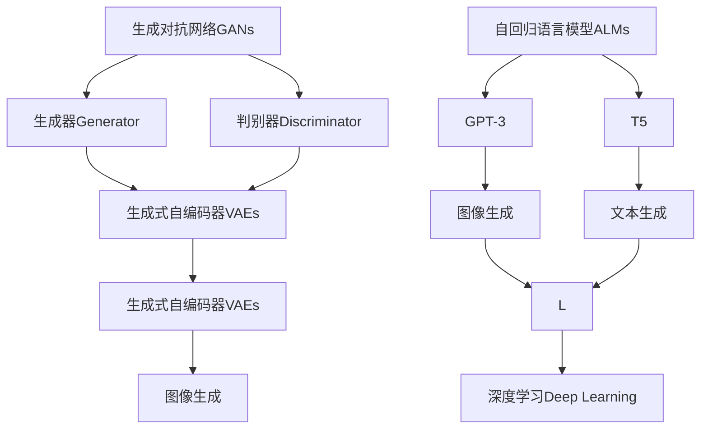
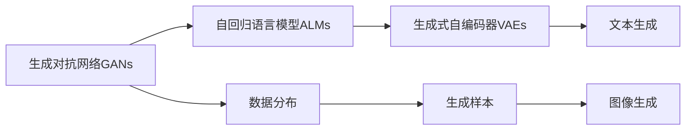
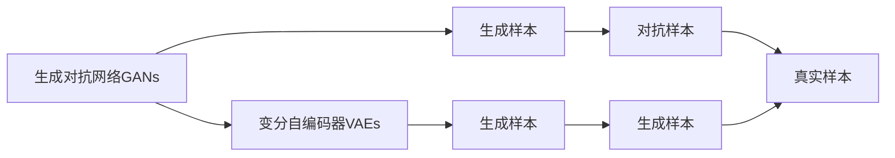
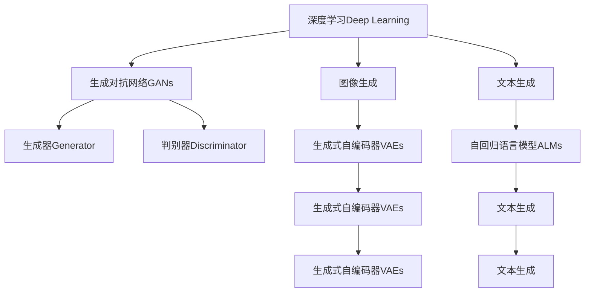
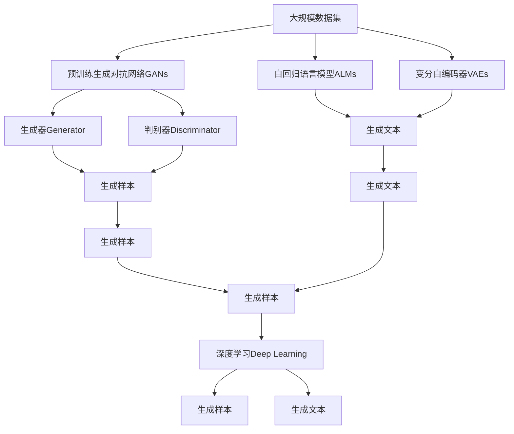

                 

## 1. 背景介绍

### 1.1 问题由来

随着深度学习技术的飞速发展，生成式人工智能（Generative AI, AIGC）逐渐成为人工智能领域的热点研究方向。生成式AI旨在通过学习大量数据，生成具有高逼真度、高灵活性的输出内容，广泛应用于图像生成、自然语言处理、音乐生成等多个领域。其中，生成式对抗网络（Generative Adversarial Networks, GANs）和自回归语言模型（Autoregressive Language Models, ALMs）是AIGC技术的两大支柱。

GANs通过对抗样本生成高质量的图像、视频、音频等，具有极强的创造力。ALMs则通过自回归机制，利用先前的输出预测下一个输出，生成高质量的自然语言文本，具有较高的可控性和连贯性。近年来，这两类技术的发展极大地推动了AIGC在媒体、娱乐、游戏、设计等领域的应用。

然而，由于生成模型的复杂性和训练的困难性，当前的大规模生成式AI模型往往需要较大的计算资源和标注数据，难以在实际应用中广泛部署。因此，如何进一步提升生成式AI的性能和可控性，降低其应用门槛，成为了学术界和产业界关注的焦点。

### 1.2 问题核心关键点

生成式AI的核心问题是如何从无标注的数据中学习生成模型，使得模型能够生成逼真、多样、灵活的输出内容。这一问题在理论和技术上存在诸多挑战：

- **数据依赖**：生成式AI需要大量无标注数据进行预训练，数据的获取成本较高。
- **模型复杂性**：生成模型的训练通常需要大量计算资源，模型的复杂性也较高。
- **输出质量**：生成模型的输出质量受模型参数、训练策略、优化器等多种因素的影响，难以保证。
- **可控性**：生成模型难以实现细粒度的输出控制，如生成特定主题的文本、特定风格的图像等。
- **对抗攻击**：生成模型容易受到对抗样本的攻击，生成的内容可能存在安全隐患。

针对上述挑战，本文从理论和实践两个角度出发，系统探讨生成式AI的算法原理和应用策略，并结合具体案例，展示如何通过优化模型和训练策略，实现高质量、可控的生成输出。

### 1.3 问题研究意义

生成式AI的研究不仅具有重要的学术价值，还在多个行业领域具有广泛的应用前景。例如：

- **媒体娱乐**：生成式AI可以自动生成高质量的影视作品、音乐、游戏内容，大幅降低内容制作成本，提升内容多样性。
- **电子商务**：自动生成商品描述、广告文案，提升用户体验和销售转化率。
- **金融服务**：自动生成财务报告、市场分析，辅助投资决策。
- **医疗健康**：生成医疗影像、药物分子，辅助医疗诊断和治疗。
- **教育培训**：自动生成学习资料、考试试题，提升教育效果。
- **创意设计**：自动生成设计方案、草图，辅助创意设计。

生成式AI技术的突破和应用，将深刻影响人类的生产生活方式，带来全新的创意生产模式和价值链重构。因此，研究生成式AI的算法原理和实践方法，对于推动AI技术的产业化应用具有重要意义。

## 2. 核心概念与联系

### 2.1 核心概念概述

为更好地理解生成式AI的核心算法，本节将介绍几个关键概念：

- **生成对抗网络（GANs）**：一种通过对抗样本生成高质量输出的生成式模型，由生成器（Generator）和判别器（Discriminator）两部分组成。生成器负责生成伪造样本，判别器负责识别真实样本和伪造样本。两者通过对抗训练不断提升生成器的生成能力。

- **自回归语言模型（ALMs）**：一种利用自回归机制生成自然语言文本的生成模型，如GPT-3、T5等。ALMs通过自回归方式，利用先前的输出预测下一个输出，生成连贯的自然语言文本。

- **变分自编码器（VAEs）**：一种通过学习数据分布生成样本的生成模型，广泛应用于图像生成、文本生成等任务。VAEs通过学习数据分布，生成与真实数据分布相似的伪造样本。

- **深度学习（Deep Learning）**：一种利用多层神经网络进行数据建模的机器学习方法，广泛应用于图像、音频、文本等多种数据类型的生成和处理。

这些核心概念之间的关系可以通过以下Mermaid流程图来展示：



这个流程图展示了生成式AI的核心概念及其之间的关系：

1. GANs通过对抗训练提升生成器的生成能力。
2. ALMs利用自回归机制生成自然语言文本。
3. VAEs通过学习数据分布生成伪造样本。
4. 深度学习涵盖了生成对抗网络、自回归语言模型、变分自编码器等多种生成模型。

这些核心概念共同构成了生成式AI的算法基础，使得模型能够在无标注数据下生成高质量的输出内容。

### 2.2 概念间的关系

这些核心概念之间存在着紧密的联系，形成了生成式AI的完整生态系统。下面我们通过几个Mermaid流程图来展示这些概念之间的关系。

#### 2.2.1 生成对抗网络与自回归语言模型



这个流程图展示了生成对抗网络与自回归语言模型之间的关系。生成对抗网络通过对抗训练，学习生成高质量的样本，这些样本可以用于自回归语言模型的预训练。自回归语言模型则通过自回归机制，生成连贯的自然语言文本。

#### 2.2.2 生成对抗网络与变分自编码器



这个流程图展示了生成对抗网络与变分自编码器之间的关系。生成对抗网络生成高质量的样本，这些样本可以用于变分自编码器的训练。变分自编码器通过学习数据分布，生成与真实样本相似的伪造样本。

#### 2.2.3 深度学习与生成对抗网络



这个流程图展示了深度学习与生成对抗网络之间的关系。深度学习涵盖了生成对抗网络、自回归语言模型、变分自编码器等多种生成模型。生成对抗网络通过对抗训练生成高质量的样本，自回归语言模型通过自回归机制生成自然语言文本，变分自编码器通过学习数据分布生成伪造样本。

### 2.3 核心概念的整体架构

最后，我们用一个综合的流程图来展示这些核心概念在大规模生成式AI系统中的整体架构：



这个综合流程图展示了从预训练生成对抗网络到深度学习生成模型的完整过程。大规模数据集通过预训练生成对抗网络生成高质量的样本，这些样本可以用于自回归语言模型和变分自编码器的训练。自回归语言模型通过自回归机制生成自然语言文本，变分自编码器通过学习数据分布生成伪造样本。最终，深度学习生成模型通过融合这些样本，生成高质量的输出内容。通过这些流程图，我们可以更清晰地理解生成式AI的算法基础和整体架构，为后续深入讨论具体的生成算法和技术奠定基础。

## 3. 核心算法原理 & 具体操作步骤
### 3.1 算法原理概述

生成式AI的核心算法包括生成对抗网络（GANs）和自回归语言模型（ALMs），下面将分别介绍这两种生成算法的原理。

#### 3.1.1 生成对抗网络

GANs由两个神经网络组成：生成器（Generator）和判别器（Discriminator）。生成器负责生成伪造样本，判别器负责区分真实样本和伪造样本。两者通过对抗训练不断提升生成器的生成能力。

具体地，生成器和判别器分别通过前向传播和反向传播进行训练。生成器的目标是生成尽可能逼真的伪造样本，判别器的目标是区分真实样本和伪造样本。在每次训练迭代中，生成器生成一批伪造样本，判别器对这批样本进行判别，计算生成器生成的样本与真实样本的判别损失（Discriminator Loss）。同时，生成器根据判别器的反馈，计算生成损失（Generator Loss）。通过优化这两个损失函数，生成器不断改进生成能力，生成高质量的伪造样本。

#### 3.1.2 自回归语言模型

ALMs通过自回归机制生成自然语言文本。ALMs通常采用Transformer结构，通过自回归方式，利用先前的输出预测下一个输出。具体地，ALMs包含一个自注意力机制，能够同时考虑文本中上下文信息。每个位置上的输出依赖于前面的位置，通过不断递归更新，生成连贯的自然语言文本。

具体地，ALMs的输入是一个长度为$T$的文本序列$x_1, x_2, ..., x_T$，输出为另一个长度为$T$的文本序列$y_1, y_2, ..., y_T$。ALMs的目标是通过最大化交叉熵损失，使生成的文本序列与真实文本序列一致。在每次训练迭代中，ALMs通过前向传播计算预测输出，计算交叉熵损失，并通过反向传播更新模型参数。

### 3.2 算法步骤详解

#### 3.2.1 生成对抗网络

1. **数据准备**：收集大量无标注数据，作为生成器和判别器的训练数据。
2. **模型初始化**：初始化生成器和判别器的参数。
3. **对抗训练**：生成器生成一批伪造样本，判别器对这些样本进行判别，计算判别损失。同时，生成器根据判别器的反馈，计算生成损失。通过优化这两个损失函数，生成器不断改进生成能力。
4. **模型评估**：在测试集上评估生成器的生成质量，根据评估结果调整模型参数，重复上述过程直至收敛。

#### 3.2.2 自回归语言模型

1. **数据准备**：收集大量标注数据，作为ALMs的训练数据。
2. **模型初始化**：初始化ALMs的参数。
3. **训练过程**：在每个训练迭代中，输入文本序列，通过前向传播计算预测输出。计算交叉熵损失，并通过反向传播更新模型参数。
4. **模型评估**：在测试集上评估ALMs的生成质量，根据评估结果调整模型参数，重复上述过程直至收敛。

### 3.3 算法优缺点

生成式AI的算法具有以下优点：

- **生成质量高**：生成对抗网络和自回归语言模型通过对抗训练和自回归机制，能够生成高质量的伪造样本和自然语言文本。
- **生成内容多样化**：生成式AI能够生成丰富多样的内容，满足不同场景的应用需求。
- **算法模型通用性**：生成式AI的算法框架适用于图像生成、文本生成、音频生成等多种任务，具有较强的通用性。

同时，生成式AI的算法也存在一些缺点：

- **数据依赖**：生成式AI需要大量无标注数据进行预训练，数据的获取成本较高。
- **模型复杂性**：生成式AI的模型结构复杂，训练过程需要大量计算资源。
- **输出质量不稳定**：生成式AI的输出质量受多种因素影响，难以保证稳定性和一致性。
- **对抗攻击**：生成式AI容易受到对抗样本的攻击，生成的内容可能存在安全隐患。

尽管存在这些缺点，但生成式AI的算法仍在诸多领域取得了显著的突破，并广泛应用于图像、文本、音频等多种生成任务。未来，通过进一步优化算法和训练策略，生成式AI将有望在更多场景中发挥重要作用。

### 3.4 算法应用领域

生成式AI的算法广泛应用于以下几个领域：

1. **图像生成**：生成对抗网络能够生成高质量的图像，广泛应用于图像编辑、合成、增强等领域。例如，通过GANs生成逼真的图像，用于游戏、电影、广告等场景。

2. **文本生成**：自回归语言模型能够生成连贯的自然语言文本，广泛应用于自然语言处理、机器翻译、内容生成等领域。例如，通过ALMs生成高质量的文章、报告、对话等文本内容。

3. **音频生成**：生成式AI能够生成逼真的音频，广泛应用于音频编辑、合成、增强等领域。例如，通过GANs生成逼真的音乐、语音、视频等音频内容。

4. **视频生成**：生成式AI能够生成高质量的视频，广泛应用于影视制作、动画、虚拟现实等领域。例如，通过GANs生成逼真的视频内容，用于游戏、电影、广告等场景。

5. **设计创意**：生成式AI能够生成创意设计，广泛应用于建筑设计、工业设计、时尚设计等领域。例如，通过GANs生成逼真的建筑设计、产品设计等创意内容。

除了上述这些应用领域，生成式AI还在金融、医疗、教育、娱乐等多个领域展现了强大的应用潜力。未来，随着生成式AI技术的不断进步，其在更多领域的应用前景将更加广阔。

## 4. 数学模型和公式 & 详细讲解 & 举例说明

### 4.1 数学模型构建

在生成式AI的算法中，生成对抗网络和自回归语言模型分别通过不同的数学模型进行建模。下面将分别介绍这两种模型的数学模型构建。

#### 4.1.1 生成对抗网络

生成对抗网络由生成器和判别器两部分组成。生成器的目标是通过最小化生成损失（Generator Loss）来生成逼真的伪造样本。判别器的目标是通过最大化判别损失（Discriminator Loss）来区分真实样本和伪造样本。

假设生成器生成的一批伪造样本为$G(z)$，其中$z$为噪声向量。判别器对这批样本进行判别，计算判别损失$L_D$。生成器根据判别器的反馈，计算生成损失$L_G$。最终，生成器和判别器的目标函数为：

$$
\min_{G}\max_{D}V(D,G)=\mathbb{E}_{x\sim p_{data}}\log D(x)+\mathbb{E}_{z\sim p(z)}\log (1-D(G(z)))
$$

其中，$p_{data}$为真实样本分布，$p(z)$为噪声向量分布，$V(D,G)$为生成对抗网络的生成-判别损失函数。

#### 4.1.2 自回归语言模型

自回归语言模型通过自回归机制生成自然语言文本。假设输入文本序列为$x_1, x_2, ..., x_T$，目标生成文本序列为$y_1, y_2, ..., y_T$。在每个位置$k$上，生成器的目标是最大化交叉熵损失$L_k$，使得$y_k$与真实文本$x_k$一致。交叉熵损失函数为：

$$
L_k=-\log p(y_k|y_1,...,y_{k-1})
$$

其中，$p(y_k|y_1,...,y_{k-1})$为生成器在位置$k$上生成$y_k$的概率分布。

### 4.2 公式推导过程

#### 4.2.1 生成对抗网络

生成对抗网络的生成损失$L_G$和判别损失$L_D$可以通过对抗训练过程推导得到。假设生成器生成的一批伪造样本为$G(z)$，判别器对这批样本进行判别，计算判别损失$L_D$。生成器根据判别器的反馈，计算生成损失$L_G$。

生成器的目标函数为：

$$
\min_{G}\max_{D}V(D,G)=\mathbb{E}_{x\sim p_{data}}\log D(x)+\mathbb{E}_{z\sim p(z)}\log (1-D(G(z)))
$$

其中，$D(x)$为判别器对真实样本$x$的判别概率，$G(z)$为生成器生成的一批伪造样本。

判别器的目标函数为：

$$
\max_{D}\mathbb{E}_{x\sim p_{data}}\log D(x)+\mathbb{E}_{z\sim p(z)}\log (1-D(G(z)))
$$

其中，$D(x)$为判别器对真实样本$x$的判别概率，$G(z)$为生成器生成的一批伪造样本。

生成器和判别器的目标函数可以通过梯度下降等优化算法求解，不断提升生成器的生成能力和判别器的判别能力。

#### 4.2.2 自回归语言模型

自回归语言模型的交叉熵损失函数为：

$$
L_k=-\log p(y_k|y_1,...,y_{k-1})
$$

其中，$p(y_k|y_1,...,y_{k-1})$为生成器在位置$k$上生成$y_k$的概率分布。

在训练过程中，生成器通过最大化交叉熵损失，使得生成的文本序列与真实文本序列一致。具体地，在每个位置$k$上，生成器的目标函数为：

$$
\max_{G}\mathbb{E}_{x_k,y_k}\log p(y_k|y_1,...,y_{k-1})
$$

其中，$x_k$为输入文本序列，$y_k$为生成器预测的文本序列。

### 4.3 案例分析与讲解

下面我们以图像生成为例，展示生成对抗网络（GANs）的训练过程和结果。

假设我们有一批真实的图像数据$x_1, x_2, ..., x_M$，目标是生成与这些图像类似的伪造图像。生成对抗网络由一个生成器$G$和一个判别器$D$组成。生成器的目标是生成尽可能逼真的伪造图像，判别器的目标是区分真实图像和伪造图像。

1. **数据准备**：收集一批真实图像数据$x_1, x_2, ..., x_M$，作为训练数据。
2. **模型初始化**：初始化生成器和判别器的参数。
3. **对抗训练**：生成器生成一批伪造图像$G(z)$，判别器对这些图像进行判别，计算判别损失$L_D$。同时，生成器根据判别器的反馈，计算生成损失$L_G$。通过优化这两个损失函数，生成器不断改进生成能力，生成高质量的伪造图像。
4. **模型评估**：在测试集上评估生成器的生成质量，根据评估结果调整模型参数，重复上述过程直至收敛。

通过生成对抗网络，我们可以生成逼真的伪造图像，广泛应用于图像编辑、合成、增强等领域。例如，通过GANs生成逼真的图像，用于游戏、电影、广告等场景。

## 5. 项目实践：代码实例和详细解释说明

### 5.1 开发环境搭建

在进行生成式AI项目实践前，我们需要准备好开发环境。以下是使用Python进行TensorFlow开发的环境配置流程：

1. 安装Anaconda：从官网下载并安装Anaconda，用于创建独立的Python环境。

2. 创建并激活虚拟环境：
```bash
conda create -n pytorch-env python=3.8 
conda activate pytorch-env
```

3. 安装TensorFlow：根据CUDA版本，从官网获取对应的安装命令。例如：
```bash
conda install tensorflow tensorflow-gpu=cuda11.1 -c conda-forge
```

4. 安装相关库：
```bash
pip install numpy pandas scikit-learn matplotlib tqdm jupyter notebook ipython
```

完成上述步骤后，即可在`pytorch-env`环境中开始生成式AI项目实践。

### 5.2 源代码详细实现

下面我们以生成对抗网络（GANs）为例，给出使用TensorFlow对GANs进行训练的PyTorch代码实现。

首先，定义生成器和判别器的架构：

```python
import tensorflow as tf
from tensorflow.keras.layers import Input, Conv2D, Conv2DTranspose, BatchNormalization, LeakyReLU, Reshape, Flatten

def make_generator(z_dim, img_dim):
    inputs = Input(shape=(z_dim,))
    x = Dense(256 * 7 * 7)(inputs)
    x = Reshape((8, 8, 256))(x)
    x = BatchNormalization()(x)
    x = LeakyReLU()(x)
    x = Conv2DTranspose(128, kernel_size=4, strides=2, padding='same')(x)
    x = BatchNormalization()(x)
    x = LeakyReLU()(x)
    x = Conv2DTranspose(64, kernel_size=4, strides=2, padding='same')(x)
    x = BatchNormalization()(x)
    x = LeakyReLU()(x)
    x = Conv2DTranspose(img_dim, kernel_size=4, strides=2, padding='same', activation='tanh')(x)
    return tf.keras.Model(inputs, x)

def make_discriminator(img_dim):
    inputs = Input(shape=(img_dim, img_dim, 1))
    x = Conv2D(64, kernel_size=4, strides=2, padding='same', activation='relu')(inputs)
    x = Conv2D(128, kernel_size=4, strides=2, padding='same', activation='relu')(x)
    x = Flatten()(x)
    x = Dense(256)(x)
    x = LeakyReLU()(x)
    outputs = Dense(1)(x)
    return tf.keras.Model(inputs, outputs)

generator = make_generator(z_dim=100, img_dim=28)
discriminator = make_discriminator(img_dim=28)
```

然后，定义生成器和判别器的损失函数和优化器：

```python
z_dim = 100
img_dim = 28

generator.compile(loss='binary_crossentropy', optimizer=tf.keras.optimizers.Adam(0.0002, beta_1=0.5))
discriminator.compile(loss='binary_crossentropy', optimizer=tf.keras.optimizers.Adam(0.0002, beta_1=0.5))

cross_entropy = tf.keras.losses.BinaryCrossentropy(from_logits=True)

def generator_loss(x):
    prediction = generator.predict(x)
    loss = cross_entropy(tf.ones_like(prediction), prediction)
    return loss

def discriminator_loss(x):
    real_loss = discriminator.train_on_batch(x, tf.ones_like(x))
    fake_loss = discriminator.train_on_batch(generator.predict(x), tf.zeros_like(x))
    total_loss = real_loss[0] + fake_loss[0]
    return total_loss

def combined_loss(x):
    real_loss = discriminator.train_on_batch(x, tf.ones_like(x))
    fake_loss = discriminator.train_on_batch(generator.predict(x), tf.zeros_like(x))
    total_loss = real_loss[0] + fake_loss[0]
    return total_loss
```

最后，定义训练和评估函数：

```python
def train_epoch(generator, discriminator, real_images, batch_size=128):
    real_images = real_images / 255.0
    noise = tf.random.normal([batch_size, z_dim])
    generated_images = generator(noise)
    d_loss_real = discriminator.train_on_batch(real_images, tf.ones_like(real_images))
    d_loss_fake = discriminator.train_on_batch(generated_images, tf.zeros_like(real_images))
    g_loss = generator_loss(noise)
    d_loss = d_loss_real[0] + d_loss_fake[0]
    return d_loss, g_loss

def evaluate(generator, discriminator, real_images, batch_size=128):
    real_images = real_images / 255.0
    noise = tf.random.normal([batch_size, z_dim])
    generated_images = generator(noise)
    d_loss_real = discriminator.evaluate(real_images, tf.ones_like(real_images))
    d_loss_fake = discriminator.evaluate(generated_images, tf.zeros_like(generated_images))
    g_loss = generator_loss(noise)
    d_loss = d_loss_real[0] + d_loss_fake[0]
    return d_loss, g_loss
```

启动训练流程并在测试集上评估：

```python
epochs = 50
batch_size = 128

for epoch in range(epochs):
    d_loss, g_loss = train_epoch(generator, discriminator, real_images, batch_size)
    print(f"Epoch {epoch+1}, d_loss: {d_loss:.4f}, g_loss: {g_loss:.4f}")
    


