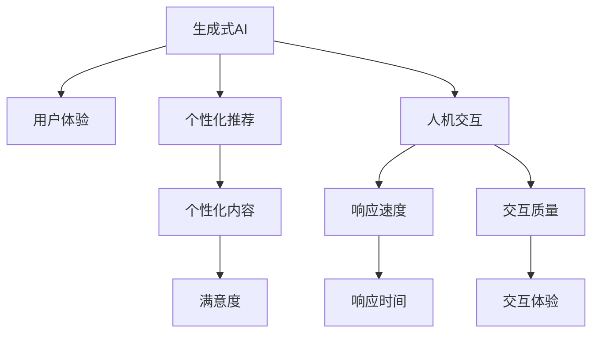

                 

# 生成式AI：金矿还是泡沫？第四部分：“让人尖叫”的用户体验

随着生成式AI技术的不断进步，其在各行各业的应用已经呈现出前所未有的潜力。从艺术创作、内容生成、到游戏设计、广告宣传，生成式AI已经成为推动数字化转型的重要力量。然而，这种技术也引发了关于其价值和影响的广泛讨论。在这篇文章中，我们将深入探讨生成式AI在用户体验方面的应用，分析其潜在的优势和挑战，以及未来的发展趋势。

## 1. 背景介绍

### 1.1 生成式AI的崛起

生成式AI技术，特别是基于深度学习的生成模型，近年来取得了飞速发展。这种技术的核心思想是通过训练大规模数据集，让模型学习数据的分布特性，从而能够生成与真实数据相似的新数据。例如，通过文本生成模型（如GPT系列），用户可以生成高质量的文章、对话内容、甚至是虚构的故事。在视觉领域，生成模型如DALL·E和Stable Diffusion则能够生成逼真的图像和视频。这些技术的突破，不仅拓展了创意表达的边界，也极大地推动了各行各业的创新应用。

### 1.2 用户体验的变革

生成式AI的崛起，为用户体验带来了革命性的改变。一方面，用户可以通过生成模型快速获取所需信息，例如自动生成新闻摘要、智能客服对话等；另一方面，用户也可以通过这些技术创作更加个性化和富有表现力的内容，从而提升自身的用户体验。然而，这种技术也引发了一系列关于用户体验的挑战和争议。本文将深入探讨生成式AI在用户体验方面的应用，分析其潜在的优势和挑战，以及未来的发展趋势。

## 2. 核心概念与联系

### 2.1 核心概念概述

在探讨生成式AI对用户体验的影响之前，我们先对一些关键概念进行概述：

- **生成式AI**：通过深度学习等技术，训练模型从已有数据中学习生成新数据的算法和模型。
- **用户体验**：用户在使用产品或服务过程中，对产品的直观感受和整体满意度。
- **人机交互**：用户在与机器交互过程中，感受到的交互效果和响应速度。
- **个性化推荐**：根据用户的偏好和行为，提供定制化的信息和产品。

### 2.2 核心概念之间的关系

这些概念之间存在着紧密的联系。生成式AI通过提供定制化内容和个性化的推荐，直接影响了用户体验。同时，人机交互的效果也在一定程度上由生成式AI的响应速度和质量决定。下面，我们将通过一个Mermaid流程图来展示这些概念之间的联系：



这个流程图展示了生成式AI如何通过提供个性化推荐和高质量的人机交互，影响用户的整体体验。个性化推荐使内容更加贴合用户需求，而高质量的人机交互则提升了用户的满意度和互动体验。

## 3. 核心算法原理 & 具体操作步骤

### 3.1 算法原理概述

生成式AI的核心算法通常基于深度学习中的生成模型。这些模型通过训练大规模数据集，学习数据的分布特性，从而能够生成逼真的新数据。具体来说，生成模型可以分为变分自编码器（VAE）、生成对抗网络（GAN）、自回归模型（如LSTM、GRU）等。以VAE和GAN为例，它们的原理如下：

- **变分自编码器（VAE）**：通过将数据编码为低维潜伏空间，然后再从该空间中采样生成新数据。VAE由编码器和解码器两部分组成，编码器将输入数据映射到潜在空间，解码器则从潜在空间中采样生成新数据。
- **生成对抗网络（GAN）**：由生成器和判别器两个网络组成。生成器尝试生成尽可能逼真的新数据，而判别器则试图区分生成数据和真实数据。通过对抗训练，生成器逐渐学习生成高质量的新数据。

### 3.2 算法步骤详解

生成式AI的实现通常包括以下几个关键步骤：

1. **数据准备**：收集并清洗大规模的数据集，用于训练生成模型。
2. **模型训练**：通过反向传播算法，优化生成模型的参数，使其能够生成逼真的新数据。
3. **模型评估**：通过计算指标（如FID、IS、KID等）评估生成数据的质量。
4. **模型应用**：将训练好的生成模型应用到实际场景中，生成所需的数据或内容。

### 3.3 算法优缺点

生成式AI的优点包括：

- **高效生成**：能够快速生成大量高质量的数据，节省人工劳动和时间。
- **灵活性高**：可以根据不同的任务和需求，定制化生成模型。
- **创新性强**：通过生成新的数据和内容，推动行业的创新和变革。

然而，生成式AI也存在一些缺点：

- **数据依赖**：生成式AI的效果高度依赖于训练数据的数量和质量，获取高质量数据成本较高。
- **模型复杂**：训练大规模的生成模型需要大量的计算资源和时间，训练过程较为复杂。
- **可解释性差**：生成式AI模型的内部工作机制复杂，难以解释其生成的过程和结果。

### 3.4 算法应用领域

生成式AI在多个领域都有广泛的应用，包括但不限于：

- **内容创作**：自动生成新闻、文章、广告文案等。
- **游戏设计**：生成虚拟角色、环境、故事情节等。
- **艺术创作**：创作绘画、音乐、视频等。
- **自然语言处理**：生成对话、摘要、翻译等。

## 4. 数学模型和公式 & 详细讲解 & 举例说明

### 4.1 数学模型构建

以生成对抗网络（GAN）为例，其数学模型可以表示为：

$$
G(z) = \begin{bmatrix}
G_{X}(z)\\
G_{Y}(z)
\end{bmatrix}, \quad
D(x) = \begin{cases}
1 & \text{if } x \in X \\
0 & \text{if } x \in Y
\end{cases}
$$

其中，$G(z)$ 为生成器，$D(x)$ 为判别器，$z$ 为输入噪声，$X$ 和 $Y$ 分别表示真实数据和生成数据。生成器的目标是生成尽可能逼真的数据，而判别器的目标是区分真实数据和生成数据。

### 4.2 公式推导过程

GAN的训练过程可以表示为如下两个步骤：

1. **生成器训练**：
$$
\begin{aligned}
\min_{G} \mathbb{E}_{z \sim p(z)} [D(G(z))] + \mathbb{E}_{x \sim p(x)} [\log(1 - D(G(z)))]
\end{aligned}
$$
2. **判别器训练**：
$$
\begin{aligned}
\min_{D} \mathbb{E}_{x \sim p(x)} [\log D(x)] + \mathbb{E}_{z \sim p(z)} [\log(1 - D(G(z)))]
\end{aligned}
$$

### 4.3 案例分析与讲解

以GAN在生成高质量图片中的应用为例，我们可以从以下几个方面进行分析和讲解：

- **数据准备**：使用大规模的图像数据集进行预训练，如ImageNet等。
- **模型构建**：设计生成器和判别器的网络结构，如卷积神经网络等。
- **训练过程**：通过迭代优化生成器和判别器的参数，提高生成质量。
- **结果评估**：通过计算FID（Fréchet Inception Distance）等指标评估生成效果。

## 5. 项目实践：代码实例和详细解释说明

### 5.1 开发环境搭建

为了实现生成式AI的应用，我们需要搭建一个支持深度学习的开发环境。以下是搭建环境的详细步骤：

1. **安装Python**：下载Python 3.x版本，并配置环境变量。
2. **安装TensorFlow或PyTorch**：根据需要选择安装TensorFlow或PyTorch。
3. **安装相关库**：安装TensorFlow或PyTorch的常用库，如Numpy、Pandas等。
4. **安装TensorBoard**：安装TensorFlow的可视化工具，用于监控训练过程。

### 5.2 源代码详细实现

以GAN为例，生成器模型的代码实现如下：

```python
import tensorflow as tf
from tensorflow.keras import layers

class Generator(tf.keras.Model):
    def __init__(self, latent_dim):
        super(Generator, self).__init__()
        self.latent_dim = latent_dim
        self.dense = layers.Dense(7 * 7 * 256, use_bias=False)
        self.reshape = layers.Reshape((7, 7, 256))
        self.conv1 = layers.Conv2DTranspose(128, (5, 5), strides=(1, 1), padding='same', use_bias=False)
        self.conv2 = layers.Conv2DTranspose(64, (5, 5), strides=(2, 2), padding='same', use_bias=False)
        self.conv3 = layers.Conv2DTranspose(1, (5, 5), strides=(2, 2), padding='same', use_bias=False, activation='tanh')
        
    def call(self, x):
        x = self.dense(x)
        x = layers.LeakyReLU(alpha=0.2)(x)
        x = self.reshape(x)
        x = layers.Conv2DTranspose(128, (5, 5), strides=(1, 1), padding='same', use_bias=False)(x)
        x = layers.LeakyReLU(alpha=0.2)(x)
        x = self.conv1(x)
        x = layers.LeakyReLU(alpha=0.2)(x)
        x = self.conv2(x)
        x = layers.LeakyReLU(alpha=0.2)(x)
        x = self.conv3(x)
        return x
```

### 5.3 代码解读与分析

在上述代码中，我们定义了一个生成器模型，其主要步骤如下：

- **输入层**：使用密集层将噪声向量转换为高维特征。
- **转换层**：使用反卷积层逐步将特征图转换为图像。
- **激活函数**：使用LeakyReLU激活函数增强模型非线性能力。
- **输出层**：使用tanh激活函数将输出限制在[-1, 1]之间，以生成逼真的图像。

### 5.4 运行结果展示

训练完成后，我们可以使用生成器模型生成逼真的图片。以下是一段代码示例：

```python
import numpy as np
import matplotlib.pyplot as plt

# 生成一批图片
n_samples = 16
random_latent_vectors = np.random.normal(0, 1, (n_samples, latent_dim))

generated_images = generator.random_input(latent_vectors)
plt.figure(figsize=(8, 8))
for i in range(n_samples):
    plt.subplot(4, 4, i + 1)
    plt.imshow(generated_images[i].numpy(), cmap='gray')
plt.show()
```

这段代码将生成16张逼真的图片，并显示出来。生成的图片可以通过训练过程中的损失函数等指标进行评估，进一步优化生成器模型的性能。

## 6. 实际应用场景

### 6.4 未来应用展望

生成式AI在用户体验方面的应用前景广阔，未来将有以下几个发展方向：

1. **更加个性化**：通过深入学习用户的偏好和行为，提供更加个性化的内容和推荐，提升用户体验。
2. **智能交互**：生成自然语言与用户进行智能对话，提升人机交互的流畅性和自然性。
3. **沉浸式体验**：生成高质量的虚拟环境，提供沉浸式的互动体验，如虚拟旅游、虚拟购物等。
4. **协作创作**：与人类艺术家、设计师等协同创作，生成高质量的艺术作品和设计方案。

## 7. 工具和资源推荐

### 7.1 学习资源推荐

为了更好地学习和应用生成式AI技术，以下是一些值得推荐的资源：

- **Coursera**：提供深度学习、生成模型等领域的在线课程。
- **Udacity**：提供深度学习、生成模型等领域的纳米学位课程。
- **Kaggle**：提供各种生成式AI的竞赛和数据集，帮助学习者实践和验证模型性能。
- **arXiv**：最新的人工智能研究成果，提供前沿技术的洞见和思路。

### 7.2 开发工具推荐

生成式AI的开发需要高性能的计算资源，以下是一些推荐的工具：

- **TensorFlow**：谷歌开源的深度学习框架，支持GPU计算。
- **PyTorch**：Facebook开源的深度学习框架，支持动态计算图。
- **Google Colab**：谷歌提供的免费GPU服务，方便进行模型训练和调试。
- **Jupyter Notebook**：支持Python代码的在线执行和编辑，方便开发和分享。

### 7.3 相关论文推荐

生成式AI的研究涉及多个领域，以下是一些经典的论文：

- **Image Synthesis with Generative Adversarial Networks**：生成对抗网络的经典论文，提出了GAN的生成和判别模型。
- **Generative Adversarial Nets**：提出GAN的基本框架，并在图像生成等领域取得突破。
- **The Unreasonable Effectiveness of Transfer Learning**：探讨了迁移学习的广泛应用，包括生成式AI在图像生成等任务中的效果。

## 8. 总结：未来发展趋势与挑战

### 8.1 研究成果总结

本文从生成式AI的角度，探讨了其在用户体验方面的应用，分析了其潜在的优势和挑战，以及未来的发展趋势。生成式AI通过提供高质量的内容和个性化的推荐，提升了用户的体验。然而，生成式AI也面临数据依赖、模型复杂等挑战，需要进一步研究和优化。

### 8.2 未来发展趋势

未来，生成式AI将在以下几个方面进一步发展：

1. **技术进步**：生成模型的性能将不断提升，生成效果将更加逼真和多样化。
2. **应用拓展**：生成式AI将应用到更多领域，如医疗、教育、金融等，带来更多的创新和变革。
3. **模型可解释性**：生成式AI的模型将更加可解释，用户能够更好地理解生成过程和结果。
4. **隐私保护**：生成式AI将更加注重用户隐私，避免泄露个人敏感信息。

### 8.3 面临的挑战

生成式AI在应用过程中，仍面临以下挑战：

1. **数据隐私**：生成模型需要大量数据进行训练，涉及用户的隐私保护问题。
2. **模型公平性**：生成模型可能会学习到数据中的偏见，导致不公平的生成结果。
3. **误导性**：生成模型可能会生成误导性的内容，对用户造成负面影响。
4. **技术复杂性**：生成式AI的技术实现较为复杂，需要较高的专业水平。

### 8.4 研究展望

未来的研究需要解决以上挑战，推动生成式AI技术的发展和应用。具体方向包括：

1. **隐私保护技术**：开发隐私保护技术，确保用户数据的安全和匿名性。
2. **公平性研究**：研究生成模型的公平性问题，消除数据中的偏见。
3. **误导性检测**：开发误导性检测技术，避免生成模型的误导性输出。
4. **技术普及**：推广生成式AI技术的普及和应用，降低技术门槛。

总之，生成式AI在用户体验方面具有巨大的潜力和应用前景，但也面临着诸多挑战。只有在技术、隐私、公平、误导性等方面不断优化和改进，才能真正实现生成式AI的全面应用，推动社会的数字化转型和创新发展。

## 9. 附录：常见问题与解答

### Q1：生成式AI的生成效果如何评价？

**A**：生成式AI的生成效果可以通过以下指标进行评价：

- **FID（Fréchet Inception Distance）**：衡量生成数据与真实数据分布的差异。
- **IS（Inception Score）**：衡量生成数据的逼真度和多样性。
- **KID（Kurach-LeCun-Bengio Distance）**：衡量生成数据的真实性和多样性。

### Q2：生成式AI在实际应用中需要注意哪些问题？

**A**：生成式AI在实际应用中需要注意以下几个问题：

- **数据隐私**：确保生成模型不会泄露用户的隐私信息。
- **模型公平性**：避免生成模型学习到数据中的偏见，确保公平性。
- **误导性检测**：检测生成模型是否生成误导性内容，避免对用户造成负面影响。
- **技术门槛**：降低技术门槛，让更多开发者能够使用和应用生成式AI技术。

### Q3：生成式AI的应用前景如何？

**A**：生成式AI在多个领域具有广阔的应用前景，包括但不限于：

- **内容创作**：自动生成新闻、文章、广告文案等。
- **游戏设计**：生成虚拟角色、环境、故事情节等。
- **艺术创作**：创作绘画、音乐、视频等。
- **自然语言处理**：生成对话、摘要、翻译等。

### Q4：如何优化生成式AI的生成效果？

**A**：优化生成式AI的生成效果可以从以下几个方面入手：

- **数据质量**：使用高质量的数据进行训练，提高生成效果。
- **模型设计**：设计更加复杂的生成模型，提升生成效果。
- **训练策略**：采用更好的训练策略，如对抗训练、增量训练等。
- **后处理技术**：使用后处理技术，如样式迁移、图像增强等，进一步提升生成效果。

总之，生成式AI在用户体验方面具有巨大的潜力和应用前景，但也面临着诸多挑战。只有在技术、隐私、公平、误导性等方面不断优化和改进，才能真正实现生成式AI的全面应用，推动社会的数字化转型和创新发展。

