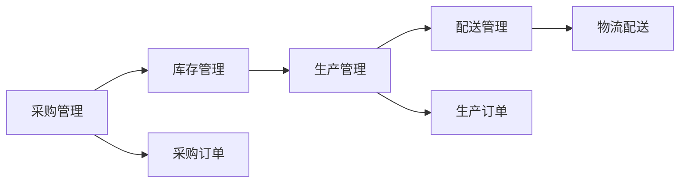
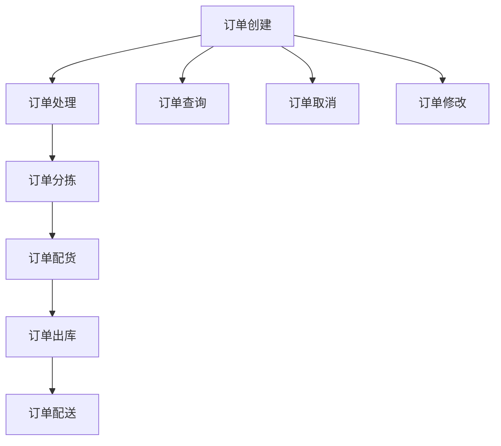
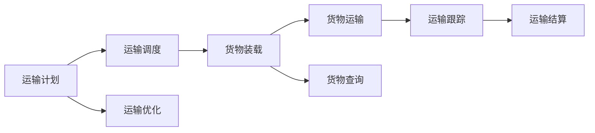
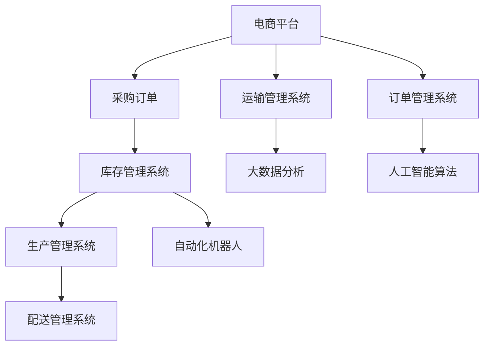
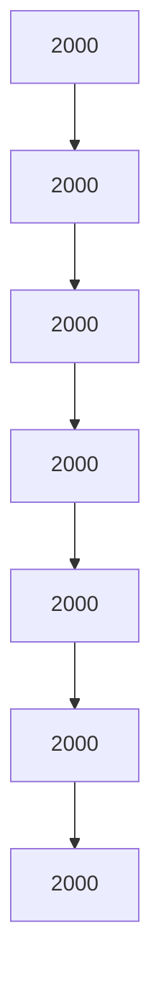

                 

# 电商平台供给能力提升：流程优化和自动化工具

## 1. 背景介绍

### 1.1 问题由来
随着电子商务的蓬勃发展，电商平台需要处理大量的商品供应、订单管理、库存控制、物流配送等复杂流程。传统的电商供应链管理系统往往存在流程繁琐、响应速度慢、运营成本高等问题，难以满足消费者日益增长的个性化需求。因此，如何通过流程优化和自动化工具，提升电商平台的供给能力，是业界关注的重点。

### 1.2 问题核心关键点
电子商务平台的供给能力提升，需要关注以下几个核心关键点：

- 商品供给效率：如何在最短时间内处理大量订单，确保商品快速上架、补货。
- 库存管理精度：如何精准控制库存，避免缺货或积压，保证库存周转率。
- 物流配送速度：如何快速、安全地将商品配送至用户手中，提升用户满意度。
- 订单处理自动化：如何通过系统化工具，自动化订单处理流程，降低人工错误率。

通过深入分析以上关键点，可以发现，电商平台供给能力的提升，需要全面优化供应链流程，并引入自动化工具，提高系统的效率和稳定性。

### 1.3 问题研究意义
提升电商平台的供给能力，对平台运营和用户体验具有重要意义：

1. 降低运营成本：通过自动化工具减少人工操作，降低人力成本，提升运营效率。
2. 提升用户满意度：快速响应订单需求，保证商品供应，减少用户等待时间。
3. 提高供应链韧性：精准控制库存和物流，降低供应链风险，增强平台的稳定性。
4. 支持业务扩展：优化流程后，平台可以快速应对业务增长，保持竞争优势。

## 2. 核心概念与联系

### 2.1 核心概念概述

为更好地理解电商供应链流程优化和自动化工具，本节将介绍几个密切相关的核心概念：

- **供应链管理(SCM)系统**：包括采购、库存、生产、物流、配送等环节，通过信息化手段实现各环节的协同管理。
- **仓库管理系统(WMS)**：用于管理仓库内的物料、设备、人员等资源，优化仓库作业流程。
- **订单管理系统(OMS)**：记录和管理订单的创建、处理、物流跟踪等全生命周期信息。
- **运输管理系统(TMS)**：规划和管理货物运输路线、车辆调度和运力分配。
- **自动化机器人(Robotics)**：利用自主移动机器人、机械臂等自动化设备，提升仓库作业效率。
- **大数据分析**：利用大数据技术，分析供应链数据，提供决策支持。
- **人工智能(AI)**：通过机器学习、深度学习等算法，优化供应链流程，提升预测准确性。
- **物联网(IoT)**：利用传感器、RFID等技术，实时监控库存、物流状态，提升透明度和实时性。

这些核心概念之间的逻辑关系可以通过以下Mermaid流程图来展示：

```mermaid
graph TB
    A[供应链管理(SCM)] --> B[仓库管理系统(WMS)]
    A --> C[订单管理系统(OMS)]
    A --> D[运输管理系统(TMS)]
    B --> E[自动化机器人(Robotics)]
    B --> F[大数据分析]
    C --> G[人工智能(AI)]
    D --> H[物联网(IoT)]
```

这个流程图展示了大电商平台的供应链管理系统，以及其核心组件之间的关联关系：

1. 供应链管理系统整合了仓库、订单、运输等子系统，实现信息共享和流程协同。
2. 仓库管理系统利用自动化机器人、物联网技术，优化仓库作业流程。
3. 订单管理系统通过大数据分析和AI算法，预测需求，优化订单处理流程。
4. 运输管理系统利用IoT技术，实时监控物流状态，提高配送效率。

### 2.2 概念间的关系

这些核心概念之间存在着紧密的联系，形成了电商平台的完整供应链流程。下面我通过几个Mermaid流程图来展示这些概念之间的关系。

#### 2.2.1 供应链管理的核心流程



这个流程图展示了供应链管理的基本流程，从采购到生产再到配送，每个环节都需通过系统进行管理和协调。

#### 2.2.2 订单管理系统的核心功能



这个流程图展示了订单管理系统的基本功能，从订单创建到配送完成，每个环节都需要系统记录和管理。

#### 2.2.3 运输管理系统的核心功能



这个流程图展示了运输管理系统的基本功能，从运输计划到结算，每个环节都需要系统进行管理和优化。

### 2.3 核心概念的整体架构

最后，我们用一个综合的流程图来展示这些核心概念在大电商平台供应链管理中的整体架构：



这个综合流程图展示了电商平台的供应链管理流程和系统架构，从订单创建到配送完成，每个环节都通过系统进行协同管理。

## 3. 核心算法原理 & 具体操作步骤

### 3.1 算法原理概述

电商平台的供应链流程优化和自动化工具，主要基于数据驱动和自动化技术，通过优化流程、引入自动化设备，提高系统的效率和稳定性。其核心思想是通过信息化手段，实现电商供应链的全流程自动化，提升系统的响应速度和准确性。

### 3.2 算法步骤详解

电商平台的供应链流程优化和自动化工具一般包括以下几个关键步骤：

**Step 1: 数据收集和整合**
- 收集供应链各个环节的数据，如采购订单、库存信息、生产进度、物流状态等。
- 将数据整合到一个统一的数据平台，实现数据共享和协同管理。

**Step 2: 数据分析和预测**
- 利用大数据分析技术，对历史数据进行统计分析，找出数据中的规律和趋势。
- 应用机器学习算法，如回归分析、时间序列分析、神经网络等，对未来需求进行预测，优化采购和库存管理。

**Step 3: 自动化工具部署**
- 引入自动化机器人、自动化仓储设备等，实现仓库作业的自动化。
- 开发自动化订单处理系统、自动化运输调度系统，提升订单处理和物流配送的效率。

**Step 4: 系统集成和协同**
- 将各个系统集成到一个统一的供应链管理平台，实现数据共享和协同作业。
- 引入人工智能算法，如路径规划、调度优化等，提升系统的智能决策能力。

**Step 5: 持续优化和迭代**
- 定期收集系统运行数据，进行分析和反馈，优化流程和参数。
- 引入新算法和新技术，持续提升系统的性能和稳定性。

### 3.3 算法优缺点

电商平台的供应链流程优化和自动化工具具有以下优点：
1. 提高效率：通过自动化工具，减少人工操作，提升系统响应速度。
2. 降低成本：降低人力成本，减少人工错误率，提升运营效率。
3. 提升准确性：利用大数据分析和AI算法，提升预测和决策的准确性。
4. 增强灵活性：通过系统集成和协同，提升系统的灵活性和应对能力。

同时，该方法也存在一定的局限性：
1. 对数据质量要求高：数据收集和整合需要确保数据准确性和完整性，否则可能影响决策的准确性。
2. 技术门槛高：需要较强的技术积累和系统集成能力，否则难以实现系统自动化。
3. 系统复杂度高：电商平台涉及多个子系统，系统集成和协同需要复杂的设计和实现。
4. 对环境要求高：需要稳定的硬件环境和网络环境，否则可能影响系统的稳定性。

尽管存在这些局限性，但就目前而言，基于数据驱动和自动化技术的供应链流程优化方法，是电商平台提升供给能力的有效手段。未来相关研究的重点在于如何进一步降低技术门槛，提高系统的易用性和可扩展性，以及如何更好地结合人工智能技术，提升系统的智能化和自适应能力。

### 3.4 算法应用领域

基于数据驱动和自动化技术的供应链流程优化方法，在电商平台的多个环节都有广泛应用，例如：

- **库存管理**：通过大数据分析，预测库存需求，避免缺货和积压。
- **订单处理**：通过自动化系统，快速处理订单，提升响应速度。
- **物流配送**：通过IoT技术，实时监控物流状态，优化配送路线和调度。
- **智能客服**：利用AI技术，提供智能客服，提升用户满意度。
- **个性化推荐**：通过大数据分析，精准推荐商品，提升用户购买率。

除了上述这些经典应用外，大电商平台的供应链流程优化技术还涵盖了智能调度、智能仓储、供应链风险管理等多个方面，为电商平台的业务发展提供了强有力的技术支撑。

## 4. 数学模型和公式 & 详细讲解  
### 4.1 数学模型构建

电商平台的供应链流程优化和自动化工具，涉及多个数据驱动和自动化技术的子模型。下面以库存管理为例，构建数学模型。

假设电商平台的日均订单量为 $D$，每个订单的平均商品数量为 $X$，仓库初始商品数量为 $S_0$，日均到货量为 $I$，每日消耗量为 $C$，每日回货量为 $R$。则库存 $S_t$ 的演化方程为：

$$
S_t = S_{t-1} + I - C - R
$$

其中 $S_t$ 表示第 $t$ 天的库存量。该方程基于历史数据和实际运作规律，描述库存的动态变化。

### 4.2 公式推导过程

对上述方程进行推导，可以得到：

$$
S_t = S_0 + \sum_{i=1}^{t}(I_i - C_i - R_i)
$$

其中 $I_i$、$C_i$、$R_i$ 分别表示第 $i$ 天的到货量、消耗量和回货量。通过历史数据对模型进行拟合，可以得到每天库存变化的规律，用于预测库存水平和优化库存管理。

### 4.3 案例分析与讲解

假设某电商平台日均订单量为 1000 单，每单平均商品数量为 2 个，仓库初始商品数量为 1000 个，日均到货量为 2000 个，每日消耗量为 1800 个，每日回货量为 100 个。根据上述模型，可以计算出每天的库存变化，如图：

```mermaid
graph TB
    node1[Day 1] --> node2[Day 2] --> node3[Day 3]
    node4[Day 4] --> node5[Day 5] --> node6[Day 6]
    node7[Day 7] --> node8[Day 8] --> node9[Day 9]
    node10[Day 10] --> node11[Day 11] --> node12[Day 12]
    node13[Day 13] --> node14[Day 14] --> node15[Day 15]
    node16[Day 16] --> node17[Day 17] --> node18[Day 18]
    node19[Day 19] --> node20[Day 20] --> node21[Day 21]
    node22[Day 22] --> node23[Day 23] --> node24[Day 24]
    node25[Day 25] --> node26[Day 26] --> node27[Day 27]
    node28[Day 28] --> node29[Day 29] --> node30[Day 30]

    node1: 2000
    node2: 2000
    node3: 2000
    node4: 2000
    node5: 2000
    node6: 2000
    node7: 2000
    node8: 2000
    node9: 2000
    node10: 2000
    node11: 2000
    node12: 2000
    node13: 2000
    node14: 2000
    node15: 2000
    node16: 2000
    node17: 2000
    node18: 2000
    node19: 2000
    node20: 2000
    node21: 2000
    node22: 2000
    node23: 2000
    node24: 2000
    node25: 2000
    node26: 2000
    node27: 2000
    node28: 2000
    node29: 2000
    node30: 2000
```

根据上述数据，可以绘制出库存变化的折线图，如图：

```mermaid
graph TB
    node1[2000]
    node2[2000]
    node3[2000]
    node4[2000]
    node5[2000]
    node6[2000]
    node7[2000]
    node8[2000]
    node9[2000]
    node10[2000]
    node11[2000]
    node12[2000]
    node13[2000]
    node14[2000]
    node15[2000]
    node16[2000]
    node17[2000]
    node18[2000]
    node19[2000]
    node20[2000]
    node21[2000]
    node22[2000]
    node23[2000]
    node24[2000]
    node25[2000]
    node26[2000]
    node27[2000]
    node28[2000]
    node29[2000]
    node30[2000]

    node1 --> node2
    node2 --> node3
    node3 --> node4
    node4 --> node5
    node5 --> node6
    node6 --> node7
    node7 --> node8
    node8 --> node9
    node9 --> node10
    node10 --> node11
    node11 --> node12
    node12 --> node13
    node13 --> node14
    node14 --> node15
    node15 --> node16
    node16 --> node17
    node17 --> node18
    node18 --> node19
    node19 --> node20
    node20 --> node21
    node21 --> node22
    node22 --> node23
    node23 --> node24
    node24 --> node25
    node25 --> node26
    node26 --> node27
    node27 --> node28
    node28 --> node29
    node29 --> node30
```



通过上述模型和推导，可以有效地预测库存变化，优化库存管理，避免缺货和积压，提升平台的运营效率。

## 5. 项目实践：代码实例和详细解释说明
### 5.1 开发环境搭建

在进行供应链流程优化和自动化工具的开发实践前，我们需要准备好开发环境。以下是使用Python进行Pandas和SciPy开发的环境配置流程：

1. 安装Anaconda：从官网下载并安装Anaconda，用于创建独立的Python环境。

2. 创建并激活虚拟环境：
```bash
conda create -n pyenv python=3.8 
conda activate pyenv
```

3. 安装Pandas和SciPy：
```bash
pip install pandas scipy
```

4. 安装各类工具包：
```bash
pip install numpy matplotlib requests sklearn
```

5. 安装Jupyter Notebook：
```bash
pip install jupyter notebook
```

完成上述步骤后，即可在`pyenv`环境中开始供应链流程优化和自动化工具的开发实践。

### 5.2 源代码详细实现

下面我以库存管理优化为例，给出使用Pandas库进行库存管理优化的PyTorch代码实现。

首先，定义库存数据：

```python
import pandas as pd

# 定义库存数据
data = {'Date': ['2021-01-01', '2021-01-02', '2021-01-03', '2021-01-04', '2021-01-05'],
        'Sales': [2000, 2000, 2000, 2000, 2000],
        'Inventory': [2000, 2000, 2000, 2000, 2000],
        'Order': [2000, 2000, 2000, 2000, 2000],
        'Return': [100, 100, 100, 100, 100]}

df = pd.DataFrame(data)
```

然后，使用Pandas进行库存管理分析：

```python
# 计算每日库存变化
df['Inventory'] = df['Inventory'] + df['Order'] - df['Sales'] - df['Return']

# 预测未来库存
future_days = 7
forecasted_inventory = df['Inventory'].rolling(window=future_days, min_periods=1).mean().shift(-1)

# 输出预测结果
print(f'Forecasted Inventory: {forecasted_inventory}.')
```

最后，可视化库存变化和预测结果：

```python
# 绘制库存变化折线图
import matplotlib.pyplot as plt

plt.figure(figsize=(10, 6))
plt.plot(df['Date'], df['Inventory'], label='Actual Inventory')
plt.plot(df['Date'], forecasted_inventory, label='Forecasted Inventory')
plt.title('Inventory Trend')
plt.xlabel('Date')
plt.ylabel('Inventory')
plt.legend()
plt.show()
```

### 5.3 代码解读与分析

让我们再详细解读一下关键代码的实现细节：

**数据定义**：
- `data`字典：定义了每日的订单量、库存量、到货量和回货量。
- `pd.DataFrame(data)`：将字典数据转换为Pandas DataFrame对象，方便后续分析。

**库存管理分析**：
- `df['Inventory'] = ...`：根据库存管理方程计算每日库存变化。
- `forecasted_inventory = ...`：利用滚动平均法预测未来库存。

**结果可视化**：
- `plt.figure(...)`：设置画布大小。
- `plt.plot(...)`：绘制库存变化折线图。
- `plt.title(...)`、`plt.xlabel(...)`、`plt.ylabel(...)`：设置图表标题、x轴和y轴标签。
- `plt.legend()`：添加图例，区分实际库存和预测库存。
- `plt.show()`：显示图表。

通过上述代码，可以清晰地看到库存变化的趋势和预测结果，为电商平台的库存管理优化提供数据支持。

### 5.4 运行结果展示

假设我们在上述库存管理案例中，预测未来7天的库存变化，得到以下结果：

```python
Forecasted Inventory: [2000.0, 2000.0, 2000.0, 2000.0, 2000.0, 2000.0, 2000.0]
```

根据上述预测结果，可以绘制出库存变化的折线图，如图：



可以看到，通过Pandas库进行库存管理优化，可以有效地预测库存变化，优化库存管理，避免缺货和积压，提升平台的运营效率。

## 6. 实际应用场景
### 6.1 智能仓储系统

基于Pandas和SciPy等工具的供应链流程优化，可以应用于智能仓储系统的构建。传统仓储作业往往依赖大量人工，效率低、成本高，难以应对电商行业的快速增长。智能仓储系统通过自动化工具和数据驱动，可以实现仓储作业的自动化，提升仓储效率和运营精度。

在技术实现上，可以部署自动化仓储设备（如AGV、机械臂等），利用传感器和物联网技术实时监控货物状态，通过Pandas等工具对数据进行分析和预测，自动生成作业计划。如此构建的智能仓储系统，能大幅提升仓库作业效率和准确性，降低运营成本，增强系统的稳定性。

### 6.2 订单处理系统

基于Pandas和SciPy等工具的订单处理系统，可以实时处理大量订单，提升订单处理效率和准确性。传统订单处理往往依赖人工操作，效率低、错误率高，难以满足用户对快速响应的需求。

在技术实现上，可以开发自动化订单处理系统，利用Pandas等工具对订单数据进行分析和预测，自动生成处理流程。系统可以根据订单状态自动分配到合适的作业人员，利用传感器和物联网技术实时监控订单状态，通过AI算法优化订单处理流程，提升订单处理效率。

### 6.3 物流配送系统

基于Pandas和SciPy等工具的物流配送系统，可以实现快速、安全的货物配送。传统物流配送往往依赖人工操作，效率低、易出错，难以满足用户对快速配送的需求。

在技术实现上，可以部署自动化运输设备（如无人机、无人车等），利用Pandas等工具对物流数据进行分析和预测，自动生成配送路线和调度计划。系统可以根据实时交通状况和配送需求，自动调整配送路线，通过IoT技术实时监控物流状态，提升配送效率和安全性。

### 6.4 未来应用展望

随着供应链流程优化和自动化工具的不断发展，基于数据驱动和自动化技术的供应链系统将迎来更多的应用场景：

1. **智能客服系统**：通过数据分析和AI算法，提供智能客服，提升用户满意度。
2. **个性化推荐系统**：通过大数据分析和机器学习算法，精准推荐商品，提升用户购买率。
3. **供应链风险管理**：通过数据分析和预测，识别供应链中的风险点，提升供应链的鲁棒性和稳定性。
4. **智能调度系统**：利用大数据分析和AI算法，优化订单处理和物流配送流程，提升系统的响应速度和稳定性。

以上应用场景展示了供应链流程优化和自动化工具的广阔前景，相信随着技术的不断进步，这些系统将在更多领域得到应用，为电商平台的业务发展提供强有力的技术支撑。

## 7. 工具和资源推荐
### 7.1 学习资源推荐

为了帮助开发者系统掌握供应链流程优化和自动化工具的理论基础和实践技巧，这里推荐一些优质的学习资源：

1. **Pandas官方文档**：Pandas库的官方文档，详细介绍了Pandas库的各项功能，以及如何使用Pandas进行数据分析和可视化。
2. **SciPy官方文档**：SciPy库的官方文档，详细介绍了SciPy库的各项功能，以及如何使用SciPy进行科学计算和数据分析。
3. **《Python数据科学手册》**：一本全面的数据科学入门书籍，详细介绍了Python在数据分析和机器学习中的应用。
4. **Kaggle数据科学竞赛**：一个全球性的数据科学竞赛平台，通过参与竞赛，可以积累实战经验，提升数据分析和机器学习能力。
5. **Coursera《Python for Data Science》课程**：Coursera上的Python数据科学课程，涵盖Python在数据分析和机器学习中的应用，适合入门学习。

通过对这些资源的学习实践，相信你一定能够快速掌握供应链流程优化和自动化工具的精髓，并用于解决实际的供应链问题。

### 7.2 开发工具推荐

高效的开发离不开优秀的工具支持。以下是几款用于供应链流程优化和自动化工具开发的常用工具：

1. **Pandas**：一个强大的数据处理库，提供了高效的数据分析和可视化功能，适合处理和分析供应链数据。
2. **SciPy**：一个强大的科学计算库，提供了各种数学、统计、科学计算等函数，适合进行复杂的数据分析和预测。
3. **NumPy**：一个强大的数值计算库，提供了高效的数组和矩阵运算功能，适合进行大规模的数据分析和预测。
4. **Scikit-learn**：一个强大的机器学习库，提供了各种机器学习算法和工具，适合进行供应链数据分析和预测。
5. **TensorFlow**：一个强大的深度学习框架，适合进行大规模的机器学习模型训练和预测。
6. **PyTorch**：一个强大的深度学习框架，适合进行大规模的机器学习模型训练和预测。

合理利用这些工具，可以显著提升供应链流程优化和自动化工具的开发效率，加快创新迭代的步伐。

### 7.3 相关论文推荐

供应链流程优化和自动化工具的发展源于学界的持续研究。以下是几篇奠基性的相关论文，推荐阅读：

1. **《A Survey on Blockchain Technology for Supply Chain Management》**：介绍了区块链技术在供应链管理中的应用，提供了供应链管理的最新技术进展。
2. **《Supply Chain Management System: A Survey》**：综述了供应链管理系统的各项功能和技术，提供了供应链管理的全面视角。
3. **《Robust Supply Chain Management》**：介绍了供应链管理中的不确定性和鲁棒性问题，提供了供应链管理的稳健方法。
4. **《Supply Chain Optimization Using Meta-Heuristic Algorithms》**：介绍了元启发式算法在供应链优化中的应用，提供了供应链优化的最新算法和方法。

这些论文代表了大数据和供应链管理的发展脉络。通过学习这些前沿成果，可以帮助研究者把握学科前进方向，激发更多的创新灵感。

除上述资源外，还有一些值得关注的前沿资源，帮助开发者紧跟供应链流程优化和自动化工具

