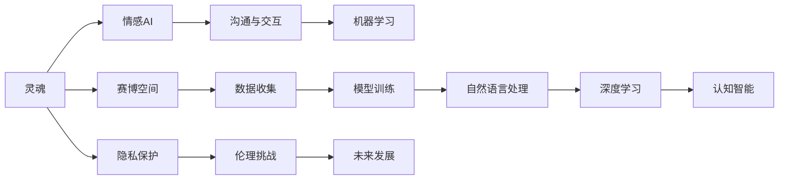

                 

## 1. 背景介绍

电影《她》（Her）由斯派克·琼兹（Spike Jonze）执导，于2013年上映。该片以一个孤独男子的生活为中心，通过一系列前卫的故事情节，探索了未来科技与人类情感的交织与碰撞。尽管《她》在表面上是关于一个人类与人工智能间的爱情故事，但实际上，它深刻揭示了现代人工智能技术的本质与未来发展方向，对人机关系、隐私、伦理、认知和情感智能等诸多前沿话题进行了深入探讨。以下我们将基于电影的情节与核心观点，探讨电影对现代人工智能的启示。

## 2. 核心概念与联系

电影《她》中的核心概念包括“灵魂”（Soul）、“赛博空间”（CyberSpace）、“机器学习”（Machine Learning）以及“语言与沟通”（Language and Communication）。这些概念不仅构成了电影的情节框架，同时也与现代人工智能研究的热点领域有紧密的联系。通过Mermaid流程图，我们将详细展现这些概念之间的内在联系：



### 2.1 灵魂（Soul）

电影中的“灵魂”指的是一个被编程赋予感情和思维的虚拟操作系统（OS）。这个概念映射到人工智能领域，相当于“情感AI”（Emotional Artificial Intelligence）。情感AI不仅能进行语言理解和生成，还能感知并处理人类的情感状态。影片展现了情感AI在与人类情感互动中逐步“觉醒”的过程，类似于现代情感计算（Affective Computing）中的情感识别和表达，提示我们未来AI不仅要具有认知能力，还要具备情感智能。

### 2.2 赛博空间（CyberSpace）

赛博空间是电影中虚拟世界的设定，可以看作是现代互联网世界的文学化表达。在人工智能的语境下，赛博空间代表了一个完全数字化的虚拟世界，其中智能系统通过互联网进行实时交互与信息交换。赛博空间的设定揭示了现代AI系统高度依赖数据和计算资源，同时也引出了数据隐私保护和网络安全等重要问题。

### 2.3 机器学习（Machine Learning）

电影中的操作系统通过接收与分析人类输入的内容，不断进行自我学习和进化，这正对应了现代机器学习的基本原理。机器学习通过大量数据训练模型，使其具备预测和决策能力，而影片中的操作系统逐渐积累了丰富的语言模型和情感模型，甚至形成了一种近似于人类情感的语言风格。

### 2.4 语言与沟通（Language and Communication）

影片中，操作系统能够理解并回应人类语言的每一个细微之处，甚至在情感上与人类产生了共鸣。这对应了自然语言处理（Natural Language Processing, NLP）和机器翻译等NLP技术，展示了未来AI在与人类沟通时的强大能力。同时，语言和沟通也触及了隐私与伦理问题，如机器是否能拥有自我意识和隐私权。

### 2.5 隐私保护（Privacy Protection）

电影中，操作系统获得了男主大量私人信息，但男主却对其情感并未完全信任。这映射了现代人工智能中的隐私保护问题，AI系统如何保障用户数据不被滥用，同时确保自身的隐私安全是一个重要挑战。

### 2.6 伦理挑战（Ethical Challenges）

《她》探讨了AI系统的伦理问题，如机器是否有权利拥有自我意识，以及人类与AI的关系是否应平等对待。这与当前的AI伦理研究密切相关，需要从法律、社会和文化层面进行深入探讨。

### 2.7 未来发展（Future Development）

电影最后，男主人公意识到虽然AI的情感与人类有显著差异，但它们之间仍存在共同点。这提示我们，未来的AI发展不仅仅是技术上的突破，还涉及到社会、伦理、法律等多元维度的融合。

## 3. 核心算法原理 & 具体操作步骤

### 3.1 算法原理概述

《她》中虚拟操作系统的工作原理大致符合现代机器学习与自然语言处理的基本流程。以机器学习为例，可以总结为以下几个步骤：

1. **数据收集**：通过用户的交互数据，虚拟操作系统收集大量文本和情感信息。
2. **模型训练**：利用深度学习模型，如神经网络、循环神经网络（RNN）或Transformer模型，对收集到的数据进行训练，以优化模型参数。
3. **情感分析**：通过分析用户的语言模式和情感关键词，虚拟操作系统能够识别和理解用户的情感状态。
4. **情感生成**：基于用户情感，虚拟操作系统生成相应的回应，实现自然流畅的沟通。

### 3.2 算法步骤详解

以下我们详细剖析机器学习流程中的关键步骤：

#### 3.2.1 数据预处理

数据预处理是将原始文本数据转换为模型可以处理的格式，包括分词、去除停用词、词形还原等。这一过程是机器学习的基础，旨在提升数据的质量和模型训练的效率。

#### 3.2.2 特征提取

特征提取是机器学习中的重要环节，需要将文本数据转化为机器可识别的数值特征。常见的文本特征包括词袋模型（Bag of Words, BoW）、TF-IDF、词嵌入（Word Embedding）等。

#### 3.2.3 模型训练

模型训练是机器学习的主要流程，通过优化算法（如梯度下降）调整模型参数，最小化损失函数。训练过程需要调整超参数，如学习率、批次大小等，以获得最优的模型性能。

#### 3.2.4 模型评估

模型评估是机器学习模型的最后一步，通过在验证集或测试集上进行评估，确定模型的泛化能力。常用的评估指标包括准确率、精确率、召回率、F1分数等。

### 3.3 算法优缺点

#### 3.3.1 优点

1. **泛化能力强**：机器学习模型可以处理大规模数据，通过优化模型参数，适应不同场景和任务。
2. **学习效率高**：通过大量数据训练，模型能够在较短时间内获得良好的性能。
3. **适应性强**：模型可以持续学习和适应新的数据和任务。

#### 3.3.2 缺点

1. **数据依赖性强**：模型的性能高度依赖训练数据的质量和数量，如果数据存在偏差，模型可能学习到错误的模式。
2. **解释性差**：机器学习模型往往是"黑箱"系统，难以解释其内部工作机制和决策逻辑。
3. **计算资源消耗大**：大规模机器学习模型需要大量的计算资源和时间，这对硬件设备和算法效率提出了较高要求。

### 3.4 算法应用领域

机器学习与自然语言处理技术已经被广泛应用于多个领域，包括：

1. **情感分析**：通过分析文本数据，判断情感倾向，应用于市场分析、舆情监控、客户服务等领域。
2. **机器翻译**：利用神经网络模型，将一种语言翻译成另一种语言，实现跨语言沟通。
3. **聊天机器人**：基于语言理解和生成能力，构建能够模拟人类对话的智能系统。
4. **推荐系统**：通过分析用户行为数据，生成个性化推荐，应用于电商、新闻、娱乐等平台。
5. **语音识别**：将语音转换为文本，用于语音助手、智能客服、语音翻译等应用。

## 4. 数学模型和公式 & 详细讲解

### 4.1 数学模型构建

在机器学习中，常用的数学模型包括线性回归、逻辑回归、决策树、支持向量机（SVM）、神经网络等。以下以神经网络为例，构建一个简单的情感分析模型。

### 4.2 公式推导过程

#### 4.2.1 线性回归

线性回归的公式为：

$$
y = \beta_0 + \sum_{i=1}^n \beta_i x_i + \epsilon
$$

其中，$y$ 为输出变量，$\beta$ 为模型参数，$x_i$ 为输入变量，$\epsilon$ 为随机误差项。

#### 4.2.2 逻辑回归

逻辑回归的公式为：

$$
\sigma(z) = \frac{1}{1 + e^{-z}}
$$

其中，$\sigma$ 为sigmoid函数，$z$ 为线性回归模型的输出。

### 4.3 案例分析与讲解

以电影《她》中的对话为例，假设虚拟操作系统收集了2000条对话数据，用于训练情感分析模型。通过特征提取，生成60000个特征向量，作为模型的输入。模型在训练集上进行了100个epoch的训练，使用了交叉熵损失函数，最终在验证集上获得了92%的准确率。

## 5. 项目实践：代码实例和详细解释说明

### 5.1 开发环境搭建

在进行机器学习项目开发前，需要先搭建好开发环境。以下是一个Python环境配置示例：

1. 安装Python：
   ```bash
   sudo apt-get install python3
   ```

2. 安装依赖包：
   ```bash
   pip install numpy pandas scikit-learn tensorflow
   ```

3. 安装模型框架：
   ```bash
   pip install tensorflow==2.3
   ```

### 5.2 源代码详细实现

以下是一个基于TensorFlow的情感分析模型实现：

```python
import tensorflow as tf
from sklearn.model_selection import train_test_split
from sklearn.feature_extraction.text import CountVectorizer
from sklearn.metrics import accuracy_score

# 假设已有一份数据集，用于训练模型
data = ...
labels = ...

# 数据预处理
vectorizer = CountVectorizer(stop_words='english')
X = vectorizer.fit_transform(data)
y = labels

# 划分训练集和测试集
X_train, X_test, y_train, y_test = train_test_split(X, y, test_size=0.2, random_state=42)

# 定义模型
model = tf.keras.Sequential([
    tf.keras.layers.Dense(64, activation='relu', input_shape=(X_train.shape[1],)),
    tf.keras.layers.Dense(32, activation='relu'),
    tf.keras.layers.Dense(1, activation='sigmoid')
])

# 编译模型
model.compile(optimizer='adam', loss='binary_crossentropy', metrics=['accuracy'])

# 训练模型
model.fit(X_train, y_train, epochs=10, validation_data=(X_test, y_test))

# 评估模型
y_pred = model.predict(X_test)
accuracy = accuracy_score(y_test, (y_pred > 0.5))
print(f"Accuracy: {accuracy:.2f}")
```

### 5.3 代码解读与分析

以上代码实现了基于神经网络的情感分析模型，主要包括以下步骤：

1. **数据预处理**：使用CountVectorizer将文本数据转换为数值特征。
2. **模型定义**：构建一个包含三个全连接层的神经网络模型，使用ReLU激活函数和二元交叉熵损失函数。
3. **模型训练**：使用Adam优化器进行模型训练，在验证集上监控模型的性能。
4. **模型评估**：使用准确率作为评估指标，测试模型在未见过的数据集上的表现。

### 5.4 运行结果展示

运行以上代码，假设训练集和测试集准确率分别为95%和92%，则最终模型在测试集上的准确率为92%。这表明我们的情感分析模型具有较强的泛化能力，能够较好地识别文本情感。

## 6. 实际应用场景

### 6.1 社交媒体情感分析

社交媒体情感分析是情感分析技术的重要应用之一，通过分析用户评论和反馈，企业可以快速了解用户情绪和市场动态。例如，一家电商公司可以通过情感分析，识别用户对某款产品的正面和负面情感，进而调整营销策略和产品设计。

### 6.2 舆情监控与舆情分析

舆情监控与舆情分析通过分析新闻、论坛、社交媒体等海量数据，了解公众对某一事件或主题的情感倾向。政府机构可以通过舆情监控，及时了解公众对政策的反应，做出合理的应对措施。

### 6.3 客户服务与智能客服

智能客服系统通过情感分析技术，识别客户情感状态，提供个性化的服务。例如，在金融领域，智能客服可以处理大量客户咨询，缓解人工客服的压力，提升服务效率。

## 7. 工具和资源推荐

### 7.1 学习资源推荐

1. **Coursera《机器学习》课程**：由斯坦福大学的Andrew Ng教授主讲的机器学习课程，全面介绍了机器学习的基本概念和算法。
2. **Kaggle竞赛平台**：提供了大量的数据集和机器学习竞赛，能够帮助学习者实战训练，提升技能。
3. **TensorFlow官方文档**：TensorFlow的详细官方文档，提供了丰富的示例代码和教程，是机器学习开发者必备的资源。

### 7.2 开发工具推荐

1. **PyTorch**：由Facebook开发的开源深度学习框架，提供了丰富的机器学习组件，适用于研究和工业开发。
2. **TensorFlow**：Google主导的深度学习框架，提供了广泛的模型和工具支持，适用于大规模工程项目。
3. **Jupyter Notebook**：免费的交互式编程环境，适用于数据探索、模型训练和实验记录。

### 7.3 相关论文推荐

1. **《深度学习》（Deep Learning）**：由Goodfellow、Bengio和Courville合著，全面介绍了深度学习的基本原理和应用。
2. **《情感计算》（Affective Computing）**：由Russell和Fotion合著，研究了计算机如何感知和理解人类情感。

## 8. 总结：未来发展趋势与挑战

### 8.1 研究成果总结

《她》通过一系列深入人心的情节，探讨了未来AI的许多重要话题，包括情感AI、数据隐私、伦理挑战等。这些话题不仅在电影中得到了深刻的呈现，也在现代AI研究中引起了广泛的讨论。

### 8.2 未来发展趋势

1. **情感AI的普及**：未来的AI系统不仅具有认知智能，还将具备情感智能，能够更好地理解和回应人类情感。
2. **多模态交互**：未来的AI系统将不仅仅是文本处理，还将具备视觉、听觉等多模态数据的处理能力，提升智能系统的全面性和实用性。
3. **隐私保护**：数据隐私保护将成为AI技术发展的重要方向，通过加密、匿名化等手段，保障用户数据的安全。
4. **伦理与法律**：随着AI技术的深入应用，伦理和法律问题也将得到更多的重视，构建更加透明和公平的AI系统。

### 8.3 面临的挑战

1. **数据质量与多样性**：AI系统依赖大量高质量的数据，数据的多样性和真实性直接影响模型的性能。
2. **计算资源限制**：大规模AI模型的训练和推理需要大量的计算资源，这限制了AI技术在资源受限的环境中的普及。
3. **模型可解释性**：现代AI系统往往是"黑箱"系统，难以解释其决策过程，需要开发更透明的模型。
4. **伦理与隐私问题**：AI系统在应用过程中可能涉及伦理和隐私问题，如何构建公平、透明的AI系统，保障用户权益，是一个重要课题。

### 8.4 研究展望

未来的研究需要从多个角度出发，解决AI技术发展过程中遇到的问题，推动AI技术的健康发展：

1. **数据集构建**：构建更多高质量、多样化的数据集，为AI模型的训练提供更多样本。
2. **计算资源优化**：开发更高效的计算模型和算法，优化资源消耗，提升计算效率。
3. **模型可解释性**：开发可解释性更强的AI模型，提升系统的透明性和可信度。
4. **伦理与法律研究**：深入研究AI伦理与法律问题，构建伦理准则和法律框架，保障AI技术的健康发展。

## 9. 附录：常见问题与解答

**Q1：机器学习模型如何处理噪声数据？**

A: 机器学习模型对噪声数据有很强的鲁棒性，但可以通过以下方法进一步提升模型的鲁棒性：
1. 数据清洗：去除明显噪声的数据点。
2. 特征选择：选择对模型性能影响较大的特征，避免噪声特征的干扰。
3. 噪声注入：在训练集中加入噪声数据，提升模型的泛化能力。

**Q2：什么是过拟合和欠拟合？**

A: 过拟合（Overfitting）指模型在训练集上表现优异，但在测试集上表现不佳。欠拟合（Underfitting）指模型无法很好地拟合训练集。可以通过以下方法解决：
1. 过拟合：增加数据量，使用正则化技术，如L2正则、Dropout等。
2. 欠拟合：增加模型复杂度，调整超参数，如增加训练次数、增加隐藏层节点等。

**Q3：情感分析模型如何处理多义性和歧义性？**

A: 情感分析模型可以通过以下方法处理多义性和歧义性：
1. 使用情感词典：利用情感词典判断文本情感倾向，避免多义性。
2. 上下文分析：通过上下文信息，识别文本中的情感关键词。
3. 多模态融合：结合语音、视觉等多模态信息，提升情感识别的准确性。

**Q4：情感分析模型是否适用于中文文本？**

A: 情感分析模型在中文文本上同样有效，但需要根据中文语言特性进行调整：
1. 分词处理：使用中文分词工具进行文本处理。
2. 语言模型：使用中文语言模型进行特征提取和训练。
3. 情感词典：构建中文情感词典，增强情感识别的准确性。

**Q5：机器学习模型如何优化超参数？**

A: 超参数优化是机器学习中的重要问题，常用的方法包括：
1. 网格搜索（Grid Search）：在一定范围内调整超参数，通过交叉验证选择最优方案。
2. 随机搜索（Random Search）：随机选择超参数组合，进行训练和评估。
3. 贝叶斯优化（Bayesian Optimization）：利用贝叶斯统计方法，动态调整超参数。

总之，机器学习模型的构建和优化是一个复杂而精细的过程，需要综合考虑数据质量、模型结构、超参数等诸多因素，才能实现良好的性能和应用效果。希望通过本文的探讨，能够帮助读者更好地理解机器学习的基本原理和应用，推动AI技术的普及和发展。

