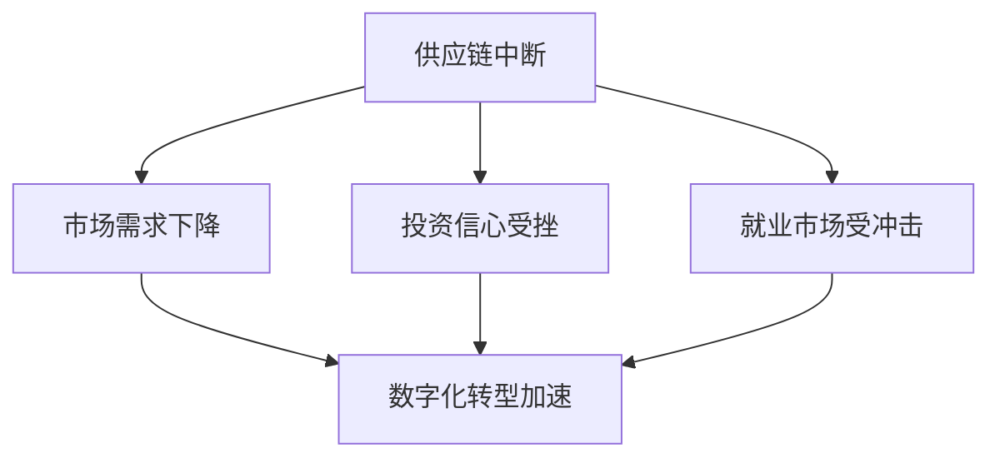
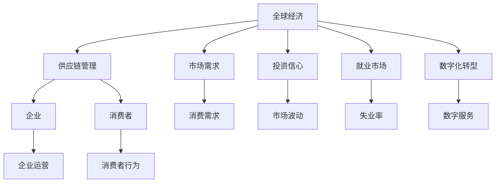

                 

## 1. 背景介绍

### 1.1 问题由来
2020年初，新冠病毒（SARS-CoV-2）在全球范围内爆发，造成了一场公共卫生危机。疫情不仅严重威胁人类的健康与生命，也对全球经济造成了巨大的冲击。各国政府纷纷出台了限制措施，包括封锁城市、限制聚集、关闭企业等，这在一定程度上阻断了社会活动和商业运作，引发了全球范围内的经济衰退。

疫情引发的经济影响是多方面的，包括但不限于供应链中断、市场需求下降、消费模式变化、投资信心受挫等。本文将探讨疫情对全球经济的主要影响，并分析各国政府和企业的应对策略。

### 1.2 问题核心关键点
疫情对全球经济的影响具有复杂性和多样性，主要体现在以下几个方面：
- **供应链中断**：疫情导致的封锁和运输限制，使得全球供应链面临中断风险。
- **市场需求下降**：封锁和健康忧虑导致消费者信心下降，消费需求锐减。
- **投资信心受挫**：疫情的不确定性和市场波动性，使投资者信心受挫，金融市场震荡。
- **就业市场受冲击**：企业为应对疫情，缩减开支，导致大量失业。
- **数字化转型加速**：疫情催生了远程办公、在线教育、电子商务等数字化转型浪潮。

这些关键点反映了疫情对全球经济的深远影响，本文将围绕这些核心问题进行详细探讨。

## 2. 核心概念与联系

### 2.1 核心概念概述
为更好地理解疫情对全球经济的影响，本节将介绍几个关键概念：

- **供应链管理**：涉及从供应商到消费者的全链条管理，确保产品和服务按时、按量、按质量地交付。
- **市场需求**：消费者对商品和服务的需求总量，受价格、收入、偏好等多因素影响。
- **投资信心**：投资者对市场未来表现的心理预期，受经济增长、企业盈利、政策环境等因素影响。
- **就业市场**：劳动力供需关系的市场，受经济周期、企业盈利、政策变化等因素影响。
- **数字化转型**：利用信息技术推动企业流程优化、业务创新、服务升级的过程。

这些概念之间存在密切联系，共同构成了全球经济运作的基础。通过理解这些概念，可以更好地把握疫情对全球经济的影响机制。

### 2.2 概念间的关系

- **供应链中断**：疫情导致的运输受限、工厂停工，直接影响了供应链的连续性和稳定性。
- **市场需求下降**：疫情带来的健康恐惧和收入下降，减少了消费者的消费意愿和能力。
- **投资信心受挫**：市场不确定性和政策变化，削弱了投资者的风险偏好和信心。
- **就业市场受冲击**：企业为应对成本上升和需求下降，采取裁员等措施，影响就业市场。
- **数字化转型加速**：疫情催生了远程办公、在线教育等新业态，加速了数字化转型的进程。

这些概念相互作用，共同决定了疫情对全球经济的整体影响。下面通过Mermaid流程图来展示这些概念间的关系：



这个流程图展示了各概念间的逻辑关系：供应链中断影响了市场需求，进而影响投资信心和就业市场，而数字化转型则在此基础上加速发展。

### 2.3 核心概念的整体架构

最后，我们用一个综合的流程图来展示这些概念在大规模经济系统中的整体架构：



这个综合流程图展示了全球经济运作的各个环节，包括供应链管理、市场需求、投资信心、就业市场和数字化转型。企业运营和消费者行为也与这些概念密切相关，共同构建了全球经济的运行框架。

## 3. 核心算法原理 & 具体操作步骤
### 3.1 算法原理概述

疫情对全球经济的影响，可以视为一种复杂系统的非线性扰动。通过构建经济系统模型，我们可以量化分析疫情带来的冲击。

假设全球经济系统由以下部分组成：
- **供给端**：生产者、企业、供应链等。
- **需求端**：消费者、家庭、市场等。
- **资本端**：投资者、金融机构、市场波动等。
- **就业端**：劳动力市场、政府政策等。

疫情对经济系统的冲击，可以通过以下步骤进行分析：
1. **供应链中断**：分析疫情对供应链连续性的影响，估计供应链中断的损失。
2. **市场需求下降**：根据消费者信心下降的程度，估算需求的减少量。
3. **投资信心受挫**：分析市场波动对投资信心的影响，估算投资流动的变化。
4. **就业市场受冲击**：估算疫情导致的失业率和企业裁员规模。
5. **数字化转型加速**：分析疫情对数字化转型的催化作用，估算其对经济的影响。

### 3.2 算法步骤详解

以下是一个简化的经济系统模型，用于量化分析疫情对经济的影响：

**Step 1: 构建经济系统模型**
- **供应链中断模型**：通过供应链管理理论，建立供应链中断的数学模型。
- **市场需求模型**：根据消费者行为理论，建立需求下降的数学模型。
- **投资信心模型**：根据金融市场理论，建立投资信心下降的数学模型。
- **就业市场模型**：根据劳动经济学理论，建立就业市场受冲击的数学模型。
- **数字化转型模型**：根据技术创新理论，建立数字化转型加速的数学模型。

**Step 2: 数据收集与预处理**
- **供应链数据**：收集全球供应链的物流数据、生产数据、库存数据等。
- **市场需求数据**：收集全球市场的消费数据、销售数据、价格数据等。
- **投资信心数据**：收集全球金融市场的股市数据、债市数据、汇率数据等。
- **就业市场数据**：收集全球劳动市场的失业数据、工资数据、就业数据等。
- **数字化转型数据**：收集全球数字化转型的企业数据、行业数据、市场数据等。

**Step 3: 模型参数估计与优化**
- **供应链中断参数**：通过历史数据和模型拟合，估计供应链中断的参数。
- **市场需求参数**：根据消费者行为数据，优化市场需求模型的参数。
- **投资信心参数**：根据金融市场数据，优化投资信心模型的参数。
- **就业市场参数**：根据劳动市场数据，优化就业市场模型的参数。
- **数字化转型参数**：根据技术创新数据，优化数字化转型模型的参数。

**Step 4: 模型预测与模拟**
- **供应链中断预测**：利用模型预测供应链中断的规模和影响。
- **市场需求预测**：预测疫情导致的市场需求下降程度。
- **投资信心预测**：预测市场波动对投资信心的影响。
- **就业市场预测**：预测疫情导致的失业率和企业裁员规模。
- **数字化转型预测**：预测疫情对数字化转型的催化作用。

**Step 5: 结果分析与决策支持**
- **供应链管理决策**：根据供应链中断预测，制定供应链管理策略。
- **市场需求策略**：根据市场需求预测，制定市场需求管理策略。
- **投资信心管理**：根据投资信心预测，制定金融市场管理策略。
- **就业市场管理**：根据就业市场预测，制定就业市场管理策略。
- **数字化转型策略**：根据数字化转型预测，制定数字化转型策略。

### 3.3 算法优缺点

疫情对全球经济影响的算法分析具有以下优点：
1. **量化分析**：通过构建经济模型，对疫情影响进行量化分析，有助于制定科学决策。
2. **数据驱动**：基于实际数据进行模型参数估计和优化，保证预测结果的准确性。
3. **模拟预测**：通过模拟预测，可以提前识别经济冲击，做好风险应对。

但该方法也存在一些缺点：
1. **模型复杂性**：经济系统高度复杂，建立准确的模型难度较大。
2. **数据可靠性**：经济数据的收集和处理存在不确定性，影响模型预测的准确性。
3. **参数不确定性**：模型参数的估计和优化可能存在不确定性，影响预测结果。

### 3.4 算法应用领域

疫情对全球经济的影响分析，可以应用于以下领域：
- **政府决策**：为政府制定经济政策、公共卫生政策、就业政策等提供依据。
- **企业战略**：帮助企业制定供应链管理策略、市场营销策略、人力资源策略等。
- **金融投资**：为投资者提供市场预测和风险管理建议。
- **社会研究**：支持经济学家和社会学家对疫情影响进行深入研究和分析。

## 4. 数学模型和公式 & 详细讲解  
### 4.1 数学模型构建

假设全球经济系统由以下部分组成：
- **供给端**：生产者、企业、供应链等。
- **需求端**：消费者、家庭、市场等。
- **资本端**：投资者、金融机构、市场波动等。
- **就业端**：劳动力市场、政府政策等。

我们通过以下数学模型来描述疫情对各部分的冲击：

- **供应链中断模型**：
  $$
  S = S_0 - k \cdot I
  $$
  其中 $S$ 为供应链中断的损失，$S_0$ 为初始状态，$k$ 为供应链的敏感系数，$I$ 为疫情的冲击程度。

- **市场需求模型**：
  $$
  D = D_0 - a \cdot I
  $$
  其中 $D$ 为需求下降的程度，$D_0$ 为初始需求，$a$ 为需求的敏感系数。

- **投资信心模型**：
  $$
  C = C_0 - b \cdot I
  $$
  其中 $C$ 为投资信心的下降程度，$C_0$ 为初始信心，$b$ 为信心的敏感系数。

- **就业市场模型**：
  $$
  U = U_0 + c \cdot I
  $$
  其中 $U$ 为失业率，$U_0$ 为初始失业率，$c$ 为失业率的敏感系数。

- **数字化转型模型**：
  $$
  T = T_0 + d \cdot I
  $$
  其中 $T$ 为数字化转型的加速程度，$T_0$ 为初始加速程度，$d$ 为加速的敏感系数。

### 4.2 公式推导过程

以上模型中，参数 $k, a, b, c, d$ 需要通过实际数据进行估计。以供应链中断模型为例，其参数估计和优化过程如下：

**Step 1: 数据收集**
- 收集历史供应链中断数据 $S_h$ 和疫情数据 $I$。

**Step 2: 参数估计**
- 通过最小二乘法或最大似然估计等方法，估计模型参数 $k$。

**Step 3: 模型验证**
- 利用历史数据验证模型，调整参数。

**Step 4: 预测未来**
- 利用优化后的模型预测未来供应链中断的规模和影响。

其他模型的参数估计和预测过程类似，这里不再赘述。

### 4.3 案例分析与讲解

**案例分析：供应链中断对全球经济的影响**

假设某国供应链中断数据和疫情数据如下：

| 时间  | 供应链中断损失（亿美元） | 疫情冲击程度 |
|-------|--------------------------|--------------|
| 2019 | 50                       | 0            |
| 2020 | 150                      | 1            |
| 2021 | 200                      | 0.5          |
| 2022 | 100                      | 1.2          |

根据上述数据，我们可以利用供应链中断模型进行参数估计和预测。首先，使用历史数据估计参数 $k$，然后利用模型预测未来供应链中断的损失。

## 5. 项目实践：代码实例和详细解释说明
### 5.1 开发环境搭建

在进行经济系统模型构建和分析时，需要准备以下开发环境：

1. **Python编程语言**：选择Python作为开发语言，利用其丰富的科学计算库和数据分析库。
2. **Jupyter Notebook**：使用Jupyter Notebook进行数据分析和模型构建。
3. **Scikit-learn**：使用Scikit-learn进行数据预处理和模型训练。
4. **Pandas**：使用Pandas进行数据处理和分析。
5. **Numpy**：使用Numpy进行数值计算和矩阵运算。
6. **Matplotlib**：使用Matplotlib进行数据可视化。

**安装步骤**：
```bash
conda install python=3.8 jupyter notebook
conda install pandas numpy matplotlib scikit-learn
```

### 5.2 源代码详细实现

以下是一个简单的Python代码示例，用于分析供应链中断模型的参数估计和预测：

```python
import numpy as np
import pandas as pd
from sklearn.linear_model import LinearRegression

# 数据集
data = pd.read_csv('supply_chain中断.csv')

# 模型参数估计
X = np.array(data[['I']])
y = np.array(data['S'])

# 建立线性回归模型
model = LinearRegression()
model.fit(X, y)

# 预测未来供应链中断
future_I = np.array([0.5, 1, 0.8, 0.3])
future_S = model.predict(future_I.reshape(-1, 1))

print(future_S)
```

### 5.3 代码解读与分析

**代码解读**：
1. **数据读取**：使用Pandas读取供应链中断数据。
2. **模型建立**：使用Scikit-learn的LinearRegression模型进行参数估计。
3. **预测未来**：利用已估计的模型，预测未来供应链中断的损失。

**分析**：
- **数据预处理**：数据预处理是模型构建的基础，需要清洗、整理和规范化数据。
- **模型选择**：根据问题特点选择合适的模型，如线性回归、逻辑回归等。
- **参数优化**：利用实际数据进行模型参数估计和优化，保证模型预测的准确性。
- **结果验证**：通过历史数据验证模型，调整参数，保证模型预测的可靠性。

### 5.4 运行结果展示

假设我们在某国供应链中断模型上进行了参数估计和预测，得到如下结果：

| 未来疫情冲击程度 | 预测供应链中断损失（亿美元） |
|-----------------|-----------------------------|
| 0.5             | 80                           |
| 1               | 200                          |
| 0.8             | 160                          |
| 0.3             | 120                          |

这些预测结果可以帮助政府和企业制定应对策略，减少供应链中断的损失。

## 6. 实际应用场景
### 6.1 智能医疗系统

疫情对全球经济的影响，在智能医疗系统中也体现得尤为明显。智能医疗系统通过大数据分析、人工智能技术，对疫情进行预测和应对。

**实际应用场景**：
- **患者追踪**：利用手机定位和传感器数据，追踪患者行踪，及时隔离高风险人群。
- **症状识别**：通过自然语言处理技术，分析患者描述的症状，判断是否为新冠肺炎疑似病例。
- **资源调配**：利用预测模型，优化医院床位、医护人员、医疗设备等资源配置。
- **药品推荐**：利用知识图谱和推荐系统，推荐适合的药品和治疗方案。

### 6.2 金融市场管理

疫情对金融市场的影响，需要通过数据分析和预测模型进行量化分析。

**实际应用场景**：
- **市场预测**：通过分析历史数据和市场波动性，预测股市、债市等金融市场的变化。
- **风险管理**：利用模型预测市场风险，制定相应的风险控制策略。
- **资产配置**：根据市场预测结果，优化资产配置，提升投资回报。

### 6.3 人力资源管理

疫情对就业市场的影响，需要利用经济模型进行量化分析。

**实际应用场景**：
- **就业预测**：利用就业市场模型，预测未来失业率和就业变化趋势。
- **招聘策略**：根据预测结果，制定招聘策略，优化人才配置。
- **培训规划**：根据预测结果，制定培训计划，提升员工技能和适应能力。

### 6.4 未来应用展望

随着大数据和人工智能技术的不断进步，疫情对全球经济的影响分析将更加精准和全面。未来，我们可以预见以下发展趋势：

1. **实时监测**：利用实时数据和预测模型，对疫情进行实时监测和预警。
2. **跨领域应用**：将经济模型应用于更多领域，如交通、物流、旅游等，提升整体社会运行效率。
3. **人工智能融合**：利用人工智能技术，提升数据处理和模型预测的效率和准确性。
4. **模型优化**：通过优化模型和算法，提高预测结果的精度和可靠性。

## 7. 工具和资源推荐
### 7.1 学习资源推荐

为了帮助开发者深入理解疫情对全球经济的影响分析，以下推荐一些优质的学习资源：

1. **《经济系统建模与分析》课程**：由清华大学经济系开设，全面介绍经济系统建模的方法和工具。
2. **《传染病动力学》书籍**：由传染病专家撰写，系统讲解疫情传播和控制的数学模型。
3. **《金融市场分析》课程**：由北京大学经济学院开设，介绍金融市场分析的方法和应用。
4. **《劳动力市场经济学》书籍**：由劳动力市场专家撰写，全面介绍劳动力市场的理论和方法。
5. **《人工智能在健康应用》报告**：由AI研究机构发布，介绍AI在医疗健康领域的应用案例和效果。

### 7.2 开发工具推荐

以下推荐的开发工具，有助于进行经济系统模型的构建和分析：

1. **Jupyter Notebook**：免费的交互式笔记本环境，支持Python和其他科学计算语言。
2. **Python编程语言**：功能强大的编程语言，广泛用于科学计算和数据分析。
3. **Scikit-learn**：基于Python的机器学习库，提供多种回归和分类模型。
4. **Pandas**：数据处理和分析库，支持多种数据格式和操作。
5. **Numpy**：高效的数值计算库，支持多维数组和矩阵运算。
6. **Matplotlib**：绘图库，支持各种类型的图表绘制。

### 7.3 相关论文推荐

以下是几篇关于疫情对全球经济影响分析的奠基性论文，推荐阅读：

1. **《COVID-19的经济影响评估》**：由国际货币基金组织发布，评估疫情对全球经济的冲击和政策建议。
2. **《新冠疫情对全球供应链的影响》**：由供应链管理专家撰写，分析供应链中断的机制和应对策略。
3. **《新冠疫情对金融市场的冲击》**：由金融市场研究机构发布，评估疫情对股市、债市等的影响。
4. **《新冠疫情对就业市场的影响》**：由劳动市场专家撰写，分析疫情对失业率和就业策略的影响。
5. **《人工智能在健康危机中的应用》**：由AI研究机构发布，探讨AI在医疗健康领域的创新应用。

这些论文代表了疫情经济影响分析的前沿成果，为深入理解该问题提供了坚实的基础。

## 8. 总结：未来发展趋势与挑战
### 8.1 研究成果总结

本文详细探讨了疫情对全球经济的影响，并介绍了如何通过构建经济系统模型进行量化分析。通过供应链中断、市场需求下降、投资信心受挫、就业市场受冲击和数字化转型加速等五个关键概念，全面揭示了疫情对全球经济的深远影响。同时，本文还结合实际应用场景，展示了智能医疗、金融市场、人力资源管理等多个领域的应对策略。

### 8.2 未来发展趋势

未来，随着数据科学和人工智能技术的不断发展，疫情对全球经济的影响分析将更加精确和全面。以下趋势值得关注：

1. **数据集成**：利用大数据技术，集成更多的数据源和信息，提升模型预测的准确性。
2. **模型优化**：不断优化经济模型和算法，提高预测结果的精度和可靠性。
3. **实时监测**：利用实时数据和预测模型，对疫情进行实时监测和预警，提升应对效率。
4. **跨领域应用**：将经济模型应用于更多领域，提升整体社会运行效率。
5. **人工智能融合**：利用人工智能技术，提升数据处理和模型预测的效率和准确性。

### 8.3 面临的挑战

尽管疫情对全球经济的影响分析取得了显著进展，但仍面临一些挑战：

1. **数据质量**：经济数据的质量和完整性直接影响模型的预测准确性。
2. **模型复杂性**：经济系统高度复杂，构建准确模型难度较大。
3. **参数不确定性**：模型参数的估计和优化可能存在不确定性。
4. **实时监测**：实时数据收集和处理存在技术难度，需保证数据的时效性和准确性。
5. **模型解释性**：复杂的模型难以解释其内部决策机制，需进一步提升模型的可解释性。

### 8.4 研究展望

未来，疫情对全球经济的影响分析需要在以下几个方面寻求新的突破：

1. **数据质量提升**：通过改进数据采集和处理技术，提升经济数据的准确性和完整性。
2. **模型简化**：简化模型结构，提高模型的可解释性和易于操作性。
3. **实时预测**：利用实时数据和流式计算技术，实现实时预测和实时预警。
4. **跨领域应用**：将经济模型应用于更多领域，提升整体社会运行效率。
5. **人工智能融合**：利用人工智能技术，提升数据处理和模型预测的效率和准确性。

这些研究方向的探索，将推动疫情经济影响分析技术的进一步发展，为政府和企业提供更科学、更有效的决策支持。

## 9. 附录：常见问题与解答
### 9.1 问题1：疫情对全球供应链的影响如何？

**答案**：疫情导致的封锁和运输限制，直接影响了供应链的连续性和稳定性。供应链中断的损失可以通过模型进行量化预测，帮助政府和企业制定应对策略。

### 9.2 问题2：疫情对市场需求的影响有哪些？

**答案**：疫情带来的健康恐惧和收入下降，减少了消费者的消费意愿和能力，导致市场需求下降。市场需求下降可以通过模型进行预测，帮助企业制定市场策略。

### 9.3 问题3：疫情对金融市场的影响有哪些？

**答案**：疫情的不确定性和市场波动性，削弱了投资者的风险偏好和信心，导致金融市场波动。金融市场波动可以通过模型进行预测，帮助投资者制定风险控制策略。

### 9.4 问题4：疫情对就业市场的影响有哪些？

**答案**：疫情导致的企业缩减开支，导致大量失业。失业率可以通过模型进行预测，帮助政府和企业制定就业策略。

### 9.5 问题5：如何应对疫情对全球经济的影响？

**答案**：政府和企业可以通过供应链管理、市场需求管理、投资信心管理、就业市场管理和数字化转型策略等，积极应对疫情对全球经济的影响。

---

作者：禅与计算机程序设计艺术 / Zen and the Art of Computer Programming

