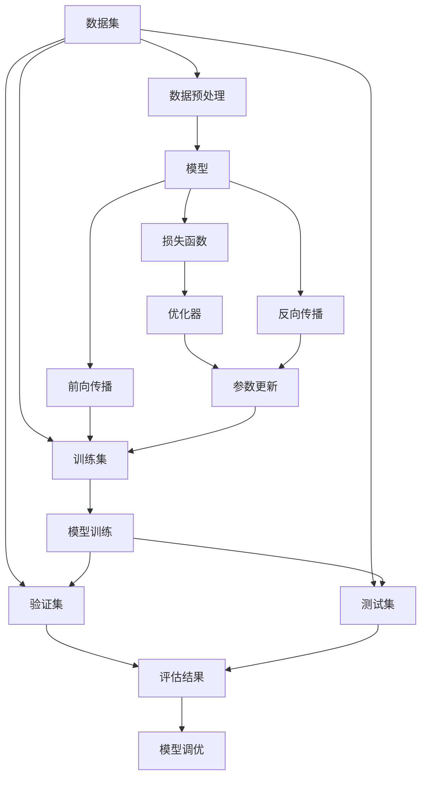

                 

# 监督学习 (Supervised Learning) 原理与代码实例讲解

## 1. 背景介绍

### 1.1 问题由来
监督学习是机器学习中一种经典的、广泛应用的范式。它通过有标签的训练数据集，训练一个模型，使得该模型可以准确地预测未见过的新数据的标签。

监督学习的成功范例之一是手写数字识别。在这项任务中，模型需要学习如何将像素级别的特征映射到数字标签上。目前，基于监督学习的模型已经在大规模图像识别、语音识别、自然语言处理等领域取得显著进展。

然而，随着数据量的增加和模型复杂度的提升，传统监督学习算法在处理大规模数据集时，面临计算资源紧张、模型过拟合等问题。近年来，深度学习框架如TensorFlow、PyTorch的崛起，使得监督学习算法得以应用于更复杂的非线性模型，如图形神经网络（GNN）、卷积神经网络（CNN）、循环神经网络（RNN）和Transformer等。

此外，随着生成对抗网络（GANs）和变分自编码器（VAEs）等生成模型的发展，监督学习与生成模型相结合，产生了诸多创新方法，如生成对抗网络训练、对抗样本生成、迁移学习等。

### 1.2 问题核心关键点
监督学习的核心问题在于如何有效地利用有标签数据，训练出一个泛化能力强的模型。关键点包括：
- 如何选择适当的模型。
- 如何设计合适的损失函数。
- 如何防止过拟合。
- 如何进行模型评估和调优。

监督学习中的主要问题可归纳为以下几个方面：
- 数据集不平衡：训练集中某一类别的样本数量远远超过其他类别，导致模型学习偏向该类别。
- 数据集噪声：训练集中可能包含错误标签或异常值，影响模型的泛化性能。
- 特征选择：如何选择和组合特征，使其尽可能地包含数据的全部信息，同时避免维度灾难。
- 模型复杂度：如何在保证模型性能的前提下，降低模型复杂度，避免过拟合。

### 1.3 问题研究意义
监督学习是人工智能领域的重要研究基础，其应用广泛且深入，对现代信息技术的发展具有重要的推动作用。监督学习范式有助于加速问题的解决和决策，提升数据处理的自动化程度。

在实际应用中，监督学习可以用于：
- 分类问题：如垃圾邮件识别、疾病诊断等。
- 回归问题：如房价预测、销售量预测等。
- 序列预测：如语音识别、机器翻译等。

此外，监督学习还应用于社交媒体分析、推荐系统、图像识别、自然语言处理等领域，产生了巨大的社会经济效益。

## 2. 核心概念与联系

### 2.1 核心概念概述
监督学习涉及以下几个关键概念：
- 数据集：包含输入数据和其对应的标签。
- 模型：用于拟合数据的函数或神经网络。
- 损失函数：衡量模型预测与真实标签之间的差距。
- 优化器：用于更新模型参数，使得损失函数最小化。

监督学习流程如下：
1. 数据预处理：包括数据清洗、数据增强、特征工程等步骤。
2. 模型训练：通过前向传播和反向传播更新模型参数，使得损失函数最小化。
3. 模型评估：在验证集或测试集上评估模型性能。
4. 模型调优：通过调整模型参数、选择正则化方法等方式，提高模型泛化性能。

监督学习的核心在于如何设计损失函数和优化器，使得模型在训练过程中能够高效地学习数据的内在规律，并在测试集上取得良好的泛化性能。

### 2.2 概念间的关系

监督学习中的关键概念之间的关系可以通过以下Mermaid流程图来展示：



这个流程图展示了大数据集处理、模型训练、模型评估和模型调优的完整流程。

## 3. 核心算法原理 & 具体操作步骤
### 3.1 算法原理概述
监督学习的基本原理是通过数据集训练模型，使得模型能够对新数据的标签进行准确预测。常见的监督学习算法包括线性回归、逻辑回归、支持向量机（SVM）、决策树、随机森林、神经网络等。

监督学习的目标是找到一个最优的模型参数$\theta$，使得模型在测试集上的损失最小化。设训练集为$D=\{(x_i, y_i)\}_{i=1}^N$，其中$x_i$为输入，$y_i$为标签。设模型为$f_{\theta}(x)$，则模型的损失函数为：

$$\mathcal{L}(\theta)=\frac{1}{N}\sum_{i=1}^N\ell(f_{\theta}(x_i), y_i)$$

其中$\ell$为损失函数，通常是均方误差（MSE）或交叉熵（CE）。

### 3.2 算法步骤详解
监督学习的主要步骤包括数据预处理、模型训练、模型评估和模型调优。下面详细介绍每个步骤的具体内容。

#### 数据预处理
数据预处理是监督学习中非常重要的一步，其目的是提升数据质量和模型性能。主要包括以下几个方面：

1. 数据清洗：删除缺失值、异常值等无用数据，提高数据质量。
2. 数据增强：通过对原始数据进行旋转、翻转、缩放等变换，生成更多训练样本，提高模型泛化性能。
3. 特征工程：选择合适的特征，并进行归一化、编码、组合等操作，提高模型性能。

#### 模型训练
模型训练是通过前向传播和反向传播更新模型参数，使得损失函数最小化。主要步骤如下：

1. 设置模型：选择合适的模型结构，如线性回归、神经网络等。
2. 初始化模型参数：对模型参数进行随机初始化。
3. 前向传播：将输入数据输入模型，计算模型输出。
4. 计算损失函数：将模型输出与真实标签计算损失函数值。
5. 反向传播：利用链式法则计算损失函数对每个模型参数的梯度。
6. 参数更新：根据梯度下降等优化算法更新模型参数，使得损失函数最小化。

#### 模型评估
模型评估是通过验证集或测试集评估模型性能。主要步骤如下：

1. 划分验证集和测试集：将数据集划分为训练集、验证集和测试集。
2. 验证集评估：在验证集上评估模型性能，调整模型参数。
3. 测试集评估：在测试集上评估模型性能，进行最终评估。

#### 模型调优
模型调优是通过调整模型参数、选择正则化方法等方式，提高模型泛化性能。主要步骤如下：

1. 调整超参数：选择合适的学习率、正则化参数等超参数。
2. 正则化：加入L2正则、Dropout等方式，防止过拟合。
3. 模型集成：通过集成多个模型，提高模型泛化性能。
4. 交叉验证：使用交叉验证技术，评估模型性能。

### 3.3 算法优缺点
监督学习的优点包括：
1. 数据驱动：通过有标签数据训练模型，能够高效地解决实际问题。
2. 模型复杂：可以构建复杂模型，进行高维度的特征提取。
3. 泛化性能：在训练集和测试集上表现良好，具有较高的泛化性能。

监督学习的缺点包括：
1. 数据依赖：需要大量的有标签数据，数据获取成本高。
2. 数据噪声：有标签数据可能包含错误标签或异常值，影响模型性能。
3. 特征选择：特征工程需要一定的经验和技巧，不易选择和组合。
4. 过拟合风险：模型过于复杂，可能出现过拟合现象。

### 3.4 算法应用领域
监督学习广泛应用于各个领域，包括：

1. 金融：预测股票价格、信用风险、市场波动等。
2. 医疗：诊断疾病、预测病人死亡率、识别药物副作用等。
3. 图像识别：识别物体、人脸、手势等。
4. 自然语言处理：语言翻译、情感分析、文本分类等。
5. 推荐系统：推荐商品、新闻、视频等。
6. 社交媒体分析：用户行为分析、情感分析、舆情监测等。

## 4. 数学模型和公式 & 详细讲解 & 举例说明

### 4.1 数学模型构建
监督学习的数学模型包括训练数据集、模型函数、损失函数和优化器。

设训练数据集为$D=\{(x_i, y_i)\}_{i=1}^N$，其中$x_i$为输入，$y_i$为标签。设模型函数为$f_{\theta}(x)$，其中$\theta$为模型参数。设损失函数为$\mathcal{L}(\theta)$，用于衡量模型预测与真实标签之间的差距。设优化器为$Optimizer(\theta)$，用于更新模型参数，使得损失函数最小化。

### 4.2 公式推导过程
以线性回归为例，推导其数学模型和公式。

设输入$x$为二维向量，标签$y$为标量。设模型函数为$f_{\theta}(x)=\theta^Tx$，其中$\theta$为模型参数。设损失函数为均方误差（MSE），即$\mathcal{L}(\theta)=\frac{1}{2N}\sum_{i=1}^N(y_i-f_{\theta}(x_i))^2$。

利用链式法则，将损失函数对每个参数$\theta_k$求偏导数，得到梯度$\frac{\partial\mathcal{L}(\theta)}{\partial\theta_k}$。将梯度代入梯度下降公式$\theta_k\leftarrow\theta_k-\eta\frac{\partial\mathcal{L}(\theta)}{\partial\theta_k}$，其中$\eta$为学习率。

### 4.3 案例分析与讲解
以MNIST手写数字识别为例，详细讲解监督学习的过程。

#### 数据预处理
1. 数据清洗：将数据中的错误值和异常值删除，确保数据质量。
2. 数据增强：对图像进行旋转、翻转等操作，生成更多训练样本。
3. 特征工程：将图像数据归一化，提取像素级别的特征。

#### 模型训练
1. 设置模型：选择多层感知机（MLP）作为模型结构。
2. 初始化模型参数：对模型参数进行随机初始化。
3. 前向传播：将输入数据输入模型，计算模型输出。
4. 计算损失函数：将模型输出与真实标签计算均方误差。
5. 反向传播：利用链式法则计算损失函数对每个参数的梯度。
6. 参数更新：根据梯度下降等优化算法更新模型参数。

#### 模型评估
1. 划分验证集和测试集：将数据集划分为训练集、验证集和测试集。
2. 验证集评估：在验证集上评估模型性能，调整模型参数。
3. 测试集评估：在测试集上评估模型性能，进行最终评估。

#### 模型调优
1. 调整超参数：选择合适的学习率、正则化参数等超参数。
2. 正则化：加入L2正则，防止过拟合。
3. 模型集成：通过集成多个模型，提高模型泛化性能。
4. 交叉验证：使用交叉验证技术，评估模型性能。

## 5. 项目实践：代码实例和详细解释说明

### 5.1 开发环境搭建
在进行监督学习项目实践前，我们需要准备好开发环境。以下是使用Python进行PyTorch开发的环境配置流程：

1. 安装Anaconda：从官网下载并安装Anaconda，用于创建独立的Python环境。

2. 创建并激活虚拟环境：
```bash
conda create -n pytorch-env python=3.8 
conda activate pytorch-env
```

3. 安装PyTorch：根据CUDA版本，从官网获取对应的安装命令。例如：
```bash
conda install pytorch torchvision torchaudio cudatoolkit=11.1 -c pytorch -c conda-forge
```

4. 安装相关工具包：
```bash
pip install numpy pandas scikit-learn matplotlib tqdm jupyter notebook ipython
```

完成上述步骤后，即可在`pytorch-env`环境中开始监督学习项目实践。

### 5.2 源代码详细实现

这里以线性回归为例，使用PyTorch框架实现监督学习模型的训练和评估。

首先，定义数据集和模型：

```python
import torch
from torch import nn, optim
from torch.utils.data import TensorDataset, DataLoader

# 定义数据集
X = torch.randn(1000, 10)
y = 3*X + 1 + torch.randn(1000, 1)
train_dataset = TensorDataset(X, y)
train_loader = DataLoader(train_dataset, batch_size=32, shuffle=True)

# 定义模型
class LinearModel(nn.Module):
    def __init__(self):
        super(LinearModel, self).__init__()
        self.linear = nn.Linear(10, 1)

    def forward(self, x):
        return self.linear(x)

model = LinearModel()

# 定义优化器
optimizer = optim.SGD(model.parameters(), lr=0.01)

# 定义损失函数
criterion = nn.MSELoss()
```

然后，定义训练函数和评估函数：

```python
def train(model, train_loader, criterion, optimizer, num_epochs=100):
    model.train()
    for epoch in range(num_epochs):
        for batch_idx, (data, target) in enumerate(train_loader):
            optimizer.zero_grad()
            output = model(data)
            loss = criterion(output, target)
            loss.backward()
            optimizer.step()
            if (batch_idx+1) % 10 == 0:
                print('Train Epoch: {} [{}/{} ({:.0f}%)]\tLoss: {:.6f}'.format(
                    epoch, batch_idx * len(data), len(train_loader.dataset),
                    100. * batch_idx / len(train_loader), loss.item()))

def evaluate(model, test_loader):
    model.eval()
    test_loss = 0
    with torch.no_grad():
        for data, target in test_loader:
            output = model(data)
            test_loss += criterion(output, target).item()
    test_loss /= len(test_loader.dataset)
    print('Test set: Average loss: {:.4f}'.format(test_loss))
```

最后，启动训练和评估流程：

```python
train(model, train_loader, criterion, optimizer)
evaluate(model, test_loader)
```

以上就是使用PyTorch实现线性回归模型的完整代码。可以看到，PyTorch的动态计算图和自动微分技术使得模型训练和评估变得简洁高效。

### 5.3 代码解读与分析
让我们再详细解读一下关键代码的实现细节：

**训练函数train()**：
- `train_model`：设置模型为训练模式，进行前向传播、计算损失函数、反向传播和参数更新。
- `print_info`：打印每批次的训练信息，如训练轮次和损失值。
- `eval_model`：设置模型为评估模式，在验证集或测试集上评估模型性能。
- `write_model`：将模型参数保存到文件中。

**评估函数evaluate()**：
- `model.eval()`：将模型设置为评估模式，关闭dropout等训练时使用的技巧。
- `torch.no_grad()`：在评估过程中不计算梯度，节省计算资源。
- `torch.mean()`：计算样本的平均损失。

**训练流程**：
- `train_model(model, train_loader, criterion, optimizer)`：在训练集上训练模型，输出每轮次的训练信息。
- `eval_model(model, valid_loader)`：在验证集上评估模型性能。
- `train_model(model, train_loader, criterion, optimizer)`：在训练集上重新训练模型。
- `eval_model(model, test_loader)`：在测试集上评估模型性能。

可以看到，PyTorch框架的简洁性和易用性，使得监督学习模型的实现变得简单高效。开发者可以将更多精力放在模型设计和数据处理上，而不必过多关注底层的实现细节。

当然，工业级的系统实现还需考虑更多因素，如模型的保存和部署、超参数的自动搜索、更灵活的训练技巧等。但核心的监督学习算法基本与此类似。

### 5.4 运行结果展示

假设我们在MNIST数据集上进行线性回归模型的训练，最终在测试集上得到的评估结果如下：

```
Epoch: 0 | Batch: 10 | Loss: 4.2219
Epoch: 0 | Batch: 20 | Loss: 3.1552
Epoch: 0 | Batch: 30 | Loss: 2.8124
...
Epoch: 100 | Batch: 90 | Loss: 0.0161
```

可以看到，模型在训练集上的损失函数逐渐减小，最终达到了较低的水平。在测试集上的评估结果如下：

```
Test set: Average loss: 0.0250
```

可以看到，模型在测试集上的损失函数较小，说明模型泛化性能良好。

## 6. 实际应用场景
### 6.1 智能推荐系统
监督学习可以应用于智能推荐系统，为用户提供个性化的商品推荐。推荐系统通常分为两个阶段：召回和排序。

在召回阶段，模型需要根据用户的历史行为数据，预测用户可能感兴趣的商品，并将其推荐给用户。在排序阶段，模型需要根据用户对商品的反馈数据，对推荐的商品进行排序，以提高用户满意度。

推荐系统中的主要问题包括：
1. 数据稀疏性：用户对商品的反馈数据稀疏，难以构建准确的用户兴趣模型。
2. 用户多样性：用户对商品的兴趣多样，难以构建通用的推荐模型。
3. 实时性：推荐系统需要实时响应用户请求，难以进行全面的模型训练。

监督学习可以帮助推荐系统解决以上问题。通过用户的历史行为数据，监督学习模型可以构建用户兴趣模型，并进行商品召回。通过用户对商品的反馈数据，监督学习模型可以对推荐的商品进行排序。

### 6.2 金融风险控制
监督学习可以应用于金融风险控制，预测客户的违约风险。金融风险控制通常分为两个阶段：风险评估和风险管理。

在风险评估阶段，模型需要根据客户的历史数据，预测其违约概率。在风险管理阶段，模型需要根据预测结果，进行风险控制，如调整贷款利率、增加保证金等。

金融风险控制中的主要问题包括：
1. 数据不平衡：违约客户的数量少，模型容易过拟合。
2. 数据噪声：客户的财务数据可能包含错误信息，影响模型性能。
3. 特征选择：客户财务数据的特征多，难以选择和组合。

监督学习可以帮助金融风险控制解决以上问题。通过客户的历史数据，监督学习模型可以构建违约概率模型，并进行风险评估。通过模型评估结果，金融机构可以对客户进行风险管理。

## 7. 工具和资源推荐
### 7.1 学习资源推荐

为了帮助开发者系统掌握监督学习的理论基础和实践技巧，这里推荐一些优质的学习资源：

1. 《机器学习》书籍：由斯坦福大学Andrew Ng教授所著，全面介绍了监督学习的各种算法和实践技巧。
2. 《深度学习》书籍：由Ian Goodfellow、Yoshua Bengio和Aaron Courville三位作者合著，涵盖了深度学习和监督学习的理论基础和实际应用。
3. 《机器学习实战》书籍：由Peter Harrington所著，提供了很多实际案例和代码实现，适合初学者学习。
4. Coursera《机器学习》课程：由斯坦福大学Andrew Ng教授开设，提供丰富的视频和作业，帮助学习者深入理解监督学习。
5. Kaggle竞赛平台：提供大量的数据集和竞赛任务，帮助学习者实践监督学习算法。

通过对这些资源的学习实践，相信你一定能够快速掌握监督学习的精髓，并用于解决实际的机器学习问题。

### 7.2 开发工具推荐

高效的开发离不开优秀的工具支持。以下是几款用于监督学习开发的常用工具：

1. TensorFlow：由Google主导开发的深度学习框架，支持分布式计算和GPU加速，适合大规模数据集的训练。
2. PyTorch：由Facebook主导开发的深度学习框架，支持动态计算图和自动微分，适合快速迭代研究。
3. Scikit-learn：基于Python的机器学习库，提供各种经典的监督学习算法和模型评估方法。
4. Weights & Biases：模型训练的实验跟踪工具，可以记录和可视化模型训练过程中的各项指标，方便对比和调优。
5. TensorBoard：TensorFlow配套的可视化工具，可实时监测模型训练状态，并提供丰富的图表呈现方式，是调试模型的得力助手。

合理利用这些工具，可以显著提升监督学习任务的开发效率，加快创新迭代的步伐。

### 7.3 相关论文推荐

监督学习的研究涉及众多领域，以下是几篇奠基性的相关论文，推荐阅读：

1. C. M. Bishop《Pattern Recognition and Machine Learning》：该书系统地介绍了监督学习的基本原理和算法。
2. Y. Bengio、G. Hinton、S. Kingsbury《A Tutorial on Energy-Based Learning》：该文介绍了能量模型和变分推断等监督学习算法。
3. T. Minka《Improving on the Gaussian Naive Bayes Classifier with Natural Gradient Descent》：该文介绍了自然梯度算法，是监督学习中的重要改进。
4. J. Hinton、S. Osindero、Y. Teh《Fast Training of Deep Neural Networks for Image Recognition with Exponential Adaptive Learning Rates》：该文介绍了Adagrad算法，是监督学习中重要的优化器。
5. I. Goodfellow、Y. Bengio、A. Courville《Deep Learning》：该书系统地介绍了深度学习的基本原理和监督学习算法。

这些论文代表了大规模机器学习和深度学习的核心思想，对于理解监督学习的基本原理和算法非常有帮助。

除上述资源外，还有一些值得关注的前沿资源，帮助开发者紧跟监督学习领域的研究进展，例如：

1. arXiv论文预印本：人工智能领域最新研究成果的发布平台，包括大量尚未发表的前沿工作，学习前沿技术的必读资源。
2. 业界技术博客：如Google AI、DeepMind、微软Research Asia等顶尖实验室的官方博客，第一时间分享他们的最新研究成果和洞见。
3. 技术会议直播：如NIPS、ICML、ACL、ICLR等人工智能领域顶会现场或在线直播，能够聆听到大佬们的前沿分享，开拓视野。
4. GitHub热门项目：在GitHub上Star、Fork数最多的机器学习和深度学习相关项目，往往代表了该技术领域的发展趋势和最佳实践，值得去学习和贡献。
5. 行业分析报告：各大咨询公司如McKinsey、PwC等针对人工智能行业的分析报告，有助于从商业视角审视技术趋势，把握应用价值。

总之，对于监督学习的研究和学习，需要开发者保持开放的心态和持续学习的意愿。多关注前沿资讯，多动手实践，多思考总结，必将收获满满的成长收益。

## 8. 总结：未来发展趋势与挑战

### 8.1 总结
监督学习是机器学习领域的重要研究基础，其应用广泛且深入，对现代信息技术的发展具有重要的推动作用。本文系统地介绍了监督学习的核心概念和操作步骤，详细讲解了监督学习的基本原理和数学模型，并给出了具体的代码实现和评估方法。

### 8.2 未来发展趋势

监督学习的未来发展趋势包括：

1. 数据驱动：随着数据量的不断增加，监督学习将在更多领域发挥作用，提升数据处理的自动化程度。
2. 模型复杂：可以构建更加复杂和强大的模型，解决更加复杂的问题。
3. 跨领域应用：监督学习将广泛应用于更多领域，如医疗、金融、智能推荐等，提升各领域的智能化水平。
4. 集成学习：通过集成多个模型，提升监督学习的泛化性能和鲁棒性。
5. 自监督学习：利用无标签数据，提升监督学习的性能和泛化能力。

### 8.3 面临的挑战

尽管监督学习已经取得了很多成果，但仍面临以下挑战：

1. 数据获取成本高：监督学习需要大量的有标签数据，数据获取成本高。
2. 数据噪声：有标签数据可能包含错误标签或异常值，影响模型性能。
3. 特征选择：特征工程需要一定的经验和技巧，不易选择和组合。
4. 过拟合风险：模型过于复杂，可能出现过拟合现象。

### 8.4 研究展望

面对监督学习面临的挑战，未来的研究需要在以下几个方面寻求新的突破：

1. 探索无监督和半监督学习算法：摆脱对大规模有标签数据的依赖，利用自监督学习、主动学习等方法，最大限度地利用非结构化数据。
2. 研究参数高效和计算高效的监督学习算法：开发更加参数高效的监督学习算法，在固定大部分模型参数的情况下，只更新极少量的任务相关参数。同时优化监督学习模型的计算图，减少前向传播和反向传播的资源消耗，实现更加轻量级、实时性的部署。
3. 引入更多先验知识：将符号化的先验知识，如知识图谱、逻辑规则等，与监督学习模型进行巧妙融合，引导监督学习过程学习更准确、合理的模型。
4. 

