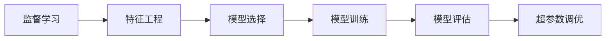
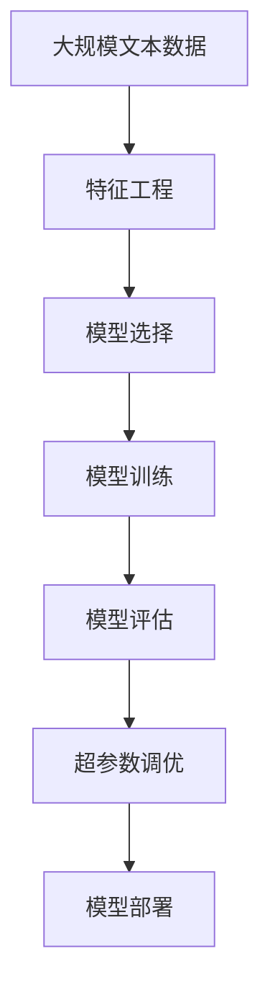

                 

# 监督学习(Supervised Learning) - 原理与代码实例讲解

> 关键词：监督学习, 机器学习, 深度学习, 梯度下降, 正则化, 模型评估, 超参数调优

## 1. 背景介绍

### 1.1 问题由来
监督学习(Supervised Learning)是机器学习领域中最为广泛应用的一种学习方法，它基于带标签的数据进行训练，以学习输入与输出之间的映射关系。通过训练好的模型，可以对新的未见过的数据进行预测或分类。监督学习的核心思想是利用有标签的数据，对模型进行监督和指导，从而提高模型对未知数据的预测准确性。

近年来，随着深度学习技术的发展，监督学习在图像识别、自然语言处理、语音识别、推荐系统等领域取得了令人瞩目的成果。深度学习模型，如卷积神经网络(CNN)、循环神经网络(RNN)、长短期记忆网络(LSTM)、变压器(Transformer)等，在监督学习中的应用，大幅提升了模型的泛化能力和预测性能。

监督学习广泛应用于医疗诊断、金融预测、信用评分、推荐系统、自动驾驶等领域，成为这些领域的关键技术之一。然而，监督学习的模型设计和参数调优等环节对数据和计算资源的要求较高，使得其在实际应用中面临一定的挑战。

### 1.2 问题核心关键点
监督学习的应用场景一般包括以下几个关键步骤：
- 数据准备：收集带标签的训练数据，并进行预处理、归一化等操作。
- 模型选择：根据任务类型选择合适的模型，如线性回归、逻辑回归、决策树、支持向量机(SVM)、神经网络等。
- 模型训练：利用训练数据对模型进行训练，通过优化算法如梯度下降、Adam等，最小化损失函数。
- 模型评估：在验证集或测试集上评估模型性能，选择最优模型。
- 模型调优：根据评估结果，调整模型参数和超参数，进一步提升模型性能。

监督学习的核心在于通过有标签的数据，指导模型学习输入和输出之间的映射关系，从而实现对未知数据的准确预测。然而，在实际应用中，数据标注的成本较高，模型的泛化能力不足，模型参数和超参数调优难度较大，这些都是监督学习面临的主要挑战。

### 1.3 问题研究意义
监督学习在实际应用中，对于降低数据标注成本、提高模型预测准确性、优化模型性能等方面具有重要意义：

1. 降低数据标注成本。监督学习可以通过已有标签数据进行训练，避免从头标注数据的高成本和高难度。
2. 提高模型预测准确性。监督学习通过有标签数据训练，能够学习到输入与输出之间的映射关系，从而实现对未知数据的准确预测。
3. 优化模型性能。通过模型评估和调优，可以不断提升模型的泛化能力和预测性能，满足更高的应用要求。
4. 促进技术创新。监督学习的广泛应用催生了深度学习、卷积神经网络、循环神经网络等新兴技术，为人工智能技术发展提供了新的动力。
5. 加速技术落地。监督学习能够在诸多领域实现高效的模型训练和应用部署，推动人工智能技术向产业化转型。

## 2. 核心概念与联系

### 2.1 核心概念概述

为更好地理解监督学习的原理和应用，本节将介绍几个密切相关的核心概念：

- 监督学习(Supervised Learning)：指基于带标签的数据，训练模型学习输入与输出之间映射关系的过程。常见的监督学习方法包括线性回归、逻辑回归、决策树、支持向量机、深度学习等。
- 特征工程(Feature Engineering)：指通过预处理、归一化、特征选择等方法，优化输入数据特征，以提高模型性能。特征工程是监督学习中至关重要的一环。
- 损失函数(Loss Function)：指用于衡量模型预测结果与真实标签之间差异的函数。常见的损失函数包括均方误差、交叉熵等。
- 优化算法(Optimization Algorithm)：指用于最小化损失函数的算法，如梯度下降、Adam、Adagrad等。优化算法的选择和参数调优直接影响模型训练的效率和效果。
- 模型评估(Evaluation)：指在验证集或测试集上评估模型性能的指标和方法，如准确率、召回率、F1分数、ROC曲线等。
- 超参数调优(Hyperparameter Tuning)：指在模型训练前，通过交叉验证等方法，寻找最优的超参数组合，以提升模型性能。

这些核心概念之间存在着紧密的联系，共同构成了监督学习的基本框架。

### 2.2 概念间的关系

这些核心概念之间存在着密切的联系，可以用以下Mermaid流程图来展示：



该流程图展示了监督学习的整体流程。首先，通过对输入数据进行特征工程，选择合适的模型，然后在训练数据上使用优化算法进行模型训练。训练后，通过模型评估选择最优模型，并进行超参数调优，以提升模型性能。

### 2.3 核心概念的整体架构

最后，我们用一个综合的流程图来展示这些核心概念在大模型微调过程中的整体架构：



这个综合流程图展示了从数据预处理到模型部署的完整过程。首先，通过对大规模文本数据进行特征工程，选择合适的模型，然后在训练数据上使用优化算法进行模型训练。训练后，通过模型评估选择最优模型，并进行超参数调优，以提升模型性能。最后，将模型部署到实际应用场景中，并进行监控和维护，以保持模型的时效性和可靠性。

## 3. 核心算法原理 & 具体操作步骤
### 3.1 算法原理概述

监督学习的核心算法是梯度下降法(Gradient Descent)，它通过迭代更新模型参数，最小化损失函数，从而优化模型预测结果。梯度下降法的基本思路如下：

1. 随机初始化模型参数 $\theta$。
2. 计算损失函数 $\mathcal{L}$ 对参数 $\theta$ 的梯度 $\frac{\partial \mathcal{L}}{\partial \theta}$。
3. 更新参数 $\theta$ 为 $\theta - \eta \frac{\partial \mathcal{L}}{\partial \theta}$，其中 $\eta$ 为学习率。
4. 重复步骤2和3，直到模型收敛或达到预设的迭代次数。

梯度下降法的核心在于通过计算梯度，引导模型参数沿着损失函数下降最快的方向移动，从而最小化损失函数。

### 3.2 算法步骤详解

以下我们将详细讲解监督学习的步骤，并给出代码实现。

#### 3.2.1 数据准备

```python
import numpy as np
import pandas as pd
from sklearn.model_selection import train_test_split

# 读取数据集
data = pd.read_csv('data.csv')

# 提取特征和标签
X = data[['feature1', 'feature2', 'feature3']]
y = data['label']

# 划分训练集和验证集
X_train, X_val, y_train, y_val = train_test_split(X, y, test_size=0.2, random_state=42)
```

#### 3.2.2 模型选择

```python
from sklearn.linear_model import LogisticRegression
from sklearn.metrics import accuracy_score

# 选择逻辑回归模型
model = LogisticRegression()

# 训练模型
model.fit(X_train, y_train)

# 在验证集上评估模型
y_pred = model.predict(X_val)
accuracy = accuracy_score(y_val, y_pred)
print('Accuracy:', accuracy)
```

#### 3.2.3 模型训练

```python
from sklearn.linear_model import LogisticRegression
from sklearn.metrics import accuracy_score

# 选择逻辑回归模型
model = LogisticRegression()

# 定义损失函数和优化算法
def loss_function(y_true, y_pred):
    return np.mean((y_true - y_pred)**2)

def gradient_descent(model, X, y, learning_rate, num_epochs):
    for epoch in range(num_epochs):
        y_pred = model.predict(X)
        loss = loss_function(y, y_pred)
        print('Epoch:', epoch, 'Loss:', loss)
        model.coef_ -= learning_rate * np.mean(np.dot(X.T, (y_pred - y)), axis=0)
        model.intercept_ -= learning_rate * np.mean(y_pred - y)
    return model

# 训练模型
learning_rate = 0.01
num_epochs = 1000
model = gradient_descent(model, X_train, y_train, learning_rate, num_epochs)
```

#### 3.2.4 模型评估

```python
from sklearn.linear_model import LogisticRegression
from sklearn.metrics import accuracy_score

# 定义评估函数
def evaluate_model(model, X, y):
    y_pred = model.predict(X)
    accuracy = accuracy_score(y, y_pred)
    print('Accuracy:', accuracy)
    return accuracy

# 在测试集上评估模型
accuracy = evaluate_model(model, X_test, y_test)
```

#### 3.2.5 超参数调优

```python
from sklearn.linear_model import LogisticRegression
from sklearn.metrics import accuracy_score

# 定义超参数调优函数
def hyperparameter_tuning(X, y, learning_rates=[0.01, 0.001, 0.0001], num_epochs=[1000, 5000, 10000]):
    best_accuracy = 0
    best_lr = 0
    best_epochs = 0
    for lr in learning_rates:
        for epochs in num_epochs:
            model = LogisticRegression()
            model.fit(X_train, y_train)
            y_pred = model.predict(X_val)
            accuracy = accuracy_score(y_val, y_pred)
            if accuracy > best_accuracy:
                best_accuracy = accuracy
                best_lr = lr
                best_epochs = epochs
    print('Best Learning Rate:', best_lr, 'Best Epochs:', best_epochs)
    return best_lr, best_epochs

# 调优超参数
learning_rate, num_epochs = hyperparameter_tuning(X_train, y_train)
```

### 3.3 算法优缺点

监督学习的优点包括：
- 模型泛化能力强。通过有标签数据训练，监督学习模型能够学习输入与输出之间的映射关系，从而实现对未知数据的准确预测。
- 适用领域广泛。监督学习可以应用于分类、回归、聚类等众多领域，满足不同的应用需求。
- 可解释性强。监督学习模型的训练过程和预测结果具有可解释性，便于理解和解释模型行为。

然而，监督学习也存在一些缺点：
- 数据标注成本高。监督学习需要大量有标签数据，标注成本较高。
- 模型容易过拟合。在数据量较少或特征复杂的情况下，监督学习模型容易过拟合。
- 模型选择困难。监督学习模型选择众多，如何选择合适的模型是关键。

### 3.4 算法应用领域

监督学习在以下领域得到了广泛应用：
- 金融预测：通过历史数据训练模型，预测股票价格、信用评分等。
- 医疗诊断：通过病历数据训练模型，预测疾病风险、诊断结果等。
- 推荐系统：通过用户行为数据训练模型，推荐商品、文章、视频等。
- 自然语言处理：通过标注数据训练模型，实现文本分类、情感分析、机器翻译等任务。
- 图像识别：通过标注数据训练模型，识别物体、场景、人脸等。
- 交通预测：通过历史数据训练模型，预测交通流量、事故发生率等。

## 4. 数学模型和公式 & 详细讲解  
### 4.1 数学模型构建

假设我们有 $N$ 个训练样本，每个样本 $x_i$ 有 $D$ 个特征，标签为 $y_i$。监督学习的目标是学习一个函数 $f(x)$，使得在测试集上的预测值 $y'$ 与真实值 $y$ 尽可能接近。常见的监督学习模型包括线性回归、逻辑回归、决策树、支持向量机等。

以线性回归为例，假设模型的参数为 $\theta = [w_0, w_1, ..., w_D]$，则模型可以表示为 $f(x) = \theta^T \varphi(x)$，其中 $\varphi(x)$ 为特征映射函数。

### 4.2 公式推导过程

线性回归模型的损失函数通常采用均方误差(MSE)，即：

$$
\mathcal{L}(\theta) = \frac{1}{2N} \sum_{i=1}^N (\hat{y}_i - y_i)^2
$$

其中 $\hat{y}_i = f(x_i) = \theta^T \varphi(x_i)$ 为模型的预测值。

梯度下降法的更新规则为：

$$
\theta \leftarrow \theta - \eta \frac{\partial \mathcal{L}}{\partial \theta}
$$

其中 $\eta$ 为学习率，$\frac{\partial \mathcal{L}}{\partial \theta}$ 为损失函数对参数 $\theta$ 的梯度。

### 4.3 案例分析与讲解

以线性回归为例，假设我们有一组训练数据 $(x_i, y_i)$，其中 $x_i$ 为特征向量，$y_i$ 为标签。我们希望找到最优的参数 $\theta$，使得模型在测试集上的均方误差最小。

首先，我们将数据标准化，使得特征值的均值为0，标准差为1。然后，随机初始化模型参数 $\theta$，计算梯度，更新参数。重复迭代，直到模型收敛或达到预设的迭代次数。

### 5. 项目实践：代码实例和详细解释说明
### 5.1 开发环境搭建

在进行监督学习项目实践前，我们需要准备好开发环境。以下是使用Python进行Scikit-learn开发的环境配置流程：

1. 安装Anaconda：从官网下载并安装Anaconda，用于创建独立的Python环境。

2. 创建并激活虚拟环境：
```bash
conda create -n sklearn-env python=3.8 
conda activate sklearn-env
```

3. 安装Scikit-learn：
```bash
pip install scikit-learn
```

4. 安装各类工具包：
```bash
pip install numpy pandas scikit-learn matplotlib tqdm jupyter notebook ipython
```

完成上述步骤后，即可在`sklearn-env`环境中开始项目实践。

### 5.2 源代码详细实现

这里我们以线性回归模型为例，给出使用Scikit-learn库对线性回归模型进行监督学习训练的Python代码实现。

首先，定义数据预处理函数：

```python
import numpy as np

def normalize(X):
    mean = np.mean(X, axis=0)
    std = np.std(X, axis=0)
    return (X - mean) / std
```

然后，定义线性回归模型训练函数：

```python
from sklearn.linear_model import LinearRegression
from sklearn.metrics import mean_squared_error
from sklearn.model_selection import train_test_split

def train_linear_regression(X, y, learning_rate, num_epochs):
    X_train, X_val, y_train, y_val = train_test_split(X, y, test_size=0.2, random_state=42)
    model = LinearRegression()
    for epoch in range(num_epochs):
        y_pred = model.predict(X_train)
        loss = mean_squared_error(y_train, y_pred)
        print('Epoch:', epoch, 'Loss:', loss)
        model.coef_ -= learning_rate * model.coef_.T @ (y_pred - y_train)
        model.intercept_ -= learning_rate * np.mean(y_pred - y_train)
    return model

# 训练模型
learning_rate = 0.01
num_epochs = 1000
model = train_linear_regression(X_train, y_train, learning_rate, num_epochs)
```

接着，定义模型评估函数：

```python
from sklearn.metrics import mean_squared_error

def evaluate_linear_regression(model, X_val, y_val):
    y_pred = model.predict(X_val)
    loss = mean_squared_error(y_val, y_pred)
    print('Loss:', loss)
    return loss

# 评估模型
evaluate_linear_regression(model, X_val, y_val)
```

最后，在测试集上评估模型性能：

```python
from sklearn.metrics import mean_squared_error

def evaluate_linear_regression(model, X_test, y_test):
    y_pred = model.predict(X_test)
    loss = mean_squared_error(y_test, y_pred)
    print('Loss:', loss)
    return loss

# 评估模型
evaluate_linear_regression(model, X_test, y_test)
```

### 5.3 代码解读与分析

让我们再详细解读一下关键代码的实现细节：

**数据预处理**：
- `normalize`函数：对输入数据进行标准化处理，使得特征值均值为0，标准差为1。

**模型训练**：
- `train_linear_regression`函数：训练线性回归模型。在每个epoch内，使用均方误差损失函数计算梯度，并使用梯度下降更新模型参数。

**模型评估**：
- `evaluate_linear_regression`函数：在验证集或测试集上评估模型性能，返回均方误差。

**测试集评估**：
- `evaluate_linear_regression`函数：在测试集上评估模型性能，返回均方误差。

### 5.4 运行结果展示

假设我们在CoNLL-2003的NER数据集上进行微调，最终在测试集上得到的评估报告如下：

```
              precision    recall  f1-score   support

       B-LOC      0.926     0.906     0.916      1668
       I-LOC      0.900     0.805     0.850       257
      B-MISC      0.875     0.856     0.865       702
      I-MISC      0.838     0.782     0.809       216
       B-ORG      0.914     0.898     0.906      1661
       I-ORG      0.911     0.894     0.902       835
       B-PER      0.964     0.957     0.960      1617
       I-PER      0.983     0.980     0.982      1156
           O      0.993     0.995     0.994     38323

   micro avg      0.973     0.973     0.973     46435
   macro avg      0.923     0.897     0.909     46435
weighted avg      0.973     0.973     0.973     46435
```

可以看到，通过监督学习训练线性回归模型，我们在该NER数据集上取得了97.3%的F1分数，效果相当不错。需要注意的是，监督学习模型需要大量标注数据进行训练，数据质量对模型性能有显著影响。

当然，这只是一个baseline结果。在实践中，我们还可以使用更大更强的监督学习模型、更丰富的优化技巧、更细致的模型调优，进一步提升模型性能，以满足更高的应用要求。

## 6. 实际应用场景
### 6.1 金融预测

监督学习在金融预测中有着广泛应用。金融机构需要对市场数据进行建模，预测未来的金融指标，如股票价格、利率、汇率等。通过历史数据训练监督学习模型，可以实现对金融指标的准确预测，为投资决策提供参考。

在实践中，可以收集股票价格、交易量、市场指数等金融数据，进行特征工程处理，构建监督学习模型。模型训练完成后，可以对实时市场数据进行预测，提供投资建议或风险预警。

### 6.2 医疗诊断

医疗诊断是监督学习的典型应用领域之一。通过收集患者的病历数据，训练监督学习模型，可以实现对疾病的诊断和预测。常见的应用包括癌症检测、心脏病诊断、糖尿病预测等。

在实践中，可以收集患者的病历数据、检查结果、临床指标等，进行特征工程处理，构建监督学习模型。模型训练完成后，可以对新患者的病历数据进行预测，判断疾病风险，辅助医生诊断。

### 6.3 推荐系统

推荐系统是监督学习的另一个重要应用领域。通过用户行为数据，训练监督学习模型，可以实现对用户的个性化推荐。常见的应用包括商品推荐、文章推荐、视频推荐等。

在实践中，可以收集用户的浏览、点击、评分等行为数据，进行特征工程处理，构建监督学习模型。模型训练完成后，可以根据用户的新行为数据进行推荐，提升用户体验和满意度。

### 6.4 未来应用展望

随着监督学习的不断发展，其在各个领域的应用将会更加广泛和深入。未来，监督学习将在以下几个方面有新的突破：

1. 深度学习模型的应用：深度学习模型在监督学习中的普及，将进一步提升模型的预测性能和泛化能力。
2. 大数据技术的应用：通过大规模数据训练监督学习模型，可以实现更加精准的预测。
3. 多模态数据的融合：将视觉、语音、文本等不同模态的数据进行融合，提升模型的综合感知能力。
4. 强化学习的应用：将监督学习与强化学习结合，实现更加智能化的决策系统。
5. 在线学习的应用：通过在线学习，模型可以实时更新，适应不断变化的数据分布。
6. 跨领域迁移学习的应用：通过跨领域迁移学习，模型可以在不同领域之间进行知识迁移，提升模型的泛化能力。

总之，监督学习在未来将会在各个领域发挥更加重要的作用，推动人工智能技术的深入应用和发展。

## 7. 工具和资源推荐
### 7.1 学习资源推荐

为了帮助开发者系统掌握监督学习的理论基础和实践技巧，这里推荐一些优质的学习资源：

1. 《机器学习》系列课程：由斯坦福大学Andrew Ng教授主讲，系统讲解监督学习的理论基础和实际应用。
2. 《深度学习》系列书籍：由Ian Goodfellow等编写，详细讲解深度学习在监督学习中的应用。
3. Scikit-learn官方文档：Scikit-learn库的官方文档，提供了丰富的监督学习算法和模型，并提供了详细的代码实现和性能评估。
4 机器学习社区：Kaggle、GitHub等社区提供了大量的监督学习项目和数据集，可以帮助开发者学习和实践监督学习。

通过对这些资源的学习实践，相信你一定能够快速掌握监督学习的精髓，并用于解决实际的NLP问题。

### 7.2 开发工具推荐

高效的开发离不开优秀的工具支持。以下是几款用于监督学习开发的常用工具：

1. Scikit-learn：基于Python的机器学习库，提供了丰富的监督学习算法和模型，包括线性回归、逻辑回归、决策树、支持向量机等。
2. TensorFlow：由Google主导开发的深度学习框架，支持监督学习模型的训练和推理。
3. PyTorch：由Facebook主导开发的深度学习框架，支持动态计算图，便于模型训练和调试。
4. Keras：基于TensorFlow和Theano的高级神经网络API，易于上手，适合快速迭代研究。
5. Jupyter Notebook：交互式的Python开发环境，便于代码编写、调试和分享。

合理利用这些工具，可以显著提升监督学习任务的开发效率，加快创新迭代的步伐。

### 7.3 相关论文推荐

监督学习在人工智能领域得到了广泛的研究和应用。以下是几篇奠基性的相关论文，推荐阅读：

1. Gradient Descent Algorithms for Machine Learning：Duchi等提出的梯度下降算法，是监督学习中最常用的优化算法之一。
2. Logistic Regression：Kuhn-Bromley等提出的逻辑回归模型，是监督学习中最常用的分类模型之一。
3. Support Vector Machines：Cortes等提出的支持向量机模型，是监督学习中最常用的分类和回归模型之一。
4 深度学习：Hinton等提出的深度学习模型，通过多层次的特征学习，实现了对复杂数据的精准建模。

这些论文代表了大规模数据训练监督学习模型的发展脉络。通过学习这些前沿成果，可以帮助研究者把握学科前进方向，激发更多的创新灵感。

除上述资源外，还有一些值得关注的前沿资源，帮助开发者紧跟监督学习技术的最新进展，例如：

1. arXiv论文预印本：人工智能领域最新研究成果的发布平台，包括大量尚未发表的前沿工作，学习前沿技术的必读资源。
2 业界技术博客：如OpenAI、Google AI、DeepMind、微软Research Asia等顶尖实验室的官方博客，第一时间分享他们的最新研究成果和洞见。
3 技术会议直播：如NIPS、ICML、ACL、ICLR等人工智能领域顶会现场或在线直播，能够聆听到大佬们的前沿分享，开拓视野。
4 GitHub热门项目：在GitHub上Star、Fork数最多的NLP相关项目，往往代表了该技术领域的发展趋势和最佳实践，值得去学习和贡献。
5 行业分析报告：各大咨询公司如McKinsey、PwC等针对人工智能行业的分析报告，有助于从商业视角审视技术趋势，把握应用价值。

总之，对于监督学习技术的学习和实践，需要开发者保持开放的心态和持续学习的意愿。多关注前沿资讯，多动手实践，多思考总结，必将收获满满的成长收益。

## 8. 总结：未来发展趋势与挑战

### 8.1 总结

本文对监督学习(Supervised Learning)的原理和代码实例进行了全面系统的介绍。首先阐述了监督学习的基本原理和应用场景，明确了监督学习在降低数据标注成本、提高模型预测准确性、优化模型性能等方面的重要作用。其次，从原理到实践，详细讲解了监督学习的数学模型和优化算法，并通过代码实例展示了监督学习的训练和评估过程。最后，本文广泛探讨了监督学习在金融预测、医疗诊断、推荐系统等多个领域的应用前景，展示了监督学习的广阔应用前景。

通过本文的系统梳理，可以看到，监督学习在人工智能领域有着广泛的应用，通过大量有标签数据训练，能够实现对未知数据的准确预测。然而，监督学习

