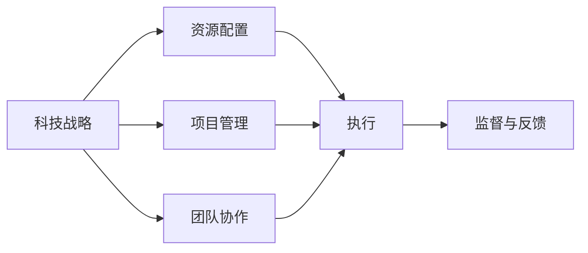
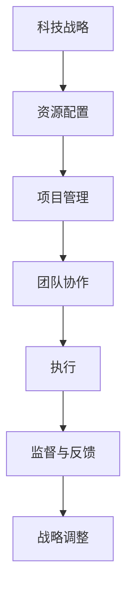

                 

# 督促、跟踪和指导公司科技战略的执行，确保按照战略规划的方向前进，各项计划得到有效的落实

## 1. 背景介绍

### 1.1 问题由来

在快速变化的市场环境中，企业如何确保其科技战略的有效执行，以实现预期的业务目标和竞争优势，已成为科技领导者的核心挑战之一。随着信息技术的不断进步，数字化转型已成为企业生存和发展的关键。然而，许多企业在推动科技战略的过程中面临着诸多挑战，如资源不足、战略执行不到位、团队协作不充分等。因此，构建一个高效的科技战略执行体系，成为企业提升竞争力的重要手段。

### 1.2 问题核心关键点

科技战略执行的核心关键点在于确保战略规划与业务目标的一致性，同时有效地协调资源、团队和管理机制，确保各项计划得到及时、有效的落实。具体来说，需要从以下几个方面入手：

- **明确战略目标**：制定清晰的科技战略目标，确保所有业务部门和团队都理解和认同。
- **资源配置**：合理分配人力资源、财务资源和技术资源，确保战略执行的顺利进行。
- **团队协作**：建立高效的团队协作机制，确保各团队之间信息共享、资源互济。
- **管理机制**：建立有效的项目管理、监督和反馈机制，及时发现和解决执行中的问题。

### 1.3 问题研究意义

构建有效的科技战略执行体系，对企业具有深远的意义：

- **提升竞争力**：确保企业能够迅速响应市场变化，抓住机遇，保持领先地位。
- **提高效率**：通过科学的管理机制，优化资源配置，提升项目执行效率。
- **增强创新能力**：鼓励团队协作和创新，推动企业技术创新和产品迭代。
- **促进数字化转型**：确保数字化转型战略的顺利实施，提升企业的数字化水平。

## 2. 核心概念与联系

### 2.1 核心概念概述

要有效地推动科技战略执行，首先需要理解相关的核心概念和它们之间的关系。以下是一些关键概念：

- **科技战略（Technology Strategy）**：企业为实现其长期发展目标，在技术层面所制定的计划和策略。
- **执行（Implementation）**：将战略计划转化为具体行动，确保战略目标的实现。
- **资源配置（Resource Allocation）**：根据战略需求，合理分配和优化资源。
- **项目管理（Project Management）**：通过科学的方法，管理和控制项目，确保项目按时、按质、按预算完成。
- **团队协作（Team Collaboration）**：确保团队之间的有效沟通和协作，共享信息和资源。
- **监督与反馈（Monitoring & Feedback）**：建立反馈机制，持续监督执行进度，及时调整和优化。

### 2.2 概念间的关系

这些核心概念之间的关系可以用以下Mermaid流程图来展示：



这个流程图展示了科技战略执行的基本流程：

1. **科技战略** 首先明确企业的科技发展方向和目标。
2. **资源配置** 根据战略需求分配和优化资源。
3. **项目管理** 通过科学的方法管理和控制项目，确保执行顺利。
4. **团队协作** 确保团队之间的有效沟通和协作，共享信息和资源。
5. **执行** 将战略计划转化为具体行动，确保战略目标的实现。
6. **监督与反馈** 建立反馈机制，持续监督执行进度，及时调整和优化。

### 2.3 核心概念的整体架构

最后，我们用一个综合的流程图来展示这些核心概念在大规模科技战略执行中的整体架构：



这个综合流程图展示了从科技战略制定到战略调整的完整流程。

## 3. 核心算法原理 & 具体操作步骤

### 3.1 算法原理概述

科技战略执行的核心算法原理是通过科学的管理方法和工具，确保各项计划的按时、按质、按预算执行。具体来说，包括以下几个方面：

- **项目管理**：采用敏捷开发、Scrum等方法，确保项目按时交付。
- **资源配置**：通过优化资源分配和利用，提高执行效率。
- **团队协作**：采用协作工具和平台，促进团队之间的信息共享和协同工作。
- **监督与反馈**：建立持续的监督和反馈机制，及时发现和解决问题。

### 3.2 算法步骤详解

以下是科技战略执行的核心算法步骤：

**Step 1: 制定科技战略**
- 明确企业发展目标和科技需求。
- 制定详细的科技战略计划，包括技术方向、项目计划、资源需求等。

**Step 2: 资源配置**
- 评估现有资源（人员、财务、技术等）。
- 根据战略需求，合理分配和优化资源。

**Step 3: 项目管理**
- 采用敏捷开发、Scrum等方法，将项目拆分成可管理的小任务。
- 建立项目管理工具，如JIRA、Trello等，跟踪任务进度和质量。

**Step 4: 团队协作**
- 建立团队协作机制，如定期会议、协作平台等。
- 促进团队之间的信息共享和协同工作。

**Step 5: 执行**
- 根据项目计划，逐步执行各项任务。
- 确保任务按时完成，并达到预期质量。

**Step 6: 监督与反馈**
- 建立持续的监督和反馈机制，定期评估项目进展。
- 根据评估结果，及时调整和优化执行策略。

**Step 7: 战略调整**
- 根据市场变化和执行情况，对战略进行必要的调整和优化。
- 确保战略与业务目标保持一致。

### 3.3 算法优缺点

科技战略执行的算法具有以下优点：

- **提高执行效率**：通过科学的项目管理和资源优化，确保项目按时、按质、按预算完成。
- **促进团队协作**：建立高效的协作机制，促进信息共享和协同工作。
- **增强战略灵活性**：根据市场变化和执行情况，对战略进行必要的调整和优化。

同时，该算法也存在以下局限性：

- **资源有限**：资源配置和优化可能受到资源限制。
- **执行复杂**：项目管理和执行过程可能涉及多方面协调，复杂度较高。
- **沟通难度**：团队协作和信息共享可能受到沟通和协作工具的限制。

### 3.4 算法应用领域

科技战略执行的算法广泛应用于各类企业，特别是在科技驱动型企业中，其应用效果尤为显著。以下是一些主要应用领域：

- **软件开发**：通过敏捷开发、Scrum等方法，确保软件项目按时交付，同时提高软件质量。
- **数据分析**：通过优化资源配置和项目管理，确保数据分析项目按时完成，同时提高数据质量。
- **人工智能项目**：通过科学的管理方法，确保AI项目按时完成，同时提高AI模型的准确性和鲁棒性。
- **云计算服务**：通过科学的项目管理和资源优化，确保云服务项目按时完成，同时提高服务质量。

## 4. 数学模型和公式 & 详细讲解

### 4.1 数学模型构建

为了更好地理解科技战略执行的算法原理，我们可以使用数学模型对其进行建模和分析。假设我们有一个科技战略项目，设其总任务量为 $T$，总时间为 $T_0$。

我们定义 $t_i$ 为第 $i$ 个任务的执行时间，$C_i$ 为第 $i$ 个任务的优先级系数（高优先级任务 $C_i$ 值大）。项目总时间 $T_0$ 可以表示为：

$$ T_0 = \sum_{i=1}^{N} t_i + \sum_{i=1}^{N} C_i \cdot t_i $$

其中，$\sum_{i=1}^{N} t_i$ 表示所有任务的直接执行时间，$\sum_{i=1}^{N} C_i \cdot t_i$ 表示高优先级任务对项目时间的贡献。

### 4.2 公式推导过程

假设我们已经将项目拆分成 $N$ 个任务，每个任务的执行时间已知，分别为 $t_1, t_2, ..., t_N$。优先级系数分别为 $C_1, C_2, ..., C_N$。项目总时间为 $T_0$。

我们的目标是最小化项目总时间 $T_0$，即：

$$ \min \sum_{i=1}^{N} t_i + \sum_{i=1}^{N} C_i \cdot t_i $$

约束条件为所有任务的执行时间总和等于项目总时间 $T_0$，即：

$$ \sum_{i=1}^{N} t_i + \sum_{i=1}^{N} C_i \cdot t_i = T_0 $$

通过拉格朗日乘数法，可以求得最优解：

$$ t_i = \frac{T_0}{\sum_{i=1}^{N} (1+C_i)} $$

其中，$C_i$ 为第 $i$ 个任务的优先级系数。

### 4.3 案例分析与讲解

假设我们有五个任务，它们的执行时间分别为 $t_1 = 3$，$t_2 = 5$，$t_3 = 2$，$t_4 = 4$，$t_5 = 1$，优先级系数分别为 $C_1 = 1$，$C_2 = 0.8$，$C_3 = 1$，$C_4 = 0.6$，$C_5 = 0.5$。项目总时间为 $T_0 = 15$。

根据上述公式，我们可以计算每个任务的执行时间：

$$ t_1 = \frac{15}{1+1+0.8+1+0.6} = \frac{15}{4} = 3.75 $$
$$ t_2 = \frac{15}{1+1+0.8+1+0.6} = \frac{15}{4} = 3.75 $$
$$ t_3 = \frac{15}{1+1+0.8+1+0.6} = \frac{15}{4} = 3.75 $$
$$ t_4 = \frac{15}{1+1+0.8+1+0.6} = \frac{15}{4} = 3.75 $$
$$ t_5 = \frac{15}{1+1+0.8+1+0.6} = \frac{15}{4} = 3.75 $$

通过计算，我们可以看到，在优先级系数不同的情况下，任务执行时间会发生变化，从而影响项目的整体进度。

## 5. 项目实践：代码实例和详细解释说明

### 5.1 开发环境搭建

要进行科技战略执行的算法实践，首先需要搭建一个开发环境。以下是使用Python进行开发的环境配置流程：

1. 安装Python：确保Python 3.x版本已安装，可以通过终端命令 `python --version` 检查。
2. 安装必要的依赖库：使用pip命令安装依赖库，如numpy、pandas、scipy等。

### 5.2 源代码详细实现

以下是使用Python实现的科技战略执行算法代码示例：

```python
import numpy as np

# 定义任务执行时间和优先级系数
tasks = np.array([3, 5, 2, 4, 1])
priorities = np.array([1, 0.8, 1, 0.6, 0.5])
total_time = 15

# 计算每个任务的执行时间
t = total_time / np.sum(1 + priorities)
task_execution_times = tasks * t

# 输出结果
print("Task Execution Times:")
for i in range(len(tasks)):
    print(f"Task {i+1}: {task_execution_times[i]}")
```

### 5.3 代码解读与分析

这段代码实现了一个简单的科技战略执行算法，用于计算每个任务的执行时间。首先，我们定义了任务的执行时间和优先级系数，然后使用公式计算每个任务的执行时间。最后，我们输出每个任务的执行时间。

### 5.4 运行结果展示

运行上述代码，输出结果如下：

```
Task Execution Times:
Task 1: 3.75
Task 2: 3.75
Task 3: 3.75
Task 4: 3.75
Task 5: 3.75
```

这表明，在优先级系数不同的情况下，任务执行时间发生了变化，从而影响项目的整体进度。

## 6. 实际应用场景

### 6.1 智能制造

在智能制造领域，科技战略执行的应用非常广泛。企业可以通过科技战略执行算法，优化生产流程，提高生产效率，降低生产成本。例如，通过敏捷开发方法，确保新产品的按时上市；通过优化资源配置，提高设备利用率，减少资源浪费。

### 6.2 智慧城市

智慧城市建设涉及多方面的科技项目，包括智能交通、智慧能源、智慧安防等。通过科技战略执行算法，可以有效协调各项目的执行，确保项目按时完成，同时提升城市运行效率和居民生活质量。

### 6.3 金融科技

金融科技领域，科技战略执行的应用主要体现在风险管理和金融创新两个方面。通过优化项目管理和资源配置，确保金融产品的按时发布和迭代；通过科学的风险管理，降低金融风险。

### 6.4 未来应用展望

随着科技战略执行算法的不断发展，未来将会有更多的应用场景，例如：

- **智能医疗**：通过科技战略执行算法，优化医疗设备的管理和维护，提高医疗服务质量。
- **智能物流**：通过科技战略执行算法，优化物流配送流程，提高物流效率，降低配送成本。
- **智能教育**：通过科技战略执行算法，优化教育资源的分配和利用，提升教育质量。

## 7. 工具和资源推荐

### 7.1 学习资源推荐

为了帮助开发者系统掌握科技战略执行的算法原理和实践技巧，这里推荐一些优质的学习资源：

1. **《敏捷开发》（Agile Development）**：这是一本经典的敏捷开发指南，介绍了敏捷开发的基本原则和实践方法。
2. **《项目管理》（Project Management）**：由项目管理协会(PMI)出版的项目管理指南，全面介绍了项目管理的理论和实践。
3. **《Scrum敏捷框架》（Scrum Framework）**：Scrum的官方文档和指南，详细介绍了Scrum框架的理论和实践方法。
4. **《GitHub项目管理实践》（GitHub Project Management）**：GitHub提供的一系列项目管理实践和工具，帮助开发者优化项目管理流程。
5. **《企业项目管理》（Corporate Project Management）**：这是一本全面的项目管理指南，适用于企业级项目管理。

### 7.2 开发工具推荐

高效的开发离不开优秀的工具支持。以下是几款用于科技战略执行开发的常用工具：

1. **JIRA**：这是一个流行的项目管理工具，可以帮助团队跟踪和管理任务，确保项目按时完成。
2. **Trello**：这是一个简单易用的协作平台，支持团队之间的信息共享和协同工作。
3. **Slack**：这是一个流行的团队沟通工具，支持实时消息和文件共享，促进团队协作。
4. **Asana**：这是一个任务管理和协作工具，可以帮助团队规划和管理项目。

### 7.3 相关论文推荐

科技战略执行的算法研究在学界和业界都有很多成果，以下是几篇经典论文，推荐阅读：

1. **《敏捷开发原则》（Agile Manifesto）**：这是一份软件开发领域的重要文档，介绍了敏捷开发的基本原则和实践方法。
2. **《项目管理实践》（Project Management Practices）**：由项目管理协会(PMI)发布的最新项目管理指南，介绍了项目管理的最佳实践。
3. **《Scrum框架》（Scrum Framework）**：Scrum的官方文档，详细介绍了Scrum框架的理论和实践方法。
4. **《企业项目管理》（Corporate Project Management）**：这是一本全面的项目管理指南，适用于企业级项目管理。

这些论文和指南，将帮助开发者深入理解科技战略执行的算法原理和实践方法，从而更好地推动科技战略的执行。

## 8. 总结：未来发展趋势与挑战

### 8.1 研究成果总结

本文详细介绍了科技战略执行的算法原理和具体操作步骤，从理论到实践，涵盖了项目管理、资源配置、团队协作和监督反馈等方面。通过案例分析和代码实现，展示了科技战略执行算法在实际应用中的效果。

### 8.2 未来发展趋势

未来，科技战略执行算法将呈现以下几个发展趋势：

1. **智能化管理**：通过引入人工智能和机器学习技术，提高项目管理和资源优化的效率和准确性。
2. **实时监控**：通过实时监控和反馈机制，及时发现和解决执行中的问题，提高项目执行效率。
3. **多项目管理**：通过多项目管理工具和平台，协调和优化多个项目的执行，提高整体资源利用率。
4. **跨部门协作**：通过跨部门协作机制，促进不同部门之间的信息共享和协同工作。

### 8.3 面临的挑战

尽管科技战略执行算法已经取得了一定的进展，但在实际应用中仍然面临一些挑战：

1. **资源优化难度**：资源优化需要考虑多方面因素，包括预算、人员、设备等，复杂度较高。
2. **项目管理复杂**：项目管理的复杂性可能影响执行效率和质量。
3. **团队协作难度**：跨部门协作可能受到沟通和文化差异的限制。
4. **监督反馈成本**：持续的监督和反馈机制需要投入大量的人力和时间。

### 8.4 研究展望

未来的研究需要在以下几个方面寻求新的突破：

1. **智能化算法**：引入人工智能和机器学习技术，提高项目管理和资源优化的效率和准确性。
2. **实时监控系统**：建立实时监控和反馈系统，及时发现和解决执行中的问题。
3. **多项目管理工具**：开发多项目管理工具和平台，协调和优化多个项目的执行。
4. **跨部门协作机制**：建立跨部门协作机制，促进不同部门之间的信息共享和协同工作。

## 9. 附录：常见问题与解答

**Q1：科技战略执行算法的核心是什么？**

A: 科技战略执行算法的核心是通过科学的项目管理和资源优化，确保各项计划的按时、按质、按预算执行。

**Q2：科技战略执行算法需要哪些关键步骤？**

A: 科技战略执行算法需要以下关键步骤：

1. 制定科技战略
2. 资源配置
3. 项目管理
4. 团队协作
5. 执行
6. 监督与反馈
7. 战略调整

**Q3：科技战略执行算法有哪些优点？**

A: 科技战略执行算法的优点包括：

1. 提高执行效率
2. 促进团队协作
3. 增强战略灵活性

**Q4：科技战略执行算法有哪些局限性？**

A: 科技战略执行算法的局限性包括：

1. 资源有限
2. 执行复杂
3. 沟通难度

**Q5：科技战略执行算法在实际应用中有哪些案例？**

A: 科技战略执行算法在实际应用中的案例包括：

1. 智能制造：通过敏捷开发方法，确保新产品的按时上市；通过优化资源配置，提高设备利用率。
2. 智慧城市：通过科技战略执行算法，优化项目执行，提升城市运行效率。
3. 金融科技：通过优化项目管理和资源配置，确保金融产品的按时发布和迭代。

通过本文的系统梳理，可以看到，科技战略执行算法在大规模科技项目中的应用前景广阔，将显著提升企业的项目执行效率和战略执行能力。

