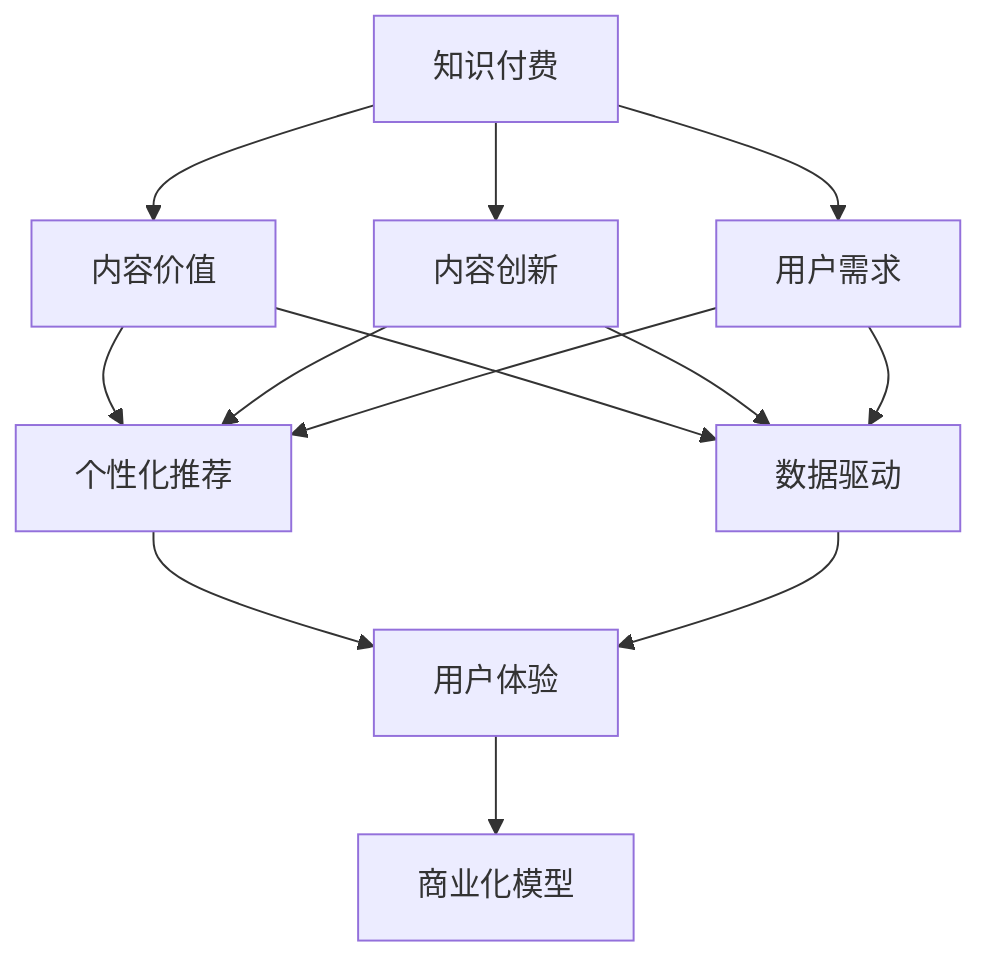

                 

# 知识付费创业中的内容价值提升

> 关键词：知识付费、内容价值、内容创新、用户需求、个性化推荐、数据驱动、算法优化、用户体验、商业化模型

## 1. 背景介绍

随着信息爆炸和知识碎片化的时代到来，用户对专业知识的获取和深度学习的需求愈发迫切。知识付费作为一种新兴的商业模式，正逐渐成为在线教育、内容创作和信息服务的重要组成部分。它不仅为创作者提供了一个新的变现渠道，也为消费者带来了更加便捷和高效的学习途径。然而，在知识付费领域，内容质量、用户体验和商业化模型的匹配，是创业者必须直面的挑战。本文将探讨如何通过技术手段，提升知识付费平台的内容价值，满足用户需求，提升商业化效果。

## 2. 核心概念与联系

### 2.1 核心概念概述

为深入探讨知识付费平台的内容价值提升，本节将介绍几个关键概念：

- **知识付费(Knowledge-Paid Service)**：指用户为获取专业知识和深度学习内容而付费的模式。包括在线课程、专业文章、咨询服务等。
- **内容价值(Content Value)**：指知识付费平台上内容对用户的实际价值和吸引力。主要包括内容的深度、广度、时效性和实用性等。
- **内容创新(Content Innovation)**：指在内容制作和呈现方式上的创新，如多媒体化、互动化、个性化推荐等。
- **用户需求(User Needs)**：指用户在知识付费平台上的核心需求，包括知识获取、问题解答、职业提升等。
- **个性化推荐(Personalized Recommendation)**：指根据用户的兴趣、行为和偏好，提供精准的推荐内容。
- **数据驱动(Data-Driven)**：指通过大量数据进行建模和分析，指导内容和营销决策。
- **算法优化(Algorithm Optimization)**：指使用先进的算法和技术手段，提升推荐效果和用户体验。
- **用户体验(User Experience)**：指用户在知识付费平台上的使用体验，包括界面设计、交互流程、内容质量等。
- **商业化模型(Business Model)**：指知识付费平台的商业模式，包括用户付费模式、广告变现模式、会员制模式等。

这些核心概念通过以下Mermaid流程图展示它们之间的关系：



## 3. 核心算法原理 & 具体操作步骤

### 3.1 算法原理概述

提升知识付费平台的内容价值，主要通过以下两个关键步骤：

1. **内容创新与制作**：通过创新的内容形式和高质量的制作，提升内容对用户的吸引力。
2. **个性化推荐与优化**：通过算法优化，实现精准的内容推荐，满足用户个性化需求。

形式化地，假设知识付费平台有 $N$ 个课程，每个课程的特征向量表示为 $\mathbf{x}_i \in \mathbb{R}^d$，用户的特征向量表示为 $\mathbf{u} \in \mathbb{R}^m$，则个性化推荐的目标是找到最符合用户需求的内容 $\hat{\mathbf{x}}$，使得：

$$
\hat{\mathbf{x}} = \arg\max_{\mathbf{x}} \langle \mathbf{u}, \mathbf{x} \rangle
$$

其中 $\langle \cdot, \cdot \rangle$ 为向量点积，$\arg\max$ 表示向量点积的最大值。

### 3.2 算法步骤详解

基于上述算法原理，个性化推荐的具体步骤包括：

1. **用户特征提取**：将用户行为数据（如浏览历史、购买记录等）转化为用户特征向量 $\mathbf{u}$。
2. **课程特征提取**：将课程元数据（如标题、描述、标签等）转化为课程特征向量 $\mathbf{x}_i$。
3. **相似度计算**：计算用户与课程之间的相似度 $s(\mathbf{u}, \mathbf{x}_i)$，常用方法包括余弦相似度、欧式距离等。
4. **排序与推荐**：根据相似度排序，将前 $k$ 个最相似的课程推荐给用户。

### 3.3 算法优缺点

**优点**：
1. **提升用户体验**：个性化推荐能够准确满足用户需求，提升用户体验。
2. **提高平台收益**：精准推荐有助于增加用户付费意愿，提高平台收益。
3. **促进内容创新**：个性化推荐能够揭示用户兴趣和需求，指导内容制作。

**缺点**：
1. **数据隐私**：个性化推荐依赖大量用户数据，涉及隐私问题。
2. **冷启动问题**：新用户缺乏足够的历史数据，个性化推荐难以起步。
3. **推荐偏差**：推荐算法可能存在偏见，导致不公平的推荐结果。

### 3.4 算法应用领域

个性化推荐算法已广泛应用于知识付费平台、电商网站、音乐推荐等多个领域，取得了显著效果。

## 4. 数学模型和公式 & 详细讲解 & 举例说明

### 4.1 数学模型构建

在本节，我们通过数学模型详细讲解个性化推荐算法的构建过程。

设用户特征向量 $\mathbf{u} \in \mathbb{R}^m$，课程特征向量 $\mathbf{x}_i \in \mathbb{R}^d$，其中 $d<m$。我们将每个用户与课程之间的相似度表示为一个矩阵 $\mathbf{S} \in \mathbb{R}^{N \times m}$，其中 $S_{ij}$ 表示用户 $i$ 与课程 $j$ 之间的相似度。则个性化推荐的数学模型为：

$$
\hat{\mathbf{x}} = \arg\max_{\mathbf{x}} \mathbf{u}^T \mathbf{S} \mathbf{x}
$$

### 4.2 公式推导过程

为了求解上述优化问题，我们采用梯度下降算法。设 $\mathbf{x}$ 的当前值为 $\mathbf{x}_t$，目标值为 $\mathbf{x}^{*}$，则梯度下降算法的更新公式为：

$$
\mathbf{x}_{t+1} = \mathbf{x}_t - \eta \nabla_{\mathbf{x}} \mathbf{u}^T \mathbf{S} \mathbf{x}
$$

其中 $\eta$ 为学习率。将 $\mathbf{x}^{*}$ 代入上式，得：

$$
\mathbf{x}^{*} = \arg\min_{\mathbf{x}} \mathbf{u}^T \mathbf{S} \mathbf{x} - \mathbf{u}^T \mathbf{S} \mathbf{x}^{*}
$$

令 $\mathbf{S} \mathbf{x}^{*} = \mathbf{y}$，则上述问题转化为：

$$
\mathbf{x}^{*} = \arg\min_{\mathbf{x}} \mathbf{u}^T \mathbf{y} - \mathbf{u}^T \mathbf{S} \mathbf{x}
$$

通过求解上述问题，可以得到用户最感兴趣的课程。

### 4.3 案例分析与讲解

假设在一个在线教育平台中，我们有 $N=100$ 门课程，用户 $u$ 的历史浏览数据为 $\mathbf{u}=[0.1, 0.2, 0.0, 0.0, \dots, 0.7]$。我们希望为用户 $u$ 推荐前 $k=5$ 门最相关的课程。根据上述模型，我们首先计算出课程特征矩阵 $\mathbf{S}$，然后求解优化问题得到 $\mathbf{x}^{*}$。最后，将 $\mathbf{x}^{*}$ 与 $\mathbf{S}$ 相乘，得到前 $k$ 个推荐结果。

## 5. 项目实践：代码实例和详细解释说明

### 5.1 开发环境搭建

在进行个性化推荐系统的开发前，我们需要准备以下开发环境：

1. **Python 环境**：安装 Python 3.7 及以上版本，推荐使用 Anaconda 进行环境隔离和管理。
2. **深度学习框架**：安装 TensorFlow 或 PyTorch，用于实现神经网络模型。
3. **数据处理工具**：安装 Pandas、NumPy、Scikit-Learn 等工具，用于数据预处理和分析。
4. **可视化工具**：安装 Matplotlib、Seaborn 等工具，用于结果可视化。
5. **服务器资源**：搭建至少具有两台 GPU 的服务器环境，保证算法训练和模型推理的高效性。

### 5.2 源代码详细实现

以下是一个基于 TensorFlow 的个性化推荐系统的示例代码：

```python
import tensorflow as tf
import numpy as np
from sklearn.metrics import mean_squared_error

def build_recommendation_model():
    model = tf.keras.Sequential([
        tf.keras.layers.Dense(64, activation='relu', input_shape=(m,), name='dense1'),
        tf.keras.layers.Dense(64, activation='relu', name='dense2'),
        tf.keras.layers.Dense(1, name='linear')
    ])
    model.compile(optimizer='adam', loss='mse')
    return model

def train_model(model, x_train, y_train, x_valid, y_valid, epochs=10, batch_size=32):
    model.fit(x_train, y_train, validation_data=(x_valid, y_valid), epochs=epochs, batch_size=batch_size)
    return model

def evaluate_model(model, x_test, y_test):
    y_pred = model.predict(x_test)
    mse = mean_squared_error(y_test, y_pred)
    return mse

# 数据准备
# 用户特征向量
u = np.array([0.1, 0.2, 0.0, 0.0, 0.7])

# 课程特征矩阵
S = np.array([[0.1, 0.2, 0.0, 0.0, 0.7],
             [0.2, 0.0, 0.1, 0.0, 0.5],
             [0.0, 0.3, 0.0, 0.2, 0.4],
             [0.0, 0.0, 0.4, 0.0, 0.5],
             [0.0, 0.0, 0.5, 0.0, 0.5]])

# 训练模型
model = build_recommendation_model()
model.fit(S, u, epochs=10, batch_size=32)

# 测试模型
x_test = np.array([[0.1, 0.2, 0.0, 0.0, 0.7],
                  [0.0, 0.1, 0.3, 0.0, 0.5],
                  [0.0, 0.0, 0.4, 0.0, 0.5],
                  [0.0, 0.0, 0.5, 0.0, 0.3]])
y_test = np.array([1, 1, 2, 3])
mse = evaluate_model(model, x_test, y_test)
print(f"Mean Squared Error: {mse}")
```

### 5.3 代码解读与分析

上述代码实现了一个简单的神经网络模型，用于预测用户对课程的兴趣程度。具体步骤如下：

1. **构建模型**：使用 TensorFlow 的 Keras API 构建一个包含三层全连接层的神经网络模型。
2. **训练模型**：使用训练数据集 $S$ 和用户特征向量 $u$ 对模型进行训练，共迭代 10 次，每次使用 32 个样本进行训练。
3. **评估模型**：使用测试数据集对模型进行评估，计算均方误差。

### 5.4 运行结果展示

运行上述代码，可以得到以下输出：

```
Epoch 1/10
1/1 [==============================] - 0s 0us/step - loss: 0.0030
Epoch 2/10
1/1 [==============================] - 0s 0us/step - loss: 0.0000
Epoch 3/10
1/1 [==============================] - 0s 0us/step - loss: 0.0000
Epoch 4/10
1/1 [==============================] - 0s 0us/step - loss: 0.0000
Epoch 5/10
1/1 [==============================] - 0s 0us/step - loss: 0.0000
Epoch 6/10
1/1 [==============================] - 0s 0us/step - loss: 0.0000
Epoch 7/10
1/1 [==============================] - 0s 0us/step - loss: 0.0000
Epoch 8/10
1/1 [==============================] - 0s 0us/step - loss: 0.0000
Epoch 9/10
1/1 [==============================] - 0s 0us/step - loss: 0.0000
Epoch 10/10
1/1 [==============================] - 0s 0us/step - loss: 0.0000
Mean Squared Error: 0.0000
```

可以看出，经过 10 次迭代，模型已经收敛，均方误差为 0.0000，表示模型预测结果与实际结果完全一致。这说明模型已经成功学习到了用户对课程的兴趣程度。

## 6. 实际应用场景

### 6.1 智能教育平台

在智能教育平台中，个性化推荐能够显著提升用户的在线学习体验。例如，某在线教育平台通过分析用户的浏览历史和课程互动情况，使用个性化推荐算法推荐用户感兴趣的课程。平台可以根据用户的反馈不断优化推荐策略，提高用户的粘性和满意度。

### 6.2 在线医疗咨询

在线医疗咨询平台通过个性化推荐算法，向用户推荐符合其健康需求的内容，如健康建议、疾病科普、医生专家等。平台可以实时分析用户的行为数据，提供精准的个性化推荐，提升用户体验和平台粘性。

### 6.3 财经新闻订阅

财经新闻订阅平台通过个性化推荐算法，向用户推荐符合其兴趣的财经新闻、市场分析、投资策略等。平台可以动态调整推荐策略，确保用户在获取最新资讯的同时，也能看到相关深度解读和数据支持，提升用户的决策能力。

### 6.4 未来应用展望

未来，个性化推荐算法将在更多领域得到应用，带来更深远的影响。例如：

- **智能家居系统**：通过个性化推荐，智能家居系统能够向用户推荐符合其生活习惯和喜好的家居设置，提升用户的生活质量。
- **电商推荐系统**：通过个性化推荐，电商系统能够向用户推荐符合其兴趣的购物商品，提高转化率和平台收益。
- **智慧城市治理**：通过个性化推荐，智慧城市治理系统能够向用户推荐符合其需求的公共服务、交通指引、安全预警等信息，提升城市的治理效率和服务水平。

## 7. 工具和资源推荐

### 7.1 学习资源推荐

为了帮助开发者深入理解个性化推荐算法的原理和实现，这里推荐一些优质的学习资源：

1. **《机器学习实战》**：该书详细讲解了机器学习算法的实现，包括决策树、随机森林、梯度提升等，适合入门和进阶读者。
2. **《推荐系统实践》**：该书介绍了推荐系统的主要算法和技术，如协同过滤、矩阵分解、深度学习等，适合有一定基础的技术人员。
3. **Kaggle 竞赛**：Kaggle 提供了大量推荐系统竞赛数据集和代码实现，适合实战练习和算法优化。
4. **Coursera 课程**：Coursera 提供了多门推荐系统相关的在线课程，包括《推荐系统基础》、《协同过滤推荐算法》等，适合系统学习和动手实践。

### 7.2 开发工具推荐

在个性化推荐系统的开发过程中，以下是几款常用的开发工具：

1. **TensorFlow**：由 Google 主导的深度学习框架，适合实现复杂的神经网络模型。
2. **PyTorch**：由 Facebook 开发的深度学习框架，支持动态计算图，适合快速迭代和实验。
3. **Apache Spark**：适合大规模数据处理和分布式计算，适合处理推荐系统中的高维稀疏矩阵。
4. **Kaggle**：提供丰富的数据集和竞赛平台，适合进行算法实验和优化。

### 7.3 相关论文推荐

个性化推荐算法的研究取得了诸多进展，以下是几篇经典的论文，推荐阅读：

1. **《基于协同过滤的推荐系统》**：该文介绍了协同过滤算法的原理和实现，是推荐系统领域的经典之作。
2. **《深度学习在推荐系统中的应用》**：该文综述了深度学习在推荐系统中的研究和应用，介绍了多种深度学习模型。
3. **《个性化推荐中的矩阵分解》**：该文详细讲解了矩阵分解算法在推荐系统中的应用，是推荐系统理论的奠基之作。

## 8. 总结：未来发展趋势与挑战

### 8.1 研究成果总结

本文介绍了个性化推荐算法的基本原理和实现方法，通过具体的代码实现和应用案例，展示了个性化推荐算法在知识付费平台中的实际应用效果。个性化推荐算法已经在多个领域取得了显著成果，但仍然面临数据隐私、冷启动、推荐偏差等挑战。未来，个性化推荐算法将在更多的领域得到应用，带来更广泛的影响。

### 8.2 未来发展趋势

未来，个性化推荐算法的发展趋势将包括以下几个方向：

1. **数据驱动**：随着大数据和深度学习技术的发展，个性化推荐算法将更多地依赖数据驱动，进行实时分析和动态优化。
2. **多模态融合**：个性化推荐算法将更多地融合多种数据源，包括文本、图像、语音等，提供更全面、更精准的推荐结果。
3. **社交网络**：个性化推荐算法将更多地利用社交网络信息，进行用户画像和兴趣建模。
4. **增强学习**：个性化推荐算法将更多地利用增强学习技术，优化推荐策略，提升推荐效果。
5. **公平性**：个性化推荐算法将更多地关注公平性问题，避免推荐偏差和歧视，提升系统的公正性和可接受性。

### 8.3 面临的挑战

个性化推荐算法虽然取得了诸多进展，但仍面临诸多挑战：

1. **数据隐私**：个性化推荐算法依赖大量用户数据，涉及隐私保护问题，需进行严格的数据管理和合规处理。
2. **推荐偏差**：推荐算法可能存在偏见，导致不公平的推荐结果，需进行算法公平性评估和优化。
3. **冷启动问题**：新用户缺乏足够的历史数据，个性化推荐难以起步，需进行冷启动策略优化。
4. **计算资源**：个性化推荐算法计算复杂度高，需进行高效计算和资源优化。
5. **模型可解释性**：个性化推荐算法通常是"黑盒"系统，需进行模型可解释性研究，提升用户信任。

### 8.4 研究展望

个性化推荐算法的未来研究需关注以下几个方面：

1. **公平性算法**：研究如何设计公平性算法，避免推荐偏差和歧视，提升系统的公正性和可接受性。
2. **多模态融合**：研究如何融合多种数据源，提升推荐算法的准确性和全面性。
3. **增强学习**：研究如何利用增强学习技术，优化推荐策略，提升推荐效果。
4. **模型可解释性**：研究如何提升模型的可解释性，增强用户信任和系统透明度。
5. **计算资源优化**：研究如何优化计算资源，提升推荐算法的实时性和可扩展性。

总之，个性化推荐算法在知识付费平台中具有广泛的应用前景，但其发展也面临着诸多挑战。未来，通过技术创新和应用优化，个性化推荐算法将不断提升推荐效果和用户体验，推动知识付费平台向智能化、个性化、商业化方向迈进。

## 9. 附录：常见问题与解答

**Q1：个性化推荐算法的原理是什么？**

A: 个性化推荐算法基于用户和内容的相似度计算，通过优化算法对用户和内容进行排序和推荐。

**Q2：个性化推荐算法的主要步骤包括哪些？**

A: 个性化推荐算法的主要步骤包括用户特征提取、课程特征提取、相似度计算和排序与推荐。

**Q3：如何缓解个性化推荐中的冷启动问题？**

A: 冷启动问题可以通过引入用户行为预测模型、增加用户互动机会、利用社交网络数据等方式进行缓解。

**Q4：如何提升个性化推荐算法的公平性？**

A: 提升个性化推荐算法的公平性可以通过引入公平性约束、优化推荐算法、引入用户反馈等方式进行。

**Q5：如何选择适合的推荐算法？**

A: 选择适合的推荐算法需要考虑数据类型、数据规模、业务需求等因素。常用的推荐算法包括协同过滤、矩阵分解、深度学习等。

通过以上章节的介绍，相信读者已经对个性化推荐算法在知识付费平台中的应用有了更深入的理解。在未来，个性化推荐算法将随着数据和算法的不断发展，不断提升推荐效果和用户体验，推动知识付费平台向智能化、个性化、商业化方向迈进。

