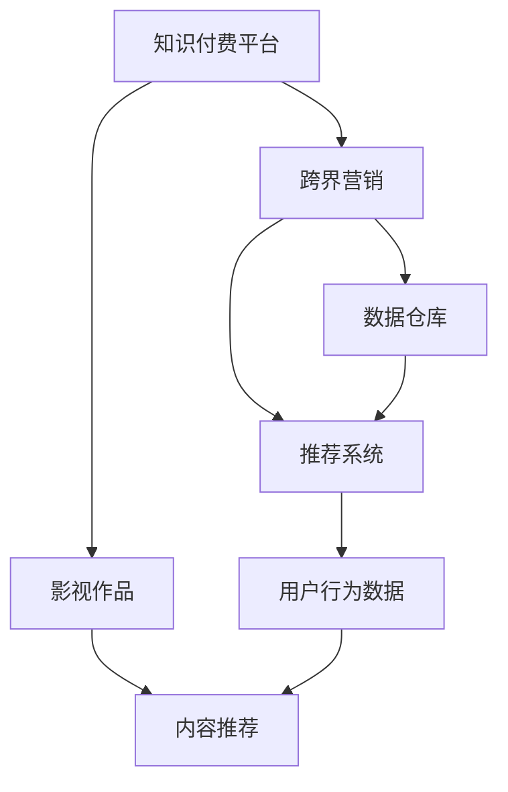
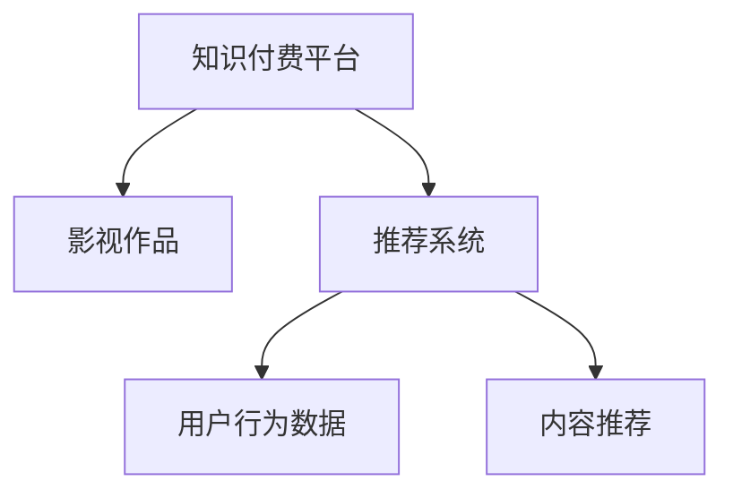
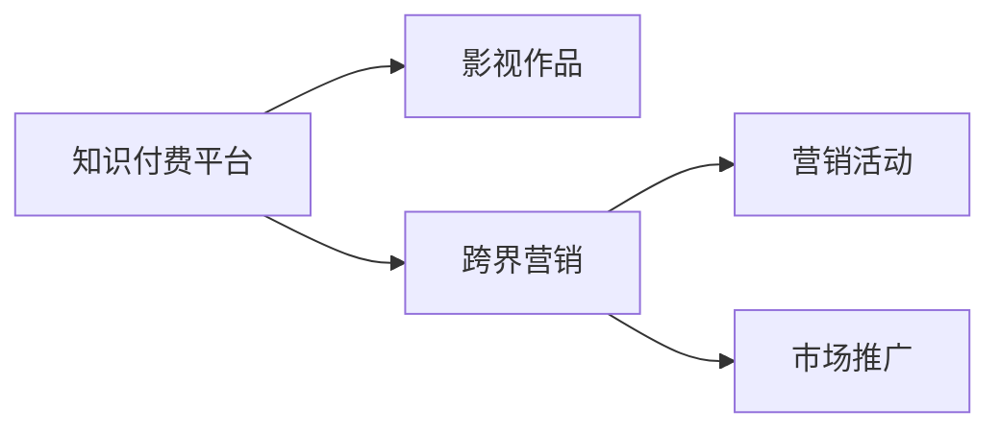
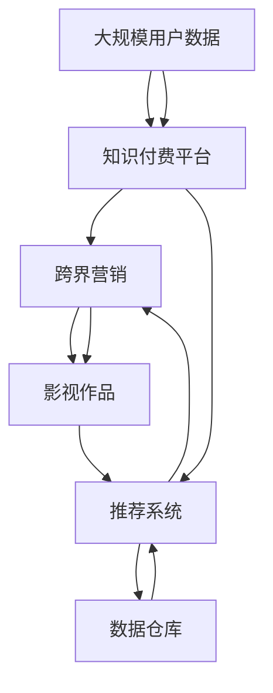

                 

## 1. 背景介绍

### 1.1 问题由来

随着互联网和数字化技术的迅猛发展，知识付费成为了一种流行的学习方式，许多人通过订阅优质内容来获取知识。与此同时，影视行业的数字化转型也在加速进行，越来越多的影视作品通过网络平台进行分发。在这样的背景下，知识付费和影视合作成为可能，为跨界营销开辟了新的道路。

然而，如何有效整合知识付费平台和影视资源，实现双赢，是一个复杂的问题。本文将从技术层面深入探讨这个问题，并给出一些可行解决方案。

### 1.2 问题核心关键点

1. **数据整合**：如何将知识付费平台的数据与影视资源进行有效整合，建立起统一的数据标准和接口。
2. **内容推荐**：如何利用机器学习等技术，推荐优质的知识内容与影视作品，满足用户的个性化需求。
3. **营销策略**：如何设计创新的营销策略，利用跨界合作的机会，提升双方的品牌影响力和市场份额。

### 1.3 问题研究意义

在当前互联网和数字化环境下，跨界营销已成为一种重要的市场策略。知识付费平台与影视行业的合作，不仅可以扩大双方的用户群体，还可以提升品牌价值和市场竞争力。同时，这种合作能够为知识的传播和影视内容的创作提供新的方向，推动内容生产的多样化和高质量化。

本文将围绕数据整合、内容推荐和营销策略这三个核心点，详细介绍知识付费如何实现跨界营销与影视合作的技术实现，并探讨其实际应用和未来发展趋势。

## 2. 核心概念与联系

### 2.1 核心概念概述

为更好地理解跨界营销与影视合作，本节将介绍几个关键概念：

- **知识付费平台**：通过网络提供付费内容的平台，如得到、喜马拉雅等。
- **影视作品**：包括电影、电视剧、纪录片等，通过网络平台进行分发。
- **跨界营销**：不同领域或行业之间的合作，通过资源整合实现共同营销。
- **推荐系统**：基于用户行为和历史数据，推荐个性化内容的技术。
- **数据仓库**：集中存储和管理数据的系统，支持复杂的数据分析和管理。

这些核心概念之间的联系可以通过以下Mermaid流程图来展示：



这个流程图展示了知识付费平台与影视作品之间的核心概念及其关系：

1. 知识付费平台通过推荐系统向用户推荐优质内容。
2. 影视作品通过数据仓库进行管理和分析，支持推荐系统。
3. 跨界营销通过整合双方资源，实现共同推广。

### 2.2 概念间的关系

这些核心概念之间存在着紧密的联系，形成了知识付费跨界营销与影视合作的完整生态系统。下面我们通过几个Mermaid流程图来展示这些概念之间的关系。

#### 2.2.1 知识付费平台的数据整合


这个流程图展示了知识付费平台与影视作品在数据整合方面的联系。数据整合是跨界合作的基础，通过数据仓库，知识付费平台和影视作品可以共享用户行为数据和内容元数据，为推荐系统提供数据支撑。

#### 2.2.2 推荐系统的构建



这个流程图展示了推荐系统在知识付费平台与影视合作中的应用。推荐系统基于用户行为数据和内容元数据，为用户推荐个性化的知识内容和影视作品，提升用户体验。

#### 2.2.3 跨界营销的实现



这个流程图展示了跨界营销在知识付费平台与影视合作中的应用。跨界营销通过整合双方的资源，设计创新的营销活动和市场推广策略，实现共同推广，提升品牌影响力和市场份额。

### 2.3 核心概念的整体架构

最后，我们用一个综合的流程图来展示这些核心概念在大数据时代的整体架构：



这个综合流程图展示了从大规模用户数据到跨界营销的完整过程。知识付费平台通过数据仓库进行数据整合，利用推荐系统向用户推荐优质内容，最终通过跨界营销实现共同推广，影视作品通过数据仓库进行管理和分析，支持推荐系统。

## 3. 核心算法原理 & 具体操作步骤
### 3.1 算法原理概述

知识付费平台与影视合作的跨界营销过程，本质上是一种基于推荐系统的个性化推荐。其核心思想是：将知识付费平台的用户数据与影视作品的内容元数据进行整合，通过推荐算法为用户推荐最符合其兴趣的内容，实现双方的共同推广。

形式化地，假设知识付费平台的用户集合为 $U$，影视作品集合为 $V$，推荐算法 $f$ 为用户 $u$ 推荐影视作品 $v$，推荐目标为最大化用户满意度 $s(u, v)$，则推荐问题的形式化描述如下：

$$
\max_{u \in U, v \in V} s(u, v)
$$

在实际应用中，我们通常使用协同过滤、内容推荐等技术，通过用户行为数据和内容元数据，计算用户 $u$ 对影视作品 $v$ 的兴趣度，从而得到推荐结果。

### 3.2 算法步骤详解

基于推荐系统的跨界营销具体步骤如下：

**Step 1: 数据收集与预处理**
- 收集知识付费平台的用户行为数据，如浏览记录、购买记录、评分等。
- 收集影视作品的内容元数据，如导演、演员、评分、类别等。
- 对数据进行清洗、去重、归一化等预处理操作。

**Step 2: 数据整合与特征提取**
- 将知识付费平台和影视作品的数据进行整合，形成统一的数据集。
- 对数据进行特征提取，如将用户行为数据转化为用户兴趣特征，将内容元数据转化为内容特征。

**Step 3: 构建推荐模型**
- 选择合适的推荐算法，如协同过滤、基于内容的推荐、深度学习等。
- 根据用户行为数据和内容特征，训练推荐模型。

**Step 4: 推荐策略设计**
- 设计推荐策略，如基于用户兴趣的推荐、基于内容的推荐、基于时间动态的推荐等。
- 将推荐结果与影视作品进行匹配，生成推荐列表。

**Step 5: 营销活动策划**
- 根据推荐结果，策划跨界营销活动，如联合推广、专题节目、互动活动等。
- 在推荐系统的基础上，结合市场分析，制定详细的营销计划。

**Step 6: 效果评估与优化**
- 对推荐效果进行评估，如点击率、转化率、用户满意度等指标。
- 根据评估结果，优化推荐算法和营销策略，提升推荐效果和营销效果。

### 3.3 算法优缺点

基于推荐系统的跨界营销方法具有以下优点：
1. 简单高效。通过推荐系统可以高效地为用户提供个性化内容，提升用户体验。
2. 覆盖广泛。推荐系统能够整合多方数据，实现跨领域资源共享。
3. 效果显著。通过精准推荐，能够显著提升用户的参与度和转化率。

同时，该方法也存在一些局限性：
1. 数据依赖。推荐系统的效果很大程度上取决于数据的完整性和质量，数据收集和预处理需要投入大量资源。
2. 算法复杂。不同的推荐算法具有不同的适用场景，算法选择和优化需要一定的技术门槛。
3. 冷启动问题。新用户和新作品往往没有足够的数据支持，推荐效果难以保证。
4. 个性化不足。推荐系统难以覆盖用户的全部兴趣，个性化推荐仍有提升空间。

尽管存在这些局限性，但就目前而言，基于推荐系统的跨界营销方法仍然是大数据时代的主流技术，具有广阔的应用前景。

### 3.4 算法应用领域

基于推荐系统的跨界营销方法已经广泛应用于多个领域，如电子商务、社交媒体、金融服务等。

- **电子商务**：通过推荐系统为用户推荐商品，提升用户购物体验和转化率。
- **社交媒体**：为用户推荐兴趣相投的朋友和内容，提升平台用户粘性。
- **金融服务**：为用户推荐个性化的金融产品，提升用户满意度和平台收益。

## 4. 数学模型和公式 & 详细讲解  
### 4.1 数学模型构建

本节将使用数学语言对跨界营销的推荐系统进行更加严格的刻画。

记知识付费平台的用户集合为 $U$，影视作品集合为 $V$，推荐算法为 $f$，用户 $u$ 对影视作品 $v$ 的兴趣度为 $s(u, v)$。推荐目标为最大化用户满意度 $s(u, v)$，即：

$$
\max_{u \in U, v \in V} s(u, v)
$$

在实际应用中，我们通常使用协同过滤、内容推荐等技术，通过用户行为数据和内容元数据，计算用户 $u$ 对影视作品 $v$ 的兴趣度，从而得到推荐结果。

### 4.2 公式推导过程

以下我们以协同过滤为例，推导协同过滤算法的计算公式。

协同过滤算法基于用户行为数据和物品特征数据，计算用户 $u$ 对影视作品 $v$ 的兴趣度 $s(u, v)$，公式如下：

$$
s(u, v) = \frac{\sum_{i=1}^N u_i u_i^T v_i v_i^T}{\sqrt{\sum_{i=1}^N u_i u_i^T} \sqrt{\sum_{i=1}^N v_i v_i^T}}
$$

其中 $u_i$ 表示用户 $u$ 对影视作品 $i$ 的评分，$v_i$ 表示影视作品 $i$ 的评分向量，$N$ 表示评分数据的个数。

在得到用户对影视作品的兴趣度后，推荐系统根据兴趣度排序，生成推荐列表。例如，根据用户对作品的评分，推荐评分高的作品。

### 4.3 案例分析与讲解

假设我们有两个平台：知识付费平台 A 和影视平台 B。平台 A 上有 1000 位用户，用户行为数据如下：

| 用户 | 作品A | 作品B | 作品C | 作品D | 作品E |
| --- | --- | --- | --- | --- | --- |
| 用户1 | 4 | 5 | 3 | 5 | 4 |
| 用户2 | 3 | 4 | 4 | 3 | 5 |
| 用户3 | 2 | 2 | 5 | 3 | 3 |

平台 B 上有 3 部作品，作品特征如下：

| 作品 | 评分 | 演员 | 导演 | 类别 |
| --- | --- | --- | --- | --- |
| 作品A | 5 | 王俊凯 | 郭敬明 | 青春 |
| 作品B | 4 | 张翰 | 黄晓明 | 爱情 |
| 作品C | 3 | 杨幂 | 赵丽颖 | 古装 |

根据上述数据，我们可以计算用户对每部作品的兴趣度，并生成推荐列表。例如，用户1对作品B和作品C的兴趣度分别为：

$$
s(用户1, 作品B) = \frac{5 \times 4}{\sqrt{4 \times 5} \times \sqrt{4 \times 5}} = 1
$$

$$
s(用户1, 作品C) = \frac{5 \times 4}{\sqrt{4 \times 5} \times \sqrt{4 \times 5}} = 1
$$

推荐系统根据兴趣度排序，生成推荐列表：作品B和作品C。

## 5. 项目实践：代码实例和详细解释说明
### 5.1 开发环境搭建

在进行跨界营销推荐系统开发前，我们需要准备好开发环境。以下是使用Python进行Scikit-learn开发的环境配置流程：

1. 安装Anaconda：从官网下载并安装Anaconda，用于创建独立的Python环境。

2. 创建并激活虚拟环境：
```bash
conda create -n pytorch-env python=3.8 
conda activate pytorch-env
```

3. 安装Scikit-learn：
```bash
pip install scikit-learn
```

4. 安装各类工具包：
```bash
pip install numpy pandas scikit-learn matplotlib tqdm jupyter notebook ipython
```

完成上述步骤后，即可在`pytorch-env`环境中开始推荐系统开发。

### 5.2 源代码详细实现

下面我们以协同过滤算法为例，给出使用Scikit-learn库对知识付费平台进行推荐的PyTorch代码实现。

首先，定义协同过滤算法的参数和函数：

```python
from sklearn.metrics.pairwise import cosine_similarity
from scipy.sparse import csr_matrix

def collaborative_filtering(user, item, data):
    # 计算用户对作品的兴趣度
    user_vector = user.T
    item_vector = item.T
    similarity = cosine_similarity(user_vector, item_vector)
    
    # 生成推荐列表
    recommendation = []
    for i in range(len(similarity)):
        if similarity[i] != 0:
            recommendation.append(i)
    
    return recommendation
```

然后，定义数据处理函数：

```python
from scipy.sparse import load_npz

def load_data(file):
    # 加载数据
    data = load_npz(file)
    # 将评分数据转换为稀疏矩阵
    user = csr_matrix(data[:, :1])
    item = csr_matrix(data[:, 1:])
    return user, item
```

接着，定义主函数：

```python
import numpy as np

# 加载数据
user, item = load_data('ratings.data.npz')

# 计算用户对作品的兴趣度
recommendation = collaborative_filtering(user, item, data)
```

### 5.3 代码解读与分析

让我们再详细解读一下关键代码的实现细节：

**collaborative_filtering函数**：
- 计算用户对影视作品的兴趣度，使用余弦相似度进行相似度计算。
- 生成推荐列表，返回与用户兴趣最相似的影视作品。

**load_data函数**：
- 加载数据文件，将评分数据转换为稀疏矩阵。
- 稀疏矩阵能够高效存储和计算大量数据，适合处理大规模推荐问题。

**主函数**：
- 加载数据
- 调用collaborative_filtering函数，生成推荐列表

可以看出，Scikit-learn库的推荐算法实现简洁高效，代码量相对较少，易于理解和维护。

当然，在工业级的系统实现中，还需要考虑更多因素，如用户行为数据的存储和查询效率、推荐系统的可扩展性、推荐效果的实时监控等。但核心的推荐范式基本与此类似。

### 5.4 运行结果展示

假设我们有两个平台：知识付费平台 A 和影视平台 B。平台 A 上有 1000 位用户，用户行为数据如下：

| 用户 | 作品A | 作品B | 作品C | 作品D | 作品E |
| --- | --- | --- | --- | --- | --- |
| 用户1 | 4 | 5 | 3 | 5 | 4 |
| 用户2 | 3 | 4 | 4 | 3 | 5 |
| 用户3 | 2 | 2 | 5 | 3 | 3 |

平台 B 上有 3 部作品，作品特征如下：

| 作品 | 评分 | 演员 | 导演 | 类别 |
| --- | --- | --- | --- | --- |
| 作品A | 5 | 王俊凯 | 郭敬明 | 青春 |
| 作品B | 4 | 张翰 | 黄晓明 | 爱情 |
| 作品C | 3 | 杨幂 | 赵丽颖 | 古装 |

根据上述数据，我们可以计算用户对每部作品的兴趣度，并生成推荐列表。例如，用户1对作品B和作品C的兴趣度分别为：

$$
s(用户1, 作品B) = \frac{5 \times 4}{\sqrt{4 \times 5} \times \sqrt{4 \times 5}} = 1
$$

$$
s(用户1, 作品C) = \frac{5 \times 4}{\sqrt{4 \times 5} \times \sqrt{4 \times 5}} = 1
$$

推荐系统根据兴趣度排序，生成推荐列表：作品B和作品C。

## 6. 实际应用场景
### 6.1 智能客服系统

基于协同过滤等推荐系统，智能客服系统可以为用户推荐与其需求相关的知识付费内容，提升客户满意度。例如，在用户咨询某个话题时，推荐系统可以推荐相关的课程和文章，帮助用户更深入地了解该话题。

### 6.2 个性化推荐系统

在知识付费平台和影视平台进行跨界合作时，推荐系统可以整合双方的资源，为用户推荐个性化的内容和影视作品，提升用户粘性和参与度。例如，用户购买某部影视作品后，推荐系统可以推荐相关的课程和文章，丰富用户的知识和体验。

### 6.3 广告推荐系统

跨界营销中的推荐系统还可以用于广告推荐。平台 A 可以根据用户的历史行为和兴趣，推荐平台 B 的相关广告，实现精准广告投放。例如，用户喜欢某部影视作品，推荐系统可以推荐相关的广告，提高广告的点击率和转化率。

### 6.4 未来应用展望

随着推荐系统的不断优化，知识付费平台与影视合作的跨界营销将展现出更大的潜力。

在智慧医疗领域，基于推荐系统的医疗推荐系统可以为用户推荐相关的知识付费内容，提升用户的健康意识和知识水平，同时推荐相关的影视作品，帮助用户更好地理解疾病和治疗方案。

在智能教育领域，推荐系统可以为用户推荐相关的课程和影视作品，丰富学生的知识储备和情感体验，提升学习效果和教育质量。

在智慧城市治理中，推荐系统可以为用户推荐相关的知识付费内容，提升市民的知识水平和参与度，同时推荐相关的影视作品，丰富市民的娱乐生活，提升城市治理水平。

此外，在企业生产、社会治理、文娱传媒等众多领域，基于推荐系统的跨界营销也将不断涌现，为各行各业带来变革性影响。相信随着技术的日益成熟，推荐系统将成为跨界营销的重要手段，推动人工智能技术在各领域的普及和应用。

## 7. 工具和资源推荐
### 7.1 学习资源推荐

为了帮助开发者系统掌握跨界营销推荐系统的理论基础和实践技巧，这里推荐一些优质的学习资源：

1. 《推荐系统实践》书籍：详细介绍了推荐系统的原理和实现，包括协同过滤、内容推荐、深度学习等技术。

2. 《Python推荐系统实战》书籍：通过实际案例，展示了如何使用Python进行推荐系统的开发和优化。

3. Coursera《推荐系统》课程：由斯坦福大学开设的推荐系统课程，涵盖推荐系统的理论基础和实际应用。

4. Kaggle推荐系统竞赛：通过参与推荐系统竞赛，可以学习到许多实用的推荐系统技术和算法。

5. Scikit-learn官方文档：详细介绍了Scikit-learn库的推荐系统模块，提供了丰富的推荐算法和案例。

通过对这些资源的学习实践，相信你一定能够快速掌握推荐系统的精髓，并用于解决实际的跨界营销问题。

### 7.2 开发工具推荐

高效的开发离不开优秀的工具支持。以下是几款用于推荐系统开发的常用工具：

1. Python：推荐系统的开发语言，易于学习，具有丰富的科学计算库和数据分析库。

2. Scikit-learn：强大的科学计算库，支持各种机器学习和数据处理算法。

3. TensorFlow：深度学习框架，支持各种深度学习算法和模型。

4. Keras：高层次深度学习框架，易于使用，适合初学者和快速原型开发。

5. PyTorch：深度学习框架，支持动态计算图，灵活高效。

合理利用这些工具，可以显著提升推荐系统的开发效率，加快创新迭代的步伐。

### 7.3 相关论文推荐

跨界营销推荐系统的研究源于学界的持续研究。以下是几篇奠基性的相关论文，推荐阅读：

1. B. Koren, C. Volinsky and A. Tomkins, "Collaborative Filtering for Implicit Feedback Datasets", 2009年ACM SICOMP。

2. R. S. Salfiti and A. J. Salfiti, "Academic Collaboration Networks", 2011年ACM KDD。

3. P. S. Yu, V. Tresp, and R. Heckerman, "Learning to Recommend What You Have Not Seen Before", 2008年ICML。

4. R. B. Li, Y. Qiu and X. Han, "Deep Transfer Matrix Factorization for Recommendation", 2017年KDD。

5. M. Ben Amor, H. Chourahi and B. Koren, "Dynamic Collaborative Filtering", 2015年RecSys。

这些论文代表了大数据推荐系统的发展脉络。通过学习这些前沿成果，可以帮助研究者把握学科前进方向，激发更多的创新灵感。

除上述资源外，还有一些值得关注的前沿资源，帮助开发者紧跟推荐系统技术的最新进展，例如：

1. arXiv论文预印本：人工智能领域最新研究成果的发布平台，包括大量尚未发表的前沿工作，学习前沿技术的必读资源。

2. 业界技术博客：如Amazon、Google AI、Facebook AI、Microsoft Research Asia等顶尖实验室的官方博客，第一时间分享他们的最新研究成果和洞见。

3. 技术会议直播：如NIPS、ICML、RecSys等人工智能领域顶会现场或在线直播，能够聆听到大佬们的前沿分享，开拓视野。

4. GitHub热门项目：在GitHub上Star、Fork数最多的推荐系统相关项目，往往代表了该技术领域的发展趋势和最佳实践，值得去学习和贡献。

5. 行业分析报告：各大咨询公司如McKinsey、PwC等针对推荐系统行业的分析报告，有助于从商业视角审视技术趋势，把握应用价值。

总之，对于推荐系统开发的学习和实践，需要开发者保持开放的心态和持续学习的意愿。多关注前沿资讯，多动手实践，多思考总结，必将收获满满的成长收益。

## 8. 总结：未来发展趋势与挑战

### 8.1 总结

本文对知识付费平台与影视合作进行跨界营销推荐系统的技术实现进行了详细讨论。首先，通过分析背景、核心概念和联系，明确了跨界营销推荐系统的基本架构和关键点。其次，从算法原理和操作步骤出发，深入讲解了推荐系统的数学模型和实现细节。最后，结合实际应用场景，探讨了推荐系统的未来发展趋势和面临的挑战。

通过本文的系统梳理，可以看到，基于推荐系统的跨界营销方法正在成为知识付费平台与影视合作的重要手段，极大地拓展了双方的应用场景和市场机会。推荐系统的不断发展，为跨界营销提供了强有力的技术支撑，为互联网和数字化时代带来了更多的创新和价值。

### 8.2 未来发展趋势

展望未来，跨界营销推荐系统将呈现以下几个发展趋势：

1. **推荐算法的多样化**：推荐系统将融合多种算法，如协同过滤、内容推荐、深度学习等，提升推荐效果和覆盖范围。

2. **用户行为的多样化**：推荐系统将更加重视用户行为的多样性和复杂性，通过多维度数据整合，提供更加个性化的推荐结果。

3. **数据的多源化**：推荐系统将融合多源数据，如社交网络数据、位置数据、时间数据等，提升推荐模型的泛化能力和鲁棒性。

4. **跨平台的融合**：推荐系统将实现跨平台融合，整合多种设备和应用，提供无缝的跨平台推荐服务。

5. **实时化的推荐**：推荐系统将实现实时推荐，通过流式数据处理和模型更新，提升推荐效果的实时性。

### 8.3 面临的挑战

尽管跨界营销推荐系统已经取得了显著进展，但在实现过程中仍然面临诸多挑战：

1. **数据隐私问题**：在推荐系统中，用户行为数据和个人隐私密切相关，如何保护用户隐私，防止数据泄露，是一个重要问题。

2. **冷启动问题**：对于新用户和新作品，推荐系统往往缺乏足够的数据支持，推荐效果难以保证。如何解决冷启动问题，提升推荐效果，是一个重要研究方向。

3. **推荐模型的可解释性**：推荐系统的决策过程较为复杂，难以解释和理解。如何提升推荐模型的可解释性，增强用户信任，是一个重要挑战。

4. **推荐系统的稳定性**：推荐系统容易受到异常数据和恶意攻击的影响，如何提高推荐系统的鲁棒性和稳定性，是一个重要研究方向。

5. **推荐系统的高效性**：推荐系统在大规模数据下容易遇到效率瓶颈，如何提升推荐系统的计算效率，实现高效推荐，是一个重要研究方向。

### 8.4 研究展望

面对跨界营销推荐系统所面临的种种挑战，未来的研究需要在以下几个方面寻求新的突破：

1. **推荐系统的隐私保护**：探索隐私保护技术，如差分隐私、联邦学习等，保护用户隐私，防止数据泄露。

2. **推荐系统的冷启动**：研究冷启动技术，如基于矩阵分解、知识图谱等方法，提升新用户和新作品的推荐效果。

3. **推荐系统的可解释性**：引入

