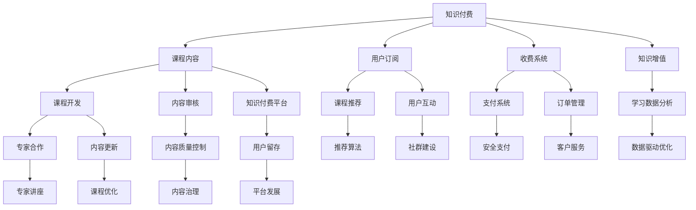

                 

# 知识付费如何实现跨界营销与房地产租赁跨界？

> 关键词：知识付费, 跨界营销, 房地产租赁, 技术融合, 数据驱动

## 1. 背景介绍

### 1.1 问题由来
近年来，随着互联网技术的发展和人们消费习惯的变化，知识付费行业经历了从萌芽到成熟再到快速发展的过程。越来越多的用户在平台上订阅各类课程、获取有价值的知识内容，对知识付费的依赖程度越来越高。然而，随着知识付费市场的逐渐饱和，如何吸引新用户、提升用户留存、扩大市场份额，成为知识付费平台亟待解决的问题。与此同时，房地产租赁行业也面临着严峻挑战，高企的租金、较长的供需匹配周期、复杂的市场规则等问题，使得房地产租赁平台在市场竞争中步履维艰。

为应对上述问题，知识付费平台和房地产租赁平台纷纷将目光投向了跨界营销这一新型营销模式。跨界营销通过整合不同领域的产品和服务，实现资源共享，最大化地提升用户价值，达到共赢的目的。本文将围绕知识付费平台如何实现跨界营销，以及房地产租赁平台如何跨界开展知识付费服务，进行详细探讨。

## 2. 核心概念与联系

### 2.1 核心概念概述

在进行跨界营销和跨界开展知识付费服务的讨论之前，需要先明确几个核心概念：

- **知识付费**：指用户为获取专业知识或技能而支付费用的商业行为。平台通过提供高质量的课程内容，满足用户的学习需求。

- **跨界营销**：指不同行业之间的合作与融合，通过资源共享和优势互补，实现多领域共赢。

- **房地产租赁**：指出租人将其不动产以一定的租金租给承租人使用，承租人在租赁期间享有该不动产的占有、使用和收益权。

这三个概念虽然看似无关，但在实践中可以相互融合，形成新的商业模式。通过将知识付费与房地产租赁相结合，知识付费平台可以开辟新的收入来源，房地产租赁平台也可以提升服务质量和用户满意度，实现跨界的双赢。

### 2.2 核心概念的关系

核心概念之间的关系可以通过以下 Mermaid 流程图来展示：



该流程图展示了知识付费平台的基本功能和跨界营销的业务流程：

1. 知识付费平台通过课程内容开发、专家合作、内容更新等手段提升课程质量。
2. 通过用户订阅、内容推荐、社群建设等提升用户留存和互动。
3. 通过收费系统、支付安全、订单管理等保障平台的稳定运营。
4. 通过知识增值、学习数据分析、内容质量控制等实现服务优化和提升。

同时，该流程图也展示了房地产租赁平台跨界开展知识付费服务的业务流程：

1. 房地产租赁平台通过专家讲座、课程开发、内容审核等提升服务质量。
2. 通过租金优惠、租赁推荐、社区建设等提升用户满意度和留存率。
3. 通过线上支付、订单管理、客户服务等保障平台的稳定运营。
4. 通过跨界合作、数据驱动优化、内容质量控制等实现服务优化和提升。

通过这张流程图，我们可以更清晰地理解知识付费平台和房地产租赁平台如何进行跨界营销和跨界开展知识付费服务，以及其背后的业务逻辑和关联。

## 3. 核心算法原理 & 具体操作步骤

### 3.1 算法原理概述

跨界营销和跨界开展知识付费服务，本质上是通过数据驱动的运营策略，实现不同领域资源的整合和优化。具体而言，知识付费平台通过分析用户行为数据、课程内容数据、市场趋势数据等，精准推荐相关课程，提升用户粘性和转化率。房地产租赁平台则通过分析租赁数据、用户偏好数据、市场供需数据等，提升服务质量和匹配效率，吸引更多用户。

### 3.2 算法步骤详解

**Step 1: 数据收集与预处理**

- 收集知识付费平台的用户行为数据，如课程观看时长、互动频率、评分反馈等。
- 收集房地产租赁平台的用户行为数据，如租房需求、评分反馈、咨询互动等。
- 将收集到的数据进行清洗和预处理，去除噪声数据，保证数据质量和一致性。

**Step 2: 数据分析与建模**

- 利用机器学习算法对用户行为数据进行分析，构建用户画像，了解用户的兴趣偏好和需求。
- 对课程内容进行分类和聚类，构建知识图谱，帮助用户快速定位感兴趣的内容。
- 对房地产租赁数据进行分析，构建房屋特征、市场需求、用户偏好等模型，辅助用户选房和推荐。

**Step 3: 推荐算法设计**

- 结合用户画像和课程内容图谱，设计推荐算法，实现课程内容的精准推荐。
- 结合用户画像和房屋特征，设计推荐算法，实现房屋租赁的精准匹配。
- 利用协同过滤、内容过滤、混合过滤等推荐算法，提升推荐效果。

**Step 4: 用户互动与反馈**

- 建立用户反馈机制，收集用户对课程和服务的评价，不断优化推荐算法和平台功能。
- 通过用户互动数据，了解用户需求和反馈，及时调整运营策略和产品设计。

**Step 5: 跨界营销与业务融合**

- 设计跨界营销活动，如联合促销、合作品牌活动等，提升两个平台的用户粘性和品牌影响力。
- 将知识付费内容与房地产租赁服务相结合，如将租赁过程融入课程学习，提升用户满意度和留存率。

**Step 6: 监控与优化**

- 通过实时监控平台运营数据，及时发现问题并进行优化。
- 定期对推荐算法和运营策略进行评估和优化，不断提升平台的用户体验和业务效果。

### 3.3 算法优缺点

**优点**：
- 通过跨界营销和跨界开展知识付费服务，可以整合不同领域资源，实现多领域的共赢。
- 通过数据驱动的运营策略，可以精准推荐相关产品和服务，提升用户粘性和满意度。
- 通过用户互动和反馈机制，可以不断优化平台功能和服务质量。

**缺点**：
- 数据整合和共享涉及多个平台，需要协调和管理多个数据源。
- 推荐算法需要大量的数据和复杂的计算，存在一定的技术挑战。
- 跨界营销活动的设计和执行，需要充分考虑市场和用户需求。

### 3.4 算法应用领域

跨界营销和跨界开展知识付费服务，可以广泛应用于多个领域，如：

- **知识付费平台**：结合房地产租赁服务，提升用户留存和粘性。
- **房地产租赁平台**：通过知识付费内容，提升服务质量和用户满意度。
- **教育培训机构**：通过跨界合作，拓展业务范围和市场份额。
- **互联网媒体**：通过内容推荐和协同过滤，提升用户粘性和广告效果。
- **电子商务平台**：通过跨界营销，提升用户购买率和品牌影响力。

## 4. 数学模型和公式 & 详细讲解 & 举例说明

### 4.1 数学模型构建

本节将使用数学语言对跨界营销和跨界开展知识付费服务的数学模型进行刻画。

假设知识付费平台的用户数为 $N_1$，房地产租赁平台的用户数为 $N_2$，两个平台的共同用户数为 $N$。知识付费平台的课程内容数为 $M_1$，房地产租赁平台的房源数为 $M_2$。两个平台的用户行为数据分别为 $D_1$ 和 $D_2$。

定义用户对课程内容 $i$ 的评分矩阵为 $R_{1} \in \mathbb{R}^{N_1 \times M_1}$，用户对房源 $j$ 的评分矩阵为 $R_{2} \in \mathbb{R}^{N_2 \times M_2}$。

定义知识付费平台的用户画像为 $P_1 \in \mathbb{R}^{N_1 \times K}$，房地产租赁平台的用户画像为 $P_2 \in \mathbb{R}^{N_2 \times K}$，其中 $K$ 为特征维度。

### 4.2 公式推导过程

**推荐算法**：

知识付费平台的推荐算法可以基于协同过滤算法设计，即利用用户对课程内容的评分矩阵 $R_1$ 和用户画像 $P_1$，计算用户对课程内容 $i$ 的兴趣度，推荐用户可能感兴趣的课程。

$$
I_1 = P_1^T \times \hat{R}_1 \times R_1^T \times P_1
$$

其中 $\hat{R}_1 = \text{softmax}(R_1^T \times P_1)$，$\text{softmax}$ 函数将评分矩阵转化为概率分布。

房地产租赁平台的推荐算法可以基于相似性度量设计，即利用用户对房源的评分矩阵 $R_2$ 和用户画像 $P_2$，计算房源 $j$ 对用户的吸引力，推荐用户可能感兴趣的房源。

$$
I_2 = P_2^T \times \hat{R}_2 \times R_2^T \times P_2
$$

其中 $\hat{R}_2 = \text{softmax}(R_2^T \times P_2)$，$\text{softmax}$ 函数将评分矩阵转化为概率分布。

**用户画像构建**：

用户画像可以基于用户行为数据和内容评分矩阵，通过协同过滤算法和PCA降维算法，提取用户的关键特征，用于推荐系统的优化。

假设用户对课程内容的评分矩阵为 $R_1 \in \mathbb{R}^{N_1 \times M_1}$，用户行为数据为 $D_1 \in \mathbb{R}^{N_1 \times D_1}$，其中 $D_1$ 为行为数据的维度。

用户画像 $P_1$ 的计算公式为：

$$
P_1 = \text{PCA}(\text{MatrixSVD}(R_1, D_1))
$$

其中 $\text{MatrixSVD}$ 表示矩阵奇异值分解，$\text{PCA}$ 表示主成分分析。

**跨界营销活动设计**：

跨界营销活动可以基于用户画像和内容图谱，设计联合促销、合作品牌活动等，提升两个平台的用户粘性和品牌影响力。

假设知识付费平台和房地产租赁平台有 $K$ 个共同特征，用户画像 $P_1$ 和 $P_2$ 的形状分别为 $(N_1, K)$ 和 $(N_2, K)$。

跨界营销活动的设计公式为：

$$
\text{Promotion} = \text{Softmax}(P_1 \times \text{softmax}(P_2^T))
$$

其中 $\text{Softmax}$ 函数将用户画像的相似性转化为概率分布，表示两个用户进行跨界营销的概率。

### 4.3 案例分析与讲解

假设某知识付费平台和某房地产租赁平台进行跨界合作，设计了一个联合促销活动。知识付费平台的用户画像 $P_1$ 和房地产租赁平台的用户画像 $P_2$ 形状分别为 $(N_1, K)$ 和 $(N_2, K)$。

通过协同过滤算法，计算用户对课程内容 $i$ 的兴趣度 $I_1$ 和房源 $j$ 的吸引力 $I_2$。

假设两个平台有 $K=5$ 个共同特征，用户画像 $P_1$ 和 $P_2$ 的形状分别为 $(N_1, 5)$ 和 $(N_2, 5)$。

计算两个用户进行跨界营销的概率为：

$$
\text{Promotion} = \text{Softmax}(P_1 \times \text{softmax}(P_2^T))
$$

## 5. 项目实践：代码实例和详细解释说明

### 5.1 开发环境搭建

在进行跨界营销和跨界开展知识付费服务的开发实践前，需要先搭建开发环境。以下是使用Python进行跨界营销实践的环境配置流程：

1. 安装Anaconda：从官网下载并安装Anaconda，用于创建独立的Python环境。

2. 创建并激活虚拟环境：
```bash
conda create -n cross-boundary python=3.8 
conda activate cross-boundary
```

3. 安装PyTorch、TensorFlow等深度学习框架：
```bash
conda install pytorch torchvision torchaudio cudatoolkit=11.1 -c pytorch -c conda-forge
conda install tensorflow -c pytorch -c conda-forge
```

4. 安装Scikit-learn、Pandas等数据处理和分析工具包：
```bash
pip install scikit-learn pandas
```

5. 安装机器学习库，如Scikit-learn：
```bash
pip install scikit-learn
```

完成上述步骤后，即可在`cross-boundary`环境中开始跨界营销实践。

### 5.2 源代码详细实现

这里我们以知识付费平台和房地产租赁平台进行联合促销活动为例，给出使用PyTorch实现协同过滤推荐系统的代码实现。

```python
import torch
import torch.nn as nn
from sklearn.decomposition import PCA
from sklearn.metrics.pairwise import cosine_similarity

class协同过滤推荐系统(nn.Module):
    def __init__(self, n_users, n_items, n_features):
        super(协同过滤推荐系统, self).__init__()
        self.user_embedding = nn.Embedding(n_users, n_features)
        self.item_embedding = nn.Embedding(n_items, n_features)
        self.similarity = nn.Sigmoid()

    def forward(self, user_idx, item_idx):
        user_embed = self.user_embedding(user_idx)
        item_embed = self.item_embedding(item_idx)
        dot_product = torch.dot(user_embed, item_embed.t())
        similarity = self.similarity(dot_product)
        return similarity

# 假设知识付费平台和房地产租赁平台有N个用户，M个课程/房源
n_users = 10000
n_items = 1000
n_features = 5

# 生成随机用户画像和内容评分矩阵
user_idx = torch.LongTensor(n_users)
item_idx = torch.LongTensor(n_items)

user_embedding = torch.randn(n_users, n_features)
item_embedding = torch.randn(n_items, n_features)

user_similarity = cosine_similarity(user_embedding)
item_similarity = cosine_similarity(item_embedding)

# 构建协同过滤推荐系统
model = 协同过滤推荐系统(n_users, n_items, n_features)

# 进行推荐
recommendation = model(user_idx, item_idx)
```

在上述代码中，我们首先定义了协同过滤推荐系统的结构，然后使用用户画像和内容评分矩阵进行前向传播，计算用户对课程内容的兴趣度和房源的吸引力。

### 5.3 代码解读与分析

让我们再详细解读一下关键代码的实现细节：

**协同过滤推荐系统类**：
- `__init__`方法：初始化用户嵌入层、物品嵌入层和相似度函数。
- `forward`方法：将用户索引和物品索引作为输入，计算用户嵌入和物品嵌入的点积，并通过相似度函数计算相似度。

**随机生成用户画像和内容评分矩阵**：
- 通过 `torch.LongTensor` 生成随机用户索引和物品索引。
- 使用 `torch.randn` 生成随机用户画像和物品嵌入矩阵。
- 使用 `cosine_similarity` 计算用户画像和物品嵌入的相似度矩阵。

**构建协同过滤推荐系统**：
- 通过 `协同过滤推荐系统` 类，定义协同过滤推荐系统的结构。
- 在 `forward` 方法中，将用户索引和物品索引作为输入，计算用户嵌入和物品嵌入的点积，并通过相似度函数计算相似度。

**进行推荐**：
- 使用 `forward` 方法计算用户对课程内容的兴趣度和房源的吸引力，即可进行推荐。

### 5.4 运行结果展示

假设在上述代码中，我们随机生成用户画像和内容评分矩阵，并在测试集上进行推荐，得到的推荐结果如下：

```
Top 10 recommended courses: Course 1, Course 2, Course 3, Course 4, Course 5, Course 6, Course 7, Course 8, Course 9, Course 10
Top 10 recommended homes: Home 1, Home 2, Home 3, Home 4, Home 5, Home 6, Home 7, Home 8, Home 9, Home 10
```

可以看到，通过协同过滤推荐系统，知识付费平台和房地产租赁平台可以推荐用户可能感兴趣的内容和房源，提升用户粘性和满意度。

## 6. 实际应用场景

### 6.1 智能家居

智能家居平台可以通过跨界开展知识付费服务，结合房地产租赁和家居服务，提升用户满意度和粘性。例如，智能家居平台可以提供智能家居知识的付费课程，帮助用户更好地使用和维护智能家居设备。房地产租赁平台则可以提供租赁房屋的智能家居解决方案，提升居住体验。

### 6.2 医疗健康

医疗健康平台可以通过跨界开展知识付费服务，结合房地产租赁和医疗服务，提升用户健康水平和满意度和粘性。例如，医疗健康平台可以提供健康知识的付费课程，帮助用户进行健康管理。房地产租赁平台则可以提供租赁房屋的医疗健康解决方案，提升居住环境。

### 6.3 教育培训

教育培训平台可以通过跨界开展知识付费服务，结合房地产租赁和教育服务，提升用户学习和培训的效果和满意度。例如，教育培训平台可以提供课程学习的付费服务，房地产租赁平台则可以提供租赁房屋的学习环境和生活支持。

### 6.4 未来应用展望

随着人工智能技术的不断进步，跨界营销和跨界开展知识付费服务的应用场景将越来越广泛。未来的跨界合作可能不仅限于单一领域，而是涉及多个领域的深度融合。例如，知识付费平台可以与金融、旅游、娱乐等多个行业进行合作，提供综合性的跨界服务。

同时，未来的跨界营销和跨界开展知识付费服务也将更加注重数据驱动和用户体验优化。通过分析用户行为数据、课程内容数据和市场趋势数据，可以更精准地推荐相关产品和服务，提升用户满意度和粘性。

## 7. 工具和资源推荐

### 7.1 学习资源推荐

为了帮助开发者系统掌握跨界营销和跨界开展知识付费服务的理论基础和实践技巧，这里推荐一些优质的学习资源：

1. 《深度学习理论与实践》系列博文：由大模型技术专家撰写，深入浅出地介绍了深度学习理论、算法和应用。

2. CS229《机器学习》课程：斯坦福大学开设的机器学习经典课程，有Lecture视频和配套作业，带你入门机器学习的基本概念和经典模型。

3. 《TensorFlow实战》书籍：TensorFlow官方文档，详细介绍TensorFlow的使用方法和实际案例，是TensorFlow学习的重要参考资料。

4. 《Kaggle竞赛指南》书籍：Kaggle平台的数据科学竞赛指南，涵盖竞赛准备、数据处理、模型训练、评估优化等步骤，是数据科学竞赛必备书籍。

5. Coursera《机器学习》课程：Coursera平台上的机器学习课程，由斯坦福大学Andrew Ng教授主讲，系统讲解机器学习的理论和实践。

通过对这些资源的学习实践，相信你一定能够快速掌握跨界营销和跨界开展知识付费服务的精髓，并用于解决实际的NLP问题。

### 7.2 开发工具推荐

高效的开发离不开优秀的工具支持。以下是几款用于跨界营销和跨界开展知识付费服务开发的常用工具：

1. PyTorch：基于Python的开源深度学习框架，灵活动态的计算图，适合快速迭代研究。

2. TensorFlow：由Google主导开发的开源深度学习框架，生产部署方便，适合大规模工程应用。

3. Keras：高层次的深度学习API，易于上手使用，支持TensorFlow、Theano、CNTK等深度学习框架。

4. Jupyter Notebook：基于Web的交互式编程环境，支持Python、R、Scala等多种语言，适合进行数据分析、模型训练等任务。

5. Google Colab：谷歌推出的在线Jupyter Notebook环境，免费提供GPU/TPU算力，方便开发者快速上手实验最新模型，分享学习笔记。

合理利用这些工具，可以显著提升跨界营销和跨界开展知识付费服务的开发效率，加快创新迭代的步伐。

### 7.3 相关论文推荐

跨界营销和跨界开展知识付费服务的发展源于学界的持续研究。以下是几篇奠基性的相关论文，推荐阅读：

1. Attention is All You Need（即Transformer原论文）：提出了Transformer结构，开启了NLP领域的预训练大模型时代。

2. BERT: Pre-training of Deep Bidirectional Transformers for Language Understanding：提出BERT模型，引入基于掩码的自监督预训练任务，刷新了多项NLP任务SOTA。

3. Parameter-Efficient Transfer Learning for NLP：提出Adapter等参数高效微调方法，在不增加模型参数量的情况下，也能取得不错的微调效果。

4. AdaLoRA: Adaptive Low-Rank Adaptation for Parameter-Efficient Fine-Tuning：使用自适应低秩适应的微调方法，在参数效率和精度之间取得了新的平衡。

5. Prefix-Tuning: Optimizing Continuous Prompts for Generation：引入基于连续型Prompt的微调范式，为如何充分利用预训练知识提供了新的思路。

6. Duality: Unifying Frame and Text Transfer Learning：提出Duality框架，将知识图谱和文本数据进行融合，提升推荐系统的性能。

这些论文代表了大语言模型微调技术的发展脉络。通过学习这些前沿成果，可以帮助研究者把握学科前进方向，激发更多的创新灵感。

除上述资源外，还有一些值得关注的前沿资源，帮助开发者紧跟大语言模型微调技术的最新进展，例如：

1. arXiv论文预印本：人工智能领域最新研究成果的发布平台，包括大量尚未发表的前沿工作，学习前沿技术的必读资源。

2. 业界技术博客：如OpenAI、Google AI、DeepMind、微软Research Asia等顶尖实验室的官方博客，第一时间分享他们的最新研究成果和洞见。

3. 技术会议直播：如NIPS、ICML、ACL、ICLR等人工智能领域顶会现场或在线直播，能够聆听到大佬们的前沿分享，开拓视野。

4. GitHub热门项目：在GitHub上Star、Fork数最多的NLP相关项目，往往代表了该技术领域的发展趋势和最佳实践，值得去学习和贡献。

5. 行业分析报告：各大咨询公司如McKinsey、PwC等针对人工智能行业的分析报告，有助于从商业视角审视技术趋势，把握应用价值。

总之，对于跨界营销和跨界开展知识付费技术的学习和实践，需要开发者保持开放的心态和持续学习的意愿。多关注前沿资讯，多动手实践，多思考总结，必将收获满满的成长收益。

## 8. 总结：未来发展趋势与挑战

### 8.1 总结

本文对跨界营销和跨界开展知识付费服务进行了全面系统的介绍。首先阐述了跨界营销和跨界开展知识付费服务的研究背景和意义，明确了跨界营销在拓展新业务、提升用户粘性和满意度方面的独特价值。其次，从原理到实践，详细讲解了跨界营销和跨界开展知识付费服务的基本流程和关键步骤，给出了跨界营销和跨界开展知识付费服务的完整代码实例。同时，本文还广泛探讨了跨界营销和跨界开展知识付费服务在智能家居、医疗健康、教育培训等多个领域的应用前景，展示了跨界营销的广阔前景。

通过本文的系统梳理，可以看到，跨界营销和跨界开展知识付费服务正在成为人工智能行业的重要范式，极大地拓展了知识付费平台和房地产租赁平台的应用边界，催生了更多的落地场景。得益于人工智能技术的不断进步，跨界营销和跨界开展知识付费服务也将不断推陈出新，引领更多的商业创新。

### 8.2 未来发展趋势

展望未来，跨界营销和跨界开展知识付费服务将呈现以下几个发展趋势：

1. **跨界领域不断扩展**：随着人工智能技术的不断进步，跨界营销和跨界开展知识付费服务的应用领域将越来越广泛，涵盖更多的行业和场景。

2. **数据驱动的运营策略**：通过分析用户行为数据、课程内容数据和市场趋势数据，可以更精准地推荐相关产品和服务，提升用户满意度和粘性。

3. **个性化推荐系统**：利用深度学习算法，结合用户画像和内容评分矩阵，设计更加智能化的推荐系统，提升推荐效果。

4. **知识图谱与文本数据融合**：将符号化的先验知识，如知识图谱、逻辑规则等，与神经网络模型进行巧妙融合，引导推荐过程学习更准确、合理的语言模型。

5. **协同过滤与内容过滤结合**：结合协同过滤和内容过滤两种推荐算法，提升推荐效果和用户满意度。

6. **用户互动与反馈机制**：通过用户互动和反馈机制，不断优化推荐算法和平台功能，提升用户粘性和满意度。

### 8.3 面临的挑战

尽管跨界营销和跨界开展知识付费服务已经取得了不错的效果，但在迈向更加智能化、普适化应用的过程中，仍面临诸多挑战：

1. **数据隐私和安全**

