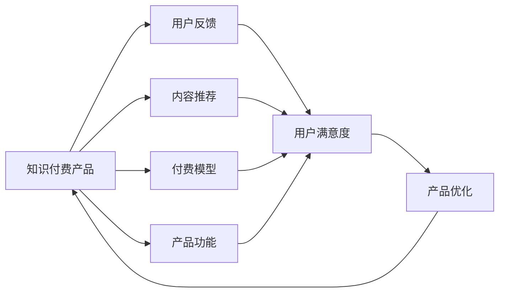
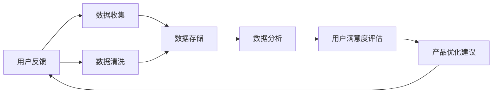
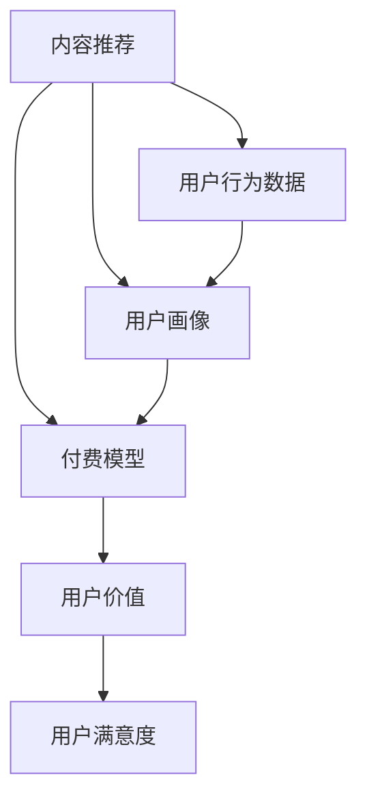
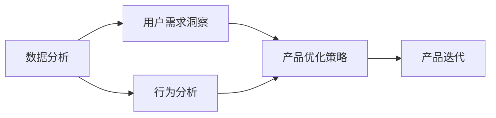
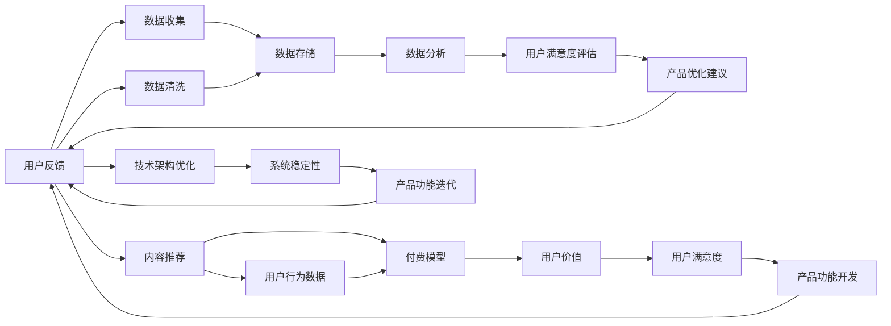

                 

# 知识付费赚钱的用户反馈收集与产品迭代

## 1. 背景介绍

### 1.1 问题由来
在数字经济时代，知识付费成为越来越多人获取优质内容的重要渠道。与传统的免费内容相比，知识付费产品的稀缺性和权威性，以及其提供的专业化服务，使其在教育、学习、职业成长等领域具备了巨大的市场需求。然而，随着知识付费市场规模的不断扩大，用户满意度、内容质量、产品体验等方面的问题也开始逐渐显现，知识付费产品的持续迭代和优化成为其能否长期吸引用户的关键。

### 1.2 问题核心关键点
1. **用户反馈的收集与分析**：了解用户需求、识别产品痛点、评估内容质量，是知识付费产品迭代的基础。
2. **产品功能的开发与优化**：根据用户反馈，针对性地开发和优化功能，提升用户体验和产品价值。
3. **内容生产的规划与调整**：分析用户行为，优化内容分发策略，提高内容的吸引力和转化率。
4. **付费模型的设计与调整**：设计合理的付费策略，平衡用户获取价值与平台收入，实现可持续发展。
5. **技术架构的构建与升级**：优化产品架构，提升系统的稳定性、可用性和扩展性，支持大规模用户和内容的承载。

### 1.3 问题研究意义
知识付费产品的成功运营，不仅依赖于高质量的内容生产，还需要通过用户反馈不断优化产品体验，实现用户价值与平台收益的双赢。用户反馈的及时收集和有效利用，可以帮助产品团队快速识别问题、调整策略，实现产品的持续迭代和升级。同时，合理的付费模型设计，可以有效吸引用户、提升内容消费，保持平台的可持续发展。

## 2. 核心概念与联系

### 2.1 核心概念概述

为更好地理解知识付费产品如何通过用户反馈进行迭代优化，本节将介绍几个密切相关的核心概念：

- **知识付费产品**：提供有价值的知识和信息，以付费形式获取服务的平台。
- **用户反馈**：用户在使用产品过程中提出的建议、意见和问题，是产品优化和改进的重要依据。
- **用户满意度**：用户在使用产品过程中获得的满足感和愉悦度，是衡量产品成功的重要指标。
- **内容推荐**：根据用户偏好和行为，推送相关内容，提升用户体验和产品粘性。
- **付费模型**：产品如何收费，以及如何激励用户付费，包括免费试用、订阅制、按需付费等多种形式。
- **产品功能**：产品提供的服务和功能，如课程学习、问题解答、社群互动等。
- **数据分析**：通过收集和分析用户数据，洞察用户需求和行为，指导产品决策。

这些核心概念之间的逻辑关系可以通过以下Mermaid流程图来展示：



这个流程图展示了一个典型的知识付费产品的运行流程：

1. 用户反馈从产品中收集。
2. 内容推荐系统根据用户行为和偏好推送相关内容。
3. 付费模型设计激励用户消费，同时维持平台收益。
4. 产品功能满足用户需求，提供多样化服务。
5. 用户满意度通过用户反馈和数据分析得到评估。
6. 产品优化团队根据用户反馈和满意度，迭代产品功能和内容推荐策略。

通过这个流程图，我们可以更清晰地理解知识付费产品如何通过用户反馈进行迭代优化，以提升用户体验和满意度。

### 2.2 概念间的关系

这些核心概念之间存在着紧密的联系，形成了知识付费产品用户反馈收集与产品迭代的完整生态系统。下面我们通过几个Mermaid流程图来展示这些概念之间的关系。

#### 2.2.1 用户反馈的收集与处理



这个流程图展示了用户反馈从数据收集到产品优化建议的全过程。用户反馈通过数据收集系统被整理，经过清洗和存储后，通过数据分析得到用户满意度的评估，最后形成产品优化建议，再次反馈到产品中。

#### 2.2.2 内容推荐与付费模型的关系



这个流程图展示了内容推荐和付费模型之间的关系。内容推荐系统根据用户行为数据和用户画像，推荐相关内容，从而提升用户满意度。同时，付费模型的设计也需考虑用户对内容的价值感知，通过合理的定价策略，激励用户付费。

#### 2.2.3 数据分析与产品优化的关系



这个流程图展示了数据分析与产品优化策略之间的关系。数据分析帮助产品团队洞察用户需求和行为，形成有针对性的产品优化策略，指导产品迭代。

### 2.3 核心概念的整体架构

最后，我们用一个综合的流程图来展示这些核心概念在大语言模型微调过程中的整体架构：



这个综合流程图展示了从用户反馈收集到产品功能迭代的完整流程。用户反馈通过数据收集、清洗和存储，经过数据分析得到用户满意度的评估，形成产品优化建议，再次反馈到产品中。同时，内容推荐和付费模型也需根据用户行为和价值进行调整。产品功能和架构的优化，进一步提升了系统的稳定性和用户体验。通过这个流程图，我们可以更全面地理解知识付费产品如何通过用户反馈进行持续优化，提升用户满意度和产品价值。

## 3. 核心算法原理 & 具体操作步骤
### 3.1 算法原理概述

知识付费产品的用户反馈收集与产品迭代，本质上是一个基于数据驱动的优化过程。其核心思想是：通过收集用户在使用产品过程中提出的反馈和意见，分析用户的满意度、行为数据和价值感知，识别产品存在的问题和不足，然后针对性地开发和优化产品功能和内容推荐策略，从而提升用户满意度和产品价值。

形式化地，假设知识付费产品的用户反馈数据为 $F=\{f_i\}_{i=1}^N$，其中 $f_i$ 为第 $i$ 个用户反馈。定义产品优化目标为 $O$，优化目标的损失函数为 $\mathcal{L}(O)$。优化目标是提升用户满意度，即最小化用户不满意度：

$$
\mathop{\arg\min}_{O} \mathcal{L}(O)
$$

通过梯度下降等优化算法，产品优化过程不断更新目标 $O$，最小化不满意度 $\mathcal{L}(O)$，使得产品优化策略 $O^*$ 逼近理想值，提升用户满意度和产品价值。

### 3.2 算法步骤详解

知识付费产品的用户反馈收集与产品迭代一般包括以下几个关键步骤：

**Step 1: 准备用户反馈数据**
- 设计用户反馈收集工具，收集用户在产品使用过程中的评价、意见和建议。
- 对收集到的反馈进行清洗和标注，确保数据的准确性和可用性。
- 将清洗后的反馈数据存储在数据仓库中，为后续分析和处理提供支持。

**Step 2: 分析用户满意度**
- 设计满意度评估指标，如用户评分、使用频率、内容消费等。
- 通过统计分析或机器学习模型，评估用户对产品的满意度。
- 识别用户反馈中提及的问题和痛点，形成用户需求洞察。

**Step 3: 分析用户行为数据**
- 收集用户在产品上的行为数据，如点击率、停留时间、购买行为等。
- 使用数据挖掘技术，分析用户的兴趣偏好和行为模式。
- 根据用户行为数据，生成用户画像，为内容推荐提供依据。

**Step 4: 设计产品优化策略**
- 根据用户需求洞察和行为分析结果，设计产品优化策略，如改进功能、调整定价、优化内容推荐等。
- 制定详细的优化计划，明确各优化任务的优先级和时间节点。
- 设计A/B测试方案，验证优化策略的效果。

**Step 5: 实施产品迭代**
- 根据优化计划，实施产品功能开发和内容推荐策略调整。
- 定期发布产品迭代更新，向用户展示改进效果。
- 持续收集用户反馈，进行下一轮的优化和迭代。

### 3.3 算法优缺点

知识付费产品的用户反馈收集与产品迭代方法具有以下优点：
1. 数据驱动：通过用户反馈和行为数据，可以客观地评估产品性能和用户需求，指导产品优化。
2. 快速迭代：通过A/B测试和快速反馈机制，可以及时调整策略，缩短产品优化周期。
3. 提升满意度：通过持续改进，提升用户满意度和产品价值，增强用户粘性和忠诚度。
4. 降低成本：通过优化产品功能，降低用户流失率，减少用户获取成本。

同时，该方法也存在一定的局限性：
1. 数据收集成本：高质量的数据收集和清洗成本较高，且用户反馈的获取和分析可能存在偏差。
2. 用户隐私问题：用户反馈和行为数据的收集和分析涉及用户隐私保护，需遵守相关法律法规。
3. 策略调整难度：产品优化策略的设计和实施需要跨部门协作，可能面临协调困难和资源限制。
4. 短期效果不确定：用户反馈和行为数据的变化可能存在短期波动，优化效果可能未能即时显现。

尽管存在这些局限性，但通过合理的策略和工具，知识付费产品可以有效地利用用户反馈，实现持续优化和迭代，提升用户体验和平台价值。

### 3.4 算法应用领域

知识付费产品的用户反馈收集与产品迭代方法，在教育、职业培训、技术支持等多个领域得到了广泛应用。例如：

- 在线教育平台：通过收集学生对课程内容、讲师讲授的反馈，优化课程设计、提升讲师质量，提高学生学习效果。
- 技术咨询公司：通过分析客户对技术支持服务的评价和反馈，优化服务流程、提升服务质量，增强客户满意度。
- 技术培训社区：通过收集用户对技术文章、代码分享、问答等内容的反馈，优化内容质量、提升用户体验，促进社区活跃度。

除了上述这些经典应用外，知识付费产品的用户反馈收集与产品迭代方法，也在不断拓展到更多领域，如健康管理、理财咨询、生活服务、法律咨询等，为各行各业提供数据驱动的优化支持。

## 4. 数学模型和公式 & 详细讲解 & 举例说明（备注：数学公式请使用latex格式，latex嵌入文中独立段落使用 $$，段落内使用 $)
### 4.1 数学模型构建

知识付费产品的用户反馈收集与产品迭代过程，可以建模为一个线性回归问题，目标是预测用户对产品的满意度。具体模型构建如下：

设用户反馈为 $F=\{f_i\}_{i=1}^N$，其中 $f_i$ 包括用户对产品功能的评价、内容质量的反馈、服务体验的意见等。定义满意度评估指标 $S$，如用户评分、使用频率、内容消费等。根据用户反馈 $F$ 和满意度评估指标 $S$，构建线性回归模型：

$$
S = \beta_0 + \sum_{i=1}^N \beta_i f_i + \epsilon
$$

其中，$\beta_0$ 为截距，$\beta_i$ 为第 $i$ 个特征的系数，$\epsilon$ 为误差项。

### 4.2 公式推导过程

以用户反馈中的评价和满意度评估指标为例，推导线性回归模型的参数估计公式：

设用户反馈评价为 $f_i=(x_{i1},x_{i2},...,x_{in})$，满意度评估指标为 $S=y_i$。则线性回归模型可表示为：

$$
y_i = \beta_0 + \sum_{j=1}^n \beta_j x_{ij} + \epsilon
$$

其中，$x_{ij}$ 为第 $i$ 个用户反馈的第 $j$ 个评价指标，$\epsilon$ 为误差项。

根据最小二乘法，求解参数 $\beta$ 的估计值，使得模型预测值与实际值之间的差异最小化：

$$
\hat{\beta} = \arg\min_{\beta} \sum_{i=1}^N (y_i - \hat{y}_i)^2
$$

其中，$\hat{y}_i$ 为模型预测值，$y_i$ 为实际值。

将模型应用于新的用户反馈数据 $f_i$，可以得到其满意度预测值 $\hat{S}$：

$$
\hat{S} = \hat{\beta}_0 + \sum_{j=1}^n \hat{\beta}_j x_{ij}
$$

通过上述过程，可以动态评估用户反馈，预测其满意度，为产品优化提供数据支持。

### 4.3 案例分析与讲解

以在线教育平台为例，分析如何通过用户反馈进行课程优化。

假设在线教育平台收集了学生对不同课程的评价数据，评价项包括课程难度、讲师讲授、内容质量等。满意度评估指标为学生的学习效果，如考试成绩、课后反馈等。通过线性回归模型，分析用户反馈与学习效果之间的关系：

$$
\text{学习效果} = \beta_0 + \beta_1 \text{课程难度} + \beta_2 \text{讲师讲授} + \beta_3 \text{内容质量} + \epsilon
$$

通过分析模型参数 $\beta_1, \beta_2, \beta_3$ 的值，可以识别出影响学生学习效果的因素。例如，如果 $\beta_2$ 的值较大，说明讲师讲授对学习效果的影响较大，平台可以重点提升讲师培训，提高课程质量。

## 5. 项目实践：代码实例和详细解释说明
### 5.1 开发环境搭建

在进行用户反馈收集与产品迭代实践前，我们需要准备好开发环境。以下是使用Python进行PyTorch开发的环境配置流程：

1. 安装Anaconda：从官网下载并安装Anaconda，用于创建独立的Python环境。

2. 创建并激活虚拟环境：
```bash
conda create -n pytorch-env python=3.8 
conda activate pytorch-env
```

3. 安装PyTorch：根据CUDA版本，从官网获取对应的安装命令。例如：
```bash
conda install pytorch torchvision torchaudio cudatoolkit=11.1 -c pytorch -c conda-forge
```

4. 安装Transformers库：
```bash
pip install transformers
```

5. 安装各类工具包：
```bash
pip install numpy pandas scikit-learn matplotlib tqdm jupyter notebook ipython
```

完成上述步骤后，即可在`pytorch-env`环境中开始实践。

### 5.2 源代码详细实现

下面我们以在线教育平台为例，给出使用Transformers库对模型进行线性回归的PyTorch代码实现。

首先，定义线性回归模型：

```python
import torch
import torch.nn as nn
from torch.utils.data import Dataset, DataLoader
import torch.optim as optim
import numpy as np

class LinearRegression(nn.Module):
    def __init__(self, input_dim):
        super(LinearRegression, self).__init__()
        self.linear = nn.Linear(input_dim, 1)

    def forward(self, x):
        out = self.linear(x)
        return out
```

然后，准备数据集：

```python
class LinearRegressionDataset(Dataset):
    def __init__(self, data, targets):
        self.data = torch.tensor(data, dtype=torch.float32)
        self.targets = torch.tensor(targets, dtype=torch.float32)

    def __len__(self):
        return len(self.data)

    def __getitem__(self, idx):
        return self.data[idx], self.targets[idx]

# 准备数据
data = np.array([[2, 5, 1], [3, 6, 2], [4, 7, 3], [5, 8, 4]])
targets = np.array([1, 1, 1, 1])
dataset = LinearRegressionDataset(data, targets)
dataloader = DataLoader(dataset, batch_size=4, shuffle=True)
```

接着，定义优化器和损失函数：

```python
model = LinearRegression(input_dim=3)
optimizer = optim.SGD(model.parameters(), lr=0.01)
criterion = nn.MSELoss()

for epoch in range(500):
    for data, targets in dataloader:
        optimizer.zero_grad()
        outputs = model(data)
        loss = criterion(outputs, targets)
        loss.backward()
        optimizer.step()
    print(f'Epoch {epoch+1}, loss: {loss.item()}')
```

最后，运行模型并输出结果：

```python
print('模型预测结果：', model(data))
```

以上就是使用PyTorch对模型进行线性回归的完整代码实现。可以看到，通过简单的线性回归模型，我们可以根据用户反馈数据，预测其满意度，为产品优化提供数据支持。

### 5.3 代码解读与分析

让我们再详细解读一下关键代码的实现细节：

**LinearRegression类**：
- `__init__`方法：初始化线性回归模型，包含一个线性层。
- `forward`方法：前向传播，计算模型输出。

**LinearRegressionDataset类**：
- `__init__`方法：初始化数据集，包含输入数据和目标值。
- `__len__`方法：返回数据集大小。
- `__getitem__`方法：返回单个样本。

**数据准备和模型训练**：
- 使用Numpy创建模拟的数据集，包含输入数据和目标值。
- 定义数据集和数据加载器，设置批量大小和打乱方式。
- 创建线性回归模型、优化器和损失函数。
- 在每个epoch中，对数据集进行迭代，前向传播计算损失，反向传播更新模型参数，输出损失值。
- 通过训练，模型可以预测新的输入数据，并输出对应的满意度预测值。

**运行结果展示**：
- 训练完成后，模型可以预测新的输入数据，并输出满意度预测值。

可以看到，PyTorch配合Transformers库使得线性回归模型的训练过程变得简洁高效。开发者可以将更多精力放在数据处理、模型改进等高层逻辑上，而不必过多关注底层的实现细节。

当然，工业级的系统实现还需考虑更多因素，如模型的保存和部署、超参数的自动搜索、更灵活的任务适配层等。但核心的反馈收集与迭代范式基本与此类似。

## 6. 实际应用场景
### 6.1 智能客服系统

在线教育平台可以通过收集用户的反馈和评价，分析课程质量和讲师讲授的优劣，优化课程内容，提升用户满意度。同时，平台也可以利用反馈数据，优化客服系统的知识库和响应策略，提高问题解决效率，提升用户体验。

在技术实现上，可以部署智能客服系统，收集用户咨询和反馈，通过自然语言处理技术，理解用户意图，提供精准的解答。系统可以定期抽取客户咨询中的问题，反馈给课程开发团队，指导内容优化。

### 6.2 金融理财服务

金融理财平台可以通过收集用户对理财产品的评价和反馈，分析产品的市场表现和用户需求，优化产品设计和销售策略，提升用户满意度。同时，平台也可以利用反馈数据，优化金融分析模型，提供更精准的理财建议，提高用户粘性。

在技术实现上，可以部署理财服务机器人，收集用户对产品的评价和反馈，通过情感分析技术，评估用户情感倾向，识别用户需求。系统可以定期抽取用户反馈，反馈给产品开发团队，指导产品优化。

### 6.3 健康管理应用

健康管理应用可以通过收集用户对健康数据的反馈，分析用户的健康状况和行为模式，提供个性化的健康建议和干预措施，提升用户健康水平。同时，应用也可以利用反馈数据，优化健康数据分析模型，提高健康干预的效果，增强用户粘性。

在技术实现上，可以部署健康管理应用，收集用户健康数据的反馈，通过数据分析技术，评估用户健康状况和行为模式。系统可以定期抽取用户反馈，反馈给健康专家团队，指导健康干预措施的优化。

### 6.4 未来应用展望

随着用户反馈收集与产品迭代技术的不断发展，未来在更多领域将得到应用，为各行各业提供数据驱动的优化支持。

在智慧城市治理中，智能城市应用可以通过收集用户对城市服务的评价和反馈，优化城市管理和服务质量，提升用户满意度。在旅游服务中，旅游应用可以通过收集用户对旅游体验的评价和反馈，优化旅游线路和服务质量，提升用户满意度。

总之，用户反馈收集与产品迭代技术，将成为各行各业提升用户体验和产品价值的重要手段。随着技术的不断进步，未来的应用场景将更加丰富，涵盖更多的领域和场景。

## 7. 工具和资源推荐
### 7.1 学习资源推荐

为了帮助开发者系统掌握用户反馈收集与产品迭代的技术基础和实践技巧，这里推荐一些优质的学习资源：

1. 《数据科学实战》系列博文：由数据科学专家撰写，深入浅出地介绍了数据科学的基础知识和实践技能，涵盖数据收集、数据清洗、数据分析等多个环节。

2. 《Python数据科学手册》书籍：全面介绍了Python在数据科学中的应用，包括数据处理、数据分析、可视化等多个方面，适合Python初学者学习。

3. 《自然语言处理入门》课程：斯坦福大学开设的自然语言处理入门课程，涵盖了自然语言处理的基本概念和经典模型，适合NLP初学者学习。

4. 《深度学习框架实战》书籍：深入解析了目前流行的深度学习框架，如TensorFlow、PyTorch等，适合有一定编程基础的开发者学习。

5. Kaggle数据集和竞赛：Kaggle提供了丰富的数据集和竞赛平台，通过实践挑战，提升数据处理和模型优化能力，适合数据科学爱好者参与。

通过对这些资源的学习实践，相信你一定能够快速掌握用户反馈收集与产品迭代技术的精髓，并用于解决实际的NLP问题。

### 7.2 开发工具推荐

高效的开发离不开优秀的工具支持。以下是几款用于用户反馈收集与产品迭代开发的常用工具：

1. Jupyter Notebook：免费的开源笔记本环境，支持Python、R等多种编程语言，适合数据科学和机器学习项目。

2. TensorFlow：由Google主导开发的深度学习框架，支持分布式计算，适合大规模工程应用。

3. PyTorch：基于Python的开源深度学习框架，支持动态计算图，适合快速迭代研究。

4. Weights & Biases：模型训练的实验跟踪工具，可以记录和可视化模型训练过程中的各项指标，方便对比和调优。

5. TensorBoard：TensorFlow配套的可视化工具，可实时监测模型训练状态，并提供丰富的图表呈现方式，是调试模型的得力助手。

6. Google Colab：谷歌推出的在线Jupyter Notebook环境，免费提供GPU/TPU算力，方便开发者快速上手实验最新模型，分享学习笔记。

合理利用这些工具，可以显著提升用户反馈收集与产品迭代任务的开发效率，加快创新迭代的步伐。

### 7.3 相关论文推荐

用户反馈收集与产品迭代技术的发展源于学界的持续研究。以下是几篇奠基性的相关论文，推荐阅读：

1. A Survey on Data Collection Techniques in the era of Big Data: An A-Z of the World's Smartphone Cities（大数据时代数据收集技术综述）：总结了大数据时代数据收集的多种技术和方法，为数据科学实践提供了理论基础。

2. Machine Learning and Data Mining Techniques in Healthcare: A Survey（医疗领域机器学习和数据挖掘技术综述）：综述了医疗领域机器学习和数据挖掘的应用，为医疗健康领域的数据科学实践提供了指导。

3. Social Media Sentiment Analysis: Methods, Challenges, and Opportunities（社交媒体情感分析：方法、挑战与机会）：介绍了社交媒体情感分析的多种方法和应用场景，为社交媒体数据科学实践提供了理论支持。

4. Data Collection, Cleaning, and Preprocessing Techniques in Python（Python数据收集、清洗和预处理技术）：介绍了Python数据科学的基础技术和方法，适合Python初学者学习。

5. Natural Language Processing with Transformers: Understanding, Transforming, and Generating Language（使用Transformer进行自然语言处理：理解、转换和生成语言）：介绍了Transformer在自然语言处理中的应用，为NLP领域的数据科学实践提供了技术支持。

这些论文代表了大语言模型微调技术的发展脉络。通过学习这些前沿成果，可以帮助研究者把握学科前进方向，激发更多的创新灵感。

除上述资源外，还有一些值得关注的前沿资源，帮助开发者紧跟用户反馈收集与产品迭代技术的最新进展，例如：

1. arXiv论文预印本：人工智能领域最新研究成果的发布平台，包括大量尚未发表的前沿工作，学习前沿技术的必读资源。

2. 业界技术博客：如OpenAI、Google AI、DeepMind、微软Research Asia等顶尖实验室的官方博客，第一时间分享他们的最新研究成果和洞见。

3. 技术

