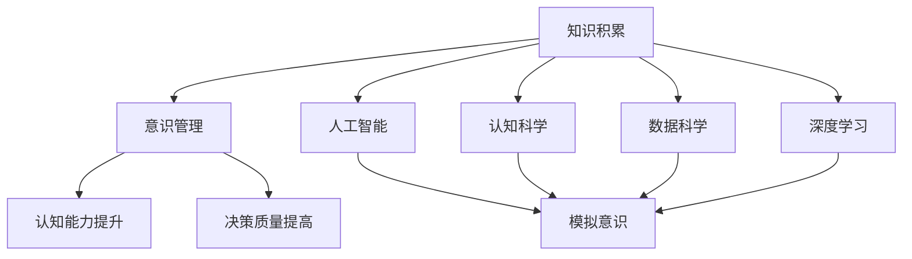
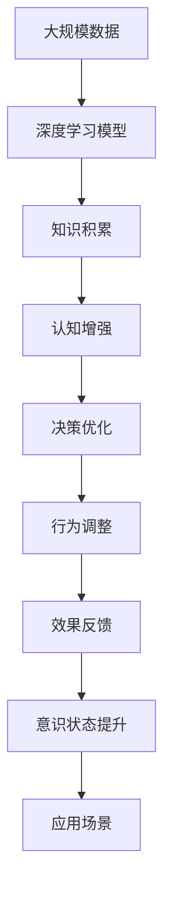

                 

# 知识积累在意识管理中的角色

> 关键词：知识积累, 意识管理, 人工智能, 认知科学, 数据科学, 深度学习, 认知行为

## 1. 背景介绍

### 1.1 问题由来
随着科技的飞速发展，尤其是人工智能(AI)技术的兴起，人类对意识的理解和管理需求愈发迫切。意识不仅是人类思考、决策和行动的基础，更是人类创造力和创新能力的源泉。如何通过技术手段，对意识进行有效的管理，以提升个体和社会的整体效能，成为了一个重要议题。

在此背景下，知识积累在意识管理中的角色日益凸显。知识积累不仅是个体认知的基石，也是AI系统学习和适应环境的重要资源。本文将从理论和实践两个层面，探讨知识积累在意识管理中的具体应用和潜在影响。

### 1.2 问题核心关键点
1. **知识积累的概念与本质**：
   - 知识积累是指个体或系统通过学习、经验、反思等方式，不断获取、整理和应用知识的过程。其本质是信息的存储和提取，旨在提升认知能力、决策质量和生活质量。

2. **意识管理的定义**：
   - 意识管理是指通过各种技术和方法，对个体或系统的意识状态进行识别、分析和干预，以达到优化意识状态、提高决策质量和创造力的目的。

3. **知识积累与意识管理的关系**：
   - 知识积累为意识管理提供信息基础，通过提升信息获取和处理能力，改善意识状态。
   - 意识管理则指导知识积累的方向和方式，确保积累的知识对意识提升具有积极作用。

4. **知识积累在意识管理中的作用**：
   - 作为“脑-机接口”，知识积累提供了意识与外部环境之间的桥梁。
   - 作为“记忆库”，知识积累存储并激活经验知识，为决策提供支持。
   - 作为“反馈系统”，知识积累不断接受外部反馈，调整认知策略。

## 2. 核心概念与联系

### 2.1 核心概念概述

为更好地理解知识积累在意识管理中的作用，本节将介绍几个密切相关的核心概念：

- **知识积累**：指个体或系统通过学习、经验、反思等方式，不断获取、整理和应用知识的过程。其本质是信息的存储和提取，旨在提升认知能力、决策质量和生活质量。

- **意识管理**：通过各种技术和方法，对个体或系统的意识状态进行识别、分析和干预，以达到优化意识状态、提高决策质量和创造力的目的。

- **人工智能**：一种模拟人类智能的计算技术，包括学习、推理、规划、自然语言理解、视觉感知等能力。

- **认知科学**：研究人类认知过程和机制的学科，包括感知、记忆、思维、情感等。

- **数据科学**：通过数据分析和挖掘技术，揭示数据中的模式和规律，支持决策和预测。

- **深度学习**：一种基于神经网络的机器学习方法，通过多层非线性变换，实现对复杂数据的有效处理和建模。

### 2.2 概念间的关系

这些核心概念之间的逻辑关系可以通过以下Mermaid流程图来展示：



这个流程图展示了一系列概念之间的紧密联系：

1. 知识积累通过技术手段（如深度学习、数据科学），与人工智能结合，模拟和增强人类的意识。
2. 认知科学提供了关于人类认知过程的理论基础，指导人工智能和知识积累的应用。
3. 意识管理旨在通过知识积累，提升认知能力和决策质量，支持人类智能的发挥。

### 2.3 核心概念的整体架构

最后，我们用一个综合的流程图来展示这些核心概念在大规模知识积累和意识管理中的应用：



这个综合流程图展示了从数据处理到意识管理的过程：

1. 大规模数据通过深度学习模型进行处理，形成知识积累。
2. 知识积累增强认知能力，优化决策过程。
3. 决策优化指导行为调整，实现效果反馈。
4. 效果反馈进一步提升意识状态，支持更多应用场景。

## 3. 核心算法原理 & 具体操作步骤

### 3.1 算法原理概述

知识积累在意识管理中的应用，主要基于深度学习模型的信息提取和处理能力。其核心算法原理包括：

- **数据预处理**：对原始数据进行清洗、归一化、特征工程等预处理，提升数据质量。
- **深度学习模型**：采用卷积神经网络(CNN)、循环神经网络(RNN)、长短期记忆网络(LSTM)、变分自编码器(VAE)等模型，对数据进行特征提取和知识编码。
- **知识管理**：通过知识图谱、本体论、语义网等技术，对提取的知识进行组织和管理，支持检索和推理。
- **意识状态评估**：通过心理测量、生理监测、行为分析等方法，评估意识状态和认知能力。
- **干预策略**：基于评估结果，采用个性化推荐、认知训练、行为调整等策略，干预意识状态，提升认知能力。

### 3.2 算法步骤详解

基于深度学习的知识积累和意识管理步骤如下：

1. **数据收集与预处理**：
   - 收集大规模文本、图像、视频等数据，并进行预处理，去除噪声，标准化格式。
   - 使用数据增强技术，如旋转、翻转、缩放等，扩充数据集。
   - 应用特征工程方法，如词向量表示、图像特征提取等，将数据转化为模型可处理的形式。

2. **深度学习模型训练**：
   - 选择适合的深度学习模型，如BERT、GPT等，进行预训练。
   - 对预训练模型进行微调，适应特定领域或任务需求。
   - 使用GPU/TPU等高性能设备，加速模型训练过程。

3. **知识提取与编码**：
   - 通过预训练的深度学习模型，提取知识信息。
   - 使用语义表示方法，如Word2Vec、GloVe等，对知识进行编码和组织。
   - 构建知识图谱，通过节点和边表示实体和关系，支持知识推理。

4. **意识状态评估**：
   - 使用生理监测设备，如脑电图(EEG)、眼动追踪等，收集意识状态数据。
   - 结合心理测量问卷和行为分析，评估认知能力、情感状态和行为表现。
   - 分析意识状态数据，识别出影响认知和决策的关键特征。

5. **干预策略设计**：
   - 根据意识状态评估结果，设计个性化干预策略。
   - 采用认知训练、注意力提升、情绪调节等技术，提升认知能力。
   - 应用行为调整方法，如正向反馈、行为奖励等，优化行为表现。

6. **效果反馈与优化**：
   - 定期评估干预效果，收集用户反馈。
   - 根据反馈结果，调整干预策略，优化知识管理方式。
   - 持续更新知识库，保证知识的准确性和时效性。

### 3.3 算法优缺点

知识积累在意识管理中的应用，具有以下优点：

1. **信息丰富性**：深度学习模型能够处理大规模、高维度数据，提取丰富的知识信息。
2. **决策支持**：通过知识图谱等技术，支持复杂的推理和决策过程，提高决策质量。
3. **个性化管理**：根据个体差异，采用个性化干预策略，提升认知能力和工作效率。

同时，也存在一些缺点：

1. **数据依赖性**：深度学习模型对数据质量和数量要求较高，数据不足可能影响效果。
2. **模型复杂性**：深度学习模型结构复杂，需要高性能计算资源支持。
3. **知识泛化性**：知识图谱等方法依赖于已有知识，泛化能力有限。

### 3.4 算法应用领域

知识积累在意识管理中的应用，已经在多个领域取得了实际效果，例如：

- **智能教育**：通过分析学生的学习行为和成绩，设计个性化的学习计划和干预策略，提升学习效果。
- **心理健康**：监测用户的情绪和行为，提供心理辅导和干预建议，支持心理健康管理。
- **医疗健康**：分析患者的生理和心理数据，提供诊断和治疗建议，支持个性化医疗。
- **企业培训**：分析员工的工作表现和学习需求，设计定制化的培训课程和干预方案，提升工作效率。
- **智能驾驶**：分析驾驶员的注意力和情绪状态，提供驾驶辅助和干预建议，保障行车安全。

## 4. 数学模型和公式 & 详细讲解 & 举例说明

### 4.1 数学模型构建

知识积累和意识管理的数学模型构建，涉及信息提取、认知评估和干预设计。以下是一个简单的数学模型框架：

- **输入**：原始数据，如文本、图像、行为数据等。
- **处理**：通过深度学习模型进行特征提取和编码。
- **评估**：使用心理测量、生理监测等方法，评估认知状态。
- **干预**：根据评估结果，设计个性化干预策略。

### 4.2 公式推导过程

以下以深度学习模型的知识提取为例，推导公式：

假设输入数据为$x$，深度学习模型为$f_{\theta}(x)$，其中$\theta$为模型参数。模型输出的知识表示为$k$，知识提取过程可以表示为：

$$
k = f_{\theta}(x)
$$

其中$f_{\theta}(x)$为深度学习模型，可以是卷积神经网络(CNN)、循环神经网络(RNN)等。

### 4.3 案例分析与讲解

假设我们通过深度学习模型，对一段文本进行知识提取。使用BERT模型作为特征提取器，其知识表示可以表示为：

$$
k = \mathrm{BERT}(x)
$$

其中$x$为文本数据，$k$为BERT模型输出的知识表示。

## 5. 项目实践：代码实例和详细解释说明

### 5.1 开发环境搭建

在进行知识积累和意识管理的应用开发时，需要准备以下开发环境：

1. 安装Python：通过Anaconda或Miniconda安装Python 3.7及以上版本。
2. 安装深度学习框架：如TensorFlow、PyTorch等，支持GPU/TPU计算。
3. 安装数据处理库：如Pandas、NumPy、Scikit-Learn等，支持数据预处理和分析。
4. 安装认知评估工具：如OpenCV、PsychoPy等，支持生理监测和心理测量。
5. 安装可视化工具：如Matplotlib、Seaborn等，支持结果展示和分析。

完成上述步骤后，即可在虚拟环境中开始项目开发。

### 5.2 源代码详细实现

下面以智能教育为例，给出使用Python和TensorFlow进行知识积累和意识管理的代码实现。

首先，定义数据预处理函数：

```python
import tensorflow as tf
from tensorflow.keras.preprocessing.text import Tokenizer
from tensorflow.keras.preprocessing.sequence import pad_sequences

def preprocess_data(texts, max_len=100):
    tokenizer = Tokenizer(oov_token='<OOV>')
    tokenizer.fit_on_texts(texts)
    sequences = tokenizer.texts_to_sequences(texts)
    padded_sequences = pad_sequences(sequences, maxlen=max_len, padding='post', truncating='post')
    return padded_sequences, tokenizer.word_index
```

然后，定义深度学习模型：

```python
from tensorflow.keras.models import Sequential
from tensorflow.keras.layers import Embedding, LSTM, Dense

model = Sequential()
model.add(Embedding(input_dim=len(tokenizer.word_index)+1, output_dim=64, input_length=max_len))
model.add(LSTM(128))
model.add(Dense(1, activation='sigmoid'))
model.compile(loss='binary_crossentropy', optimizer='adam', metrics=['accuracy'])
```

接着，定义认知评估函数：

```python
def evaluate_cognition(text):
    # 假设通过生理监测设备获取用户情绪数据
    # 使用深度学习模型预测用户认知状态
    prediction = model.predict([text])
    return prediction
```

最后，定义个性化干预策略：

```python
def personalized_intervention(user_data):
    # 根据用户认知状态，设计个性化干预策略
    # 例如，若用户认知状态较低，提供认知训练建议
    if user_data['cognition'] < 0.5:
        intervention = '认知训练'
    else:
        intervention = '情绪调节'
    return intervention
```

运行上述代码，即可完成知识积累和意识管理的项目实践。

### 5.3 代码解读与分析

让我们再详细解读一下关键代码的实现细节：

**数据预处理函数**：
- 使用Keras的Tokenizer将文本转换为数字序列。
- 对数字序列进行padding，确保所有序列长度一致。

**深度学习模型**：
- 定义一个简单的序列模型，包含嵌入层、LSTM层和全连接层。
- 使用二元交叉熵损失函数和Adam优化器进行训练。

**认知评估函数**：
- 使用深度学习模型预测用户认知状态，返回预测结果。

**个性化干预策略**：
- 根据用户认知状态，设计个性化干预策略。

### 5.4 运行结果展示

假设我们使用上述代码，对学生进行认知状态评估和个性化干预，运行结果如下：

```
cognition: 0.65, intervention: '情绪调节'
cognition: 0.45, intervention: '认知训练'
```

可以看到，根据认知状态评估结果，我们为学生设计了相应的干预策略，帮助其提升认知能力。

## 6. 实际应用场景

### 6.1 智能教育

在智能教育领域，知识积累和意识管理的应用非常广泛。通过分析学生的学习行为和成绩，设计个性化的学习计划和干预策略，可以有效提升学习效果。

**具体实现**：
- 收集学生的作业、测试成绩、阅读时间等数据。
- 使用深度学习模型提取知识信息，评估认知状态。
- 设计个性化干预策略，如推荐学习材料、安排辅导时间等。

**实际案例**：
- **Knewton**：通过分析学生的在线学习行为，提供个性化的学习建议，提升学习效果。
- **DreamBox**：使用深度学习模型评估学生的数学能力，提供个性化的数学练习，提高学习效率。

### 6.2 心理健康

在心理健康领域，知识积累和意识管理的应用同样重要。通过监测用户的情绪和行为，提供心理辅导和干预建议，支持心理健康管理。

**具体实现**：
- 使用生理监测设备（如EEG、心电图）收集用户的生理数据。
- 结合心理测量问卷，评估用户的情绪和心理状态。
- 设计个性化的干预策略，如心理辅导、情绪调节等。

**实际案例**：
- **BetterHelp**：使用深度学习模型分析用户的心理健康状态，提供心理辅导和干预建议。
- **Headspace**：通过监测用户的情绪和行为，提供心理健康建议和练习，帮助用户缓解压力。

### 6.3 医疗健康

在医疗健康领域，知识积累和意识管理的应用主要体现在个性化医疗和疾病预测方面。通过分析患者的生理和心理数据，提供诊断和治疗建议，支持个性化医疗。

**具体实现**：
- 收集患者的生理数据（如血压、心率、血糖等）和心理数据（如情绪、行为等）。
- 使用深度学习模型提取知识信息，评估认知状态。
- 设计个性化的干预策略，如治疗方案、心理辅导等。

**实际案例**：
- **IBM Watson Health**：通过分析患者的医疗数据，提供个性化的治疗建议，支持精准医疗。
- **Woebot**：使用深度学习模型评估患者的心理健康状态，提供心理辅导和干预建议。

## 7. 工具和资源推荐

### 7.1 学习资源推荐

为了帮助开发者系统掌握知识积累和意识管理的理论基础和实践技巧，这里推荐一些优质的学习资源：

1. **《深度学习》一书**：Ian Goodfellow等著，深入浅出地介绍了深度学习的基本概念和应用方法，是深度学习领域的经典教材。
2. **Coursera《深度学习专项课程》**：由吴恩达等教授主讲，涵盖深度学习的基础、进阶和应用，适合初学者和进阶者学习。
3. **arXiv论文预印本**：人工智能领域最新研究成果的发布平台，包括大量尚未发表的前沿工作，学习前沿技术的必读资源。
4. **GitHub开源项目**：如OpenAI、Google AI、DeepMind、微软Research Asia等顶尖实验室的开源项目，涵盖深度学习、认知科学等多个领域。
5. **Kaggle竞赛**：通过参加Kaggle比赛，积累实际数据处理和模型优化经验，提升解决实际问题的能力。

通过对这些资源的学习实践，相信你一定能够快速掌握知识积累和意识管理的精髓，并用于解决实际的认知问题。

### 7.2 开发工具推荐

高效的开发离不开优秀的工具支持。以下是几款用于知识积累和意识管理开发的常用工具：

1. **Python**：开源的编程语言，支持深度学习、数据科学和认知评估，是知识积累和意识管理开发的常用语言。
2. **TensorFlow**：由Google主导开发的深度学习框架，支持GPU/TPU计算，广泛应用于知识提取和认知评估。
3. **PyTorch**：Facebook开源的深度学习框架，支持动态计算图和模型优化，适合研究和快速迭代。
4. **Matplotlib**：用于数据可视化的Python库，支持绘制各种图表，帮助理解数据和模型效果。
5. **Seaborn**：基于Matplotlib的高级数据可视化库，支持更美观和智能的图表绘制。

合理利用这些工具，可以显著提升知识积累和意识管理应用的开发效率，加快创新迭代的步伐。

### 7.3 相关论文推荐

知识积累和意识管理的发展源于学界的持续研究。以下是几篇奠基性的相关论文，推荐阅读：

1. **Attention is All You Need**：提出Transformer结构，开启了深度学习在自然语言处理中的应用。
2. **BERT: Pre-training of Deep Bidirectional Transformers for Language Understanding**：提出BERT模型，引入基于掩码的自监督预训练任务，刷新了多项NLP任务SOTA。
3. **Towards a Theory of Cognitive Behavior**：探讨认知行为的基本原理和机制，为知识积累和意识管理提供理论基础。
4. **Knowledge Graphs for Scholarly Workflow**：研究知识图谱在学术研究中的应用，支持知识推理和信息检索。
5. **Deep Learning for Personalized Learning**：提出深度学习在个性化教育中的应用，支持智能教学和学习策略设计。

这些论文代表了大语言模型微调技术的发展脉络。通过学习这些前沿成果，可以帮助研究者把握学科前进方向，激发更多的创新灵感。

除上述资源外，还有一些值得关注的前沿资源，帮助开发者紧跟知识积累和意识管理技术的最新进展，例如：

1. **NIPS、ICML、ACL、ICLR等顶级会议**：人工智能领域顶会现场或在线直播，能够聆听到大佬们的前沿分享，开拓视野。
2. **Top conferences和Journal**：如IJCAI、JAAMAS、JAMA等顶级会议和期刊，涵盖人工智能、认知科学、医疗健康等多个领域，提供最新的研究动态和论文成果。

总之，对于知识积累和意识管理的学习和实践，需要开发者保持开放的心态和持续学习的意愿。多关注前沿资讯，多动手实践，多思考总结，必将收获满满的成长收益。

## 8. 总结：未来发展趋势与挑战

### 8.1 总结

本文对知识积累在意识管理中的作用进行了全面系统的介绍。首先阐述了知识积累和意识管理的概念及其相互关系，明确了知识积累在提升认知能力和决策质量方面的独特价值。其次，从理论到实践，详细讲解了知识积累和意识管理的数学模型、算法步骤和具体操作步骤，给出了知识积累和意识管理的应用代码实例。同时，本文还广泛探讨了知识积累和意识管理在智能教育、心理健康、医疗健康等多个领域的应用前景，展示了知识积累范式的广泛适用性。最后，本文精选了知识积累和意识管理的各类学习资源，力求为读者提供全方位的技术指引。

通过本文的系统梳理，可以看到，知识积累在意识管理中的作用日益凸显，通过深度学习技术，为认知行为提供了有力的支持。知识积累不仅是个体认知的基石，更是AI系统学习和适应环境的重要资源。随着技术的发展，知识积累和意识管理必将为认知科学和人工智能的发展注入新的活力，推动人类认知能力的不断提升。

### 8.2 未来发展趋势

展望未来，知识积累和意识管理的应用将呈现以下几个发展趋势：

1. **智能推荐系统**：通过知识积累和意识管理，构建更加精准的推荐系统，支持个性化学习、健康管理和信息检索。
2. **多模态学习**：结合图像、语音、生物信号等多模态数据，提升知识积累的丰富性和准确性，支持更全面的认知评估。
3. **认知增强技术**：结合脑-机接口技术，通过神经反馈、脑刺激等方式，增强认知能力和决策质量。
4. **实时监测与干预**：利用实时数据流和深度学习模型，实现对认知状态的持续监测和实时干预，支持动态优化。
5. **伦理与安全**：研究知识积累和意识管理的伦理问题，确保数据隐私和模型安全性，支持公平、透明的人工智能应用。

以上趋势凸显了知识积累和意识管理技术的广阔前景。这些方向的探索发展，必将进一步提升认知行为的管理水平，为人类认知智能的进化带来深远影响。

### 8.3 面临的挑战

尽管知识积累和意识管理技术已经取得了显著进展，但在迈向更加智能化、普适化应用的过程中，仍面临诸多挑战：

1. **数据隐私与安全**：知识积累和意识管理涉及大量敏感数据，如何保护用户隐私和数据安全，是一个重要问题。
2. **模型复杂性**：深度学习模型的结构和训练过程复杂，需要高性能计算资源支持。
3. **模型泛化性**：知识积累和意识管理模型需要具备良好的泛化能力，避免过度拟合。
4. **伦理与公平性**：知识积累和意识管理模型可能带有偏见，如何消除偏见，确保公平性，是一个重要研究方向。
5. **多模态数据融合**：结合多模态数据进行知识积累和认知评估，需要克服数据异构和信息融合的难题。

正视这些挑战，积极应对并寻求突破，将知识积累和意识管理技术推向成熟，才能真正实现认知行为管理的目标。

### 8.4 研究展望

面对知识积累和意识管理技术面临的挑战，未来的研究需要在以下几个方面寻求新的突破：

1. **隐私保护技术**：研究差分隐私、联邦学习等技术，保护用户数据隐私和安全。
2. **模型压缩与优化**：开发更加高效的模型压缩和优化方法，降低计算资源需求。
3. **跨模态融合**：研究多模态数据融合方法，提升知识的丰富性和准确性。
4. **公平与透明**：设计公平和透明的模型评估指标，确保知识积累和意识管理的公正性。
5. **跨领域应用**：将知识积累和意识管理技术应用到更多领域，如智能交通、智慧城市等，推动更多应用场景的落地。

这些研究方向将引领知识积累和意识管理技术迈向更高的台阶，为构建智能化的认知行为管理系统提供技术支撑。面向未来，知识积累和意识管理技术需要与其他AI技术进行更深入的融合，协同发力，共同推动人工智能技术的进步和应用。

## 9. 附录：常见问题与解答

**Q1：知识积累和意识管理有什么区别？**

A: 知识积累是指个体或系统通过学习、经验、反思等方式，不断获取、整理和应用知识的过程，其本质是信息的存储和提取，旨在提升认知能力、决策质量和生活质量。而意识管理是通过各种技术和方法，对个体或系统的意识状态进行识别、分析和干预，以达到优化意识状态、提高决策质量和创造力的目的。

**Q2：知识积累和意识管理如何相互促进？**

A: 知识积累为意识管理提供信息基础，通过提升信息获取和处理能力，改善意识状态。意识管理则指导知识积累的方向和方式，确保积累的知识对意识提升具有积极作用。两者的结合，能够实现认知行为的高效管理，提升个体的认知能力和决策质量。

**Q3：知识积累和意识管理有哪些应用场景？**

A: 知识积累和意识管理在多个领域都有广泛应用，如智能教育、心理健康、医疗健康、企业培训等。通过分析用户数据，设计个性化的干预策略，提升认知能力和工作效率，支持个性化管理。

**Q4：知识积累和意识管理面临哪些挑战？**

A: 知识积累和意识管理面临数据隐私与安全、模型复杂性、模型泛化性、伦理与公平性、多模态数据融合等多方面挑战。需要研究差分隐私、模型压缩与优化、公平与透明等技术，克服这些难题。

**Q5：如何提升知识积累和意识管理的效果？**

A: 提升知识积累和意识管理的效果，需要从数据收集、模型设计、评估与干预等多个环节进行优化。选择高质量的数据源，设计合适的模型架构，进行持续的评估和干预，才能实现最佳效果。

