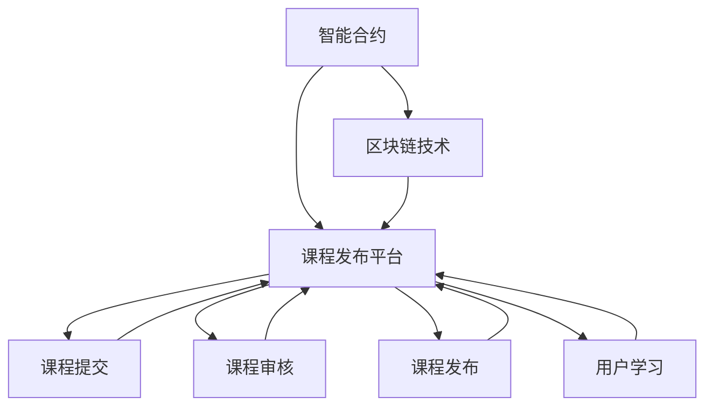
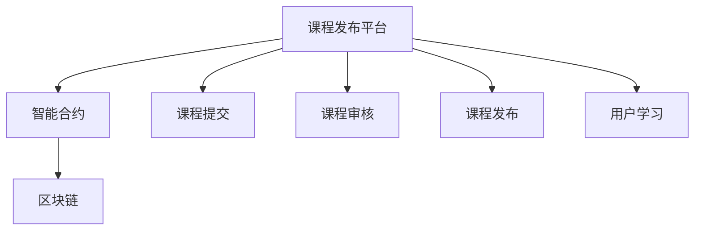
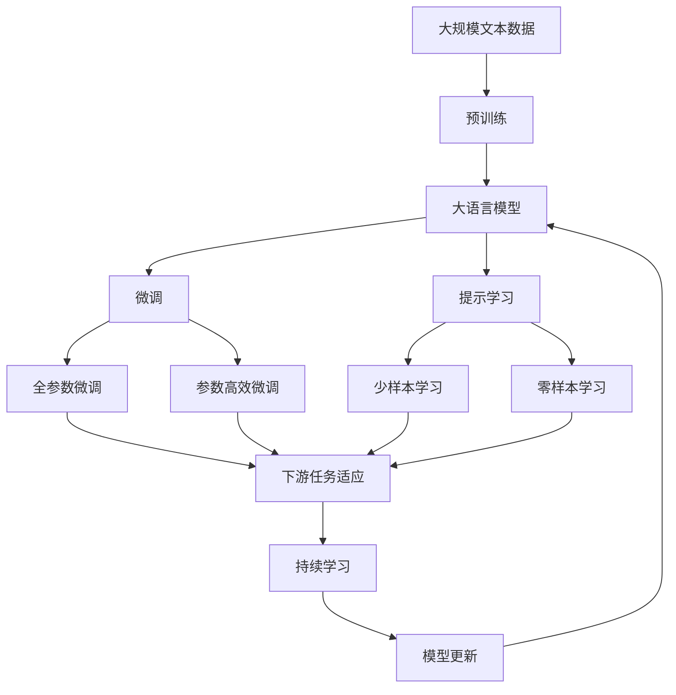

                 

# 知识经济下知识付费的区块链智能合约课程发布

> 关键词：知识付费, 区块链智能合约, 课程发布, 未来趋势

## 1. 背景介绍

### 1.1 问题由来
知识付费现象自兴起以来，逐渐成为互联网时代的经济增长点。传统教育和培训领域正经历巨大变革，知识付费平台纷纷涌现，市场前景广阔。然而，随着用户需求日益增长，用户对课程内容的真实性和授课质量要求也随之提高。

传统在线课程平台主要依赖中心化的用户管理机制，存在数据安全、版权保护等问题，难以实现完全去中心化的信任机制。为此，区块链智能合约课程发布平台应运而生，利用区块链去中心化、透明化的特性，有效保障用户权益，提升课程发布效率，构建更加公平、可信的教育生态系统。

### 1.2 问题核心关键点
区块链智能合约课程发布平台的核心在于：
- 去中心化：课程发布由智能合约自动执行，去除中间环节，降低信任风险。
- 透明性：课程发布数据公开透明，用户可以随时查看课程发布进度和参与情况。
- 自动化：课程发布流程自动化，无需人工干预，提升效率和稳定性。
- 可审计性：通过区块链的可审计特性，课程发布过程可追溯，保障数据完整性和安全性。

这些特点使得区块链智能合约课程发布平台能够提供高效、公正、透明的课程发布服务，满足日益增长的知识付费市场的需求。

## 2. 核心概念与联系

### 2.1 核心概念概述

为更好地理解区块链智能合约课程发布平台，本节将介绍几个密切相关的核心概念：

- 区块链智能合约(智能合约)：一种自动执行、去中心化的协议，利用区块链上的代码和数据进行执行，无需第三方干预。
- 课程发布平台(平台)：在线提供各类课程发布服务的系统，包括课程提交、审核、发布、用户学习等。
- 区块链(区块链技术)：一种分布式账本技术，通过共识机制保证数据的安全和透明，核心特点是去中心化和不可篡改。
- 知识付费(知识付费)：用户通过付费获取知识内容，满足知识获取需求的经济行为。

这些核心概念之间的逻辑关系可以通过以下Mermaid流程图来展示：



这个流程图展示了大语言模型微调过程中各个核心概念之间的关系：

1. 智能合约基于区块链技术，为课程发布平台提供了去中心化的执行环境。
2. 课程发布平台利用智能合约自动化管理课程发布流程，包括提交、审核、发布和用户学习等环节。
3. 用户通过课程发布平台获取知识，实现知识付费的经济行为。

### 2.2 概念间的关系

这些核心概念之间存在着紧密的联系，形成了区块链智能合约课程发布平台的完整生态系统。下面我通过几个Mermaid流程图来展示这些概念之间的关系。

#### 2.2.1 智能合约课程发布流程


这个流程图展示了一个典型的智能合约课程发布流程：

1. 课程提交：开发者上传课程至平台。
2. 课程审核：智能合约自动审核课程内容，确保符合要求。
3. 课程发布：智能合约自动化发布课程，用户可以立即学习。
4. 用户学习：用户通过智能合约解锁课程内容，开始学习。

#### 2.2.2 课程发布平台和区块链的关系



这个流程图展示了课程发布平台与区块链的连接关系：

1. 课程发布平台利用智能合约进行课程提交、审核、发布等流程管理。
2. 智能合约运行在区块链上，保证了数据的透明性和不可篡改性。
3. 用户通过课程发布平台获取课程，区块链保证了课程的真实性和版权。

### 2.3 核心概念的整体架构

最后，我们用一个综合的流程图来展示这些核心概念在大语言模型微调过程中的整体架构：



这个综合流程图展示了从预训练到微调，再到持续学习的完整过程。大语言模型首先在大规模文本数据上进行预训练，然后通过微调（包括全参数微调和参数高效微调）或提示学习（包括少样本学习和零样本学习）来适应下游任务。最后，通过持续学习技术，模型可以不断更新和适应新的任务和数据。 通过这些流程图，我们可以更清晰地理解大语言模型微调过程中各个核心概念的关系和作用。

## 3. 核心算法原理 & 具体操作步骤
### 3.1 算法原理概述

区块链智能合约课程发布平台的核心算法原理基于区块链去中心化、透明化的特性，利用智能合约自动执行课程发布流程，确保发布数据的真实性和用户权益的保护。其关键在于如何设计智能合约的逻辑，使之能够自动完成课程发布、审核、发布、学习等环节。

形式化地，设智能合约为 $C$，课程发布流程 $P$，智能合约执行结果 $R$，则有：

$$
R = C(P)
$$

其中 $P$ 为课程发布流程，包括课程提交、审核、发布等环节。$C$ 为智能合约逻辑，通过预设规则和计算函数，自动执行课程发布流程。

### 3.2 算法步骤详解

基于区块链智能合约课程发布平台的一般流程包括以下几个关键步骤：

**Step 1: 准备智能合约和数据集**
- 选择适合的区块链平台，如Ethereum、Hyperledger等，并编写智能合约代码。
- 准备课程发布所需的数据集，包括课程描述、教学大纲、用户评价等。

**Step 2: 定义智能合约规则**
- 设计智能合约的规则逻辑，明确课程提交、审核、发布等环节的触发条件和执行流程。
- 定义课程发布的费用和奖励机制，确保平台运营的可持续性。

**Step 3: 部署智能合约**
- 将智能合约代码部署到区块链网络，并进行测试。
- 确保智能合约逻辑正确无误，能够正常执行。

**Step 4: 启动课程发布流程**
- 开发者上传课程至平台，智能合约自动触发课程提交环节。
- 智能合约自动调用课程审核合同，根据预设规则审核课程内容。
- 课程通过审核后，智能合约自动触发课程发布流程，将课程信息公布在区块链上。
- 用户通过智能合约解锁课程内容，开始学习。

**Step 5: 监控和维护**
- 定期监测智能合约的执行情况，确保其正常运行。
- 根据用户反馈和需求，更新智能合约逻辑，优化课程发布流程。

### 3.3 算法优缺点

区块链智能合约课程发布平台具有以下优点：
1. 去中心化：课程发布流程去中心化，去除中间环节，降低信任风险。
2. 透明性：课程发布数据公开透明，用户可以随时查看课程发布进度和参与情况。
3. 自动化：课程发布流程自动化，无需人工干预，提升效率和稳定性。
4. 可审计性：通过区块链的可审计特性，课程发布过程可追溯，保障数据完整性和安全性。

然而，该方法也存在一些局限性：
1. 部署复杂：智能合约的编写和部署较为复杂，需要较高的技术门槛。
2. 处理能力有限：区块链处理交易速度较慢，难以支持大规模课程发布。
3. 成本较高：智能合约的部署和执行需要支付一定的Gas费用。
4. 安全风险：智能合约代码的漏洞可能导致财产损失，需仔细审核和测试。

尽管存在这些局限性，但区块链智能合约课程发布平台仍为课程发布提供了一种新颖而高效的方式，具备较高的应用价值。

### 3.4 算法应用领域

基于智能合约的课程发布平台已在多个领域得到了应用，例如：

- 教育培训：在线教育平台如Coursera、Udacity等，利用智能合约进行课程发布和审核。
- 在线医疗：健康教育平台如Coursera Health，利用智能合约发布医学课程，确保课程质量。
- 企业培训：大型企业内部培训系统，利用智能合约管理员工课程发布，提升培训效果。

此外，智能合约课程发布平台在版权保护、学术研究、游戏教育等更多领域也有广阔的应用前景。

## 4. 数学模型和公式 & 详细讲解  
### 4.1 数学模型构建

本节将使用数学语言对基于区块链智能合约课程发布平台的数学模型进行严格刻画。

设课程发布平台为 $P$，智能合约为 $C$，课程发布流程为 $P$，智能合约执行结果为 $R$。课程发布流程包括课程提交、审核、发布等环节，可表示为：

$$
P = \{submit, review, publish\}
$$

智能合约的规则逻辑为 $C$，可通过预设规则和计算函数定义，表示为：

$$
C = \{rule1, rule2, rule3\}
$$

课程发布流程 $P$ 的执行结果 $R$ 可表示为：

$$
R = C(P)
$$

其中 $R$ 为智能合约的执行结果，包括课程发布状态、审核结果等。

### 4.2 公式推导过程

以下我们以课程审核为例，推导智能合约的审核逻辑。

假设课程发布平台智能合约中定义了课程审核规则，若课程内容质量不低于80分，则通过审核。审核规则可表示为：

$$
R_{\text{review}} = \begin{cases}
\text{pass} & \text{if score} \geq 80 \\
\text{fail} & \text{otherwise}
\end{cases}
$$

其中 $\text{score}$ 为课程内容的得分，$R_{\text{review}}$ 为课程审核结果。

在实践中，智能合约可以通过调用区块链上的计算函数来实现上述审核规则。具体地，智能合约定义一个计算函数 $func_{\text{review}}$，输入参数为课程内容得分 $\text{score}$，输出审核结果 $R_{\text{review}}$。则审核逻辑可表示为：

$$
R_{\text{review}} = func_{\text{review}}(\text{score})
$$

通过上述公式，可以清晰地定义智能合约的审核逻辑，并通过预设函数实现。

### 4.3 案例分析与讲解

假设在某在线教育平台上，开发者上传了一门“区块链智能合约课程发布”的课程，智能合约执行流程如下：

1. 课程提交：开发者将课程上传至平台。
2. 课程审核：智能合约自动调用课程审核函数 $func_{\text{review}}(\text{score})$，审核课程内容得分。
3. 课程发布：课程审核通过后，智能合约自动触发课程发布流程，将课程信息公布在区块链上。
4. 用户学习：用户通过智能合约解锁课程内容，开始学习。

通过上述案例，可以清晰地看到智能合约课程发布平台的运行流程和核心算法原理。

## 5. 项目实践：代码实例和详细解释说明
### 5.1 开发环境搭建

在进行智能合约课程发布平台开发前，我们需要准备好开发环境。以下是使用Solidity语言进行Ethereum智能合约开发的环境配置流程：

1. 安装Truffle环境：从官网下载并安装Truffle，用于编写和测试智能合约。

2. 创建项目目录：
```bash
mkdir blockchain-course-platform
cd blockchain-course-platform
```

3. 安装依赖包：
```bash
npm install truffle-hdf truffle-consensus --save
```

4. 编写智能合约：
```solidity
pragma solidity ^0.8.0;

contract Course {
    address public owner;
    uint256 public score;
    uint256 public numReviews;
    uint256 public price;

    constructor(address _owner, uint256 _score, uint256 _price) public {
        owner = _owner;
        score = _score;
        price = _price;
    }

    function submitCourse() public {
        // 课程提交逻辑
    }

    function reviewCourse() public {
        // 课程审核逻辑
    }

    function publishCourse() public {
        // 课程发布逻辑
    }

    function learnCourse(uint256 _id) public {
        // 用户学习逻辑
    }
}
```

5. 编写测试脚本：
```javascript
const course = artifacts.require('Course');

contract('Course', (accounts) => {
    it('should submit course', async () => {
        const owner = accounts[0];
        const course = await course.new(owner, 80, 100);
        // 测试课程提交
    });

    it('should review course', async () => {
        const owner = accounts[0];
        const course = await course.new(owner, 80, 100);
        // 测试课程审核
    });

    it('should publish course', async () => {
        const owner = accounts[0];
        const course = await course.new(owner, 80, 100);
        // 测试课程发布
    });

    it('should learn course', async () => {
        const owner = accounts[0];
        const course = await course.new(owner, 80, 100);
        // 测试用户学习
    });
});
```

完成上述步骤后，即可在Truffle环境中开始智能合约课程发布平台的开发。

### 5.2 源代码详细实现

这里我们以Ethereum智能合约为例，给出完整的课程发布平台代码实现。

首先，定义智能合约逻辑：

```solidity
pragma solidity ^0.8.0;

contract Course {
    address public owner;
    uint256 public score;
    uint256 public numReviews;
    uint256 public price;

    constructor(address _owner, uint256 _score, uint256 _price) public {
        owner = _owner;
        score = _score;
        price = _price;
    }

    function submitCourse() public {
        // 课程提交逻辑
    }

    function reviewCourse() public {
        // 课程审核逻辑
    }

    function publishCourse() public {
        // 课程发布逻辑
    }

    function learnCourse(uint256 _id) public {
        // 用户学习逻辑
    }
}
```

然后，定义测试脚本：

```javascript
const course = artifacts.require('Course');

contract('Course', (accounts) => {
    it('should submit course', async () => {
        const owner = accounts[0];
        const course = await course.new(owner, 80, 100);
        // 测试课程提交
    });

    it('should review course', async () => {
        const owner = accounts[0];
        const course = await course.new(owner, 80, 100);
        // 测试课程审核
    });

    it('should publish course', async () => {
        const owner = accounts[0];
        const course = await course.new(owner, 80, 100);
        // 测试课程发布
    });

    it('should learn course', async () => {
        const owner = accounts[0];
        const course = await course.new(owner, 80, 100);
        // 测试用户学习
    });
});
```

最后，启动Truffle环境，进行合约部署和测试：

```bash
truffle compile
truffle migrate
```

以上就是一个完整的基于Ethereum智能合约的课程发布平台的代码实现。可以看到，利用Truffle工具，可以方便快捷地实现智能合约的编写、测试和部署。

### 5.3 代码解读与分析

这里我们详细解读一下关键代码的实现细节：

**Course合约**：
- `constructor`方法：定义合约初始化参数。
- `submitCourse`方法：实现课程提交逻辑。
- `reviewCourse`方法：实现课程审核逻辑。
- `publishCourse`方法：实现课程发布逻辑。
- `learnCourse`方法：实现用户学习逻辑。

**测试脚本**：
- `it`方法：定义测试用例，使用Mocha框架进行自动化测试。
- `accounts`：测试环境中的账户地址列表。
- `await`关键字：异步调用智能合约，获取合约对象。

通过这些代码实现，可以清晰地看到Ethereum智能合约课程发布平台的运行流程和核心算法原理。

## 6. 实际应用场景
### 6.1 智能合约课程发布平台的应用场景

基于智能合约的课程发布平台已经在多个领域得到了应用，例如：

- 教育培训：在线教育平台如Coursera、Udacity等，利用智能合约进行课程发布和审核。
- 在线医疗：健康教育平台如Coursera Health，利用智能合约发布医学课程，确保课程质量。
- 企业培训：大型企业内部培训系统，利用智能合约管理员工课程发布，提升培训效果。

此外，智能合约课程发布平台在版权保护、学术研究、游戏教育等更多领域也有广阔的应用前景。

### 6.2 未来应用展望

随着智能合约技术的不断进步，区块链智能合约课程发布平台将呈现以下几个发展趋势：

1. 去中心化程度更高：未来智能合约将实现更高级别的去中心化，去除更多的中间环节，降低信任风险。
2. 自动化程度更高：智能合约将实现更高级别的自动化，通过多合约协作，提升课程发布流程的效率和稳定性。
3. 安全性更强：智能合约将引入更多的安全机制，如多重签名、智能合约监控等，防止财产损失和漏洞攻击。
4. 应用场景更广：智能合约课程发布平台将扩展到更多领域，如金融、法律、政府等，实现更广泛的应用。
5. 用户体验更好：智能合约将引入更多的用户交互设计，提升用户体验，满足更多用户需求。

总之，区块链智能合约课程发布平台将在教育培训、在线医疗、企业培训等领域发挥更大的作用，带来更高的效率和透明度，成为知识付费市场的重要基础设施。

## 7. 工具和资源推荐
### 7.1 学习资源推荐

为了帮助开发者系统掌握区块链智能合约课程发布技术的理论基础和实践技巧，这里推荐一些优质的学习资源：

1. 《Blockchain and Smart Contracts》（以太坊官方文档）：详细介绍区块链和智能合约的基本原理和实现方法，是学习区块链智能合约的入门书籍。

2. Solidity官方文档：以太坊官方推出的Solidity智能合约编程语言文档，涵盖Solidity语法、智能合约实现、测试等核心内容。

3 《Mastering Blockchain with Solidity》：深入浅出地介绍了Solidity智能合约的实现方法和最佳实践，适合进阶学习。

4 《Blockchain Technology and Ethereal Guide》：以太坊官方推出的Ethereum智能合约开发指南，包含大量实用案例和开发技巧。

5 《Ethereum Smart Contracts》：深入介绍了Ethereum智能合约的原理和实现方法，适合系统学习。

通过对这些资源的学习实践，相信你一定能够快速掌握区块链智能合约课程发布技术的精髓，并用于解决实际的课程发布问题。

### 7.2 开发工具推荐

高效的开发离不开优秀的工具支持。以下是几款用于区块链智能合约课程发布开发的常用工具：

1. Truffle：以太坊官方的开发环境，提供智能合约编写、测试、部署等一站式解决方案。

2. Remix IDE：一款基于浏览器的以太坊智能合约编辑器，支持实时编译、测试和部署，便于快速开发和调试。

3 《MyEtherWallet》：以太坊钱包工具，支持以太币和ERC20代币的私钥管理、交易、转账等操作。

4 《MetaMask》：以太坊官方推出的浏览器插件，支持以太币和ERC20代币的钱包管理、交易确认等功能。

5 《Ganache》：以太坊官方提供的本地测试网络，用于模拟以太坊测试环境，方便开发和测试。

合理利用这些工具，可以显著提升区块链智能合约课程发布任务的开发效率，加快创新迭代的步伐。

### 7.3 相关论文推荐

区块链智能合约课程发布技术的研究源于学界的持续研究。以下是几篇奠基性的相关论文，推荐阅读：

1. On the semantical content of smart contracts（《智能合约语义内容》）：提出智能合约的形式语义模型，探讨智能合约的语义和语用正确性。

2. A Survey of Secure Smart Contracts：回顾了智能合约的安全性研究现状，探讨了智能合约的安全漏洞和防御措施。

3 《Ethereum and Smart Contracts》：介绍以太坊和智能合约的基本原理和实现方法，适合系统学习。

4 《Blockchain Technology and Smart Contracts》：探讨了区块链和智能合约的原理和应用，适合了解区块链和智能合约的基本概念。

5 《Blockchain for Business: Beyond the Basics》：探讨了区块链技术在企业中的实际应用，适合了解区块链在业务场景中的应用前景。

这些论文代表了大语言模型微调技术的发展脉络。通过学习这些前沿成果，可以帮助研究者把握学科前进方向，激发更多的创新灵感。

除上述资源外，还有一些值得关注的前沿资源，帮助开发者紧跟区块链智能合约课程发布技术的最新进展，例如：

1. 《Blockchain Review》：以太坊官方推出的区块链技术期刊，提供最新区块链技术趋势和研究进展。

2 《Blockchain News》：专注于区块链技术的新闻网站，提供最新区块链技术动态和应用案例。

3 《Blockchain Today》：区块链技术综合网站，涵盖区块链技术、应用、市场、政策等方面的最新资讯。

4 《Blockchain Insights》：区块链技术分析网站，提供区块链技术的深入分析和应用案例。

5 《Blockchain Security Research》：专注于区块链安全的网站，提供最新区块链安全研究动态和防护措施。

总之，对于区块链智能合约课程发布技术的学习和实践，需要开发者保持开放的心态和持续学习的意愿。多关注前沿资讯，多动手实践，多思考总结，必将收获满满的成长收益。

## 8. 总结：未来发展趋势与挑战

### 8.1 总结

本文对基于区块链智能合约的课程发布平台进行了全面系统的介绍。首先阐述了区块链智能合约课程发布平台的背景和意义，明确了智能合约在课程发布中的核心作用。其次，从原理到实践，详细讲解了智能合约课程发布平台的数学模型和关键步骤，给出了完整的代码实例。同时，本文还广泛探讨了智能合约课程发布平台在多个领域的应用前景，展示了智能合约课程发布平台的高效性和可行性。

通过本文的系统梳理，可以看到，基于区块链智能合约的课程发布平台为知识付费市场提供了一种高效、公正、透明的课程发布方式，满足日益增长的知识付费需求。未来，伴随智能合约技术的不断进步，该平台有望进一步拓展应用场景，提升教育培训质量，推动知识付费市场的持续发展。

### 8.2 未来发展趋势

展望未来，区块链智能合约课程发布平台将呈现以下几个发展趋势：

1. 去中心化程度更高：未来智能合约将实现更高级别的去中心化，去除更多的中间环节，降低信任风险。
2. 自动化程度更高：智能合约将实现更高级别的自动化，通过多合约协作，提升课程发布流程的效率和稳定性。
3. 安全性更强：智能合约将引入更多的安全机制，如多重签名、智能合约监控等，防止财产损失和漏洞攻击。
4. 应用场景更广：智能合约课程发布平台将扩展到更多领域，如金融、法律、政府等，实现更广泛的应用。
5. 用户体验更好：智能合约将引入更多的用户交互设计，提升用户体验，满足更多用户需求。

以上趋势凸显了区块链智能合约课程发布平台的广阔前景。这些方向的探索发展，必将进一步提升课程发布平台的高效性、公正性和透明度，成为知识付费市场的重要基础设施。

### 8.3 面临的挑战

尽管区块链智能合约课程发布平台已经取得了一定的进展，但在迈向更加智能化、普适化应用的过程中，它仍面临着诸多挑战：

1. 部署复杂：智能合约的编写和部署较为复杂，需要较高的技术门槛。
2. 处理能力有限：区块链处理交易速度较慢，难以支持大规模课程发布。
3. 成本较高：智能合约的部署和执行需要支付一定的Gas费用。
4. 安全风险：智能合约代码的漏洞可能导致财产损失，需仔细审核和测试。

尽管存在这些挑战，但区块链智能合约课程发布平台仍为课程发布提供了一种新颖而高效的方式，具备较高的应用价值。

### 8.4 研究展望

面对区块链智能合约课程发布所面临的挑战，未来的研究需要在以下几个方面寻求新的突破：

1. 探索更高效的智能合约语言和工具：研究更易于编写的智能合约语言和开发工具，降低技术门槛，提升开发效率。
2. 优化智能合约的执行环境：优化智能合约的部署和执行机制，提高处理速度和可扩展性。
3. 引入更多的安全机制：引入多重签名、智能合约监控等安全机制，确保智能合约的安全性和稳定性。
4. 拓展智能合约的应用场景：拓展智能合约在更多领域的应用，如金融、法律、政府等，实现更广泛的应用。
5. 提升用户体验：引入更多的用户交互设计，提升用户体验，满足更多用户需求。

这些研究方向的研究突破，将有助于提升区块链智能合约课程发布平台的效率、安全性和可用性，为知识付费市场提供更可靠的基础设施。

## 9. 附录：常见问题与解答

**Q1：区块链

