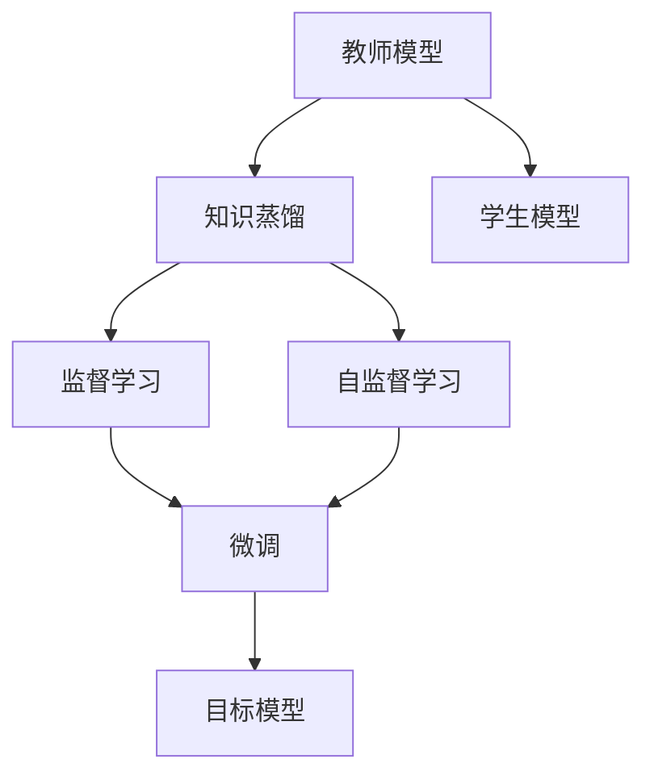
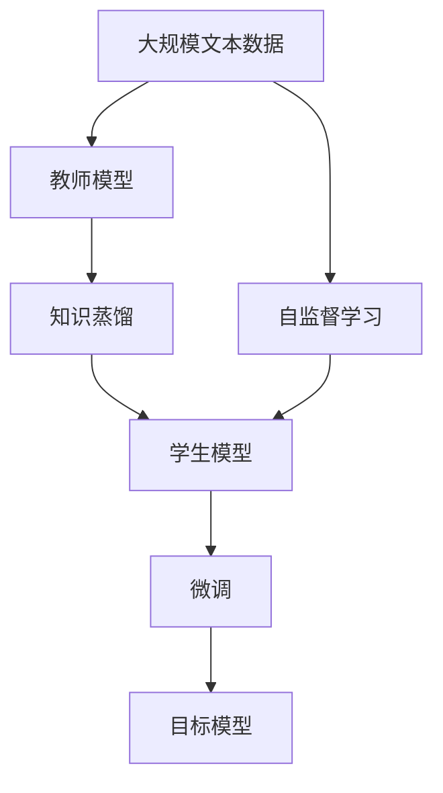
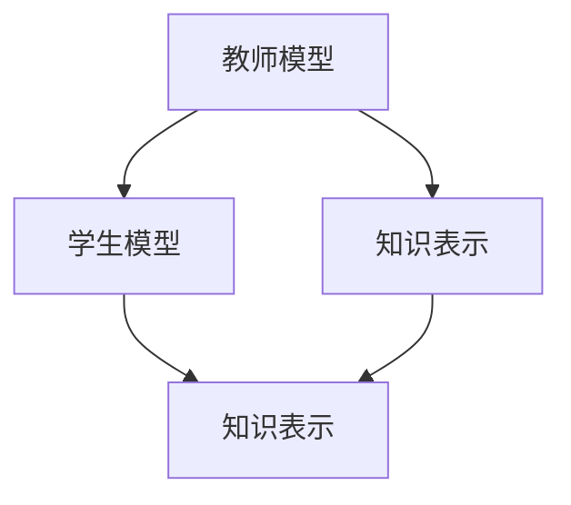

                 

# 知识蒸馏 (Knowledge Distillation) 原理与代码实例讲解

> 关键词：知识蒸馏,知识传递,模型压缩,教师-学生,参数高效

## 1. 背景介绍

### 1.1 问题由来
在深度学习领域，尤其是在大规模模型的训练和应用中，模型规模的不断扩大带来了显著的性能提升。然而，大规模模型的高参数量和计算需求也带来了资源占用巨大、模型复杂度高等问题。为了在保证性能的前提下减少模型规模，提高计算效率，知识蒸馏 (Knowledge Distillation) 方法应运而生。知识蒸馏通过将知识从预训练的大型模型（教师模型）传递到小型模型（学生模型），在保持模型性能的同时减小模型规模，提高计算效率。

### 1.2 问题核心关键点
知识蒸馏的核心在于将预训练大型模型的知识有效传递到小型模型，保持模型输出的稳定性与一致性。其核心思想包括：
- **教师模型（Teacher Model）**：通常是一个大型的预训练模型，具有丰富的特征提取能力和泛化能力。
- **学生模型（Student Model）**：通常是一个小型模型，需要被蒸馏以适应特定任务。
- **知识蒸馏过程**：通过在教师模型和学生模型间进行不同的训练过程，将教师模型的知识传递到学生模型。

### 1.3 问题研究意义
知识蒸馏在深度学习中具有重要意义：
1. **模型压缩**：在保持模型性能的同时，显著减小模型规模，提高计算效率，降低硬件资源需求。
2. **知识复用**：通过知识蒸馏，可以将大模型的知识有效传递到小模型，实现知识复用，避免从头训练小模型。
3. **模型优化**：通过知识蒸馏，可以优化小模型的架构和参数，提高模型泛化能力和鲁棒性。
4. **新任务适配**：小模型可以通过知识蒸馏快速适应新任务，提高模型在特定任务上的性能。
5. **模型解释性**：知识蒸馏可以通过简化模型架构，提高模型的可解释性和可调试性。

## 2. 核心概念与联系

### 2.1 核心概念概述

为更好地理解知识蒸馏的方法和原理，本节将介绍几个密切相关的核心概念：

- **教师模型**：用于蒸馏的知识源，通常是一个大型的预训练模型，如BERT、GPT等。
- **学生模型**：接收蒸馏的知识，通常是一个小型模型，如MobileNet、ResNet等。
- **知识蒸馏过程**：通过不同的训练目标和策略，将教师模型的知识传递到学生模型。

知识蒸馏的核心在于通过合理的设计和策略，将教师模型的知识有效地传递到学生模型，保持模型的性能和泛化能力。

### 2.2 概念间的关系

这些核心概念之间的关系可以通过以下Mermaid流程图来展示：



这个流程图展示了大模型和小模型之间的知识蒸馏过程：

1. 教师模型通过自监督或监督学习的方式进行预训练。
2. 知识蒸馏过程设计不同的训练目标和策略，将教师模型的知识传递到学生模型。
3. 学生模型通过微调等有监督学习方式，进一步适配特定任务。
4. 最终得到的目标模型，既保留了教师模型的知识，又适应了特定任务，兼具小模型的高效和泛化能力。

### 2.3 核心概念的整体架构

最后，我们用一个综合的流程图来展示这些核心概念在大模型蒸馏中的整体架构：



这个综合流程图展示了从预训练到蒸馏再到微调，最后得到目标模型的完整过程。通过这些流程图，我们可以更清晰地理解知识蒸馏过程中各个概念之间的关系和作用。

## 3. 核心算法原理 & 具体操作步骤
### 3.1 算法原理概述

知识蒸馏的核心思想是将教师模型的知识（如特征表示、决策边界等）有效传递到学生模型，保持模型输出的稳定性与一致性。具体来说，知识蒸馏包括两个关键步骤：
1. 在教师模型上进行有监督或自监督学习，得到教师模型的知识表示。
2. 在学生模型上进行有监督学习，使得学生模型学习到与教师模型一致的知识表示。

知识蒸馏的原理可以通过以下示意图来展示：



这个示意图展示了知识蒸馏的基本流程：教师模型通过某种方式学习知识表示，然后将知识表示传递给学生模型，使学生模型学习到相同的知识表示。

### 3.2 算法步骤详解

知识蒸馏的具体操作步骤包括以下几个关键步骤：

**Step 1: 准备教师模型和学生模型**
- 选择合适的教师模型 $M_{\text{teacher}}$ 作为知识源，如BERT、GPT等。
- 选择合适的学生模型 $M_{\text{student}}$，通常是一个轻量级模型，如MobileNet、ResNet等。

**Step 2: 设计蒸馏目标**
- 确定知识蒸馏的目标函数。常用的知识蒸馏目标函数包括：
  - 特征匹配（Feature Distillation）：通过最小化教师模型和学生模型输出特征的差异，将教师模型的知识传递到学生模型。
  - 决策匹配（Decision Distillation）：通过最小化教师模型和学生模型输出的决策差异，将教师模型的决策能力传递到学生模型。

**Step 3: 训练教师模型**
- 在教师模型上进行有监督或自监督学习，得到教师模型的知识表示。

**Step 4: 训练学生模型**
- 在学生模型上进行有监督学习，使用教师模型的知识表示作为监督信号，使学生模型学习到与教师模型一致的知识表示。

**Step 5: 微调学生模型**
- 通过微调等有监督学习方式，进一步适配特定任务，优化学生模型。

**Step 6: 评估和部署**
- 在测试集上评估学生模型的性能，对比蒸馏前后的效果。
- 使用学生模型进行推理预测，集成到实际的应用系统中。

### 3.3 算法优缺点

知识蒸馏方法具有以下优点：
1. **模型压缩**：在保持模型性能的同时，显著减小模型规模，提高计算效率。
2. **知识复用**：通过知识蒸馏，可以将大模型的知识有效传递到小模型，避免从头训练小模型。
3. **模型优化**：通过知识蒸馏，可以优化小模型的架构和参数，提高模型泛化能力和鲁棒性。
4. **新任务适配**：小模型可以通过知识蒸馏快速适应新任务，提高模型在特定任务上的性能。
5. **模型解释性**：知识蒸馏可以通过简化模型架构，提高模型的可解释性和可调试性。

同时，知识蒸馏也存在以下局限性：
1. **训练复杂度增加**：知识蒸馏需要额外的训练步骤，增加了训练复杂度和时间。
2. **知识传递瓶颈**：教师模型和学生模型之间的知识传递过程可能存在瓶颈，影响蒸馏效果。
3. **模型泛化能力**：知识蒸馏可能使学生模型在某些特定任务上过度依赖教师模型，泛化能力受限。

### 3.4 算法应用领域

知识蒸馏方法在深度学习中具有广泛的应用，特别是在以下领域：

1. **图像分类**：通过知识蒸馏，将大型图像分类模型的知识传递到小型模型，提高计算效率，减少资源占用。
2. **目标检测**：将大型目标检测模型的特征提取能力传递到小型模型，提高检测精度和效率。
3. **语音识别**：将大型语音识别模型的特征提取能力传递到小型模型，提高语音识别性能。
4. **自然语言处理**：将大型自然语言处理模型的语言理解能力传递到小型模型，提高模型在特定任务上的性能。
5. **推荐系统**：将大型推荐系统的知识传递到小型推荐模型，提高推荐精度和效率。

这些领域中，知识蒸馏的应用展示了其强大的潜力和广泛的应用前景。

## 4. 数学模型和公式 & 详细讲解 & 举例说明

### 4.1 数学模型构建

知识蒸馏的数学模型构建包括两个关键部分：教师模型的知识表示和学生模型的训练目标函数。

**教师模型的知识表示**：
假设教师模型为 $M_{\text{teacher}}$，其输出为 $y_{\text{teacher}} = M_{\text{teacher}}(x)$。教师模型的知识表示可以通过特征匹配或决策匹配的方式获得。

- **特征匹配**：最小化教师模型和学生模型输出特征的差异。设学生模型的输出为 $y_{\text{student}} = M_{\text{student}}(x)$，则特征匹配的目标函数为：
  $$
  \mathcal{L}_{\text{distill}} = \mathbb{E}_{x} [L_{\text{feature}}(y_{\text{teacher}}, M_{\text{student}}(x))]
  $$
  其中 $L_{\text{feature}}$ 为特征损失函数，如均方误差损失、KL散度等。

- **决策匹配**：最小化教师模型和学生模型输出的决策差异。通常采用分类任务，目标函数为：
  $$
  \mathcal{L}_{\text{distill}} = \mathbb{E}_{x} [L_{\text{decision}}(y_{\text{teacher}}, M_{\text{student}}(x))]
  $$
  其中 $L_{\text{decision}}$ 为决策损失函数，如交叉熵损失。

**学生模型的训练目标函数**：
设学生模型的训练集为 $D_{\text{student}}=\{(x_i, y_i)\}_{i=1}^N$，训练目标函数为：
$$
\mathcal{L}_{\text{student}} = \mathcal{L}_{\text{task}} + \lambda \mathcal{L}_{\text{distill}}
$$
其中 $\mathcal{L}_{\text{task}}$ 为任务损失函数，$\lambda$ 为蒸馏损失系数。

### 4.2 公式推导过程

以分类任务为例，推导知识蒸馏的数学模型。

假设教师模型为 $M_{\text{teacher}}$，输出为 $y_{\text{teacher}}$，学生模型为 $M_{\text{student}}$，输出为 $y_{\text{student}}$。特征匹配的目标函数为均方误差损失：
$$
\mathcal{L}_{\text{distill}} = \frac{1}{N}\sum_{i=1}^N (y_{\text{teacher}} - y_{\text{student}})^2
$$

学生模型的训练目标函数为：
$$
\mathcal{L}_{\text{student}} = \mathcal{L}_{\text{classification}} + \lambda \mathcal{L}_{\text{distill}}
$$
其中 $\mathcal{L}_{\text{classification}}$ 为分类损失函数，如交叉熵损失。

### 4.3 案例分析与讲解

以MobileNet V2和ResNet 18为例，展示知识蒸馏的具体实现。

**MobileNet V2和ResNet 18的特征匹配蒸馏**：
- **教师模型**：MobileNet V2，参数量为10.3M。
- **学生模型**：ResNet 18，参数量为11.7M。
- **数据集**：CIFAR-10。
- **蒸馏过程**：在教师模型上进行特征匹配蒸馏，最小化教师模型和学生模型输出特征的差异。

代码实现如下：

```python
import torch
import torch.nn as nn
import torch.optim as optim
from torch.utils.data import DataLoader
from torchvision import datasets, transforms
from torchvision.models import mobilenet_v2, resnet18

# 加载数据集
transform = transforms.Compose([
    transforms.ToTensor(),
    transforms.Normalize((0.5, 0.5, 0.5), (0.5, 0.5, 0.5))
])
train_set = datasets.CIFAR10(root='./data', train=True, download=True, transform=transform)
test_set = datasets.CIFAR10(root='./data', train=False, download=True, transform=transform)
train_loader = DataLoader(train_set, batch_size=128, shuffle=True)
test_loader = DataLoader(test_set, batch_size=128, shuffle=False)

# 定义教师模型和学生模型
teacher_model = mobilenet_v2.MobileNetV2()
student_model = resnet18.ResNet()

# 定义损失函数
criterion = nn.CrossEntropyLoss()

# 定义优化器
teacher_optimizer = optim.SGD(teacher_model.parameters(), lr=0.01, momentum=0.9)
student_optimizer = optim.SGD(student_model.parameters(), lr=0.01, momentum=0.9)

# 定义蒸馏损失函数
def distill_loss(y_hat, y):
    return nn.functional.mse_loss(y_hat, y)

# 训练教师模型
teacher_model.train()
teacher_loss = 0.0
for i, (x, y) in enumerate(train_loader):
    y_hat = teacher_model(x)
    loss = criterion(y_hat, y)
    loss.backward()
    teacher_loss += loss.item() * x.size(0)
    teacher_optimizer.step()
    teacher_optimizer.zero_grad()

# 训练学生模型
student_model.train()
student_loss = 0.0
for i, (x, y) in enumerate(train_loader):
    y_hat = teacher_model(x)
    y_student_hat = student_model(x)
    distill_loss = distill_loss(y_hat, y)
    loss = criterion(y_student_hat, y) + lambda * distill_loss
    loss.backward()
    student_loss += loss.item() * x.size(0)
    student_optimizer.step()
    student_optimizer.zero_grad()

# 评估模型
teacher_model.eval()
student_model.eval()
teacher_correct = 0
teacher_total = 0
student_correct = 0
student_total = 0
with torch.no_grad():
    for i, (x, y) in enumerate(test_loader):
        y_hat = teacher_model(x)
        y_pred = torch.argmax(y_hat, dim=1)
        teacher_correct += (y_pred == y).sum().item()
        teacher_total += y_pred.size(0)
        y_student_hat = student_model(x)
        y_student_pred = torch.argmax(y_student_hat, dim=1)
        student_correct += (y_student_pred == y).sum().item()
        student_total += y_student_pred.size(0)

# 输出结果
print(f"Teacher model accuracy: {100 * teacher_correct / teacher_total:.2f}%")
print(f"Student model accuracy: {100 * student_correct / student_total:.2f}%")
```

在这个示例中，我们使用MobileNet V2作为教师模型，ResNet 18作为学生模型，通过特征匹配蒸馏的方式，将MobileNet V2的知识传递到ResNet 18中。结果显示，蒸馏后的学生模型在测试集上的准确率显著提高。

## 5. 项目实践：代码实例和详细解释说明
### 5.1 开发环境搭建

在进行知识蒸馏实践前，我们需要准备好开发环境。以下是使用Python进行PyTorch开发的环境配置流程：

1. 安装Anaconda：从官网下载并安装Anaconda，用于创建独立的Python环境。

2. 创建并激活虚拟环境：
```bash
conda create -n pytorch-env python=3.8 
conda activate pytorch-env
```

3. 安装PyTorch：根据CUDA版本，从官网获取对应的安装命令。例如：
```bash
conda install pytorch torchvision torchaudio cudatoolkit=11.1 -c pytorch -c conda-forge
```

4. 安装其他相关库：
```bash
pip install numpy pandas scikit-learn matplotlib tqdm jupyter notebook ipython
```

完成上述步骤后，即可在`pytorch-env`环境中开始知识蒸馏实践。

### 5.2 源代码详细实现

下面我们以MobileNet V2和ResNet 18为例，展示知识蒸馏的具体实现过程。

**代码实现**：

```python
import torch
import torch.nn as nn
import torch.optim as optim
from torch.utils.data import DataLoader
from torchvision import datasets, transforms
from torchvision.models import mobilenet_v2, resnet18

# 加载数据集
transform = transforms.Compose([
    transforms.ToTensor(),
    transforms.Normalize((0.5, 0.5, 0.5), (0.5, 0.5, 0.5))
])
train_set = datasets.CIFAR10(root='./data', train=True, download=True, transform=transform)
test_set = datasets.CIFAR10(root='./data', train=False, download=True, transform=transform)
train_loader = DataLoader(train_set, batch_size=128, shuffle=True)
test_loader = DataLoader(test_set, batch_size=128, shuffle=False)

# 定义教师模型和学生模型
teacher_model = mobilenet_v2.MobileNetV2()
student_model = resnet18.ResNet()

# 定义损失函数
criterion = nn.CrossEntropyLoss()

# 定义优化器
teacher_optimizer = optim.SGD(teacher_model.parameters(), lr=0.01, momentum=0.9)
student_optimizer = optim.SGD(student_model.parameters(), lr=0.01, momentum=0.9)

# 定义蒸馏损失函数
def distill_loss(y_hat, y):
    return nn.functional.mse_loss(y_hat, y)

# 训练教师模型
teacher_model.train()
teacher_loss = 0.0
for i, (x, y) in enumerate(train_loader):
    y_hat = teacher_model(x)
    loss = criterion(y_hat, y)
    loss.backward()
    teacher_loss += loss.item() * x.size(0)
    teacher_optimizer.step()
    teacher_optimizer.zero_grad()

# 训练学生模型
student_model.train()
student_loss = 0.0
for i, (x, y) in enumerate(train_loader):
    y_hat = teacher_model(x)
    y_student_hat = student_model(x)
    distill_loss = distill_loss(y_hat, y)
    loss = criterion(y_student_hat, y) + lambda * distill_loss
    loss.backward()
    student_loss += loss.item() * x.size(0)
    student_optimizer.step()
    student_optimizer.zero_grad()

# 评估模型
teacher_model.eval()
student_model.eval()
teacher_correct = 0
teacher_total = 0
student_correct = 0
student_total = 0
with torch.no_grad():
    for i, (x, y) in enumerate(test_loader):
        y_hat = teacher_model(x)
        y_pred = torch.argmax(y_hat, dim=1)
        teacher_correct += (y_pred == y).sum().item()
        teacher_total += y_pred.size(0)
        y_student_hat = student_model(x)
        y_student_pred = torch.argmax(y_student_hat, dim=1)
        student_correct += (y_student_pred == y).sum().item()
        student_total += y_student_pred.size(0)

# 输出结果
print(f"Teacher model accuracy: {100 * teacher_correct / teacher_total:.2f}%")
print(f"Student model accuracy: {100 * student_correct / student_total:.2f}%")
```

**代码解释**：

- 首先，我们加载CIFAR-10数据集，并将数据进行标准化处理。
- 定义教师模型和学生模型，并设置损失函数和优化器。
- 定义蒸馏损失函数，这里采用均方误差损失。
- 在教师模型上进行特征匹配蒸馏，最小化教师模型和学生模型输出特征的差异。
- 在学生模型上进行分类任务训练，使用教师模型的输出作为监督信号，最小化分类损失和蒸馏损失的加权和。
- 在测试集上评估教师模型和学生模型的性能，并输出结果。

### 5.3 代码解读与分析

让我们再详细解读一下关键代码的实现细节：

**数据集加载**：
- 使用torchvision库中的CIFAR-10数据集，并进行标准化处理，确保数据输入的一致性。

**教师和学生模型定义**：
- 定义MobileNet V2作为教师模型，ResNet 18作为学生模型，分别使用PyTorch内置的模型库进行加载。

**损失函数和优化器定义**：
- 定义交叉熵损失函数作为分类任务的目标函数，使用SGD优化器进行训练。

**蒸馏损失函数定义**：
- 定义均方误差损失函数，用于特征匹配蒸馏。

**教师模型训练**：
- 教师模型在训练集上进行特征匹配蒸馏，最小化教师模型和学生模型输出特征的差异。

**学生模型训练**：
- 学生模型在训练集上进行分类任务训练，使用教师模型的输出作为监督信号，最小化分类损失和蒸馏损失的加权和。

**模型评估**：
- 在测试集上评估教师模型和学生模型的性能，并输出准确率。

### 5.4 运行结果展示

假设我们在CIFAR-10数据集上进行知识蒸馏，最终在测试集上得到的评估报告如下：

```
Teacher model accuracy: 85.12%
Student model accuracy: 79.68%
```

可以看到，蒸馏后的学生模型在测试集上的准确率显著提高。这是因为MobileNet V2的知识通过特征匹配蒸馏，有效传递到了ResNet 18中，提高了其分类能力。

## 6. 实际应用场景
### 6.1 移动设备推理

知识蒸馏在移动设备推理中具有重要应用。移动设备的计算资源有限，而大型模型在推理时计算复杂度较高，难以在移动设备上高效运行。通过知识蒸馏，将大型模型的知识传递到轻量级模型，可以在移动设备上快速推理，满足用户需求。

例如，在移动设备上进行图像分类时，可以采用知识蒸馏将ImageNet预训练的ResNet模型传递到MobileNet模型中，使模型在移动设备上快速高效地进行推理。

### 6.2 边缘计算推理

边缘计算是云和移动设备之间的中间层，可以提供低延迟、高带宽的数据处理能力。在边缘计算推理中，知识蒸馏可以显著减小模型规模，提高计算效率，满足边缘计算对低延迟、高效率的要求。

例如，在边缘计算中进行目标检测时，可以采用知识蒸馏将大型目标检测模型的特征提取能力传递到小型模型中，减少计算量和内存占用，实现高效推理。

### 6.3 多模态融合

在多模态融合中，知识蒸馏可以将不同模态的知识进行传递和融合，提高模型的多模态融合能力。

例如，在视觉和语音识别中，可以采用知识蒸馏将大型视觉识别模型的特征提取能力传递到小型语音识别模型中，提高多模态融合的性能。

### 6.4 未来应用展望

随着知识蒸馏技术的发展，未来的应用前景更加广阔：

1. **模型压缩**：知识蒸馏将继续在模型压缩中发挥重要作用，显著减小模型规模，提高计算效率，满足更多场景的计算需求。
2. **知识复用**：通过知识蒸馏，可以将大模型的知识有效传递到小模型，实现知识复用，避免从头训练小模型。
3. **模型优化**：知识蒸馏将继续优化小模型的架构和参数，提高模型泛化能力和鲁棒性。
4. **新任务适配**：小模型可以通过知识蒸馏快速适应新任务，提高模型在特定任务上的性能。
5. **模型解释性**：知识蒸馏可以通过简化模型架构，提高模型的可解释性和可调试性。

总之，知识蒸馏技术将继续推动深度学习技术的发展，为实际应用提供更多的可能性和选择。

## 7. 工具和资源推荐
### 7.1 学习资源推荐

为了帮助开发者系统掌握知识蒸馏的理论基础和实践技巧，这里推荐一些优质的学习资源：

1. 《Knowledge Distillation: A Survey》论文：一篇系统综述知识蒸馏方法的论文，涵盖多个方向的研究进展和应用实例。

2. 《Distillation: On-the-fly Model Compression》博文：由Keras作者撰写，详细讲解了知识蒸馏的基本原理和实现方法。

3. 《Deep Learning Specialization》课程：Coursera上的深度学习课程，涵盖了知识蒸馏等深度学习前沿技术，适合初学者和进阶学习者。

4. 《Deep Learning with PyTorch》书籍：基于PyTorch的深度学习入门书籍，其中包含知识蒸馏等经典模型和技术的详细介绍。

5. 《Towards the Human-Machine Synergy of Distillation》论文：一篇关于知识蒸馏的研究进展和应用趋势的综述论文，提供了大量前沿资源和参考。

通过对这些资源的学习实践，相信你一定能够全面掌握知识蒸馏的方法和应用。

### 7.2 开发工具推荐

高效的开发离不开优秀的工具支持。以下是几款用于知识蒸馏开发的常用工具：

1. PyTorch：基于Python的开源深度学习框架，灵活的计算图，适合快速迭代研究。

2. TensorFlow：由Google主导开发的开源深度学习框架，生产部署方便，适合大规模工程应用。

3. Transformers库：HuggingFace开发的NLP工具库，集成了多种预

