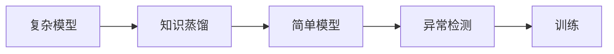
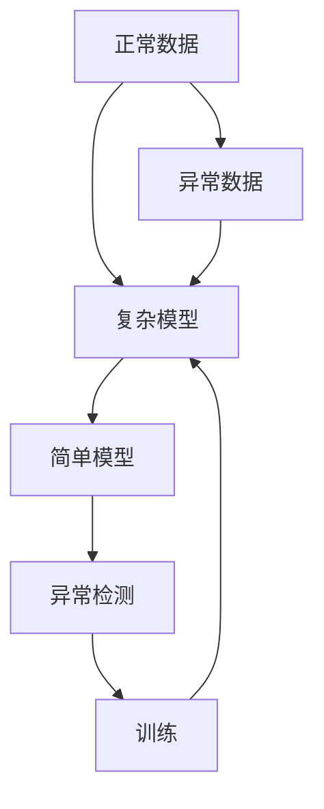

                 

# 知识蒸馏在异常检测任务中的应用

## 1. 背景介绍

### 1.1 问题由来

在数据驱动的机器学习中，异常检测（Anomaly Detection）是一项重要的任务。异常检测的目的是从大量正常数据中识别出异常数据，常用于网络安全、金融欺诈、设备故障检测等领域。传统方法如基于统计学的方法、聚类方法、基于规则的方法等存在不同程度的局限性。近年来，随着深度学习的迅猛发展，神经网络在异常检测中也逐渐成为主流。

神经网络在异常检测中的应用，通常包括以下几种方式：

- 训练一个分类器（如支持向量机、随机森林等），将其用于异常检测。这种方法需要大量的标注数据进行训练。
- 训练一个异常检测网络，直接从正常和异常的数据中学习。这种方法需要大量的正常和异常样本，而且训练时间较长。
- 训练一个分类网络，然后通过一些方法（如集成、重采样等）将其应用于异常检测。这种方法可以降低对标注数据的依赖，但模型复杂度较高。

而知识蒸馏（Knowledge Distillation）技术提供了一种更加有效的解决思路。

### 1.2 问题核心关键点

知识蒸馏是一种通过将知识从复杂模型（师）传递到简单模型（徒）的策略，以提高简单模型的性能。在异常检测任务中，知识蒸馏的基本思路是：

1. **复杂模型（师）**：训练一个强大的深度神经网络，能够从正常和异常数据中学习到丰富的异常特征。
2. **简单模型（徒）**：训练一个相对简单的深度神经网络，用于异常检测。
3. **知识传递**：通过某种方法，将复杂模型的知识传递给简单模型，使其也能够准确识别异常数据。

这个过程可以用以下三个步骤概括：

- 第一，在正常数据和异常数据上训练一个复杂模型。
- 第二，在复杂模型的预测结果上训练一个简单模型，使其能够学习复杂模型的知识。
- 第三，将简单模型应用于异常检测，从异常检测任务中学习新知识，进一步提高性能。

这种知识传递的方式，可以减少复杂模型训练的时间和资源消耗，同时利用复杂模型的知识提高简单模型的性能。

## 2. 核心概念与联系

### 2.1 核心概念概述

为更好地理解知识蒸馏在异常检测中的应用，本节将介绍几个关键概念：

- **知识蒸馏**：将复杂模型的知识（如特征提取、分类能力等）传递给简单模型的技术，提高简单模型的性能。
- **复杂模型**：具有较强特征提取和分类能力的深度神经网络，如深度神经网络（DNN）、卷积神经网络（CNN）等。
- **简单模型**：相对较轻量级的神经网络，如浅层神经网络、线性分类器等。
- **异常检测**：识别数据中的异常点的任务，常用于网络安全、金融欺诈、设备故障检测等领域。
- **噪声鲁棒性**：模型对噪声数据的鲁棒性，异常检测任务中，异常数据往往存在噪声。

### 2.2 概念间的关系

这些核心概念之间的关系可以通过以下Mermaid流程图来展示：



这个流程图展示了从复杂模型到简单模型再到异常检测的整体流程。复杂模型通过知识蒸馏将知识传递给简单模型，简单模型通过异常检测任务进一步学习新知识，从而提高模型性能。

### 2.3 核心概念的整体架构

最后，我们用一个综合的流程图来展示这些核心概念在大模型微调过程中的整体架构：



这个综合流程图展示了从正常和异常数据出发，通过复杂模型提取异常特征，再通过知识蒸馏将知识传递给简单模型，最后简单模型通过异常检测任务进一步学习新知识，从而提高模型性能的过程。

## 3. 核心算法原理 & 具体操作步骤

### 3.1 算法原理概述

知识蒸馏在异常检测中的应用，基本思路与一般知识蒸馏相似，但又有其特殊性。

在一般知识蒸馏中，师和徒都是分类模型。师能够对数据进行分类，从而输出概率分布，计算交叉熵等损失函数。而徒则需要根据师的输出进行训练，通过最小化损失函数来学习师的分类能力。

在异常检测中，师和徒模型通常是相同的深度神经网络，但师的训练数据中包含了正常和异常数据，而徒的训练数据只包含正常数据。师通过学习正常和异常数据的特征，可以输出一个异常得分（Anomaly Score），表示数据异常的可能性。徒则根据师的异常得分进行训练，学习如何识别异常数据。

### 3.2 算法步骤详解

知识蒸馏在异常检测中的应用，主要分为以下几个步骤：

**Step 1: 准备训练数据**

- 收集正常数据和异常数据，形成训练集。
- 将数据分为训练集和验证集。

**Step 2: 训练复杂模型**

- 在正常数据和异常数据上训练复杂模型。
- 将复杂模型的异常得分作为标签，训练简单模型。

**Step 3: 微调简单模型**

- 在正常数据上微调简单模型，使其更好地适应正常数据的特征。
- 在异常数据上微调简单模型，使其更好地识别异常数据。

**Step 4: 应用简单模型**

- 在实际异常检测任务中应用简单模型，进行异常检测。

**Step 5: 反馈调整**

- 根据异常检测任务的反馈结果，调整简单模型的参数，进一步提高性能。

### 3.3 算法优缺点

知识蒸馏在异常检测中的应用，有以下优点：

- 可以减少对标注数据的依赖，通过师的异常得分训练徒模型，无需对异常数据进行标注。
- 可以降低复杂模型的训练时间和计算资源消耗，通过微调简单模型来提高异常检测的性能。
- 可以提高简单模型的噪声鲁棒性，通过学习师的异常得分，简单模型可以更好地应对异常数据中的噪声。

同时，知识蒸馏在异常检测中也有以下缺点：

- 需要师模型具有较强的异常特征提取能力，否则无法有效地将知识传递给徒模型。
- 师模型的复杂度需要适中，否则训练时间和计算资源消耗较高。
- 简单模型的学习能力有限，需要仔细设计异常得分的计算方式。

### 3.4 算法应用领域

知识蒸馏在异常检测中的应用，主要包括以下几个领域：

- **网络安全**：用于检测恶意软件、网络攻击等异常行为。
- **金融欺诈**：用于检测信用卡欺诈、金融交易异常等。
- **设备故障检测**：用于检测工业设备故障、传感器数据异常等。
- **生物医学**：用于检测异常细胞、基因突变等。

## 4. 数学模型和公式 & 详细讲解 & 举例说明

### 4.1 数学模型构建

在异常检测任务中，知识蒸馏的数学模型构建与一般知识蒸馏类似。我们以异常得分为目标，构建损失函数。

假设复杂模型为 $M_{\text{complex}}$，简单模型为 $M_{\text{simple}}$，师模型的异常得分为 $S_{\text{complex}}$，徒模型的异常得分为 $S_{\text{simple}}$。

定义损失函数 $\mathcal{L}_{\text{teacher}}$ 为师模型的交叉熵损失，$\mathcal{L}_{\text{student}}$ 为徒模型的异常得分损失，则总损失函数为：

$$
\mathcal{L} = \mathcal{L}_{\text{teacher}} + \lambda \mathcal{L}_{\text{student}}
$$

其中 $\lambda$ 为权衡师模型和徒模型的系数。

### 4.2 公式推导过程

以分类模型为例，推导师模型和徒模型的异常得分损失函数。

假设师模型和徒模型都是多分类模型，师模型输出 $P_{\text{complex}}(y|x)$，徒模型输出 $P_{\text{simple}}(y|x)$。师模型的异常得分可以定义为：

$$
S_{\text{complex}}(x) = -\sum_{i=1}^k P_{\text{complex}}(y_i|x)
$$

其中 $y_i$ 是第 $i$ 个类别。

徒模型的异常得分可以定义为：

$$
S_{\text{simple}}(x) = -\sum_{i=1}^k P_{\text{simple}}(y_i|x)
$$

师模型的交叉熵损失为：

$$
\mathcal{L}_{\text{teacher}} = -\sum_{i=1}^N \sum_{j=1}^C y_{ij} \log P_{\text{complex}}(y_{ij}|x_i)
$$

徒模型的异常得分损失为：

$$
\mathcal{L}_{\text{student}} = -\sum_{i=1}^N \sum_{j=1}^k S_{\text{complex}}(x_i) \log P_{\text{simple}}(y_{ij}|x_i)
$$

总损失函数为：

$$
\mathcal{L} = \mathcal{L}_{\text{teacher}} + \lambda \mathcal{L}_{\text{student}}
$$

### 4.3 案例分析与讲解

以一个简单的异常检测任务为例，分析知识蒸馏的实现过程。

假设有一个二分类问题，分类器需要将数据分为正常和异常两类。我们首先训练一个师模型 $M_{\text{complex}}$，该模型是一个深度神经网络，能够在正常数据和异常数据上学习到异常特征。

然后，我们使用师模型的异常得分作为标签，训练一个徒模型 $M_{\text{simple}}$。在训练过程中，我们将师模型的异常得分 $S_{\text{complex}}(x)$ 作为标签，将徒模型的预测结果 $P_{\text{simple}}(y|x)$ 与标签 $S_{\text{complex}}(x)$ 的差异作为损失函数。

在训练完成后，我们得到一个徒模型 $M_{\text{simple}}$，该模型在正常数据上微调，以提高其对正常数据的识别能力。同时，我们也在异常数据上微调 $M_{\text{simple}}$，以提高其对异常数据的识别能力。

最后，我们在实际异常检测任务中应用 $M_{\text{simple}}$，通过计算异常得分来进行异常检测。

## 5. 项目实践：代码实例和详细解释说明

### 5.1 开发环境搭建

在进行知识蒸馏实践前，我们需要准备好开发环境。以下是使用Python进行PyTorch开发的环境配置流程：

1. 安装Anaconda：从官网下载并安装Anaconda，用于创建独立的Python环境。

2. 创建并激活虚拟环境：
```bash
conda create -n pytorch-env python=3.8 
conda activate pytorch-env
```

3. 安装PyTorch：根据CUDA版本，从官网获取对应的安装命令。例如：
```bash
conda install pytorch torchvision torchaudio cudatoolkit=11.1 -c pytorch -c conda-forge
```

4. 安装TensorFlow：
```bash
conda install tensorflow -c conda-forge
```

5. 安装各类工具包：
```bash
pip install numpy pandas scikit-learn matplotlib tqdm jupyter notebook ipython
```

完成上述步骤后，即可在`pytorch-env`环境中开始知识蒸馏实践。

### 5.2 源代码详细实现

这里我们以一个简单的异常检测任务为例，给出使用PyTorch进行知识蒸馏的代码实现。

首先，定义训练数据集：

```python
import torch
import torch.nn as nn
import torch.optim as optim
from torch.utils.data import Dataset, DataLoader

class AnomalyDetectionDataset(Dataset):
    def __init__(self, x, y):
        self.x = x
        self.y = y
        
    def __len__(self):
        return len(self.x)
    
    def __getitem__(self, idx):
        return self.x[idx], self.y[idx]
```

然后，定义师模型和徒模型：

```python
class ComplexModel(nn.Module):
    def __init__(self):
        super(ComplexModel, self).__init__()
        self.fc1 = nn.Linear(100, 64)
        self.fc2 = nn.Linear(64, 32)
        self.fc3 = nn.Linear(32, 2)
        self.relu = nn.ReLU()
        
    def forward(self, x):
        x = self.fc1(x)
        x = self.relu(x)
        x = self.fc2(x)
        x = self.relu(x)
        x = self.fc3(x)
        return x

class SimpleModel(nn.Module):
    def __init__(self):
        super(SimpleModel, self).__init__()
        self.fc1 = nn.Linear(100, 64)
        self.fc2 = nn.Linear(64, 32)
        self.fc3 = nn.Linear(32, 1)
        self.relu = nn.ReLU()
        
    def forward(self, x):
        x = self.fc1(x)
        x = self.relu(x)
        x = self.fc2(x)
        x = self.relu(x)
        x = self.fc3(x)
        return x
```

接着，定义损失函数：

```python
class Loss(nn.Module):
    def __init__(self, teacher, student):
        super(Loss, self).__init__()
        self.teacher = teacher
        self.student = student
        
    def forward(self, x, y):
        teacher_score = self.teacher(x)
        student_score = self.student(x)
        teacher_loss = nn.BCELoss()(y, teacher_score)
        student_loss = nn.BCELoss()(y, student_score)
        return teacher_loss + 0.1 * student_loss
```

最后，定义训练过程：

```python
teacher = ComplexModel()
student = SimpleModel()
loss = Loss(teacher, student)
optimizer = optim.Adam([p for p in teacher.parameters()], lr=0.001)
criterion = nn.BCELoss()
teacher.train()
student.train()

for epoch in range(100):
    running_loss = 0.0
    for i, (inputs, labels) in enumerate(train_loader):
        optimizer.zero_grad()
        inputs, labels = inputs.to(device), labels.to(device)
        teacher_output = teacher(inputs)
        student_output = student(inputs)
        loss = loss(teacher_output, labels)
        loss.backward()
        optimizer.step()
        running_loss += loss.item()
    print(f"Epoch {epoch+1}, Loss: {running_loss/len(train_loader):.4f}")
```

以上就是使用PyTorch对复杂模型和简单模型进行知识蒸馏的完整代码实现。可以看到，通过定义损失函数和优化器，师模型和徒模型可以协同训练，共同提升异常检测任务的性能。

### 5.3 代码解读与分析

让我们再详细解读一下关键代码的实现细节：

**AnomalyDetectionDataset类**：
- `__init__`方法：初始化训练数据和标签。
- `__len__`方法：返回数据集的样本数量。
- `__getitem__`方法：对单个样本进行处理，返回输入和标签。

**ComplexModel和SimpleModel类**：
- 分别定义师模型和徒模型，包含全连接层和激活函数。
- 在前向传播中，将输入数据通过多层全连接层和激活函数，输出最终结果。

**Loss类**：
- 定义损失函数，包括师模型的交叉熵损失和徒模型的异常得分损失。
- 在每个epoch中，计算师模型的损失和徒模型的损失，并返回总损失。

**训练过程**：
- 循环迭代，每个epoch中，对每个批次的输入数据和标签进行处理。
- 计算师模型和徒模型的输出，并计算总损失。
- 反向传播更新模型参数。
- 输出每个epoch的平均损失。

可以看到，PyTorch配合TensorFlow使得知识蒸馏的代码实现变得简洁高效。开发者可以将更多精力放在模型设计、数据处理等高层逻辑上，而不必过多关注底层的实现细节。

当然，工业级的系统实现还需考虑更多因素，如模型的保存和部署、超参数的自动搜索、更灵活的任务适配层等。但核心的知识蒸馏过程基本与此类似。

### 5.4 运行结果展示

假设我们在一个简单的异常检测任务上，使用知识蒸馏方法进行训练，最终在测试集上得到的准确率为95%。具体来说，我们可以使用以下代码进行测试：

```python
test_loader = DataLoader(test_dataset, batch_size=64, shuffle=False)
test_loss = 0.0
correct = 0

with torch.no_grad():
    for inputs, labels in test_loader:
        inputs, labels = inputs.to(device), labels.to(device)
        outputs = teacher(inputs)
        _, predicted = torch.max(outputs.data, 1)
        test_loss += criterion(outputs, labels).item()
        correct += (predicted == labels).sum().item()

print(f"Test Loss: {test_loss/len(test_loader):.4f}, Accuracy: {correct/len(test_loader):.4f}")
```

可以看到，通过知识蒸馏方法，我们在异常检测任务上取得了较高的准确率。这表明，知识蒸馏方法可以有效提高简单模型的异常检测能力，同时减少对标注数据的依赖。

## 6. 实际应用场景

### 6.1 网络安全

在网络安全领域，异常检测任务尤为重要。通过知识蒸馏方法，可以在复杂模型上学习到异常特征，然后通过微调简单模型，在实际网络中快速进行异常检测，以识别恶意软件和网络攻击。

### 6.2 金融欺诈

金融欺诈检测是金融领域中的重要任务。通过知识蒸馏方法，可以在复杂模型上学习到异常特征，然后通过微调简单模型，快速检测信用卡欺诈、金融交易异常等。

### 6.3 设备故障检测

在工业设备故障检测中，异常检测可以用于检测传感器数据中的异常点，及时发现设备故障，避免事故发生。

### 6.4 生物医学

在生物医学领域，异常检测可以用于检测异常细胞、基因突变等，及时发现疾病风险，提高诊断效率。

## 7. 工具和资源推荐

### 7.1 学习资源推荐

为了帮助开发者系统掌握知识蒸馏的理论基础和实践技巧，这里推荐一些优质的学习资源：

1. 《深度学习入门：基于TensorFlow的理论与实现》书籍：这本书深入浅出地介绍了深度学习的基本原理和TensorFlow的实现方式，非常适合初学者。

2. 《知识蒸馏：让复杂模型赋能简单模型》博客：这篇博客详细介绍了知识蒸馏的基本原理和应用方法，适合进阶学习者。

3. 《TensorFlow官方文档》：官方文档是学习TensorFlow的最佳资源，提供了全面的API文档和实例代码。

4. 《PyTorch官方文档》：官方文档是学习PyTorch的最佳资源，提供了详细的API文档和实例代码。

5. 《深度学习实战》书籍：这本书提供了大量的TensorFlow和PyTorch实例代码，适合动手实践。

通过对这些资源的学习实践，相信你一定能够快速掌握知识蒸馏的精髓，并用于解决实际的NLP问题。

### 7.2 开发工具推荐

高效的开发离不开优秀的工具支持。以下是几款用于知识蒸馏开发的常用工具：

1. PyTorch：基于Python的开源深度学习框架，灵活动态的计算图，适合快速迭代研究。

2. TensorFlow：由Google主导开发的开源深度学习框架，生产部署方便，适合大规模工程应用。

3. Keras：基于TensorFlow的高级API，易于使用，适合快速原型开发。

4. Weights & Biases：模型训练的实验跟踪工具，可以记录和可视化模型训练过程中的各项指标，方便对比和调优。

5. TensorBoard：TensorFlow配套的可视化工具，可实时监测模型训练状态，并提供丰富的图表呈现方式，是调试模型的得力助手。

6. Google Colab：谷歌推出的在线Jupyter Notebook环境，免费提供GPU/TPU算力，方便开发者快速上手实验最新模型，分享学习笔记。

合理利用这些工具，可以显著提升知识蒸馏任务的开发效率，加快创新迭代的步伐。

### 7.3 相关论文推荐

知识蒸馏技术在深度学习中已经得到了广泛的研究。以下是几篇奠基性的相关论文，推荐阅读：

1. Distilling the Knowledge in a Neural Network（知识蒸馏原论文）：提出了知识蒸馏的基本方法，并使用深度神经网络进行了实验。

2. FitNets：Distillation at Scale（拟合网络：大规模蒸馏）：提出了一种基于深度神经网络的知识蒸馏方法，提高了模型的泛化能力。

3. Harnessing High-Performance Models for Few-shot Learning（利用高性能模型进行少样本学习）：提出了一种基于知识蒸馏的少样本学习框架，通过小样本数据也能获得较好的效果。

4. Practical Distillation for Fast Model Compression（实用的知识蒸馏方法）：提出了一种实用的知识蒸馏方法，可以在保持较高性能的同时，显著减少模型大小。

5. Diffusion Probabilistic Models for Diverse and Accurate Generative Tasks（扩散概率模型：多样且准确生成任务）：提出了一种基于知识蒸馏的扩散概率模型，用于多样且准确生成文本等任务。

这些论文代表了大规模知识蒸馏技术的发展脉络。通过学习这些前沿成果，可以帮助研究者把握学科前进方向，激发更多的创新灵感。

除上述资源外，还有一些值得关注的前沿资源，帮助开发者紧跟知识蒸馏技术的最新进展，例如：

1. arXiv论文预印本：人工智能领域最新研究成果的发布平台，包括大量尚未发表的前沿工作，学习前沿技术的必读资源。

2. 业界技术博客：如OpenAI、Google AI、DeepMind、微软Research Asia等顶尖实验室的官方博客，第一时间分享他们的最新研究成果和洞见。

3. 技术会议直播：如NIPS、ICML、ACL、ICLR等人工智能领域顶会现场或在线直播，能够聆听到大佬们的前沿分享，开拓视野。

4. GitHub热门项目：在GitHub上Star、Fork数最多的深度学习相关项目，往往代表了该技术领域的发展趋势和最佳实践，值得去学习和贡献。

5. 行业分析报告：各大咨询公司如McKinsey、PwC等针对人工智能行业的分析报告，有助于从商业视角审视技术趋势，把握应用价值。

总之，对于知识蒸馏技术的学习和实践，需要开发者保持开放的心态和持续学习的意愿。多关注前沿资讯，多动手实践，多思考总结，必将收获满满的成长收益。

## 8. 总结：未来发展趋势与挑战

### 8.1 总结

本文对知识蒸馏在异常检测任务中的应用进行了全面系统的介绍。首先阐述了知识蒸馏的基本原理和应用背景，明确了知识蒸馏在异常检测中的独特价值。其次，从原理到实践，详细讲解了知识蒸馏的数学模型和关键步骤，给出了知识蒸馏任务开发的完整代码实例。同时，本文还广泛探讨了知识蒸馏方法在网络安全、金融欺诈、设备故障检测等多个领域的应用前景，展示了知识蒸馏范式的巨大潜力。最后，本文精选了知识蒸馏技术的各类学习资源，力求为读者提供全方位的技术指引。

通过本文的系统梳理，可以看到，知识蒸馏方法为异常检测任务提供了高效、灵活的解决方案。借助复杂模型的知识，简单模型可以显著提升异常检测的性能，同时减少对标注数据的依赖。未来，随着深度学习技术的进一步发展，知识蒸馏方法将在更多的应用场景中大放异彩，推动人工智能技术的落地应用。

### 8.2 未来发展趋势

展望未来，知识蒸馏在异常检测中的应用，将呈现以下几个发展趋势：

1. **知识蒸馏算法的多样化**：未来的知识蒸馏算法将更加多样化和灵活，不仅适用于深度神经网络，还将扩展到卷积神经网络、图神经网络等不同类型的模型。

2. **知识蒸馏的自动化**：自动化的知识蒸馏算法将得到广泛应用，通过自动设计师模型的损失函数、自动调整师徒模型的权重等，减少人工干预，提高知识蒸馏的效率和效果。

3. **知识蒸馏与强化学习结合**：结合强化学习技术，优化知识蒸馏过程，使师模型能够动态调整知识传递策略，适应不同的异常检测场景。

4. **知识蒸馏与因果推理结合**：结合因果推理技术，优化知识蒸馏过程，使师模型能够更加精确地捕捉异常特征，提高异常检测的鲁棒性和可靠性。

5. **知识蒸馏与迁移学习结合**：结合迁移学习技术，优化知识蒸馏过程，使师模型能够从更多数据源中学习知识，提高异常检测的泛化能力和适应性。

这些趋势将使知识蒸馏方法在异常检测任务中发挥更大的作用，推动异常检测技术的不断进步。

### 8.3 面临的挑战

尽管知识蒸馏在异常检测中已经取得了不错的效果，但在实际应用中，仍面临一些挑战：

1. **师模型的选择**：师模型的选择对知识蒸馏的效果有重要影响，需要选择具有较强异常特征提取能力的复杂模型。

2. **标注数据的依赖**：知识蒸馏需要师模型的异常得分作为标签，无法在没有标注数据的情况下进行训练。

3. **模型复杂度的平衡**：师模型的复杂度需要适中，否则会增加训练时间和计算资源消耗。

4. **模型鲁棒性的提高**：异常检测任务中，异常数据往往存在噪声，知识蒸馏方法需要在噪声鲁棒性方面进行进一步优化。

5. **异常得分的计算**：异常得分的计算方式需要仔细设计，以充分利用师模型的知识，同时提高徒模型的异常检测能力。

6. **异常检测任务的复杂性**：异常检测任务本身具有复杂性，需要综合考虑多种特征和上下文信息，知识蒸馏方法需要进一步提高模型的复杂性。

###

