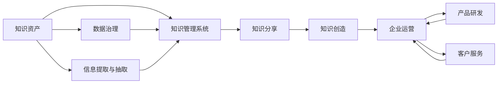

                 

# 知识资产分享知识创造的长期价值

> 关键词：知识管理,数据治理,企业知识库,知识共享,信息提取,数据治理

## 1. 背景介绍

在信息爆炸的时代，企业面临海量数据和信息的管理难题。如何高效利用这些知识资产，通过知识分享和创造，为企业带来长期价值，是当下各行业的共同课题。数据和信息已经成为企业最宝贵的资产之一，但很多企业在实际应用中，由于管理不当、技术限制、文化障碍等因素，未能充分发挥数据和信息的价值。为了更好地解决这些问题，本文将从知识资产的分享与创造角度出发，讨论其在企业运营、产品研发、客户服务等多个环节的应用，并探索其长期价值。

## 2. 核心概念与联系

### 2.1 核心概念概述

- **知识资产**：企业运营中积累的各种数据、信息、文档、代码、规范等，是企业长期竞争力的体现。
- **知识分享**：企业内部员工间、团队间、部门间通过各种途径传播和传递知识。
- **知识创造**：基于现有知识进行新的知识发现、创新、改进等活动，推动企业不断向前发展。
- **数据治理**：对企业的数据进行标准化、管理和保护，确保数据质量和可用性。
- **知识管理系统(KMS)**：借助技术手段，对企业知识资产进行统一管理、存储、检索、协作、共享的系统。
- **信息提取与抽取**：通过自然语言处理(NLP)等技术手段，从文本、文档、网页等非结构化数据中自动提取结构化信息。

这些核心概念之间具有紧密的联系，共同构建了一个完整的企业知识生态系统。通过有效的知识治理和信息抽取，可以大幅提升企业知识管理效率，促进知识分享与创造，进而为企业带来持续的竞争优势和长期价值。

### 2.2 概念间的关系

通过以下Mermaid流程图展示核心概念之间的相互关系：



这个流程图展示了企业知识生态系统的全貌：企业通过治理和管理知识资产，利用信息提取和抽取技术，搭建知识管理系统，实现知识分享和创造，最终推动企业运营、产品研发、客户服务等多个环节的不断优化和提升。

## 3. 核心算法原理 & 具体操作步骤
### 3.1 算法原理概述

企业知识资产的分享与创造，涉及知识管理、数据治理、信息抽取、知识系统构建等多个环节。这一过程可通过一系列算法和工具实现，其核心算法原理包括以下几个方面：

- **数据治理算法**：通过标准化、清洗、分词等技术手段，提升数据质量和可用性。
- **信息抽取算法**：使用实体识别、关系抽取等自然语言处理技术，从非结构化文本数据中提取结构化信息。
- **知识管理系统算法**：通过文档存储、分类、检索、协作等技术，实现知识资产的高效管理与分享。

### 3.2 算法步骤详解

具体算法步骤如下：

1. **数据采集与清洗**：采集企业各类数据和信息，使用清洗算法去除无效、重复或错误的数据。
2. **实体与关系抽取**：利用NLP算法从文本中识别出实体、属性和关系，构建知识图谱。
3. **文档分类与标注**：通过聚类、分类等算法，将文档按照主题、领域等标准进行分类与标注。
4. **构建知识管理系统**：设计知识管理系统的架构，集成文档存储、检索、协作、分享等功能。
5. **知识分享与协作**：通过API、搜索引擎等工具，实现知识资产在企业内部高效分享与协作。
6. **持续改进与反馈**：收集用户反馈，通过机器学习算法不断优化知识管理系统的性能。

### 3.3 算法优缺点

基于核心算法原理，知识资产分享与创造存在以下优缺点：

#### 优点

- **高效管理**：利用算法提升数据质量和可用性，保障知识资产的可信度和完整性。
- **自动化**：通过信息抽取、聚类、分类等算法，实现知识管理和知识分享的自动化，降低人工成本。
- **开放协作**：基于知识管理系统的协作机制，提升员工间知识分享效率，促进团队合作。
- **持续改进**：通过机器学习算法不断优化知识管理系统，提升系统性能与用户体验。

#### 缺点

- **算法复杂度**：知识治理、信息抽取等算法复杂，需要高质量的训练数据和较强的计算资源。
- **数据隐私**：知识治理涉及企业敏感信息，需严格保护数据隐私和安全。
- **文化障碍**：员工对新工具和方法的接受度可能不足，需要组织文化变革。
- **技术门槛**：需要一定的技术积累和专业技能，普通员工可能难以操作。

### 3.4 算法应用领域

基于核心算法原理，知识资产分享与创造在以下领域有广泛应用：

- **企业运营**：通过知识管理优化流程、提高效率，实现业务数字化转型。
- **产品研发**：利用知识库加速产品创新和迭代，提升研发效率和产品质量。
- **客户服务**：通过知识分享提升客户服务质量，增强客户粘性和满意度。
- **市场营销**：基于客户数据和知识，进行精准营销和品牌建设。
- **培训与发展**：通过知识分享和协作，提升员工技能和知识水平。
- **合规与审计**：利用知识管理系统的审计功能，确保业务合规性，保障数据安全。

## 4. 数学模型和公式 & 详细讲解
### 4.1 数学模型构建

知识资产分享与创造过程中，涉及多个数学模型和算法。以下对几个核心模型进行介绍：

- **实体识别模型**：
  - 定义：从文本中识别出实体（如人名、地名、机构名等）。
  - 算法：利用条件随机场、LSTM-CRF等模型，结合特征工程和正则化技术。
- **关系抽取模型**：
  - 定义：识别文本中实体之间的关系，如“John is the CEO of ABC”中的“is CEO of”关系。
  - 算法：基于逻辑推理、图神经网络等技术，结合训练数据和知识库。
- **文档分类模型**：
  - 定义：将文档按照主题、领域等标准进行分类。
  - 算法：利用朴素贝叶斯、SVM、Transformer等模型，结合特征选择和文本表示技术。

### 4.2 公式推导过程

以实体识别模型为例，公式推导如下：

- **条件随机场模型**：
  - 公式：
    $$
    P(y|x)=\frac{1}{Z}\prod_{i=1}^{n} \frac{P(x_i|y)}{P(x_i)}
    $$
    其中，$P(y|x)$表示给定文本$x$条件下实体序列$y$的概率，$Z$为归一化因子，$n$为文本中实体的数量，$x_i$为文本中第$i$个实体，$y$为实体序列。
  - 解释：该模型通过最大化文本$x$条件下实体序列$y$的概率，实现实体的识别和标注。

### 4.3 案例分析与讲解

假设我们有一个包含企业年报的文档集，需要从中抽取“人员姓名、职位、部门”等实体信息。基于条件随机场模型，可以设计如下流程：

1. 将文档输入到预训练的Transformer模型中，提取文本特征向量。
2. 使用条件随机场模型对特征向量进行实体识别，输出实体序列。
3. 对实体序列进行后处理，去除无意义的实体，进行归一化处理。
4. 将识别出的实体信息存储到知识库中，供后续分析和应用。

## 5. 项目实践：代码实例和详细解释说明
### 5.1 开发环境搭建

进行项目实践前，需要搭建合适的开发环境，包括硬件和软件环境：

- **硬件环境**：配置高性能的CPU和GPU，以满足复杂的算法计算需求。
- **软件环境**：安装Python、Jupyter Notebook、PyTorch、TensorFlow、NLTK等常用工具和库。

### 5.2 源代码详细实现

以信息抽取为例，给出Python代码实现：

```python
import torch
import torch.nn as nn
import torch.nn.functional as F
from torchtext.data import Field, TabularDataset
from torchtext.data.metrics import Accuracy
from torchtext.data.utils import get_tokenizer
from torchtext.legacy.transforms import Lowercase, RegexReplace, SequencePadding

# 定义实体抽取模型
class ERModel(nn.Module):
    def __init__(self, vocab_size, embed_dim=128, num_class=10, dropout_prob=0.1):
        super(ERModel, self).__init__()
        self.embedding = nn.Embedding(vocab_size, embed_dim)
        self.pos_conv = nn.Conv1d(embed_dim, embed_dim, kernel_size=3)
        self.pos_pooling = nn.AvgPool1d(3)
        self.pos_fc = nn.Linear(embed_dim, num_class)
        self.dropout = nn.Dropout(dropout_prob)

    def forward(self, x):
        x = self.embedding(x)
        x = self.pos_conv(x)
        x = self.pos_pooling(x)
        x = self.dropout(x)
        x = self.pos_fc(x)
        return F.softmax(x, dim=1)

# 定义训练函数
def train(model, train_loader, val_loader, criterion, optimizer, num_epochs=5):
    best_val_acc = 0.0
    for epoch in range(num_epochs):
        model.train()
        for batch in train_loader:
            optimizer.zero_grad()
            loss = criterion(model(batch), batch.label)
            loss.backward()
            optimizer.step()
        model.eval()
        with torch.no_grad():
            val_loss = 0.0
            val_correct = 0
            for batch in val_loader:
                output = model(batch.text)
                val_loss += criterion(output, batch.label).item()
                pred = output.argmax(dim=1)
                val_correct += (pred == batch.label).sum().item()
            val_acc = val_correct / len(val_loader.dataset)
        print(f'Epoch {epoch+1}, val loss: {val_loss:.4f}, val acc: {val_acc:.4f}')
        if val_acc > best_val_acc:
            best_val_acc = val_acc
    return best_val_acc

# 定义数据处理函数
def get_data(path):
    TEXT = Field(tokenize=get_tokenizer(), lower=True, tokenize_source=False)
    LABEL = Field(tokenize=str)
    train_data, val_data = TabularDataset.splits(path=path, train='train', test='val', format='json', fields=({'TEXT': TEXT, 'LABEL': LABEL}))
    TEXT.build_vocab(train_data, min_freq=2)
    LABEL.build_vocab(train_data, min_freq=2)
    return TEXT, LABEL, train_data, val_data

# 加载数据集
TEXT, LABEL, train_data, val_data = get_data('data.json')

# 定义模型
model = ERModel(len(TEXT.vocab), dropout_prob=0.2)

# 定义损失函数和优化器
criterion = nn.CrossEntropyLoss()
optimizer = torch.optim.Adam(model.parameters(), lr=0.001)

# 定义训练函数
train(model, train_loader(train_data), val_loader(val_data), criterion, optimizer)

# 模型评估
val_loader(val_data)
```

### 5.3 代码解读与分析

上述代码中，我们定义了一个基于条件随机场的实体识别模型，包括模型定义、训练函数、数据处理函数等关键部分。

- **模型定义**：使用PyTorch定义实体识别模型，包括嵌入层、卷积层、池化层、全连接层等组件。
- **训练函数**：定义训练过程，包括模型前向传播、损失计算、反向传播和参数更新。
- **数据处理函数**：定义数据集处理过程，包括数据读取、文本分词、标签转换等。
- **模型评估**：在验证集上对模型进行评估，输出验证集上的损失和准确率。

## 6. 实际应用场景
### 6.1 企业运营

企业运营中，知识资产的分享与创造能够显著提升业务效率和管理水平。例如：

- **流程优化**：通过知识库管理企业运营中的流程和规范，减少人工错误，提升工作效率。
- **问题解决**：员工遇到问题时，可以迅速查阅知识库中相关案例，快速找到解决方案。
- **绩效评估**：利用知识管理系统对员工进行绩效评估，鼓励知识分享与创造，提升团队协作能力。

### 6.2 产品研发

在产品研发中，知识资产的分享与创造能够加速产品创新和迭代。例如：

- **需求分析**：利用知识库中的市场调研和客户反馈，快速定位产品需求，制定研发计划。
- **技术积累**：通过知识管理系统的检索和分享功能，加速技术知识和经验的积累和传承。
- **测试优化**：基于知识库中的测试案例和问题记录，优化产品测试流程，提升测试覆盖率和准确性。

### 6.3 客户服务

客户服务是企业与客户互动的重要环节，知识资产的分享与创造能够提升客户服务质量和满意度。例如：

- **常见问题解答**：利用知识库中的FAQ文档，快速解决客户常见问题，提升客户满意度。
- **个性化推荐**：基于客户历史问题和偏好，通过知识管理系统生成个性化推荐，提升客户体验。
- **投诉处理**：利用知识库中的投诉记录和处理经验，提升客服人员的服务质量和效率。

### 6.4 未来应用展望

未来，知识资产分享与创造将有更广阔的应用前景，主要体现在以下几个方面：

- **AI辅助**：引入AI技术，提升知识管理系统的人机交互体验，自动生成文档摘要、知识推荐等。
- **跨领域应用**：将知识管理系统应用于多个垂直行业，如医疗、金融、制造等，提升各行业的知识管理水平。
- **全球化合作**：利用知识管理系统实现跨国界的知识共享与协作，提升企业的全球竞争力。
- **数据隐私保护**：在知识管理系统中引入隐私保护技术，确保数据安全和合规。

## 7. 工具和资源推荐
### 7.1 学习资源推荐

为了帮助开发者系统掌握知识资产分享与创造的理论基础和实践技巧，这里推荐一些优质的学习资源：

- **《信息抽取理论与实践》**：详细介绍信息抽取的基本理论和应用方法，适合深入学习。
- **Coursera《数据科学与机器学习》课程**：涵盖数据治理、信息提取、知识管理等多个方面，适合全面了解。
- **Kaggle竞赛**：参与知识管理相关的竞赛，通过实战锻炼技能，积累经验。
- **开放数据集**：利用公开的知识库和数据集，进行项目实践，提升实际应用能力。

### 7.2 开发工具推荐

高效的开发离不开优秀的工具支持。以下是几款用于知识资产分享与创造开发的常用工具：

- **Python**：简单易用，丰富的库和框架支持，适合各类算法实现。
- **PyTorch**：深度学习领域的主流框架，支持GPU加速，适合构建复杂模型。
- **TensorFlow**：由Google主导的开源框架，生产部署方便，适合大规模工程应用。
- **NLTK**：自然语言处理库，提供了丰富的文本处理和分析工具。
- **Gurobi**：优化算法库，支持各类线性规划和整数规划问题。

### 7.3 相关论文推荐

知识资产分享与创造的研究涉及多个学科领域，以下是几篇奠基性的相关论文，推荐阅读：

- **《面向知识发现的web文本挖掘》**：提出基于文本挖掘的知识发现方法，适用于大规模知识抽取。
- **《知识工程：方法、建模与实践》**：详细介绍知识工程的基本理论和技术，适合全面了解。
- **《基于语义分析的企业知识管理》**：提出基于语义分析的知识管理方法，适用于企业内部的知识处理。
- **《数据治理：原则、方法与实践》**：详细介绍数据治理的理论和方法，适合数据管理领域从业人员阅读。

## 8. 总结：未来发展趋势与挑战
### 8.1 研究成果总结

本文从知识资产分享与创造的角度，详细探讨了其理论基础和实际应用，提出了一套完整的知识治理方案，涵盖数据采集、信息抽取、知识管理、知识分享等多个环节。通过案例分析，展示了知识资产分享与创造在不同业务场景中的应用效果，为企业的知识管理实践提供了有益的参考。

### 8.2 未来发展趋势

展望未来，知识资产分享与创造将呈现以下几个发展趋势：

- **智能化发展**：引入AI技术，提升知识管理系统的人机交互体验，自动生成文档摘要、知识推荐等。
- **跨领域应用**：将知识管理系统应用于多个垂直行业，提升各行业的知识管理水平。
- **全球化合作**：利用知识管理系统实现跨国界的知识共享与协作，提升企业的全球竞争力。
- **数据隐私保护**：在知识管理系统中引入隐私保护技术，确保数据安全和合规。

### 8.3 面临的挑战

尽管知识资产分享与创造已经取得了一些进展，但在实践中仍然面临诸多挑战：

- **数据质量**：企业知识库中的数据质量参差不齐，可能存在冗余、错误和无效信息，影响知识管理的准确性。
- **知识更新**：知识库中的知识需要定期更新和维护，以适应业务变化，这需要持续的投入和人力资源。
- **技术复杂度**：知识治理、信息抽取等算法复杂，需要高质量的训练数据和较强的计算资源。
- **组织文化**：员工对新工具和方法的接受度可能不足，需要组织文化变革。

### 8.4 研究展望

面向未来，知识资产分享与创造的研究还需要在以下几个方面寻求新的突破：

- **多模态知识治理**：将知识治理技术应用于多模态数据，如文本、图像、视频等，提升数据融合和处理的效率。
- **知识图谱构建**：利用知识图谱技术，构建企业内部的知识关联网络，促进知识的跨领域整合和应用。
- **隐私保护与合规**：在知识治理中引入隐私保护和合规技术，确保数据安全和合规性。
- **情感分析与舆情监测**：利用情感分析技术，监测客户和市场舆情，提升客户关系管理和市场响应能力。

## 9. 附录：常见问题与解答

**Q1: 如何评估知识资产分享与创造的效果？**

A: 知识资产分享与创造的效果可以通过多个指标进行评估，包括：
- **准确率与召回率**：用于评估信息抽取和实体识别的效果。
- **知识覆盖率**：用于评估知识库的全面性和准确性。
- **知识更新频率**：用于评估知识库的维护和更新情况。
- **用户满意度**：通过问卷调查等方式，评估知识管理系统对用户的工作效率和满意度提升。

**Q2: 如何确保知识管理系统的数据安全和隐私保护？**

A: 知识管理系统的数据安全和隐私保护需要多层次的措施：
- **访问控制**：限制用户对知识库的访问权限，确保数据安全。
- **数据加密**：对敏感数据进行加密存储和传输，防止泄露。
- **审计日志**：记录用户对知识库的访问和操作行为，便于追踪和审计。
- **合规标准**：遵守各类数据隐私保护法规，确保数据合规性。

**Q3: 如何优化知识管理系统的性能？**

A: 知识管理系统的性能优化需要从多个方面入手：
- **算法优化**：使用高效的算法和模型，减少计算资源消耗。
- **硬件升级**：增加高性能的硬件资源，提升系统处理能力。
- **数据清洗**：对知识库中的数据进行清洗和去重，提升数据质量。
- **持续迭代**：根据用户反馈和业务需求，不断优化系统功能和性能。

**Q4: 如何提升知识资产分享与创造的实际应用效果？**

A: 提升知识资产分享与创造的实际应用效果，需要从以下几个方面入手：
- **用户培训**：加强员工对知识管理系统的培训和使用指导，提升使用率。
- **多渠道推广**：通过内网、培训、奖励等多种方式，推广知识资产分享文化。
- **制度建设**：建立健全的知识管理制度和流程，确保知识管理系统的稳定运行。
- **技术支持**：提供技术支持和故障排除，解决系统使用中的问题。

---

作者：禅与计算机程序设计艺术 / Zen and the Art of Computer Programming

