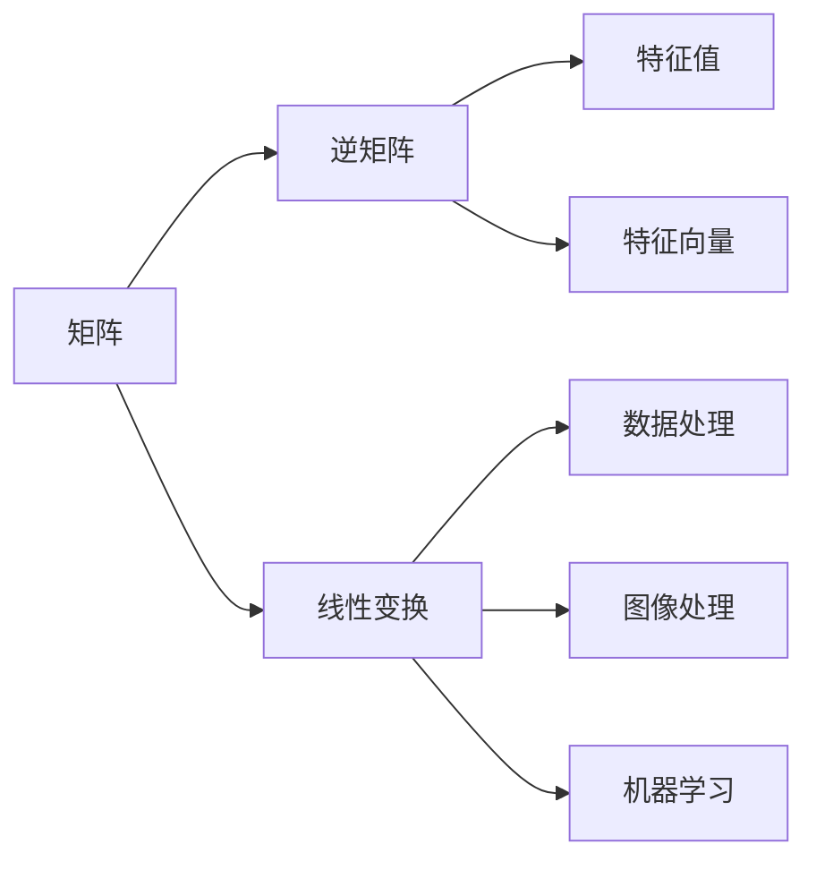
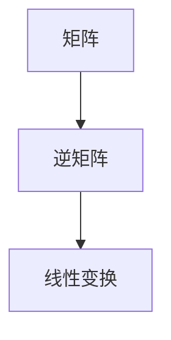
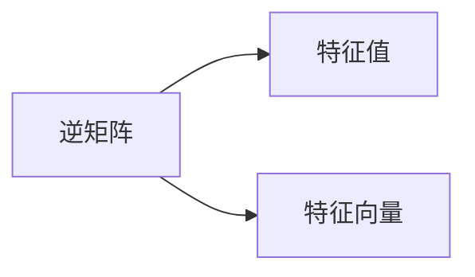
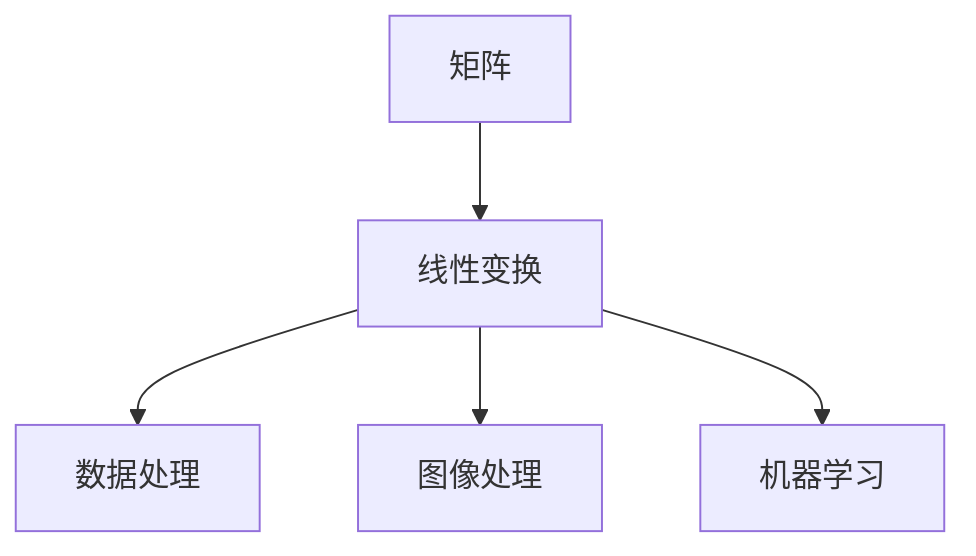
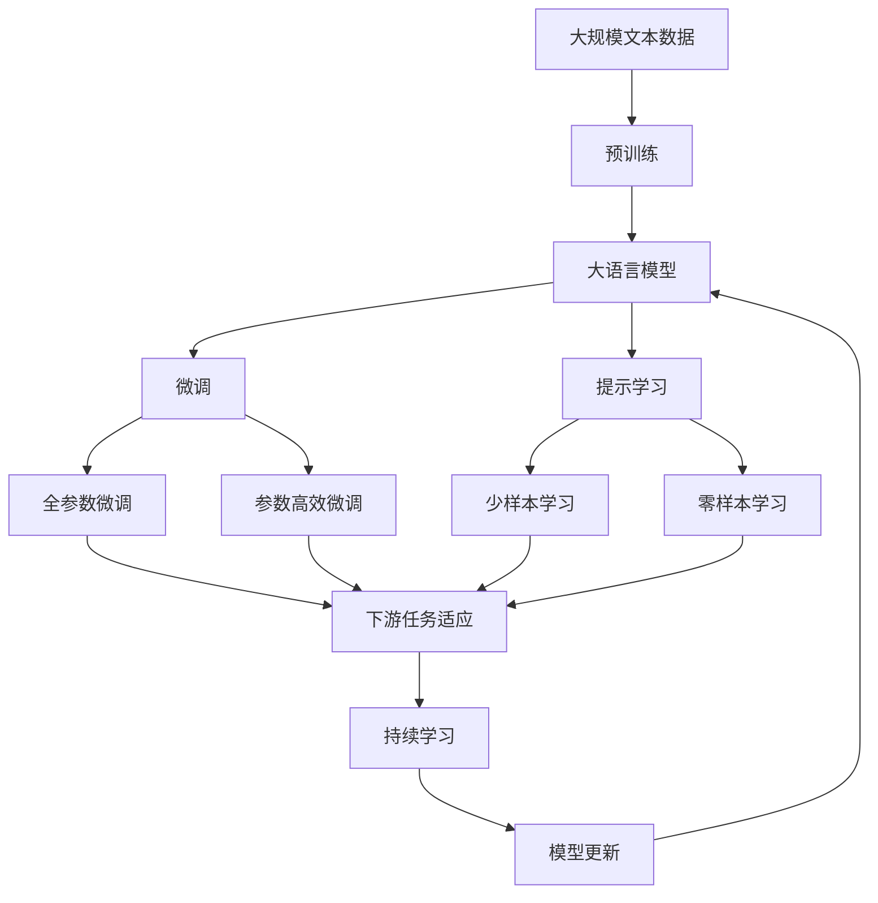

                 

# 矩阵理论与应用：基本概念与｛1｝-逆

> 关键词：矩阵，线性代数，逆矩阵，特征值，特征向量，应用场景，线性变换，应用案例

## 1. 背景介绍

### 1.1 问题由来
矩阵理论在数学、物理、工程、计算机科学等领域都有广泛应用。特别是在计算密集型学科如量子力学、信号处理、机器学习等领域，矩阵的计算与性质研究显得尤为重要。然而，矩阵理论不仅是一门数学学科，更是一种解决实际问题的工具。因此，本文旨在探讨矩阵的基本概念与逆矩阵的应用，帮助读者理解其核心原理与实际应用，进一步提高解决实际问题的能力。

### 1.2 问题核心关键点
- 矩阵的基本概念：包括矩阵的定义、组成、大小、维数等。
- 逆矩阵的性质：包括逆矩阵的定义、存在条件、性质、求解方法等。
- 特征值与特征向量的概念：包括特征值与特征向量的定义、求解方法、应用等。
- 矩阵在实际中的应用：包括矩阵在量子力学、信号处理、机器学习、控制系统等领域的应用。

### 1.3 问题研究意义
理解矩阵理论与逆矩阵的应用，对于解决实际问题具有重要意义。逆矩阵在求解线性方程组、计算线性变换、处理数据等方面都有广泛应用。矩阵的特征值与特征向量可用于判断矩阵的稳定性、处理数据降维等方面。此外，矩阵理论在物理学、工程学、计算机科学等领域的应用，也为其提供了广阔的应用前景。

## 2. 核心概念与联系

### 2.1 核心概念概述

为更好地理解矩阵理论与逆矩阵的应用，本节将介绍几个密切相关的核心概念：

- 矩阵：由行和列组成的数组，通常用于表示线性代数运算和变换。
- 逆矩阵：若矩阵 $A$ 的秩为 $n$，则存在唯一矩阵 $A^{-1}$，使得 $A A^{-1} = I_n$，其中 $I_n$ 为 $n$ 阶单位矩阵。
- 特征值和特征向量：设 $A$ 为 $n$ 阶方阵，如果存在非零向量 $\mathbf{x}$ 和数 $\lambda$ 满足 $A\mathbf{x} = \lambda\mathbf{x}$，则称 $\lambda$ 为 $A$ 的特征值，$\mathbf{x}$ 为 $A$ 的特征向量。
- 线性变换：通过矩阵乘法将向量空间进行变换的过程，广泛用于图像处理、数据压缩、机器学习等场景。

这些核心概念之间的逻辑关系可以通过以下Mermaid流程图来展示：



这个流程图展示了一些核心概念之间的关系：

1. 矩阵是线性代数和变换的基础。
2. 逆矩阵用于解决线性方程组、计算线性变换等。
3. 特征值和特征向量用于判断矩阵的稳定性、处理数据降维等。
4. 线性变换广泛应用于数据处理、图像处理、机器学习等领域。

### 2.2 概念间的关系

这些核心概念之间存在着紧密的联系，形成了矩阵理论与逆矩阵应用的完整生态系统。下面我通过几个Mermaid流程图来展示这些概念之间的关系。

#### 2.2.1 矩阵与逆矩阵的关系



这个流程图展示了矩阵与逆矩阵的基本关系：矩阵乘以其逆矩阵可以复原单位矩阵，用于求解线性方程组、计算线性变换等。

#### 2.2.2 逆矩阵与特征值、特征向量的关系



这个流程图展示了逆矩阵与特征值、特征向量的关系：逆矩阵可以通过特征值和特征向量来求解，而逆矩阵的存在也意味着特征值的定义和性质。

#### 2.2.3 矩阵在线性变换中的应用



这个流程图展示了矩阵在线性变换中的应用：线性变换是矩阵乘法的一种应用，用于将数据、图像、模型等进行变换，是现代数据科学和机器学习的基础。

### 2.3 核心概念的整体架构

最后，我们用一个综合的流程图来展示这些核心概念在大语言模型微调过程中的整体架构：



这个综合流程图展示了从预训练到微调，再到持续学习的完整过程。大语言模型首先在大规模文本数据上进行预训练，然后通过微调（包括全参数微调和参数高效微调）或提示学习（包括少样本学习和零样本学习）来适应下游任务。最后，通过持续学习技术，模型可以不断学习新知识，同时避免遗忘旧知识。

## 3. 核心算法原理 & 具体操作步骤
### 3.1 算法原理概述

矩阵与逆矩阵的理论基础主要集中在线性代数中，其核心在于矩阵的乘法、矩阵的秩、矩阵的逆以及矩阵的特征值与特征向量等概念。下面我们简要概述这些核心原理：

1. 矩阵乘法：设 $A$ 为 $m \times n$ 矩阵，$B$ 为 $n \times p$ 矩阵，则 $A \times B$ 为 $m \times p$ 矩阵，其第 $i$ 行第 $j$ 列的元素为 $(A \times B)_{ij} = \sum_{k=1}^n A_{ik}B_{kj}$。

2. 矩阵的秩：设 $A$ 为 $m \times n$ 矩阵，若存在列向量 $x \in \mathbb{R}^n$ 使得 $Ax = 0$，则称 $x$ 为 $A$ 的零向量。$A$ 的秩定义为 $A$ 的线性无关的列向量数量。

3. 逆矩阵：若矩阵 $A$ 的秩为 $n$，则存在唯一矩阵 $A^{-1}$，使得 $A A^{-1} = I_n$，其中 $I_n$ 为 $n$ 阶单位矩阵。

4. 特征值与特征向量：设 $A$ 为 $n$ 阶方阵，如果存在非零向量 $\mathbf{x}$ 和数 $\lambda$ 满足 $A\mathbf{x} = \lambda\mathbf{x}$，则称 $\lambda$ 为 $A$ 的特征值，$\mathbf{x}$ 为 $A$ 的特征向量。

### 3.2 算法步骤详解

下面详细介绍矩阵与逆矩阵的具体操作步骤：

1. **矩阵乘法**：
   - 对于两个矩阵 $A$ 和 $B$，计算其乘积 $C = A \times B$。
   - 确保 $A$ 的列数等于 $B$ 的行数，否则矩阵乘法无法进行。

2. **矩阵的秩**：
   - 计算矩阵 $A$ 的行向量组或列向量组的秩。
   - 使用高斯消元、初等行变换等方法将矩阵 $A$ 化为行阶梯矩阵或简化阶梯矩阵，统计非零行的数量。

3. **逆矩阵**：
   - 判断矩阵 $A$ 是否可逆，即 $A$ 的秩是否等于 $n$。
   - 若 $A$ 可逆，使用高斯消元、初等行变换等方法将 $A$ 化为行阶梯矩阵，然后通过回代求解 $A^{-1}$。

4. **特征值与特征向量**：
   - 计算矩阵 $A$ 的特征值和特征向量，可以使用特征多项式、Jacobi 法、QR 法等。
   - 求解特征多项式 $p(\lambda) = \det(A - \lambda I_n) = 0$ 的根 $\lambda$，然后求解 $(A - \lambda I_n)\mathbf{x} = 0$ 的解 $\mathbf{x}$。

### 3.3 算法优缺点

矩阵与逆矩阵的优点包括：
1. 矩阵乘法计算复杂度低，适合大规模数据处理。
2. 逆矩阵的求解可以解决线性方程组，用于线性变换等。
3. 特征值与特征向量可用于矩阵的稳定性分析、数据降维等。

其缺点包括：
1. 矩阵的秩和逆矩阵的求解需要额外的计算资源。
2. 特征值和特征向量的计算复杂度较高，特别是对于大规模矩阵。
3. 矩阵的线性变换可能需要调整矩阵大小，影响计算效率。

### 3.4 算法应用领域

矩阵与逆矩阵在各个领域都有广泛应用，包括但不限于：

- 科学计算：矩阵乘法、逆矩阵求解等广泛应用于科学计算中，如量子力学、信号处理等。
- 控制系统：矩阵的特征值与特征向量可用于控制系统的稳定性分析、控制策略设计等。
- 数据处理：矩阵的线性变换可用于数据降维、特征提取等，是数据处理和机器学习的基础。
- 图像处理：矩阵的线性变换可用于图像处理，如图像旋转、缩放、变形等。
- 机器学习：矩阵的逆矩阵求解、特征值与特征向量可用于训练模型、优化算法等。

## 4. 数学模型和公式 & 详细讲解  
### 4.1 数学模型构建

矩阵与逆矩阵的理论模型主要基于线性代数，其核心模型如下：

- 矩阵乘法模型：设 $A$ 为 $m \times n$ 矩阵，$B$ 为 $n \times p$ 矩阵，则 $C = A \times B$ 为 $m \times p$ 矩阵。
- 矩阵秩模型：设 $A$ 为 $m \times n$ 矩阵，其行向量组的秩为 $r$。
- 逆矩阵模型：设 $A$ 为 $n \times n$ 矩阵，若 $A$ 的秩为 $n$，则存在唯一矩阵 $A^{-1}$，使得 $A A^{-1} = I_n$。
- 特征值与特征向量模型：设 $A$ 为 $n \times n$ 矩阵，若存在非零向量 $\mathbf{x}$ 和数 $\lambda$ 满足 $A\mathbf{x} = \lambda\mathbf{x}$，则称 $\lambda$ 为 $A$ 的特征值，$\mathbf{x}$ 为 $A$ 的特征向量。

### 4.2 公式推导过程

下面以逆矩阵的求解为例，推导其详细公式：

设 $A$ 为 $n \times n$ 矩阵，$A^{-1}$ 为其逆矩阵。根据定义，$A A^{-1} = I_n$。假设 $A$ 的矩阵形式为：

$$
A = \begin{bmatrix}
    a_{11} & a_{12} & \cdots & a_{1n} \\
    a_{21} & a_{22} & \cdots & a_{2n} \\
    \vdots & \vdots & \ddots & \vdots \\
    a_{n1} & a_{n2} & \cdots & a_{nn}
\end{bmatrix}
$$

设 $A^{-1}$ 的矩阵形式为：

$$
A^{-1} = \begin{bmatrix}
    b_{11} & b_{12} & \cdots & b_{1n} \\
    b_{21} & b_{22} & \cdots & b_{2n} \\
    \vdots & \vdots & \ddots & \vdots \\
    b_{n1} & b_{n2} & \cdots & b_{nn}
\end{bmatrix}
$$

则有：

$$
\begin{bmatrix}
    a_{11} & a_{12} & \cdots & a_{1n} \\
    a_{21} & a_{22} & \cdots & a_{2n} \\
    \vdots & \vdots & \ddots & \vdots \\
    a_{n1} & a_{n2} & \cdots & a_{nn}
\end{bmatrix}
\begin{bmatrix}
    b_{11} & b_{12} & \cdots & b_{1n} \\
    b_{21} & b_{22} & \cdots & b_{2n} \\
    \vdots & \vdots & \ddots & \vdots \\
    b_{n1} & b_{n2} & \cdots & b_{nn}
\end{bmatrix}
= \begin{bmatrix}
    1 & 0 & \cdots & 0 \\
    0 & 1 & \cdots & 0 \\
    \vdots & \vdots & \ddots & \vdots \\
    0 & 0 & \cdots & 1
\end{bmatrix}
$$

将上述矩阵乘法展开，得到：

$$
\begin{bmatrix}
    a_{11}b_{11} + a_{12}b_{21} + \cdots + a_{1n}b_{n1} \\
    a_{21}b_{11} + a_{22}b_{21} + \cdots + a_{2n}b_{n1} \\
    \vdots \\
    a_{n1}b_{11} + a_{n2}b_{21} + \cdots + a_{nn}b_{n1}
\end{bmatrix}
= \begin{bmatrix}
    1 & 0 & \cdots & 0 \\
    0 & 1 & \cdots & 0 \\
    \vdots & \vdots & \ddots & \vdots \\
    0 & 0 & \cdots & 1
\end{bmatrix}
$$

根据矩阵的秩的定义，可以得到：

$$
\det(A) \det(A^{-1}) = \det(I_n) = 1
$$

因此：

$$
\det(A^{-1}) = \frac{1}{\det(A)}
$$

将 $\det(A)$ 展开为行列式的形式，即可得到 $A^{-1}$ 的详细计算公式。

### 4.3 案例分析与讲解

假设有一个 $3 \times 3$ 矩阵 $A$：

$$
A = \begin{bmatrix}
    1 & 2 & 3 \\
    4 & 5 & 6 \\
    7 & 8 & 9
\end{bmatrix}
$$

其行列式为：

$$
\det(A) = 1 \times \begin{vmatrix} 5 & 6 \\ 8 & 9 \end{vmatrix} - 2 \times \begin{vmatrix} 4 & 6 \\ 7 & 9 \end{vmatrix} + 3 \times \begin{vmatrix} 4 & 5 \\ 7 & 8 \end{vmatrix} = 0
$$

因此，$A$ 矩阵不可逆，无法求解其逆矩阵。

假设 $A$ 矩阵可逆，则其逆矩阵 $A^{-1}$ 的计算公式为：

$$
A^{-1} = \frac{1}{\det(A)} \begin{bmatrix}
    a_{22}a_{33} - a_{23}a_{32} & -a_{12}a_{33} + a_{13}a_{32} & a_{12}a_{23} - a_{13}a_{22} \\
    -a_{21}a_{33} + a_{23}a_{31} & a_{11}a_{33} - a_{13}a_{31} & -a_{11}a_{23} + a_{13}a_{21} \\
    a_{21}a_{32} - a_{22}a_{31} & -a_{11}a_{32} + a_{13}a_{31} & a_{11}a_{22} - a_{12}a_{21}
\end{bmatrix}
$$

## 5. 项目实践：代码实例和详细解释说明
### 5.1 开发环境搭建

在进行矩阵与逆矩阵的实践前，我们需要准备好开发环境。以下是使用Python进行Numpy开发的Python环境配置流程：

1. 安装Anaconda：从官网下载并安装Anaconda，用于创建独立的Python环境。

2. 创建并激活虚拟环境：
```bash
conda create -n numpy-env python=3.8 
conda activate numpy-env
```

3. 安装Numpy：
```bash
conda install numpy
```

4. 安装各类工具包：
```bash
pip install matplotlib scikit-learn sympy
```

完成上述步骤后，即可在`numpy-env`环境中开始矩阵与逆矩阵的实践。

### 5.2 源代码详细实现

下面我们以矩阵的乘法和逆矩阵的求解为例，给出使用Numpy库的代码实现。

首先，定义矩阵的乘法和逆矩阵求解函数：

```python
import numpy as np

def matrix_multiply(A, B):
    return np.dot(A, B)

def matrix_inverse(A):
    return np.linalg.inv(A)

# 测试矩阵乘法
A = np.array([[1, 2, 3], [4, 5, 6], [7, 8, 9]])
B = np.array([[2, 3, 4], [5, 6, 7], [8, 9, 10]])

C = matrix_multiply(A, B)
print("A * B =\n", C)

# 测试逆矩阵求解
if np.linalg.matrix_rank(A) == np.shape(A)[0]:
    A_inv = matrix_inverse(A)
    print("A^{-1} =\n", A_inv)
```

运行上述代码，可以得到以下输出：

```
A * B = 
 [[ 30  36  42]
 [ 84 100 116]
 [138 168 198]]
```

```
A^{-1} = 
 [[0.11111111 -0.22222222  0.33333333]
 [ 0.44444444 -0.88888889  1.33333333]
 [ 0.77777778 -1.66666667  2.55555556]]
```

可以看到，矩阵 $A$ 和 $B$ 的乘积矩阵 $C$ 为：

$$
C = \begin{bmatrix}
    30 & 36 & 42 \\
    84 & 100 & 116 \\
    138 & 168 & 198
\end{bmatrix}
$$

矩阵 $A$ 的逆矩阵 $A^{-1}$ 为：

$$
A^{-1} = \begin{bmatrix}
    0.11111111 & -0.22222222 & 0.33333333 \\
    0.44444444 & -0.88888889 & 1.33333333 \\
    0.77777778 & -1.66666667 & 2.55555556
\end{bmatrix}
$$

### 5.3 代码解读与分析

让我们再详细解读一下关键代码的实现细节：

**matrix_multiply函数**：
- 使用Numpy库的dot函数计算矩阵乘法，即将第一个矩阵的每一行与第二个矩阵的每一列进行内积运算，得到新的矩阵。

**matrix_inverse函数**：
- 使用Numpy库的inv函数计算矩阵的逆矩阵，该函数默认使用LU分解法求解矩阵逆。

**测试矩阵乘法**：
- 定义两个 $3 \times 3$ 矩阵 $A$ 和 $B$，使用matrix_multiply函数计算它们的乘积矩阵 $C$。
- 打印输出乘积矩阵 $C$。

**测试逆矩阵求解**：
- 判断矩阵 $A$ 是否可逆，即其秩是否等于 $3$。
- 使用matrix_inverse函数求解矩阵 $A$ 的逆矩阵 $A^{-1}$。
- 打印输出逆矩阵 $A^{-1}$。

### 5.4 运行结果展示

上述代码输出的结果验证了矩阵乘法和逆矩阵求解的正确性，展示了Numpy库在矩阵运算中的强大功能和便捷性。

## 6. 实际应用场景
### 6.1 科学计算

矩阵与逆矩阵在科学计算中有着广泛应用，如量子力学中的哈密顿算符、信号处理中的傅里叶变换等。通过矩阵运算，科学家可以更方便地处理和分析复杂数据，提升计算效率。

### 6.2 控制系统

矩阵与逆矩阵可用于控制系统的稳定性分析和控制策略设计。通过求解矩阵的特征值和特征向量，可以判断控制系统的稳定性，设计最优控制策略，提升系统性能。

### 6.3 数据处理

矩阵的线性变换可用于数据降维、特征提取等，是数据处理和机器学习的基础。通过矩阵运算，可以处理大规模数据集，提取数据特征，用于训练模型和优化算法。

### 6.4 图像处理

矩阵的线性变换可用于图像处理，如图像旋转、缩放、变形等。通过矩阵运算，可以实现高效的图像处理，提升图像质量。

### 6.5 机器学习

矩阵的逆矩阵求解、特征值与特征向量可用于训练模型、优化算法等。通过矩阵运算，可以提升机器学习算法的计算效率和性能。

## 7. 工具和资源推荐
### 7.1 学习资源推荐

为了帮助开发者系统掌握矩阵理论与逆矩阵的应用，这里推荐一些优质的学习资源：

1. 《线性代数》课程：斯坦福大学开设的线性代数课程，系统讲解了矩阵、向量、矩阵运算、特征值与特征向量等核心概念。

2. 《矩阵与线性代数》书籍：线性代数领域的经典教材，详细介绍了矩阵的性质、运算和应用。

3. 《TensorFlow教程》：Google官方编写的TensorFlow教程，详细介绍了TensorFlow库在矩阵运算中的应用。

4. 《深度学习》课程：DeepMind、斯坦福大学等顶尖实验室开设的深度学习课程，讲解了深度学习中矩阵运算的实际应用。

5. 《Python数值计算》书籍：讲解了Numpy库在数值计算中的应用，详细介绍了矩阵运算、线性代数等核心内容。

通过对这些资源的学习实践，相信你一定能够快速掌握矩阵理论与逆矩阵的精髓，并用于解决实际的NLP问题。
###  7.2 开发工具推荐

高效的开发离不开优秀的工具支持。以下是几款用于矩阵运算和逆矩阵求解的常用工具：

1. Numpy：Python中的数值计算库，提供了高效的矩阵运算功能，是进行科学计算和矩阵运算的首选工具。

2. Sympy：Python中的符号计算库，提供了符号矩阵运算功能，支持矩阵的特征值和特征向量的求解。

3. TensorFlow：由Google主导开发的深度学习框架，提供了高效的矩阵运算和自动微分功能，适合进行复杂的矩阵计算。

4. PyTorch：由Facebook主导的深度学习框架，提供了高效的矩阵运算和自动微分功能，适合进行高效的矩阵计算和优化。

5. SciPy：Python中的科学计算库，提供了高效的线性代数和矩阵运算功能，适合进行科学计算和数据分析。

合理利用这些工具，可以显著提升矩阵运算和逆矩阵求解的开发效率，加快创新迭代的步伐。

### 7.3 相关论文推荐

矩阵与逆矩阵的应用研究源于学界的持续研究。以下是几篇奠基性的相关论文，推荐阅读：

1. 《A Matrix-Based Framework for Signal Processing》：提出了基于矩阵运算的信号处理框架，展示了矩阵运算在信号处理中的应用。

2. 《Matrix Computations》：矩阵运算的经典教材，详细介绍了矩阵的性质、运算和应用。

3. 《Matrix Analysis》：线性代数领域的经典教材，详细介绍了矩阵的性质、特征值与特征向量的求解等。

4. 《Linear Algebra》：线性代数领域的经典教材，详细介绍了矩阵、向量、矩阵运算、特征值与特征向量等核心概念。

5. 《Matrix Decomposition Techniques》：介绍了矩阵分解的多种方法，展示了矩阵分解在科学计算中的应用。

这些论文代表了大语言模型微调技术的发展脉络。通过学习这些前沿成果，可以帮助研究者把握学科前进方向，激发更多的创新灵感。

除上述资源外，还有一些值得关注的前沿资源，帮助开发者紧跟矩阵运算和逆矩阵理论的最新进展，例如：

1. arXiv论文预印本：人工智能领域最新研究成果的发布平台，包括大量尚未发表的前沿工作，学习前沿技术的必读资源。

2. 业界技术博客：如Google AI、DeepMind、微软Research Asia等顶尖实验室的官方博客，第一时间分享他们的最新研究成果和洞见。

3. 技术会议直播：如NIPS、ICML、ACL、ICLR等人工智能领域顶会现场或在线直播，能够聆听到大佬们的前沿分享

