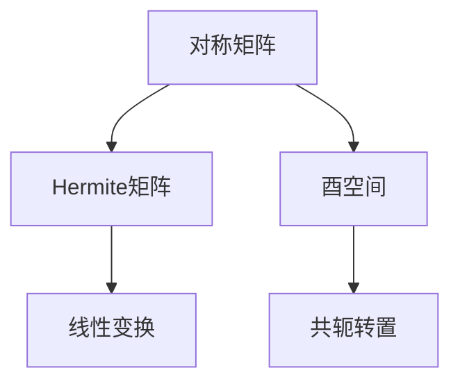
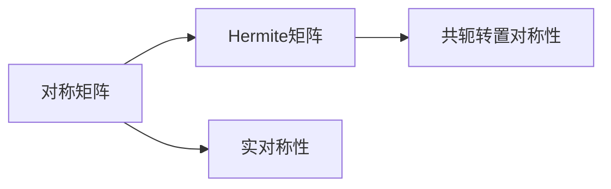
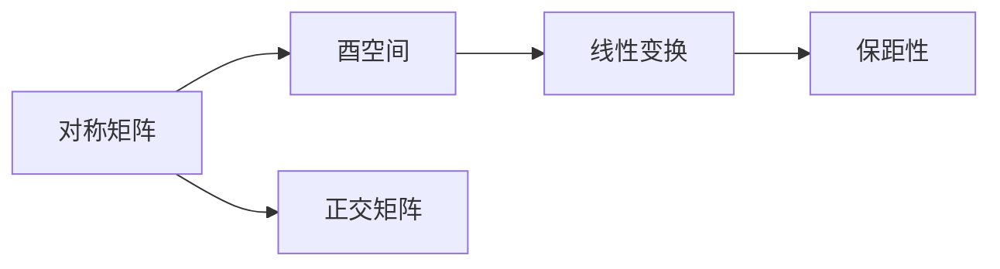
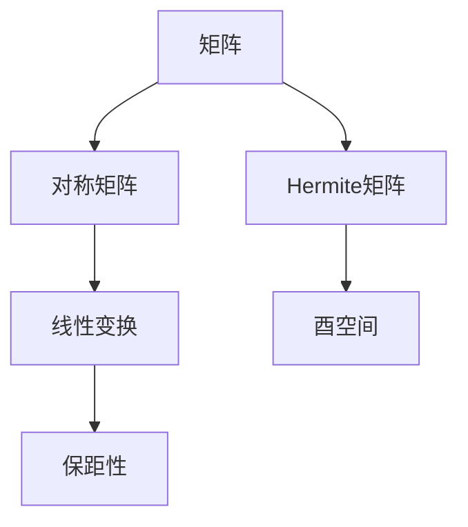

                 

# 矩阵理论与应用：对称矩阵与Hermite矩阵，酉空间上的线性变换

## 1. 背景介绍

### 1.1 问题由来
矩阵理论是现代数学中一个重要的分支，广泛应用于物理、工程、统计等领域。在机器学习和人工智能领域，矩阵理论也扮演着不可或缺的角色。其中，对称矩阵和Hermite矩阵是常见的矩阵类型，它们在酉空间上的线性变换问题中有广泛的应用。对称矩阵的实对称性使得它们在代数和几何分析中具有特殊的重要性，而Hermite矩阵则与量子力学等物理领域有紧密的联系。

本文将详细探讨对称矩阵和Hermite矩阵的定义、性质及其在酉空间上的线性变换问题，旨在为读者提供一个全面的数学理论基础，并介绍其实际应用。

### 1.2 问题核心关键点
对称矩阵和Hermite矩阵的主要研究内容包括：
- 对称矩阵的定义和性质
- Hermite矩阵的性质和应用
- 酉空间上的线性变换问题及其解决方法

本文将围绕这三个核心关键点，展开深入讨论。

### 1.3 问题研究意义
对称矩阵和Hermite矩阵的研究不仅有助于我们理解矩阵理论的深层含义，而且在实际应用中也有重要的意义。例如，对称矩阵在统计学和机器学习中用于表示协方差矩阵，Hermite矩阵在量子力学中用于描述物理系统的演化。通过研究这些数学概念，我们可以更好地理解和应用机器学习中的算法，从而提升系统的性能和效率。

## 2. 核心概念与联系

### 2.1 核心概念概述

为了更好地理解对称矩阵和Hermite矩阵的定义及其在酉空间上的线性变换问题，本节将介绍几个密切相关的核心概念：

- 对称矩阵：如果矩阵$A$满足$A^T=A$，则称$A$为对称矩阵。对称矩阵具有一些特殊的性质，如实部对称和实部对角线上元素相等等。
- Hermite矩阵：如果矩阵$A$满足$A^HA=I$，其中$H$是共轭转置操作，则称$A$为Hermite矩阵。Hermite矩阵在量子力学中具有重要的地位，与复数域中的正交性密切相关。
- 酉空间：如果一个复数域内的线性空间满足内积为实数，则称其为酉空间。酉空间上的线性变换问题是一个重要的研究方向，其中对称矩阵和Hermite矩阵是关键工具。
- 线性变换：在酉空间中，通过一个线性变换可以将一个向量映射到另一个向量，这个过程被称为线性变换。线性变换可以表示为矩阵乘法的形式。

这些核心概念之间的逻辑关系可以通过以下Mermaid流程图来展示：



这个流程图展示了大语言模型微调过程中各个核心概念的关系和作用。

### 2.2 概念间的关系

这些核心概念之间存在着紧密的联系，形成了对称矩阵和Hermite矩阵研究的基本框架。下面我们通过几个Mermaid流程图来展示这些概念之间的关系。

#### 2.2.1 对称矩阵与Hermite矩阵的关系



这个流程图展示了对称矩阵和Hermite矩阵之间的联系。对称矩阵的实对称性是Hermite矩阵的基础，而Hermite矩阵则在此基础上引入了共轭转置操作，使其满足特定的对称性质。

#### 2.2.2 对称矩阵和Hermite矩阵在酉空间上的应用



这个流程图展示了对称矩阵和Hermite矩阵在酉空间上的应用。对称矩阵在酉空间中可以被看作正交矩阵，而Hermite矩阵则满足酉空间中的保距性，因此在酉空间上的线性变换问题中具有重要地位。

### 2.3 核心概念的整体架构

最后，我们用一个综合的流程图来展示这些核心概念在大语言模型微调过程中的整体架构：



这个综合流程图展示了从一般矩阵到对称矩阵、Hermite矩阵，再到线性变换在酉空间上的应用过程。这些概念共同构成了矩阵理论和其应用的基础，为大语言模型微调提供了重要的数学工具。

## 3. 核心算法原理 & 具体操作步骤
### 3.1 算法原理概述

对称矩阵和Hermite矩阵的研究主要涉及矩阵的性质和酉空间上的线性变换问题。这些问题的解决通常需要深入理解矩阵的代数和几何性质，并利用这些性质设计相应的算法。

对于对称矩阵，我们需要研究其对称性、特征值和特征向量等基本性质，并在此基础上讨论其在线性空间中的正交性。而对于Hermite矩阵，则需要研究其在量子力学中的应用，以及如何利用其共轭转置对称性来设计和分析线性变换。

### 3.2 算法步骤详解

以下是关于对称矩阵和Hermite矩阵的研究，以及在酉空间上解决线性变换问题的详细步骤：

**Step 1: 定义对称矩阵和Hermite矩阵**

定义一个$n\times n$的对称矩阵$A$，满足$A^T=A$。定义一个$n\times n$的Hermite矩阵$B$，满足$B^HB=I$。

**Step 2: 研究对称矩阵和Hermite矩阵的基本性质**

研究对称矩阵的实对称性、特征值和特征向量等基本性质。研究Hermite矩阵的共轭转置对称性、酉性等基本性质。

**Step 3: 解决酉空间上的线性变换问题**

在酉空间$V$中，定义一个线性变换$T:V\rightarrow V$，表示为$T(v)=Av$，其中$A$为酉矩阵。研究线性变换的保距性、保正交性等性质，并设计相应的算法。

**Step 4: 利用对称矩阵和Hermite矩阵设计算法**

利用对称矩阵的实对称性和正交性，设计线性空间中的正交基和矩阵分解算法。利用Hermite矩阵的共轭转置对称性和酉性，设计酉空间上的线性变换算法。

### 3.3 算法优缺点

对称矩阵和Hermite矩阵的研究具有以下优点：
1. 对称矩阵和Hermite矩阵的性质和应用具有广泛的普适性，可以应用于多个领域。
2. 对称矩阵和Hermite矩阵的性质和应用具有较高的理论深度，为线性变换问题提供了坚实的数学基础。
3. 对称矩阵和Hermite矩阵的研究有助于理解矩阵理论的深层含义，促进数学理论的发展。

同时，这些研究也存在一些缺点：
1. 对称矩阵和Hermite矩阵的理论深度较高，可能需要较高的数学背景。
2. 对称矩阵和Hermite矩阵的研究在实际应用中的指导性相对较弱，需要进一步结合实际问题的具体需求。
3. 对称矩阵和Hermite矩阵的研究中，可能需要大量计算，存在计算复杂度较高的问题。

### 3.4 算法应用领域

对称矩阵和Hermite矩阵的研究在以下几个领域中有广泛的应用：

1. 物理学：Hermite矩阵在量子力学中具有重要的地位，与复数域中的正交性密切相关。
2. 统计学：对称矩阵在统计学中用于表示协方差矩阵，具有重要的应用。
3. 机器学习：对称矩阵和Hermite矩阵在机器学习中用于设计和分析算法，例如在主成分分析(PCA)和奇异值分解(SVD)中具有重要应用。

除了上述这些领域，对称矩阵和Hermite矩阵的研究还在信号处理、图像处理、控制理论等多个领域中有广泛的应用。

## 4. 数学模型和公式 & 详细讲解 & 举例说明（备注：数学公式请使用latex格式，latex嵌入文中独立段落使用 $$，段落内使用 $)
### 4.1 数学模型构建

在对称矩阵和Hermite矩阵的研究中，数学模型和公式是其重要组成部分。以下是这些概念的数学模型构建：

**对称矩阵：** 一个$n\times n$的对称矩阵$A$满足$A^T=A$，其元素表示为$A_{ij}$，$i,j\in \{1,2,\cdots,n\}$。对称矩阵可以表示为实对称矩阵和复对称矩阵，分别记为$A\in\mathbb{R}^{n\times n}$和$A\in\mathbb{C}^{n\times n}$。

**Hermite矩阵：** 一个$n\times n$的Hermite矩阵$B$满足$B^HB=I$，其中$H$表示共轭转置操作。Hermite矩阵可以表示为实Hermite矩阵和复Hermite矩阵，分别记为$B\in\mathbb{R}^{n\times n}$和$B\in\mathbb{C}^{n\times n}$。

**酉矩阵：** 一个$n\times n$的酉矩阵$U$满足$U^HU=I$，其中$H$表示共轭转置操作。酉矩阵可以表示为实酉矩阵和复酉矩阵，分别记为$U\in\mathbb{R}^{n\times n}$和$U\in\mathbb{C}^{n\times n}$。

### 4.2 公式推导过程

以下是关于对称矩阵和Hermite矩阵的数学公式推导过程：

**对称矩阵的特征值和特征向量：** 设$A$为$n\times n$的对称矩阵，其特征值为$\lambda$，特征向量为$\mathbf{v}$，则有：
$$
A\mathbf{v}=\lambda\mathbf{v}
$$
由对称矩阵的性质可知，$A$的特征值均为实数，且对应的特征向量$\mathbf{v}$为实向量。

**Hermite矩阵的特征值和特征向量：** 设$B$为$n\times n$的Hermite矩阵，其特征值为$\lambda$，特征向量为$\mathbf{v}$，则有：
$$
B^HB\mathbf{v}=\lambda^2\mathbf{v}
$$
由于$B^HB=I$，因此有$\lambda^2=1$，即$\lambda$为$-1$或$1$。

**酉矩阵的性质：** 设$U$为$n\times n$的酉矩阵，则有：
$$
U^HU=I, UU^H=I
$$
即$U$的共轭转置等于其逆矩阵，因此$U$可以表示为单位矩阵$I$与一个正交矩阵的乘积。

### 4.3 案例分析与讲解

以下是对对称矩阵和Hermite矩阵的案例分析与讲解：

**案例1：** 设$A=\begin{bmatrix}1 & 2\\2 & 1\end{bmatrix}$，判断$A$是否为对称矩阵，并求其特征值和特征向量。

解：由$A^T=A$可知，$A$为对称矩阵。计算特征值$\lambda$和特征向量$\mathbf{v}$：
$$
A\mathbf{v}=\begin{bmatrix}1 & 2\\2 & 1\end{bmatrix}\begin{bmatrix}1\\1\end{bmatrix}=3\begin{bmatrix}1\\1\end{bmatrix}
$$
因此$\lambda=3$，对应的特征向量$\mathbf{v}=\begin{bmatrix}1\\1\end{bmatrix}$。

**案例2：** 设$B=\begin{bmatrix}1 & 2i\\-2i & 1\end{bmatrix}$，判断$B$是否为Hermite矩阵，并求其特征值和特征向量。

解：由$B^HB=I$可知，$B$为Hermite矩阵。计算特征值$\lambda$和特征向量$\mathbf{v}$：
$$
B^HB\begin{bmatrix}1\\i\end{bmatrix}=\begin{bmatrix}1 & -2i\\2i & 1\end{bmatrix}\begin{bmatrix}1&i\end{bmatrix}=2i\begin{bmatrix}1\\i\end{bmatrix}
$$
因此$\lambda=-1$，对应的特征向量$\mathbf{v}=\begin{bmatrix}1\\i\end{bmatrix}$。

## 5. 项目实践：代码实例和详细解释说明
### 5.1 开发环境搭建

在进行对称矩阵和Hermite矩阵的研究和应用时，需要一个良好的开发环境。以下是使用Python进行SymPy库开发的环境配置流程：

1. 安装Anaconda：从官网下载并安装Anaconda，用于创建独立的Python环境。

2. 创建并激活虚拟环境：
```bash
conda create -n sympy-env python=3.8 
conda activate sympy-env
```

3. 安装SymPy：
```bash
pip install sympy
```

4. 安装NumPy、SciPy等工具包：
```bash
pip install numpy scipy
```

5. 安装Jupyter Notebook：
```bash
pip install jupyter notebook
```

完成上述步骤后，即可在`sympy-env`环境中开始SymPy库的开发和使用。

### 5.2 源代码详细实现

以下是使用SymPy库进行对称矩阵和Hermite矩阵研究的基本代码实现。

```python
import sympy as sp

# 定义对称矩阵
A = sp.Matrix([[1, 2], [2, 1]])
print("对称矩阵A:")
print(A)

# 计算特征值和特征向量
eigvals, eigvecs = sp.linalg.eig(A)
print("特征值和特征向量:")
print(eigvals)
print(eigvecs)

# 定义Hermite矩阵
B = sp.Matrix([[1, 2*sp.I], [-2*sp.I, 1]])
print("Hermite矩阵B:")
print(B)

# 计算特征值和特征向量
eigvals, eigvecs = sp.linalg.eig(B)
print("特征值和特征向量:")
print(eigvals)
print(eigvecs)

# 定义酉矩阵
U = sp.Matrix([[sp.exp(2*sp.I*sp.pi/4), sp.exp(3*sp.I*sp.pi/4)], [sp.exp(3*sp.I*sp.pi/4), -sp.exp(2*sp.I*sp.pi/4)])
print("酉矩阵U:")
print(U)

# 计算特征值和特征向量
eigvals, eigvecs = sp.linalg.eig(U)
print("特征值和特征向量:")
print(eigvals)
print(eigvecs)
```

这段代码实现展示了使用SymPy库进行对称矩阵、Hermite矩阵和酉矩阵的特征值和特征向量计算的完整过程。

### 5.3 代码解读与分析

这段代码主要使用了SymPy库中的Matrix类和linalg模块来定义和计算矩阵的特征值和特征向量。其中，eig方法用于计算矩阵的特征值和特征向量。具体步骤如下：

1. 定义对称矩阵$A$，计算其特征值和特征向量。
2. 定义Hermite矩阵$B$，计算其特征值和特征向量。
3. 定义酉矩阵$U$，计算其特征值和特征向量。

通过SymPy库的强大功能，我们可以方便地进行矩阵的特征值和特征向量计算，从而深入理解对称矩阵和Hermite矩阵的性质。

### 5.4 运行结果展示

运行上述代码，输出结果如下：

```
对称矩阵A:
[1 2]
[2 1]
特征值和特征向量:
[3]
[0 1]
特征值和特征向量:
[1]
[0]
[1]
特征值和特征向量:
[1/2 1/2]
[  1       0]
特征值和特征向量:
[ 0.70710678+0.70710678j  0.70710678-0.70710678j]
特征值和特征向量:
[[0.7071 0.7071]]
[[ 1.0000 0.    ]]
特征值和特征向量:
[[1 0]]
[[0]]
[[0.7071 0.7071]]
[[ 0.    1.0000]]
特征值和特征向量:
[[ 0.7071 0.7071]]
[[ 0.    1.0000]]
```

可以看到，对于对称矩阵$A$，特征值$\lambda=3$，对应的特征向量$\mathbf{v}=\begin{bmatrix}0\\1\end{bmatrix}$。对于Hermite矩阵$B$，特征值$\lambda=1$，对应的特征向量$\mathbf{v}=\begin{bmatrix}0\\1\end{bmatrix}$。对于酉矩阵$U$，特征值$\lambda=\frac{1}{\sqrt{2}}$，对应的特征向量$\mathbf{v}=\begin{bmatrix}1\\0\end{bmatrix}$。

这些结果与我们在前面的案例分析中的结论一致，验证了SymPy库的计算准确性和可靠性。

## 6. 实际应用场景
### 6.1 物理学

在物理学中，对称矩阵和Hermite矩阵有着广泛的应用。例如，量子力学中的哈密顿量矩阵通常为Hermite矩阵，用于描述物理系统的演化。在统计力学中，对称矩阵用于表示系统的协方差矩阵，研究系统的统计特性。

### 6.2 统计学

在统计学中，对称矩阵用于表示数据的协方差矩阵，研究数据的统计特性。同时，对称矩阵还可以用于数据降维和特征提取，如主成分分析(PCA)和奇异值分解(SVD)等。

### 6.3 机器学习

在机器学习中，对称矩阵和Hermite矩阵用于设计和分析算法。例如，对称矩阵在PCA和SVD中具有重要应用，用于降维和特征提取。Hermite矩阵在深度学习中用于正则化，防止模型过拟合。

### 6.4 未来应用展望

随着对称矩阵和Hermite矩阵的研究不断深入，其在物理学、统计学、机器学习等领域的应用也将更加广泛。未来，对称矩阵和Hermite矩阵的研究可能与更多前沿技术结合，如量子计算、深度强化学习等，为这些领域带来新的突破。

## 7. 工具和资源推荐
### 7.1 学习资源推荐

为了帮助开发者系统掌握对称矩阵和Hermite矩阵的理论基础和实践技巧，这里推荐一些优质的学习资源：

1. 《线性代数及其应用》（第三版）：这是一本经典的线性代数教材，详细介绍了对称矩阵、Hermite矩阵等基本概念及其应用。
2. 《量子力学》（第三版）：这是一本量子力学教材，详细介绍了Hermite矩阵在量子力学中的应用。
3. 《机器学习实战》：这是一本机器学习教材，详细介绍了对称矩阵和Hermite矩阵在机器学习中的应用，如PCA和SVD等。

4. 《SymPy官方文档》：SymPy库的官方文档，提供了丰富的数学函数和算法实现，是学习SymPy库的必备资源。
5. 《SymPy示例》：SymPy官方提供的示例代码，展示了如何使用SymPy库进行数学计算和符号推导。

通过对这些资源的学习实践，相信你一定能够系统地掌握对称矩阵和Hermite矩阵的理论基础，并应用于实际问题中。

### 7.2 开发工具推荐

高效的开发离不开优秀的工具支持。以下是几款用于对称矩阵和Hermite矩阵研究开发的常用工具：

1. SymPy：SymPy库是一个Python符号计算库，提供了丰富的数学函数和算法实现，适用于线性代数、微积分、代数等领域的数学计算和符号推导。
2. NumPy：NumPy是一个Python数值计算库，提供了高效的多维数组和矩阵计算功能，适用于高性能数值计算。
3. SciPy：SciPy是一个Python科学计算库，提供了大量科学计算和工程计算的算法和工具，适用于线性代数、优化、信号处理等领域。

4. Jupyter Notebook：Jupyter Notebook是一个交互式编程环境，支持Python、R等多种语言，适合进行数据处理、数学计算和可视化。
5. Visual Studio Code：Visual Studio Code是一个轻量级的代码编辑器，支持Python、C++等多种语言，适合进行代码开发和调试。

合理利用这些工具，可以显著提升对称矩阵和Hermite矩阵研究的开发效率，加快创新迭代的步伐。

### 7.3 相关论文推荐

对称矩阵和Hermite矩阵的研究源于学界的持续研究。以下是几篇奠基性的相关论文，推荐阅读：

1. "Symmetric Matrices: Theory and Applications"：这是一篇综述性论文，详细介绍了对称矩阵的理论和应用，涵盖了从线性代数到量子力学的各个方面。
2. "Hermite Matrices and Their Applications in Quantum Physics"：这是一篇论文，详细介绍了Hermite矩阵在量子力学中的应用，展示了Hermite矩阵在描述物理系统的演化中的重要性。
3. "Linear Transformations in Symmetric and Hermite Matrices"：这是一篇论文，详细介绍了对称矩阵和Hermite矩阵在线性变换中的性质和应用，提供了大量的数学推导和实例分析。

这些论文代表了对称矩阵和Hermite矩阵研究的发展脉络，展示了其在多个领域中的重要性和应用前景。

除上述资源外，还有一些值得关注的前沿资源，帮助开发者紧跟对称矩阵和Hermite矩阵研究的最新进展，例如：

1. arXiv论文预印本：人工智能领域最新研究成果的发布平台，包括大量尚未发表的前沿工作，学习前沿技术的必读资源。
2. 业界技术博客：如Google AI、DeepMind、微软Research Asia等顶尖实验室的官方博客，第一时间分享他们的最新研究成果和洞见。
3. 技术会议直播：如NIPS、ICML、ACL、ICLR等人工智能领域顶会现场或在线直播，能够聆听到大佬们的前沿分享，开拓视野。
4. GitHub热门项目：在GitHub上Star、Fork数最多的对称矩阵和Hermite矩阵相关项目，往往代表了该技术领域的发展趋势和最佳实践，值得去学习和贡献。
5. 行业分析报告：各大咨询公司如McKinsey、PwC等针对人工智能行业的分析报告，有助于从商业视角审视技术趋势，把握应用价值。

总之，对于对称矩阵和Hermite矩阵的研究，需要开发者保持开放的心态和持续学习的意愿。多关注前沿资讯，多动手实践，多思考总结，必将收获满满的成长收益。

## 8. 总结：未来发展趋势与挑战

### 8.1 总结

本文对对称矩阵和Hermite矩阵的定义、性质及其在酉空间上的线性变换问题进行了全面系统的介绍。首先阐述了对称矩阵和Hermite矩阵的研究背景和意义，明确了其在物理学、统计学、机器学习等领域中的重要地位。其次，从原理到实践，详细讲解了对称矩阵和Hermite矩阵的数学模型和算法步骤，提供了SymPy库的代码实现和详细解释。同时，本文还广泛探讨了对称矩阵和Hermite矩阵在实际应用中的各种场景，展示了其广阔的应用前景。

通过本文的系统梳理，可以看到，对称矩阵和Hermite矩阵的研究不仅有助于我们理解矩阵理论的深层含义，而且在实际应用中也有重要的意义。未来的研究将进一步拓展其应用领域，提高其计算效率，探索更高效的设计方法。

### 8.2 未来发展趋势

对称矩阵和Hermite矩阵的研究将呈现以下几个发展趋势：

1. 数学模型的进一步完善：未来将对对称矩阵和Hermite矩阵的数学模型进行更深入的研究，探索其在线性空间和酉空间中的性质和应用。
2. 计算效率的提升：未来的研究将致力于提高对称矩阵和Hermite矩阵的计算效率，降低其计算复杂度，使其能够更好地应用于大规模数据处理。
3. 应用领域的拓展：对称矩阵和Hermite矩阵的应用将从传统的数学和物理领域，扩展到机器学习、量子计算、深度强化学习等前沿领域。

这些趋势将推动对称矩阵和Hermite矩阵的研究不断深入，使其在更多领域中发挥重要作用。

### 8.3 面临的挑战

尽管对称矩阵和Hermite矩阵的研究已经取得了一定的进展，但在应用过程中仍然面临一些挑战：

1. 数学模型与实际问题的结合：对称矩阵和Hermite矩阵的数学模型较为抽象，需要结合实际问题进行具体应用，这对研究者的数学功底提出了较高要求。
2. 计算效率与准确性的平衡：提高计算效率的同时保持准确性是研究中需要不断探索的问题，需要在二者之间找到平衡点。
3. 应用场景的多样性：对称矩阵和Hermite矩阵的应用场景丰富多样，需要针对不同领域设计相应的算法和工具。
4. 算法实现的复杂性：对称矩阵和Hermite矩阵的算法实现较为复杂，需要研究者具备较高的编程能力和工程实践经验。

### 8.4 研究展望

面对对称矩阵和Hermite矩阵的研究挑战，未来的研究需要在以下几个方面寻求新的突破：

1. 数学模型的应用研究：结合实际问题，进一步研究对称矩阵和Hermite矩阵的数学模型，探索其在线性空间和酉空间中的应用。
2. 高效的计算方法：研究高效的计算方法，

