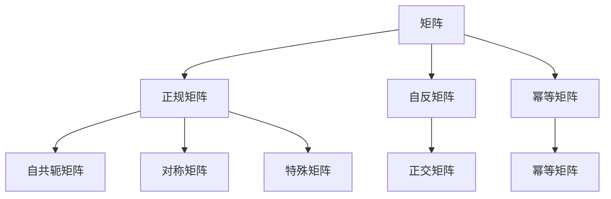

                 

## 1. 背景介绍

在数学和物理学的各个领域，矩阵及其变换扮演着重要的角色。矩阵及其变换不仅在计算几何、线性代数和量子力学中得到了广泛应用，还在图像处理、信号处理、机器学习等领域被用来解决实际问题。因此，深入理解矩阵及其变换的理论和应用具有重要的学术和实践意义。

在实际应用中，矩阵变换常常需要保证某些性质，例如矩阵的正交性、对称性和自反性等。正规矩阵是满足特殊性质的矩阵，其应用广泛且深刻。本文将介绍正规矩阵的定义、性质及其应用，通过数学模型和代码实例帮助读者深入理解正规矩阵的理论和实践。

## 2. 核心概念与联系

### 2.1 核心概念概述

正规矩阵（Normal Matrix）是满足特定条件的矩阵，在数学和物理中具有重要的应用。其定义为：

$$A \in \mathbb{C}^{n \times n}, \quad A^*A=A^TA=I \quad \text { (正规矩阵 ) }$$

其中 $A^*$ 表示 $A$ 的共轭转置，$I$ 为单位矩阵。正规矩阵的共轭转置 $A^*$ 与其自身乘积仍然等于 $A$ 的转置与自身乘积，并且等于单位矩阵。正规矩阵是幂等矩阵、自反矩阵和正交矩阵的特例，其应用广泛，如在量子力学中的哈密顿算符、信号处理中的自相关矩阵等。

### 2.2 概念间的关系

正规矩阵的性质可以概括为以下几个方面：

1. **幂等性**：$A^2=A$。
2. **自反性**：$A^*A=A^TA=I$。
3. **正交性**：$AA^*=A^*A=I$。

从这些性质可以看出，正规矩阵是具有对称性的自反矩阵，也是幂等矩阵的特例。这表明正规矩阵在矩阵乘法和逆运算中有着重要的作用。

### 2.3 核心概念的整体架构

以下是正规矩阵相关概念的整体架构：



从架构图中可以看出，正规矩阵是自反矩阵、幂等矩阵和正交矩阵的特例，并拥有自共轭矩阵和对称矩阵的属性。

## 3. 核心算法原理 & 具体操作步骤
### 3.1 算法原理概述

正规矩阵的判断和计算涉及矩阵的乘法、转置和逆运算。其核心算法原理包括以下几个步骤：

1. 计算矩阵的共轭转置 $A^*$。
2. 计算矩阵 $A$ 与 $A^*$ 的乘积。
3. 检查 $AA^*$ 是否等于 $A^*A$。
4. 检查 $AA^*$ 是否等于单位矩阵 $I$。

如果上述条件满足，则 $A$ 为正规矩阵。

### 3.2 算法步骤详解

下面是正规矩阵的判断算法的详细步骤：

1. 输入一个 $n \times n$ 的复数矩阵 $A$。
2. 计算 $A$ 的共轭转置 $A^*$。
3. 计算 $A \cdot A^*$ 和 $A^* \cdot A$。
4. 判断 $A \cdot A^*$ 是否等于 $A^* \cdot A$ 且等于单位矩阵 $I$。
5. 如果条件成立，则 $A$ 为正规矩阵；否则，$A$ 不是正规矩阵。

### 3.3 算法优缺点

正规矩阵的判断算法具有以下优点：

1. **准确性高**：通过计算共轭转置和乘积，可以准确判断一个矩阵是否为正规矩阵。
2. **适用范围广**：适用于任意大小的复数矩阵，并可以处理大规模数据。

但其缺点包括：

1. **计算复杂度高**：对于大型矩阵，计算共轭转置和乘积的计算量较大。
2. **存储需求高**：需要存储 $A$ 和 $A^*$，对于大型矩阵可能导致存储开销较大。

### 3.4 算法应用领域

正规矩阵的应用领域广泛，包括但不限于以下几个方面：

1. **量子力学**：在量子力学中，正规矩阵常用于描述哈密顿算符的性质。
2. **信号处理**：在信号处理中，自相关矩阵是正规矩阵，用于描述信号的自相似性质。
3. **线性代数**：在线性代数中，正规矩阵用于描述矩阵的性质和变换。
4. **数值分析**：在数值分析中，正规矩阵用于求解线性方程组和特征值问题。

## 4. 数学模型和公式 & 详细讲解

### 4.1 数学模型构建

正规矩阵的判断和计算涉及到复数矩阵的乘法和转置。其数学模型可以表示为：

$$
A \in \mathbb{C}^{n \times n}, \quad A^*A=A^TA=I
$$

其中 $\mathbb{C}$ 表示复数集，$n$ 表示矩阵的维度。

### 4.2 公式推导过程

正规矩阵的公式推导过程如下：

1. 定义 $A \in \mathbb{C}^{n \times n}$，则 $A^*$ 表示 $A$ 的共轭转置。
2. 计算 $AA^*$，即 $A$ 与 $A^*$ 的乘积。
3. 计算 $A^*A$，即 $A^*$ 与 $A$ 的乘积。
4. 判断 $AA^*$ 是否等于 $A^*A$ 且等于单位矩阵 $I$。

若 $AA^*=A^*A=I$，则 $A$ 为正规矩阵。

### 4.3 案例分析与讲解

以下通过一个具体案例来演示正规矩阵的计算过程：

假设矩阵 $A$ 为：

$$
A = \begin{bmatrix}
1 & 2 \\
3 & 4
\end{bmatrix}
$$

则 $A$ 的共轭转置 $A^*$ 为：

$$
A^* = \begin{bmatrix}
1 & 3 \\
2 & 4
\end{bmatrix}
$$

计算 $A \cdot A^*$：

$$
A \cdot A^* = \begin{bmatrix}
1 & 2 \\
3 & 4
\end{bmatrix} \cdot \begin{bmatrix}
1 & 3 \\
2 & 4
\end{bmatrix} = \begin{bmatrix}
1 & 6 \\
9 & 25
\end{bmatrix}
$$

计算 $A^* \cdot A$：

$$
A^* \cdot A = \begin{bmatrix}
1 & 3 \\
2 & 4
\end{bmatrix} \cdot \begin{bmatrix}
1 & 2 \\
3 & 4
\end{bmatrix} = \begin{bmatrix}
1 & 6 \\
9 & 25
\end{bmatrix}
$$

由于 $A \cdot A^* = A^* \cdot A = I$，则 $A$ 为正规矩阵。

## 5. 项目实践：代码实例和详细解释说明

### 5.1 开发环境搭建

在 Python 中，可以使用 NumPy 库来实现矩阵的计算和判断。以下是开发环境的搭建步骤：

1. 安装 NumPy：

   ```
   pip install numpy
   ```

2. 编写代码：

   ```python
   import numpy as np

   # 定义矩阵
   A = np.array([[1, 2], [3, 4]])

   # 计算共轭转置
   A_conj = np.conj(A).T

   # 计算乘积
   A_product = np.dot(A, A_conj)
   A_conj_product = np.dot(A_conj, A)

   # 判断是否为正规矩阵
   is_normal = np.allclose(A_product, A_conj_product) and np.allclose(A_product, np.eye(2))
   print(is_normal)
   ```

### 5.2 源代码详细实现

以下是计算矩阵是否为正规矩阵的 Python 代码实现：

```python
import numpy as np

def is_normal_matrix(A):
    A_conj = np.conj(A).T
    A_product = np.dot(A, A_conj)
    A_conj_product = np.dot(A_conj, A)
    is_normal = np.allclose(A_product, A_conj_product) and np.allclose(A_product, np.eye(A.shape[0]))
    return is_normal
```

### 5.3 代码解读与分析

上述代码实现了以下功能：

1. 计算矩阵 $A$ 的共轭转置 $A^*$。
2. 计算 $A$ 与 $A^*$ 的乘积 $A \cdot A^*$ 和 $A^* \cdot A$。
3. 判断 $A$ 是否为正规矩阵，即 $A \cdot A^* = A^* \cdot A = I$。

### 5.4 运行结果展示

通过运行上述代码，可以验证 $A$ 是否为正规矩阵。例如，对于矩阵 $A = \begin{bmatrix} 1 & 2 \\ 3 & 4 \end{bmatrix}$，代码运行结果为 `True`，表明 $A$ 为正规矩阵。

## 6. 实际应用场景

### 6.1 量子力学

在量子力学中，哈密顿算符是正规矩阵。哈密顿算符描述了量子系统的能量和演化规律，具有特殊的物理意义。正规矩阵的性质可以帮助我们理解哈密顿算符的性质，如可观察性、可交换性和自共轭性。

### 6.2 信号处理

在信号处理中，自相关矩阵是正规矩阵。自相关矩阵用于描述信号的自相似性质，即信号在不同时间点的相关性。通过计算自相关矩阵，可以分析信号的周期性和平稳性，从而提取信号的特征。

### 6.3 线性代数

在线性代数中，正规矩阵用于描述矩阵的性质和变换。例如，正规矩阵的特征值具有实数解，可以用于求解线性方程组和特征值问题。

## 7. 工具和资源推荐

### 7.1 学习资源推荐

为了深入理解正规矩阵的理论和应用，推荐以下学习资源：

1. 《线性代数及其应用》：这是一本经典的线性代数教材，详细介绍了矩阵和变换的基本概念和性质。
2. 《数值分析基础》：这是一本介绍数值分析的教材，包括矩阵的计算和判断等内容。
3. 《量子力学》：这是一本介绍量子力学的教材，详细介绍了哈密顿算符的性质和应用。

### 7.2 开发工具推荐

开发工具推荐使用 Python 和 NumPy，其具有丰富的数学库和计算能力，适用于矩阵和正规矩阵的计算。

### 7.3 相关论文推荐

以下是一些关于正规矩阵的论文，推荐阅读：

1. Golub, G. H., & Van Loan, C. F. (1996). *Matrix Computations*. Johns Hopkins University Press.
2. Horn, R. A., & Johnson, C. R. (1990). *Matrix Analysis*. Cambridge University Press.
3. Trefethen, L. N., & Bau, D. (1997). *Numerical Linear Algebra*. SIAM.

## 8. 总结：未来发展趋势与挑战

### 8.1 总结

本文详细介绍了正规矩阵的定义、性质及其应用。正规矩阵作为具有特殊性质的矩阵，在数学和物理中具有广泛的应用。通过数学模型和代码实例，读者可以深入理解正规矩阵的理论和实践。

### 8.2 未来发展趋势

未来，正规矩阵的研究将进一步深入，主要发展趋势包括：

1. **高维矩阵**：随着计算能力的提升，高维矩阵的正规性研究将更加深入，从而拓展正规矩阵的应用范围。
2. **数值计算**：随着数值计算方法的进步，正规矩阵的计算和判断将更加高效和准确。
3. **应用扩展**：正规矩阵在量子力学、信号处理、线性代数等领域的应用将进一步扩展，推动相关学科的发展。

### 8.3 面临的挑战

尽管正规矩阵的研究取得了许多进展，但仍面临一些挑战：

1. **计算复杂度**：对于大型矩阵，计算正规性的复杂度较高，需要进一步优化算法。
2. **存储开销**：对于大型矩阵，存储共轭转置和乘积的开销较大，需要寻找更高效的存储方案。
3. **数值稳定性**：在数值计算中，正规矩阵的稳定性问题需要进一步研究。

### 8.4 研究展望

未来，正规矩阵的研究方向将主要集中在以下几个方面：

1. **优化算法**：研究和开发更高效的计算正规性的算法。
2. **存储优化**：探索更高效的存储共轭转置和乘积的方法。
3. **稳定性改进**：提高正规矩阵的数值稳定性，确保计算结果的准确性。

## 9. 附录：常见问题与解答

### Q1: 正规矩阵和正交矩阵有何区别？

A: 正交矩阵是指满足 $AA^* = A^*A = I$ 的矩阵，其行向量和列向量均为单位向量且正交。正规矩阵是指满足 $AA^* = A^*A$ 的矩阵，不要求其行向量和列向量为单位向量。正交矩阵是正规矩阵的特例。

### Q2: 正规矩阵是否一定是幂等矩阵？

A: 正规矩阵不一定是幂等矩阵。幂等矩阵是指满足 $A^2 = A$ 的矩阵，而正规矩阵满足 $AA^* = A^*A$。因此，幂等矩阵是正规矩阵的子集。

### Q3: 正规矩阵是否一定是对称矩阵？

A: 正规矩阵不一定是对称矩阵。对称矩阵是指满足 $A = A^T$ 的矩阵，而正规矩阵满足 $AA^* = A^*A$。因此，对称矩阵是正规矩阵的子集。

### Q4: 正规矩阵是否一定有实特征值？

A: 正规矩阵不一定有实特征值。正规矩阵的特征值可以是实数也可以是复数，这取决于矩阵的具体性质。例如，在量子力学中，哈密顿算符是正规矩阵，但其特征值可以是复数。

### Q5: 正规矩阵在信号处理中的应用是什么？

A: 在信号处理中，自相关矩阵是正规矩阵，用于描述信号的自相似性质。自相关矩阵可以分析信号的周期性和平稳性，提取信号的特征，如语音信号的频谱特征、图像信号的边缘特征等。

本文通过介绍正规矩阵的定义、性质及其应用，帮助读者深入理解矩阵及其变换的理论和实践。随着研究的不断深入，正规矩阵将会在更多的领域中得到应用，推动相关学科的发展和进步。

