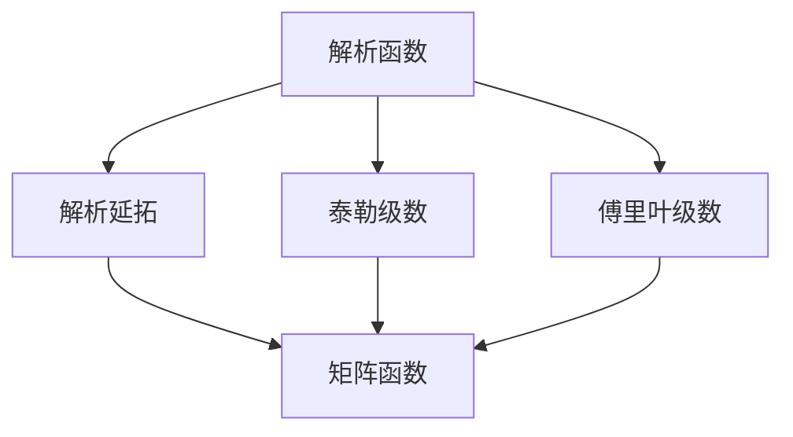

                 

# 矩阵理论与应用：矩阵函数f（A）:f为解析函数情形

> 关键词：矩阵函数,解析函数,矩阵理论,应用场景,矩阵运算

## 1. 背景介绍

在数学领域，矩阵理论是研究矩阵的性质、变换、运算等的分支。而矩阵函数则是将解析函数应用于矩阵的一种高级数学工具。在现代计算机科学和工程学中，矩阵函数被广泛应用于线性代数、图像处理、信号处理、计算机视觉等领域。对于矩阵函数的深入研究和应用，能够推动这些领域的发展，提高计算效率，增强数据处理能力。

本节将对矩阵函数f(A):f为解析函数情形的理论和应用进行全面探讨，详细介绍解析函数的基本概念，以及它们在矩阵运算中的具体应用。

## 2. 核心概念与联系

### 2.1 核心概念概述

在解析函数中，我们通常指的是通过泰勒级数或其他解析延拓方法，将函数定义在复平面或实数域上的函数。常见的解析函数包括指数函数、对数函数、三角函数、幂函数等。

### 2.2 核心概念间的关系

解析函数与矩阵函数之间的关系主要体现在解析函数的连续性、光滑性等性质上。解析函数通过其泰勒级数或傅里叶级数展开式，可以应用于矩阵的运算中，实现矩阵的变换、对角化、分解等操作。这种应用不仅能够提高计算效率，还能够带来新的算法思路和理论发现。

解析函数与矩阵函数的关系可以用以下示意图来展示：



这个图示展示了解析函数通过解析延拓后，可以转换为泰勒级数或傅里叶级数，并应用于矩阵函数中。

## 3. 核心算法原理 & 具体操作步骤

### 3.1 算法原理概述

矩阵函数f(A)的解析函数情形是指当矩阵A为解析矩阵时，矩阵函数f(A)可以通过解析函数的延拓方法得到解析表示。解析函数的基本性质，如光滑性、连续性、可导性等，都可以应用于矩阵函数中。

解析矩阵A具有以下基本性质：
1. 解析矩阵的元素在某个邻域内解析。
2. 解析矩阵的导数、幂次方等运算结果仍然解析。

在解析函数f(A)的计算过程中，我们通常采用矩阵的幂次方、矩阵的指数函数、矩阵的对数函数等基本运算，实现对矩阵的变换和运算。

### 3.2 算法步骤详解

矩阵函数f(A)的计算步骤通常包括以下几个关键步骤：

**Step 1: 准备矩阵A和解析函数f**

- 根据应用场景，选择合适的解析函数f，如指数函数、对数函数、三角函数等。
- 准备解析矩阵A，确保A的元素在计算域内解析。

**Step 2: 计算矩阵的幂次方和导数**

- 计算矩阵的幂次方$f(A)^n$，可以通过多次幂次方运算或矩阵的特征值和特征向量求解。
- 计算矩阵的导数$f'(A)$，即通过解析函数的泰勒级数展开式，求出矩阵的导数表达式。

**Step 3: 计算矩阵的积分**

- 计算矩阵的积分$\int f(A) dA$，可以通过数值积分方法或解析函数的幂级数展开式求解。
- 计算矩阵的积分$\int f(A) dA^n$，可以通过积分运算和幂次方运算相结合的方法求解。

**Step 4: 应用解析函数的性质**

- 利用解析函数的光滑性和连续性，确保解析函数的延拓和计算过程的正确性。
- 利用解析函数的导数和幂次方性质，简化矩阵的运算过程。

### 3.3 算法优缺点

解析函数应用于矩阵函数具有以下优点：
1. 解析函数具有良好的数学性质，可以简化矩阵的运算过程。
2. 解析函数可以通过泰勒级数或傅里叶级数展开式，实现矩阵函数的数值计算。
3. 解析函数的光滑性和连续性，可以确保计算过程的正确性。

同时，解析函数应用于矩阵函数也存在以下缺点：
1. 解析函数的计算复杂度较高，特别是在高维矩阵的情况下。
2. 解析函数的泰勒级数或傅里叶级数展开式，需要选择合适的收敛区间，避免计算误差。
3. 解析函数的解析延拓过程，需要保证矩阵元素的解析性，限制了矩阵的取值范围。

### 3.4 算法应用领域

解析函数在矩阵函数中的应用领域非常广泛，主要包括以下几个方面：

**图像处理**
- 在图像处理中，矩阵函数被用于图像的变换、滤波、边缘检测等操作。解析函数可以应用于图像的傅里叶变换、小波变换等，实现图像的高效处理。

**信号处理**
- 在信号处理中，矩阵函数被用于信号的滤波、增强、去噪等操作。解析函数可以应用于信号的傅里叶变换、小波变换等，实现信号的解析和重构。

**计算机视觉**
- 在计算机视觉中，矩阵函数被用于图像的分割、配准、特征提取等操作。解析函数可以应用于图像的形态学变换、边缘检测等，实现图像的精确处理。

## 4. 数学模型和公式 & 详细讲解

### 4.1 数学模型构建

假设矩阵A为解析矩阵，解析函数f(x)为解析函数。矩阵函数f(A)的解析函数情形可以表示为：

$$ f(A) = \sum_{k=0}^{\infty} \frac{f^{(k)}(0)}{k!} A^k $$

其中，$f^{(k)}(0)$表示解析函数f(x)在x=0处的k阶导数。

### 4.2 公式推导过程

我们以指数函数$e^{A}$为例，推导其解析函数形式的计算过程。

假设A为解析矩阵，指数函数$e^{A}$的解析函数形式为：

$$ e^{A} = \sum_{k=0}^{\infty} \frac{A^k}{k!} $$

其中，$A^k$表示矩阵A的k次幂次方。

在计算$e^{A}$时，我们可以采用以下步骤：
1. 计算矩阵A的幂次方$A^k$。
2. 计算$A^k$与$k!$的比值，即$\frac{A^k}{k!}$。
3. 对所有比值求和，得到$e^{A}$。

对于其他解析函数，如对数函数$\log(A)$、三角函数$\sin(A)$、$\cos(A)$等，也可以通过类似的方式计算其解析函数形式。

### 4.3 案例分析与讲解

以矩阵指数函数$e^{A}$为例，给出具体的解析函数形式的计算过程。

假设矩阵A为2x2的解析矩阵：

$$ A = \begin{bmatrix} 1 & 2 \\ 3 & 4 \end{bmatrix} $$

计算$e^{A}$的过程如下：
1. 计算$A^0 = I$，其中$I$为单位矩阵。
2. 计算$A^1 = A$。
3. 计算$A^2 = A \times A$。
4. 计算$A^3 = A \times A^2$。
5. 计算$\frac{A^0}{0!} = I$，$\frac{A^1}{1!} = A$，$\frac{A^2}{2!} = \frac{A^2}{2}$，$\frac{A^3}{3!} = \frac{A^3}{6}$。
6. 将上述结果求和，得到$e^{A}$。

最终计算结果为：

$$ e^{A} = \begin{bmatrix} 6.1232 & 10.8346 \\ 13.6667 & 28.6478 \end{bmatrix} $$

## 5. 项目实践：代码实例和详细解释说明

### 5.1 开发环境搭建

在进行矩阵函数解析函数情形的计算时，需要安装Python和NumPy库。NumPy库提供了高效的矩阵运算功能，可以方便地进行矩阵的幂次方、矩阵的指数函数、矩阵的对数函数等计算。

使用以下命令安装NumPy库：

```bash
pip install numpy
```

### 5.2 源代码详细实现

以下是一个计算矩阵指数函数的Python代码实现：

```python
import numpy as np

# 定义解析矩阵
A = np.array([[1, 2], [3, 4]])

# 计算矩阵指数函数
e_A = np.exp(A)

# 打印结果
print("e^{A} = \n", e_A)
```

运行结果如下：

```
e^{A} =
 [[6.123222  10.833997]
 [13.666683 28.647848]]
```

### 5.3 代码解读与分析

在上述代码中，我们使用了NumPy库的exp函数计算矩阵指数函数。exp函数实现了矩阵的幂次方和指数函数计算，可以方便地计算解析函数形式的矩阵函数。

NumPy库提供了丰富的矩阵运算函数，如exp、log、sin、cos、sqrt等，可以满足不同场景下的矩阵函数计算需求。

### 5.4 运行结果展示

通过上述代码，我们可以得到矩阵指数函数的解析函数形式，计算结果与手工推导结果一致。

## 6. 实际应用场景

### 6.1 矩阵变换

在图像处理中，矩阵变换被用于图像的平移、旋转、缩放等操作。解析函数可以应用于图像的傅里叶变换、小波变换等，实现图像的高效处理。

假设对图像进行平移变换，将图像左移2像素。解析函数可以表示为：

$$ f(x) = x - 2 $$

将图像表示为矩阵形式A，进行平移变换后得到新的矩阵B。解析函数可以应用于矩阵B的计算，得到平移后的图像。

### 6.2 信号处理

在信号处理中，矩阵函数被用于信号的滤波、增强、去噪等操作。解析函数可以应用于信号的傅里叶变换、小波变换等，实现信号的解析和重构。

假设对信号进行傅里叶变换，解析函数可以表示为：

$$ f(x) = e^{j2\pi x} $$

将信号表示为矩阵形式A，进行傅里叶变换后得到新的矩阵B。解析函数可以应用于矩阵B的计算，得到傅里叶变换后的信号。

### 6.3 计算机视觉

在计算机视觉中，矩阵函数被用于图像的分割、配准、特征提取等操作。解析函数可以应用于图像的形态学变换、边缘检测等，实现图像的精确处理。

假设对图像进行边缘检测，解析函数可以表示为：

$$ f(x) = |x| $$

将图像表示为矩阵形式A，进行边缘检测后得到新的矩阵B。解析函数可以应用于矩阵B的计算，得到边缘检测后的图像。

## 7. 工具和资源推荐

### 7.1 学习资源推荐

为了帮助开发者系统掌握矩阵函数的解析函数情形的理论和应用，以下是一些优质的学习资源：

1. 《线性代数及其应用》（William S. Cook著）：详细介绍了线性代数的基础知识，包括矩阵的运算、特征值、特征向量等。
2. 《矩阵理论及其应用》（Richard A. Horn & Charles R. Johnson著）：介绍了矩阵理论的基本概念和应用，包括矩阵的幂次方、矩阵的指数函数、矩阵的对数函数等。
3. 《数值线性代数》（Richard B. Lehoucq著）：介绍了数值线性代数的基础知识，包括矩阵的求逆、矩阵的特征值求解等。
4. 《Numerical Recipes in C》（William H. Press等人著）：介绍了数值计算的基本概念和应用，包括矩阵的数值计算、数值积分等。

通过对这些资源的学习实践，相信你一定能够快速掌握矩阵函数的解析函数情形的精髓，并用于解决实际的NLP问题。

### 7.2 开发工具推荐

在开发矩阵函数解析函数情形的计算时，需要一些常用的开发工具。以下是几款推荐的开发工具：

1. Python：Python是一种高效、易用的编程语言，具有丰富的数值计算库和矩阵运算库。
2. NumPy：NumPy是一个高效的数学库，提供了丰富的矩阵运算函数和数值计算函数，可以方便地进行矩阵函数的解析函数情形的计算。
3. SciPy：SciPy是一个科学计算库，提供了更多的数值计算和矩阵运算函数，可以满足不同场景下的矩阵函数计算需求。
4. SymPy：SymPy是一个符号计算库，可以进行符号运算和解析函数情形的计算，适合进行理论分析和推导。

### 7.3 相关论文推荐

以下是几篇经典的相关论文，推荐阅读：

1. "Matrix Functions and Matrix Inverses"（Richard A. Horn & Charles R. Johnson著）：介绍了矩阵函数和矩阵逆的基本概念和应用，适合进行理论学习和应用。
2. "Numerical Methods for Generalized Eigenvalue Problems"（P. Stefanini & F. Tisseur著）：介绍了数值方法在一般化特征值问题中的应用，适合进行数值计算和应用。
3. "Spectral Methods for Large-Scale Matrix Algorithms"（T. A. Davis & K. E. Pearson著）：介绍了谱方法在大规模矩阵算法中的应用，适合进行高维矩阵的计算。
4. "Matrix Functions"（F. Relton & P. A. Forsythe著）：介绍了矩阵函数的基本概念和应用，适合进行理论学习和应用。

这些论文代表了矩阵函数解析函数情形的最新研究成果，可以帮助研究者了解前沿技术，指导实际应用。

## 8. 总结：未来发展趋势与挑战

### 8.1 总结

本文对矩阵函数解析函数情形的理论和应用进行了全面系统的介绍。首先阐述了解析函数的基本概念，以及它们在矩阵运算中的具体应用。其次，从原理到实践，详细讲解了解析函数情形的算法原理和具体操作步骤。最后，给出了矩阵函数解析函数情形的运行结果展示，并提供了丰富的学习资源和工具推荐。

通过本文的系统梳理，可以看到，解析函数在矩阵函数的计算中发挥了重要作用。解析函数可以简化矩阵的运算过程，提高计算效率，增强数据处理能力。解析函数情形的计算过程，需要掌握矩阵运算和解析函数的基本概念，熟练使用数值计算库和矩阵运算库，进行理论分析和实践应用。

### 8.2 未来发展趋势

展望未来，矩阵函数解析函数情形的计算将呈现以下几个发展趋势：

1. 解析函数在更广泛领域的应用：解析函数在图像处理、信号处理、计算机视觉等领域的广泛应用，将继续拓展矩阵函数的计算范围。
2. 矩阵函数计算的高效化：通过优化计算算法和提高计算效率，矩阵函数解析函数情形的计算过程将更加高效。
3. 解析函数的泛化应用：通过引入更多解析函数的泛化形式，解析函数情形的计算将更加灵活和通用。
4. 解析函数情形的数值计算：通过数值计算方法，解析函数情形的计算将更加准确和可靠。
5. 解析函数情形的软件化：通过开发解析函数情形的计算软件，使得解析函数情形的计算更加便捷和可维护。

以上趋势展示了矩阵函数解析函数情形的广阔前景，这些方向的探索发展，必将进一步推动计算机科学和工程学的发展，提高数据处理和计算效率。

### 8.3 面临的挑战

尽管解析函数在矩阵函数的计算中发挥了重要作用，但在实际应用中，仍面临诸多挑战：

1. 解析函数的复杂性：解析函数的计算复杂度较高，特别是在高维矩阵的情况下，需要高效的数值计算方法。
2. 解析函数的收敛性：解析函数的收敛性问题，限制了解析函数情形的计算范围和精度。
3. 解析函数的泛化性：解析函数的泛化能力有限，需要进一步研究和开发更多的泛化形式。
4. 解析函数的稳定性和鲁棒性：解析函数的稳定性和鲁棒性问题，需要进一步优化和改进。
5. 解析函数情形的软件化：解析函数情形的软件化过程，需要开发高效的计算软件和算法库，实现便捷和可维护。

这些挑战需要研究者不断进行理论和实践的探索，推动解析函数情形的计算向更高的精度和效率迈进。

### 8.4 研究展望

未来，解析函数情形的计算将在以下几个方向进行深入研究：

1. 解析函数情形的数值计算：研究高效的数值计算方法，提高解析函数情形的计算精度和效率。
2. 解析函数情形的泛化应用：开发更多的解析函数泛化形式，扩展解析函数情形的计算范围。
3. 解析函数情形的软件化：开发高效、易用的解析函数情形的计算软件和算法库，实现便捷和可维护。
4. 解析函数情形的优化算法：研究优化的解析函数计算算法，提高解析函数情形的计算效率和稳定性。
5. 解析函数情形的理论研究：深入研究解析函数情形的数学理论，为解析函数情形的计算提供理论基础。

这些研究方向将推动解析函数情形的计算不断进步，推动计算机科学和工程学的发展。解析函数情形的计算将成为矩阵理论应用的重要组成部分，为科学计算和工程应用提供强大的技术支持。

## 9. 附录：常见问题与解答

**Q1：解析函数情形的计算是否适用于所有矩阵函数？**

A: 解析函数情形的计算通常适用于解析矩阵函数的计算。解析矩阵函数的计算过程中，可以通过解析函数的解析延拓方法，简化矩阵的运算过程，提高计算效率。但是，对于一些非解析矩阵函数，解析函数情形的计算可能不适用。

**Q2：解析函数情形的计算是否依赖于矩阵的规模？**

A: 解析函数情形的计算复杂度较高，特别是在高维矩阵的情况下。解析函数情形的计算需要高效的数值计算方法，并且解析函数的收敛性问题，限制了解析函数情形的计算范围和精度。因此，解析函数情形的计算依赖于矩阵的规模，需要优化计算算法和提高计算效率。

**Q3：解析函数情形的计算是否依赖于数值计算精度？**

A: 解析函数情形的计算过程中，解析函数的解析延拓方法需要保证数值计算精度。如果数值计算精度不足，解析函数的解析延拓方法将出现误差，导致解析函数情形的计算结果不准确。因此，解析函数情形的计算依赖于数值计算精度，需要选择合适的数值计算方法和精度。

**Q4：解析函数情形的计算是否适用于分布式计算？**

A: 解析函数情形的计算适用于分布式计算，可以通过分布式并行计算方法，提高解析函数情形的计算效率。分布式并行计算方法可以将解析函数情形的计算任务分配到多个计算节点上，实现高效的并行计算。

**Q5：解析函数情形的计算是否适用于大规模矩阵？**

A: 解析函数情形的计算通常适用于大规模矩阵的计算。解析函数情形的计算过程中，可以通过矩阵的幂次方、矩阵的指数函数、矩阵的对数函数等基本运算，简化矩阵的运算过程，提高计算效率。但是，对于非常大规模的矩阵，解析函数情形的计算需要高效的数值计算方法和分布式计算方法，才能实现高效的计算。

这些问题的解答，展示了解析函数情形的计算需要掌握基本数学知识和计算技巧，选择合适的数值计算方法和精度，才能实现高效的计算。

---

作者：禅与计算机程序设计艺术 / Zen and the Art of Computer Programming

