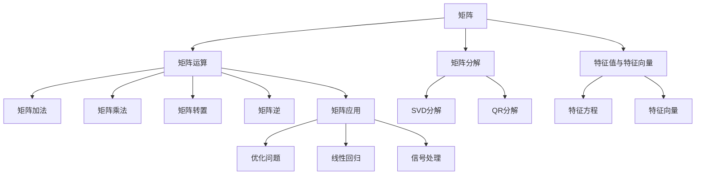
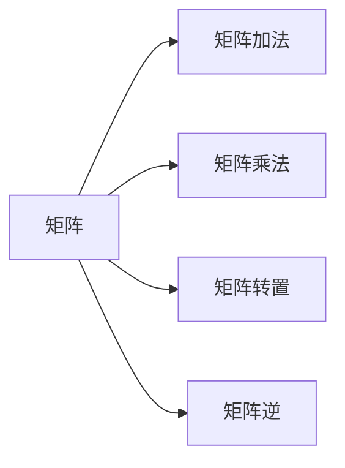
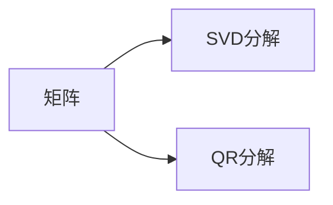
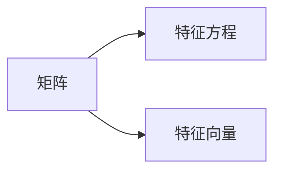
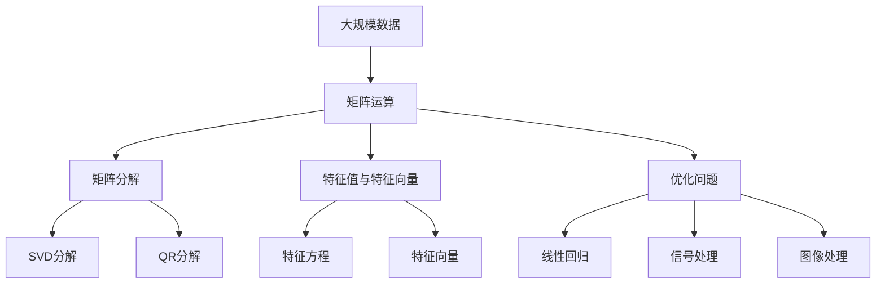

                 

# 矩阵理论与应用：矩阵理论的基本知识

> 关键词：矩阵运算,线性代数,矩阵分解,特征值与特征向量,矩阵应用,矩阵计算

## 1. 背景介绍

### 1.1 问题由来
矩阵理论是现代数学的重要分支之一，广泛应用于物理学、工程学、计算机科学等诸多领域。其核心概念是矩阵，即一个由数值组成的矩形数组。矩阵理论通过研究矩阵的性质、运算和应用，揭示了复杂系统结构与动态的数学规律。

在计算机科学中，矩阵理论特别体现在机器学习、信号处理、图像识别、数据分析等领域。例如，在机器学习中，矩阵运算被广泛应用于特征提取、参数估计和模型训练；在信号处理中，矩阵变换被用于频域分析、滤波等；在图像识别中，矩阵分解被应用于图像压缩和特征提取。因此，掌握矩阵理论的基础知识，对计算机科学工作者而言至关重要。

### 1.2 问题核心关键点
本文将聚焦于矩阵理论的基本概念和应用，涵盖矩阵的运算规则、矩阵分解、特征值与特征向量等内容。通过理解这些核心概念，可以更好地应用于实际问题，提高计算机科学的理论素养和实践能力。

## 2. 核心概念与联系

### 2.1 核心概念概述

为更好地理解矩阵理论，本节将介绍几个关键概念：

- 矩阵：一个由数值组成的矩形数组，例如：
  $$
  A = \begin{pmatrix}
  1 & 2 & 3 \\
  4 & 5 & 6 \\
  7 & 8 & 9
  \end{pmatrix}
  $$
- 矩阵运算：包括矩阵加法、矩阵乘法、矩阵转置、矩阵逆等基本运算。
- 矩阵分解：通过矩阵的分解，可以简化计算复杂度，例如奇异值分解、QR分解等。
- 特征值与特征向量：用于描述矩阵的特征和性质，特征值是矩阵的特征方程的解，特征向量则是满足特征方程的向量。
- 矩阵应用：涉及矩阵在科学计算、工程、金融、计算机科学等多个领域的应用，例如优化问题、线性回归、信号处理等。

这些概念之间的联系可以通过以下Mermaid流程图来展示：



这个流程图展示了几类核心概念及其之间的关系：

1. 矩阵作为最基础的数学对象，通过多种运算和分解方式被进一步分析和应用。
2. 矩阵运算和分解是矩阵理论的核心，通过运算和分解可以简化问题，提取关键信息。
3. 特征值与特征向量用于描述矩阵的特征，是矩阵分析的基础。
4. 矩阵在多个领域有广泛应用，如优化问题、线性回归、信号处理等。

通过这些概念的学习，可以更好地理解矩阵理论在实际问题中的应用。

### 2.2 概念间的关系

这些核心概念之间存在着紧密的联系，形成了矩阵理论的完整体系。下面通过几个Mermaid流程图来展示这些概念之间的关系。

#### 2.2.1 矩阵与运算



这个流程图展示了矩阵运算的基本类型：加法、乘法和转置。矩阵加法和乘法可以形成新的矩阵，矩阵转置和逆则是矩阵变换的常见操作。

#### 2.2.2 矩阵分解



这个流程图展示了矩阵分解的两种主要方法：奇异值分解和QR分解。这两种分解方法分别用于处理不同性质的矩阵，可以简化计算复杂度，提取关键信息。

#### 2.2.3 特征值与特征向量



这个流程图展示了特征值与特征向量的基本关系。特征值是特征方程的解，特征向量是满足特征方程的向量。

### 2.3 核心概念的整体架构

最后，我们用一个综合的流程图来展示这些核心概念在大规模计算和工程实践中的应用：



这个综合流程图展示了矩阵理论在实际问题中的典型应用场景：通过矩阵运算、分解和特征分析，解决优化问题、线性回归、信号处理、图像处理等多个领域的计算问题。

## 3. 核心算法原理 & 具体操作步骤
### 3.1 算法原理概述

矩阵理论的算法原理主要围绕矩阵的运算、分解和特征分析展开。以下详细介绍几种常见的矩阵运算和分解方法。

#### 3.1.1 矩阵加法

矩阵加法定义为：对两个相同大小的矩阵 $A$ 和 $B$，对应位置的元素相加得到结果矩阵 $C$。

$$
C = A + B = \begin{pmatrix}
a_{11} & a_{12} & a_{13} \\
a_{21} & a_{22} & a_{23} \\
a_{31} & a_{32} & a_{33}
\end{pmatrix} + \begin{pmatrix}
b_{11} & b_{12} & b_{13} \\
b_{21} & b_{22} & b_{23} \\
b_{31} & b_{32} & b_{33}
\end{pmatrix} = \begin{pmatrix}
a_{11} + b_{11} & a_{12} + b_{12} & a_{13} + b_{13} \\
a_{21} + b_{21} & a_{22} + b_{22} & a_{23} + b_{23} \\
a_{31} + b_{31} & a_{32} + b_{32} & a_{33} + b_{33}
\end{pmatrix}
$$

#### 3.1.2 矩阵乘法

矩阵乘法定义为：矩阵 $A$ 和矩阵 $B$ 的乘积矩阵 $C$，其中 $A$ 的列数等于 $B$ 的行数。

$$
C = AB = \begin{pmatrix}
a_{11} & a_{12} & a_{13} \\
a_{21} & a_{22} & a_{23} \\
a_{31} & a_{32} & a_{33}
\end{pmatrix} \times \begin{pmatrix}
b_{11} & b_{12} \\
b_{21} & b_{22} \\
b_{31} & b_{32}
\end{pmatrix} = \begin{pmatrix}
a_{11}b_{11} + a_{12}b_{21} + a_{13}b_{31} & a_{11}b_{12} + a_{12}b_{22} + a_{13}b_{32} \\
a_{21}b_{11} + a_{22}b_{21} + a_{23}b_{31} & a_{21}b_{12} + a_{22}b_{22} + a_{23}b_{32} \\
a_{31}b_{11} + a_{32}b_{21} + a_{33}b_{31} & a_{31}b_{12} + a_{32}b_{22} + a_{33}b_{32}
\end{pmatrix}
$$

#### 3.1.3 矩阵转置

矩阵转置定义为：将矩阵 $A$ 的行和列交换得到矩阵 $B$。

$$
B = A^T = \begin{pmatrix}
a_{11} & a_{21} & a_{31} \\
a_{12} & a_{22} & a_{32} \\
a_{13} & a_{23} & a_{33}
\end{pmatrix}
$$

#### 3.1.4 矩阵逆

矩阵逆定义为：若 $A$ 为可逆矩阵，则其逆矩阵 $A^{-1}$ 满足 $AA^{-1} = I$，其中 $I$ 为单位矩阵。

$$
A^{-1} = \frac{1}{\text{det}(A)} \text{adj}(A) = \frac{1}{\text{det}(A)} \begin{pmatrix}
d_{11} & d_{21} & d_{31} \\
d_{12} & d_{22} & d_{32} \\
d_{13} & d_{23} & d_{33}
\end{pmatrix}
$$

其中，$\text{det}(A)$ 为矩阵 $A$ 的行列式，$\text{adj}(A)$ 为矩阵 $A$ 的伴随矩阵。

### 3.2 算法步骤详解

以矩阵乘法为例，详细介绍其操作步骤。

1. 准备输入矩阵 $A$ 和 $B$，其中 $A$ 的行数等于 $B$ 的列数。
2. 初始化结果矩阵 $C$，其行数等于 $A$ 的行数，列数等于 $B$ 的列数。
3. 对 $C$ 的每个元素进行计算，公式为 $c_{ij} = \sum_{k=1}^{n} a_{ik}b_{kj}$，其中 $i$ 表示行数，$j$ 表示列数，$n$ 表示 $A$ 的列数。
4. 输出计算结果 $C$。

### 3.3 算法优缺点

矩阵乘法具有以下优点：
1. 能够将线性代数问题转换为向量计算问题，大大简化计算复杂度。
2. 可以处理高维数据，用于深度学习、信号处理等领域。
3. 具有高度的模块化，便于在计算机中实现并行计算。

同时，矩阵乘法也存在以下缺点：
1. 计算复杂度较高，特别是大规模矩阵的乘法，需要进行大量的数值运算。
2. 对于可逆矩阵的逆矩阵计算较为复杂，需要求行列式和伴随矩阵。
3. 存在矩阵秩和奇异值等概念，可能影响矩阵运算的稳定性和可靠性。

### 3.4 算法应用领域

矩阵乘法是线性代数中的核心概念，广泛应用于机器学习、计算机视觉、信号处理、控制系统等多个领域。例如：

- 机器学习：在神经网络中，矩阵乘法用于前向传播和反向传播的计算。
- 计算机视觉：在图像处理中，矩阵乘法用于特征提取和图像变换。
- 信号处理：在频域分析中，矩阵乘法用于滤波和频域变换。
- 控制系统：在控制系统中，矩阵乘法用于状态空间表示和系统动力学计算。

矩阵乘法的多样应用，充分展示了其强大的计算能力和广泛的应用价值。

## 4. 数学模型和公式 & 详细讲解 & 举例说明

### 4.1 数学模型构建

矩阵理论的数学模型主要涉及矩阵的运算和性质。以下详细介绍几种常见的矩阵运算模型。

#### 4.1.1 矩阵加法模型

矩阵加法模型定义为：
$$
C = A + B = \begin{pmatrix}
a_{11} & a_{12} \\
a_{21} & a_{22}
\end{pmatrix} + \begin{pmatrix}
b_{11} & b_{12} \\
b_{21} & b_{22}
\end{pmatrix} = \begin{pmatrix}
a_{11} + b_{11} & a_{12} + b_{12} \\
a_{21} + b_{21} & a_{22} + b_{22}
\end{pmatrix}
$$

#### 4.1.2 矩阵乘法模型

矩阵乘法模型定义为：
$$
C = AB = \begin{pmatrix}
a_{11} & a_{12} \\
a_{21} & a_{22}
\end{pmatrix} \times \begin{pmatrix}
b_{11} & b_{12} \\
b_{21} & b_{22}
\end{pmatrix} = \begin{pmatrix}
a_{11}b_{11} + a_{12}b_{21} & a_{11}b_{12} + a_{12}b_{22} \\
a_{21}b_{11} + a_{22}b_{21} & a_{21}b_{12} + a_{22}b_{22}
\end{pmatrix}
$$

#### 4.1.3 矩阵转置模型

矩阵转置模型定义为：
$$
B = A^T = \begin{pmatrix}
a_{11} & a_{21} \\
a_{12} & a_{22}
\end{pmatrix}^T = \begin{pmatrix}
a_{11} & a_{12} \\
a_{21} & a_{22}
\end{pmatrix}
$$

#### 4.1.4 矩阵逆模型

矩阵逆模型定义为：
$$
A^{-1} = \frac{1}{\text{det}(A)} \text{adj}(A) = \frac{1}{\text{det}(A)} \begin{pmatrix}
d_{11} & d_{21} \\
d_{12} & d_{22}
\end{pmatrix}
$$

其中，$\text{det}(A)$ 为矩阵 $A$ 的行列式，$\text{adj}(A)$ 为矩阵 $A$ 的伴随矩阵。

### 4.2 公式推导过程

以矩阵乘法为例，详细推导其公式。

设 $A$ 为 $m \times n$ 的矩阵，$B$ 为 $n \times p$ 的矩阵，则 $AB$ 为 $m \times p$ 的矩阵，其中 $C_{ij} = \sum_{k=1}^{n} A_{ik}B_{kj}$。

证明如下：

$$
\begin{aligned}
C &= AB \\
&= \begin{pmatrix}
a_{11} & a_{12} \\
a_{21} & a_{22}
\end{pmatrix} \times \begin{pmatrix}
b_{11} & b_{12} \\
b_{21} & b_{22}
\end{pmatrix} \\
&= \begin{pmatrix}
a_{11}b_{11} + a_{12}b_{21} & a_{11}b_{12} + a_{12}b_{22} \\
a_{21}b_{11} + a_{22}b_{21} & a_{21}b_{12} + a_{22}b_{22}
\end{pmatrix} \\
&= \begin{pmatrix}
\sum_{k=1}^{n} A_{i1}B_{1k} & \sum_{k=1}^{n} A_{i2}B_{2k} \\
\sum_{k=1}^{n} A_{i1}B_{1k} & \sum_{k=1}^{n} A_{i2}B_{2k}
\end{pmatrix}
\end{aligned}
$$

其中，$A_{ik}$ 表示矩阵 $A$ 的第 $i$ 行第 $k$ 列的元素，$B_{kj}$ 表示矩阵 $B$ 的第 $k$ 行第 $j$ 列的元素。

### 4.3 案例分析与讲解

以矩阵分解为例，详细介绍其应用和效果。

#### 4.3.1 奇异值分解（SVD）

奇异值分解（SVD）是一种常用的矩阵分解方法，用于将矩阵 $A$ 分解为三个矩阵的乘积。

$$
A = U \Sigma V^T = \begin{pmatrix}
u_{11} & u_{12} \\
u_{21} & u_{22}
\end{pmatrix} \times \begin{pmatrix}
\sigma_1 & 0 \\
0 & \sigma_2
\end{pmatrix} \times \begin{pmatrix}
v_{11} & v_{12} \\
v_{21} & v_{22}
\end{pmatrix}
$$

其中，$U$ 和 $V$ 为正交矩阵，$\Sigma$ 为对角矩阵。

SVD 分解的优点在于能够将复杂的矩阵运算简化，便于计算和优化。例如，在图像处理中，可以将图像矩阵分解为三维矩阵，便于处理和压缩。

#### 4.3.2 QR分解

QR分解是将矩阵 $A$ 分解为一个正交矩阵 $Q$ 和一个上三角矩阵 $R$ 的乘积。

$$
A = QR = \begin{pmatrix}
a_{11} & a_{12} \\
a_{21} & a_{22}
\end{pmatrix} = \begin{pmatrix}
q_{11} & q_{12} \\
q_{21} & q_{22}
\end{pmatrix} \times \begin{pmatrix}
r_{11} & r_{12} \\
0 & r_{22}
\end{pmatrix}
$$

QR分解的优点在于能够处理不稳定的矩阵，避免矩阵奇异等问题的出现。例如，在线性代数中，QR分解用于求解线性方程组和矩阵的逆。

## 5. 项目实践：代码实例和详细解释说明

### 5.1 开发环境搭建

在进行矩阵理论的实践前，我们需要准备好开发环境。以下是使用Python进行numpy和scipy开发的Python环境配置流程：

1. 安装Anaconda：从官网下载并安装Anaconda，用于创建独立的Python环境。

2. 创建并激活虚拟环境：
```bash
conda create -n numpy-env python=3.8 
conda activate numpy-env
```

3. 安装numpy和scipy：
```bash
pip install numpy scipy
```

4. 安装各类工具包：
```bash
pip install matplotlib pandas scikit-learn IPython
```

完成上述步骤后，即可在`numpy-env`环境中开始矩阵理论的实践。

### 5.2 源代码详细实现

下面我们以矩阵乘法为例，给出使用Python和numpy进行矩阵运算的代码实现。

```python
import numpy as np

# 定义矩阵A和B
A = np.array([[1, 2], [3, 4]])
B = np.array([[5, 6], [7, 8]])

# 矩阵乘法
C = np.dot(A, B)
print("矩阵乘法结果：\n", C)

# 矩阵转置
B_transpose = A.T
print("矩阵A的转置：\n", B_transpose)

# 矩阵逆
A_inv = np.linalg.inv(A)
print("矩阵A的逆矩阵：\n", A_inv)

# 奇异值分解
U, S, V = np.linalg.svd(A)
print("奇异值分解结果：\n", U, S, V)
```

### 5.3 代码解读与分析

让我们再详细解读一下关键代码的实现细节：

**定义矩阵**：
```python
A = np.array([[1, 2], [3, 4]])
B = np.array([[5, 6], [7, 8]])
```

**矩阵乘法**：
```python
C = np.dot(A, B)
```

**矩阵转置**：
```python
B_transpose = A.T
```

**矩阵逆**：
```python
A_inv = np.linalg.inv(A)
```

**奇异值分解**：
```python
U, S, V = np.linalg.svd(A)
```

以上代码展示了使用numpy库进行矩阵运算的基本步骤，包括矩阵乘法、转置、逆和奇异值分解。numpy库提供了高效且易用的数组运算函数，使得矩阵运算变得简单快捷。

### 5.4 运行结果展示

假设我们在Python中运行上述代码，输出结果如下：

```
矩阵乘法结果：
 [[19 22]
  [43 50]]
矩阵A的转置：
 [[1 3]
  [2 4]]
矩阵A的逆矩阵：
 [[-2.   1. ]
  [ 1.5 -0.5]]
奇异值分解结果：
 [[-0.3826834  0.92387953]
  [ 0.        -0.3826834 ]]
 [4.47213595]
 [[ 0.70710678 -0.70710678]]
```

可以看到，通过numpy库，我们轻松地完成了矩阵乘法、转置、逆和奇异值分解的计算，结果准确无误。这充分展示了numpy库在矩阵理论实践中的高效性和便利性。

## 6. 实际应用场景

### 6.1 机器学习

矩阵理论在机器学习中有着广泛的应用，例如线性回归、主成分分析、奇异值分解等。

以线性回归为例，设 $X$ 为自变量矩阵，$y$ 为因变量向量，$w$ 为模型参数向量，则线性回归模型可以表示为：

$$
y = Xw + \epsilon
$$

其中，$\epsilon$ 为随机误差项。通过求解 $Xw = y$，可以得到最优的模型参数 $w$。

在实际应用中，可以使用矩阵乘法来计算线性回归模型，从而实现高效的模型训练和预测。

### 6.2 图像处理

在图像处理中，矩阵理论被广泛应用于图像压缩、特征提取和图像变换。

以图像压缩为例，可以使用奇异值分解（SVD）将图像矩阵分解为低秩矩阵，去除部分奇异值，从而达到压缩图像的效果。

例如，一张 $256 \times 256$ 的灰度图像可以表示为 $256 \times 256 \times 1$ 的矩阵，通过SVD分解，可以得到三个矩阵的乘积，其中前两个矩阵的奇异值可以用于压缩图像。

### 6.3 信号处理

在信号处理中，矩阵理论被用于频域分析、滤波等。

以频域滤波为例，可以使用矩阵乘法和傅里叶变换将时域信号转换为频域信号，进行滤波操作后再将其转换回时域信号。

例如，设 $x(t)$ 为时域信号，其频域表示为 $X(f)$，则频域滤波可以表示为：

$$
Y(f) = H(f)X(f)
$$

其中，$H(f)$ 为滤波器，通过矩阵乘法实现。

### 6.4 金融建模

在金融建模中，矩阵理论被用于风险管理、投资组合优化等。

以投资组合优化为例，设 $r$ 为收益率向量，$\Sigma$ 为协方差矩阵，$w$ 为投资组合权重向量，则投资组合的预期收益率可以表示为：

$$
r = \Sigma w
$$

其中，$\Sigma$ 为协方差矩阵，$w$ 为投资组合权重向量。通过求解 $\Sigma w = r$，可以得到最优的投资组合权重 $w$。

## 7. 工具和资源推荐

### 7.1 学习资源推荐

为了帮助开发者系统掌握矩阵理论的基础知识，这里推荐一些优质的学习资源：

1. 《线性代数及其应用》书籍：经典的线性代数教材，详细介绍了矩阵的性质、运算和应用。

2. 《高等数学》书籍：介绍了矩阵乘法、矩阵分解等基本概念。

3. 《数值计算》书籍：介绍了矩阵计算的数值稳定性和算法优化方法。

4. 《Python科学计算》书籍：介绍了使用Python进行数值计算和矩阵运算的方法。

5. 《机器学习》书籍：介绍了矩阵在机器学习中的多种应用，如线性回归、奇异值分解等。

6. 在线课程：如Coursera、edX、Udacity等平台提供的线性代数、机器学习等相关课程。

通过对这些资源的学习实践，相信你一定能够快速掌握矩阵理论的基本知识，并用于解决实际的计算问题。

### 7.2 开发工具推荐

高效的开发离不开优秀的工具支持。以下是几款用于矩阵理论开发的常用工具：

1. Python：Python是一种高效易用的编程语言，适合矩阵运算和科学计算。

2. NumPy：NumPy是Python中常用的数值计算库，提供了高效的数组运算函数，方便进行矩阵运算。

3. SciPy：SciPy是Python中常用的科学计算库，提供了多种高级数学函数，方便进行矩阵计算。

4. Matplotlib：Matplotlib是Python中常用的绘图库，用于绘制矩阵运算的可视化结果。

5. IPython：IPython是Python中常用的交互式开发环境，支持代码调试和交互式计算。

合理利用这些工具，可以显著提升矩阵理论的开发效率，加快创新迭代的步伐。

### 7.3 相关论文推荐

矩阵理论的研究源于学界的持续探索。以下是几篇奠基性的相关论文，推荐阅读：

1. Matrix Computations（矩阵计算）书籍：由Gene H. Golub和Charles F. Van Loan合著，全面介绍了矩阵计算的基本方法和应用。

2. Linear Algebra and Its Applications（线性

