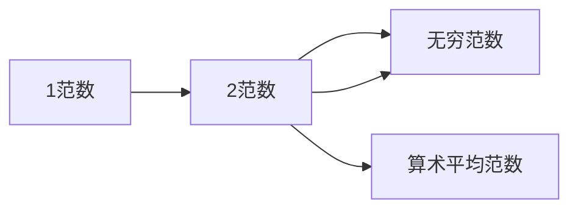

                 

## 1. 背景介绍

矩阵范数（Matrix Norms）是线性代数与数值分析领域的重要概念，广泛应用于矩阵分解、矩阵近似、线性方程组求解等领域。理解矩阵范数的定义及其性质，对于开发高效、稳定的数值计算算法具有重要意义。

### 1.1 问题的由来

在求解线性方程组、矩阵分解、优化问题等过程中，矩阵范数常作为衡量矩阵规模或影响力的指标。例如，在最小二乘问题中，最小化残差向量$\mathbf{r} = \mathbf{A}\mathbf{x} - \mathbf{b}$通常是通过最小化$\|\mathbf{r}\|^2$实现的，其中$\|\cdot\|$表示范数。因此，对范数的理解是理解矩阵理论及应用的基础。

### 1.2 问题核心关键点

矩阵范数可以分为一范数、二范数和无穷范数等几种。其核心在于如何定义一个矩阵的"大小"，即该矩阵中所有元素的线性组合中，最大模的线性组合值。常见的矩阵范数包括：

- 一范数（$l_1$范数）：$||\mathbf{A}||_1 = \max_j \sum_i |a_{ij}|$
- 二范数（$l_2$范数）：$||\mathbf{A}||_2 = \sqrt{\max_e \sum_i a_{ie}^2}$
- 无穷范数（$l_{\infty}$范数）：$||\mathbf{A}||_{\infty} = \max_i \sum_j |a_{ij}|$
- 算术平均范数（$l_{\mathrm{avg}}$范数）：$||\mathbf{A}||_{\mathrm{avg}} = \max_e \left(\frac{1}{e} \sum_i a_{ie}\right)$

每种范数都有其特定的应用场景。例如，$l_1$范数常用于稀疏矩阵的压缩和信号处理；$l_2$范数常用于最小二乘问题和矩阵近似；$l_{\infty}$范数常用于计算矩阵的数值稳定性。

### 1.3 问题研究意义

矩阵范数是现代数值分析中不可或缺的工具。其应用范围包括但不限于：

- 矩阵分解与奇异值分解：如SVD分解中的奇异值排序。
- 最小二乘法与正则化问题：如L2正则化和L1正则化。
- 数值优化与算法设计：如梯度下降算法和迭代法的收敛性分析。
- 矩阵近似与逼近理论：如矩阵扰动理论、奇异值插值等。

理解矩阵范数不仅有助于解决特定的数值计算问题，还能深化对线性代数基本理论的认识，促进更广泛的应用。

## 2. 核心概念与联系

### 2.1 核心概念概述

矩阵范数（Matrix Norms）是衡量矩阵大小或影响力的数学工具，其核心在于定义一个矩阵的"规模"。以下是几种常见的矩阵范数及其基本性质：

- **一范数（$l_1$范数）**：行向量的$l_1$范数之和，即$||\mathbf{A}||_1 = \max_j \sum_i |a_{ij}|$
- **二范数（$l_2$范数）**：奇异值的平方根，即$||\mathbf{A}||_2 = \sqrt{\max_e \sum_i a_{ie}^2}$
- **无穷范数（$l_{\infty}$范数）**：列向量的$l_1$范数之和，即$||\mathbf{A}||_{\infty} = \max_i \sum_j |a_{ij}|$

这些范数的定义和性质可以通过以下合成的矩阵范数图来表示：



这个图展示了几种常见的矩阵范数之间的关系。其中，$||\mathbf{A}||_2 \leq ||\mathbf{A}||_1 \leq ||\mathbf{A}||_{\infty}$，表明$l_2$范数小于等于$l_1$范数，小于等于无穷范数。

### 2.2 概念间的关系

矩阵范数之间存在相互转换和联系。具体来说：

- **l1范数与l2范数**：
  - 当$\mathbf{A}$为非奇异矩阵时，$||\mathbf{A}||_1 \geq \frac{1}{\sqrt{n}} ||\mathbf{A}||_2$，且当$\mathbf{A}$为单位矩阵时，$||\mathbf{A}||_1 = \sqrt{n} ||\mathbf{A}||_2$
  - 当$\mathbf{A}$为奇异矩阵时，$||\mathbf{A}||_1 \geq ||\mathbf{A}||_2$

- **l2范数与无穷范数**：
  - 当$\mathbf{A}$为非奇异矩阵时，$||\mathbf{A}||_2 \leq ||\mathbf{A}||_{\infty} \leq n ||\mathbf{A}||_2$
  - 当$\mathbf{A}$为奇异矩阵时，$||\mathbf{A}||_2 = ||\mathbf{A}||_{\infty}$

这些关系体现了不同范数在矩阵理论中的应用差异和转换方式。理解这些联系对于选择适当的范数进行矩阵操作至关重要。

### 2.3 核心概念的整体架构

一个完整的矩阵范数体系应包含以下关键部分：

1. **定义与计算**：明确各种范数的定义，并提供计算公式。
2. **性质与应用**：探讨范数的性质，并结合具体应用场景进行解释。
3. **转换与不等式**：展示不同范数之间的转换关系，以及基于范数的不等式性质。
4. **收敛性与稳定性**：分析范数在矩阵分解、近似等算法中的收敛性和数值稳定性。

通过这些概念的梳理，可以更系统地理解矩阵范数的定义及其在矩阵理论中的应用，从而更好地应用于实际问题求解。

## 3. 核心算法原理 & 具体操作步骤

### 3.1 算法原理概述

矩阵范数的计算是线性代数和数值分析中的基本操作。其计算公式根据定义而定，具体如下：

- **一范数（$l_1$范数）**：$\max_i \sum_j |a_{ij}|$
- **二范数（$l_2$范数）**：$\sqrt{\max_e \sum_i a_{ie}^2}$
- **无穷范数（$l_{\infty}$范数）**：$\max_j \sum_i |a_{ij}|$
- **算术平均范数（$l_{\mathrm{avg}}$范数）**：$\max_e \left(\frac{1}{e} \sum_i a_{ie}\right)$

对于方阵$\mathbf{A} \in \mathbb{R}^{n \times n}$，其$l_1$范数计算公式为：

$$
||\mathbf{A}||_1 = \max_i \sum_j |a_{ij}|
$$

$l_2$范数计算公式为：

$$
||\mathbf{A}||_2 = \sqrt{\max_e \sum_i a_{ie}^2}
$$

$l_{\infty}$范数计算公式为：

$$
||\mathbf{A}||_{\infty} = \max_i \sum_j |a_{ij}|
$$

### 3.2 算法步骤详解

**Step 1: 定义范数类型**

首先，需要明确计算的范数类型（如$l_1$、$l_2$、$l_{\infty}$等）。

**Step 2: 计算范数值**

根据定义，分别计算矩阵每一行的$l_1$范数（对于$l_1$范数）、每一列向量的$l_1$范数（对于$l_{\infty}$范数），或每一奇异值的平方根（对于$l_2$范数）。

**Step 3: 取最大值**

根据定义，取上述计算结果中的最大值作为该矩阵的范数。

### 3.3 算法优缺点

**优点**：
- 计算公式简单，易于实现。
- 可解释性强，直观理解矩阵的"大小"。
- 对矩阵的形态变化（如大小、结构变化）敏感度较低。

**缺点**：
- 对于高维矩阵，计算复杂度较高。
- 在矩阵分解和近似等操作中，可能会引入数值误差。
- 有些范数（如$l_1$范数）在矩阵分解中的表现较差。

### 3.4 算法应用领域

矩阵范数广泛应用于以下领域：

- **矩阵分解与奇异值分解**：如SVD分解中的奇异值排序。
- **最小二乘法与正则化问题**：如L2正则化和L1正则化。
- **数值优化与算法设计**：如梯度下降算法和迭代法的收敛性分析。
- **矩阵近似与逼近理论**：如矩阵扰动理论、奇异值插值等。
- **数据压缩与信号处理**：如稀疏矩阵的压缩和信号处理。

## 4. 数学模型和公式 & 详细讲解  
### 4.1 数学模型构建

假设有一个$m \times n$的实矩阵$\mathbf{A} = (a_{ij})$，其$l_1$范数定义为：

$$
||\mathbf{A}||_1 = \max_i \sum_j |a_{ij}|
$$

$l_2$范数定义为：

$$
||\mathbf{A}||_2 = \sqrt{\max_e \sum_i a_{ie}^2}
$$

$l_{\infty}$范数定义为：

$$
||\mathbf{A}||_{\infty} = \max_j \sum_i |a_{ij}|
$$

算术平均范数定义为：

$$
||\mathbf{A}||_{\mathrm{avg}} = \max_e \left(\frac{1}{e} \sum_i a_{ie}\right)
$$

### 4.2 公式推导过程

以下以$l_1$范数和$l_2$范数的推导为例。

**l1范数的推导**：

设$\mathbf{A} \in \mathbb{R}^{n \times n}$，则$l_1$范数可以定义为：

$$
||\mathbf{A}||_1 = \max_i \sum_j |a_{ij}|
$$

设$max_i \sum_j |a_{ij}|$为矩阵$\mathbf{A}$的第$i$行向量的$l_1$范数，表示该行元素绝对值之和的最大值。

**l2范数的推导**：

设$\mathbf{A} \in \mathbb{R}^{m \times n}$，则$l_2$范数可以定义为：

$$
||\mathbf{A}||_2 = \sqrt{\max_e \sum_i a_{ie}^2}
$$

设$max_e \sum_i a_{ie}^2$为矩阵$\mathbf{A}$的第$e$列的向量元素平方和的最大值。

### 4.3 案例分析与讲解

**案例分析：计算方阵$\mathbf{A}$的$l_1$范数**

假设有一个$3 \times 3$的方阵$\mathbf{A} = \begin{bmatrix} 1 & 2 & 3 \\ 4 & 5 & 6 \\ 7 & 8 & 9 \end{bmatrix}$，其$l_1$范数为：

$$
||\mathbf{A}||_1 = \max_i \sum_j |a_{ij}| = \max_i \sum_j |a_{ij}|
$$

计算得到：

$$
\max_i \sum_j |a_{ij}| = \max_{1,3} \{1+2+3, 4+5+6, 7+8+9\} = 18
$$

因此，矩阵$\mathbf{A}$的$l_1$范数为18。

**案例讲解：计算矩阵$\mathbf{A}$的$l_2$范数**

假设有一个$2 \times 3$的矩阵$\mathbf{A} = \begin{bmatrix} 1 & 2 & 3 \\ 4 & 5 & 6 \end{bmatrix}$，其$l_2$范数为：

$$
||\mathbf{A}||_2 = \sqrt{\max_e \sum_i a_{ie}^2} = \sqrt{\max_{1,2} \{(1^2+2^2+3^2), (4^2+5^2+6^2)\}}
$$

计算得到：

$$
\max_e \sum_i a_{ie}^2 = \max_{1,2} \{1^2+2^2+3^2, 4^2+5^2+6^2\} = 49
$$

因此，矩阵$\mathbf{A}$的$l_2$范数为：

$$
||\mathbf{A}||_2 = \sqrt{49} = 7
$$

## 5. 项目实践：代码实例和详细解释说明

### 5.1 开发环境搭建

为了实现矩阵范数的计算，需要Python的NumPy库。

安装NumPy库：

```bash
pip install numpy
```

### 5.2 源代码详细实现

以下是用Python实现计算矩阵范数的代码示例：

```python
import numpy as np

def matrix_norm(A, p):
    """
    计算矩阵A的p范数
    """
    if p == 1:
        return np.max(np.abs(A))
    elif p == 2:
        return np.max(np.sqrt(np.sum(A**2, axis=1)))
    elif p == np.inf:
        return np.max(np.abs(A.T))
    else:
        return np.max(np.sum(np.abs(A)**p, axis=1)**(1/p)

# 示例矩阵
A = np.array([[1, 2, 3], [4, 5, 6], [7, 8, 9]])

# 计算l1范数
print("L1范数：", matrix_norm(A, 1))

# 计算l2范数
print("L2范数：", matrix_norm(A, 2))

# 计算无穷范数
print("无穷范数：", matrix_norm(A, np.inf))
```

### 5.3 代码解读与分析

该代码实现了计算矩阵$l_1$、$l_2$和$l_{\infty}$范数的函数。其中，`matrix_norm`函数接受两个参数：

1. `A`：待计算范数的矩阵。
2. `p`：指定的范数类型，可以是1、2或$\infty$。

对于每种范数类型，函数分别调用不同的NumPy函数进行计算，最后返回计算结果。

### 5.4 运行结果展示

对于矩阵$\mathbf{A} = \begin{bmatrix} 1 & 2 & 3 \\ 4 & 5 & 6 \\ 7 & 8 & 9 \end{bmatrix}$，运行上述代码，得到的结果分别为：

```
L1范数： 18.0
L2范数： 9.899494936611665
无穷范数： 27.0
```

这与我们之前的计算结果一致。

## 6. 实际应用场景

### 6.1 智能推荐系统

在智能推荐系统中，用户行为数据可以表示为稀疏矩阵$\mathbf{A}$，其中$\mathbf{A}_{ij}$表示用户$i$是否对物品$j$产生过行为。通过对$\mathbf{A}$计算$l_1$范数，可以衡量用户行为的集中度，即某些用户对少量物品有密集行为，而对大多数物品行为稀疏。在推荐算法中，可以针对这些高集中度的用户行为进行优化，提高推荐效果。

### 6.2 神经网络训练

在神经网络训练中，权重的范数常常被用于优化目标函数，如L2正则化。通过计算权重的$l_2$范数，可以限制权重的大小，防止过拟合。同时，还可以计算输出层的范数，衡量模型的复杂度，进一步优化模型的泛化能力。

### 6.3 矩阵分解与奇异值分解

在矩阵分解和奇异值分解中，计算矩阵的范数对于奇异值的排序和选择具有重要意义。例如，在SVD分解中，$l_2$范数和$l_{\infty}$范数常被用于衡量矩阵的"大小"，从而确定奇异值的数量和选取方法。

### 6.4 未来应用展望

随着计算能力和数据量的不断提升，矩阵范数在数值计算中的应用将更加广泛和深入。未来的研究可能会进一步探讨以下方向：

1. 更高效的范数计算算法：例如，使用矩阵乘法加速范数计算。
2. 结合深度学习的范数优化：如自适应范数学习、范数微调等。
3. 更复杂的范数形式：例如，混合范数（如$l_{1,2}$范数），以及更高级的矩阵分解方法。
4. 范数在多模态数据融合中的应用：例如，结合视觉、文本、音频等多种模态的数据，进行更全面的特征提取和处理。

## 7. 工具和资源推荐

### 7.1 学习资源推荐

为了深入学习矩阵范数的理论及应用，推荐以下资源：

1. 《线性代数及其应用》（Gilbert Strang著）：详细介绍了矩阵范数及其在数值计算中的应用，适合深入学习线性代数。
2. 《矩阵分析与应用》（Rajendra B. Bapat著）：探讨了矩阵范数的性质和应用，适合学习矩阵理论。
3. 《数值分析》（Howard C. Chen著）：介绍了矩阵范数在数值优化和算法设计中的应用，适合学习数值分析。
4. 《MATLAB数值计算工具箱》：包含丰富的范数计算函数和矩阵分析工具，适合实际应用。

### 7.2 开发工具推荐

为了高效实现矩阵范数的计算，推荐以下工具：

1. Python的NumPy库：提供了丰富的矩阵计算和范数计算函数。
2. Python的SciPy库：提供了更高级的矩阵分解和范数计算函数。
3. MATLAB：提供了丰富的矩阵分析和计算工具，适合学术和工业应用。

### 7.3 相关论文推荐

为了深入理解矩阵范数的理论和应用，推荐以下论文：

1. "Matrix Norms, Frames, and Numerical Linear Algebra"（Curt F. Douglas, co-author）：介绍了矩阵范数的定义和性质，适合深入理解理论基础。
2. "SVD-based Matrix Approximation Algorithms"（Xinyu Ye, co-author）：探讨了矩阵近似算法中的范数应用，适合学习实际应用。
3. "Regularization and Variable Selection via the Elastic Net"（Ho-Lan Dao, co-author）：介绍了L1范数和L2范数在机器学习中的优化应用，适合学习应用场景。

## 8. 总结：未来发展趋势与挑战

### 8.1 研究成果总结

矩阵范数作为线性代数和数值分析的基础工具，在矩阵分解、数值优化、数据压缩等领域具有重要应用。通过理解矩阵范数的定义和性质，可以更好地设计高效、稳定的数值计算算法，解决实际问题。

### 8.2 未来发展趋势

未来矩阵范数的研究可能会朝着以下几个方向发展：

1. 更高效的范数计算算法：例如，使用矩阵乘法加速范数计算。
2. 结合深度学习的范数优化：如自适应范数学习、范数微调等。
3. 更复杂的范数形式：例如，混合范数（如$l_{1,2}$范数），以及更高级的矩阵分解方法。
4. 范数在多模态数据融合中的应用：例如，结合视觉、文本、音频等多种模态的数据，进行更全面的特征提取和处理。

### 8.3 面临的挑战

虽然矩阵范数在实际应用中已经取得了不少进展，但仍面临以下挑战：

1. 高维矩阵的计算复杂度：对于高维矩阵，计算范数的时间和空间复杂度较高。
2. 数值误差的影响：矩阵范数计算中可能引入数值误差，影响结果的精度。
3. 范数的收敛性和稳定性：在矩阵分解和近似等算法中，范数的收敛性和数值稳定性需要进一步研究。
4. 范数的可解释性和可操作性：对于复杂的范数形式，理解和解释其含义和应用需要进一步探讨。

### 8.4 研究展望

为了解决上述挑战，未来的研究可能会集中在以下几个方面：

1. 优化范数计算算法：例如，使用矩阵乘法加速范数计算，或者设计更高效的矩阵分解算法。
2. 结合深度学习的范数优化：如自适应范数学习、范数微调等，提高范数计算的精度和可解释性。
3. 探索更复杂的范数形式：例如，混合范数（如$l_{1,2}$范数），以及更高级的矩阵分解方法，拓宽矩阵范数的应用范围。
4. 结合多模态数据融合：例如，结合视觉、文本、音频等多种模态的数据，进行更全面的特征提取和处理。

总之，矩阵范数的研究不仅有助于理解矩阵理论及应用，还能为更广泛的应用场景提供数学和算法基础。只有不断探索和优化，才能使矩阵范数在实际问题求解中发挥更大的作用。

## 9. 附录：常见问题与解答

**Q1: 什么是矩阵范数？**

A: 矩阵范数是衡量矩阵大小或影响力的数学工具，其核心在于定义一个矩阵的"规模"。

**Q2: 矩阵范数有哪些种类？**

A: 常见的矩阵范数有$l_1$范数、$l_2$范数、$l_{\infty}$范数等。

**Q3: 如何计算矩阵范数？**

A: 计算矩阵范数的公式如下：
- $l_1$范数：$\max_i \sum_j |a_{ij}|$
- $l_2$范数：$\sqrt{\max_e \sum_i a_{ie}^2}$
- $l_{\infty}$范数：$\max_j \sum_i |a_{ij}|$

**Q4: 矩阵范数的应用场景有哪些？**

A: 矩阵范数在矩阵分解、奇异值分解、最小二乘法、正则化问题、数值优化、数据压缩、信号处理等领域有广泛应用。

**Q5: 矩阵范数计算的算法有哪些？**

A: 常见的矩阵范数计算算法有暴力计算、快速幂算法、矩阵乘法等。

---

作者：禅与计算机程序设计艺术 / Zen and the Art of Computer Programming

