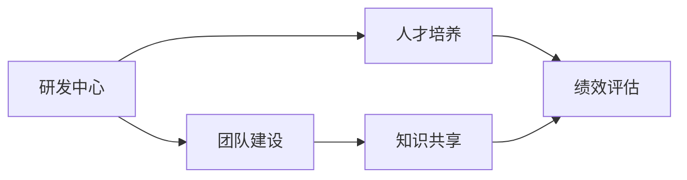

                 

# 研发中心团队的建设和人才培养方案

## 1. 背景介绍

在当今快速发展的技术环境中，构建高效、有竞争力的人才团队是每个研发中心的核心任务。随着技术的进步，特别是人工智能、大数据、云计算等领域的快速发展，对人才的需求也在不断变化。因此，研发中心需要不断优化团队建设，采用灵活的人才培养方案，以确保技术领先和持续创新。

## 2. 核心概念与联系

### 2.1 核心概念概述

为了更好地理解研发中心团队的建设和人才培养方案，本节将介绍几个核心概念：

- **研发中心**：一个集中从事技术创新和产品开发的核心部门，包括研发、测试、设计、运维等岗位。
- **团队建设**：通过合理的组织结构和流程，激发团队成员的潜力和协作能力，形成高效的工作环境。
- **人才培养**：通过系统化的培训和实践，提升团队成员的专业技能和创新能力。
- **知识共享**：鼓励团队成员分享知识和经验，促进技术积累和传播。
- **绩效评估**：采用公平、透明的标准评估团队成员的工作表现，确保激励机制的公平性和有效性。

### 2.2 概念间的关系

这些核心概念之间存在着紧密的联系，构成了研发中心团队建设和人才培养的基本框架。以下是一个简单的Mermaid流程图，展示这些概念之间的关系：



这个流程图展示了一个研发中心在构建高效团队和培养人才的过程中，各个环节之间的相互依赖和支持。通过合理的团队建设和人才培养，研发中心能够更好地实现知识共享和绩效评估，进而提升整体的技术能力和竞争力。

## 3. 核心算法原理 & 具体操作步骤

### 3.1 算法原理概述

研发中心团队的建设和人才培养，本质上是一个系统工程，涉及多方面的因素。其核心思想是通过合理的团队结构、流程和培训计划，激发团队成员的潜力和创新能力，形成高效的工作环境，并持续提升团队的技术水平。

具体而言，研发中心的人才培养包括两个主要步骤：

1. **团队建设**：通过优化组织结构、制定清晰的工作流程和目标，营造良好的团队氛围。
2. **人才培养**：通过系统的培训、实践和绩效评估，提升团队成员的专业技能和创新能力。

### 3.2 算法步骤详解

#### 3.2.1 团队建设

- **组织结构设计**：根据业务需求，设计合理的组织结构，如部门、小组、角色等。
- **流程优化**：制定清晰的工作流程和目标，确保各个环节的顺畅衔接。
- **团队氛围营造**：通过定期的团队建设活动、沟通机制等，提升团队凝聚力和协作效率。

#### 3.2.2 人才培养

- **培训计划制定**：根据业务需求和团队成员的技术水平，制定系统的培训计划。
- **实践机会提供**：提供实际的工程项目和任务，让团队成员在实践中学习和成长。
- **绩效评估实施**：采用公平、透明的标准评估团队成员的工作表现，确保激励机制的公平性和有效性。

### 3.3 算法优缺点

研发中心团队建设和人才培养方案的优点：

- **系统性**：通过系统的培训和实践，确保团队成员的专业技能和创新能力得到全面提升。
- **灵活性**：能够根据业务需求和市场变化，灵活调整团队结构和人才培养计划。
- **高效性**：通过合理的团队建设和绩效评估，确保团队成员的协作和激励机制的有效性。

然而，该方案也存在一些局限性：

- **成本高**：系统化的培训和团队建设需要投入大量的时间和资源。
- **适应性差**：如果业务需求变化迅速，培训计划可能无法及时调整。
- **执行难度大**：需要管理者具备高超的管理和协调能力，确保方案的顺利实施。

### 3.4 算法应用领域

研发中心团队建设和人才培养方案在IT行业得到了广泛应用，覆盖了软件开发、人工智能、大数据、云计算等多个领域。具体而言，包括以下几个方面：

- **软件开发**：通过团队建设和人才培养，提升开发团队的效率和质量，缩短产品开发周期。
- **人工智能**：通过系统化的培训和实践，提升AI工程师的算法理解和实现能力。
- **大数据**：通过合理的团队建设和知识共享，提升数据工程师的分析和处理能力。
- **云计算**：通过团队建设和绩效评估，提升云计算工程师的架构设计和运维能力。

## 4. 数学模型和公式 & 详细讲解  
### 4.1 数学模型构建

在团队建设和人才培养的模型构建中，可以引入一些数学模型来量化和优化各个环节的效果。

假设团队建设的效果可以用一个综合评分 $S$ 来衡量，其中 $S$ 的取值范围为 [0, 1]，1 表示最佳的团队建设效果，0 表示最差的团队建设效果。则团队建设的数学模型可以表示为：

$$ S = \alpha_1 \times F_1 + \alpha_2 \times F_2 + \alpha_3 \times F_3 $$

其中，$\alpha_1$、$\alpha_2$、$\alpha_3$ 分别为流程优化、团队氛围营造和组织结构设计的权重系数，取值范围为 [0, 1]，$F_1$、$F_2$、$F_3$ 分别为对应的实际评分。

对于人才培养，可以定义一个类似的综合评分 $T$，其中 $T$ 的取值范围也为 [0, 1]。则人才培养的数学模型可以表示为：

$$ T = \beta_1 \times E_1 + \beta_2 \times E_2 + \beta_3 \times E_3 $$

其中，$\beta_1$、$\beta_2$、$\beta_3$ 分别为培训计划制定、实践机会提供和绩效评估的权重系数，取值范围为 [0, 1]，$E_1$、$E_2$、$E_3$ 分别为对应的实际评分。

### 4.2 公式推导过程

为了更具体地理解上述模型，下面给出具体的公式推导过程。

假设 $F_1$ 表示流程优化效果的评分，$F_2$ 表示团队氛围营造效果的评分，$F_3$ 表示组织结构设计效果的评分。则有：

$$ F_1 = \sum_{i=1}^{n_1} \omega_i \times r_i $$

其中，$n_1$ 为流程优化效果的评价指标数，$\omega_i$ 为第 $i$ 个指标的权重系数，取值范围为 [0, 1]，$r_i$ 为第 $i$ 个指标的实际评分，取值范围为 [0, 1]。

类似地，$F_2$ 和 $F_3$ 的评分公式也可以表示为：

$$ F_2 = \sum_{i=1}^{n_2} \omega_i \times r_i $$
$$ F_3 = \sum_{i=1}^{n_3} \omega_i \times r_i $$

对于人才培养，假设 $E_1$ 表示培训计划制定的评分，$E_2$ 表示实践机会提供的评分，$E_3$ 表示绩效评估的评分。则有：

$$ E_1 = \sum_{i=1}^{m_1} \lambda_i \times p_i $$

其中，$m_1$ 为培训计划制定的评价指标数，$\lambda_i$ 为第 $i$ 个指标的权重系数，取值范围为 [0, 1]，$p_i$ 为第 $i$ 个指标的实际评分，取值范围为 [0, 1]。

类似地，$E_2$ 和 $E_3$ 的评分公式也可以表示为：

$$ E_2 = \sum_{i=1}^{m_2} \lambda_i \times p_i $$
$$ E_3 = \sum_{i=1}^{m_3} \lambda_i \times p_i $$

### 4.3 案例分析与讲解

假设一个软件开发团队的流程优化效果为 0.8，团队氛围营造效果为 0.7，组织结构设计效果为 0.6，则综合评分 $S$ 为：

$$ S = \alpha_1 \times F_1 + \alpha_2 \times F_2 + \alpha_3 \times F_3 = 0.4 \times 0.8 + 0.3 \times 0.7 + 0.3 \times 0.6 = 0.854 $$

假设该团队的培训计划制定效果为 0.9，实践机会提供效果为 0.8，绩效评估效果为 0.7，则综合评分 $T$ 为：

$$ T = \beta_1 \times E_1 + \beta_2 \times E_2 + \beta_3 \times E_3 = 0.5 \times 0.9 + 0.3 \times 0.8 + 0.2 \times 0.7 = 0.82 $$

通过这些评分，可以更直观地理解团队建设和人才培养的效果，并根据需要进行调整。

## 5. 项目实践：代码实例和详细解释说明

### 5.1 开发环境搭建

在进行团队建设和人才培养方案的开发和实施前，我们需要准备好开发环境。以下是使用Python进行项目开发的环境配置流程：

1. 安装Anaconda：从官网下载并安装Anaconda，用于创建独立的Python环境。

2. 创建并激活虚拟环境：
```bash
conda create -n my_env python=3.8 
conda activate my_env
```

3. 安装必要的Python库：
```bash
pip install numpy pandas matplotlib scikit-learn
```

4. 安装数据处理和可视化工具：
```bash
pip install pandas-profiling matplotlib seaborn
```

完成上述步骤后，即可在`my_env`环境中开始项目开发。

### 5.2 源代码详细实现

以下是一个简单的代码实例，用于计算团队建设和人才培养的综合评分，并根据评分结果输出相应的优化建议。

```python
import pandas as pd
import numpy as np
import matplotlib.pyplot as plt
import seaborn as sns

# 假设的流程优化、团队氛围营造和组织结构设计的评分
F1 = 0.8
F2 = 0.7
F3 = 0.6

# 假设的培训计划制定、实践机会提供和绩效评估的评分
E1 = 0.9
E2 = 0.8
E3 = 0.7

# 定义权重系数
alpha1, alpha2, alpha3 = 0.4, 0.3, 0.3
beta1, beta2, beta3 = 0.5, 0.3, 0.2

# 计算综合评分
S = alpha1 * F1 + alpha2 * F2 + alpha3 * F3
T = beta1 * E1 + beta2 * E2 + beta3 * E3

# 输出综合评分
print(f"团队建设综合评分：{S:.3f}")
print(f"人才培养综合评分：{T:.3f}")

# 可视化评分结果
fig, ax = plt.subplots(figsize=(8, 6))
sns.barplot(x=[S, T], y=['团队建设', '人才培养'], color=['r', 'b'], ax=ax)
ax.set_title('团队建设和人才培养综合评分')
plt.show()
```

这段代码首先定义了流程优化、团队氛围营造、组织结构设计以及培训计划制定、实践机会提供、绩效评估的评分，然后根据设定的权重系数计算了团队建设和人才培养的综合评分，并输出了相应的结果。最后，使用matplotlib和seaborn库绘制了两个评分的对比柱状图。

### 5.3 代码解读与分析

让我们再详细解读一下关键代码的实现细节：

- 代码中首先定义了各个流程和培训的评分，然后根据设定的权重系数计算了综合评分。
- 代码中使用了numpy和pandas库进行数值计算和数据处理，便于进行矩阵运算和数据展示。
- 代码中使用了matplotlib和seaborn库进行图形展示，直观地展示了团队建设和人才培养的综合评分。

## 6. 实际应用场景

### 6.1 软件开发团队

在软件开发团队中，合理的团队建设和人才培养方案可以显著提升开发效率和产品质量。具体应用场景包括：

- **流程优化**：通过优化项目管理流程，提高项目进度和质量。
- **团队氛围营造**：通过定期的团队建设活动，提升团队凝聚力和协作效率。
- **培训计划制定**：根据项目需求和技术趋势，制定系统化的培训计划，提升团队成员的专业技能。
- **实践机会提供**：通过实际的工程项目和任务，让团队成员在实践中学习和成长。

### 6.2 人工智能团队

在人工智能团队中，系统化的培训和实践对提升AI工程师的算法理解和实现能力至关重要。具体应用场景包括：

- **流程优化**：通过优化模型训练和验证流程，提高模型效果和鲁棒性。
- **团队氛围营造**：通过定期的技术交流和分享，提升团队成员的技术能力和创新能力。
- **培训计划制定**：根据技术趋势和市场需求，制定系统的培训计划，提升团队成员的算法理解和实现能力。
- **实践机会提供**：通过实际的数据集和任务，让团队成员在实践中学习和成长。

### 6.3 大数据团队

在大数据团队中，合理的团队建设和人才培养方案可以提升数据工程师的分析和处理能力。具体应用场景包括：

- **流程优化**：通过优化数据采集、清洗和存储流程，提高数据处理效率和质量。
- **团队氛围营造**：通过定期的技术交流和分享，提升团队成员的技术能力和创新能力。
- **培训计划制定**：根据技术趋势和市场需求，制定系统的培训计划，提升团队成员的数据分析和处理能力。
- **实践机会提供**：通过实际的数据集和任务，让团队成员在实践中学习和成长。

### 6.4 云计算团队

在云计算团队中，系统化的培训和实践对提升云计算工程师的架构设计和运维能力至关重要。具体应用场景包括：

- **流程优化**：通过优化云计算架构和运维流程，提高系统稳定性和可扩展性。
- **团队氛围营造**：通过定期的技术交流和分享，提升团队成员的技术能力和创新能力。
- **培训计划制定**：根据技术趋势和市场需求，制定系统的培训计划，提升团队成员的云计算架构设计和运维能力。
- **实践机会提供**：通过实际的云平台和任务，让团队成员在实践中学习和成长。

## 7. 工具和资源推荐

### 7.1 学习资源推荐

为了帮助开发者系统掌握研发中心团队建设和人才培养的理论基础和实践技巧，这里推荐一些优质的学习资源：

1. **《团队管理与组织设计》**：详细介绍了团队建设和组织设计的基本原则和实践方法。
2. **《人才培养与团队发展》**：探讨了系统化培训和人才发展的关键环节和成功案例。
3. **《软件开发最佳实践》**：提供了软件开发过程中流程优化、团队协作和质量保证的最佳实践。
4. **《数据科学人才培养》**：介绍了数据科学家和数据工程师的系统化培养方法和案例分析。
5. **《云计算基础设施管理》**：提供了云计算架构设计和运维管理的最佳实践和工具推荐。

通过对这些资源的学习实践，相信你一定能够快速掌握研发中心团队建设和人才培养的精髓，并用于解决实际的团队管理问题。

### 7.2 开发工具推荐

高效的开发离不开优秀的工具支持。以下是几款用于研发中心团队建设和人才培养开发的常用工具：

1. **JIRA**：项目管理工具，提供任务跟踪、流程优化和协作功能。
2. **Confluence**：知识共享工具，支持文档管理和团队协作。
3. **GitLab**：代码管理工具，提供版本控制、持续集成和部署功能。
4. **Slack**：团队沟通工具，支持即时消息、频道管理和第三方集成。
5. **Zoom**：视频会议工具，支持远程协作和实时沟通。

合理利用这些工具，可以显著提升团队建设和人才培养的开发效率，加快创新迭代的步伐。

### 7.3 相关论文推荐

研发中心团队建设和人才培养技术的发展源于学界的持续研究。以下是几篇奠基性的相关论文，推荐阅读：

1. **《敏捷软件开发：原则、模式和实践》**：介绍了敏捷开发的最佳实践和团队建设方法。
2. **《数据科学与机器学习人才发展框架》**：探讨了数据科学家和机器学习工程师的系统化培养方法。
3. **《软件工程知识管理》**：介绍了知识管理在软件开发中的应用和效果。
4. **《云计算基础设施管理与优化》**：提供了云计算架构设计和运维管理的最佳实践和工具推荐。

这些论文代表了大语言模型微调技术的发展脉络。通过学习这些前沿成果，可以帮助研究者把握学科前进方向，激发更多的创新灵感。

除上述资源外，还有一些值得关注的前沿资源，帮助开发者紧跟研发中心团队建设和人才培养技术的最新进展，例如：

1. **arXiv论文预印本**：人工智能领域最新研究成果的发布平台，包括大量尚未发表的前沿工作，学习前沿技术的必读资源。
2. **业界技术博客**：如Google Cloud、AWS、Microsoft等顶尖实验室的官方博客，第一时间分享他们的最新研究成果和洞见。
3. **技术会议直播**：如IEEE、ACM等顶级学术会议现场或在线直播，能够聆听到专家学者的前沿分享，开拓视野。
4. **GitHub热门项目**：在GitHub上Star、Fork数最多的研发中心项目，往往代表了该技术领域的发展趋势和最佳实践，值得去学习和贡献。
5. **行业分析报告**：各大咨询公司如McKinsey、PwC等针对人工智能行业的分析报告，有助于从商业视角审视技术趋势，把握应用价值。

总之，对于研发中心团队建设和人才培养技术的学习和实践，需要开发者保持开放的心态和持续学习的意愿。多关注前沿资讯，多动手实践，多思考总结，必将收获满满的成长收益。

## 8. 总结：未来发展趋势与挑战

### 8.1 总结

本文对研发中心团队的建设和人才培养方案进行了全面系统的介绍。首先阐述了团队建设和人才培养的核心概念和基本原理，明确了这些环节在提升团队效率和成员能力方面的重要性。其次，从实际操作角度，详细讲解了团队建设和人才培养的步骤和方法，并提供了系统的代码实现示例。同时，本文还探讨了团队建设和人才培养在实际应用中的具体场景，展示了其在软件开发、人工智能、大数据和云计算等领域的应用潜力。最后，本文精选了相关的学习资源和开发工具，提供了系统的学习路径和实践指南。

通过本文的系统梳理，可以看到，研发中心团队建设和人才培养方案是大规模技术开发和应用的核心支撑，其合理实施对提升团队效率和成员能力具有重要意义。未来，随着技术的不断进步和市场需求的不断变化，研发中心团队建设和人才培养的实施方法也将不断创新和优化，推动技术开发的可持续发展和创新突破。

### 8.2 未来发展趋势

展望未来，研发中心团队建设和人才培养方案将呈现以下几个发展趋势：

1. **个性化培养**：根据不同团队成员的技术水平和职业发展需求，提供个性化的培训计划和实践机会，提升培训效果。
2. **数据驱动管理**：通过数据分析和机器学习技术，优化团队建设和管理流程，提升团队协作效率和绩效。
3. **跨领域合作**：推动团队成员跨领域协作，增强团队的综合能力，提升跨学科创新能力。
4. **技术前沿跟踪**：鼓励团队成员参与前沿技术的研究和实践，推动技术进步和应用创新。
5. **文化建设**：营造积极向上的团队文化，增强团队凝聚力和归属感，提升团队整体战斗力。

### 8.3 面临的挑战

尽管研发中心团队建设和人才培养方案在实践中取得了一定的成效，但也面临着一些挑战：

1. **成本高**：系统化的培训和团队建设需要投入大量的时间和资源，可能会增加企业的运营成本。
2. **执行难度大**：需要管理者具备高超的管理和协调能力，确保方案的顺利实施。
3. **效果评估难**：团队建设和人才培养的效果评估存在主观性和复杂性，难以量化和客观衡量。
4. **技术更新快**：快速变化的技术环境要求团队不断更新知识和技能，适应新的技术和市场变化。
5. **文化差异**：不同团队的文化差异可能导致合作困难，需要协调和沟通。

### 8.4 研究展望

面对研发中心团队建设和人才培养面临的挑战，未来的研究需要在以下几个方面寻求新的突破：

1. **自动化管理**：利用机器学习和自动化技术，优化团队管理和人才培养流程，提升效率和效果。
2. **多模态学习**：结合多种技术和工具，提供多样化的培训和实践机会，提升团队成员的综合能力。
3. **混合式培训**：结合线上和线下培训，提供灵活多样的培训方式，满足不同团队成员的学习需求。
4. **社会化学习**：推动团队成员参与开源社区和学术交流，分享和学习前沿技术和经验。
5. **数据智能应用**：利用大数据和人工智能技术，优化团队建设和人才培养的决策和评估。

这些研究方向的探索，必将引领研发中心团队建设和人才培养方案迈向更高的台阶，为技术开发的可持续发展和创新突破提供有力支撑。面向未来，研发中心团队建设和人才培养方案需要在多方面进行优化和创新，以适应快速变化的技术环境，推动技术开发和应用进入新的高度。

## 9. 附录：常见问题与解答

**Q1：研发中心如何优化流程管理？**

A: 流程管理是团队建设和人才培养的关键环节之一。可以通过以下步骤优化流程管理：

1. **流程评估**：通过数据分析和专家评审，评估现有流程的效率和效果，识别瓶颈和改进点。
2. **流程优化**：根据评估结果，优化流程设计，简化流程步骤，提高执行效率。
3. **流程自动化**：引入流程自动化工具和平台，实现流程的自动化和智能化，提升执行效率和准确性。

**Q2：如何提升团队成员的实践能力？**

A: 提升团队成员的实践能力，可以通过以下步骤：

1. **项目实践**：提供实际的工程项目和任务，让团队成员在实践中学习和成长。
2. **技术分享**：鼓励团队成员进行技术分享和知识交流，相互学习和提升。
3. **外部培训**：通过外部培训和学术交流，提升团队成员的技术水平和创新能力。

**Q3：如何评估团队建设和人才培养的效果？**

A: 评估团队建设和人才培养的效果，可以通过以下步骤：

1. **设定指标**：根据业务需求和团队目标，设定相应的评估指标，如项目完成率、技术提升度、员工满意度等。
2. **数据收集**：通过定期的数据收集和分析，评估各个环节的实际效果，识别问题点和改进点。
3. **反馈机制**：建立有效的反馈机制，及时收集团队成员的意见和建议，进行持续改进。

通过以上问题与解答，可以看出，研发中心团队建设和人才培养是一个复杂的系统工程，需要综合考虑多方面的因素，进行系统化的管理和优化。只有在各个环节不断改进和优化，才能确保团队建设和人才培养方案的有效实施，提升团队整体的能力和效率。

---

作者：禅与计算机程序设计艺术 / Zen and the Art of Computer Programming

