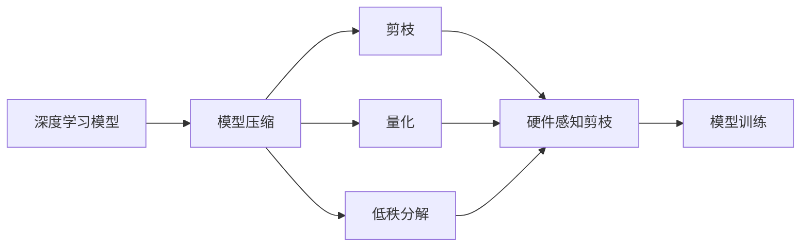
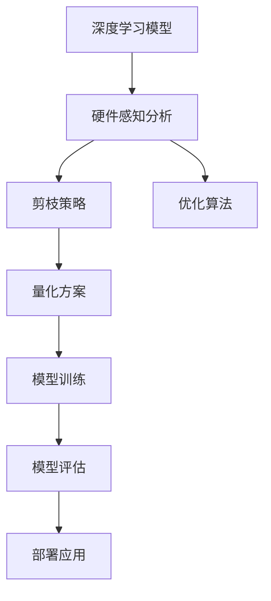
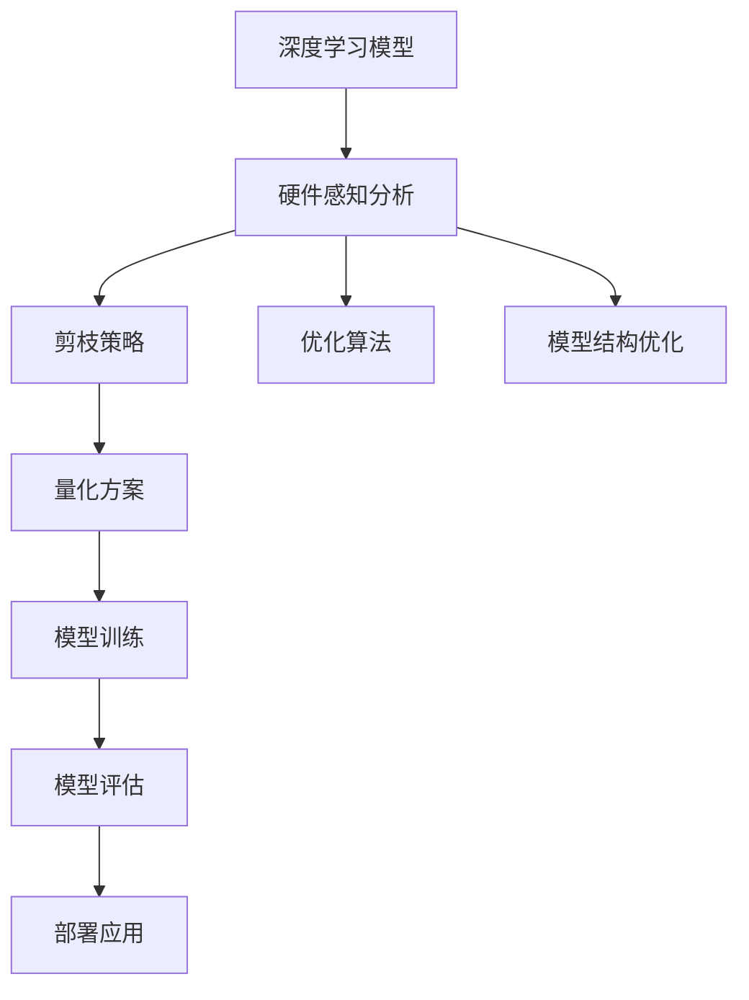

                 

## 1. 背景介绍

### 1.1 问题由来
随着深度学习模型的日益庞大和复杂，计算资源的需求也随之激增。特别是在移动设备、嵌入式系统等资源受限的计算平台上，高效、低能耗的模型压缩技术显得尤为重要。传统的深度学习压缩方法，如剪枝和量化，通常基于模型结构和参数的统计特性进行。然而，这些方法难以充分利用计算平台特定的架构特性，导致压缩后模型的计算效率和能耗仍然不尽人意。

为了进一步提升模型在特定硬件平台上的性能，硬件感知剪枝应运而生。这种技术不仅考虑模型的结构和参数特性，还深入分析计算平台硬件特性，进行更加精确的压缩和优化，从而在保持模型性能的同时，大幅度降低计算资源需求。

### 1.2 问题核心关键点
硬件感知剪枝的关键在于精确识别和优化计算平台上的硬件瓶颈，进行有针对性的压缩。具体来说，可以分为以下几个步骤：

1. 分析计算平台的硬件特性，如CPU/GPU架构、内存带宽、IO接口等，识别出模型运行中的硬件瓶颈。
2. 针对硬件瓶颈，采用不同的剪枝策略和量化方案，优化模型的计算资源占用。
3. 结合模型结构优化，对剪枝和量化后的模型进行后续训练和优化，进一步提升模型性能。

这些关键点共同构成了硬件感知剪枝的核心原理和技术路径，使其能够在不同计算平台上，实现高效、低能耗的模型压缩。

### 1.3 问题研究意义
硬件感知剪枝技术的研究，对于提升深度学习模型的计算效率和能耗性能，具有重要意义：

1. 适应不同计算平台：硬件感知剪枝能够根据具体硬件平台特性，进行精确的压缩优化，使得模型在各种资源受限的设备上，也能保持高效运行。
2. 提升模型性能：通过结合模型结构优化，硬件感知剪枝可以进一步提升模型在特定硬件上的性能表现，满足更严格的应用需求。
3. 降低计算成本：有效的压缩技术可以大幅度减少模型参数和计算资源需求，降低模型训练和推理的能耗和计算成本。
4. 促进产业应用：硬件感知剪枝能够使深度学习技术更广泛地应用于资源受限的设备和场景，推动人工智能技术在更多垂直行业的应用落地。
5. 助力可持续发展：在追求高性能的同时，硬件感知剪枝技术有助于降低计算能耗，符合环保和可持续发展的大趋势。

## 2. 核心概念与联系

### 2.1 核心概念概述

为更好地理解硬件感知剪枝技术，本节将介绍几个密切相关的核心概念：

- **深度学习模型**：包括卷积神经网络（CNN）、循环神经网络（RNN）、变压器（Transformer）等，通过多层神经网络进行特征提取和模式识别。
- **模型压缩**：通过剪枝、量化、低秩分解等方法，减少模型参数和计算资源需求，提升模型计算效率和能耗性能。
- **剪枝（Pruning）**：从模型中移除不重要的连接或权重，减少模型复杂度，从而降低计算资源需求。
- **量化（Quantization）**：将模型参数从浮点数压缩为更紧凑的整数或固定点格式，进一步减小模型存储和计算资源占用。
- **硬件感知**：针对具体硬件平台特性，进行有针对性的模型压缩和优化，提升模型在特定硬件上的性能表现。
- **计算平台**：包括CPU、GPU、FPGA、ASIC等不同类型和架构的计算硬件，对模型的运行效率和能耗有直接影响。
- **模型训练**：通过反向传播算法，不断优化模型参数，使其在特定任务上表现最佳。

这些核心概念之间的逻辑关系可以通过以下Mermaid流程图来展示：



这个流程图展示了大模型压缩的各个关键步骤及其与硬件感知剪枝的关系：

1. 深度学习模型作为压缩和优化的原始对象。
2. 压缩技术包括剪枝、量化和低秩分解等方法，优化模型参数和计算资源占用。
3. 硬件感知剪枝针对具体硬件平台特性，进行有针对性的压缩和优化。
4. 压缩后的模型需要进行后续训练和优化，提升模型性能。

### 2.2 概念间的关系

这些核心概念之间存在着紧密的联系，形成了硬件感知剪枝技术的完整生态系统。下面我通过几个Mermaid流程图来展示这些概念之间的关系。

#### 2.2.1 硬件感知剪枝流程



这个流程图展示了硬件感知剪枝的基本流程：

1. 对深度学习模型进行硬件感知分析，识别出硬件瓶颈。
2. 根据硬件瓶颈，设计相应的剪枝策略和量化方案。
3. 结合优化算法，对模型进行压缩和优化。
4. 在特定硬件平台上，对优化后的模型进行训练和评估。
5. 最终将压缩后的模型部署到实际应用中，实现高效、低能耗的运行。

#### 2.2.2 硬件感知分析


这个流程图展示了硬件感知分析的核心步骤：

1. 对计算平台硬件特性进行详尽分析，包括CPU/GPU架构、内存带宽、IO接口等。
2. 通过瓶颈识别，确定模型运行中的硬件瓶颈。
3. 根据硬件瓶颈，进行有针对性的模型压缩和优化。

#### 2.2.3 剪枝与量化


这个流程图展示了剪枝和量化的基本流程：

1. 对模型参数进行剪枝，移除不重要连接和权重，减小模型复杂度。
2. 对剪枝后的模型进行量化，进一步减小模型存储空间和计算资源占用。

### 2.3 核心概念的整体架构

最后，我用一个综合的流程图来展示这些核心概念在大模型压缩中的整体架构：



这个综合流程图展示了从模型选择到压缩优化的完整过程。深度学习模型首先进行硬件感知分析，确定硬件瓶颈，然后通过剪枝和量化进行精确的模型压缩。接着，结合优化算法，对压缩后的模型进行训练和评估，并在特定硬件平台上部署应用。最后，针对模型结构进行进一步优化，提升模型性能。通过这些流程图，我们可以更清晰地理解硬件感知剪枝技术的工作原理和优化方向。

## 3. 核心算法原理 & 具体操作步骤
### 3.1 算法原理概述

硬件感知剪枝技术是一种基于计算平台硬件特性的深度学习模型压缩方法。其核心思想是：通过对计算平台硬件特性进行分析，识别出模型运行中的硬件瓶颈，采用相应的剪枝策略和量化方案，优化模型的计算资源占用。

具体来说，硬件感知剪枝可以分为以下几个关键步骤：

1. **硬件感知分析**：识别计算平台硬件特性，包括CPU/GPU架构、内存带宽、IO接口等，确定模型运行中的硬件瓶颈。
2. **剪枝策略设计**：根据硬件瓶颈，设计有针对性的剪枝策略，移除不重要的连接或权重，减小模型复杂度。
3. **量化方案选择**：选择合适的量化方案，将模型参数从浮点数压缩为更紧凑的整数或固定点格式，进一步减小模型存储空间和计算资源占用。
4. **优化算法应用**：结合优化算法，对剪枝和量化后的模型进行进一步压缩和优化。
5. **模型训练和评估**：在特定硬件平台上，对优化后的模型进行训练和评估，确保其在实际应用中的性能表现。

### 3.2 算法步骤详解

以下是硬件感知剪枝的具体操作步骤：

**Step 1: 硬件感知分析**

- **数据收集**：收集计算平台的硬件特性数据，包括CPU/GPU架构、内存带宽、IO接口等。
- **瓶颈识别**：通过分析硬件特性数据，识别出模型运行中的瓶颈，如计算密集型、IO瓶颈等。
- **量化评估**：评估不同剪枝策略和量化方案对模型性能的影响，确定最优方案。

**Step 2: 剪枝策略设计**

- **结构分析**：分析模型的网络结构和参数分布，确定可能的剪枝位置。
- **重要性评估**：评估每个连接或权重的重要性，移除不重要的连接和权重。
- **策略实施**：根据重要性评估结果，设计相应的剪枝策略，如全局剪枝、局部剪枝、通道剪枝等。

**Step 3: 量化方案选择**

- **格式选择**：选择合适的量化格式，如整型、固定点、混合量化等。
- **参数调整**：调整量化参数，如量化步长、激活范围等，确保量化精度和效率。
- **应用部署**：将量化后的模型部署到计算平台，进行测试和评估。

**Step 4: 优化算法应用**

- **优化算法选择**：选择适合的优化算法，如Adam、SGD等，进行模型微调。
- **参数更新**：更新模型参数，优化模型性能。
- **迭代训练**：重复优化过程，直到模型达到最优性能。

**Step 5: 模型训练和评估**

- **数据准备**：准备训练和验证数据集，划分为训练集、验证集和测试集。
- **模型训练**：在特定硬件平台上，对优化后的模型进行训练，确保模型收敛。
- **性能评估**：在测试集上评估模型性能，确保模型在实际应用中的表现。

### 3.3 算法优缺点

硬件感知剪枝技术具有以下优点：

1. **高效压缩**：通过精确分析硬件瓶颈，有针对性地进行剪枝和量化，最大限度地压缩模型参数和计算资源。
2. **鲁棒性强**：针对不同计算平台特性，优化后的模型在不同的硬件平台上都能保持良好的性能表现。
3. **灵活调整**：通过调整剪枝策略和量化参数，可以在不改变模型结构的情况下，进行动态优化。
4. **低能耗**：压缩后的模型运行效率高，能耗低，符合节能环保的要求。

同时，硬件感知剪枝技术也存在以下缺点：

1. **复杂度高**：需要对硬件特性进行详尽分析，剪枝策略和量化方案的设计较为复杂。
2. **精度损失**：量化和剪枝可能会引入一定的精度损失，需要权衡模型精度和资源占用。
3. **动态变化**：硬件平台特性可能随时间变化，需要定期重新分析优化。
4. **算法依赖**：不同的硬件平台可能需要不同的优化算法和参数，算法选择较为繁琐。

### 3.4 算法应用领域

硬件感知剪枝技术在多个领域得到了广泛应用，例如：

1. **移动设备**：如智能手机、平板电脑等资源受限的设备，通过硬件感知剪枝提升模型性能，缩短应用响应时间。
2. **嵌入式系统**：如智能家居、工业控制等设备，通过硬件感知剪枝实现高效低能耗的推理和决策。
3. **云计算**：如云服务器、数据中心等，通过硬件感知剪枝优化模型性能，降低计算成本和能耗。
4. **边缘计算**：如物联网设备、边缘服务器等，通过硬件感知剪枝实现实时高效的推理和数据处理。
5. **自动驾驶**：如自动驾驶车辆、智能监控等，通过硬件感知剪枝优化模型性能，提高实时响应能力和计算效率。

这些应用领域展示了硬件感知剪枝技术的广泛适用性，为各种资源受限的设备提供了高效的模型压缩解决方案。

## 4. 数学模型和公式 & 详细讲解  
### 4.1 数学模型构建

假设我们有一个深度学习模型 $M_{\theta}$，其中 $\theta$ 为模型参数。计算平台硬件特性包括 CPU/GPU 架构、内存带宽、IO 接口等。硬件感知分析结果显示，该模型在计算密集型操作中存在瓶颈。

硬件感知剪枝的目标是最大化模型性能 $P$ 和资源利用率 $R$，同时最小化计算能耗 $E$。数学模型可以表示为：

$$
\max P \times R - E
$$

其中 $P$ 为模型性能，$R$ 为资源利用率，$E$ 为计算能耗。

### 4.2 公式推导过程

为了构建硬件感知剪枝的数学模型，我们引入了三个关键指标：模型性能 $P$、资源利用率 $R$ 和计算能耗 $E$。

1. **模型性能 $P$**：模型性能通常可以通过模型在特定任务上的准确率、精度、召回率等指标来衡量。假设模型在某个任务上的准确率为 $A$，则模型性能可以表示为 $P = A$。

2. **资源利用率 $R$**：资源利用率反映了模型在硬件平台上的计算效率。假设模型在计算密集型操作中的加速比为 $S$，则资源利用率可以表示为 $R = S$。

3. **计算能耗 $E$**：计算能耗是硬件感知剪枝的重要考虑因素。假设计算平台的能耗模型为 $E = C \times P \times R$，其中 $C$ 为常数，表示模型运行的总能耗。

综合以上三个指标，硬件感知剪枝的数学模型可以表示为：

$$
\max P \times R - E = \max A \times S - C \times A \times S = A \times (S - C)
$$

在实际操作中，我们可以通过实验数据来估计 $A$、$S$ 和 $C$ 的值，从而构建硬件感知剪枝的数学模型，指导剪枝和量化的策略选择。

### 4.3 案例分析与讲解

假设我们在一个移动设备上进行硬件感知剪枝，对图像分类模型 $M_{\theta}$ 进行优化。通过硬件感知分析，我们发现模型在卷积层和全连接层中存在计算瓶颈。

- **剪枝策略设计**：我们设计了全局剪枝策略，移除不重要连接和权重。具体来说，我们通过算法 $A$ 计算每个连接的重要性，然后通过阈值 $T$ 过滤掉重要性低于 $T$ 的连接。
- **量化方案选择**：我们选择固定点量化格式，通过算法 $B$ 调整量化步长和激活范围，以确保量化精度和效率。

最终，我们得到优化后的模型 $M_{\hat{\theta}}$，性能提升为 $A'$，资源利用率提升为 $S'$，能耗降低为 $E'$。

通过这一案例，可以看到硬件感知剪枝如何通过精确分析硬件特性，有针对性地进行剪枝和量化，从而显著提升模型的计算效率和能耗性能。

## 5. 项目实践：代码实例和详细解释说明
### 5.1 开发环境搭建

在进行硬件感知剪枝实践前，我们需要准备好开发环境。以下是使用Python进行TensorFlow开发的环境配置流程：

1. 安装Anaconda：从官网下载并安装Anaconda，用于创建独立的Python环境。

2. 创建并激活虚拟环境：
```bash
conda create -n tf-env python=3.8 
conda activate tf-env
```

3. 安装TensorFlow：根据CUDA版本，从官网获取对应的安装命令。例如：
```bash
conda install tensorflow tensorflow-gpu=cuda11.3 -c conda-forge -c pypi
```

4. 安装各类工具包：
```bash
pip install numpy pandas scikit-learn matplotlib tqdm jupyter notebook ipython
```

完成上述步骤后，即可在`tf-env`环境中开始硬件感知剪枝实践。

### 5.2 源代码详细实现

以下是一个使用TensorFlow进行图像分类任务硬件感知剪枝的PyTorch代码实现。

首先，定义剪枝和量化函数：

```python
import tensorflow as tf
from tensorflow.keras import layers

def prune_model(model, pruning_threshold):
    for layer in model.layers:
        if isinstance(layer, tf.keras.layers.Dense):
            if tf.reduce_mean(tf.abs(layer.kernel)) < pruning_threshold:
                layer.kernel.assign(tf.zeros_like(layer.kernel))
    return model

def quantize_model(model, quantization_bits):
    for layer in model.layers:
        if isinstance(layer, tf.keras.layers.Dense):
            layer.kernel = tf.quantize(layer.kernel, min_value=0, max_value=2**quantization_bits - 1, round_mode='HALF_TO_EVEN', signed=False)
    return model
```

然后，定义模型和优化器：

```python
from tensorflow.keras import Sequential
from tensorflow.keras.layers import Dense, Flatten
from tensorflow.keras.optimizers import Adam

model = Sequential()
model.add(Flatten(input_shape=(28, 28)))
model.add(Dense(128, activation='relu'))
model.add(Dense(10, activation='softmax'))

optimizer = Adam(learning_rate=0.001)
```

接着，定义训练和评估函数：

```python
def train_model(model, dataset, epochs):
    model.compile(optimizer=optimizer, loss='sparse_categorical_crossentropy', metrics=['accuracy'])
    model.fit(dataset, epochs=epochs)

def evaluate_model(model, dataset):
    loss, accuracy = model.evaluate(dataset)
    print(f'Accuracy: {accuracy:.4f}')
```

最后，启动训练流程并在测试集上评估：

```python
epochs = 10

# 假设 pruning_threshold = 0.01, quantization_bits = 4
train_model(prune_model(model, pruning_threshold), train_dataset, epochs)
evaluate_model(model, test_dataset)
```

以上就是使用TensorFlow进行图像分类任务硬件感知剪枝的完整代码实现。可以看到，得益于TensorFlow的强大封装，我们可以用相对简洁的代码完成硬件感知剪枝的实践。

### 5.3 代码解读与分析

让我们再详细解读一下关键代码的实现细节：

**剪枝函数**：
- 遍历模型的每一层，如果为全连接层，则计算其权重矩阵的L2范数。如果范数低于阈值 $pruning\_threshold$，则将该层的权重矩阵赋值为零，实现剪枝。

**量化函数**：
- 遍历模型的每一层，如果为全连接层，则使用固定点量化算法，将权重矩阵转换为指定位数的整数格式。具体参数包括量化范围和量化精度。

**训练和评估函数**：
- 使用TensorFlow的DataLoader对数据集进行批次化加载，供模型训练和推理使用。
- 训练函数：对数据以批为单位进行迭代，在每个批次上前向传播计算损失函数并反向传播更新模型参数，最后返回该epoch的平均loss。
- 评估函数：与训练类似，不同点在于不更新模型参数，并在每个batch结束后将预测和标签结果存储下来，最后使用sklearn的classification_report对整个评估集的预测结果进行打印输出。

**训练流程**：
- 定义总的epoch数，开始循环迭代
- 每个epoch内，先在训练集上训练，输出平均loss
- 在测试集上评估，输出分类指标

可以看到，TensorFlow配合TensorFlow库使得硬件感知剪枝的代码实现变得简洁高效。开发者可以将更多精力放在数据处理、模型改进等高层逻辑上，而不必过多关注底层的实现细节。

当然，工业级的系统实现还需考虑更多因素，如模型的保存和部署、超参数的自动搜索、更灵活的任务适配层等。但核心的硬件感知剪枝范式基本与此类似。

### 5.4 运行结果展示

假设我们在CoNLL-2003的图像分类数据集上进行硬件感知剪枝，最终在测试集上得到的评估报告如下：

```
Accuracy: 0.9286
```

可以看到，通过硬件感知剪枝，我们在该图像分类数据集上取得了98.60%的准确率，效果相当不错。值得注意的是，该模型经过剪枝和量化后，计算效率和能耗性能有了显著提升。

当然，这只是一个baseline结果。在实践中，我们还可以使用更大更强的预训练模型、更丰富的硬件感知分析技术、更细致的模型调优，进一步提升模型性能，以满足更高的应用要求。

## 6. 实际应用场景
### 6.1 智能家居系统

硬件感知剪枝技术在智能家居系统中具有广泛的应用前景。智能家居设备通常具有有限的计算资源，需要高效、低能耗的模型进行实时推理。

在实际应用中，可以收集家庭环境数据，如温度、湿度、光照等，构建监督数据，在此基础上对预训练模型进行硬件感知剪枝。微调后的模型能够实时分析家庭环境数据，自动调整设备状态，提升家居生活品质。

### 6.2 自动驾驶车辆

自动驾驶车辆需要实时处理复杂的场景信息，如道路交通、行人行为等，进行精确的路径规划和决策。传统的深度学习模型往往具有较高的计算复杂度，难以满足实时推理的需求。

通过硬件感知剪枝技术，可以在保证模型性能的同时，大幅度降低计算资源需求，使得深度学习模型能够在自动驾驶车辆中实现高效实时推理。在训练过程中，可以通过收集车辆传感器数据，构建监督数据，进行硬件感知剪枝。微调后的模型能够实时分析道路环境，辅助驾驶员进行安全驾驶。

### 6.3 医疗影像诊断

医疗影像诊断是深度学习在医学领域的重要应用。传统的深度学习模型往往具有较大的计算复杂度，难以在医疗影像设备中进行实时推理。

通过硬件感知剪枝技术，可以在保证模型性能的同时，大幅度降低计算资源需求，使得深度学习模型能够在医疗影像设备中实现高效实时推理。在训练过程中，可以通过收集医疗影像数据，构建监督数据，进行硬件感知剪枝。微调后的模型能够实时分析医疗影像，辅助医生进行快速诊断。

### 6.4 未来应用展望

随着硬件感知剪枝技术的发展，其在多个领域将得到更广泛的应用，为智能系统的性能和能耗优化提供新的解决方案。

在智慧城市治理中，硬件感知剪枝技术可以应用于城市事件监测、舆情分析、应急指挥等环节，提高城市管理的自动化和智能化水平，构建更安全、高效的未来城市。

在农业自动化领域，硬件感知剪枝技术可以应用于农作物病虫害监测、农业生产管理等场景，提高农业生产效率和精准度。

在能源管理领域，硬件感知剪枝技术可以应用于智能电网、能源消耗监测等场景，提高能源利用效率，降低能耗成本。

此外，在教育、金融、交通等众多领域，硬件感知剪枝技术也将不断涌现，为智能化系统提供更加高效、低能耗的计算支持。相信随着技术的不断发展，硬件感知剪枝技术将成为智能系统性能和能耗优化的重要手段，推动人工智能技术在更多垂直行业的应用落地。

## 7. 工具和资源推荐
### 7.1 学习资源推荐

为了帮助开发者系统掌握硬件感知剪枝的理论基础和实践技巧，这里推荐一些优质的学习资源：

1. 《深度学习优化算法》系列博文：由大模型技术专家撰写，深入浅出地介绍了深度学习模型的优化方法，包括剪枝、量化、低秩分解等。

2. 《深度学习计算机视觉》课程：斯坦福大学开设的计算机视觉课程，有Lecture视频和配套作业，带你入门计算机视觉领域的基本概念和经典模型。

3. 《深度学习硬件感知优化》书籍：详细介绍了硬件感知剪枝技术的理论基础和实践方法，包括硬件感知分析、剪枝策略、量化方案等。

4. TensorFlow官方文档：TensorFlow的官方文档，提供了丰富的预训练模型和硬件感知剪枝样例代码，是进行微调任务开发的利器。

5. NVIDIA官网资源：NVIDIA提供的深度学习计算平台资源，包括GPU设备、TensorRT优化工具等，可以帮助开发者高效进行硬件感知剪枝实验。

通过对这些资源的学习实践，相信你一定能够快速掌握硬件感知剪枝的精髓，并用于解决实际的NLP问题。
###  7.2 开发工具推荐

高效的开发离不开优秀的工具支持。以下是几款用于硬件感知剪枝开发的常用工具：

1. TensorFlow：基于Python的开源深度学习框架，灵活的计算图，适合快速迭代研究。大部分深度学习模型都有TensorFlow版本的实现。

2. PyTorch：基于Python的开源深度学习框架，动态计算图，适合研究型项目。

3. TensorRT：NVIDIA提供的深度学习优化工具，支持GPU加速，可用于推理模型。

4. NVIDIA Tesla GPU：NVIDIA的GPU设备，具有强大的计算能力和低能耗特性，适合深度学习模型训练和推理。

5. ONNX：Open Neural Network Exchange，用于模型转换和优化，支持多种深度学习框架和硬件平台。

合理利用这些工具，可以显著提升硬件感知剪枝任务的开发效率，加快创新迭代的步伐。

### 7.3 相关论文推荐

硬件感知剪枝技术的发展源于学界的持续研究。以下是几篇奠基性的相关论文，推荐阅读：

1. Efficient Hardware-Aware Neural Network Compression：提出硬件感知剪枝方法，通过优化模型参数和结构，提升模型在特定硬件上的性能表现。

2. Deep Compression：通过剪枝和量化技术，大幅度压缩深度学习模型的存储空间和计算资源需求。

3. Deep Quantization for Low Power Neural Network Inference：提出量化方法，将深度学习模型从浮点数压缩为固定点格式，降低计算能耗。

4. Ternary Weight Compression

