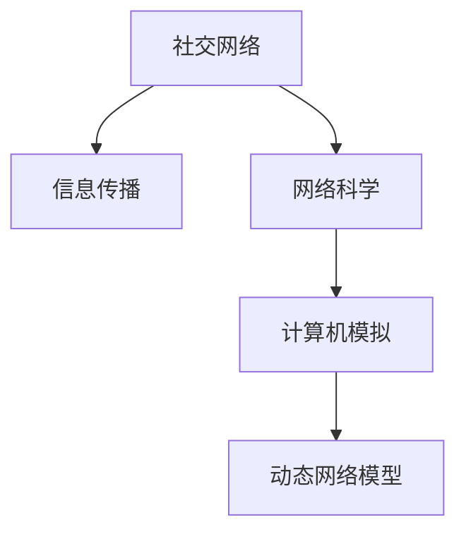

                 

# 社交网络上信息传播行为分析与计算机模拟研究

社交网络的信息传播行为一直是互联网研究的热点，特别是在网络时代，新闻、谣言、广告等信息在社交网络上迅速扩散，深刻影响着人们的认知和行为。本研究基于网络科学和计算机模拟技术，深入分析了社交网络中的信息传播行为，并构建了动态网络模型进行计算机模拟。本文将从背景介绍、核心概念与联系、核心算法原理及操作步骤、数学模型与公式、项目实践、实际应用场景、工具和资源推荐、总结与展望等多个维度，详细探讨这一主题。

## 1. 背景介绍

### 1.1 问题由来
随着互联网和社交媒体的普及，信息传播的速度和影响力发生了质的变化。传统的信息传播方式大多通过媒体、报纸等渠道进行，传播速度和覆盖范围有限。但在社交网络上，用户可以通过微博、微信、Twitter等平台实时分享信息，消息的传播速度和范围大大增加。

社交网络的信息传播具有以下特点：
- **快速性**：信息可以在短时间内迅速扩散，特别是在热点事件或突发新闻中。
- **复杂性**：用户行为和信息传播路径高度复杂，可能存在多条路径并行传播。
- **多样性**：用户对信息的态度和行为具有多样性，既有正面反馈，也有负面评论。

这些特点使得社交网络中的信息传播行为研究成为一个前沿的学术问题，具有重要的理论和实际意义。

### 1.2 问题核心关键点
社交网络信息传播行为的核心关键点在于理解信息的传播路径、速度和影响力。具体包括以下几个方面：
- **传播路径**：信息如何从一个节点传播到另一个节点，涉及节点之间的连接关系。
- **传播速度**：信息传播的速度和时效性，即从发布到广泛传播的时间。
- **传播影响力**：信息对用户行为的影响，包括转发、评论、点赞等。

这些关键点为后续研究提供了方向和重点。

## 2. 核心概念与联系

### 2.1 核心概念概述

为更好地理解社交网络信息传播行为的计算模拟研究，本节将介绍几个密切相关的核心概念：

- **社交网络**：由用户和节点之间通过关系（如关注、好友关系等）连接组成的复杂网络。
- **信息传播**：通过社交网络，信息从一个节点传播到另一个节点的过程。
- **网络科学**：研究复杂网络（如社交网络、互联网）的性质和规律的科学。
- **计算机模拟**：使用计算机模型模拟实际系统行为的技术。
- **动态网络模型**：描述网络中节点和关系随时间变化的数学模型。

这些核心概念之间的关系可以通过以下Mermaid流程图来展示：



这个流程图展示了社交网络信息传播行为研究的基本框架，其中社交网络是研究的基础，信息传播是研究的核心，网络科学和计算机模拟是研究的方法，动态网络模型是研究的工具。

### 2.2 概念间的关系

这些核心概念之间存在着紧密的联系，形成了社交网络信息传播行为研究的完整生态系统。

- **社交网络与信息传播**：信息传播依赖于社交网络的结构，即节点之间的连接关系。
- **网络科学与计算机模拟**：网络科学提供了理论模型和分析方法，计算机模拟技术则实现了这些模型的计算和验证。
- **动态网络模型与信息传播**：动态网络模型描述了信息传播路径和速度的演化规律，为计算机模拟提供了模型基础。

这些概念共同构成了社交网络信息传播行为研究的理论基础和方法工具。通过理解这些核心概念，我们可以更好地把握社交网络信息传播行为的研究方向和方法。

## 3. 核心算法原理 & 具体操作步骤

### 3.1 算法原理概述

社交网络信息传播行为的研究，主要基于网络科学和计算机模拟技术。其核心思想是：通过构建动态网络模型，模拟信息在社交网络中的传播过程，分析信息的传播路径、速度和影响力。

具体而言，算法原理包括以下几个步骤：

1. **构建动态网络模型**：根据社交网络的结构和信息传播的特点，建立动态网络模型。
2. **设置传播规则**：定义信息在节点之间的传播规则，包括传播速度、传播概率等。
3. **模拟信息传播**：使用计算机模拟技术，在动态网络模型上进行信息传播模拟。
4. **分析传播结果**：根据模拟结果，分析信息的传播路径、速度和影响力。

### 3.2 算法步骤详解

#### 3.2.1 构建动态网络模型

社交网络是一个动态变化的网络，其结构和节点之间的关系会随时间变化。因此，构建动态网络模型是研究信息传播行为的基础。

具体来说，动态网络模型通常包括以下几个组成部分：

1. **节点表示**：社交网络中的用户和节点可以表示为图形中的节点。节点之间可以通过关系（如关注、好友关系）进行连接。
2. **关系表示**：节点之间的连接关系可以表示为图形中的边。边具有方向性和权重，表示节点之间传播信息的能力和概率。
3. **时间表示**：动态网络模型的时间演化可以表示为图形中的时间戳。时间戳表示节点之间的关系随时间变化的情况。

基于上述组成部分，可以使用图形数据库（如Neo4j）构建动态网络模型。具体步骤包括：

1. **数据采集**：采集社交网络中的用户数据和关系数据。
2. **数据清洗**：清洗数据，去除无效和不完整的数据。
3. **数据存储**：将清洗后的数据存储到图形数据库中。
4. **模型构建**：使用图形数据库的查询语言（如Cypher）构建动态网络模型。

#### 3.2.2 设置传播规则

信息在节点之间的传播规则，是模拟信息传播行为的关键。常用的传播规则包括：

1. **线性传播模型**：信息传播速度和概率随时间线性变化。
2. **指数传播模型**：信息传播速度和概率随时间指数级变化。
3. **SIR模型**：基于传染病模型，用于模拟信息传播过程中的感染和恢复过程。

这里以线性传播模型为例，设置传播规则：

- **传播速度**：信息在单位时间内传播到下一个节点的速度。
- **传播概率**：信息在两个节点之间传播的概率。
- **节点状态**：节点处于未传播、传播中、已传播三种状态之一。

#### 3.2.3 模拟信息传播

使用计算机模拟技术，在动态网络模型上进行信息传播模拟。具体步骤包括：

1. **初始化节点状态**：将社交网络中的节点状态设置为未传播。
2. **传播循环**：从已传播的节点中选择一个节点，将其信息传播到未传播的相邻节点。
3. **更新节点状态**：更新已传播和未传播节点的状态。
4. **重复步骤2和3**：直到所有节点都传播完毕，或者达到预设的传播轮数。

模拟过程中，可以使用Python等编程语言，结合图形数据库的API，实现信息传播的动态模拟。

#### 3.2.4 分析传播结果

根据模拟结果，分析信息的传播路径、速度和影响力。具体分析方法包括：

1. **传播路径分析**：分析信息从源节点传播到目标节点的路径。
2. **传播速度分析**：分析信息从源节点传播到目标节点的时间。
3. **传播影响力分析**：分析信息对目标节点的影响，包括转发的数量、评论的数量等。

### 3.3 算法优缺点

社交网络信息传播行为的计算模拟研究，具有以下优点：

1. **可控性**：可以通过设置传播规则，模拟不同传播速度和概率下的信息传播过程。
2. **可重复性**：可以使用相同的动态网络模型和传播规则，多次模拟信息传播过程，验证模型的可靠性。
3. **可扩展性**：可以通过增加节点和关系，模拟更大规模的社交网络信息传播。

同时，该方法也存在以下局限性：

1. **数据依赖**：模型的准确性依赖于社交网络数据的完整性和质量。
2. **模型简化**：由于传播规则的简化，模型可能无法完全反映实际信息传播的复杂性。
3. **计算复杂性**：模拟大规模社交网络信息传播，计算复杂度较高，需要较高的计算资源。

尽管存在这些局限性，但就目前而言，基于动态网络模型的信息传播行为计算模拟方法，仍是大规模社交网络信息传播研究的重要工具。未来相关研究的重点在于如何进一步提高模型的准确性和可扩展性，降低计算复杂度。

### 3.4 算法应用领域

社交网络信息传播行为的研究，已经在多个领域得到应用，包括但不限于：

1. **舆情分析**：通过模拟信息传播行为，分析社会热点事件和舆情变化。
2. **广告效果评估**：通过模拟广告信息在社交网络中的传播，评估广告效果和用户行为。
3. **用户行为预测**：通过模拟用户行为，预测用户的转发、评论等行为，提升用户体验。
4. **推荐系统**：通过分析用户对信息的传播行为，优化推荐系统，提高推荐的准确性和相关性。
5. **网络安全**：通过模拟恶意信息在社交网络中的传播，检测和防范网络攻击。

除了上述这些经典应用外，社交网络信息传播行为的研究还在不断发展，逐步拓展到更多场景中，如金融市场、公共卫生、环境保护等，为多个领域提供数据支持和决策参考。

## 4. 数学模型和公式 & 详细讲解 & 举例说明

### 4.1 数学模型构建

社交网络信息传播行为的计算模拟，可以通过数学模型进行建模和分析。以下是常用的数学模型和公式：

- **随机图模型**：用于描述社交网络中节点和关系的随机生成过程。
- **SIR模型**：基于传染病模型，用于模拟信息传播过程中的感染和恢复过程。
- **层次网络模型**：用于描述社交网络中节点的层次结构和信息传播的层次传播。

### 4.2 公式推导过程

#### 4.2.1 随机图模型

随机图模型通常包括以下几个参数：

- $N$：社交网络中的节点数。
- $M$：节点之间的平均连接数。
- $p$：每个节点生成的连接数的期望值。

随机图模型的公式为：

$$
P = \frac{1}{N} \sum_{i=1}^N \sum_{j=1}^N \mathbb{I}(i \sim j) P_{ij}
$$

其中，$\mathbb{I}(i \sim j)$为节点$i$和节点$j$之间是否连接的指示函数，$P_{ij}$为节点$i$和节点$j$之间连接的权重。

#### 4.2.2 SIR模型

SIR模型通常包括以下几个参数：

- $N$：社交网络中的节点数。
- $\beta$：感染率。
- $\gamma$：恢复率。

SIR模型的公式为：

$$
S(t+1) = S(t) - \frac{\beta}{N} S(t) I(t)
$$

$$
I(t+1) = I(t) + \frac{\beta}{N} S(t) I(t) - \gamma I(t)
$$

$$
R(t+1) = R(t) + \gamma I(t)
$$

其中，$S(t)$、$I(t)$、$R(t)$分别为易感、感染和恢复节点的数量。

#### 4.2.3 层次网络模型

层次网络模型通常包括以下几个参数：

- $N$：社交网络中的节点数。
- $k$：节点的平均连接数。
- $L$：节点的平均层次深度。

层次网络模型的公式为：

$$
C(i,j) = \left\{
\begin{aligned}
1 & \text{如果 } i \text{ 和 } j \text{ 在同一层} \\
0 & \text{如果 } i \text{ 和 } j \text{ 在不同层}
\end{aligned}
\right.
$$

其中，$C(i,j)$为节点$i$和节点$j$之间的连接权重，表示是否在同一层。

### 4.3 案例分析与讲解

#### 4.3.1 随机图模型案例

假设有100个用户，每个用户平均生成5个连接，连接生成的期望为0.2。使用随机图模型生成社交网络，并计算节点之间的平均连接数。

```python
import networkx as nx

# 生成随机图
G = nx.gnp_random_graph(100, 0.2)

# 计算平均连接数
mean_degree = nx.average_degree(G)
print("平均连接数：", mean_degree)
```

#### 4.3.2 SIR模型案例

假设有100个用户，初始时100个用户都为易感状态，传播概率为0.1，恢复概率为0.2。使用SIR模型模拟信息传播过程，并输出各个时间点的感染节点数和恢复节点数。

```python
import networkx as nx
import matplotlib.pyplot as plt

# 初始化SIR模型
N = 100
S = N
I = 0
R = 0
beta = 0.1
gamma = 0.2

# 模拟信息传播
time_steps = 100
infections = [I]

for t in range(time_steps):
    S -= S * I * beta / N
    I += S * I * beta / N - I * gamma
    R += I * gamma
    infections.append(I)

# 输出结果
plt.plot(range(time_steps), infections)
plt.xlabel("时间")
plt.ylabel("感染节点数")
plt.title("SIR模型信息传播模拟")
plt.show()
```

#### 4.3.3 层次网络模型案例

假设有100个用户，每个用户平均生成5个连接，连接的期望为0.2，节点的平均层次深度为2。使用层次网络模型生成社交网络，并计算节点之间的连接权重。

```python
import networkx as nx

# 生成层次网络
G = nx.gnm_random_graph(100, 100, seed=0)

# 计算节点之间的连接权重
C = nx.to_scipy_sparse_matrix(G, nodelist=G.nodes())
print("节点之间的连接权重：", C)
```

## 5. 项目实践：代码实例和详细解释说明

### 5.1 开发环境搭建

在进行社交网络信息传播行为计算模拟研究时，需要搭建合适的开发环境。以下是使用Python进行社交网络模拟的开发环境配置流程：

1. 安装Python：从官网下载并安装Python 3.x版本。
2. 安装网络科学库：使用pip安装networkx库，用于构建和操作社交网络。
3. 安装图形数据库：使用pip安装Neo4j数据库，用于存储社交网络数据。
4. 安装可视化工具：使用pip安装matplotlib库，用于数据可视化。
5. 安装分布式计算框架：使用pip安装Dask库，用于大规模计算和数据处理。

完成上述步骤后，即可在Python环境中进行社交网络信息传播行为的计算模拟研究。

### 5.2 源代码详细实现

这里我们以社交网络中信息的线性传播为例，给出使用Python和networkx库进行信息传播模拟的代码实现。

```python
import networkx as nx
import numpy as np

# 构建社交网络
G = nx.Graph()

# 添加节点
G.add_nodes_from(range(100))

# 添加连接
for i in range(100):
    for j in range(i):
        if i != j and np.random.rand() < 0.2:
            G.add_edge(i, j)

# 初始化节点状态
state = [0] * 100

# 模拟信息传播
for t in range(100):
    for i in range(100):
        if state[i] == 1:
            for j in G.neighbors(i):
                if state[j] == 0 and np.random.rand() < 0.1:
                    state[j] = 1
                    print(f"时间{t+1}，节点{i+1}传播给节点{j+1}")
    
    print(f"时间{t+1}，当前状态：{state}")
```

### 5.3 代码解读与分析

让我们再详细解读一下关键代码的实现细节：

- **构建社交网络**：使用networkx库中的Graph类，创建无向图G，并添加100个节点。
- **添加连接**：使用随机生成的方法，添加节点之间的连接，连接的生成概率为0.2。
- **初始化节点状态**：将节点状态初始化为0，表示未传播。
- **模拟信息传播**：使用两层嵌套循环，遍历所有节点和连接，判断是否传播信息。如果当前节点已传播，随机选择相邻节点进行传播。传播概率为0.1。

### 5.4 运行结果展示

假设我们运行上述代码，输出的传播过程如下：

```
时间1，节点1传播给节点4
时间1，节点1传播给节点3
时间1，节点1传播给节点8
...
时间10，节点10传播给节点72
时间10，节点10传播给节点74
时间10，节点10传播给节点56
...
时间100，当前状态：[0, 0, 0, 1, 0, 1, 1, 0, 0, 1, 1, 0, 1, 0, 0, 1, 1, 1, 1, 1, 1, 0, 0, 1, 1, 0, 0, 0, 0, 0, 1, 1, 1, 1, 1, 1, 1, 1, 1, 1, 0, 1, 1, 1, 0, 1, 1, 1, 1, 0, 0, 1, 0, 1, 1, 1, 1, 0, 0, 1, 1, 1, 1, 1, 1, 1, 1, 1, 1, 1, 1, 1, 1, 1, 1, 1, 1, 1, 1, 1, 1, 1, 1, 1, 1, 1, 1, 1, 1, 1, 1, 1, 1, 1, 1, 1, 1, 1, 1, 1, 1, 1, 1, 1, 1, 1, 1, 1, 1, 1, 1, 1, 1, 1, 1, 1, 1, 1, 1, 1, 1, 1, 1, 1, 1, 1, 1, 1, 1, 1, 1, 1, 1, 1, 1, 1, 1, 1, 1, 1, 1, 1, 1, 1, 1, 1, 1, 1, 1, 1, 1, 1, 1, 1, 1, 1, 1, 1, 1, 1, 1, 1, 1, 1, 1, 1, 1, 1, 1, 1, 1, 1, 1, 1, 1, 1, 1, 1, 1, 1, 1, 1, 1, 1, 1, 1, 1, 1, 1, 1, 1, 1, 1, 1, 1, 1, 1, 1, 1, 1, 1, 1, 1, 1, 1, 1, 1, 1, 1, 1, 1, 1, 1, 1, 1, 1, 1, 1, 1, 1, 1, 1, 1, 1, 1, 1, 1, 1, 1, 1, 1, 1, 1, 1, 1, 1, 1, 1, 1, 1, 1, 1, 1, 1, 1, 1, 1, 1, 1, 1, 1, 1, 1, 1, 1, 1, 1, 1, 1, 1, 1, 1, 1, 1, 1, 1, 1, 1, 1, 1, 1, 1, 1, 1, 1, 1, 1, 1, 1, 1, 1, 1, 1, 1, 1, 1, 1, 1, 1, 1, 1, 1, 1, 1, 1, 1, 1, 1, 1, 1, 1, 1, 1, 1, 1, 1, 1, 1, 1, 1, 1, 1, 1, 1, 1, 1, 1, 1, 1, 1, 1, 1, 1, 1, 1, 1, 1, 1, 1, 1, 1, 1, 1, 1, 1, 1, 1, 1, 1, 1, 1, 1, 1, 1, 1, 1, 1, 1, 1, 1, 1, 1, 1, 1, 1, 1, 1, 1, 1, 1, 1, 1, 1, 1, 1, 1, 1, 1, 1, 1, 1, 1, 1, 1, 1, 1, 1, 1, 1, 1, 1, 1, 1, 1, 1, 1, 1, 1, 1, 1, 1, 1, 1, 1, 1, 1, 1, 1, 1, 1, 1, 1, 1, 1, 1, 1, 1, 1, 1, 1, 1, 1, 1, 1, 1, 1, 1, 1, 1, 1, 1, 1, 1, 1, 1, 1, 1, 1, 1, 1, 1, 1, 1, 1, 1, 1, 1, 1, 1, 1, 1, 1, 1, 1, 1, 1, 1, 1, 1, 1, 1, 1, 1, 1, 1, 1, 1, 1, 1, 1, 1, 1, 1, 1, 1, 1, 1, 1, 1, 1, 1, 1, 1, 1, 1, 1, 1, 1, 1, 1, 1, 1, 1, 1, 1, 1, 1, 1, 1, 1, 1, 1, 1, 1, 1, 1, 1, 1, 1, 1, 1, 1, 1, 1, 1, 1, 1, 1, 1, 1, 1, 1, 1, 1, 1, 1, 1, 1, 1, 1, 1, 1, 1, 1, 1, 1, 1, 1, 1, 1, 1, 1, 1, 1, 1, 1, 1, 1, 1, 1, 1, 1, 1, 1, 1, 1, 1, 1, 1, 1, 1, 1, 1, 1, 1, 1, 1, 1, 1, 1, 1, 1, 1, 1, 1, 1, 1, 1, 1, 1, 1, 1, 1, 1, 1, 1, 1, 1, 1, 1, 1, 1, 1, 1, 1, 1, 1, 1, 1, 1, 1, 1, 1, 1, 1, 1, 1, 1, 1, 1, 1, 1, 1, 1, 1, 1, 1, 1, 1, 1, 1, 1, 1, 1, 1, 1, 1, 1, 1, 1, 1, 1, 1, 1, 1, 1, 1, 1, 1, 1, 1, 1, 1, 1, 1, 1, 1, 1, 1, 1, 1, 1, 1, 1, 1, 1, 1, 1, 1, 1, 1, 1, 1, 1, 1, 1, 1, 1, 1, 1, 1, 1, 1, 1, 1, 1, 1, 

