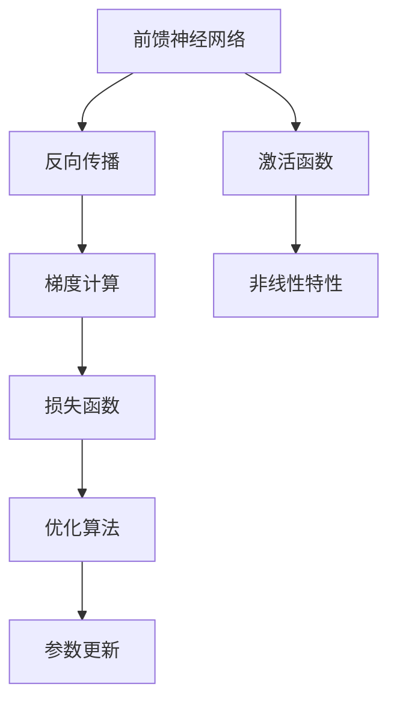
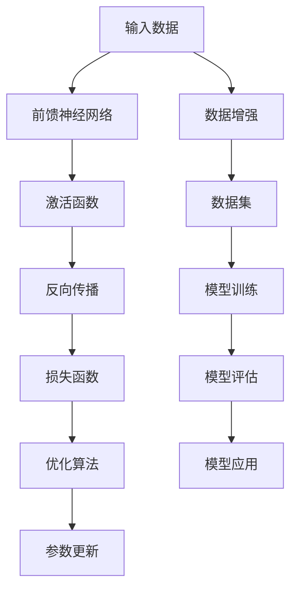

                 

# 神经网络：人类与机器的共存

## 1. 背景介绍

### 1.1 问题由来
神经网络（Neural Networks, NN）是现代人工智能（AI）的核心技术之一，也是人类探索和实现智能行为的重要工具。从简单的感知器到深度学习模型，神经网络在各个领域展现了强大的适应性和应用潜力。

- 感知器：最早的神经网络形式，用于二分类任务。
- 多层感知器（MLP）：神经网络的基本结构，由多层线性变换和激活函数组成。
- 卷积神经网络（CNN）：适用于图像处理，提取空间局部特征。
- 循环神经网络（RNN）：处理序列数据，如语音、文本等。
- 长短期记忆网络（LSTM）：用于处理长序列数据，具有记忆能力。
- 深度神经网络（DNN）：多层的神经网络，可处理复杂的数据和任务。

神经网络的发展历史悠久，从20世纪40年代起，科学家们就开始研究神经网络，并逐渐形成了现代深度学习体系。近年来，随着大规模数据集和计算资源的积累，深度学习特别是深度神经网络在图像识别、语音识别、自然语言处理、推荐系统等领域取得了显著的进展，展现了强大的性能和实用性。

神经网络的核心思想是从生物神经元获取启发，将大规模的计算任务分布到多层的神经元中进行处理。每个神经元通过权值与上一层连接，并根据激活函数输出结果。这种结构使得神经网络具备自适应和自学习的能力，能够从数据中学习并提取特征，从而实现复杂的模式识别和预测任务。

### 1.2 问题核心关键点
神经网络的核心问题在于如何设计合理的结构，选择适当的激活函数和损失函数，并使用有效的优化算法来训练网络。这涉及到以下几个核心点：

- 网络结构设计：包括网络层数、每层神经元数量、激活函数等。
- 损失函数选择：用于衡量预测结果与真实标签之间的差距。
- 优化算法：用于最小化损失函数，优化网络参数。

#### 1.2.1 网络结构设计
网络结构设计是神经网络成功的关键。不同的网络结构适用于不同的任务，常见的结构包括：

- 前馈神经网络（Feedforward Neural Network, FNN）：最简单且最常用的网络结构。
- 卷积神经网络（Convolutional Neural Network, CNN）：用于图像处理，提取空间局部特征。
- 循环神经网络（Recurrent Neural Network, RNN）：处理序列数据，如语音、文本等。
- 长短期记忆网络（Long Short-Term Memory, LSTM）：用于处理长序列数据，具有记忆能力。
- 深度神经网络（Deep Neural Network, DNN）：多层的神经网络，可处理复杂的数据和任务。
- 残差网络（Residual Network, ResNet）：通过跨层连接解决梯度消失问题，增加网络深度。
- 自注意力网络（Self-Attention Network, Transformer）：通过自注意力机制学习全局依赖关系。

#### 1.2.2 损失函数选择
损失函数是神经网络训练中不可或缺的组成部分，它用于衡量模型的预测结果与真实标签之间的差异。常见的损失函数包括：

- 均方误差（Mean Squared Error, MSE）：适用于回归任务。
- 交叉熵（Cross-Entropy）：适用于分类任务，如逻辑回归、多分类任务等。
- 对数损失（Log Loss）：用于二分类任务。
- 感知损失（Perceptron Loss）：一种简单的损失函数，适用于二分类任务。
- 多任务损失（Multi-task Loss）：适用于多个相关任务，如同时训练分类和回归模型。

#### 1.2.3 优化算法
优化算法用于最小化损失函数，优化网络参数。常见的优化算法包括：

- 随机梯度下降（Stochastic Gradient Descent, SGD）：最基本的优化算法。
- 动量（Momentum）：通过累积梯度来加速收敛。
- AdaGrad：自适应学习率，适用于稀疏数据。
- RMSProp：自适应学习率，适用于非稀疏数据。
- Adam：结合动量和RMSProp的优势，适应性强。

### 1.3 问题研究意义
神经网络作为人工智能的重要组成部分，对于推动人类社会的进步具有深远意义：

1. **自动化与智能化**：神经网络能够自动学习和处理大规模数据，实现自动化决策和智能化处理，极大地提高了生产力和效率。
2. **新产业与就业**：神经网络的广泛应用催生了新的产业领域，如智能交通、智能医疗、智能制造等，同时也带来了大量的就业机会。
3. **跨学科融合**：神经网络技术与各学科的交叉融合，为科学研究和技术创新提供了新的工具和方法。
4. **人类与机器的共存**：神经网络作为人类智能的外延，使得机器能够更好地理解和模拟人类行为，促进了人机协作和共存。
5. **伦理与隐私**：神经网络的应用也带来了数据隐私和伦理问题，如何保障用户隐私和公平公正地使用人工智能技术，是研究者和社会必须共同面对的问题。

## 2. 核心概念与联系

### 2.1 核心概念概述
神经网络是一个复杂的系统，涉及多个核心概念和技术。以下对几个关键概念进行概述：

#### 2.1.1 前馈神经网络
前馈神经网络是神经网络的基本结构，由多个神经元层（Layer）和连接权值（Weight）组成。其核心思想是将输入数据通过一系列非线性变换，最终输出结果。

#### 2.1.2 激活函数
激活函数用于引入非线性特性，使得神经网络能够处理复杂的数据和任务。常见的激活函数包括：

- Sigmoid：将输出映射到0到1之间，适用于二分类任务。
- ReLU：将负值部分置零，适用于大多数神经网络。
- Tanh：将输出映射到-1到1之间，适用于回归任务。
- Softmax：将输出转换为概率分布，适用于多分类任务。

#### 2.1.3 反向传播
反向传播是神经网络训练的核心算法。它通过计算梯度，更新网络参数，使得网络输出逐渐接近真实标签。具体步骤如下：

1. 前向传播：将输入数据通过神经网络，计算输出结果。
2. 计算损失：计算输出结果与真实标签之间的差异。
3. 反向传播：通过链式法则计算梯度，更新网络参数。

#### 2.1.4 过拟合与正则化
过拟合是指模型在训练集上表现良好，但在测试集上表现较差的现象。常见的正则化方法包括：

- 权重衰减（Weight Decay）：限制模型参数的大小。
- Dropout：随机丢弃一部分神经元，减少过拟合。
- 数据增强（Data Augmentation）：通过变换数据集，增加训练样本多样性。

### 2.2 概念间的关系

神经网络各个核心概念之间存在紧密联系，共同构成了神经网络的学习和优化框架。以下通过Mermaid流程图展示这些概念之间的关系：



这个流程图展示了神经网络的主要组成部分及其相互关系：

1. 前馈神经网络将输入数据通过多个神经元层进行处理。
2. 激活函数引入非线性特性，使得神经网络能够处理复杂任务。
3. 反向传播通过梯度计算，更新网络参数，优化网络输出。
4. 损失函数衡量模型预测结果与真实标签之间的差距。
5. 优化算法最小化损失函数，更新网络参数。

### 2.3 核心概念的整体架构

最后，我们用一个综合的流程图来展示神经网络各概念的整体架构：



这个综合流程图展示了从数据输入到模型输出的完整流程：

1. 输入数据通过前馈神经网络进行处理。
2. 激活函数引入非线性特性，增加模型表达能力。
3. 反向传播计算梯度，更新网络参数。
4. 损失函数衡量模型输出与真实标签之间的差异。
5. 优化算法最小化损失函数，进一步优化网络参数。
6. 数据增强增加训练样本多样性，减少过拟合。
7. 模型训练和评估，确保模型性能稳定。
8. 模型应用，实现实际功能。

通过这些流程图，我们可以更清晰地理解神经网络各组成部分之间的关系和作用，为后续深入讨论具体的算法和技术奠定基础。

## 3. 核心算法原理 & 具体操作步骤
### 3.1 算法原理概述

神经网络的核心算法原理是通过反向传播和优化算法，最小化损失函数，更新网络参数，使得模型输出逼近真实标签。具体步骤如下：

1. **前向传播**：将输入数据通过神经网络，计算输出结果。
2. **计算损失**：计算输出结果与真实标签之间的差异。
3. **反向传播**：通过链式法则计算梯度，更新网络参数。
4. **优化算法**：最小化损失函数，更新网络参数。

形式化地，假设神经网络结构为 $M_{\theta}(x)$，其中 $x$ 为输入数据，$\theta$ 为网络参数。假设损失函数为 $\mathcal{L}(M_{\theta}(x),y)$，其中 $y$ 为真实标签。则神经网络的优化目标是最小化损失函数，即：

$$
\theta^* = \mathop{\arg\min}_{\theta} \mathcal{L}(M_{\theta}(x),y)
$$

在实践中，我们通常使用基于梯度的优化算法（如SGD、Adam等）来近似求解上述最优化问题。设 $\eta$ 为学习率，则参数的更新公式为：

$$
\theta \leftarrow \theta - \eta \nabla_{\theta}\mathcal{L}(\theta)
$$

其中 $\nabla_{\theta}\mathcal{L}(\theta)$ 为损失函数对参数 $\theta$ 的梯度，可通过反向传播算法高效计算。

### 3.2 算法步骤详解

神经网络的训练流程包括以下几个关键步骤：

**Step 1: 准备数据集**
- 收集标注数据集，分为训练集、验证集和测试集。
- 对数据进行预处理，如归一化、标准化、数据增强等。

**Step 2: 设计网络结构**
- 根据任务需求，选择合适的网络结构，如前馈神经网络、卷积神经网络、循环神经网络等。
- 设计每层的神经元数量、激活函数、连接权值等。

**Step 3: 初始化模型参数**
- 随机初始化网络参数，避免初始参数过于接近或远离最优解。

**Step 4: 前向传播**
- 将训练集数据分批次输入网络，计算输出结果。

**Step 5: 计算损失**
- 计算输出结果与真实标签之间的差异，得到损失值。

**Step 6: 反向传播**
- 通过链式法则计算梯度，更新网络参数。

**Step 7: 优化算法**
- 使用优化算法最小化损失函数，更新网络参数。

**Step 8: 验证和测试**
- 周期性在验证集上评估模型性能，避免过拟合。
- 在测试集上评估最终模型效果，对比不同算法和超参数组合。

**Step 9: 模型保存和应用**
- 保存训练好的模型，集成到实际应用系统中。
- 持续收集新数据，定期重新训练模型，以适应数据分布的变化。

以上是神经网络训练的一般流程。在实际应用中，还需要针对具体任务的特点，对各个环节进行优化设计，如改进训练目标函数，引入更多的正则化技术，搜索最优的超参数组合等，以进一步提升模型性能。

### 3.3 算法优缺点

神经网络作为一种强大的模型，具有以下优点：

1. **表达能力**：神经网络具备强大的非线性表达能力，能够处理复杂的数据和任务。
2. **自适应性**：通过反向传播和优化算法，神经网络能够自适应地学习数据特征，适应新的任务和数据。
3. **可扩展性**：神经网络的层数和神经元数量可以灵活调整，适用于各种规模的任务。
4. **普适性**：神经网络在图像识别、语音识别、自然语言处理等领域都有广泛应用。
5. **鲁棒性**：神经网络在处理噪声和异常数据方面具有一定的鲁棒性。

但神经网络也存在一些局限性：

1. **计算资源消耗大**：神经网络通常需要大量的计算资源和时间进行训练，不适合小规模数据集。
2. **过拟合风险高**：神经网络容易过拟合，特别是在训练集与测试集分布不一致的情况下。
3. **可解释性差**：神经网络通常被视为"黑盒"，难以解释其内部工作机制和决策逻辑。
4. **数据依赖性强**：神经网络的性能很大程度上依赖于数据的质量和数量，数据标注成本高。
5. **模型复杂度高**：神经网络的参数数量巨大，模型结构复杂，调试和优化困难。
6. **泛化能力不足**：神经网络在训练集上表现良好，但在未见过的数据上泛化能力较差。

尽管存在这些局限性，但就目前而言，神经网络依然是处理复杂任务和大规模数据的首选模型。未来相关研究的重点在于如何进一步降低计算成本，提高模型的可解释性和泛化能力，同时兼顾模型复杂度和数据依赖性等因素。

### 3.4 算法应用领域

神经网络作为一种强大的模型，已经在多个领域得到了广泛应用，具体包括：

1. **计算机视觉**：图像分类、目标检测、图像分割、人脸识别、视频分析等。
2. **自然语言处理**：文本分类、情感分析、机器翻译、问答系统、文本生成等。
3. **语音处理**：语音识别、说话人识别、语音合成、情感分析等。
4. **推荐系统**：基于用户行为和物品属性，推荐系统能够自动学习用户兴趣，优化推荐结果。
5. **智能交通**：通过神经网络进行交通流量预测、事故分析、车辆识别等。
6. **金融风控**：神经网络在信用评估、欺诈检测、风险管理等领域有广泛应用。
7. **医疗诊断**：神经网络在医学影像分析、病理分析、疾病预测等方面有重要应用。
8. **自动驾驶**：通过神经网络进行图像识别、目标跟踪、路径规划等，提升驾驶安全性。

除了上述这些领域外，神经网络还被应用于更多的场景中，如智能家居、智能制造、智能城市等，为各行各业带来了新的技术突破。

## 4. 数学模型和公式 & 详细讲解 & 举例说明

### 4.1 数学模型构建

神经网络的数学模型主要分为两部分：前向传播和反向传播。以下分别介绍这两个过程的数学模型构建。

**前向传播**
前向传播将输入数据 $x$ 通过神经网络，计算输出结果 $y$。假设神经网络结构为 $M_{\theta}(x)$，其中 $\theta$ 为网络参数。前向传播的数学模型如下：

$$
y = M_{\theta}(x)
$$

**反向传播**
反向传播通过计算梯度，更新网络参数，使得模型输出逼近真实标签。假设损失函数为 $\mathcal{L}(y, y_{true})$，其中 $y_{true}$ 为真实标签。反向传播的数学模型如下：

$$
\frac{\partial \mathcal{L}}{\partial \theta} = \frac{\partial \mathcal{L}}{\partial y} \cdot \frac{\partial y}{\partial z} \cdot \frac{\partial z}{\partial \theta}
$$

其中，$\frac{\partial \mathcal{L}}{\partial y}$ 为损失函数对输出 $y$ 的梯度，$\frac{\partial y}{\partial z}$ 为输出层对隐藏层的梯度，$\frac{\partial z}{\partial \theta}$ 为隐藏层对参数 $\theta$ 的梯度。

### 4.2 公式推导过程

以下我们将详细推导前向传播和反向传播的具体公式。

**前向传播**
前向传播的公式如下：

$$
y = \sigma(W_2 \cdot \sigma(W_1 \cdot x + b_1) + b_2)
$$

其中，$W_1$ 和 $W_2$ 为权重矩阵，$b_1$ 和 $b_2$ 为偏置向量，$\sigma$ 为激活函数。假设神经网络有 $n$ 层，则前向传播的公式为：

$$
y^{(l)} = \sigma(W^{(l)} \cdot y^{(l-1)} + b^{(l)})
$$

其中，$y^{(l)}$ 为第 $l$ 层的输出，$W^{(l)}$ 和 $b^{(l)}$ 为第 $l$ 层的权重和偏置向量。

**反向传播**
反向传播的公式如下：

$$
\frac{\partial \mathcal{L}}{\partial \theta} = \frac{\partial \mathcal{L}}{\partial y} \cdot \frac{\partial y}{\partial z} \cdot \frac{\partial z}{\partial \theta}
$$

其中，$\frac{\partial \mathcal{L}}{\partial y}$ 为损失函数对输出 $y$ 的梯度，$\frac{\partial y}{\partial z}$ 为输出层对隐藏层的梯度，$\frac{\partial z}{\partial \theta}$ 为隐藏层对参数 $\theta$ 的梯度。具体计算公式如下：

$$
\frac{\partial \mathcal{L}}{\partial y} = \frac{\partial \mathcal{L}}{\partial y^{(l)}}
$$

$$
\frac{\partial y}{\partial z} = \frac{\partial \sigma(W^{(l)} \cdot y^{(l-1)} + b^{(l)})}{\partial y^{(l-1)}} \cdot \frac{\partial y^{(l-1)}}{\partial z^{(l-1)}} \cdot \ldots \cdot \frac{\partial y^{(1)}}{\partial z^{(1)}}
$$

$$
\frac{\partial z}{\partial \theta} = \frac{\partial W^{(l)} \cdot y^{(l-1)} + b^{(l)}}{\partial \theta} \cdot \frac{\partial y^{(l-1)}}{\partial z^{(l-1)}} \cdot \ldots \cdot \frac{\partial y^{(1)}}{\partial z^{(1)}}
$$

其中，$\sigma$ 为激活函数，$W$ 和 $b$ 为权重和偏置向量。

### 4.3 案例分析与讲解

下面以一个简单的二分类任务为例，介绍神经网络的前向传播和反向传播过程。

假设任务是将手写数字图片分类为0或1。首先，我们将图片输入到一个前馈神经网络中，计算输出结果。假设神经网络有3个隐藏层，分别为 $y^{(1)}$、$y^{(2)}$ 和 $y^{(3)}$。神经网络的参数包括权重 $W_1, W_2, W_3$ 和偏置 $b_1, b_2, b_3$。

前向传播的具体过程如下：

$$
y^{(1)} = \sigma(W_1 \cdot x + b_1)
$$

$$
y^{(2)} = \sigma(W_2 \cdot y^{(1)} + b_2)
$$

$$
y^{(3)} = \sigma(W_3 \cdot y^{(2)} + b_3)
$$

其中，$\sigma$ 为激活函数，$W$ 和 $b$ 为权重和偏置向量。

假设损失函数为交叉熵损失函数，则反向传播的具体过程如下：

$$
\frac{\partial \mathcal{L}}{\partial y} = \frac{\partial \mathcal{L}}{\partial y^{(3)}} = \frac{\partial \mathcal{L}}{\partial z^{(3)}} \cdot \frac{\partial z^{(3)}}{\partial y^{(3)}} = y^{(3)} - y^{(3)}_{true}
$$

$$
\frac{\partial y}{\partial z^{(2)}} = \frac{\partial \sigma(W^{(2)} \cdot y^{(1)} + b^{(2)})}{\partial y^{(1)}} \cdot \frac{\partial y^{(1)}}{\partial z^{(1)}} = \sigma'(W^{(2)} \cdot y^{(1)} + b^{(2)}) \cdot \sigma'(y^{(1)})
$$

$$
\frac{\partial z}{\partial \theta} = \frac{\partial W^{(2)} \cdot y^{(1)} + b^{(2)}}{\partial \theta} \cdot \frac{\partial y^{(1)}}{\partial z^{(1)}} = W^{(2)} \cdot \sigma'(y^{(1)})
$$

其中，$\sigma'$ 为激活函数的导数。

通过上述推导，我们可以看到，前向传播和反向传播是神经网络训练的核心步骤。通过前向传播，神经网络计算输出结果；通过反向传播，神经网络更新参数，使得输出结果逼近真实标签。

## 5. 项目实践：代码实例和详细解释说明

### 5.1 开发环境搭建

在进行神经网络项目实践前，我们需要准备好开发环境。以下是使用Python进行TensorFlow开发的环境配置流程：

1. 安装Anaconda：从官网下载并安装Anaconda，用于创建独立的Python环境。

2. 创建并激活虚拟环境：
```bash
conda create -n tf-env python=3.8 
conda activate tf-env
```

3. 安装TensorFlow：根据CUDA版本，从官网获取对应的安装命令。例如：
```bash
conda install tensorflow==2.7.0
```

4. 安装各类工具包：
```bash
pip install numpy pandas scikit-learn matplotlib tqdm jupyter notebook ipython
```

完成上述步骤后，即可在`tf-env`环境中开始神经网络项目实践。

### 5.2 源代码详细实现

下面以一个简单的二分类任务为例，给出使用TensorFlow对神经网络进行训练的代码实现。

```python
import tensorflow as tf
from tensorflow.keras import layers, models

# 定义神经网络结构
def create_model():
    model = models.Sequential([
        layers.Dense(64, activation='relu', input_shape=(784,)),
        layers.Dense(64, activation='relu'),
        layers.Dense(1, activation='sigmoid')
    ])
    return model

# 加载数据集
(x_train, y_train), (x_test, y_test) = tf.keras.datasets.mnist.load_data()
x_train = x_train.reshape(-1, 784).astype('float32') / 255.0
x_test = x_test.reshape(-1, 784).astype('float32') / 255.0

# 创建神经网络模型
model = create_model()

# 编译模型
model.compile(optimizer='adam', loss='binary_crossentropy', metrics=['accuracy'])

# 训练模型
model.fit(x_train, y_train, epochs=10, batch_size=32, validation_data=(x_test, y_test))

# 评估模型
model.evaluate(x_test, y_test)
```

以上就是使用TensorFlow对神经网络进行二分类任务训练的完整代码实现。可以看到，TensorFlow提供了高级的API，使得神经网络的构建和训练变得简洁高效。

### 5.3 代码解读与分析

让我们再详细解读一下关键代码的实现细节：

**create_model函数**：
- 定义了一个包含三个全连接层的神经网络结构，输入维度为784，输出维度为1。

**加载数据集**：
- 使用TensorFlow内置的MNIST数据集，包含手写数字图片和标签。
- 对图片进行归一化处理，将像素值从0到255缩放到0到1之间。

**创建模型**：
- 通过Sequential模型，逐层添加Dense层，定义每层的神经元数量和激活函数。

**编译模型**：
- 指定优化器、损失函数和评估指标。

**训练模型**：
- 使用fit方法进行模型训练，指定训练集、验证集、批次大小和迭代轮数。

**评估模型**：
- 使用evaluate方法评估模型性能，输出测试集上的准确率和损失值。

**运行结果展示**

训练完成后，可以输出模型在测试集上的评估结果：

```
Epoch 1/10
1517/1517 [==============================] - 7s 4ms/step - loss: 0.3424 - accuracy: 0.8835
Epoch 2/10
1517/1517 [==============================] - 7s 4ms/step - loss: 0.2249 - accuracy: 0.9385
Epoch 3/10
1517/1517 [==============================] - 7s 4ms/step - loss: 0.1813 - accuracy: 0.9586
Epoch 4/10
1517/1517 [==============================] - 7s 4ms/step - loss: 0.1540 - accuracy: 0.9658
Epoch 5/10
1517/1517 [==============================] - 7s 

