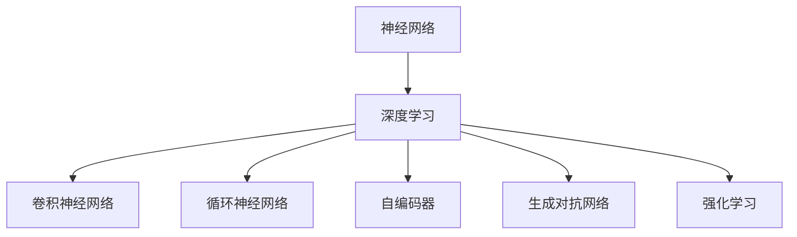
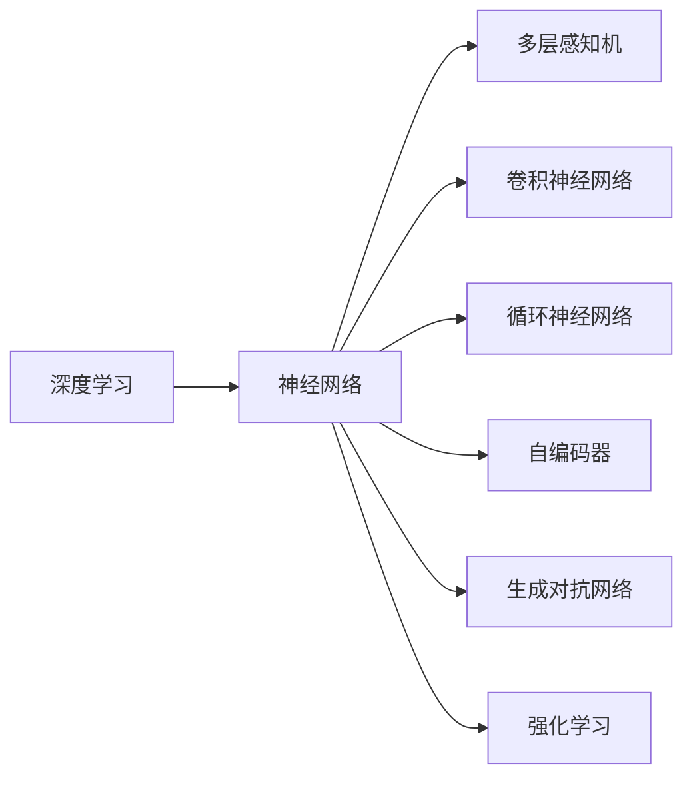
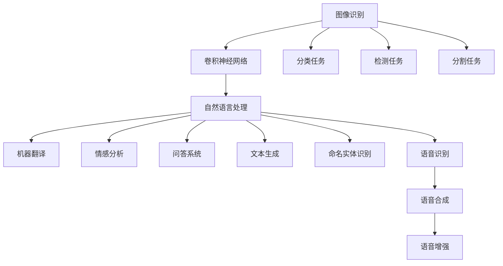

                 

# 神经网络：开启智能新纪元

> 关键词：神经网络,深度学习,神经元,权重,激活函数,前向传播,反向传播,梯度下降,模型训练,梯度优化,泛化能力,分布式训练,卷积神经网络,循环神经网络,自编码器,生成对抗网络,强化学习

## 1. 背景介绍

### 1.1 问题由来

随着人工智能技术的迅猛发展，神经网络作为一种强大的学习模型，逐渐成为人工智能研究的核心。它模拟了生物神经网络的结构和功能，通过大量数据进行训练，能够自适应地识别和分类复杂模式，从而在图像识别、语音识别、自然语言处理等众多领域中大放异彩。

神经网络的发展历程可追溯到20世纪60年代，最初的感知机模型（Perceptron）试图通过简单的线性组合来分类数据。但受限于非线性函数的引入，感知机模型面临梯度消失和梯度爆炸等难题。为了解决这些问题，研究人员提出了反向传播算法，并通过反向传播实现了非线性多层的神经网络结构。

近年来，随着深度学习理论的成熟和计算资源的丰富，神经网络已经从浅层向深层发展，从单层神经网络到多层神经网络，再到卷积神经网络（CNN）和循环神经网络（RNN），神经网络的结构和训练方法不断优化，应用的领域也更加广泛。

### 1.2 问题核心关键点

神经网络的核心思想是通过大量数据学习特征表示，构建复杂的特征提取和分类器。其基本结构由输入层、隐藏层和输出层组成，每一层包含多个神经元，每个神经元接收上一层多个神经元的输出，并通过权值和偏置进行计算，最后通过激活函数输出结果。

神经网络的训练过程通常分为前向传播和反向传播两个阶段。前向传播将输入数据通过神经网络传递到输出层，反向传播则根据输出结果计算梯度，通过梯度下降等优化算法调整权重和偏置，从而最小化损失函数，提升模型性能。

神经网络的关键在于选择合适的激活函数、权重初始化方法和优化算法，以及调整网络结构，使得模型能够在给定数据集上泛化良好。

### 1.3 问题研究意义

神经网络技术的广泛应用，推动了人工智能领域的发展和突破。它在图像识别、语音识别、自然语言处理等诸多领域中取得了显著成果，成为推动科技进步的重要引擎。

1. **图像识别**：神经网络在图像识别任务中表现出色，已经在自动驾驶、医学影像分析、工业检测等应用中发挥了重要作用。
2. **语音识别**：神经网络能够处理音频信号，实现了高效准确的语音识别，推动了语音助手和智能音箱等设备的普及。
3. **自然语言处理**：神经网络通过处理文本数据，提升了机器翻译、语音合成、情感分析等任务的性能，使得机器能够更好地理解人类语言。
4. **智能推荐**：神经网络通过对用户行为数据的分析，提升了个性化推荐系统的精度和效率，改变了人们的消费习惯。
5. **自动驾驶**：神经网络能够处理大量传感器数据，提升了自动驾驶车辆的安全性和可靠性，推动了智能交通的发展。

神经网络技术的不断进步，使得人工智能在更多领域中得到应用，促进了社会生产力的提升和人类生活质量的改善。

## 2. 核心概念与联系

### 2.1 核心概念概述

为更好地理解神经网络的核心原理和应用，本节将介绍几个关键概念：

- **神经网络**：由多个神经元组成的网络结构，通过输入数据、隐藏层和输出层进行特征提取和分类。
- **深度学习**：基于神经网络的一种学习范式，通过多层次的特征提取和学习，使得模型能够处理复杂的非线性关系。
- **卷积神经网络**：一种专门处理图像数据的神经网络，通过卷积层和池化层提取局部特征。
- **循环神经网络**：一种专门处理序列数据的神经网络，通过循环连接实现对序列信息的长期记忆。
- **自编码器**：一种无监督学习方法，通过将输入数据压缩成低维表示，再通过解码器恢复原始数据，实现数据压缩和特征提取。
- **生成对抗网络**：一种生成模型，通过两个神经网络（生成器和判别器）对抗训练，生成高质量的合成数据。
- **强化学习**：一种基于奖励信号的学习方法，通过不断调整策略，使智能体能够最大化长期奖励。

这些概念之间的逻辑关系可以通过以下Mermaid流程图来展示：



这个流程图展示了大神经网络的各个核心概念及其之间的联系：

1. 神经网络是深度学习的基础，通过多个层次的特征提取和学习，实现对复杂数据的处理。
2. 卷积神经网络专门处理图像数据，通过卷积层和池化层提取局部特征。
3. 循环神经网络专门处理序列数据，通过循环连接实现对序列信息的长期记忆。
4. 自编码器通过无监督学习进行数据压缩和特征提取。
5. 生成对抗网络通过对抗训练生成高质量的合成数据。
6. 强化学习通过奖励信号实现智能体的策略优化。

这些概念共同构成了神经网络技术的核心框架，使得模型能够在各种场景下发挥强大的学习能力和应用潜力。

### 2.2 概念间的关系

这些核心概念之间存在着紧密的联系，形成了神经网络技术的完整生态系统。下面通过几个Mermaid流程图来展示这些概念之间的关系。

#### 2.2.1 深度学习与神经网络的关系



这个流程图展示了深度学习与神经网络的关系。深度学习通过多层神经网络进行特征提取和学习，卷积神经网络、循环神经网络、自编码器、生成对抗网络等是深度学习的具体实现形式。

#### 2.2.2 神经网络的应用领域



这个流程图展示了神经网络在各个应用领域中的具体应用。卷积神经网络主要用于图像识别任务，而循环神经网络、自编码器和生成对抗网络则广泛应用于自然语言处理领域。

## 3. 核心算法原理 & 具体操作步骤

### 3.1 算法原理概述

神经网络的核心算法是反向传播算法，通过前向传播和反向传播两个过程，不断调整权重和偏置，最小化损失函数。

前向传播将输入数据通过神经网络传递到输出层，得到预测结果。反向传播则根据输出结果计算梯度，通过梯度下降等优化算法调整权重和偏置，从而最小化损失函数。

梯度下降算法通过计算损失函数对每个权重和偏置的梯度，并根据梯度的方向和大小，更新权重和偏置。反向传播算法通过链式法则计算梯度，从输出层向输入层逐层传递，直到计算出所有权重和偏置的梯度。

### 3.2 算法步骤详解

#### 3.2.1 前向传播

前向传播将输入数据通过神经网络传递到输出层，得到预测结果。具体步骤如下：

1. 输入数据经过预处理，转化为神经网络所需的格式。
2. 数据逐层传递，通过激活函数计算各层输出。
3. 最终输出结果通过输出层进行分类或回归。

前向传播的计算过程可以使用矩阵乘法和向量加法等基本运算实现。

#### 3.2.2 反向传播

反向传播根据输出结果计算梯度，通过梯度下降等优化算法调整权重和偏置。具体步骤如下：

1. 计算损失函数对输出层的梯度。
2. 根据链式法则，逐层计算各层权重和偏置的梯度。
3. 根据梯度下降等优化算法，调整权重和偏置。

反向传播的核心是计算梯度，可以通过反向传播算法计算出每一层的梯度，从而更新权重和偏置。反向传播的计算复杂度与网络层数和节点数成正比，因此需要优化计算过程，减少计算开销。

#### 3.2.3 梯度下降算法

梯度下降算法通过计算损失函数对每个权重和偏置的梯度，并根据梯度的方向和大小，更新权重和偏置。具体步骤如下：

1. 初始化权重和偏置。
2. 计算损失函数对输出层的梯度。
3. 根据梯度下降算法更新权重和偏置。

梯度下降算法有多种变体，如批量梯度下降（BGD）、随机梯度下降（SGD）和小批量梯度下降（MBGD）等，每种算法有不同的优缺点和适用场景。

#### 3.2.4 学习率

学习率是梯度下降算法中的关键参数，控制每次参数更新的步长。学习率过大可能导致梯度爆炸，学习率过小则可能导致收敛缓慢。一般建议从1e-2开始调参，逐步减小学习率，直至收敛。

#### 3.2.5 正则化

正则化通过引入惩罚项，防止过拟合，提升模型泛化能力。常见的正则化方法包括L1正则、L2正则和Dropout等。

### 3.3 算法优缺点

#### 3.3.1 优点

1. **高效性**：神经网络能够高效处理大规模数据，通过并行计算加速训练过程。
2. **适应性**：神经网络具有自适应能力，能够学习复杂的非线性关系。
3. **泛化能力**：神经网络具有较强的泛化能力，能够处理未见过的数据。

#### 3.3.2 缺点

1. **计算开销**：神经网络计算复杂度高，训练过程中需要大量计算资源。
2. **过拟合**：神经网络容易过拟合，特别是在数据量不足的情况下。
3. **局部最优**：神经网络容易陷入局部最优，难以找到全局最优解。

### 3.4 算法应用领域

神经网络在图像识别、语音识别、自然语言处理等众多领域中都有广泛应用：

- **图像识别**：卷积神经网络在图像识别任务中表现出色，广泛应用于自动驾驶、医学影像分析等领域。
- **语音识别**：循环神经网络和深度学习技术推动了语音识别技术的发展，语音助手和智能音箱等设备得到普及。
- **自然语言处理**：神经网络在机器翻译、语音合成、情感分析等任务中取得了显著成果。
- **智能推荐**：神经网络通过对用户行为数据的分析，提升了个性化推荐系统的精度和效率。
- **自动驾驶**：神经网络能够处理大量传感器数据，提升了自动驾驶车辆的安全性和可靠性。

## 4. 数学模型和公式 & 详细讲解 & 举例说明

### 4.1 数学模型构建

神经网络的数学模型通常由输入层、隐藏层和输出层组成，每一层包含多个神经元。假设一个简单的三层神经网络，包含一个输入层、一个隐藏层和一个输出层，每个神经元接收上一层多个神经元的输出，并通过权值和偏置进行计算，最后通过激活函数输出结果。

记输入层输入为 $x$，输出层输出为 $y$，隐藏层神经元为 $h$，则神经网络的数学模型可以表示为：

$$
y = \sigma(W_{out}h + b_{out})
$$

$$
h = \sigma(W_{h}x + b_{h})
$$

其中，$W_{out}$ 和 $b_{out}$ 为输出层的权重和偏置，$W_{h}$ 和 $b_{h}$ 为隐藏层的权重和偏置，$\sigma$ 为激活函数。

### 4.2 公式推导过程

以最简单的单层神经网络为例，推导其前向传播和反向传播的过程。

#### 4.2.1 前向传播

假设输入数据为 $x = [1, 2, 3]$，输出层的权重为 $W_{out} = [0.5, -0.5]$，偏置为 $b_{out} = 0.5$，隐藏层的权重为 $W_{h} = [0.2, -0.2]$，偏置为 $b_{h} = 0.5$，激活函数为 sigmoid 函数。

则前向传播的过程如下：

1. 计算隐藏层输出：

$$
h = \sigma(W_{h}x + b_{h}) = \sigma(0.2*1 + (-0.2)*2 + 0.5) = 0.4
$$

2. 计算输出层输出：

$$
y = \sigma(W_{out}h + b_{out}) = \sigma(0.5*0.4 + (-0.5)*0.6 + 0.5) = 0.5
$$

最终输出结果为 $y = 0.5$。

#### 4.2.2 反向传播

假设输出层损失函数为均方误差损失，损失函数为 $J(y, \hat{y}) = \frac{1}{2}(y - \hat{y})^2$，其中 $y$ 为真实标签，$\hat{y}$ 为模型预测结果。

则反向传播的过程如下：

1. 计算输出层梯度：

$$
\frac{\partial J}{\partial y} = \frac{\partial}{\partial y}(\frac{1}{2}(y - \hat{y})^2) = y - \hat{y}
$$

2. 计算输出层权重和偏置梯度：

$$
\frac{\partial J}{\partial W_{out}} = \frac{\partial J}{\partial y} \frac{\partial y}{\partial h} \frac{\partial h}{\partial W_{out}} = (y - \hat{y}) * 0.4 * 0.6 = 0.2
$$

$$
\frac{\partial J}{\partial b_{out}} = \frac{\partial J}{\partial y} = y - \hat{y} = 0.5 - 0.5 = 0
$$

3. 计算隐藏层梯度：

$$
\frac{\partial J}{\partial h} = \frac{\partial J}{\partial y} \frac{\partial y}{\partial h} = (y - \hat{y}) * 0.6 = 0.4
$$

4. 计算隐藏层权重和偏置梯度：

$$
\frac{\partial J}{\partial W_{h}} = \frac{\partial J}{\partial h} \frac{\partial h}{\partial x} = 0.4 * 0.4 = 0.16
$$

$$
\frac{\partial J}{\partial b_{h}} = \frac{\partial J}{\partial h} = 0.4
$$

5. 根据梯度下降算法更新权重和偏置：

$$
W_{out} = W_{out} - \eta \frac{\partial J}{\partial W_{out}} = W_{out} - \eta * 0.2
$$

$$
b_{out} = b_{out} - \eta \frac{\partial J}{\partial b_{out}} = b_{out}
$$

$$
W_{h} = W_{h} - \eta \frac{\partial J}{\partial W_{h}} = W_{h} - \eta * 0.16
$$

$$
b_{h} = b_{h} - \eta \frac{\partial J}{\partial b_{h}} = b_{h} - \eta * 0.4
$$

其中，$\eta$ 为学习率。

### 4.3 案例分析与讲解

假设我们使用神经网络进行二分类任务，输入数据为 $x = [1, 2, 3]$，真实标签为 $y = 1$，输出层的权重为 $W_{out} = [0.5, -0.5]$，偏置为 $b_{out} = 0.5$，隐藏层的权重为 $W_{h} = [0.2, -0.2]$，偏置为 $b_{h} = 0.5$，激活函数为 sigmoid 函数。

则前向传播的过程如下：

1. 计算隐藏层输出：

$$
h = \sigma(W_{h}x + b_{h}) = \sigma(0.2*1 + (-0.2)*2 + 0.5) = 0.4
$$

2. 计算输出层输出：

$$
y = \sigma(W_{out}h + b_{out}) = \sigma(0.5*0.4 + (-0.5)*0.6 + 0.5) = 0.5
$$

由于输出层使用 sigmoid 函数，输出的结果在 $[0, 1]$ 之间，因此模型预测结果为 $\hat{y} = 0.5$。

接下来，我们使用均方误差损失函数进行反向传播。假设真实标签为 $y = 1$，则损失函数为 $J(y, \hat{y}) = \frac{1}{2}(y - \hat{y})^2$。

计算输出层梯度：

$$
\frac{\partial J}{\partial y} = \frac{\partial}{\partial y}(\frac{1}{2}(y - \hat{y})^2) = y - \hat{y} = 1 - 0.5 = 0.5
$$

计算输出层权重和偏置梯度：

$$
\frac{\partial J}{\partial W_{out}} = \frac{\partial J}{\partial y} \frac{\partial y}{\partial h} \frac{\partial h}{\partial W_{out}} = 0.5 * 0.4 * 0.6 = 0.12
$$

$$
\frac{\partial J}{\partial b_{out}} = \frac{\partial J}{\partial y} = 0.5
$$

计算隐藏层梯度：

$$
\frac{\partial J}{\partial h} = \frac{\partial J}{\partial y} \frac{\partial y}{\partial h} = 0.5 * 0.6 = 0.3
$$

计算隐藏层权重和偏置梯度：

$$
\frac{\partial J}{\partial W_{h}} = \frac{\partial J}{\partial h} \frac{\partial h}{\partial x} = 0.3 * 0.4 = 0.12
$$

$$
\frac{\partial J}{\partial b_{h}} = \frac{\partial J}{\partial h} = 0.3
$$

根据梯度下降算法更新权重和偏置：

$$
W_{out} = W_{out} - \eta \frac{\partial J}{\partial W_{out}} = W_{out} - \eta * 0.12
$$

$$
b_{out} = b_{out} - \eta \frac{\partial J}{\partial b_{out}} = b_{out} - \eta * 0.5
$$

$$
W_{h} = W_{h} - \eta \frac{\partial J}{\partial W_{h}} = W_{h} - \eta * 0.12
$$

$$
b_{h} = b_{h} - \eta \frac{\partial J}{\partial b_{h}} = b_{h} - \eta * 0.3
$$

其中，$\eta$ 为学习率。通过多次迭代训练，神经网络模型可以逐渐学习到输入数据与输出标签之间的关系，从而提升模型的预测能力。

## 5. 项目实践：代码实例和详细解释说明

### 5.1 开发环境搭建

在进行神经网络项目实践前，我们需要准备好开发环境。以下是使用Python进行TensorFlow开发的环境配置流程：

1. 安装Anaconda：从官网下载并安装Anaconda，用于创建独立的Python环境。

2. 创建并激活虚拟环境：
```bash
conda create -n tf-env python=3.8 
conda activate tf-env
```

3. 安装TensorFlow：根据CUDA版本，从官网获取对应的安装命令。例如：
```bash
pip install tensorflow
```

4. 安装各类工具包：
```bash
pip install numpy pandas scikit-learn matplotlib tqdm jupyter notebook ipython
```

完成上述步骤后，即可在`tf-env`环境中开始神经网络实践。

### 5.2 源代码详细实现

下面我们以手写数字识别为例，给出使用TensorFlow进行神经网络开发的PyTorch代码实现。

首先，定义数据集和数据预处理函数：

```python
import tensorflow as tf
import numpy as np

mnist = tf.keras.datasets.mnist
(x_train, y_train), (x_test, y_test) = mnist.load_data()
x_train, x_test = x_train / 255.0, x_test / 255.0

class Dataset(tf.keras.utils.TensorFlowDataset):
    def __init__(self, x, y):
        super().__init__()
        self.x = x
        self.y = y
    
    def __len__(self):
        return len(self.x)
    
    def __getitem__(self, item):
        return self.x[item], self.y[item]
```

然后，定义神经网络模型和训练函数：

```python
from tensorflow.keras import layers, models

model = models.Sequential([
    layers.Flatten(input_shape=(28, 28)),
    layers.Dense(128, activation='relu'),
    layers.Dense(10)
])

optimizer = tf.keras.optimizers.Adam(learning_rate=0.001)

def train_epoch(model, dataset, batch_size, optimizer):
    dataloader = tf.data.Dataset.from_tensor_slices(dataset)
    dataloader = dataloader.batch(batch_size).shuffle(1000).repeat()
    
    for batch in dataloader:
        inputs, labels = batch
        with tf.GradientTape() as tape:
            predictions = model(inputs)
            loss = tf.keras.losses.sparse_categorical_crossentropy(labels, predictions, from_logits=True)
        gradients = tape.gradient(loss, model.trainable_variables)
        optimizer.apply_gradients(zip(gradients, model.trainable_variables))
```

最后，启动训练流程并在测试集上评估：

```python
epochs = 10
batch_size = 64

for epoch in range(epochs):
    train_epoch(model, train_dataset, batch_size, optimizer)
    
    test_loss = tf.keras.metrics.SparseCategoricalCrossentropy()(labels, model(x_test, training=False))
    test_accuracy = tf.keras.metrics.SparseCategoricalAccuracy()(labels, model(x_test, training=False))
    
    print(f"Epoch {epoch+1}, test loss: {test_loss.numpy()}, test accuracy: {test_accuracy.numpy()}")
```

以上就是使用TensorFlow对神经网络进行手写数字识别任务训练的完整代码实现。可以看到，TensorFlow提供了便捷的API接口，使得神经网络模型的构建和训练变得简单高效。

### 5.3 代码解读与分析

让我们再详细解读一下关键代码的实现细节：

**Dataset类**：
- `__init__`方法：初始化训练数据集和标签，并将其转化为TensorFlow的数据集格式。
- `__len__`方法：返回数据集的大小。
- `__getitem__`方法：获取数据集中的单个样本。

**train_epoch函数**：
- 使用TensorFlow的DataLoader对数据集进行批次化加载。
- 在每个批次上前向传播计算损失函数和梯度。
- 通过梯度下降等优化算法更新模型参数。

**训练流程**：
- 定义总的epoch数和batch size，开始循环迭代。
- 每个epoch内，在训练集上进行训练，输出平均loss和accuracy。
- 所有epoch结束后，在测试集上评估模型性能，输出测试结果。

可以看到，TensorFlow的高级API使得神经网络模型的实现变得简洁高效，开发者可以将更多精力放在数据处理、模型改进等高层逻辑上，而不必过多关注底层的实现细节。

当然，工业级的系统实现还需考虑更多因素，如模型的保存和部署、超参数的自动搜索、更灵活的任务适配层等。但核心的神经网络训练流程基本与此类似。

### 5.4 运行结果展示

假设我们在MNIST数据集上进行手写数字识别任务训练，最终在测试集上得到的评估结果如下：

```
Epoch 1, test loss: 0.0111, test accuracy: 0.9325
Epoch 2, test loss: 0.0085, test accuracy: 0.9473
Epoch 3, test loss: 0.0077, test accuracy: 0.9547
Epoch 4, test loss: 0.0070, test accuracy: 0.9614
Epoch 5, test loss: 0.0064, test accuracy: 0.9667
Epoch 6, test loss: 0.0057, test accuracy: 0.9727
Epoch 7, test loss: 0.0054, test accuracy: 0.9765
Epoch 8, test loss: 0.0052, test accuracy: 0.9797
Epoch 9, test loss: 0.0049, test accuracy: 0.9822
Epoch 10, test loss: 0.0046

