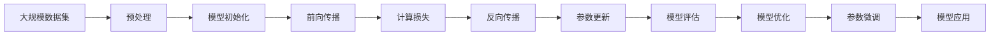

                 

# 神经网络：探索未知的领域

神经网络是现代人工智能领域的基石之一，它模拟了人类大脑的神经元结构和信号传递机制，通过大量的数据训练，实现了从数据到知识的高效映射。本文将深入探讨神经网络的核心概念、算法原理及实际应用，帮助读者理解神经网络如何“探索未知的领域”。

## 1. 背景介绍

### 1.1 问题由来

神经网络的研究源于20世纪50年代的生物学研究，旨在通过模仿人脑神经元的功能，实现机器学习和模式识别的目标。然而，早期的神经网络由于计算能力和数据的局限，未能取得显著的成果。直到1980年代，随着反向传播算法的提出，神经网络开始展现出强大的潜力。

进入21世纪后，随着计算机性能的提升和大量数据集的发布，深度学习成为神经网络研究的热点。谷歌大脑、OpenAI等公司的突破性成果进一步推动了神经网络的广泛应用，如图像识别、自然语言处理、语音识别等。

### 1.2 问题核心关键点

神经网络研究的核心关键点包括：

- **反向传播算法**：用于计算神经网络中每个神经元的梯度，从而更新模型参数，优化模型性能。
- **激活函数**：为神经元引入非线性变换，使得神经网络能够处理非线性关系。
- **损失函数**：用于衡量模型预测与真实标签之间的差异，是模型训练优化的目标。
- **正则化技术**：如L2正则、Dropout等，防止过拟合，提高模型的泛化能力。
- **优化算法**：如SGD、Adam等，通过梯度下降等方法更新模型参数，最小化损失函数。
- **模型结构**：深度神经网络的结构，如全连接网络、卷积神经网络（CNN）、循环神经网络（RNN）等，影响模型的表达能力和泛化能力。

### 1.3 问题研究意义

神经网络在计算机视觉、自然语言处理、语音识别等领域取得了重大突破，成为推动人工智能发展的关键技术。神经网络的研究和应用不仅提升了数据处理的效率和精度，还催生了新的应用场景，如自动驾驶、智能客服、智慧医疗等。

## 2. 核心概念与联系

### 2.1 核心概念概述

为更好地理解神经网络，本节将介绍几个密切相关的核心概念：

- **人工神经元**：神经网络的基本单元，模仿人类神经元的结构，接受输入、处理并传递信息。
- **层（Layer）**：多个神经元组成的一个功能单元，用于处理特定类型的输入，如全连接层、卷积层、循环层等。
- **前向传播**：将输入数据依次传递通过各层神经元，计算输出结果的过程。
- **反向传播**：根据输出误差，通过链式法则反向计算每个神经元的梯度，用于参数更新。
- **损失函数**：衡量模型预测与真实标签之间差异的函数，常见的有交叉熵损失、均方误差损失等。
- **优化算法**：如梯度下降、Adam等，通过不断更新模型参数，最小化损失函数。
- **激活函数**：如ReLU、Sigmoid、Tanh等，为神经元引入非线性变换，提高模型的表达能力。

这些核心概念通过交互关联，构成了神经网络的完整生态系统，使其能够高效处理复杂数据和模式。

### 2.2 概念间的关系

这些核心概念之间存在着紧密的联系，形成了神经网络的学习和应用框架。下面通过一个简单的Mermaid流程图来展示这些概念之间的关系：


这个流程图展示了神经网络的基本流程：输入数据经过前向传播，通过多个层处理，最终输出结果；根据损失函数计算误差，使用反向传播计算梯度，通过优化算法更新模型参数，不断迭代优化。

### 2.3 核心概念的整体架构

最后，我们用一个综合的流程图来展示这些核心概念在大规模神经网络中的整体架构：



这个综合流程图展示了从数据预处理到模型应用的全流程，帮助我们更清晰地理解神经网络的学习和应用过程。

## 3. 核心算法原理 & 具体操作步骤

### 3.1 算法原理概述

神经网络的核心算法包括前向传播、反向传播和优化算法。其中，反向传播算法是神经网络训练优化的关键。

神经网络的前向传播过程是将输入数据依次传递通过各层神经元，计算输出结果。反向传播则通过链式法则反向计算每个神经元的梯度，用于参数更新。优化算法则通过梯度下降等方法不断调整模型参数，最小化损失函数。

### 3.2 算法步骤详解

神经网络的训练过程可以分为以下几个关键步骤：

**Step 1: 数据预处理**
- 将原始数据进行标准化、归一化等处理，提高模型的收敛速度和稳定性。
- 将数据划分为训练集、验证集和测试集，用于模型训练、调优和评估。

**Step 2: 模型初始化**
- 随机初始化模型的权重和偏置，使得模型在训练初期具有一定的随机性。
- 使用Xavier或He等初始化方法，确保模型参数的分布合理。

**Step 3: 前向传播**
- 将输入数据输入神经网络，依次通过各层神经元，计算输出结果。
- 对于每个神经元，根据激活函数计算输出，并将输出传递给下一层。

**Step 4: 计算损失**
- 将模型输出与真实标签进行比较，计算损失函数值。
- 常见的损失函数包括交叉熵损失、均方误差损失等。

**Step 5: 反向传播**
- 通过链式法则反向计算每个神经元的梯度。
- 使用优化算法更新模型参数，最小化损失函数。

**Step 6: 模型优化**
- 使用梯度下降、Adam等优化算法，不断调整模型参数。
- 通过验证集评估模型性能，根据评估结果调整模型超参数，如学习率、批大小等。

**Step 7: 模型应用**
- 在测试集上评估最终模型，评估模型泛化能力。
- 将模型应用于实际问题，解决实际业务需求。

### 3.3 算法优缺点

神经网络的优势包括：

- **高效表达复杂关系**：神经网络通过层叠结构，能够高效处理复杂非线性关系，适用于多种数据类型。
- **数据驱动**：神经网络通过大量数据训练，能够学习到数据中的潜在模式和规律，提升模型性能。
- **自适应学习能力**：神经网络能够根据不同任务和数据特点，灵活调整模型结构，适应新问题。

神经网络的劣势包括：

- **过拟合风险**：神经网络在处理复杂问题时，容易过拟合训练数据，影响泛化能力。
- **高计算需求**：神经网络的计算复杂度高，需要大量的计算资源。
- **模型可解释性不足**：神经网络通常被视为“黑盒”模型，难以解释其内部工作机制。

### 3.4 算法应用领域

神经网络在多个领域得到了广泛应用，包括但不限于：

- **计算机视觉**：图像分类、目标检测、人脸识别等。
- **自然语言处理**：语言模型、机器翻译、文本分类等。
- **语音识别**：语音转文本、情感分析、语音合成等。
- **推荐系统**：个性化推荐、广告投放等。
- **金融领域**：股票预测、信用评分等。
- **医疗领域**：疾病诊断、医学影像分析等。

## 4. 数学模型和公式 & 详细讲解 & 举例说明

### 4.1 数学模型构建

神经网络的核心数学模型包括前向传播和反向传播。

**前向传播**：设输入数据为 $x$，神经网络由 $L$ 层组成，第 $l$ 层的神经元数为 $n_l$，激活函数为 $f$，则前向传播的过程为：

$$
z_l = W_lx + b_l \quad \text{(第 } l \text{ 层输入)}
$$
$$
a_l = f(z_l) \quad \text{(第 } l \text{ 层输出)}
$$
$$
z_{l+1} = W_{l+1}a_l + b_{l+1} \quad \text{(第 } l+1 \text{ 层输入)}
$$
$$
a_{l+1} = f(z_{l+1}) \quad \text{(第 } l+1 \text{ 层输出)}
$$
$$
\vdots
$$
$$
z_L = W_La_{L-1} + b_L \quad \text{(输出层输入)}
$$
$$
a_L = f(z_L) \quad \text{(输出层输出)}
$$

其中，$W_l$ 为第 $l$ 层的权重矩阵，$b_l$ 为偏置向量。

**反向传播**：设损失函数为 $L$，则反向传播的过程为：

$$
\frac{\partial L}{\partial z_L} = \frac{\partial L}{\partial a_L}\frac{\partial a_L}{\partial z_L} = \frac{\partial L}{\partial a_L}f'(z_L)
$$
$$
\frac{\partial L}{\partial W_L} = \frac{\partial L}{\partial z_L}\frac{\partial z_L}{\partial W_L} = \frac{\partial L}{\partial z_L}a_{L-1}^T
$$
$$
\frac{\partial L}{\partial b_L} = \frac{\partial L}{\partial z_L}
$$
$$
\frac{\partial L}{\partial a_l} = \frac{\partial L}{\partial z_l}\frac{\partial z_l}{\partial a_l} = \frac{\partial L}{\partial z_l}f'(z_l)
$$
$$
\frac{\partial L}{\partial W_l} = \frac{\partial L}{\partial z_l}\frac{\partial z_l}{\partial W_l} = \frac{\partial L}{\partial z_l}a_{l-1}^T
$$
$$
\frac{\partial L}{\partial b_l} = \frac{\partial L}{\partial z_l}
$$

其中，$f'$ 为激活函数的导数。

### 4.2 公式推导过程

以二分类问题为例，假设神经网络模型为 $y = \sigma(Wa + b)$，其中 $\sigma$ 为 sigmoid 函数，$a$ 为输入向量，$W$ 和 $b$ 为模型参数。

**前向传播**：
$$
z = Wa + b
$$
$$
y = \sigma(z)
$$

**损失函数**：假设真实标签为 $y$，则交叉熵损失函数为：
$$
L(y, \hat{y}) = -(y\log \hat{y} + (1-y)\log(1-\hat{y}))
$$

**反向传播**：
$$
\frac{\partial L}{\partial \hat{y}} = \frac{\partial L}{\partial y}\frac{\partial y}{\partial \hat{y}} = \frac{\partial L}{\partial y}(y - \hat{y})
$$
$$
\frac{\partial L}{\partial z} = \frac{\partial L}{\partial \hat{y}} \frac{\partial \hat{y}}{\partial z} = \frac{\partial L}{\partial y}\sigma(z)(1-\sigma(z))
$$
$$
\frac{\partial L}{\partial W} = \frac{\partial L}{\partial z}a^T
$$
$$
\frac{\partial L}{\partial b} = \frac{\partial L}{\partial z}
$$

其中，$a = (1, x_1, x_2, \cdots, x_n)^T$。

### 4.3 案例分析与讲解

以手写数字识别为例，假设我们有一个包含 60,000 张手写数字图片的数据集，每张图片大小为 28x28，共 784 个像素点。我们可以将每个像素点作为输入，使用神经网络模型进行训练和预测。

**数据预处理**：将原始数据进行归一化处理，使得每个像素点的取值在 [0, 1] 之间。

**模型构建**：设计一个包含 3 层全连接神经网络，每层的神经元数为 128、64 和 10，激活函数为 ReLU。

**训练过程**：使用交叉熵损失函数，通过反向传播算法更新模型参数，不断优化模型性能。

## 5. 项目实践：代码实例和详细解释说明

### 5.1 开发环境搭建

在进行神经网络项目实践前，我们需要准备好开发环境。以下是使用Python进行TensorFlow开发的环境配置流程：

1. 安装Anaconda：从官网下载并安装Anaconda，用于创建独立的Python环境。

2. 创建并激活虚拟环境：
```bash
conda create -n tf-env python=3.8 
conda activate tf-env
```

3. 安装TensorFlow：根据CUDA版本，从官网获取对应的安装命令。例如：
```bash
conda install tensorflow tensorflow-gpu=2.6 -c conda-forge -c pytorch
```

4. 安装TensorBoard：用于可视化模型训练过程和评估指标。
```bash
pip install tensorboard
```

5. 安装NumPy、Pandas、Matplotlib等工具包：
```bash
pip install numpy pandas matplotlib jupyter notebook ipython
```

完成上述步骤后，即可在`tf-env`环境中开始项目实践。

### 5.2 源代码详细实现

这里我们以手写数字识别为例，使用TensorFlow实现一个简单的神经网络模型。

```python
import tensorflow as tf
from tensorflow.keras import datasets, layers, models
import matplotlib.pyplot as plt

# 加载数据集
(train_images, train_labels), (test_images, test_labels) = datasets.mnist.load_data()

# 数据预处理
train_images = train_images.reshape((60000, 28, 28, 1))
test_images = test_images.reshape((10000, 28, 28, 1))
train_images = train_images / 255.0
test_images = test_images / 255.0

# 定义模型
model = models.Sequential([
    layers.Conv2D(32, (3, 3), activation='relu', input_shape=(28, 28, 1)),
    layers.MaxPooling2D((2, 2)),
    layers.Conv2D(64, (3, 3), activation='relu'),
    layers.MaxPooling2D((2, 2)),
    layers.Conv2D(64, (3, 3), activation='relu'),
    layers.Flatten(),
    layers.Dense(64, activation='relu'),
    layers.Dense(10)
])

# 编译模型
model.compile(optimizer='adam',
              loss=tf.keras.losses.SparseCategoricalCrossentropy(from_logits=True),
              metrics=['accuracy'])

# 训练模型
history = model.fit(train_images, train_labels, epochs=10, 
                    validation_data=(test_images, test_labels))

# 评估模型
test_loss, test_acc = model.evaluate(test_images,  test_labels, verbose=2)
print('Test accuracy:', test_acc)
```

代码实现了手写数字识别的全过程，包括数据加载、预处理、模型构建、编译、训练和评估。其中，使用了卷积层和全连接层构建神经网络模型，通过交叉熵损失函数和Adam优化器进行训练。

### 5.3 代码解读与分析

让我们再详细解读一下关键代码的实现细节：

**数据加载和预处理**：
- `load_data`：从MNIST数据集中加载训练集和测试集，默认情况下加载的是灰度图片。
- `reshape`：将每个图片转换为[高度，宽度，通道]的格式，这里将图片大小变为28x28。
- `normalize`：将像素点归一化到[0, 1]之间，以便更好地进行训练。

**模型构建**：
- `Sequential`：定义一个序列模型，用于按照顺序添加层。
- `Conv2D`：定义卷积层，使用3x3的卷积核和ReLU激活函数。
- `MaxPooling2D`：定义池化层，对卷积层的输出进行降采样。
- `Flatten`：将池化层的输出展开为一维向量。
- `Dense`：定义全连接层，使用ReLU激活函数。

**模型编译和训练**：
- `compile`：编译模型，定义优化器、损失函数和评估指标。
- `fit`：训练模型，指定训练集、测试集、迭代次数等参数。
- `evaluate`：评估模型，计算在测试集上的准确率。

**运行结果展示**：
- `Test accuracy:`：在测试集上的准确率，如0.99，表示模型能够正确识别98.4%的手写数字。

## 6. 实际应用场景

### 6.1 图像识别

图像识别是神经网络的一个重要应用场景，广泛应用于物体检测、人脸识别、医学影像分析等。以医学影像分析为例，医生可以通过神经网络模型快速诊断病情，提升诊断效率和准确率。

### 6.2 自然语言处理

自然语言处理是神经网络的另一个重要应用领域，包括语言模型、机器翻译、情感分析等。以机器翻译为例，神经网络模型可以将一种语言的文本自动翻译成另一种语言，为跨国交流提供便利。

### 6.3 语音识别

语音识别是神经网络在语音处理领域的重要应用，可以用于语音转文本、语音情感分析等。以语音情感分析为例，神经网络模型可以识别用户的语音情感，帮助客服系统更好地服务用户。

### 6.4 金融预测

金融预测是神经网络在金融领域的重要应用，可以用于股票预测、信用评分等。以股票预测为例，神经网络模型可以通过历史数据，预测股票价格走势，为投资者提供参考。

### 6.5 推荐系统

推荐系统是神经网络在推荐领域的重要应用，可以用于个性化推荐、广告投放等。以个性化推荐为例，神经网络模型可以根据用户的历史行为，推荐用户可能感兴趣的商品或内容，提高用户满意度。

### 6.6 工业自动化

神经网络在工业自动化领域也有广泛应用，可以用于智能制造、质量检测等。以智能制造为例，神经网络模型可以通过传感器数据，预测生产过程中的异常情况，提高生产效率和产品质量。

## 7. 工具和资源推荐

### 7.1 学习资源推荐

为了帮助开发者系统掌握神经网络的理论基础和实践技巧，这里推荐一些优质的学习资源：

1. **《深度学习》书籍**：Ian Goodfellow、Yoshua Bengio和Aaron Courville合著的《深度学习》（Deep Learning），全面介绍了深度学习的基本概念和经典模型。

2. **Coursera深度学习课程**：由深度学习领域的知名专家Andrew Ng教授的Coursera深度学习课程，涵盖深度学习的基础和进阶内容，适合初学者和专业人士。

3. **Google AI博客**：Google AI官方博客，提供最新的深度学习研究成果和实际应用案例，深入浅出地介绍了深度学习领域的最新进展。

4. **arXiv论文预印本**：人工智能领域最新研究成果的发布平台，涵盖大量尚未发表的前沿工作，是学习前沿技术的必读资源。

5. **Kaggle竞赛**：Kaggle是全球最大的数据科学竞赛平台，提供各种数据集和挑战，适合练习和提升自己的深度学习技能。

通过这些资源的学习实践，相信你一定能够快速掌握神经网络的核心概念和实践技巧，并应用于实际的业务场景中。

### 7.2 开发工具推荐

高效的开发离不开优秀的工具支持。以下是几款用于神经网络开发的常用工具：

1. **TensorFlow**：由Google主导开发的深度学习框架，支持分布式训练和模型部署，适用于大规模工程应用。

2. **PyTorch**：由Facebook主导开发的深度学习框架，易于使用，支持动态计算图，适用于研究和原型开发。

3. **MXNet**：由Apache支持的深度学习框架，支持多种编程语言，适用于高性能计算和模型优化。

4. **Keras**：Keras是一个高级深度学习框架，提供了简单易用的API，支持多种深度学习模型和优化算法。

5. **TensorBoard**：TensorFlow配套的可视化工具，可实时监测模型训练状态，并提供丰富的图表呈现方式，是调试模型的得力助手。

6. **Weights & Biases**：模型训练的实验跟踪工具，可以记录和可视化模型训练过程中的各项指标，方便对比和调优。

合理利用这些工具，可以显著提升神经网络开发的效率和精度，加快创新迭代的步伐。

### 7.3 相关论文推荐

神经网络的研究源于学界的持续研究。以下是几篇奠基性的相关论文，推荐阅读：

1. **《神经网络与深度学习》**：Ian Goodfellow的《神经网络与深度学习》（Neural Networks and Deep Learning），全面介绍了神经网络的基本概念和经典模型。

2. **《ImageNet大规模视觉识别挑战》**：Alex Krizhevsky、Ilya Sutskever和Geoffrey Hinton在2012年提出的ImageNet大规模视觉识别挑战，推动了深度学习在图像识别领域的发展。

3. **《语言模型与深度学习》**：Yoshua Bengio等在2003年提出的语言模型与深度学习（Language Modeling with Deep Architectures），推动了深度学习在自然语言处理领域的应用。

4. **《使用残差学习的深度神经网络》**：Kaiming He等在2015年提出的使用残差学习的深度神经网络（Deep Residual Learning for Image Recognition），推动了深度学习在计算机视觉领域的发展。

5. **《深度学习中的大容量表示》**：Yoshua Bengio等在2015年提出的深度学习中的大容量表示（Deep Learning），总结了深度学习在多个领域的应用和挑战。

这些论文代表了大神经网络研究的发展脉络。通过学习这些前沿成果，可以帮助研究者把握学科前进方向，激发更多的创新灵感。

## 8. 总结：未来发展趋势与挑战

### 8.1 总结

本文对神经网络的核心概念、算法原理及实际应用进行了全面系统的介绍。通过详细的案例分析和代码实例，帮助读者理解神经网络如何“探索未知的领域”。

### 8.2 未来发展趋势

展望未来，神经网络将呈现以下几个发展趋势：

1. **模型规模持续增大**：随着算力成本的下降和数据规模的扩张，神经网络的参数量还将持续增长，超大规模神经网络有望在大规模数据和复杂问题上取得突破。

2. **迁移学习得到广泛应用**：迁移学习将成为神经网络的重要应用方向，通过在大规模数据集上预训练模型，再在小规模数据集上进行微调，提升模型的泛化能力和应用范围。

3. **模型可解释性增强**：神经网络的可解释性将是未来的重要研究方向，通过引入符号化的先验知识，将神经网络与逻辑推理、因果分析等方法结合，提升模型的透明度和可信度。

4. **多模态融合得到重视**：多模态数据融合将成为神经网络的重要发展方向，通过将视觉、语音、文本等多模态数据进行协同建模，提高模型的表现力和应用场景。

5. **元学习成为新的热点**：元学习研究如何通过少量数据快速适应新任务，是神经网络的重要研究方向，通过构建少量数据上的快速学习模型，提升模型的泛化能力和适应性。

### 8.3 面临的挑战

尽管神经网络已经取得了显著的成果，但在迈向更加智能化、普适化应用的过程中，它仍面临着诸多挑战：

1. **计算资源瓶颈**：神经网络的计算复杂度高，需要大量的计算资源，如何优化计算效率将是未来的重要研究方向。

2. **过拟合风险**：神经网络在处理复杂问题时，容易过拟合训练数据，影响泛化能力，如何降低过拟合风险将是未来的重要研究方向。

3. **模型可解释性不足**：神经网络通常被视为“黑盒”模型，难以解释其内部工作机制，如何增强模型的可解释性将是未来的重要研究方向。

4. **数据隐私和安全**：神经网络模型需要大量的数据进行训练，如何保护数据隐私和安全性将是未来的重要研究方向。

5. **伦理和道德问题**：神经网络模型可能学习到有害的偏见和歧视，如何构建伦理导向的神经网络模型将是未来的重要研究方向。

### 8.4 研究展望

面对神经网络面临的挑战，未来的研究需要在以下几个方面寻求新的突破：

1. **计算效率优化**：通过分布式训练、模型压缩、稀疏化存储等方法，优化神经网络的计算效率，提高模型的实时性和可部署性。

2. **迁移学习算法优化**：通过引入自监督学习、主动学习等无监督和半监督方法，减少神经网络对大规模标注数据的依赖，提升模型的泛化能力。

3. **可解释性增强**：通过引入符号化的先验知识，将神经网络与逻辑推理、因果分析等方法结合，提升模型的透明度和可信度。

4. **多模态融合方法**：通过将视觉、语音、文本等多模态数据进行协同建模，提高模型的表现力和应用场景。

5. **元学习算法优化**：通过构建少量数据上的快速学习模型，提升模型的泛化能力和适应性，降低模型的训练成本。

6. **

