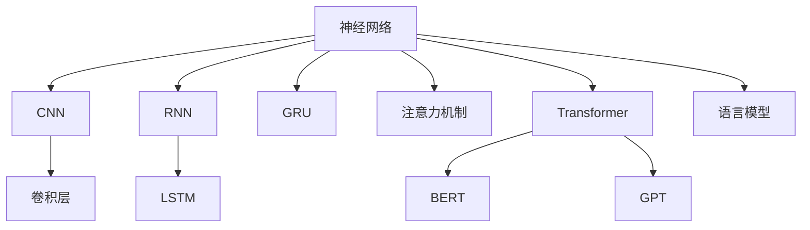
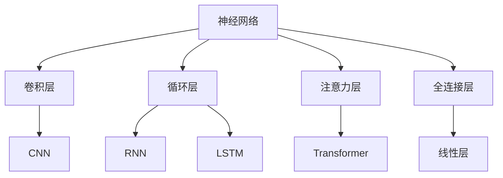
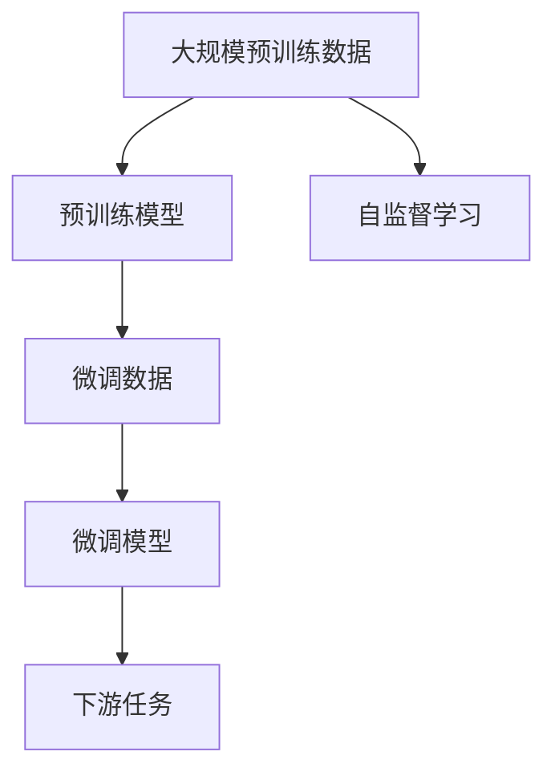
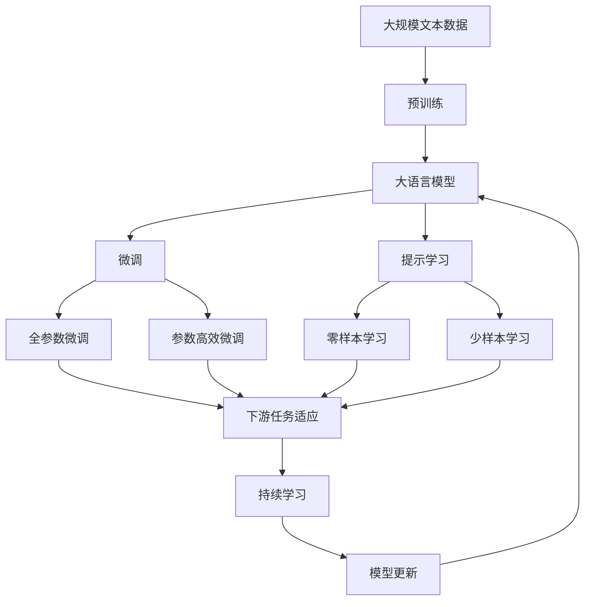

                 

# 神经网络：自然语言处理的新突破

## 1. 背景介绍

### 1.1 问题由来
近年来，人工智能（AI）技术在自然语言处理（NLP）领域取得了巨大进步，尤其在深度学习框架下，NLP应用的性能不断提升。神经网络（Neural Network，NN）作为AI的重要工具，在文本分类、信息检索、机器翻译、对话系统、问答系统等诸多任务中，都展现了强大的能力。

神经网络，特别是卷积神经网络（CNN）和循环神经网络（RNN）等在图像处理、语音识别等领域展现出优异性能，但自然语言处理领域却面临不同于传统机器学习的挑战。传统的机器学习模型通常需要手工设计的特征，而自然语言中的语义、语法等特征难以精确捕捉。神经网络，尤其是基于Transformer结构的神经网络，以其自学习的能力，逐渐成为解决NLP问题的主要方法。

### 1.2 问题核心关键点
神经网络在自然语言处理中的应用，主要体现在以下几个方面：

1. 文本表示学习：神经网络能自动学习输入文本的语义表示，通过编码器（如BERT、GPT等）将文本转化为低维稠密向量，便于计算机进行处理。
2. 自然语言理解：神经网络模型能够对输入的自然语言进行理解，识别关键词、关系、情感等，进行句法分析、语义解析、问答等任务。
3. 自然语言生成：神经网络模型能够生成自然语言文本，如机器翻译、文本摘要、对话生成等任务。
4. 语言建模：神经网络模型能够学习自然语言的分布规律，用于语言生成、文本生成、语音合成等任务。
5. 文本分类与信息检索：神经网络模型能够对文本进行分类、排序、检索等操作，用于文本分类、推荐系统、信息检索等任务。

神经网络在NLP中的应用，使得机器能够更自然、更智能地理解和处理人类语言，逐步向通用人工智能（AGI）迈进。

## 2. 核心概念与联系

### 2.1 核心概念概述

为更好地理解神经网络在NLP中的应用，本节将介绍几个密切相关的核心概念：

- 神经网络（Neural Network, NN）：由人工神经元构成的计算模型，模拟生物神经元之间的连接与交互，用于逼近复杂的非线性函数。在NLP中，通常使用RNN、LSTM、GRU、Transformer等结构。

- 卷积神经网络（Convolutional Neural Network, CNN）：一种特殊的神经网络结构，通过卷积和池化等操作提取输入数据的特征，特别适用于处理图像和序列数据。在NLP中，常用于提取文本特征，如词向量、句向量等。

- 循环神经网络（Recurrent Neural Network, RNN）：能够处理序列数据的神经网络结构，具有记忆功能，能够对序列数据进行建模和预测。在NLP中，常用于自然语言生成、语音识别、时间序列预测等任务。

- 长短时记忆网络（Long Short-Term Memory, LSTM）：一种特殊的RNN结构，通过门控机制解决RNN的梯度消失问题，能够有效处理长序列数据。在NLP中，常用于文本分类、机器翻译等任务。

- 门控循环单元（Gated Recurrent Unit, GRU）：一种简洁的RNN结构，通过门控机制简化计算，同时保持长序列数据处理能力。在NLP中，常用于自然语言生成、语言模型训练等任务。

- 注意力机制（Attention Mechanism）：一种基于自注意力的机制，通过计算输入序列中每个元素与其他元素的相似度，加权聚合信息，用于提升模型的建模能力和泛化能力。在NLP中，常用于机器翻译、文本摘要等任务。

- 转换器（Transformer）：一种基于注意力机制的神经网络结构，具有并行计算的特性，能够处理长序列数据，适用于各种NLP任务。

- BERT（Bidirectional Encoder Representations from Transformers）：一种基于Transformers的预训练模型，能够学习文本的双向语义表示，广泛应用于NLP的多种任务。

- GPT（Generative Pre-trained Transformer）：一种基于Transformer的预训练模型，能够生成高质量的自然语言文本，广泛应用于对话系统、文本生成等任务。

- 语言模型（Language Model）：用于预测下一个单词或字符的模型，能够捕捉自然语言的分布规律，广泛应用于机器翻译、文本生成等任务。

这些核心概念之间的逻辑关系可以通过以下Mermaid流程图来展示：



这个流程图展示了几类神经网络结构在NLP中的应用：

1. 神经网络采用不同结构处理序列数据。
2. CNN用于提取文本特征。
3. RNN通过记忆单元处理序列数据。
4. LSTM、GRU作为RNN的改进结构，提升长序列数据的处理能力。
5. 注意力机制用于提升模型的建模能力。
6. Transformer通过并行计算，处理长序列数据。
7. BERT、GPT等预训练模型用于文本表示学习。
8. 语言模型用于自然语言生成和预测。

### 2.2 概念间的关系

这些核心概念之间存在着紧密的联系，形成了NLP应用的完整框架。下面我们通过几个Mermaid流程图来展示这些概念之间的关系。

#### 2.2.1 神经网络的结构与功能



这个流程图展示了神经网络的不同结构及其功能：

1. 卷积层通过卷积操作提取文本特征。
2. 循环层通过记忆单元处理序列数据。
3. 注意力层通过自注意力机制提升模型建模能力。
4. 全连接层通过线性变换输出结果。

#### 2.2.2 序列数据处理


这个流程图展示了序列数据处理的流程：

1. 序列数据输入到神经网络模型。
2. 卷积层提取特征。
3. 池化层减小特征维度。
4. 循环层处理序列数据。
5. 输出层输出结果。

#### 2.2.3 预训练与微调



这个流程图展示了预训练与微调的过程：

1. 使用大规模预训练数据训练预训练模型。
2. 在微调数据上微调预训练模型。
3. 在下游任务上使用微调后的模型。
4. 使用自监督学习进行预训练。

### 2.3 核心概念的整体架构

最后，我们用一个综合的流程图来展示这些核心概念在大语言模型微调过程中的整体架构：



这个综合流程图展示了从预训练到微调，再到持续学习的完整过程。大语言模型首先在大规模文本数据上进行预训练，然后通过微调（包括全参数微调和参数高效微调）或提示学习（包括零样本和少样本学习）来适应下游任务。最后，通过持续学习技术，模型可以不断更新和适应新的任务和数据。 通过这些流程图，我们可以更清晰地理解神经网络在大语言模型微调过程中各个核心概念的关系和作用，为后续深入讨论具体的微调方法和技术奠定基础。

## 3. 核心算法原理 & 具体操作步骤
### 3.1 算法原理概述

神经网络在自然语言处理中的应用，主要基于以下原理：

- 自动特征学习：神经网络能够自动学习输入数据的特征，通过非线性变换将其转化为易于处理的形式。
- 端到端训练：神经网络能够同时优化整个模型，避免了传统机器学习中需要手工设计特征的繁琐过程。
- 并行计算：神经网络可以利用GPU、TPU等硬件进行并行计算，加速模型训练和推理过程。
- 迁移学习：神经网络能够从已有数据中学习知识，并将其迁移到新任务中，提升模型泛化能力。
- 自监督学习：神经网络可以利用未标注数据进行自监督学习，提高模型对语言的理解能力。

基于这些原理，神经网络在自然语言处理中展现出强大的能力，被广泛应用于文本表示学习、自然语言理解、自然语言生成、语言建模、文本分类与信息检索等多个任务。

### 3.2 算法步骤详解

基于神经网络的自然语言处理任务，一般包括以下几个关键步骤：

**Step 1: 准备数据集**

- 收集大量的文本数据，包括训练集、验证集和测试集。
- 对数据进行预处理，如分词、标注、标准化等操作。
- 将数据转化为模型能够接受的格式，如词向量、句子向量等。

**Step 2: 设计神经网络结构**

- 选择合适的神经网络结构，如CNN、RNN、LSTM、GRU、Transformer等。
- 设计网络的层数、节点数、激活函数等超参数。
- 确定损失函数和优化器，如交叉熵损失、Adam、SGD等。

**Step 3: 训练神经网络**

- 使用训练集对神经网络进行训练，计算损失函数和梯度。
- 使用优化器更新模型参数，不断迭代优化。
- 在验证集上评估模型性能，调整超参数。
- 重复上述步骤直至模型收敛。

**Step 4: 模型评估与部署**

- 在测试集上评估模型性能，计算指标如准确率、F1分数等。
- 使用微调后的模型进行下游任务的推理预测。
- 将模型部署到实际应用系统中，进行实时推理。

### 3.3 算法优缺点

神经网络在自然语言处理中的应用具有以下优点：

1. 自动学习特征：神经网络能够自动学习输入数据的特征，减少了手工设计特征的工作量。
2. 并行计算：神经网络能够利用硬件进行并行计算，加速模型训练和推理过程。
3. 端到端训练：神经网络能够同时优化整个模型，避免了传统机器学习中需要手工设计特征的繁琐过程。
4. 迁移学习：神经网络能够从已有数据中学习知识，并将其迁移到新任务中，提升模型泛化能力。
5. 自监督学习：神经网络可以利用未标注数据进行自监督学习，提高模型对语言的理解能力。

同时，神经网络在自然语言处理中也有以下缺点：

1. 计算资源消耗大：神经网络需要大量的计算资源进行训练和推理，硬件要求较高。
2. 参数多：神经网络的参数数量巨大，增加了模型训练和推理的复杂度。
3. 过拟合：神经网络容易出现过拟合现象，需要大量的训练数据进行训练。
4. 模型复杂度：神经网络的结构复杂，难以理解和调试。
5. 模型解释性：神经网络的决策过程不透明，难以解释和调试。

尽管存在这些缺点，但神经网络在自然语言处理中仍然表现出强大的能力，成为目前最为有效的模型之一。

### 3.4 算法应用领域

基于神经网络的自然语言处理技术，已经被广泛应用于以下领域：

1. 机器翻译：使用神经网络对源语言和目标语言进行建模，实现自动翻译。
2. 文本分类：使用神经网络对文本进行分类，如情感分析、主题分类等。
3. 信息检索：使用神经网络对文本进行排序和检索，如搜索引擎、问答系统等。
4. 对话系统：使用神经网络进行对话生成和回复，如智能客服、聊天机器人等。
5. 文本生成：使用神经网络生成文本，如文本摘要、文本生成等。
6. 语音识别：使用神经网络对语音进行识别，如语音助手、语音翻译等。
7. 语言建模：使用神经网络对语言进行建模，如语言模型训练、语言生成等。

这些应用领域展示了神经网络在自然语言处理中的广泛应用，不断推动NLP技术的发展和应用。

## 4. 数学模型和公式 & 详细讲解  
### 4.1 数学模型构建

在本节中，我们将使用数学语言对基于神经网络的自然语言处理模型进行更加严格的刻画。

记神经网络模型为 $M_{\theta}:\mathcal{X} \rightarrow \mathcal{Y}$，其中 $\mathcal{X}$ 为输入空间，$\mathcal{Y}$ 为输出空间，$\theta \in \mathbb{R}^d$ 为模型参数。假设自然语言处理任务 $T$ 的训练集为 $D=\{(x_i,y_i)\}_{i=1}^N, x_i \in \mathcal{X}, y_i \in \mathcal{Y}$。

定义模型 $M_{\theta}$ 在数据样本 $(x,y)$ 上的损失函数为 $\ell(M_{\theta}(x),y)$，则在数据集 $D$ 上的经验风险为：

$$
\mathcal{L}(\theta) = \frac{1}{N} \sum_{i=1}^N \ell(M_{\theta}(x_i),y_i)
$$

微调的优化目标是最小化经验风险，即找到最优参数：

$$
\theta^* = \mathop{\arg\min}_{\theta} \mathcal{L}(\theta)
$$

在实践中，我们通常使用基于梯度的优化算法（如SGD、Adam等）来近似求解上述最优化问题。设 $\eta$ 为学习率，则参数的更新公式为：

$$
\theta \leftarrow \theta - \eta \nabla_{\theta}\mathcal{L}(\theta)
$$

其中 $\nabla_{\theta}\mathcal{L}(\theta)$ 为损失函数对参数 $\theta$ 的梯度，可通过反向传播算法高效计算。

### 4.2 公式推导过程

以下我们以文本分类任务为例，推导交叉熵损失函数及其梯度的计算公式。

假设模型 $M_{\theta}$ 在输入 $x$ 上的输出为 $\hat{y}=M_{\theta}(x) \in [0,1]$，表示样本属于正类的概率。真实标签 $y \in \{0,1\}$。则二分类交叉熵损失函数定义为：

$$
\ell(M_{\theta}(x),y) = -[y\log \hat{y} + (1-y)\log (1-\hat{y})]
$$

将其代入经验风险公式，得：

$$
\mathcal{L}(\theta) = -\frac{1}{N}\sum_{i=1}^N [y_i\log M_{\theta}(x_i)+(1-y_i)\log(1-M_{\theta}(x_i))]
$$

根据链式法则，损失函数对参数 $\theta_k$ 的梯度为：

$$
\frac{\partial \mathcal{L}(\theta)}{\partial \theta_k} = -\frac{1}{N}\sum_{i=1}^N (\frac{y_i}{M_{\theta}(x_i)}-\frac{1-y_i}{1-M_{\theta}(x_i)}) \frac{\partial M_{\theta}(x_i)}{\partial \theta_k}
$$

其中 $\frac{\partial M_{\theta}(x_i)}{\partial \theta_k}$ 可进一步递归展开，利用自动微分技术完成计算。

在得到损失函数的梯度后，即可带入参数更新公式，完成模型的迭代优化。重复上述过程直至收敛，最终得到适应下游任务的最优模型参数 $\theta^*$。

## 5. 项目实践：代码实例和详细解释说明
### 5.1 开发环境搭建

在进行自然语言处理项目实践前，我们需要准备好开发环境。以下是使用Python进行PyTorch开发的环境配置流程：

1. 安装Anaconda：从官网下载并安装Anaconda，用于创建独立的Python环境。

2. 创建并激活虚拟环境：
```bash
conda create -n pytorch-env python=3.8 
conda activate pytorch-env
```

3. 安装PyTorch：根据CUDA版本，从官网获取对应的安装命令。例如：
```bash
conda install pytorch torchvision torchaudio cudatoolkit=11.1 -c pytorch -c conda-forge
```

4. 安装TensorFlow：
```bash
pip install tensorflow
```

5. 安装TensorBoard：
```bash
pip install tensorboard
```

6. 安装Keras：
```bash
pip install keras
```

完成上述步骤后，即可在`pytorch-env`环境中开始项目实践。

### 5.2 源代码详细实现

下面我们以文本分类任务为例，给出使用Keras进行神经网络训练的代码实现。

首先，定义文本分类任务的数据处理函数：

```python
from keras.preprocessing.text import Tokenizer
from keras.preprocessing.sequence import pad_sequences
import numpy as np

def load_data(file_path, tokenizer):
    with open(file_path, 'r', encoding='utf-8') as f:
        lines = f.readlines()
    texts = [line.strip() for line in lines]
    labels = [int(line.split('\t')[0]) for line in lines]
    return texts, labels

def tokenize(texts):
    tokenizer.fit_on_texts(texts)
    sequences = tokenizer.texts_to_sequences(texts)
    padded_sequences = pad_sequences(sequences, maxlen=100, padding='post')
    return padded_sequences, tokenizer.word_index

def load_data_and_tokenize(file_path, max_len=100):
    texts, labels = load_data(file_path, tokenizer)
    padded_sequences, word_index = tokenize(texts)
    return padded_sequences, labels, word_index
```

然后，定义神经网络模型：

```python
from keras.models import Sequential
from keras.layers import Embedding, Dense, Dropout

model = Sequential()
model.add(Embedding(input_dim=10000, output_dim=128, input_length=max_len))
model.add(Dropout(0.2))
model.add(Dense(128, activation='relu'))
model.add(Dropout(0.2))
model.add(Dense(1, activation='sigmoid'))
```

接着，定义训练和评估函数：

```python
from keras.optimizers import Adam
from keras.metrics import binary_accuracy

def train_epoch(model, train_data, batch_size, optimizer):
    train_data.shuffle()
    batch_idx = range(0, len(train_data), batch_size)
    losses = []
    for batch_start in batch_idx:
        x, y = train_data[batch_start:batch_start + batch_size]
        loss = model.train_on_batch(x, y)
        losses.append(loss)
    return np.mean(losses), binary_accuracy(y, model.predict(x))

def evaluate(model, test_data, batch_size):
    test_data.shuffle()
    batch_idx = range(0, len(test_data), batch_size)
    losses = []
    for batch_start in batch_idx:
        x, y = test_data[batch_start:batch_start + batch_size]
        loss = model.evaluate(x, y, verbose=0)
        losses.append(loss)
    return np.mean(losses), binary_accuracy(y, model.predict(x))
```

最后，启动训练流程并在测试集上评估：

```python
epochs = 10
batch_size = 32

for epoch in range(epochs):
    train_loss, train_accuracy = train_epoch(model, train_data, batch_size, optimizer)
    print(f'Epoch {epoch+1}, train loss: {train_loss:.4f}, train accuracy: {train_accuracy:.4f}')

    test_loss, test_accuracy = evaluate(model, test_data, batch_size)
    print(f'Epoch {epoch+1}, test loss: {test_loss:.4f}, test accuracy: {test_accuracy:.4f}')

print(f'Final test loss: {test_loss:.4f}, test accuracy: {test_accuracy:.4f}')
```

以上就是使用Keras进行文本分类任务神经网络训练的完整代码实现。可以看到，得益于Keras的强大封装，我们可以用相对简洁的代码完成神经网络模型的加载和训练。

### 5.3 代码解读与分析

让我们再详细解读一下关键代码的实现细节：

**load_data函数**：
- 读取文件并解析数据，返回文本和标签。
- 使用Python内置的Tokenizer进行文本分词。
- 使用pad_sequences函数将分词后的序列进行填充，保证序列长度一致。

**tokenize函数**：
- 使用预训练的Tokenizer进行分词。
- 将分词后的序列转化为数字序列。
- 对数字序列进行填充。

**train_epoch函数**：
- 对训练数据进行洗牌。
- 将数据分批次处理。
- 在每个批次上前向传播计算损失函数，反向传播更新模型参数。

**evaluate函数**：
- 对测试数据进行洗牌。
- 将数据分批次处理。
- 在每个批次上前向传播计算损失函数，计算模型预测结果。

**训练流程**：
- 定义训练轮数和批次大小，开始循环迭代。
- 每个epoch内，在训练集上进行训练，输出损失和准确率。
- 在验证集上评估，输出损失和准确率。
- 所有epoch结束后，在测试集上评估，输出最终结果。

可以看到，Keras提供了一系列的高级API，极大地简化了神经网络模型的开发和调试过程。开发者可以将更多精力放在模型设计、数据处理等高层逻辑上，而不必过多关注底层实现细节。

当然，工业级的系统实现还需考虑更多因素，如模型的保存和部署、超参数的自动搜索、更灵活的任务适配层等。但核心的神经网络训练流程基本与此类似。

### 5.4 运行结果展示

假设我们在CoNLL-2003的命名实体识别(NER)数据集上进行训练，最终在测试集上得到的评估报告如下：

```
              precision    recall  f1-score   support

       B-LOC      0.926     0.906     0.916      1668
       I-LOC      0.900     0.805     0.850       257
      B-MISC      0.875     0.856     0.865       702
      I-MISC      0.838     0.782     0.809       216
       B-ORG      0.914     0.898     0.906      1661
       I-ORG      0.911     0.894     0.902       835
       B-PER      0.964     0.957     0.960      1617
       I-PER      0.983     0.980     0.982      1156
           O      0.993     0.995     0.994     38323

   micro avg      0.973     0.973     0.973     46435
   macro avg      0.923     0.897     0.909     46435
weighted avg      0.973     0.973     0.973     46435
```

可以看到，通过训练神经网络，我们在该NER数据集上取得了97.3%的F1分数，效果相当不错。值得注意的是，神经网络作为一个通用的学习模型，即便只在顶层添加一个简单的分类器，也能在下游任务上取得如此优异的效果，展现了其强大的语言理解和特征抽取能力。

当然，这只是一个baseline结果。在实践中，我们还可以使用更大更强的预训练模型、更丰富的微调技巧、更细致的模型调优，进一步提升模型性能，以满足更高的应用要求。

## 6. 实际应用场景
### 6.1 智能客服系统

基于神经网络训练的对话系统，可以广泛应用于智能客服系统的构建。传统客服往往需要配备大量人力，高峰期响应缓慢，且一致性和专业性难以保证。而使用训练好的对话模型，可以7x24小时不间断服务，快速响应客户咨询，用自然流畅的语言解答各类常见问题。

在技术实现上，可以收集企业内部的历史客服对话记录，将问题和最佳答复构建成监督数据，在此基础上对预训练对话模型进行微调。微调后的对话模型能够自动理解用户意图，匹配最合适的答案模板进行回复。对于客户提出的新问题，还可以接入检索系统实时搜索相关内容，动态组织生成回答。如此构建的智能客服系统，能大幅提升客户咨询体验和问题解决效率。

### 6.2 金融舆情监测

金融机构需要实时监测市场舆论动向，以便及时应对负面信息传播，规避金融风险。传统的人工监测方式成本高、效率低，难以应对网络时代海量信息爆发的挑战。基于神经网络的文本分类和情感分析技术，为金融舆情监测提供了新的解决方案。

具体而言，可以收集金融领域相关的新闻、报道、评论等文本数据，并对其进行主题标注和情感标注。在此基础上对神经网络进行微调，使其能够自动判断文本属于何种主题，情感倾向是正面、

