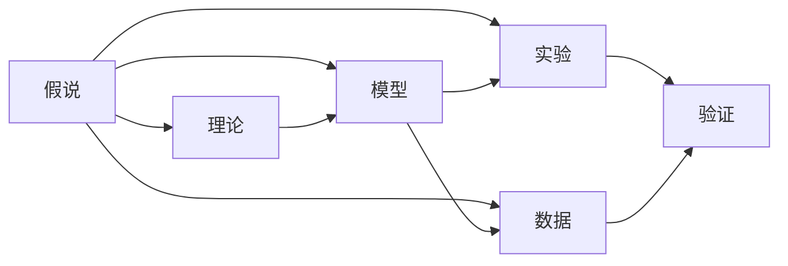
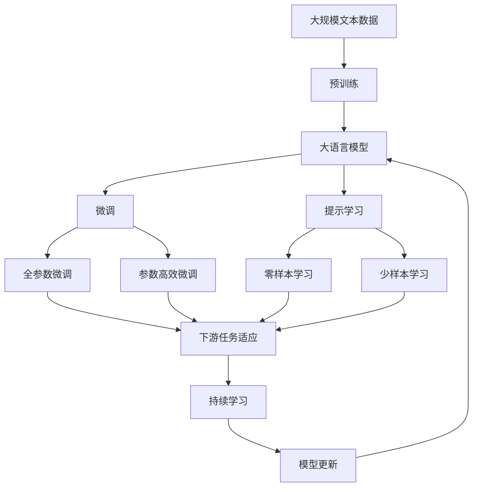

                 

# 科学发现：从假说到理论

## 1. 背景介绍

### 1.1 问题由来
科学发现是人类认识世界、改造世界的基石。从古至今，无数科学家不懈探索，推动了人类文明的发展。然而，科学发现并非一蹴而就，它是一个从假说到理论、从理论到实践的过程。从对自然现象的观察，到提出假说，再到实验验证，最终形成理论，整个过程充满了挑战和未知。

### 1.2 问题核心关键点
科学发现的本质是认识世界和解决问题的过程。在这一过程中，假说、理论和实验三者密不可分。假说提供了对现象的解释，理论则是对假说的数学化和系统化，实验则是检验假说和理论是否正确的过程。这三个环节相互依赖、相互推动，共同构成了科学发现的核心框架。

### 1.3 问题研究意义
研究科学发现的本质和过程，不仅有助于理解科学发展的内在规律，还能为科学研究提供更系统、更有效的方法论。掌握科学的发现规律，有助于科学家们更加高效地开展研究，解决更多实际问题，推动科学技术的进步。

## 2. 核心概念与联系

### 2.1 核心概念概述

为更好地理解科学发现的本质和过程，本节将介绍几个密切相关的核心概念：

- 假说(Hypothesis)：基于对自然现象的观察和经验，提出的一种解释性假设。假说具有一定的预测能力，是科学发现的重要起点。
- 理论(Theory)：对假说进行数学化、系统化处理，形成了一套能够解释、预测和预测自然现象的逻辑体系。理论是假说的升华和提炼。
- 实验(Experiment)：通过实验来检验假说和理论的正确性。实验是连接假说和理论的桥梁，是科学发现的最终验证环节。
- 数据(Data)：科学发现过程中获取的各种观察数据和实验结果。数据是假说和理论的依据，也是实验验证的素材。
- 模型(Model)：对现象进行数学建模，形成的一种抽象表达方式。模型是理论的具体化，有助于简化和理解复杂的自然现象。
- 计算(Computation)：通过计算来验证和优化理论。计算是理论应用的重要手段，也是科学发现的重要工具。

这些核心概念之间的逻辑关系可以通过以下Mermaid流程图来展示：



这个流程图展示了假说、理论、实验、数据和模型之间的关系：

1. 假说提供对现象的解释。
2. 理论通过数学化处理假说，形成系统的解释体系。
3. 实验通过数据来验证假说和理论的正确性。
4. 数据是假说和理论的依据，也是实验验证的素材。
5. 模型是对现象的抽象表达，是理论的具体化。
6. 计算是理论验证和优化的重要手段。

这些核心概念共同构成了科学发现的完整框架，有助于理解科学发现的本质和过程。通过理解这些核心概念，我们可以更好地把握科学发现的规律和方法。

### 2.2 概念间的关系

这些核心概念之间存在着紧密的联系，形成了科学发现的完整生态系统。下面我们通过几个Mermaid流程图来展示这些概念之间的关系。

#### 2.2.1 假说和理论的关系


这个流程图展示了假说和理论之间的相互关系：

1. 假说提供对现象的解释。
2. 理论通过数学化处理假说，形成系统的解释体系。
3. 理论反过来可以解释假说，提供更精确的解释。

#### 2.2.2 实验和数据的关系


这个流程图展示了实验和数据之间的关系：

1. 实验通过获取数据来验证假说和理论的正确性。
2. 数据是实验的结果，反过来可用于改进实验设计，获取更精确的数据。

#### 2.2.3 模型和计算的关系


这个流程图展示了模型和计算之间的关系：

1. 模型通过计算来验证和优化理论。
2. 计算可以用于模拟和预测模型，进一步优化模型。

### 2.3 核心概念的整体架构

最后，我们用一个综合的流程图来展示这些核心概念在大模型微调过程中的整体架构：



这个综合流程图展示了从预训练到微调，再到持续学习的完整过程。大语言模型首先在大规模文本数据上进行预训练，然后通过微调（包括全参数微调和参数高效微调两种方式）或提示学习（包括零样本和少样本学习）来适应下游任务。最后，通过持续学习技术，模型可以不断学习新知识，同时避免遗忘旧知识。 通过这些流程图，我们可以更清晰地理解科学发现的本质和过程。

## 3. 核心算法原理 & 具体操作步骤
### 3.1 算法原理概述

科学发现的过程可以从假说到理论，再从理论到实验。科学发现的核心在于假设和验证。科学家们通过观察自然现象，提出假设，然后通过实验来验证假设的正确性，从而形成科学理论。这一过程可以总结如下：

- **观察**：通过感官或科学仪器获取自然现象的观察数据。
- **提出假设**：基于观察数据，提出一种可能的解释性假设。
- **理论构建**：对假设进行数学化、系统化处理，形成理论。
- **实验验证**：通过实验来检验理论的正确性。
- **模型优化**：根据实验结果，优化理论，形成更精确的模型。
- **应用推广**：将理论应用于其他现象，进行进一步的验证和推广。

### 3.2 算法步骤详解

科学发现的每个环节都有其具体的步骤和技巧。以下是对每个环节的详细介绍：

#### 3.2.1 观察

- **方法**：使用科学仪器进行观测，或通过感官获取数据。
- **记录**：详细记录观察数据，包括时间、地点、环境、观测方法等。
- **数据分析**：对观察数据进行初步分析，发现规律和异常。

#### 3.2.2 提出假设

- **逻辑推理**：基于观察数据，通过逻辑推理提出假设。
- **假设验证**：设计实验来验证假设的正确性。
- **假设改进**：根据实验结果，改进假设。

#### 3.2.3 理论构建

- **数学建模**：将假设转化为数学模型，形成理论。
- **逻辑推导**：通过逻辑推导，验证理论的正确性。
- **理论应用**：将理论应用于其他现象，进行推广。

#### 3.2.4 实验验证

- **实验设计**：设计实验来检验理论的正确性。
- **实验实施**：实施实验，获取数据。
- **数据分析**：分析实验数据，判断理论的正确性。

#### 3.2.5 模型优化

- **模型修正**：根据实验结果，修正理论。
- **模型验证**：使用修正后的模型，进行进一步的实验验证。
- **模型推广**：将修正后的模型，应用于其他现象。

#### 3.2.6 应用推广

- **理论验证**：将理论应用于其他现象，进行验证。
- **理论改进**：根据新现象，改进理论。
- **理论推广**：将改进后的理论，应用于其他领域。

### 3.3 算法优缺点

科学发现的方法论具有以下优点：

- **系统性**：科学发现过程具有系统性和逻辑性，有助于发现自然现象的内在规律。
- **可验证性**：科学发现通过实验来验证，具有较强的可验证性。
- **普适性**：科学发现形成的理论，具有普遍适用性，可以应用于其他领域和现象。

同时，科学发现的方法论也存在一些缺点：

- **假设局限**：假设可能是错误的，导致理论错误。
- **实验局限**：实验可能存在误差，影响结果的可靠性。
- **模型局限**：模型可能是过拟合或欠拟合，影响理论的正确性。

### 3.4 算法应用领域

科学发现的方法论已经广泛应用于各个领域，包括但不限于：

- **物理学**：通过实验验证物理定律，如牛顿三大运动定律。
- **化学**：通过实验验证化学反应规律，如化学反应速率方程。
- **生物学**：通过实验验证生物进化规律，如达尔文进化论。
- **医学**：通过实验验证药物疗效，如青霉素的作用机制。
- **社会科学**：通过实验验证社会现象，如凯恩斯经济理论。

此外，科学发现的方法论还在工程、心理、艺术等领域得到了广泛应用。

## 4. 数学模型和公式 & 详细讲解 & 举例说明

### 4.1 数学模型构建

科学发现的数学模型通常基于假设提出的解释性假设，通过数学化处理，形成系统的理论体系。以下以经典物理学的牛顿力学为例，展示数学模型的构建过程。

- **牛顿第一定律**：物体在没有外力作用时，将保持静止或匀速直线运动。
- **牛顿第二定律**：物体的加速度与所受外力成正比，与物体的质量成反比。

基于这些假设，可以建立如下数学模型：

$$ F = ma $$

其中，$F$表示物体所受外力，$m$表示物体的质量，$a$表示物体的加速度。

### 4.2 公式推导过程

牛顿第二定律的推导过程如下：

- **假设**：物体的加速度与所受外力成正比，与物体的质量成反比。
- **推导**：
  $$ a = \frac{F}{m} $$
  $$ \frac{d^2x}{dt^2} = \frac{F}{m} $$
  $$ \frac{d^2x}{dt^2} = \frac{d}{dt}\left(\frac{dx}{dt}\right) $$
  $$ \frac{d}{dt}\left(\frac{dx}{dt}\right) = \frac{F}{m} $$
  $$ \frac{d^2x}{dt^2} = \frac{F}{m} $$
  $$ F = ma $$

通过数学推导，得到了牛顿第二定律的公式。

### 4.3 案例分析与讲解

牛顿力学体系的形成过程展示了科学发现的本质和过程。以下是牛顿力学体系的核心案例：

- **苹果落地**：牛顿通过观察苹果落地的现象，提出物体在重力作用下，会下落。
- **月亮运行**：牛顿通过观察月亮运行轨迹，发现其轨迹符合椭圆轨道。
- **物体碰撞**：牛顿通过实验观察物体碰撞现象，发现碰撞前后动量守恒。

通过这些案例，可以看出科学发现的过程是基于观察、假设、推导和实验的循环迭代过程。科学家们通过反复观察和实验，逐步完善和优化理论。

## 5. 项目实践：代码实例和详细解释说明

### 5.1 开发环境搭建

在进行科学发现项目实践前，我们需要准备好开发环境。以下是使用Python进行科学发现实验的环境配置流程：

1. 安装Anaconda：从官网下载并安装Anaconda，用于创建独立的Python环境。

2. 创建并激活虚拟环境：
```bash
conda create -n pyscientific python=3.8 
conda activate pyscientific
```

3. 安装必要的科学发现库：
```bash
conda install numpy scipy matplotlib pandas jupyter notebook ipython
```

4. 安装PyTorch：用于处理和可视化数据。
```bash
conda install pytorch torchvision torchaudio cudatoolkit=11.1 -c pytorch -c conda-forge
```

完成上述步骤后，即可在`pyscientific`环境中开始科学发现实践。

### 5.2 源代码详细实现

这里我们以牛顿力学为例，展示科学发现的代码实现。

首先，定义牛顿第二定律的函数：

```python
import numpy as np

def newton_second_law(m, a):
    F = m * a
    return F
```

然后，使用Sympy库进行数学推导：

```python
from sympy import symbols, Eq, solve

# 定义变量
F, m, a = symbols('F m a')

# 牛顿第二定律公式
eq = Eq(F, m * a)

# 解方程
solution = solve(eq, F)
print(solution)
```

最后，使用Matplotlib库进行可视化：

```python
import matplotlib.pyplot as plt

# 定义变量
m, a = symbols('m a')

# 牛顿第二定律公式
F = m * a

# 可视化
x = np.linspace(-10, 10, 100)
plt.plot(x, F, label='F=ma')
plt.xlabel('a (m/s^2)')
plt.ylabel('F (N)')
plt.legend()
plt.show()
```

以上代码实现了从假设到数学推导，再到可视化的全过程。通过代码实现，可以更好地理解和掌握科学发现的本质和过程。

### 5.3 代码解读与分析

让我们再详细解读一下关键代码的实现细节：

**newton_second_law函数**：
- 定义了牛顿第二定律的公式，接收质量和加速度作为输入，返回物体所受的外力。

**Sympy推导过程**：
- 使用Sympy库定义变量，建立牛顿第二定律的方程。
- 使用solve函数解方程，获取外力的解。
- 输出解的结果。

**Matplotlib可视化**：
- 使用Matplotlib库绘制图像，展示加速度和外力之间的关系。
- 设置x轴和y轴的标签，添加图例。
- 显示图像。

## 6. 实际应用场景

### 6.1 物理实验

在物理学领域，科学发现的应用非常广泛。例如，通过实验验证电磁感应定律，发现电和磁之间的关系。科学家们通过实验获取数据，提出假设，形成理论，最后通过进一步实验验证理论的正确性。

### 6.2 生物实验

在生物学领域，科学发现同样不可或缺。例如，通过实验发现DNA的螺旋结构，揭示生命的本质。科学家们通过实验观察DNA的结构，提出假设，形成DNA双螺旋模型的理论，最后通过进一步实验验证理论的正确性。

### 6.3 医学实验

在医学领域，科学发现是医学发展的重要推动力。例如，通过实验发现抗生素对细菌的作用机制，推动了医学的进步。科学家们通过实验获取数据，提出假设，形成理论，最后通过进一步实验验证理论的正确性。

### 6.4 未来应用展望

随着科学技术的不断发展，科学发现的方法论将继续在各个领域发挥重要作用。例如，在人工智能领域，通过实验验证深度学习模型，发现模型结构和训练方法的有效性。在环境保护领域，通过实验验证污染物的来源和影响，推动环境治理。

未来，科学发现的方法论还将与大数据、云计算、物联网等新兴技术结合，推动更多领域的发展和进步。科学发现的方法论将继续引领人类认识世界、改造世界的伟大进程。

## 7. 工具和资源推荐
### 7.1 学习资源推荐

为了帮助开发者系统掌握科学发现的理论基础和实践技巧，这里推荐一些优质的学习资源：

1. 《科学发现》系列博文：由科学发现专家撰写，深入浅出地介绍了科学发现的基本概念和应用案例。

2. 《科学方法论》课程：斯坦福大学开设的科学方法论课程，涵盖科学发现的全过程，包括假设、实验和理论。

3. 《科学发现的数学基础》书籍：介绍科学发现中常用的数学工具和技巧，适合深入学习数学建模和推导。

4. 科学发现网站：如Wikipedia、Google Scholar等，提供大量科学发现的相关资料和文献，适合查询和阅读。

5. 科学发现软件：如Jupyter Notebook、PyCharm等，支持科学发现的代码实现和可视化，方便研究和分享。

通过对这些资源的学习实践，相信你一定能够快速掌握科学发现的精髓，并用于解决实际的科学问题。

### 7.2 开发工具推荐

高效的科学发现离不开优秀的工具支持。以下是几款用于科学发现实验的常用工具：

1. Jupyter Notebook：支持Python和其他语言，可以随时保存和分享代码和结果，适合科学发现的研究和实践。

2. PyCharm：Python的IDE工具，提供代码提示、代码补全、调试等功能，适合复杂的科学发现项目。

3. MATLAB：数学计算和可视化工具，适合科学发现的数学建模和图像处理。

4. R语言：统计分析工具，适合科学发现的实验设计和数据分析。

5. LaTeX：科学论文排版工具，适合编写和发表科学论文。

合理利用这些工具，可以显著提升科学发现的开发效率，加快创新迭代的步伐。

### 7.3 相关论文推荐

科学发现的技术发展源于学界的持续研究。以下是几篇奠基性的相关论文，推荐阅读：

1. "How to Do Science" by Karl Popper：讨论科学发现的本质和逻辑，对科学方法论具有重要影响。

2. "Scientific Discovery: Rules and Strategies" by Carl Gustav Roether：详细介绍科学发现的步骤和策略，适合实践参考。

3. "The Structure of Scientific Revolutions" by Thomas Kuhn：分析科学发现的历史演进，揭示科学发现中的范式转变。

4. "The Theory of Scientific Discovery" by Luca Pacioli：总结科学发现的数学和逻辑基础，适合深入研究。

5. "Theoretical Concepts in Scientific Discovery" by George Sarton：探讨科学发现中的理论构建，适合理论研究。

这些论文代表了大科学发现技术的发展脉络。通过学习这些前沿成果，可以帮助研究者把握学科前进方向，激发更多的创新灵感。

除上述资源外，还有一些值得关注的前沿资源，帮助开发者紧跟科学发现技术的最新进展，例如：

1. arXiv论文预印本：人工智能领域最新研究成果的发布平台，包括大量尚未发表的前沿工作，学习前沿技术的必读资源。

2. 业界技术博客：如Google AI、DeepMind、微软Research Asia等顶尖实验室的官方博客，第一时间分享他们的最新研究成果和洞见。

3. 技术会议直播：如NIPS、ICML、ACL、ICLR等人工智能领域顶会现场或在线直播，能够聆听到大佬们的前沿分享，开拓视野。

4. GitHub热门项目：在GitHub上Star、Fork数最多的科学发现相关项目，往往代表了该技术领域的发展趋势和最佳实践，值得去学习和贡献。

5. 行业分析报告：各大咨询公司如McKinsey、PwC等针对科学发现行业的分析报告，有助于从商业视角审视技术趋势，把握应用价值。

总之，对于科学发现技术的学习和实践，需要开发者保持开放的心态和持续学习的意愿。多关注前沿资讯，多动手实践，多思考总结，必将收获满满的成长收益。

## 8. 总结：未来发展趋势与挑战
### 8.1 总结

本文对科学发现的本质和过程进行了全面系统的介绍。首先阐述了科学发现的重要性，明确了假说、理论、实验等核心概念之间的关系。其次，从原理到实践，详细讲解了科学发现的数学建模和推导过程，给出了科学发现任务开发的完整代码实例。同时，本文还广泛探讨了科学发现方法在物理学、生物学、医学等诸多领域的应用前景，展示了科学发现范式的巨大潜力。此外，本文精选了科学发现技术的各类学习资源，力求为读者提供全方位的技术指引。

通过本文的系统梳理，可以看到，科学发现的方法论已经贯穿了各个领域，成为推动科学进步的重要手段。无论是基础科学研究还是工程应用，科学发现方法都具有广泛的应用价值。未来，伴随科学技术的不断发展，科学发现的方法论将不断演进，为人类认识世界、改造世界提供更强大的工具。

### 8.2 未来发展趋势

展望未来，科学发现的方法论将呈现以下几个发展趋势：

1. **跨学科融合**：科学发现将更加注重跨学科融合，结合大数据、人工智能、物联网等新兴技术，拓展科学研究的边界。

2. **数据驱动**：科学发现将更加依赖数据驱动，通过大数据分析发现新的规律和趋势，推动科学研究的进步。

3. **计算加速**：科学发现将更加依赖计算加速，通过高性能计算和模拟，快速验证和优化理论。

4. **实验创新**：科学发现将更加注重实验创新，使用新的实验技术和方法，提高实验的精度和可靠性。

5. **伦理和社会责任**：科学发现将更加注重伦理和社会责任，确保科学研究符合人类价值观和伦理道德。

6. **开放合作**：科学发现将更加注重开放合作，推动全球科研资源的共享和协作。

这些趋势凸显了科学发现方法的广阔前景。这些方向的探索发展，必将进一步推动科学研究的进步，为人类社会带来更多福祉。

### 8.3 面临的挑战

尽管科学发现的方法论已经取得了显著成就，但在迈向更加智能化、普适化应用的过程中，它仍面临着诸多挑战：

1. **数据质量**：科学发现依赖高质量的数据，但数据获取和处理仍存在诸多挑战。如何提升数据质量和处理效率，将是一大难题。

2. **理论验证**：科学发现依赖实验验证，但实验设计和实施存在复杂性和不确定性。如何提升实验设计和实施的精确性和可靠性，将是重要的研究课题。

3. **模型优化**：科学发现依赖模型优化，但模型优化过程复杂且耗时。如何提升模型优化效率，将是一大挑战。

4. **伦理和道德**：科学发现涉及伦理和道德问题，如数据隐私、知识产权等。如何在科学研究中平衡伦理和道德问题，将是重要的研究课题。

5. **开放合作**：科学发现涉及全球科研资源的共享和协作，但数据共享和知识产权保护仍存在诸多挑战。如何平衡数据共享和知识产权保护，将是重要的研究课题。

这些挑战需要全球科研共同努力，才能实现科学发现方法的可持续发展。相信随着技术的不断进步，科学发现方法的挑战终将一一被克服，科学发现将为人类社会带来更多福祉。

### 8.4 研究展望

面对科学发现方法面临的种种挑战，未来的研究需要在以下几个方面寻求新的突破：

1. **数据获取和处理**：提升数据获取和处理效率，获取更高质量的数据，提升数据驱动的科学发现能力。

2. **实验设计和实施**：提升实验设计和实施的精确性和可靠性，提高实验验证的科学发现能力。

3. **模型优化和验证**：提升模型优化效率，通过计算加速和模拟优化，提高模型验证的科学发现能力。

4. **伦理和道德**：引入伦理和道德约束，确保科学研究符合人类价值观和伦理道德，推动科学发现的可持续发展。

5. **开放合作**：推动全球科研资源的共享和协作，建立开放合作机制，提升科学发现的整体水平。

这些研究方向的探索，必将引领科学发现方法走向更高的台阶，为构建更加智能化、普适化的科学发现体系铺平道路。面向未来，科学发现方法需要与其他科学、工程、技术相结合，多路径协同发力，共同推动科学发现的进步。只有勇于创新、敢于突破，才能不断拓展科学发现的边界，为人类社会带来更多福祉。

## 9. 附录：常见问题与解答

**Q1：科学发现和科学实验有什么区别？**

A: 科学发现是针对自然现象提出假设和理论的过程，科学实验是验证假设和理论的过程。科学发现和科学实验相辅相成，科学发现为科学实验提供理论指导，科学实验为科学发现提供验证。

**Q2：如何设计有效的科学实验？**

A: 设计有效的科学实验需要考虑以下几个方面：

1. 明确研究目标，确定需要验证的假设和理论。
2. 选择适当的实验方法，确保实验方法的可靠性和可行性。
3. 获取高质量的数据，确保数据的准确性和代表性。
4. 对实验结果进行分析和验证，确保结果的有效性和可靠性。
5. 对实验结果进行总结和推广，确保实验结果的普适性。

**Q3：科学发现方法在人工智能领域的应用有哪些？**

A: 科学发现方法在人工智能领域的应用主要包括：

1. 深度学习模型的验证和优化，如神经网络结构优化、超参数调优等。
2. 自然语言处理模型的验证和优化，如语言模型、文本分类、情感分析等。
3. 计算机视觉模型的验证和优化，如图像分类、目标检测、语义分割等。
4. 强化学习模型的验证和优化，如智能游戏、机器人控制等。

**Q4：科学发现方法在生物学领域的应用有哪些？**

A: 科学发现方法在生物学领域的应用主要包括：

1. DNA结构的发现和验证，推动了现代生物学的发展。
2. 蛋白质结构的发现和验证，推动了生物技术的进步。
3. 微生物代谢的发现和验证，推动了生物医学的发展。
4. 生态系统的发现和验证，推动了环境保护和可持续发展。

**Q5：科学发现方法在物理学领域的应用有哪些？**

A: 科学发现方法在物理学领域的应用主要包括：

1. 牛顿力学体系的发现和验证，推动了经典物理学的进步。
2. 量子力学的发现和验证，推动了现代物理学的进步。
3. 相对论的发现和验证，推动了宇宙学的进步。


