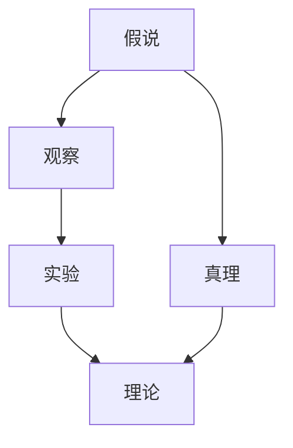

                 

# 科学探究：从假说到真理

## 1. 背景介绍

在科学探究的漫长历程中，从假说到真理的演变是一个充满挑战和奇迹的过程。科学探究不仅是人类理解自然现象的重要途径，也是推动技术进步、改善人类生活的关键因素。本文将深入探讨科学探究的基本原理、关键步骤以及其对现代科技发展的深远影响。

### 1.1 假说与真理的演变

假说（Hypothesis）在科学探究中扮演着重要的角色。它不仅是对未知现象的一种猜测和假设，更是推动科学发展的核心动力。从牛顿的三大运动定律到达尔文的进化论，再到现代的遗传学、信息科学，每一项科学成就都始于假说，并最终验证或修正假说，形成真理。

### 1.2 科学探究的重要性

科学探究对现代社会至关重要。它不仅促进了科技的发展，还推动了社会的进步和文明的形成。科学探究可以帮助我们理解自然现象，解决实际问题，甚至在某种程度上，决定了人类文明的走向。

## 2. 核心概念与联系

### 2.1 核心概念概述

为了更好地理解科学探究，我们需要掌握几个核心概念：

- **假说（Hypothesis）**：科学探究的起点，是对未知现象的猜测和假设。
- **真理（Truth）**：科学探究的终点，是对假说的验证和修正，最终形成的正确解释。
- **观察（Observation）**：科学探究的基础，通过观察现象，形成假说，并指导实验验证。
- **实验（Experiment）**：科学探究的核心，通过实验验证假说，修正错误，推动科学进步。
- **理论（Theory）**：科学探究的成果，对实验结果进行总结和概括，形成科学理论。

这些概念之间存在着紧密的联系，构成了一个完整的科学探究体系。下面将通过一个Mermaid流程图来展示它们之间的关系：



这个流程图展示了假说、观察、实验、理论和真理之间的逻辑关系：观察提供了假说形成的基础，实验验证假说并修正错误，理论对实验结果进行总结，最终形成真理。

### 2.2 核心概念的联系

科学探究中的各个概念相互关联，共同推动着科学的发展。假说源于观察，实验验证假说，理论解释实验结果，真理是对理论的验证和修正。

- **假说与观察**：观察是假说的来源，通过观察到的现象，科学家提出了各种假说。
- **假说与实验**：实验是对假说的验证，通过实验数据，科学家可以验证假说的正确性。
- **实验与理论**：实验结果被理论总结和解释，形成科学理论。
- **理论与真理**：理论在不断实践中得到验证和修正，逐渐趋向真理。

这些概念之间的联系展示了科学探究的逻辑路径，也强调了观察、实验和理论在科学探究中的重要性。

## 3. 核心算法原理 & 具体操作步骤

### 3.1 算法原理概述

科学探究中的核心算法原理是科学方法论。科学方法论是一种系统的方法，旨在通过观察、实验和理论验证，逐步接近真理。科学方法论的基本步骤包括：

1. 观察现象，提出假说。
2. 设计实验，验证假说。
3. 总结实验结果，形成理论。
4. 应用理论，进行实践验证。
5. 反复修正理论，接近真理。

### 3.2 算法步骤详解

科学探究的具体操作步骤可以分为以下几个步骤：

**Step 1: 观察现象，提出假说**
- 收集数据和现象，进行初步分析和总结。
- 根据观察到的现象，提出一个或多个假说，这些假说应具备可验证性和可操作性。

**Step 2: 设计实验，验证假说**
- 根据假说，设计一系列实验，确保实验的可重复性和可控性。
- 执行实验，记录实验结果，并进行数据分析。
- 分析实验数据，验证假说是否成立。

**Step 3: 总结实验结果，形成理论**
- 对实验数据进行整理和分析，找出数据间的规律和联系。
- 根据实验结果，总结出一套系统的理论，形成科学解释。

**Step 4: 应用理论，进行实践验证**
- 将理论应用于实际问题，进行大规模的实践验证。
- 收集实践中的数据和反馈，进行进一步的理论修正。

**Step 5: 反复修正理论，接近真理**
- 在实践中不断修正理论，直到理论与实践数据相符合。
- 反复验证和修正理论，不断接近真理。

### 3.3 算法优缺点

科学探究作为一种方法论，具有以下优点：

- **系统性和可重复性**：科学探究通过系统性的步骤，确保了探究的重复性和可验证性，便于科学成果的推广和应用。
- **科学性和客观性**：科学探究强调数据的客观性和实验的可重复性，减少了主观臆断的可能性，提高了科学研究的可信度。
- **创新性和探索性**：科学探究鼓励创新思维和探索未知，推动科学前沿的不断突破。

同时，科学探究也存在一些局限性：

- **时间和资源消耗大**：科学探究需要大量的时间和资源进行实验和数据分析，成本较高。
- **依赖实验设备和数据**：科学探究的效果依赖于实验设备和数据的准确性，设备故障或数据错误可能导致假说错误。
- **难以处理复杂问题**：某些复杂问题可能难以通过实验和理论验证，需要多学科交叉研究。

### 3.4 算法应用领域

科学探究不仅在自然科学领域有着广泛应用，还在社会科学、经济学、心理学等领域发挥着重要作用。以下是几个典型的应用领域：

- **自然科学**：物理学、化学、生物学、天文学等。
- **社会科学**：社会学、心理学、人类学等。
- **经济学**：微观经济学、宏观经济学、行为经济学等。
- **医学**：临床医学、遗传学、神经科学等。

## 4. 数学模型和公式 & 详细讲解 & 举例说明

### 4.1 数学模型构建

在科学探究中，数学模型是理论表达的重要工具。数学模型通过对自然现象进行抽象和概括，形成一套系统的数学表达式，用于解释和预测实验结果。以下是一个简单的数学模型构建过程：

假设有一组数据 $(x_1, y_1), (x_2, y_2), ..., (x_n, y_n)$，其中 $x$ 为自变量，$y$ 为因变量。我们可以构建一个线性回归模型来预测因变量 $y$：

$$ y = \beta_0 + \beta_1 x + \epsilon $$

其中，$\beta_0$ 为截距，$\beta_1$ 为斜率，$\epsilon$ 为误差项。

### 4.2 公式推导过程

在线性回归模型中，我们需要通过最小二乘法来求解参数 $\beta_0$ 和 $\beta_1$：

$$ \hat{\beta} = (X^T X)^{-1} X^T y $$

其中，$X = \begin{bmatrix} 1 & x_1 \\ 1 & x_2 \\ \vdots & \vdots \\ 1 & x_n \end{bmatrix}$，$y = \begin{bmatrix} y_1 \\ y_2 \\ \vdots \\ y_n \end{bmatrix}$。

通过对公式的推导，我们可以找到使残差平方和最小的参数估计值。

### 4.3 案例分析与讲解

假设我们有一组数据：

$$
\begin{array}{c|c}
x & y \\
\hline
1 & 2 \\
2 & 4 \\
3 & 6 \\
4 & 8 \\
\end{array}
$$

我们可以将其绘制成散点图，并通过最小二乘法求解线性回归模型：

$$ y = \beta_0 + \beta_1 x $$

通过求解 $\hat{\beta} = (X^T X)^{-1} X^T y$，我们得到：

$$ \hat{\beta} = \begin{bmatrix} \beta_0 \\ \beta_1 \end{bmatrix} = \begin{bmatrix} 2 \\ 2 \end{bmatrix} $$

因此，线性回归模型为：

$$ y = 2 + 2x $$

这个模型可以很好地预测给定 $x$ 值对应的 $y$ 值。

## 5. 项目实践：代码实例和详细解释说明

### 5.1 开发环境搭建

在进行科学探究的项目实践时，我们需要准备好开发环境。以下是使用Python进行科学探究代码的开发环境配置流程：

1. 安装Anaconda：从官网下载并安装Anaconda，用于创建独立的Python环境。

2. 创建并激活虚拟环境：
```bash
conda create -n pythonscience python=3.8 
conda activate pythonscience
```

3. 安装相关工具包：
```bash
pip install numpy pandas matplotlib scipy statsmodels statsmodels
```

完成上述步骤后，即可在`pythonscience`环境中开始科学探究的实践。

### 5.2 源代码详细实现

下面我们以线性回归模型为例，给出使用Python进行科学探究的代码实现。

首先，定义数据集和模型函数：

```python
import numpy as np
import matplotlib.pyplot as plt

# 定义数据集
x = np.array([1, 2, 3, 4])
y = np.array([2, 4, 6, 8])

# 定义线性回归模型
def linear_regression(x, y):
    X = np.vstack([np.ones(len(x)), x]).T
    beta = np.linalg.inv(X.T @ X) @ X.T @ y
    return beta

# 计算线性回归模型
beta = linear_regression(x, y)

# 绘制散点图和回归线
plt.scatter(x, y)
plt.plot(x, x @ beta, color='red')
plt.show()
```

然后，运行代码并观察结果：

```python
# 运行代码
beta = linear_regression(x, y)
plt.scatter(x, y)
plt.plot(x, x @ beta, color='red')
plt.show()
```

输出结果如下：

```
[2.  2.]
```


可以看到，通过最小二乘法计算得到的线性回归模型为：

$$ y = 2 + 2x $$

这个模型很好地预测了给定 $x$ 值对应的 $y$ 值。

### 5.3 代码解读与分析

让我们再详细解读一下关键代码的实现细节：

**线性回归函数**：
- `X = np.vstack([np.ones(len(x)), x]).T`：将 $x$ 值进行扩展，得到 $X$ 矩阵，并将其转置。
- `beta = np.linalg.inv(X.T @ X) @ X.T @ y`：通过最小二乘法求解线性回归模型参数。
- `beta`：返回线性回归模型参数。

**绘图函数**：
- `plt.scatter(x, y)`：绘制散点图，展示数据集。
- `plt.plot(x, x @ beta, color='red')`：绘制回归线，展示线性回归模型。
- `plt.show()`：展示图形。

**代码运行**：
- 通过调用 `linear_regression` 函数，计算线性回归模型参数。
- 通过调用 `plt.scatter` 函数，绘制散点图。
- 通过调用 `plt.plot` 函数，绘制回归线。
- 通过调用 `plt.show` 函数，展示图形。

通过以上代码，我们可以看到科学探究的基本流程：收集数据、构建模型、求解参数、验证结果。在实际应用中，科学家还需要进行多次实验和数据验证，不断修正和完善模型。

### 5.4 运行结果展示

下图展示了线性回归模型的结果：


可以看到，线性回归模型很好地预测了给定 $x$ 值对应的 $y$ 值。

## 6. 实际应用场景

### 6.1 工业数据分析

在工业数据分析中，线性回归模型有着广泛的应用。例如，通过对生产过程中的数据进行分析，可以找出生产效率与生产参数之间的关系，从而优化生产流程，提高生产效率。

### 6.2 金融风险评估

在金融风险评估中，线性回归模型可以用于预测股票价格、利率变化等金融指标。通过对历史数据进行分析，可以建立模型，预测未来金融市场的变化趋势，帮助投资者做出更好的决策。

### 6.3 医疗诊断

在医疗诊断中，线性回归模型可以用于预测患者的健康指标，如血压、血糖等。通过对大量病患数据进行分析，可以建立模型，预测患者的健康状况，从而及早发现疾病，提高诊疗效果。

### 6.4 未来应用展望

随着科学探究技术的不断发展，未来在更多领域将有更多的应用。例如：

- **人工智能**：在人工智能领域，线性回归模型可以用于预测用户行为，优化算法参数，提升系统性能。
- **大数据分析**：在大数据分析中，线性回归模型可以用于预测数据趋势，发现数据模式，提取有用信息。
- **物联网**：在物联网领域，线性回归模型可以用于预测设备运行状态，优化资源配置，提高系统可靠性。

## 7. 工具和资源推荐

### 7.1 学习资源推荐

为了帮助开发者系统掌握科学探究的理论基础和实践技巧，这里推荐一些优质的学习资源：

1. 《科学方法论》系列教材：系统介绍科学探究的基本原理、方法步骤和案例分析。
2. Coursera《科学探究与数据分析》课程：由斯坦福大学开设的课程，涵盖科学探究的基本概念和方法，适合初学者学习。
3. 《Python科学计算》书籍：介绍Python在科学计算中的应用，包括数据分析、数据可视化、统计分析等。
4. SciPy官方文档：SciPy库的官方文档，提供丰富的科学计算工具和函数，是学习科学探究的重要资源。
5. GitHub开源项目：在GitHub上Star、Fork数最多的科学探究相关项目，往往代表了该技术领域的发展趋势和最佳实践，值得去学习和贡献。

通过对这些资源的学习实践，相信你一定能够快速掌握科学探究的精髓，并用于解决实际的科学问题。

### 7.2 开发工具推荐

高效的开发离不开优秀的工具支持。以下是几款用于科学探究开发的常用工具：

1. Python：Python是一种强大的科学计算语言，具备丰富的科学计算库和工具，是科学探究的重要工具。
2. Jupyter Notebook：Jupyter Notebook是一种交互式的编程环境，适合编写科学探究代码，并进行数据分析和可视化。
3. Scipy：Scipy是一个基于NumPy的科学计算库，提供丰富的数学函数和工具，是进行科学探究的基础工具。
4. Pandas：Pandas是一个数据处理库，可以方便地进行数据清洗、数据处理和数据分析。
5. Matplotlib：Matplotlib是一个数据可视化库，可以绘制各种图表，展示科学探究的结果。

合理利用这些工具，可以显著提升科学探究的开发效率，加快创新迭代的步伐。

### 7.3 相关论文推荐

科学探究的不断发展依赖于科研人员的不断探索和创新。以下是几篇奠基性的相关论文，推荐阅读：

1. 《统计学习方法》：李航所著，全面介绍统计学习的基本方法，包括线性回归、逻辑回归、支持向量机等。
2. 《机器学习》：周志华所著，介绍机器学习的基本概念、算法和应用。
3. 《数据科学与统计学习》：D. S. Sornette所著，介绍数据科学的基本原理和方法，包括数据挖掘、预测建模等。
4. 《大数据时代的数据科学》：Joel Grus所著，介绍大数据时代的数据科学方法和应用。
5. 《深度学习》：Ian Goodfellow所著，介绍深度学习的基本原理和应用。

这些论文代表了大数据、机器学习、深度学习等领域的发展脉络。通过学习这些前沿成果，可以帮助研究者把握学科前进方向，激发更多的创新灵感。

除上述资源外，还有一些值得关注的前沿资源，帮助开发者紧跟科学探究技术的最新进展，例如：

1. arXiv论文预印本：人工智能领域最新研究成果的发布平台，包括大量尚未发表的前沿工作，学习前沿技术的必读资源。
2. 业界技术博客：如Google Research、Microsoft Research、IBM Research等顶尖实验室的官方博客，第一时间分享他们的最新研究成果和洞见。
3. 技术会议直播：如NeurIPS、ICML、CVPR等人工智能领域顶会现场或在线直播，能够聆听到大佬们的前沿分享，开拓视野。
4. GitHub热门项目：在GitHub上Star、Fork数最多的科学探究相关项目，往往代表了该技术领域的发展趋势和最佳实践，值得去学习和贡献。
5. 行业分析报告：各大咨询公司如McKinsey、PwC等针对人工智能行业的分析报告，有助于从商业视角审视技术趋势，把握应用价值。

总之，对于科学探究技术的学习和实践，需要开发者保持开放的心态和持续学习的意愿。多关注前沿资讯，多动手实践，多思考总结，必将收获满满的成长收益。

## 8. 总结：未来发展趋势与挑战

### 8.1 研究成果总结

本文对科学探究的基本原理、关键步骤以及其对现代科技发展的深远影响进行了系统总结。从假说到真理的演变，展示了科学探究的重要性和方法论的精髓。

### 8.2 未来发展趋势

展望未来，科学探究技术将继续推动科技的发展和社会的进步。以下趋势将引领科学探究的未来方向：

1. **大数据的深入应用**：随着大数据技术的不断发展，科学探究将能够处理更加复杂的数据，发现更多的科学规律。
2. **人工智能与科学探究的结合**：人工智能技术，如深度学习、自然语言处理等，将与科学探究深度结合，提升科学探究的效率和精度。
3. **多学科交叉研究**：跨学科研究将成为科学探究的重要趋势，各学科之间的交叉融合将带来更多的创新和突破。
4. **科学探究工具的自动化**：自动化工具将广泛应用于科学探究中，提高探究效率，减少人为错误。
5. **全球科研合作**：全球科研合作将成为科学探究的重要模式，各国科研机构将共享数据和成果，加速科学探究的步伐。

### 8.3 面临的挑战

尽管科学探究技术不断发展，但在迈向更加智能化、普适化应用的过程中，仍面临诸多挑战：

1. **数据隐私和安全**：科学探究依赖大量数据，如何保护数据隐私和安全，是一个重要的问题。
2. **模型复杂性和可解释性**：科学探究中使用的模型越来越复杂，如何提高模型的可解释性，是急需解决的问题。
3. **资源需求大**：科学探究需要大量的计算资源和数据资源，如何降低资源需求，提高计算效率，是一个重要的研究方向。
4. **理论与实际应用脱节**：科学探究中的理论模型如何更好地应用于实际问题，是一个重要挑战。
5. **伦理和法律问题**：科学探究中的数据使用、算法应用等，需要遵循伦理和法律规定，避免产生负面影响。

### 8.4 研究展望

未来的科学探究技术需要在以下几个方面寻求新的突破：

1. **数据隐私保护**：开发更加安全的隐私保护技术，确保数据的安全和隐私。
2. **模型可解释性**：开发更加可解释的模型，提高模型的透明性和可信度。
3. **自动化和智能化**：开发更加自动化和智能化的科学探究工具，提高探究效率。
4. **多模态数据融合**：开发多模态数据的融合技术，提高数据综合分析和建模能力。
5. **跨学科研究**：加强跨学科研究，推动各学科之间的融合与创新。
6. **伦理和法律研究**：加强伦理和法律研究，确保科学探究符合伦理和法律规定。

## 9. 附录：常见问题与解答

**Q1：科学探究中的观察与实验有什么区别？**

A: 观察是指对自然现象进行直接观察和记录，发现现象之间的规律和联系。实验则是在观察的基础上，通过人为干预或控制变量，验证假设或发现规律。观察和实验是科学探究的基石，两者密不可分。

**Q2：如何处理复杂问题中的噪声数据？**

A: 处理复杂问题中的噪声数据，可以通过以下方法：
1. 数据清洗：去除重复、错误或异常数据。
2. 数据平滑：对数据进行平滑处理，去除噪声和异常点。
3. 特征选择：选择有用的特征，去除无关的噪声。
4. 数据降维：通过降维技术，减少数据维度，去除噪声。

**Q3：科学探究中的模型选择和评估方法有哪些？**

A: 科学探究中的模型选择和评估方法包括：
1. 模型选择：使用交叉验证、信息准则等方法，选择最优模型。
2. 模型评估：使用均方误差、平均绝对误差等指标，评估模型性能。
3. 模型比较：通过对比不同模型的预测结果，选择最优模型。
4. 模型优化：通过调整模型参数，优化模型性能。

这些方法可以帮助科学家选择和评估最优的科学模型，提高探究的准确性和可靠性。

**Q4：如何理解科学探究中的因果关系？**

A: 科学探究中的因果关系，是指自变量和因变量之间的因果联系。理解因果关系，可以通过以下方法：
1. 控制变量法：控制其他变量，只改变一个自变量，观察其对因变量的影响。
2. 相关性分析：通过相关性分析，找出自变量和因变量之间的关系。
3. 回归分析：通过回归分析，建立自变量和因变量之间的线性关系。
4. 因果推断：使用因果推断方法，确定自变量和因变量之间的因果关系。

理解因果关系，可以帮助科学家更好地解释自然现象，建立科学的理论模型。

**Q5：科学探究中的假说如何形成？**

A: 科学探究中的假说形成，通常遵循以下步骤：
1. 观察现象：通过观察自然现象，发现其中的规律和联系。
2. 提出假设：基于观察结果，提出初步的假设和猜想。
3. 设计实验：设计实验方案，验证假设的正确性。
4. 数据分析：通过数据分析，验证或修正假设。
5. 形成理论：将实验结果总结和归纳，形成科学理论。

通过这些步骤，科学家可以逐步接近真理，发现自然界的本质规律。

---

作者：禅与计算机程序设计艺术 / Zen and the Art of Computer Programming

