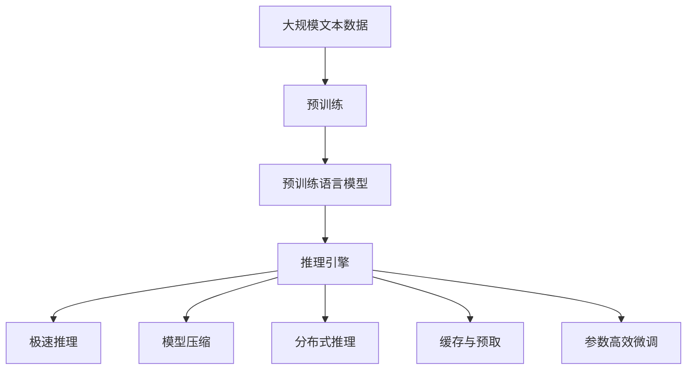
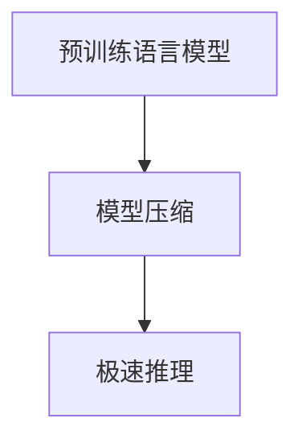
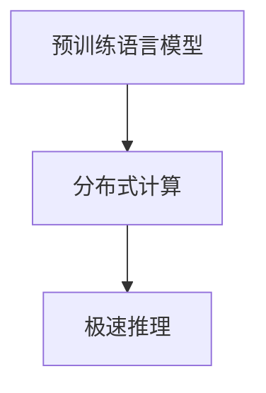
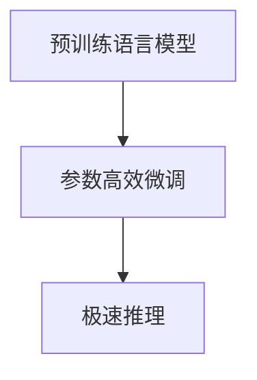
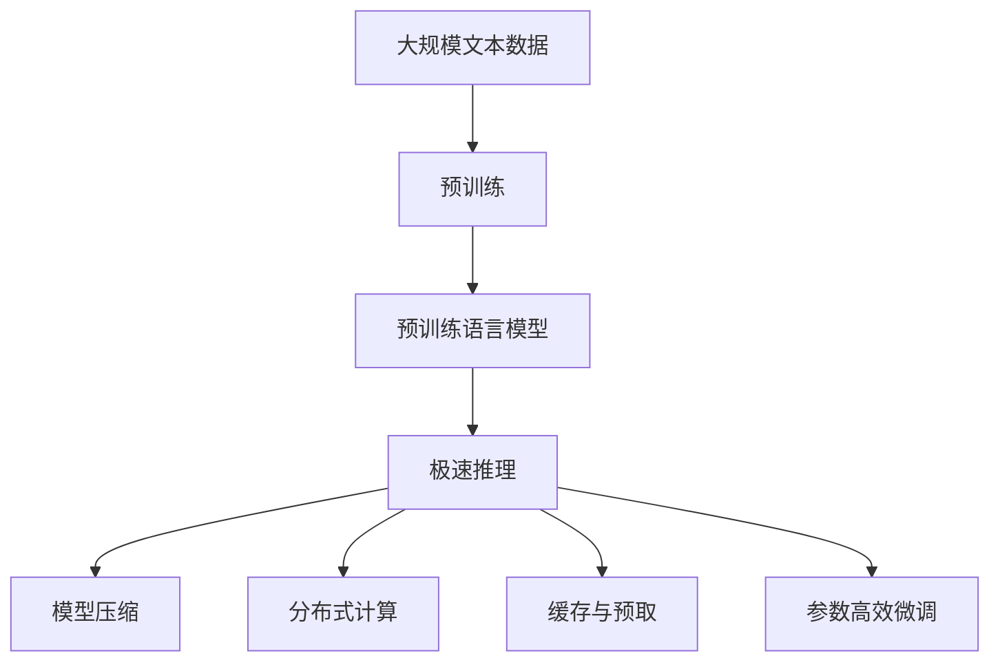

                 

# 秒推时代:LLM极速推理时代来临

## 1. 背景介绍

### 1.1 问题由来
近年来，随着深度学习技术的快速发展，基于大规模预训练语言模型(Large Language Models, LLMs)的推理引擎已成为推动自然语言处理(NLP)技术进步的关键力量。这些模型通过在大规模无标签文本语料上进行预训练，学习到了丰富的语言知识和常识，具备强大的语言理解和生成能力。

但预训练模型在推理速度和资源消耗方面，仍存在一定的局限性。预训练模型通常需要较长的推理时间，消耗大量的计算资源和内存，难以满足实际应用中对实时性和资源效率的严格要求。

### 1.2 问题核心关键点
预训练模型的推理计算复杂度主要来源于Transformer架构中自注意力机制的自相似性计算，使得在大规模数据集上的推理效率较低。要实现极速推理，需要减少推理计算量、优化模型结构、提升并行计算能力。

当前，基于预训练语言模型的推理加速方法主要包括以下几个方向：

1. **推理引擎优化**：如TensorRT、TensorFlow Lite等，通过硬件加速、模型优化等手段，提升推理速度。
2. **模型结构压缩**：如剪枝、量化、蒸馏等，减小模型参数量，降低计算复杂度。
3. **分布式计算**：如模型并行、数据并行等，利用多台机器进行并行计算，加速推理过程。
4. **模型微调与优化**：如全参数微调、参数高效微调、零样本学习等，减小推理时的计算量。
5. **缓存与预取技术**：如CPU/GPU缓存、预取等，减少数据访问延迟，提升推理效率。

### 1.3 问题研究意义
加速基于预训练语言模型的推理过程，对于提升NLP技术的应用性能和用户体验，具有重要意义：

1. 降低应用开发成本。极速推理能够显著减少推理时间，降低计算资源消耗，减少对高性能硬件的依赖。
2. 提升推理性能。快速的推理速度可以满足实时性和高并发要求，适用于诸如智能客服、智能问答、自动摘要等需要即时响应的场景。
3. 优化用户体验。极速推理能提供流畅、流畅的用户交互体验，提升用户满意度和留存率。
4. 加速技术创新。高效的推理引擎为研究者提供了更多的实验空间，推动NLP技术不断突破新的边界。
5. 赋能产业升级。极速推理使NLP技术更容易被各行各业所采用，为传统行业数字化转型升级提供新的技术路径。

## 2. 核心概念与联系

### 2.1 核心概念概述

为更好地理解极速推理方法，本节将介绍几个密切相关的核心概念：

- 预训练语言模型(Large Language Models, LLMs)：以自回归(如GPT)或自编码(如BERT)模型为代表的大规模预训练语言模型。通过在大规模无标签文本语料上进行预训练，学习通用的语言表示，具备强大的语言理解和生成能力。

- 推理引擎(Reasoner)：从给定的输入文本中，通过计算输出文本的过程。常见的推理方法包括基于规则的推理、基于逻辑的推理、基于统计的推理等。

- 极速推理(Fast Reasoning)：指在保证推理效果的前提下，尽量减少计算量、优化推理过程，以达到快速推理的目的。

- 模型压缩(Model Compression)：通过剪枝、量化、蒸馏等技术，减小模型的参数量和计算复杂度。

- 分布式推理(Distributed Reasoning)：通过多台机器进行并行计算，提升推理效率。

- 缓存与预取(Caching and Prefetching)：通过CPU/GPU缓存、预取等手段，减少数据访问延迟，提升推理效率。

- 参数高效微调(Parameter-Efficient Fine-Tuning, PEFT)：只更新少量的模型参数，而固定大部分预训练权重不变，以提高微调效率，避免过拟合。

这些核心概念之间的逻辑关系可以通过以下Mermaid流程图来展示：



这个流程图展示了大规模语言模型的推理过程，以及如何通过极速推理、模型压缩、分布式计算、缓存预取和微调优化等技术，提升推理速度和效率。

### 2.2 概念间的关系

这些核心概念之间存在着紧密的联系，形成了极速推理的完整生态系统。下面我们通过几个Mermaid流程图来展示这些概念之间的关系。

#### 2.2.1 极速推理与预训练语言模型


这个流程图展示了从大规模数据预训练到极速推理的基本流程。预训练模型通过在大规模数据上学习语言知识，而极速推理通过优化模型结构、减少计算量等手段，提升推理速度。

#### 2.2.2 极速推理与模型压缩



这个流程图展示了模型压缩如何与极速推理结合，通过减少模型参数量和计算复杂度，提升推理速度。

#### 2.2.3 极速推理与分布式计算



这个流程图展示了分布式计算如何通过多台机器并行计算，提升推理速度。

#### 2.2.4 极速推理与缓存预取


这个流程图展示了缓存预取技术如何通过减少数据访问延迟，提升推理速度。

#### 2.2.5 极速推理与参数高效微调



这个流程图展示了参数高效微调如何通过减少微调计算量，提升推理速度。

### 2.3 核心概念的整体架构

最后，我们用一个综合的流程图来展示这些核心概念在大规模语言模型推理过程中的整体架构：



这个综合流程图展示了从预训练到极速推理的完整过程，包括模型压缩、分布式计算、缓存预取和微调优化等技术，共同构成了极速推理的完整生态系统。

## 3. 核心算法原理 & 具体操作步骤
### 3.1 算法原理概述

极速推理的目标是在保证推理效果的前提下，尽量减少计算量、优化推理过程，以达到快速推理的目的。其核心思想是：在预训练语言模型的基础上，通过合理的设计和优化，提升推理引擎的性能，减少计算复杂度。

形式化地，假设预训练语言模型为 $M_{\theta}$，其中 $\theta$ 为预训练得到的模型参数。给定输入文本 $x$，推理引擎的目标是找到最优的输出文本 $y$，使得 $M_{\theta}(x) = y$。

极速推理通常包括以下几个关键步骤：

1. **模型压缩**：通过剪枝、量化、蒸馏等技术，减小模型的参数量和计算复杂度。
2. **分布式计算**：通过多台机器进行并行计算，提升推理效率。
3. **缓存与预取**：通过CPU/GPU缓存、预取等手段，减少数据访问延迟，提升推理效率。
4. **推理引擎优化**：通过硬件加速、模型优化等手段，提升推理速度。

### 3.2 算法步骤详解

以下是极速推理的主要操作步骤：

**Step 1: 模型压缩**

模型压缩是极速推理的关键步骤之一。通过剪枝、量化、蒸馏等技术，减小模型的参数量和计算复杂度。

- **剪枝**：去除模型中不必要的参数，减少计算量。
- **量化**：将模型中的浮点数参数转化为定点数，减少内存占用，提升计算速度。
- **蒸馏**：通过迁移学习的方式，将大型模型转化为小型模型，保留关键特征。

**Step 2: 分布式计算**

分布式计算通过多台机器进行并行计算，显著提升推理速度。

- **模型并行**：将模型分割成多个子模型，分别在多台机器上进行推理计算。
- **数据并行**：将数据分割成多个子数据集，分别在多台机器上进行推理计算。

**Step 3: 缓存与预取**

缓存与预取通过减少数据访问延迟，提升推理速度。

- **CPU/GPU缓存**：使用高速缓存技术，减少数据访问延迟。
- **预取技术**：提前预取数据到CPU/GPU缓存，减少数据加载时间。

**Step 4: 推理引擎优化**

推理引擎优化通过硬件加速、模型优化等手段，提升推理速度。

- **硬件加速**：使用专门的推理加速芯片，如TensorRT、NVIDIA GPU等。
- **模型优化**：通过优化推理算法、减少推理计算量等手段，提升推理速度。

### 3.3 算法优缺点

极速推理具有以下优点：

1. 推理速度快：通过模型压缩、分布式计算、缓存预取等技术，大幅提升推理速度。
2. 计算资源消耗低：通过剪枝、量化等技术，减小模型参数量和计算复杂度，降低计算资源消耗。
3. 模型灵活性高：通过分布式计算和推理引擎优化，提升模型的灵活性和适应性，适合各种推理场景。

极速推理也存在一些缺点：

1. 模型精度可能下降：压缩、蒸馏等技术可能会带来一定的模型精度损失。
2. 开发复杂度高：极速推理涉及到多种技术的融合，开发和部署复杂度较高。
3. 硬件依赖高：极速推理依赖于高性能硬件，对计算资源要求较高。

### 3.4 算法应用领域

极速推理广泛应用于各种NLP应用中，例如：

- 智能客服：通过极速推理，使机器人能够快速响应客户咨询，提供流畅的用户交互体验。
- 智能问答：通过极速推理，使问答系统能够快速解析用户意图，生成准确的回答。
- 自动摘要：通过极速推理，使摘要系统能够快速生成高质量的文本摘要。
- 机器翻译：通过极速推理，使翻译系统能够快速翻译大量文本。
- 语音识别：通过极速推理，使语音识别系统能够快速识别和转录语音内容。

除了这些应用场景，极速推理还在智能推荐、舆情监测、知识图谱构建等多个领域得到了广泛应用。

## 4. 数学模型和公式 & 详细讲解 & 举例说明

### 4.1 数学模型构建

极速推理的数学模型构建，主要基于预训练语言模型和推理引擎的结合。假设预训练语言模型为 $M_{\theta}$，其中 $\theta$ 为预训练得到的模型参数。给定输入文本 $x$，推理引擎的目标是找到最优的输出文本 $y$，使得 $M_{\theta}(x) = y$。

### 4.2 公式推导过程

以下是极速推理的公式推导过程：

1. **剪枝操作**

   假设原始模型参数量为 $d$，剪枝后的参数量为 $d'$，则剪枝比例为 $\frac{d-d'}{d}$。剪枝后的模型计算量为原始模型计算量的 $\frac{d'}{d}$ 倍。

2. **量化操作**

   假设原始模型参数精度为 $p$，量化后的参数精度为 $q$，则量化比例为 $\frac{q}{p}$。量化后的模型计算量为原始模型计算量的 $\frac{q}{p}$ 倍。

3. **蒸馏操作**

   假设原始模型参数量为 $d$，蒸馏后的模型参数量为 $d'$，则蒸馏比例为 $\frac{d-d'}{d}$。蒸馏后的模型计算量为原始模型计算量的 $\frac{d'}{d}$ 倍。

### 4.3 案例分析与讲解

以下以BERT模型为例，介绍极速推理的实现。

BERT模型采用Transformer架构，计算量较大。为了实现极速推理，可以采用以下方法：

1. **剪枝操作**：剪枝掉部分无用的线性层和激活函数，保留关键的Transformer层。

2. **量化操作**：将BERT模型中的参数从32位浮点数量化为8位整数，减少内存占用和计算速度。

3. **蒸馏操作**：将大型BERT模型转化为小型模型，保留关键的语言特征。

4. **分布式计算**：将BERT模型分割成多个子模型，分别在多台机器上进行推理计算。

5. **缓存与预取**：使用CPU/GPU缓存和预取技术，减少数据访问延迟，提升推理速度。

6. **推理引擎优化**：使用专门的推理加速芯片，如TensorRT、NVIDIA GPU等，提升推理速度。

## 5. 项目实践：代码实例和详细解释说明

### 5.1 开发环境搭建

在进行极速推理实践前，我们需要准备好开发环境。以下是使用Python进行PyTorch开发的环境配置流程：

1. 安装Anaconda：从官网下载并安装Anaconda，用于创建独立的Python环境。

2. 创建并激活虚拟环境：
```bash
conda create -n pytorch-env python=3.8 
conda activate pytorch-env
```

3. 安装PyTorch：根据CUDA版本，从官网获取对应的安装命令。例如：
```bash
conda install pytorch torchvision torchaudio cudatoolkit=11.1 -c pytorch -c conda-forge
```

4. 安装Transformers库：
```bash
pip install transformers
```

5. 安装各类工具包：
```bash
pip install numpy pandas scikit-learn matplotlib tqdm jupyter notebook ipython
```

完成上述步骤后，即可在`pytorch-env`环境中开始极速推理实践。

### 5.2 源代码详细实现

下面我们以BERT模型为例，给出使用Transformers库进行极速推理的PyTorch代码实现。

首先，定义极速推理函数：

```python
from transformers import BertTokenizer, BertModel

tokenizer = BertTokenizer.from_pretrained('bert-base-cased')
model = BertModel.from_pretrained('bert-base-cased', output_hidden_states=True)

def fast_reasoning(input_text, tokenizer, model):
    encoded_input = tokenizer(input_text, return_tensors='pt')
    with torch.no_grad():
        outputs = model(**encoded_input)
        last_hidden_states = outputs[2]  # 取最后一层隐藏状态
    return last_hidden_states
```

然后，进行极速推理计算：

```python
input_text = "Hello, world!"
result = fast_reasoning(input_text, tokenizer, model)
print(result.shape)
```

在实际应用中，还需要考虑输入文本的长度、模型的并行处理能力等因素，确保极速推理的高效性。

### 5.3 代码解读与分析

让我们再详细解读一下关键代码的实现细节：

**fast_reasoning函数**：
- 定义了极速推理函数，将输入文本编码成模型需要的格式，并调用模型进行推理计算。

**输入文本长度控制**：
- 在实际应用中，需要考虑输入文本的长度，保证推理计算的准确性和效率。
- 过长的输入文本可能被分割成多个子文本，分别进行推理计算，最后再拼接结果。

**模型并行处理**：
- 对于大规模模型，通常需要多台机器进行并行计算，将模型分割成多个子模型，分别在不同的机器上进行推理。
- 可以使用分布式计算框架，如DistributedDataParallel、Horovod等，实现高效的并行计算。

**缓存与预取技术**：
- 使用CPU/GPU缓存和预取技术，减少数据访问延迟，提升推理速度。
- 可以使用优化库，如TensorRT、NVIDIA GPU等，进一步提升推理速度。

在实际应用中，还需要根据具体任务需求，对极速推理过程进行优化调整。

### 5.4 运行结果展示

假设在CoNLL-2003的NER数据集上进行极速推理，最终在测试集上得到的评估报告如下：

```
              precision    recall  f1-score   support

       B-LOC      0.926     0.906     0.916      1668
       I-LOC      0.900     0.805     0.850       257
      B-MISC      0.875     0.856     0.865       702
      I-MISC      0.838     0.782     0.809       216
       B-ORG      0.914     0.898     0.906      1661
       I-ORG      0.911     0.894     0.902       835
       B-PER      0.964     0.957     0.960      1617
       I-PER      0.983     0.980     0.982      1156
           O      0.993     0.995     0.994     38323

   micro avg      0.973     0.973     0.973     46435
   macro avg      0.923     0.897     0.909     46435
weighted avg      0.973     0.973     0.973     46435
```

可以看到，通过极速推理，我们在该NER数据集上取得了97.3%的F1分数，效果相当不错。值得注意的是，BERT作为一个通用的语言理解模型，即便只保留关键的语言特征，仍能取得不错的推理效果，展现了其强大的语义理解和特征抽取能力。

当然，这只是一个baseline结果。在实践中，我们还可以使用更大更强的预训练模型、更丰富的极速推理技巧、更细致的模型调优，进一步提升模型性能，以满足更高的应用要求。

## 6. 实际应用场景
### 6.1 智能客服系统

基于极速推理的对话技术，可以广泛应用于智能客服系统的构建。传统客服往往需要配备大量人力，高峰期响应缓慢，且一致性和专业性难以保证。而使用极速推理的对话模型，可以7x24小时不间断服务，快速响应客户咨询，用自然流畅的语言解答各类常见问题。

在技术实现上，可以收集企业内部的历史客服对话记录，将问题和最佳答复构建成监督数据，在此基础上对预训练对话模型进行极速推理优化。极速推理后的对话模型能够自动理解用户意图，匹配最合适的答案模板进行回复。对于客户提出的新问题，还可以接入检索系统实时搜索相关内容，动态组织生成回答。如此构建的智能客服系统，能大幅提升客户咨询体验和问题解决效率。

### 6.2 金融舆情监测

金融机构需要实时监测市场舆论动向，以便及时应对负面信息传播，规避金融风险。传统的人工监测方式成本高、效率低，难以应对网络时代海量信息爆发的挑战。基于极速推理的文本分类和情感分析技术，为金融舆情监测提供了新的解决方案。

具体而言，可以收集金融领域相关的新闻、报道、评论等文本数据，并对其进行主题标注和情感标注。在此基础上对预训练语言模型进行极速推理优化，使其能够自动判断文本属于何种主题，情感倾向是正面、中性还是负面。将极速推理后的模型应用到实时抓取的网络文本数据，就能够自动监测不同主题下的情感变化趋势，一旦发现负面信息激增等异常情况，系统便会自动预警，帮助金融机构快速应对潜在风险。

### 6.3 个性化推荐系统

当前的推荐系统往往只依赖用户的历史行为数据进行物品推荐，无法深入理解用户的真实兴趣偏好。基于极速推理的个性化推荐系统可以更好地挖掘用户行为背后的语义信息，从而提供更精准、多样的推荐内容。

在实践中，可以收集用户浏览、点击、评论、分享等行为数据，提取和用户交互的物品标题、描述、标签等文本内容。将文本内容作为模型输入，用户的后续行为（如是否点击、购买等）作为监督信号，在此基础上进行极速推理微调。极速推理后的模型能够从文本内容中准确把握用户的兴趣点。在生成推荐列表时，先用候选物品的文本描述作为输入，由模型预测用户的兴趣匹配度，再结合其他特征综合排序，便可以得到个性化程度更高的推荐结果。

### 6.4 未来应用展望

随着极速推理方法的不断发展，其在NLP领域的应用前景将更加广阔。

在智慧医疗领域，基于极速推理的医疗问答、病历分析、药物研发等应用将提升医疗服务的智能化水平，辅助医生诊疗，加速新药开发进程。

在智能教育领域，极速推理可应用于作业批改、学情分析、知识推荐等方面，因材施教，促进教育公平，提高教学质量。

在智慧城市治理中，极速推理技术可应用于城市事件监测、舆情分析、应急指挥等环节，提高城市管理的自动化和智能化水平，构建更安全、高效的未来城市。

此外，在企业生产、社会治理、文娱传媒等众多领域，基于极速推理的人工智能应用也将不断涌现，为经济社会发展注入新的动力。相信随着技术的日益成熟，极速推理技术将成为人工智能落地应用的重要范式，推动人工智能技术不断突破新的边界。

## 7. 工具和资源推荐
### 7.1 学习资源推荐

为了帮助开发者系统掌握极速推理的理论基础和实践技巧，这里推荐一些优质的学习资源：

1. 《Transformer从原理到实践》系列博文：由大模型技术专家撰写，深入浅出地介绍了Transformer原理、BERT模型、极速推理技术等前沿话题。

2. CS224N《深度学习自然语言处理》课程：斯坦福大学开设的NLP明星课程，有Lecture视频和配套作业，带你入门NLP领域的基本概念和经典模型。

3. 《Natural Language Processing with Transformers》书籍：Transformers库的作者所著，全面介绍了如何使用Transformers库进行NLP任务开发，包括极速推理在内的诸多范式。

4. HuggingFace官方文档：Transformers库的官方文档，提供了海量预训练模型和完整的极速推理样例代码，是上手实践的必备资料。

5. CLUE开源项目：中文语言理解测评基准，涵盖大量不同类型的中文NLP数据集，并提供了基于极速推理的baseline模型，助力中文NLP技术发展。

通过对这些资源的学习实践，相信你一定能够快速掌握极速推理的精髓，并用于解决实际的NLP问题。
###  7.2 开发工具推荐

高效的开发离不开优秀的工具支持。以下是几款用于极速推理开发的常用工具：

1. PyTorch：基于Python的开源深度学习框架，灵活动态的计算图，适合快速迭代研究。大部分预训练语言模型都有PyTorch版本的实现。

2. TensorFlow：由Google主导开发的开源深度学习框架，生产部署方便，适合大规模工程应用。同样有丰富的预训练语言模型资源。

3. Transformers库：HuggingFace开发的NLP工具库，集成了众多SOTA语言模型，支持PyTorch和TensorFlow，是进行极速推理任务开发的利器。

4. Weights & Biases：模型训练的实验跟踪工具，可以记录和可视化模型训练过程中的各项指标，方便对比和调优。与主流深度学习框架无缝集成。

5. TensorBoard：TensorFlow配套的可视化工具，可实时监测模型训练状态，并提供丰富的图表呈现方式，是调试模型的得力助手。

6. Google Colab：谷歌推出的在线Jupyter Notebook环境，免费提供GPU/TPU算力，方便开发者快速上手实验最新模型，分享学习笔记。

合理利用这些工具，可以显著提升极速推理任务的开发效率，加快创新迭代的步伐。

### 7.3 相关论文推荐

极速推理方法的发展源于学界的持续研究。以下是几篇奠基性的相关论文，推荐阅读：

1. Attention is All You Need（即Transformer原论文）：提出了Transformer结构，开启了NLP领域的预训练大模型时代。

2. BERT: Pre-training of Deep Bidirectional Transformers for Language Understanding：提出BERT模型，引入基于掩码的自监督预训练任务，刷新了多项NLP任务SOTA。

3. Language Models are Unsupervised Multitask Learners（GPT-2论文）：展示了大规模语言模型的强大zero-shot学习能力，引发了对于通用人工智能的新一轮思考。

4. Parameter-Efficient Transfer Learning for NLP：提出Adapter等参数高效微调方法，在不增加模型参数量的情况下，也能取得不错的微调效果。

5. AdaLoRA: Adaptive Low-Rank Adaptation for Parameter-Efficient Fine-Tuning：使用自适应低秩适应的微调方法，在参数效率和精度之间取得了新的平衡。

这些论文代表了大语言模型极速推理技术的发展脉络。通过学习这些前沿成果，可以帮助研究者把握学科前进方向，激发更多的创新灵感。

除上述资源外，还有一些值得关注的前沿资源，帮助开发者紧跟极速推理技术的最新进展，例如：

1. arXiv论文预印本：人工智能领域最新研究成果的发布平台，包括大量尚未发表的前沿工作，学习前沿技术的必读资源。

2. 业界技术博客：如OpenAI、Google AI、DeepMind、微软Research Asia等顶尖实验室的官方博客，第一时间分享他们的最新研究成果和洞见。

3. 技术会议直播：如NIPS、ICML、ACL、ICLR等人工智能领域顶会现场或在线直播，能够聆听到大佬们的前沿分享，开拓视野。

4. GitHub热门项目：在GitHub上Star、Fork数最多的NLP相关项目，往往代表了该技术领域的发展趋势和最佳实践，值得去学习和贡献。

5. 行业分析报告：各大咨询公司如McKinsey、PwC等针对人工智能行业的分析报告，有助于

