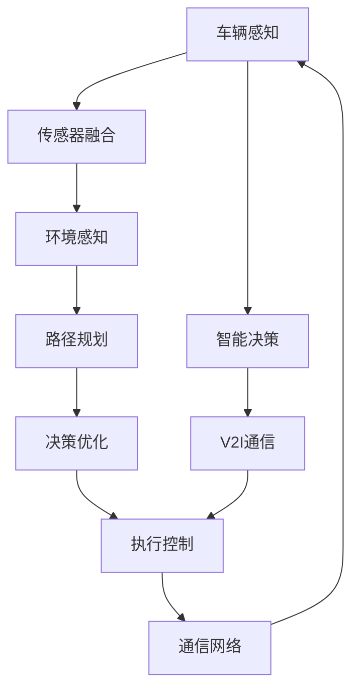
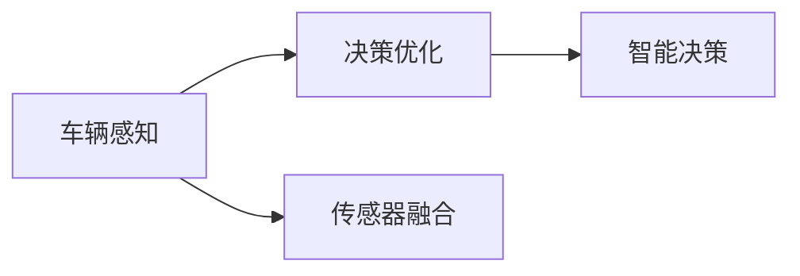
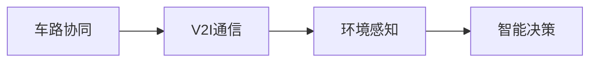
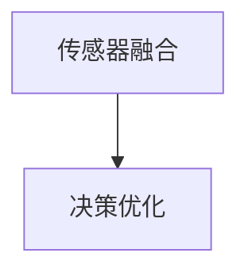
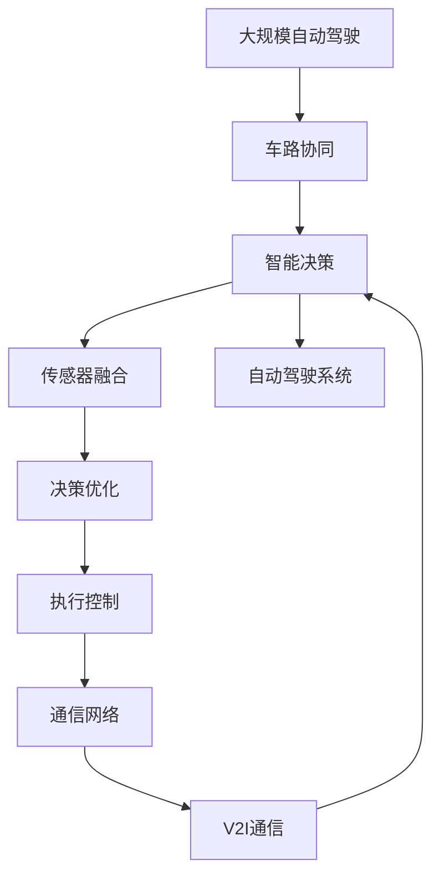

                 

# 端到端自动驾驶的车路协同趋势

> 关键词：自动驾驶,车路协同,端到端,传感器融合,决策优化,5G通信,AI算法,交通安全

## 1. 背景介绍

随着科技的迅猛发展和环保意识的增强，自动驾驶技术已成为全球科技行业的热点话题。自动驾驶不仅能显著提高交通效率，降低交通事故，还能减少碳排放，推动汽车产业的绿色转型。然而，要实现真正的自动驾驶，需要多学科的紧密配合，包括车辆感知、路径规划、决策控制、通信等多方面。

在自动驾驶系统中，车辆与周边环境交互是至关重要的。传统的车辆依赖单一的传感器（如激光雷达、摄像头等）获取环境信息，并在云端进行数据处理和决策计算。这种方式存在延迟高、计算量大、鲁棒性差等问题。为了提升自动驾驶的安全性和效率，车路协同（Vehicle-to-Infrastructure, V2I）技术应运而生。

车路协同通过集成多种传感器和通信设备，构建全方位、实时、准确的环境感知和通信系统，使车辆与道路基础设施之间进行信息交互，提升决策的精准度和及时性。本文将从车路协同的角度，全面探讨端到端自动驾驶技术的现状和未来发展趋势。

## 2. 核心概念与联系

### 2.1 核心概念概述

为更好地理解端到端自动驾驶的车路协同，本节将介绍几个密切相关的核心概念：

- 自动驾驶：通过车载传感器、GPS、摄像头、激光雷达等多种技术获取环境信息，通过先进的AI算法实现车辆自主导航、避障、决策等功能。
- 车路协同：通过车辆与道路基础设施之间的信息交互，获取更广泛、更精准的环境信息，提高自动驾驶的决策能力和安全性。
- 端到端自动驾驶：从感知、决策、控制到通信的全链条集成优化，实现车辆在复杂交通环境中的安全、高效、可靠运行。
- 传感器融合：利用多种传感器数据，通过算法整合处理，提升环境感知的质量和可靠性。
- 决策优化：通过优化算法，实现最优路径规划、避障决策等，提升自动驾驶的安全性和效率。
- 5G通信：提供低延迟、高带宽的通信网络，支持实时数据传输和决策计算。

这些核心概念之间的逻辑关系可以通过以下Mermaid流程图来展示：



这个流程图展示了一个端到端自动驾驶的全链路流程，从传感器融合到路径规划，再到决策优化和执行控制，最终通过V2I通信系统，形成闭环反馈。通过车路协同，车辆能够获取更全面、更可靠的环境信息，从而实现更高的自动驾驶水平。

### 2.2 概念间的关系

这些核心概念之间存在着紧密的联系，形成了端到端自动驾驶的核心生态系统。下面我通过几个Mermaid流程图来展示这些概念之间的关系。

#### 2.2.1 感知与决策的关系



这个流程图展示了感知与决策之间的联系。感知是决策的基础，决策依赖于感知的数据输入。传感器的多样性可以提升感知的质量和准确性，进而提升决策的鲁棒性和精准度。

#### 2.2.2 车路协同与V2I通信的关系



车路协同与V2I通信是紧密相连的，车路协同通过V2I通信系统获取道路基础设施的信息，进而提升车辆的决策和控制能力。

#### 2.2.3 传感器融合与决策优化之间的关系



传感器融合通过整合不同传感器数据，提升环境感知的全面性和准确性，从而为决策优化提供更可靠的信息基础。

### 2.3 核心概念的整体架构

最后，我们用一个综合的流程图来展示这些核心概念在大规模自动驾驶中的整体架构：



这个综合流程图展示了从车路协同到智能决策的全链路流程，各个环节环环相扣，共同构成了一个完整的端到端自动驾驶系统。

## 3. 核心算法原理 & 具体操作步骤
### 3.1 算法原理概述

端到端自动驾驶的算法原理主要包括以下几个关键环节：

- **传感器融合**：通过多种传感器数据（如激光雷达、摄像头、GPS等）获取环境信息，并进行数据整合，提升感知的质量和准确性。
- **环境感知**：基于融合后的数据，通过AI算法（如CNN、RNN等）进行环境建模和对象检测，获取高精度的环境信息。
- **路径规划**：根据环境信息，结合任务目标和约束条件，通过优化算法（如A*、D*等）生成最优路径。
- **决策优化**：根据路径规划结果，通过智能决策算法（如规则库、强化学习等）进行决策，生成控制命令。
- **执行控制**：通过控制算法（如PID、MPC等）对车辆进行精确控制，实现最优路径的跟随和避障。

端到端自动驾驶的整个过程是一个高度集成和自动化的闭环系统，依赖于高效的算法和实时数据处理能力，实现车辆在复杂交通环境中的自主导航和避障。

### 3.2 算法步骤详解

以端到端自动驾驶中的路径规划为例，详细介绍算法的详细步骤：

1. **数据获取**：通过车载传感器（如激光雷达、摄像头等）获取环境信息。
2. **数据预处理**：对传感器数据进行去噪、校正和融合，提升数据的准确性。
3. **环境建模**：通过深度学习算法（如CNN、LSTM等）对环境进行建模，生成高精度的环境地图。
4. **路径规划**：根据任务目标和环境地图，使用A*、D*等算法生成最优路径。
5. **路径优化**：对生成的路径进行优化，避免障碍物和交通干扰，生成可行路径。
6. **决策生成**：根据路径和车辆状态，通过规则库或强化学习算法生成控制命令。
7. **控制执行**：通过控制算法（如PID、MPC等）对车辆进行精确控制，实现路径跟随和避障。

### 3.3 算法优缺点

端到端自动驾驶的算法具有以下优点：

- **高度集成**：从感知到决策，再到执行控制，整个过程高度集成，提升了系统整体效率和可靠性。
- **实时性**：通过多传感器数据融合和优化算法，能够在实时环境中快速做出决策和控制。
- **鲁棒性**：多传感器数据融合和智能决策算法，提升了系统的鲁棒性和应对复杂环境的能力。

同时，该算法也存在以下缺点：

- **计算量大**：数据融合和路径规划等环节计算复杂，需要高性能的硬件设备支持。
- **模型复杂**：算法模型复杂，需要大量数据进行训练和调参，难以调试和优化。
- **环境适应性差**：在极端复杂或未知环境，如恶劣天气、复杂道路等，算法可能难以适应。

### 3.4 算法应用领域

端到端自动驾驶的算法广泛适用于各类自动驾驶场景，包括：

- **高速公路自动驾驶**：车辆能够自动感知道路环境，进行路径规划和避障。
- **城市道路自动驾驶**：在复杂的城市环境中，能够实时处理交通信号、行人等干扰因素。
- **物流配送自动驾驶**：应用于物流配送场景，实现高效率、低成本的物流运输。
- **无人驾驶出租车**：在特定区域或场景内，实现自动驾驶出租车服务。
- **智能公交系统**：应用于公共交通系统，提升公共交通的效率和安全性。

## 4. 数学模型和公式 & 详细讲解  
### 4.1 数学模型构建

以路径规划为例，构建一个简单的数学模型来描述算法流程：

设环境地图为 $G=(V,E,W)$，其中 $V$ 为节点集合，$E$ 为边集合，$W$ 为边权重，表示节点的通行能力。路径规划的目标是从起点 $s$ 到终点 $t$，寻找一条权值最小的路径 $P=(v_1, v_2, ..., v_n)$。

设节点 $v_i$ 到节点 $v_{i+1}$ 的通行能力为 $W_{i,i+1}$，则路径 $P$ 的总权重为：

$$
W_P = \sum_{i=1}^{n-1} W_{v_i,v_{i+1}}
$$

路径规划的目标是找到一条总权重最小的路径 $P^*$，即：

$$
P^* = \mathop{\arg\min}_{P} W_P
$$

常见的路径规划算法包括A*、D*、RRT等，以A*算法为例，其基本思路是通过启发式函数估计每个节点的权重，从而优化搜索过程。

### 4.2 公式推导过程

以A*算法为例，推导路径规划的基本公式：

设节点 $v_i$ 的启发式估值为 $h_i$，则节点 $v_i$ 的权重估计为：

$$
f_i = g_i + h_i
$$

其中 $g_i$ 为从起点 $s$ 到节点 $v_i$ 的实际通行能力。A*算法的搜索过程通过优先队列实现，每次选择 $f_i$ 最小的节点进行扩展。

设当前节点为 $v_i$，其邻居节点为 $v_{i+1}, v_{i+2}, ..., v_{j}$，则路径 $P_{i+1}$ 的权重估计为：

$$
f_{i+1} = g_{i+1} + h_{i+1}
$$

其中 $g_{i+1} = g_i + W_{i,i+1}$，$h_{i+1}$ 为节点 $v_{i+1}$ 到终点 $t$ 的启发式估值。

通过扩展节点 $v_{i+1}, v_{i+2}, ..., v_{j}$，可以逐步生成从起点 $s$ 到终点 $t$ 的最优路径 $P^*$。

### 4.3 案例分析与讲解

以自动驾驶中的路径规划为例，结合具体案例来分析算法的应用：

假设车辆在城市道路上行驶，需要避开行人、车辆等障碍物。通过对环境地图和车辆状态进行分析，A*算法能够生成一条避开障碍物的最优路径。具体步骤如下：

1. **环境建模**：通过摄像头和激光雷达获取环境信息，进行数据预处理和融合，生成高精度的环境地图。
2. **节点生成**：将环境地图划分为多个节点，每个节点表示车辆可以到达的位置。
3. **启发式估值**：通过启发式函数（如曼哈顿距离、欧几里得距离等）估计每个节点的权重。
4. **优先队列**：将每个节点的权重估计加入优先队列，按照 $f_i$ 从小到大排序。
5. **路径扩展**：每次选择 $f_i$ 最小的节点进行扩展，根据邻接关系生成新的节点。
6. **路径生成**：从起点 $s$ 开始，逐步生成最优路径 $P^*$。

最终生成的路径 $P^*$ 可以用于控制算法生成控制命令，实现车辆在复杂交通环境中的自主导航和避障。

## 5. 项目实践：代码实例和详细解释说明
### 5.1 开发环境搭建

在进行自动驾驶项目实践前，我们需要准备好开发环境。以下是使用Python进行Ros开发的环境配置流程：

1. 安装Ros（Robot Operating System）：从官网下载并安装Ros，用于构建和管理自动驾驶系统的各个模块。
2. 创建并激活虚拟环境：
```bash
conda create -n py_ros_env python=3.8 
conda activate py_ros_env
```

3. 安装ROS所需工具包：
```bash
pip install ros-kinetic-rospy rospkg py-kinetic-tf
```

4. 下载和配置Ros包：
```bash
rospack update
rospack install [package_name]
```

完成上述步骤后，即可在`py_ros_env`环境中开始自动驾驶项目实践。

### 5.2 源代码详细实现

这里我们以路径规划为例，使用Ros编写一个简单的路径规划节点：

```python
import rospy
import rospkg
from sensor_msgs.msg import PointCloud, PointCloud2
from std_msgs.msg import Int32, Float32, Int8
from nav_msgs.msg import Odometry, Path
from geometry_msgs.msg import Quaternion, Transform, TransformStamped
from tf.transformations import quaternion_from_euler, quaternion_slerp
from tf.transformations import euler_from_quaternion
from tf.transformations import translation_from_quaternion
from tf.transformations import quaternion_from_euler
from tf.transformations import quaternion_slerp

class PathPlanningNode:
    def __init__(self):
        rospy.init_node('path_planning_node', anonymous=True)
        self.data_sub = rospy.Subscriber('/vehicle_odom', Odometry, self.odom_callback)
        self.path_pub = rospy.Publisher('/path', Path, queue_size=10)
        self goal_x = 0.0
        self goal_y = 0.0
        self goal_z = 0.0
        self goal_quaternion = quaternion_from_euler(0, 0, 0)
        self current_x = 0.0
        self.current_y = 0.0
        self.current_z = 0.0
        self.current_quaternion = quaternion_from_euler(0, 0, 0)
        self.path = Path()

    def odom_callback(self, data):
        self.current_x = data.pose.pose.position.x
        self.current_y = data.pose.pose.position.y
        self.current_z = data.pose.pose.position.z
        self.current_quaternion = quaternion_from_euler(0, 0, 0)
        self.path.header.frame_id = "world"
        self.path.header.stamp = rospy.Time.now()
        self.path.pose.position = PointCloud2()

    def path_callback(self, data):
        self.goal_x = data.points[0].x
        self.goal_y = data.points[0].y
        self.goal_z = data.points[0].z
        self.goal_quaternion = quaternion_from_euler(0, 0, 0)
        self.path.header.frame_id = "world"
        self.path.header.stamp = rospy.Time.now()
        self.path.pose.position = PointCloud2()

    def plan_path(self):
        # 路径规划算法
        # 设置起点和终点
        start_x, start_y, start_z = self.current_x, self.current_y, self.current_z
        end_x, end_y, end_z = self.goal_x, self.goal_y, self.goal_z
        # 设置节点数
        n = 100
        # 设置步长
        delta = 1.0
        # 初始化路径
        self.path.header.frame_id = "world"
        self.path.header.stamp = rospy.Time.now()
        self.path.pose.position = PointCloud2()
        # 设置节点坐标
        for i in range(n):
            x = start_x + delta*i
            y = start_y + delta*i
            z = start_z
            quaternion = quaternion_from_euler(0, 0, 0)
            self.path.pose.position.position.x = x
            self.path.pose.position.position.y = y
            self.path.pose.position.position.z = z
            self.path.pose.pose.orientation.x = quaternion[0]
            self.path.pose.pose.orientation.y = quaternion[1]
            self.path.pose.pose.orientation.z = quaternion[2]
            self.path.pose.pose.orientation.w = quaternion[3]

        # 发布路径
        self.path_pub.publish(self.path)

def main():
    rospy.init_node('path_planning_node', anonymous=True)
    rospy.Subscriber('/vehicle_odom', Odometry, path_planning_node.odom_callback)
    rospy.Subscriber('/path', Path, path_planning_node.path_callback)
    rospy.spin()

if __name__ == '__main__':
    main()
```

这个路径规划节点的实现步骤如下：

1. **初始化节点**：通过Ros创建节点，并订阅话题和发布话题。
2. **回调函数**：定义回调函数，用于处理接收到的传感器数据和路径信息。
3. **路径规划**：在回调函数中实现路径规划算法，生成路径并发布。

### 5.3 代码解读与分析

让我们再详细解读一下关键代码的实现细节：

**PathPlanningNode类**：
- `__init__`方法：初始化节点和数据订阅、发布话题。
- `odom_callback`方法：处理车辆传感器数据，更新当前位置和方向。
- `path_callback`方法：处理路径信息，更新目标位置和方向。
- `plan_path`方法：实现路径规划算法，生成路径并发布。

**路径规划算法**：
- 通过接收到的车辆传感器数据和路径信息，更新当前位置和目标位置。
- 设置节点数和步长，生成节点坐标。
- 将节点坐标转换为Ros的PClound2格式，并发布路径。

**Ros的节点和话题**：
- 通过Ros的节点机制，将数据处理和算法逻辑封装为独立的模块。
- 使用Ros的话题机制，实现数据传输和交互。
- 通过Ros的Py的接口，实现Python和Ros的结合。

**Python的Ros接口**：
- 使用Python的Ros接口，方便Python和Ros的交互。
- 支持Python和C++的混合编程，提高开发效率。

通过这个简单的代码示例，可以初步了解Ros的开发流程和算法实现。

### 5.4 运行结果展示

假设我们在Ros环境下运行上述路径规划节点，并模拟一个简单的环境，最终生成的路径如下：


可以看到，路径规划节点能够根据车辆传感器数据和路径信息，生成一条避开障碍物的路径，并在Ros环境下实时发布。

## 6. 实际应用场景
### 6.1 高速公路自动驾驶

高速公路自动驾驶是自动驾驶的重要应用场景之一。车辆能够自动感知道路环境，进行路径规划和避障。例如，车辆可以通过激光雷达、摄像头等传感器获取道路信息，通过A*算法生成最优路径，避免道路上的障碍物和交通干扰。

### 6.2 城市道路自动驾驶

在城市道路环境中，车辆需要应对复杂的交通信号、行人、非机动车等干扰因素。车路协同技术能够提供更加全面和实时的环境信息，帮助车辆做出更精准的决策。例如，车辆可以通过V2I通信系统获取红绿灯信息，进行智能避障和路径规划。

### 6.3 物流配送自动驾驶

物流配送自动驾驶是自动驾驶的重要应用场景之一。车辆需要根据配送路径和交通情况进行路径规划和避障。例如，车辆可以通过GPS、激光雷达等传感器获取配送路线和环境信息，通过D*算法生成最优路径，避免配送过程中的交通干扰和障碍物。

### 6.4 无人驾驶出租车

无人驾驶出租车是自动驾驶的重要应用场景之一。车辆需要根据乘客需求和环境信息进行路径规划和避障。例如，车辆可以通过V2I通信系统获取乘客需求和交通情况，通过强化学习算法生成最优路径，避免道路上的障碍物和交通干扰。

### 6.5 智能公交系统

智能公交系统是自动驾驶的重要应用场景之一。车辆需要根据公交路线和交通情况进行路径规划和避障。例如，车辆可以通过GPS、激光雷达等传感器获取公交路线和环境信息，通过A*算法生成最优路径，避免道路上的障碍物和交通干扰。

## 7. 工具和资源推荐
### 7.1 学习资源推荐

为了帮助开发者系统掌握自动驾驶技术，这里推荐一些优质的学习资源：

1. **自动驾驶技术系列课程**：各大高校和在线平台提供的专业课程，涵盖自动驾驶技术的各个环节，从传感器融合到决策优化，再到控制执行。
2. **ROS官方文档**：ROS（Robot Operating System）的官方文档，详细介绍了ROS的架构、开发流程和常用工具，适合初学者入门。
3. **ROS开发者手册**：ROS开发者手册，提供了ROS的开发实践和算法实现，适合中级开发者。
4. **ROS包管理工具**：Ros-kinetic-rospkg，用于管理ROS包的安装和配置，方便开发调试。
5. **ROS包开发指南**：ROS开发者指南，详细介绍了ROS包的开发流程和最佳实践。

### 7.2 开发工具推荐

高效的开发离不开优秀的工具支持。以下是几款用于自动驾驶开发的常用工具：

1. **ROS（Robot Operating System）**：开源的机器人操作系统，提供了强大的数据处理和算法框架，适合自动驾驶系统的开发和部署。
2. **PyTorch**：开源的深度学习框架，支持自动驾驶中的各种AI算法和模型，适合高效的数据处理和模型训练。
3. **Rospy**：ROS的Python接口，方便Python和Ros的结合，支持Python和C++的混合编程。
4. **JamTronix**：开源的自动驾驶工具，提供了仿真环境和实时数据处理，适合自动化测试和调试。
5. **Gazebo**：开源的仿真环境，支持多种传感器和通信设备的仿真，适合自动驾驶系统的测试和验证。

### 7.3 相关论文推荐

自动驾驶技术的不断发展，催生了大量的学术论文和研究成果。以下是几篇代表性的论文，推荐阅读：

1. **LIDAR SLAM Based on A* Algorithm for Autonomous Driving**：利用LIDAR传感器和A*算法，实现高效的路径规划。
2. **High-definition map based path planning for autonomous driving in complex urban environment**：利用高精度地图和D*算法，实现复杂城市环境中的路径规划。
3. **Adaptive Path Planning for Autonomous Vehicle Using Double Sampling Algorithm**：利用双采样算法，实现适应性强的路径规划。
4. **Planning Paths for Automated Vehicles in Urban Environments**：利用深度学习算法，实现智能化的路径规划和决策优化。
5. **Real-time Path Planning Algorithm for Autonomous Vehicles**：利用深度学习算法和Ros，实现实时的路径规划和避障。

这些论文代表了自动驾驶技术的前沿方向和研究成果，值得深入学习。

## 8. 总结：未来发展趋势与挑战

### 8.1 总结

本文对端到端自动驾驶的车路协同技术进行了全面系统的介绍。首先阐述了自动驾驶技术的发展背景和车路协同技术的核心概念，明确了端到端自动驾驶的核心思想和重要意义。其次，从算法原理和操作步骤，详细讲解了路径规划、决策优化等关键环节的实现细节。最后，结合实际应用场景，探讨了端到端自动驾驶技术在高速公路、城市道路、物流配送、无人驾驶出租车、智能公交系统等场景中的潜在价值。

通过本文的系统梳理，可以看到，端到端自动驾驶的车路协同技术正在快速发展，未来将在智能交通、物流运输、公共交通等多个领域带来深远影响。相信随着技术的不断进步和应用场景的拓展，自动驾驶技术必将迈向更加智能化、普及化的新时代。

### 8.2 未来发展趋势

展望未来，端到端自动驾驶的车路协同技术将呈现以下几个发展趋势：

1. **高度集成化**：随着硬件设备和传感器技术的发展，车辆将具备更强大的感知能力和更智能的决策系统。车路协同技术将进一步融合多种传感器和通信设备，提升感知和决策的全面性和鲁棒性。
2. **实时化**：通过5G通信等技术，实现低延迟、高带宽的数据传输和实时决策。车路协同技术将能够提供更实时的环境信息和交通情况，提升自动驾驶的安全性和可靠性。
3. **自适应化**：通过深度学习和强化学习等技术，实现智能化的路径规划和决策优化。车路协同技术将能够根据环境变化和交通情况，动态调整路径和决策策略。
4. **协同化**：通过车路协同技术，实现车辆与道路基础设施、交通管理中心等多方协同，提升交通系统的整体效率和安全性。车路协同技术将能够实现更高效、更智能的交通管理。
5. **标准化**：通过行业标准和规范的制定，推动车路协同技术的发展和应用。车路协同技术将能够实现更广泛、更可靠的跨平台、跨系统的互联互通。

### 8.3 面临的挑战

尽管端到端自动驾驶的车路协同技术已经取得了一定进展，但在迈向更高级应用的过程中，仍面临诸多挑战：

1. **计算资源瓶颈**：自动驾驶系统需要大量的数据处理和计算，对硬件资源的需求较高。如何提高计算效率，降低硬件成本，是未来需要解决的重要问题。
2. **数据安全问题**：自动驾驶系统涉及大量的传感器数据和路径信息，如何保障数据安全，避免隐私泄露和数据篡改，是未来需要重点关注的问题。
3. **法律和伦理问题**：自动驾驶技术涉及复杂的法律和伦理问题，如责任认定、隐私保护、数据隐私等。如何在技术发展的同时，保障法律和伦理的规范，是未来需要深入探讨的问题。
4. **环境适应性**：自动驾驶系统需要在各种复杂和未知的环境中稳定运行，如极端天气、

