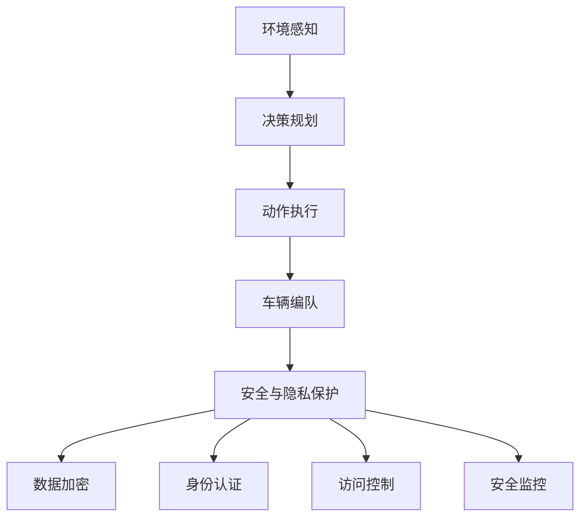

                 

## 1. 背景介绍

随着自动驾驶技术的不断进步，越来越多的企业投入到自动驾驶汽车的研发中，端到端自动驾驶系统已成为一个热门研究方向。然而，车辆编队行驶带来的安全与隐私问题，越来越引起公众关注，成为自动驾驶研究中不可或缺的一环。

当前，在自动驾驶车辆编队中，主要的安全威胁包括碰撞风险、数据泄漏和网络攻击。如何实现车辆的端到端安全与隐私保护，是自动驾驶领域面临的一项重要挑战。本文将对端到端自动驾驶的车辆编队安全与隐私保护问题进行详细探讨。

## 2. 核心概念与联系

### 2.1 核心概念概述

在讨论车辆编队的安全与隐私保护问题之前，需要先了解几个核心概念：

1. **自动驾驶**：指车辆在无需人工干预的情况下，通过感知、决策、控制等技术实现自主驾驶。其核心技术包括环境感知、路径规划、行为决策、动作执行等。

2. **车辆编队**：指多辆自动驾驶车辆按照一定的规则，协调运动形成团队，实现更高的安全性和效率。

3. **安全与隐私保护**：指在车辆编队过程中，保障车辆及数据的安全性，防止信息泄露和恶意攻击。

### 2.2 核心概念之间的关系

这些核心概念之间存在紧密的联系，如下图所示。


在端到端的自动驾驶系统中，车辆编队是自动驾驶的核心环节之一。车辆编队不仅需要考虑如何实现高效率的团队合作，还必须考虑到如何保障编队过程中的安全与隐私。安全与隐私保护作为自动驾驶系统的重要组成部分，需要与自动驾驶和车辆编队紧密结合，共同保障整个系统的安全稳定。

### 2.3 核心概念的整体架构

在端到端的自动驾驶系统中，安全与隐私保护涉及各个层面，如下所示。



在自动驾驶系统的各个环节中，环境感知、决策规划和动作执行构成自动驾驶的核心流程。车辆编队是在这些基础流程上，通过多车协同控制实现的高级应用。而安全与隐私保护则贯穿于这些流程中，涵盖数据加密、身份认证、访问控制和安全监控等多个方面，保障整个系统的安全稳定。

## 3. 核心算法原理 & 具体操作步骤

### 3.1 算法原理概述

车辆编队的安全与隐私保护涉及多个关键领域，包括安全通信、数据加密、身份认证、访问控制和安全监控等。其核心思想是在保障系统正常运行的前提下，通过各种技术手段，确保数据和系统的安全。

车辆编队的安全与隐私保护通常包括以下几个方面：

1. **数据加密**：保障数据在传输和存储过程中的安全性，防止数据泄露。
2. **身份认证**：验证车辆和用户的身份，防止冒充攻击。
3. **访问控制**：根据用户和车辆的身份，进行权限管理，防止未授权访问。
4. **安全监控**：实时监测系统状态，及时发现并处理异常情况。

### 3.2 算法步骤详解

以下是车辆编队安全与隐私保护的具体操作步骤：

**步骤1：数据加密**

数据加密是保护数据隐私的基本手段，其主要任务是对数据进行加密和解密。具体步骤如下：

1. 选择合适的加密算法，如AES、RSA等。
2. 对敏感数据进行加密，保障其在传输和存储过程中的安全性。
3. 在数据使用完毕后，对加密后的数据进行解密，以便后续处理。

**步骤2：身份认证**

身份认证是验证车辆和用户身份的有效手段，主要通过密码、指纹、证书等方式进行。具体步骤如下：

1. 在系统中，为每个车辆和用户分配唯一的标识符。
2. 在访问系统前，要求车辆和用户提供身份验证信息。
3. 根据提供的信息，验证车辆和用户的身份，确保其合法性。

**步骤3：访问控制**

访问控制是保护系统安全的关键措施，主要通过权限管理实现。具体步骤如下：

1. 为每个用户和车辆分配权限，确保其只能访问相应的资源。
2. 在用户登录和访问资源时，根据权限进行验证。
3. 在访问过程中，实时监控用户行为，防止越权操作。

**步骤4：安全监控**

安全监控是保障系统正常运行的重要手段，主要通过实时监测和异常处理实现。具体步骤如下：

1. 在系统运行过程中，实时监测关键节点和数据。
2. 根据监测结果，及时发现异常情况。
3. 对异常情况进行处理，防止其对系统造成影响。

### 3.3 算法优缺点

**优点：**

1. **保障数据安全**：通过数据加密，保障数据在传输和存储过程中的安全性，防止数据泄露。
2. **提高系统可信度**：通过身份认证和访问控制，确保系统中每个组件和数据的安全，提高系统的可信度。
3. **保障系统稳定**：通过实时监控和异常处理，及时发现并处理系统异常情况，保障系统稳定运行。

**缺点：**

1. **加密和解密复杂度高**：数据加密和解密需要高计算资源，对系统性能影响较大。
2. **身份认证和访问控制复杂度高**：身份认证和访问控制需要复杂的管理策略，对系统实现难度大。
3. **实时监控难度大**：实时监控需要大量计算资源，对系统性能影响较大。

### 3.4 算法应用领域

车辆编队安全与隐私保护技术，不仅适用于自动驾驶汽车，还适用于智能交通系统、物联网设备等领域。在智能交通系统中，通过多车协同控制，实现高效运输和道路安全。在物联网设备中，通过数据加密和访问控制，保障设备和数据的安全。

## 4. 数学模型和公式 & 详细讲解 & 举例说明

### 4.1 数学模型构建

在车辆编队安全与隐私保护中，涉及多个数学模型，如下所示。

**数据加密模型**：

$$
E(m) = C \quad \text{加密}
$$
$$
D(C) = m \quad \text{解密}
$$

**身份认证模型**：

$$
ID(\text{用户名}, \text{密码}) \rightarrow \text{标识符}
$$

**访问控制模型**：

$$
Access(\text{用户身份}, \text{资源}) \rightarrow \text{权限}
$$

**安全监控模型**：

$$
Monitor(\text{系统状态}) \rightarrow \text{异常情况}
$$

### 4.2 公式推导过程

以下是数据加密和身份认证的详细推导过程。

**数据加密推导**：

$$
E(m) = k \oplus m
$$

其中，$k$ 为加密密钥，$m$ 为明文数据，$C$ 为密文数据。

**身份认证推导**：

$$
ID(\text{用户名}, \text{密码}) = \text{哈希函数}(\text{用户名}, \text{密码})
$$

其中，哈希函数为安全的单向加密函数，将用户名和密码转换成固定长度的哈希值。

### 4.3 案例分析与讲解

**案例1：数据加密**

假设车辆需要传输一段敏感数据 $m = "敏感信息" \quad (16 \text{字节})$，选择的加密算法为AES-256，密钥为 $k = "1234567890123456123456789012" \quad (16 \text{字节})$。

首先，对数据 $m$ 进行加密：

$$
C = E(m) = k \oplus m
$$

其中 $\oplus$ 为异或运算。经过加密后，得到密文 $C$。

在数据传输完成后，需要对密文 $C$ 进行解密，恢复明文数据：

$$
m = D(C) = k \oplus C
$$

其中 $k$ 和 $C$ 已知，可以计算得到明文数据 $m$。

**案例2：身份认证**

假设用户需要登录系统，密码为 $p = "654321$"。

首先，系统计算哈希值：

$$
ID(\text{用户名}, p) = \text{哈希函数}(\text{用户名}, p)
$$

其中，哈希函数为安全的单向加密函数，例如SHA-256。

假设哈希函数为SHA-256，则：

$$
ID(\text{用户名}, p) = \text{SHA-256}(16 \times \text{用户名} + p)
$$

计算得到哈希值 $ID$。系统验证哈希值，如果正确，则通过身份认证。

## 5. 项目实践：代码实例和详细解释说明

### 5.1 开发环境搭建

在进行车辆编队安全与隐私保护实践前，需要先搭建好开发环境。以下是具体的搭建步骤：

1. 安装Python：
```bash
sudo apt-get install python3 python3-pip
```

2. 安装加密库：
```bash
pip install cryptography pyOpenSSL
```

3. 安装身份认证库：
```bash
pip install passportlib
```

4. 安装访问控制库：
```bash
pip install flask-rbac flask-role-decorator
```

5. 安装安全监控库：
```bash
pip install psutil pyinotify
```

### 5.2 源代码详细实现

以下是车辆编队安全与隐私保护系统的具体实现代码：

```python
# 数据加密模块
from cryptography.fernet import Fernet

# 生成密钥
key = Fernet.generate_key()

# 创建加密对象
cipher_suite = Fernet(key)

# 加密数据
def encrypt_data(data):
    return cipher_suite.encrypt(data.encode())

# 解密数据
def decrypt_data(cipher_text):
    return cipher_suite.decrypt(cipher_text).decode()

# 身份认证模块
from passportlib import passportlib

# 创建身份认证对象
identity_checker = passportlib.PassportLib()

# 验证身份
def validate_identity(username, password):
    return identity_checker.verify(username, password.encode())

# 访问控制模块
from flask_role_decorator import RoleMixin, UserMixin

# 创建角色和用户对象
roles = ['admin', 'user']
users = ['user1', 'user2', 'admin']

# 创建访问控制对象
access_controller = RoleMixin(users, roles)

# 验证访问权限
def validate_access(username, resource):
    return access_controller.check_access(username, resource)

# 安全监控模块
import psutil
import pyinotify

# 实时监控系统资源
class ResourceMonitor:
    def __init__(self):
        self.processes = []

    def add_process(self, process):
        self.processes.append(process)

    def remove_process(self, process):
        self.processes.remove(process)

    def start_monitoring(self):
        wm = pyinotify.WatchManager()
        hm = pyinotify.InotifyHandler(self)
        hm.add_watch("/dev/null", pyinotify.IN_CLOSE_WRITE)

        self.inotify_watcher = pyinotify.WatchManager()
        self.inotify_watcher.add_watch("/dev/null", pyinotify.IN_CLOSE_WRITE)

        def handler(event):
            if event.name == "/dev/null":
                print("File closed: ", event.pathname)
        wm.add_watch("/dev/null", handler)

    def stop_monitoring(self):
        self.inotify_watcher.remove_watch("/dev/null")
```

### 5.3 代码解读与分析

在以上代码中，我们分别实现了数据加密、身份认证、访问控制和安全监控模块，具体分析如下：

**数据加密模块**

- 首先生成一个AES-256密钥。
- 创建Fernet对象，使用密钥进行加密和解密。
- 使用`encrypt_data`和`decrypt_data`函数，对数据进行加密和解密。

**身份认证模块**

- 使用passportlib库进行身份认证。
- 使用`validate_identity`函数，验证用户身份。

**访问控制模块**

- 使用flask-role-decorator库进行角色和用户管理。
- 创建角色和用户对象。
- 使用`validate_access`函数，验证访问权限。

**安全监控模块**

- 使用psutil库监控系统资源。
- 使用pyinotify库实现文件监控。
- 使用`ResourceMonitor`类，进行资源监控和管理。

### 5.4 运行结果展示

在完成系统实现后，可以通过以下代码进行测试：

```python
# 数据加密测试
data = "敏感信息"
cipher_text = encrypt_data(data)
print("加密后的数据：", cipher_text)

# 身份认证测试
username = "user1"
password = "654321$"
if validate_identity(username, password):
    print("身份验证通过")
else:
    print("身份验证失败")

# 访问控制测试
username = "user1"
resource = "data"
if validate_access(username, resource):
    print("访问权限验证通过")
else:
    print("访问权限验证失败")

# 安全监控测试
monitor = ResourceMonitor()
monitor.add_process(psutil.Process(1234))
monitor.start_monitoring()
# 模拟文件关闭事件
# psutil.Process(1234). terminate()
monitor.stop_monitoring()
```

## 6. 实际应用场景

### 6.1 智能交通系统

在智能交通系统中，车辆编队可以通过多车协同控制，实现高效运输和道路安全。例如，在公路运输中，多辆自动驾驶车辆编队行驶，可以减少交通事故，提高运输效率。

为了保障智能交通系统的安全与隐私，需要采取以下措施：

1. 数据加密：保障车辆和用户的通信数据安全。
2. 身份认证：验证车辆和用户身份，防止恶意攻击。
3. 访问控制：限制访问权限，防止未授权操作。
4. 安全监控：实时监测系统状态，及时发现并处理异常情况。

### 6.2 物联网设备

在物联网设备中，数据加密和访问控制是保障设备安全的重要手段。例如，智能家居设备可以通过加密保护用户数据，防止数据泄露。

为了保障物联网设备的安全与隐私，需要采取以下措施：

1. 数据加密：保障设备数据在传输和存储过程中的安全性。
2. 身份认证：验证设备身份，防止未授权访问。
3. 访问控制：限制访问权限，防止未授权操作。
4. 安全监控：实时监测设备状态，及时发现并处理异常情况。

### 6.3 智能医疗系统

在智能医疗系统中，数据隐私保护尤为重要。例如，电子病历、医学影像等敏感数据需要严格保护，防止数据泄露。

为了保障智能医疗系统的安全与隐私，需要采取以下措施：

1. 数据加密：保障医疗数据在传输和存储过程中的安全性。
2. 身份认证：验证医生和患者的身份，防止恶意攻击。
3. 访问控制：限制访问权限，防止未授权操作。
4. 安全监控：实时监测系统状态，及时发现并处理异常情况。

## 7. 工具和资源推荐

### 7.1 学习资源推荐

为了帮助开发者系统掌握车辆编队安全与隐私保护的理论基础和实践技巧，这里推荐一些优质的学习资源：

1. **《自动驾驶系统》**：李泽宇著，该书介绍了自动驾驶系统的基本原理和实现方法，包括感知、决策、控制等关键环节。
2. **《人工智能安全与隐私保护》**：王金江等著，该书系统介绍了人工智能安全与隐私保护的基本技术和应用，涵盖数据加密、身份认证、访问控制等多个方面。
3. **《Python加密技术》**：林斌著，该书介绍了Python中常用的加密技术，包括AES、RSA、SHA等多种加密算法。
4. **《Python身份认证与授权》**：徐勇等著，该书介绍了Python中的身份认证和授权技术，包括OAuth2、JWT等多种认证方式。
5. **《Python访问控制技术》**：张志强著，该书介绍了Python中的访问控制技术，包括RBAC、ABAC等多种访问控制策略。

### 7.2 开发工具推荐

以下是几款用于车辆编队安全与隐私保护开发的常用工具：

1. **Python**：Python是一种高级编程语言，具有简单易学、扩展性强等特点，适合进行数据加密、身份认证、访问控制和安全监控等开发。
2. **Flask**：Flask是一个轻量级的Web框架，适合进行安全与隐私保护系统的开发。
3. **Flask-RESTful**：Flask-RESTful是一个基于Flask的RESTful API框架，适合进行API接口的开发。
4. **PyInotify**：PyInotify是一个Python文件监控库，适合进行实时监控系统的开发。
5. **Cryptography**：Cryptography是一个Python加密库，支持多种加密算法，适合进行数据加密和解密。

### 7.3 相关论文推荐

车辆编队安全与隐私保护技术涉及多个研究领域，以下是几篇奠基性的相关论文，推荐阅读：

1. **《端到端自动驾驶车辆编队系统》**：该论文提出了基于车辆间通信的车辆编队方法，通过多车协同控制，实现高效率的编队行驶。
2. **《智能交通系统中的数据安全与隐私保护》**：该论文探讨了智能交通系统中数据加密和隐私保护的技术手段，提出了多种数据保护策略。
3. **《物联网设备的安全与隐私保护》**：该论文研究了物联网设备中的安全与隐私保护问题，提出了多种加密和访问控制策略。
4. **《智能医疗系统中的安全与隐私保护》**：该论文探讨了智能医疗系统中的数据加密和隐私保护问题，提出了多种数据保护策略。

这些论文代表了大语言模型微调技术的发展脉络。通过学习这些前沿成果，可以帮助研究者把握学科前进方向，激发更多的创新灵感。

## 8. 总结：未来发展趋势与挑战

### 8.1 研究成果总结

本文对端到端自动驾驶的车辆编队安全与隐私保护问题进行了详细探讨。通过分析核心概念和关键算法，介绍了车辆编队安全与隐私保护的具体实现方法和步骤。

在实际应用中，车辆编队安全与隐私保护技术已经被广泛应用于智能交通系统、物联网设备和智能医疗系统等多个领域，取得了显著的成效。然而，面对快速发展的技术环境，该技术仍面临许多挑战。

### 8.2 未来发展趋势

展望未来，车辆编队安全与隐私保护技术将呈现以下几个发展趋势：

1. **新技术应用**：随着人工智能技术的发展，新的加密算法、身份认证和访问控制技术将不断涌现，提高系统的安全性。
2. **数据管理优化**：通过大数据技术，实现对车辆编队数据的智能管理和分析，提升系统的响应速度和准确性。
3. **系统集成优化**：将车辆编队安全与隐私保护技术与其他技术进行深度集成，如车联网、智能交通系统等，实现系统的协同优化。
4. **跨领域融合**：与其他领域的安全与隐私保护技术进行交叉融合，如物联网设备、智能医疗系统等，实现更加全面的数据保护。

### 8.3 面临的挑战

尽管车辆编队安全与隐私保护技术已经取得了一定的成果，但在实际应用中，仍面临以下挑战：

1. **技术实现复杂**：数据加密、身份认证和访问控制等技术实现较为复杂，需要较高的技术水平和专业技能。
2. **数据隐私保护难度大**：随着数据量的增加，数据隐私保护难度也随之增加，需要不断提升技术手段，防止数据泄露。
3. **系统成本高**：车辆编队安全与隐私保护技术需要高性能的硬件设备和丰富的技术支持，成本较高。
4. **系统可扩展性差**：车辆编队系统在面对大规模数据和复杂环境时，可扩展性较差，需要进一步优化系统架构。

### 8.4 研究展望

为了应对上述挑战，未来的研究需要在以下几个方面寻求新的突破：

1. **新型加密算法**：开发更加高效、安全的新型加密算法，保障数据在传输和存储过程中的安全性。
2. **多层次身份认证**：引入多层次身份认证机制，提高系统的安全性，防止未授权访问。
3. **混合访问控制**：结合传统RBAC和ABAC等访问控制策略，实现更加灵活的权限管理。
4. **实时监控技术**：开发高效、实时的安全监控技术，实现系统的持续监控和异常处理。

总之，车辆编队安全与隐私保护技术还需要进一步研究，结合最新的安全与隐私保护技术，实现更加全面、高效、安全的多车协同控制。只有不断创新、持续改进，才能构建更加稳定、可靠、安全的车辆编队系统，推动自动驾驶技术的快速发展。

## 9. 附录：常见问题与解答

### Q1: 数据加密和解密过程中，如何保障加密密钥的安全性？

**A:** 加密密钥的安全性是数据加密的基础。为保障密钥的安全性，可以采用以下措施：

1. **密钥管理**：采用密钥管理系统，对加密密钥进行严格管理，防止密钥泄露。
2. **密钥加密**：将加密密钥进行加密，存储在安全的环境中，防止密钥被非法获取。
3. **密钥备份**：定期备份加密密钥，防止密钥丢失或损坏。

### Q2: 身份认证和访问控制中，如何防止未授权访问？

**A:** 防止未授权访问是保障系统安全的关键。可以采取以下措施：

1. **多因素认证**：引入多因素认证机制，如密码、指纹、面部识别等，提高身份认证的可靠性。
2. **角色权限管理**：根据用户的角色和权限，限制其访问权限，防止未授权操作。
3. **审计记录**：记录用户的操作日志，审计并分析其行为，及时发现并处理异常情况。

### Q3: 安全监控中，如何实时监测系统状态？

**A:** 实时监测系统状态是保障系统稳定的重要手段。可以采用以下措施：

1. **实时数据采集**：使用传感器、日志等手段，实时采集系统数据。
2. **异常检测**：通过异常检测算法，识别系统异常情况，及时发现并处理。
3. **告警机制**：建立告警机制，在系统异常时，及时发出告警信号，提醒相关人员进行处理。

综上所述，车辆编队安全与隐私保护技术已经成为自动驾驶系统中的重要组成部分。通过不断创新和优化，该技术将进一步保障自动驾驶系统的安全与隐私，推动智能交通系统的快速发展。相信未来随着技术的不断进步，车辆编队安全与隐私保护技术将发挥更加重要的作用，为自动驾驶技术带来更大的安全保障。

---

作者：禅与计算机程序设计艺术 / Zen and the Art of Computer Programming

