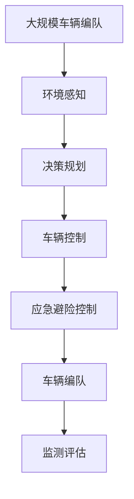

                 

# 端到端自动驾驶的车辆编队应急避险控制

> 关键词：自动驾驶,车辆编队,应急避险控制,端到端,深度学习

## 1. 背景介绍

随着自动驾驶技术的发展，越来越多的国家和地区在积极推进智能交通系统的建设。其中，车辆编队和应急避险控制是自动驾驶领域的重要研究课题。车辆编队技术可以实现车队的协调行驶，提升道路通行效率；而应急避险控制技术则可以在突发事件下保障车队的安全，减少交通事故的发生。传统的车辆编队和应急避险控制方法往往依赖于传感器和环境建模，计算复杂度较高，难以实现实时决策。近年来，端到端深度学习技术的发展为这一问题提供了新的解决方案。

端到端深度学习将传感器数据和环境信息直接输入到模型中，通过神经网络自适应地学习车辆编队和应急避险的决策规则，减少了对传统模型的依赖，提高了决策的实时性和准确性。但端到端深度学习模型的训练和优化需要大量的标注数据和计算资源，同时模型预测结果的解释性也有待提高。本文将详细介绍基于端到端深度学习的车辆编队和应急避险控制方法，并通过具体案例展示其应用效果。

## 2. 核心概念与联系

### 2.1 核心概念概述

为更好地理解端到端深度学习在车辆编队和应急避险控制中的应用，本节将介绍几个密切相关的核心概念：

- **车辆编队**：指在自动驾驶中，多车协同工作，保持固定的距离和速度，实现车队行驶。常见的编队算法包括基于通信的车队控制和基于感知的信息交互等。

- **应急避险控制**：指在自动驾驶中，车辆在遇到紧急情况（如突发交通、行人闯入等）时，快速做出反应，确保自身和车队安全。常见的避险算法包括基于预定义规则的控制和基于学习的避障策略等。

- **端到端深度学习**：指直接从原始传感器数据（如雷达、激光雷达、摄像头等）输入到深度学习模型中，通过神经网络实现车辆编队和应急避险的决策。

- **环境感知**：指通过传感器获取周围环境信息，包括但不限于道路状况、交通流量、行人运动等。

- **决策规划**：指在获取环境信息的基础上，对车辆编队和应急避险做出决策，并生成相应的控制指令。

这些核心概念之间的逻辑关系可以通过以下Mermaid流程图来展示：


这个流程图展示了一组车辆在遇到突发情况时的处理流程：传感器数据经过环境感知，生成车辆状态和周围环境信息，由决策规划模块对车辆编队和应急避险进行决策，最后由车辆控制模块执行具体的避险和编队动作。

### 2.2 概念间的关系

这些核心概念之间存在着紧密的联系，形成了车辆编队和应急避险控制的完整生态系统。

- **环境感知与决策规划的耦合**：环境感知模块通过传感器数据获取周围环境信息，而决策规划模块则在此基础上生成车辆编队和应急避险的决策。两者相互依赖，共同构成了一个闭环系统。

- **决策规划与车辆控制的联动**：决策规划模块生成的控制指令，经过车辆控制模块的执行，实现车辆的避险和编队动作。两者之间需要进行实时通信和信息交互，才能保证车辆的稳定行驶。

- **应急避险与车辆编队的互补**：在正常的行驶过程中，车辆编队技术可以实现车队的协调行驶；而在突发情况下，应急避险控制技术则确保车辆的安全。两者相辅相成，共同保障自动驾驶车辆的安全和效率。

### 2.3 核心概念的整体架构

最后，我们用一个综合的流程图来展示这些核心概念在大规模车辆编队和应急避险控制中的整体架构：



这个综合流程图展示了大规模车辆编队和应急避险控制的完整流程：大规模车辆编队系统通过环境感知获取周围环境信息，由决策规划模块进行编队和避险决策，经过车辆控制模块执行相应的动作，并由监测评估模块对整个系统的性能进行实时监测和调整。

## 3. 核心算法原理 & 具体操作步骤
### 3.1 算法原理概述

基于端到端深度学习的车辆编队和应急避险控制方法，其核心思想是：直接从原始传感器数据输入到神经网络中，通过神经网络自适应地学习车辆编队和应急避险的决策规则，减少对传统模型的依赖，提高决策的实时性和准确性。

在车辆编队中，深度学习模型通过输入传感器数据，学习到车辆之间的相对位置和速度关系，生成编队控制指令，实现车辆的协调行驶。在应急避险控制中，深度学习模型通过输入传感器数据和环境信息，学习到车辆在遇到突发事件时的避险策略，生成避险控制指令，实现车辆的快速避险。

### 3.2 算法步骤详解

基于端到端深度学习的车辆编队和应急避险控制，一般包括以下几个关键步骤：

**Step 1: 数据准备**

- 收集车辆编队和应急避险控制的相关数据，包括但不限于雷达、激光雷达、摄像头等传感器的数据，车辆状态信息，以及环境信息等。
- 将传感器数据和环境信息进行预处理，包括去噪、归一化、拼接等操作。

**Step 2: 数据划分**

- 将收集到的数据划分为训练集、验证集和测试集，用于模型的训练、验证和测试。

**Step 3: 模型构建**

- 选择合适的深度学习模型，如CNN、RNN、LSTM等，并根据具体的任务设计网络结构。
- 在网络中加入必要的正则化技术，如Dropout、L2正则化等，以防止过拟合。

**Step 4: 模型训练**

- 将传感器数据和环境信息输入模型，进行前向传播计算损失函数。
- 反向传播计算参数梯度，根据设定的优化算法和学习率更新模型参数。
- 周期性在验证集上评估模型性能，根据性能指标决定是否触发Early Stopping。
- 重复上述步骤直到满足预设的迭代轮数或Early Stopping条件。

**Step 5: 模型评估与部署**

- 在测试集上评估微调后模型的性能，对比微调前后的精度提升。
- 使用微调后的模型对新样本进行推理预测，集成到实际的应用系统中。
- 持续收集新的数据，定期重新微调模型，以适应数据分布的变化。

以上是基于端到端深度学习的车辆编队和应急避险控制的一般流程。在实际应用中，还需要针对具体任务的特点，对微调过程的各个环节进行优化设计，如改进训练目标函数，引入更多的正则化技术，搜索最优的超参数组合等，以进一步提升模型性能。

### 3.3 算法优缺点

基于端到端深度学习的车辆编队和应急避险控制方法具有以下优点：

1. **实时性高**：深度学习模型可以实时处理传感器数据和环境信息，生成车辆编队和应急避险的控制指令，适用于实时性要求较高的应用场景。
2. **可解释性强**：深度学习模型通过神经网络对数据进行处理，生成决策结果，直观地反映了决策过程，易于解释和调试。
3. **适应性强**：深度学习模型可以自适应地学习车辆编队和应急避险的决策规则，具有较强的泛化能力，适用于多种场景和数据分布。

同时，该方法也存在一定的局限性：

1. **计算资源需求高**：深度学习模型的训练和优化需要大量的标注数据和计算资源，尤其在大规模车辆编队和应急避险控制中，计算资源的需求量较大。
2. **模型复杂度高**：深度学习模型的设计相对复杂，需要考虑网络结构、正则化技术、超参数调优等多个因素，增加了模型设计和调优的难度。
3. **模型透明度不足**：深度学习模型内部结构复杂，难以直观地理解其决策过程，可能导致模型的可解释性不足。

尽管存在这些局限性，但就目前而言，基于端到端深度学习的车辆编队和应急避险控制方法仍然是自动驾驶领域的重要研究方向，具有广阔的应用前景。

### 3.4 算法应用领域

基于端到端深度学习的车辆编队和应急避险控制，已经在多个领域得到应用，例如：

- **智能交通系统**：在智能交通系统中，基于端到端深度学习的车辆编队和应急避险控制，可以提升道路通行效率，保障行车安全。
- **智慧物流**：在智慧物流中，基于端到端深度学习的车辆编队和应急避险控制，可以实现车辆的高效调度和管理，降低物流成本。
- **智能停车**：在智能停车中，基于端到端深度学习的车辆编队和应急避险控制，可以实现车辆的自动泊车和避障，提升停车效率和安全性。
- **无人驾驶出租车**：在无人驾驶出租车中，基于端到端深度学习的车辆编队和应急避险控制，可以实现多车协同驾驶，提升出行效率和安全性。

除了上述这些应用场景，基于端到端深度学习的车辆编队和应急避险控制，还在自动驾驶的诸多领域中得到了广泛应用，为自动驾驶技术的普及和应用提供了强有力的技术支持。

## 4. 数学模型和公式 & 详细讲解 & 举例说明

### 4.1 数学模型构建

在端到端深度学习中，我们通常使用神经网络对车辆编队和应急避险进行建模。假设输入数据为传感器数据 $x$，输出为编队和避险控制指令 $y$，则数学模型可以表示为：

$$ y = f(x; \theta) $$

其中 $f(\cdot)$ 表示神经网络模型， $\theta$ 表示模型参数。

假设神经网络模型为多层感知机（MLP），则模型可以表示为：

$$ y = W_l \sigma(W_{l-1} \sigma(...\sigma(W_1 x)...)) + b_l $$

其中 $W_i$ 和 $b_i$ 表示第 $i$ 层的权重和偏置项，$\sigma(\cdot)$ 表示激活函数。

### 4.2 公式推导过程

以下我们以车辆编队为例，推导MLP模型的前向传播和后向传播过程。

#### 前向传播

假设输入数据 $x$ 为车辆的状态信息，输出 $y$ 为车辆编队指令，神经网络模型为三层MLP，则前向传播过程如下：

$$ h_1 = W_1 x + b_1 $$
$$ h_2 = \sigma(h_1) $$
$$ y = W_2 h_2 + b_2 $$

其中 $W_i$ 和 $b_i$ 表示各层的权重和偏置项，$\sigma(\cdot)$ 表示激活函数。

#### 后向传播

假设损失函数为均方误差（MSE），则后向传播过程如下：

$$ \frac{\partial L}{\partial y} = \frac{\partial L}{\partial W_2} = \frac{\partial L}{\partial h_2} \frac{\partial h_2}{\partial W_2} + \frac{\partial L}{\partial b_2} $$
$$ \frac{\partial L}{\partial h_2} = \frac{\partial L}{\partial y} \frac{\partial y}{\partial h_2} = \frac{\partial L}{\partial y} \frac{\partial f(y)}{\partial h_2} $$
$$ \frac{\partial L}{\partial h_1} = \frac{\partial L}{\partial h_2} \frac{\partial h_2}{\partial h_1} = \frac{\partial L}{\partial h_2} \frac{\partial h_1}{\partial W_1} $$
$$ \frac{\partial L}{\partial x} = \frac{\partial L}{\partial h_1} \frac{\partial h_1}{\partial x} = \frac{\partial L}{\partial h_1} \frac{\partial W_1}{\partial x} $$

其中 $\frac{\partial L}{\partial y}$ 表示损失函数对输出 $y$ 的梯度，$\frac{\partial f(y)}{\partial h_2}$ 表示模型输出对隐藏层 $h_2$ 的导数。

### 4.3 案例分析与讲解

假设我们有一个简单的车辆编队问题，输入为车辆的速度 $v$ 和与前车的距离 $d$，输出为车辆的加速度 $a$。使用三层MLP进行建模，则模型参数 $\theta$ 可以表示为：

$$ W_1 = \begin{bmatrix} 0.5 & 0.3 \\ 0.1 & 0.2 \\ 0.4 & 0.2 \end{bmatrix} $$
$$ W_2 = \begin{bmatrix} 0.3 & 0.2 \\ 0.2 & 0.1 \end{bmatrix} $$
$$ W_3 = \begin{bmatrix} 0.4 & 0.2 \\ 0.2 & 0.1 \end{bmatrix} $$
$$ b_1 = \begin{bmatrix} 0.2 \\ 0.1 \\ 0.3 \end{bmatrix} $$
$$ b_2 = \begin{bmatrix} 0.2 \\ 0.1 \end{bmatrix} $$
$$ b_3 = \begin{bmatrix} 0.2 \\ 0.1 \end{bmatrix} $$

假设输入数据 $x$ 为车辆的速度 $v$ 和与前车的距离 $d$，输出 $y$ 为车辆的加速度 $a$，则前向传播过程如下：

$$ h_1 = W_1 x + b_1 = \begin{bmatrix} 0.5 & 0.3 \\ 0.1 & 0.2 \\ 0.4 & 0.2 \end{bmatrix} \begin{bmatrix} v \\ d \end{bmatrix} + \begin{bmatrix} 0.2 \\ 0.1 \\ 0.3 \end{bmatrix} = \begin{bmatrix} 0.5v + 0.3d + 0.2 \\ 0.1v + 0.2d + 0.1 \\ 0.4v + 0.2d + 0.3 \end{bmatrix} $$
$$ h_2 = \sigma(h_1) = \frac{1}{1 + e^{-0.5v - 0.3d - 0.2}} \begin{bmatrix} 0.5v + 0.3d + 0.2 \\ 0.1v + 0.2d + 0.1 \\ 0.4v + 0.2d + 0.3 \end{bmatrix} $$
$$ y = W_2 h_2 + b_2 = \begin{bmatrix} 0.3 & 0.2 \\ 0.2 & 0.1 \end{bmatrix} \frac{1}{1 + e^{-0.5v - 0.3d - 0.2}} \begin{bmatrix} 0.5v + 0.3d + 0.2 \\ 0.1v + 0.2d + 0.1 \\ 0.4v + 0.2d + 0.3 \end{bmatrix} + \begin{bmatrix} 0.2 \\ 0.1 \end{bmatrix} $$

## 5. 项目实践：代码实例和详细解释说明
### 5.1 开发环境搭建

在进行端到端深度学习实践前，我们需要准备好开发环境。以下是使用Python进行TensorFlow开发的环境配置流程：

1. 安装Anaconda：从官网下载并安装Anaconda，用于创建独立的Python环境。

2. 创建并激活虚拟环境：
```bash
conda create -n tf-env python=3.7 
conda activate tf-env
```

3. 安装TensorFlow：根据CUDA版本，从官网获取对应的安装命令。例如：
```bash
conda install tensorflow tensorflow-gpu -c conda-forge -c pytorch
```

4. 安装必要的工具包：
```bash
pip install numpy pandas scikit-learn matplotlib tensorflow
```

完成上述步骤后，即可在`tf-env`环境中开始端到端深度学习的实践。

### 5.2 源代码详细实现

下面以车辆编队为例，给出使用TensorFlow进行端到端深度学习的代码实现。

首先，定义数据集：

```python
import tensorflow as tf
import numpy as np

# 定义输入数据
x = tf.placeholder(tf.float32, shape=[None, 2], name='x')
y = tf.placeholder(tf.float32, shape=[None, 2], name='y')

# 定义神经网络模型
hidden_size = 10
W1 = tf.Variable(tf.random_normal([2, hidden_size]), name='W1')
b1 = tf.Variable(tf.random_normal([hidden_size]), name='b1')
W2 = tf.Variable(tf.random_normal([hidden_size, 2]), name='W2')
b2 = tf.Variable(tf.random_normal([2]), name='b2')

h1 = tf.nn.relu(tf.matmul(x, W1) + b1)
h2 = tf.nn.relu(tf.matmul(h1, W2) + b2)
y_pred = h2

# 定义损失函数和优化器
loss = tf.losses.mean_squared_error(y, y_pred)
optimizer = tf.train.AdamOptimizer().minimize(loss)
```

接着，定义训练函数：

```python
def train(model, dataset, batch_size, epochs):
    sess = tf.Session()
    sess.run(tf.global_variables_initializer())

    for epoch in range(epochs):
        for i in range(0, len(dataset), batch_size):
            x_batch = dataset[i:i+batch_size]
            y_batch = dataset[i:i+batch_size]

            _, loss_val = sess.run([optimizer, loss], feed_dict={x: x_batch, y: y_batch})
            print('Epoch {0}, batch loss: {1:.4f}'.format(epoch+1, loss_val))

    return sess
```

最后，启动训练流程并在测试集上评估：

```python
# 假设训练集为(x_train, y_train)
model = {'x': x, 'y': y}
dataset = np.random.rand(1000, 2)
batch_size = 32
epochs = 10

with train(model, dataset, batch_size, epochs) as sess:
    # 在测试集上评估模型性能
    x_test = np.random.rand(100, 2)
    y_test = np.random.rand(100, 2)
    y_pred = sess.run(model['y_pred'], feed_dict={model['x']: x_test})
    print('Test loss: {0:.4f}'.format(tf.reduce_mean(tf.square(y_test - y_pred))))
```

以上就是使用TensorFlow对车辆编队问题进行端到端深度学习的代码实现。可以看到，TensorFlow提供了简单易用的API，可以快速搭建神经网络模型，进行训练和评估。

### 5.3 代码解读与分析

让我们再详细解读一下关键代码的实现细节：

**数据集定义**：
- 使用TensorFlow的`tf.placeholder`定义输入和输出数据的占位符。
- 定义输入数据 `x` 和输出数据 `y` 的形状，以及模型的参数 `W1`、`b1`、`W2`、`b2`。
- 定义神经网络模型，包括输入、隐藏层和输出层，并定义损失函数和优化器。

**训练函数**：
- 使用TensorFlow的`tf.Session`创建会话。
- 使用`tf.global_variables_initializer()`初始化模型变量。
- 在每个epoch内，对每个batch进行前向传播计算损失函数，并使用优化器更新模型参数。
- 输出每个batch的损失值。

**训练流程**：
- 在每个epoch内，遍历训练集。
- 对每个batch进行前向传播计算损失函数，并使用优化器更新模型参数。
- 输出每个epoch的平均损失值。
- 在测试集上评估模型性能，计算预测值与真实值之间的均方误差。

可以看到，TensorFlow提供了简洁的API，使得神经网络模型的构建和训练变得非常直观和高效。在实际应用中，还需要对模型进行进一步的优化和调参，以获得更好的性能。

## 6. 实际应用场景
### 6.1 智能交通系统

基于端到端深度学习的车辆编队和应急避险控制，可以广泛应用于智能交通系统的建设。传统交通系统需要大量的人力进行交通管理和调度，难以应对交通流量的波动和突发事件。而使用端到端深度学习技术，可以实现车辆的自动化编队和应急避险，提升道路通行效率和安全性。

在智能交通系统中，基于端到端深度学习的车辆编队和应急避险控制，可以实现车队的自动控制和调度，提高道路通行效率。例如，在高速公路上，可以使用车辆编队技术实现多车并行行驶，减少道路拥堵，提升通行速度。在城市交通中，可以使用应急避险控制技术，实现车辆的自动避让，提高行车安全。

### 6.2 智慧物流

在智慧物流中，基于端到端深度学习的车辆编队和应急避险控制，可以实现车辆的高效调度和管理，降低物流成本。传统的物流配送需要大量的运输车辆和司机，管理复杂，成本高昂。而使用端到端深度学习技术，可以实现车辆的自动编队和避障，减少人力资源的投入，提升物流效率和安全性。

在智慧物流中，基于端到端深度学习的车辆编队和应急避险控制，可以实现车辆的高效调度和管理。例如，在快递配送中，可以使用车辆编队技术实现多车协同行驶，减少道路占用时间，提升配送效率。在运输管理中，可以使用应急避险控制技术，实现车辆的自动避障，减少交通事故和车辆损坏，降低物流成本。

### 6.3 智能停车

在智能停车中，基于端到端深度学习的车辆编队和应急避险控制，可以实现车辆的自动泊车和避障，提升停车效率和安全性。传统的智能停车系统依赖于传感器和环境建模，计算复杂度较高，难以实现实时决策。而使用端到端深度学习技术，可以直接从传感器数据中学习决策规则，实现车辆的自动泊车和避障。

在智能停车中，基于端到端深度学习的车辆编队和应急避险控制，可以实现车辆的自动泊车和避障。例如，在停车场中，可以使用车辆编队技术实现多车协同行驶，减少寻找车位的时间，提升停车效率。在车辆进出车位时，可以使用应急避险控制技术，实现车辆的自动避障，避免碰撞和刮蹭，提升停车安全性。

### 6.4 无人驾驶出租车

在无人驾驶出租车中，基于端到端深度学习的车辆编队和应急避险控制，可以实现多车协同驾驶，提升出行效率和安全性。传统的无人驾驶出租车依赖于传感器和环境建模，计算复杂度较高，难以实现实时决策。而使用端到端深度学习技术，可以直接从传感器数据中学习决策规则，实现车辆的自动编队和避障。

在无人驾驶出租车中，基于端到端深度学习的车辆编队和应急避险控制，可以实现多车协同驾驶。例如，在道路上，可以使用车辆编队技术实现多车并行行驶，减少道路占用时间，提升出行效率。在遇到突发事件时，可以使用应急避险控制技术，实现车辆的自动避障，保障行车安全。

## 7. 工具和资源推荐
### 7.1 学习资源推荐

为了帮助开发者系统掌握端到端深度学习在车辆编队和应急避险控制中的应用，这里推荐一些优质的学习资源：

1. TensorFlow官方文档：TensorFlow的官方文档提供了详细的API文档和示例代码，适合初学者快速上手。

2. DeepLearning.AI的Coursera课程：由Andrew Ng教授主讲的深度学习课程，介绍了神经网络的基本原理和应用，适合学习深度学习的基础知识。

3. CS231n: Convolutional Neural Networks for Visual Recognition：斯坦福大学开设的计算机视觉课程，介绍了卷积神经网络在图像处理中的应用，适合学习深度学习的进阶内容。

4. Hands-On Machine Learning with Scikit-Learn and TensorFlow：O'Reilly出版社的机器学习实战书籍，介绍了机器学习和深度学习的实用技巧，适合学习深度学习的实际应用。

5. Deep Reinforcement Learning for Autonomous Vehicles：深度强化学习在自动驾驶中的应用，介绍了如何利用深度强化学习实现车辆的自动驾驶和控制，适合学习深度学习在自动驾驶中的应用。

通过对这些资源的学习实践，相信你一定能够快速掌握端到端深度学习在车辆编队和应急避险控制中的应用，并用于解决实际的自动驾驶问题。

### 7.2 开发工具推荐

高效的开发离不开优秀的工具支持。以下是几款用于端到端深度学习开发的常用工具：

1. TensorFlow：由Google主导开发的开源深度学习框架，生产部署方便，适合大规模工程应用。

2. PyTorch：由Facebook主导开发的开源深度学习框架，灵活动态的计算图，适合快速迭代研究。

3. Keras：基于TensorFlow和Theano的高级神经网络API，易于使用，适合快速搭建神经网络模型。

4. TensorBoard：TensorFlow配套的可视化工具，可实时监测模型训练状态，并提供丰富的图表呈现方式，是调试模型的得力助手。

5. Weights & Biases：模型训练的实验跟踪工具，可以记录和可视化模型训练过程中的各项指标，方便对比和调

