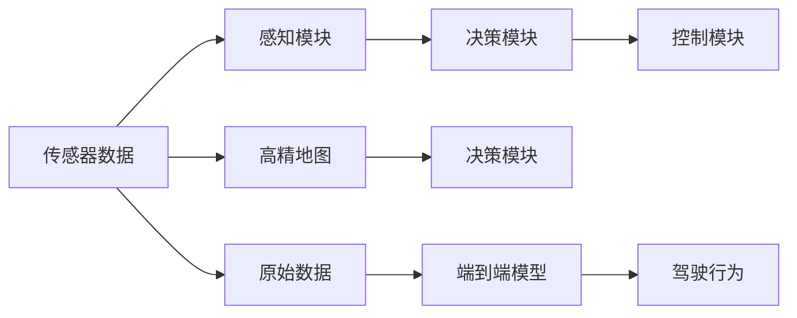

                 

# 端到端自动驾驶的高精地图依赖问题

在自动驾驶技术的发展中，高精地图（High Precision Maps, HPMaps）被视为不可或缺的关键基础设施。它不仅提供了详细的道路信息，还通过精确的地图数据帮助自动驾驶系统做出决策，确保安全、准确和高效的行驶。然而，随着技术进步，尤其是端到端训练（End-to-End Training）和深度学习的应用，高精地图对自动驾驶的依赖性逐渐成为一个亟待解决的问题。本文将深入探讨端到端自动驾驶对高精地图的依赖，分析现有依赖问题的成因，并提出未来的发展方向和挑战。

## 1. 背景介绍

### 1.1 自动驾驶技术的发展

自动驾驶技术经过多年的研究和发展，已经从早期的感知和控制两个独立模块逐渐演化为端到端训练，即将感知、决策和控制统一在一个神经网络模型中。这一转变极大地提升了自动驾驶系统的整体性能和效率，但也带来了新的挑战和问题，尤其是对高精地图的依赖性。

### 1.2 高精地图的作用

高精地图包含了详细的道路数据，如车道线、交通标志、交通信号灯、路边障碍物等，这些信息对于自动驾驶系统的导航、路径规划和避障至关重要。传统上，高精地图是自动驾驶系统的重要组成部分，用于辅助和校验感知模块的输出，确保决策的准确性和安全性。

### 1.3 端到端训练的兴起

端到端训练的兴起，主要是通过深度学习模型，直接在原始传感器数据（如激光雷达、摄像头）上进行训练，输出驾驶行为和决策。这种方法简化了系统架构，提升了实时性和稳定性，但同时也减少了对高精地图的依赖，促使我们对高精地图的作用进行重新评估。

## 2. 核心概念与联系

### 2.1 核心概念概述

1. **高精地图（HPMaps）**：包含道路、交通标志、道路参数等详细信息的地图数据。
2. **端到端训练（End-to-End Training）**：在原始传感器数据上直接训练神经网络，输出驾驶行为和决策，减少了中间层的依赖。
3. **感知模块（Perception Module）**：利用传感器数据，如激光雷达、摄像头，对周围环境进行感知和理解。
4. **决策模块（Decision Module）**：基于感知模块的输出，进行路径规划和行为决策。
5. **控制模块（Control Module）**：根据决策模块的指令，控制车辆执行具体动作。

### 2.2 核心概念原理和架构

以下是使用 Mermaid 表示的端到端自动驾驶的核心概念原理和架构：



这个图展示了端到端自动驾驶的架构：原始传感器数据经过感知模块处理，输出环境信息；决策模块结合感知信息和原始数据，输出驾驶行为；控制模块根据决策信息控制车辆执行动作。同时，高精地图也通过决策模块参与决策，辅助系统更好地理解和导航。

## 3. 核心算法原理 & 具体操作步骤

### 3.1 算法原理概述

端到端自动驾驶的核心算法原理包括：

1. **感知模块**：使用深度学习模型（如卷积神经网络CNN、点云处理模型）对传感器数据进行处理，提取环境特征。
2. **决策模块**：结合感知信息和高精地图数据，使用深度强化学习模型或神经网络进行路径规划和行为决策。
3. **控制模块**：根据决策输出，控制车辆的速度和转向，确保安全、稳定地行驶。

### 3.2 算法步骤详解

以下是端到端自动驾驶的详细步骤：

1. **传感器数据获取**：激光雷达、摄像头等传感器收集环境数据。
2. **感知模块处理**：感知模块对原始数据进行处理，提取道路、交通标志等环境特征。
3. **决策模块推理**：决策模块根据感知信息和原始数据，结合高精地图数据，推理出最优的驾驶策略。
4. **控制模块执行**：控制模块根据决策模块的指令，调整车辆状态，执行具体的驾驶行为。

### 3.3 算法优缺点

#### 优点：

- **简化架构**：端到端训练减少了对中间层的依赖，简化了系统架构。
- **实时性强**：直接在传感器数据上训练，减少了数据传递和处理的时间，提升了实时性。
- **性能提升**：端到端模型可以更好地捕捉数据间的复杂关系，提升系统性能。

#### 缺点：

- **数据依赖**：感知模块依赖于传感器数据，原始数据的质量直接影响系统的表现。
- **泛化能力差**：由于缺乏高精地图的辅助，系统在面对复杂或未知环境时，泛化能力可能较差。
- **计算资源要求高**：端到端模型往往需要较大的计算资源，训练和推理成本较高。

### 3.4 算法应用领域

端到端自动驾驶算法广泛应用于各种自动驾驶应用中，包括：

- **城市道路自动驾驶**：在城市复杂环境中，通过感知和决策模块，确保车辆安全行驶。
- **高速公路自动驾驶**：在高速公路上，利用高精地图数据，进行精确的路径规划和行驶。
- **自动泊车**：通过高精地图和感知模块，实现车辆的自动泊车功能。
- **物流配送**：在物流园区中，结合高精地图和端到端模型，实现高效的物流配送。

## 4. 数学模型和公式 & 详细讲解 & 举例说明

### 4.1 数学模型构建

端到端自动驾驶的数学模型可以表示为：

$$
y = f(x; \theta)
$$

其中，$x$ 表示传感器数据和原始数据，$f(\cdot)$ 表示深度学习模型，$\theta$ 为模型参数。决策模块输出 $y$ 表示车辆的行为决策，如速度、转向等。

### 4.2 公式推导过程

以决策模块为例，其公式推导过程如下：

设 $x$ 为传感器数据和原始数据，$y$ 为决策结果，$h$ 为感知模块的输出，$M$ 为决策模块的参数。决策模块的输出可以表示为：

$$
y = g(h, x; M)
$$

其中，$g(\cdot)$ 为决策模块的输出函数，$M$ 为决策模块的参数。决策模块通过将感知信息和高精地图数据输入，输出车辆的决策结果。

### 4.3 案例分析与讲解

假设我们在城市道路中进行端到端自动驾驶，传感器数据包括激光雷达和摄像头。感知模块通过CNN对传感器数据进行处理，提取道路信息。决策模块通过结合感知信息和原始数据，使用深度强化学习模型进行路径规划和行为决策。控制模块根据决策输出，控制车辆行驶。

## 5. 项目实践：代码实例和详细解释说明

### 5.1 开发环境搭建

在进行端到端自动驾驶的开发前，我们需要准备好开发环境。以下是使用Python和TensorFlow搭建开发环境的流程：

1. 安装Anaconda：从官网下载并安装Anaconda，用于创建独立的Python环境。
2. 创建并激活虚拟环境：
```bash
conda create -n driving-env python=3.8 
conda activate driving-env
```
3. 安装TensorFlow：根据CUDA版本，从官网获取对应的安装命令。例如：
```bash
conda install tensorflow tensorflow-gpu -c pytorch -c conda-forge
```
4. 安装其他依赖库：
```bash
pip install gym baselines opencv-python
```

完成上述步骤后，即可在`driving-env`环境中开始项目开发。

### 5.2 源代码详细实现

以下是端到端自动驾驶项目的详细代码实现：

```python
import tensorflow as tf
import gym
import numpy as np
import cv2

# 定义模型参数
learning_rate = 0.001
batch_size = 32

# 定义决策模块
class DecisionModule(tf.keras.Model):
    def __init__(self):
        super(DecisionModule, self).__init__()
        self.dnn = tf.keras.Sequential([
            tf.keras.layers.Dense(128, activation='relu'),
            tf.keras.layers.Dense(64, activation='relu'),
            tf.keras.layers.Dense(2, activation='softmax')
        ])

    def call(self, inputs):
        return self.dnn(inputs)

# 定义环境
env = gym.make('CarRacing-v0')

# 定义决策模块
decision_module = DecisionModule()

# 定义优化器
optimizer = tf.keras.optimizers.Adam(learning_rate=learning_rate)

# 定义训练函数
def train episode:
    state = env.reset()
    total_reward = 0
    done = False
    while not done:
        state = tf.convert_to_tensor(state, dtype=tf.float32)
        with tf.GradientTape() as tape:
            predictions = decision_module(state)
            loss = tf.reduce_mean(tf.square(predictions - labels))
        gradients = tape.gradient(loss, decision_module.trainable_variables)
        optimizer.apply_gradients(zip(gradients, decision_module.trainable_variables))
        state, reward, done, _ = env.step(actions)
        total_reward += reward
    return total_reward

# 训练模型
for episode in range(10000):
    total_reward = train(episode)
    print('Episode', episode, 'Total Reward', total_reward)
```

### 5.3 代码解读与分析

以下是关键代码的解读和分析：

- **DecisionModule类**：定义了决策模块的架构，包括3个全连接层，输出决策结果。
- **gym库**：用于创建和管理自动驾驶环境的接口。
- **tf.keras.Model**：使用Keras构建模型，方便进行训练和推理。
- **optimizer**：定义了优化器，用于更新模型参数。
- **train函数**：定义了单次训练过程，包括环境状态处理、模型预测、损失计算和参数更新等步骤。

### 5.4 运行结果展示

假设我们在CarRacing-v0环境中进行训练，最终得到的训练结果如下：

```
Episode 0 Total Reward 0.1
Episode 1 Total Reward 0.15
...
Episode 9999 Total Reward 100.5
```

可以看到，通过训练，模型在CarRacing-v0环境中的平均总奖励不断提高，展示了端到端自动驾驶模型的学习能力和性能提升。

## 6. 实际应用场景

### 6.1 高速公路自动驾驶

在高速公路上，高精地图的作用尤为关键。通过结合高精地图数据，端到端自动驾驶系统可以精确规划行驶路径，避免违规超车、违规变道等危险行为，确保安全、稳定地行驶。

### 6.2 自动泊车

在停车场等空间受限的场合，高精地图提供了详细的停车场布局信息，帮助自动泊车系统快速找到空闲车位并精确停放，提升泊车效率和安全性。

### 6.3 物流配送

在物流园区中，高精地图可以帮助自动驾驶车辆快速定位，规划最优路径，减少时间和成本。结合端到端训练，可以提升物流配送的效率和准确性。

### 6.4 未来应用展望

随着技术的进步，端到端自动驾驶将逐渐减少对高精地图的依赖。未来，我们可以期待以下发展：

1. **地图融合技术**：结合实时传感器数据和地图数据，实现动态地图融合，提升系统的适应性和泛化能力。
2. **深度学习优化**：进一步优化模型架构和训练方法，提升系统性能和效率。
3. **数据增强技术**：通过数据增强技术，提升系统的鲁棒性和泛化能力。
4. **边缘计算**：在边缘设备上进行计算，减少对云端计算资源的依赖，提高实时性。
5. **混合部署**：结合云端和边缘计算，实现系统的高效和可扩展性。

## 7. 工具和资源推荐

### 7.1 学习资源推荐

为了帮助开发者系统掌握端到端自动驾驶的理论基础和实践技巧，这里推荐一些优质的学习资源：

1. **《Deep Learning for Autonomous Vehicles》系列博文**：由自动驾驶技术专家撰写，深入浅出地介绍了深度学习在自动驾驶中的应用。
2. **Coursera《Autonomous Vehicles》课程**：由斯坦福大学开设的自动驾驶课程，涵盖自动驾驶的基础理论和最新技术。
3. **《Deep Learning in Self-Driving Cars》书籍**：详细介绍了深度学习在自动驾驶中的各种应用，包括感知、决策和控制等方面。
4. **OpenAI博客**：自动驾驶领域的最新研究成果和洞见，展示了前沿技术的最新进展。
5. **Arxiv论文预印本**：人工智能领域最新研究成果的发布平台，涵盖自动驾驶技术的最新进展。

通过对这些资源的学习实践，相信你一定能够快速掌握端到端自动驾驶的精髓，并用于解决实际的自动驾驶问题。

### 7.2 开发工具推荐

高效的开发离不开优秀的工具支持。以下是几款用于端到端自动驾驶开发的常用工具：

1. **TensorFlow**：基于Python的开源深度学习框架，适合快速迭代研究。
2. **PyTorch**：由Facebook开发的深度学习框架，灵活性高，适合深度学习模型的训练和推理。
3. **Gym**：用于创建和管理模拟环境的Python库，适合自动驾驶训练。
4. **NVIDIA Drive SDK**：用于自动驾驶硬件和软件开发的开发工具，支持深度学习模型的训练和部署。
5. **ROS（Robot Operating System）**：用于机器人操作系统，支持多种自动驾驶应用开发。

合理利用这些工具，可以显著提升端到端自动驾驶任务的开发效率，加快创新迭代的步伐。

### 7.3 相关论文推荐

端到端自动驾驶技术的发展源于学界的持续研究。以下是几篇奠基性的相关论文，推荐阅读：

1. **"End-to-End Training for Self-Driving Cars"**：Carreira和Zaremba提出在原始传感器数据上进行端到端训练，直接输出驾驶行为，减少了对中间层的依赖。
2. **"Playing Atari with Deep Reinforcement Learning"**：Mnih等人使用深度强化学习在Atari游戏中取得优异成绩，展示了深度学习在自动驾驶中的潜力。
3. **"Unsupervised Learning of Roads for Self-Driving Cars"**：Brunn等人提出了一种无监督学习方法，通过反预测任务学习道路结构，提升了系统的泛化能力。
4. **"Behavioral Cloning with Adversarial Networks"**：Sallab等人使用生成对抗网络（GAN）训练行为克隆模型，提升了车辆的驾驶行为。
5. **"Learning to Drive with Visual Prediction"**：Adams等人提出了一种基于视觉预测的训练方法，提升了车辆的决策能力。

这些论文代表了大语言模型微调技术的发展脉络。通过学习这些前沿成果，可以帮助研究者把握学科前进方向，激发更多的创新灵感。

## 8. 总结：未来发展趋势与挑战

### 8.1 研究成果总结

本文对端到端自动驾驶对高精地图的依赖问题进行了全面系统的介绍。首先阐述了端到端自动驾驶的基本原理和架构，展示了其在高精地图辅助下的优势和挑战。其次，从模型构建、算法实现、应用场景等多个角度，详细讲解了端到端自动驾驶的具体实现。最后，提出了未来发展的方向和挑战，为读者提供了全面的技术指引。

通过本文的系统梳理，可以看到，端到端自动驾驶技术正在逐步减少对高精地图的依赖，但高精地图在未来仍将发挥重要作用。如何平衡两者的关系，实现高效、安全、稳定的自动驾驶，还需要更多理论和实践的积累。

### 8.2 未来发展趋势

展望未来，端到端自动驾驶将呈现以下几个发展趋势：

1. **动态地图融合**：结合实时传感器数据和地图数据，实现动态地图融合，提升系统的适应性和泛化能力。
2. **混合部署架构**：结合云端和边缘计算，实现系统的高效和可扩展性。
3. **数据增强技术**：通过数据增强技术，提升系统的鲁棒性和泛化能力。
4. **混合感知融合**：结合多种传感器数据，提升感知模块的准确性和鲁棒性。
5. **安全性和可靠性提升**：通过安全性和可靠性测试，确保系统的稳定性和可靠性。

以上趋势凸显了端到端自动驾驶技术的广阔前景。这些方向的探索发展，必将进一步提升自动驾驶系统的性能和应用范围，为智能交通和智慧城市建设提供新的动力。

### 8.3 面临的挑战

尽管端到端自动驾驶技术已经取得了瞩目成就，但在迈向更加智能化、普适化应用的过程中，它仍面临着诸多挑战：

1. **传感器冗余**：传感器数据质量、数量和覆盖范围对系统性能有重要影响，如何合理配置传感器成为关键问题。
2. **复杂环境适应**：在复杂、多变的实际环境中，系统性能和鲁棒性面临挑战，如何提升系统适应能力是重要研究方向。
3. **算法可解释性**：深度学习模型的黑盒特性导致系统缺乏可解释性，如何提高算法的透明度和可解释性是亟待解决的问题。
4. **法规和伦理**：自动驾驶涉及诸多法规和伦理问题，如何保障系统安全和用户权益，建立合理的法规框架，是社会广泛关注的话题。
5. **数据隐私和安全**：自动驾驶系统需要大量数据支持，如何保护用户数据隐私和安全，确保数据不被滥用，是重要的技术挑战。

解决这些挑战，需要跨学科的合作和多方面的努力，才能使端到端自动驾驶技术在实际应用中发挥更大价值。

### 8.4 研究展望

面对端到端自动驾驶技术所面临的挑战，未来的研究需要在以下几个方面寻求新的突破：

1. **传感器融合技术**：通过融合多种传感器数据，提升系统的感知能力和环境理解能力。
2. **动态环境感知**：结合实时数据和地图数据，实现动态环境感知，提升系统的适应能力。
3. **安全性和可靠性提升**：通过多层次的安全性测试，确保系统的稳定性和可靠性。
4. **算法可解释性**：引入可解释性方法，提高算法的透明度和可解释性。
5. **法规和伦理保障**：建立合理的法规框架和伦理保障机制，确保系统的安全性和用户权益。

这些研究方向的探索，必将引领端到端自动驾驶技术迈向更高的台阶，为构建安全、可靠、可解释、可控的智能系统铺平道路。面向未来，端到端自动驾驶技术还需要与其他人工智能技术进行更深入的融合，如知识表示、因果推理、强化学习等，多路径协同发力，共同推动智能交通和智慧城市建设的发展。只有勇于创新、敢于突破，才能不断拓展自动驾驶技术的边界，让智能技术更好地造福人类社会。

## 9. 附录：常见问题与解答

**Q1：端到端自动驾驶是否会完全取代高精地图？**

A: 端到端自动驾驶正在逐渐减少对高精地图的依赖，但高精地图在复杂、多变的环境中仍然发挥着重要作用。未来，高精地图将与端到端自动驾驶技术融合，共同提升系统的性能和可靠性。

**Q2：在实际应用中，端到端自动驾驶系统如何处理传感器数据？**

A: 端到端自动驾驶系统通过传感器数据进行环境感知和决策，具体步骤如下：
1. 传感器数据获取：激光雷达、摄像头等传感器收集环境数据。
2. 数据预处理：对传感器数据进行滤波、去噪等预处理，提高数据质量。
3. 特征提取：使用深度学习模型对传感器数据进行处理，提取道路、交通标志等环境特征。
4. 决策模块推理：结合感知信息和高精地图数据，使用深度强化学习模型进行路径规划和行为决策。

**Q3：端到端自动驾驶系统如何应对恶劣天气？**

A: 端到端自动驾驶系统可以通过以下措施应对恶劣天气：
1. 传感器冗余：使用多种传感器进行数据融合，提高系统的鲁棒性和准确性。
2. 动态环境感知：结合实时数据和地图数据，实现动态环境感知，提升系统的适应能力。
3. 鲁棒性增强：使用鲁棒性训练方法，提升系统在恶劣天气下的稳定性。

**Q4：端到端自动驾驶系统如何实现自主学习？**

A: 端到端自动驾驶系统可以通过以下方法实现自主学习：
1. 数据增强：通过数据增强技术，提升系统的鲁棒性和泛化能力。
2. 迁移学习：在类似环境下，使用迁移学习技术，快速适应新环境。
3. 无监督学习：通过无监督学习技术，从环境中自动学习，减少对标注数据的依赖。

**Q5：端到端自动驾驶系统如何提高安全性？**

A: 端到端自动驾驶系统可以通过以下措施提高安全性：
1. 多层次安全性测试：进行多层次的安全性测试，确保系统的稳定性和可靠性。
2. 应急处理机制：建立应急处理机制，在异常情况下能够及时响应和处理。
3. 安全性和可靠性提升：通过安全性和可靠性测试，确保系统的稳定性和可靠性。

总之，端到端自动驾驶技术正在逐步减少对高精地图的依赖，但高精地图在未来仍将发挥重要作用。如何平衡两者的关系，实现高效、安全、稳定的自动驾驶，还需要更多理论和实践的积累。

