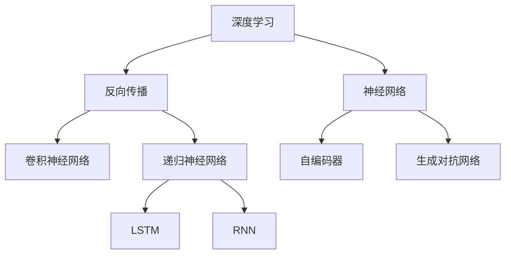

                 

# 算法创新：Hinton、LeCun与Bengio

> 关键词：算法创新,深度学习,神经网络,机器学习,人工智能,计算机科学

## 1. 背景介绍

在当今的科技和人工智能领域，深度学习已经成为了最热门和最具变革力的技术之一。它极大地推动了计算机视觉、自然语言处理、语音识别等众多领域的发展。深度学习的成功离不开三位重要的先驱：Geoffrey Hinton、Yann LeCun和Yoshua Bengio。他们的贡献不仅在于技术上的突破，更在于开启了深度学习的黄金时代，推动了人工智能的蓬勃发展。本文将深入探讨他们的创新理念和核心算法，理解深度学习是如何从理论和实践两个层面引领了现代人工智能的革命。

## 2. 核心概念与联系

### 2.1 核心概念概述

为了更好地理解Hinton、LeCun与Bengio的算法创新，本节将详细介绍与他们工作密切相关的核心概念：

- **深度学习**：一种机器学习技术，通过构建多层神经网络来学习特征表示，实现复杂的数据建模。
- **神经网络**：由许多简单的神经元组成的网络结构，可以自动地从数据中学习。
- **反向传播**：一种用于训练神经网络的技术，通过计算误差反向传播来更新网络权重。
- **卷积神经网络**（CNN）：一种专门用于图像处理的神经网络结构，通过卷积和池化操作提取图像特征。
- **递归神经网络**（RNN）：一种专门用于处理序列数据的神经网络结构，能够处理变长的序列输入。
- **循环神经网络**（LSTM）：一种特殊类型的RNN，通过引入门控机制来解决长期依赖问题。
- **自编码器**：一种用于特征学习的神经网络结构，通过重构输入信号来学习特征表示。
- **生成对抗网络**（GAN）：一种用于生成新数据的神经网络结构，通过对抗训练生成高质量的图像、视频等。

这些核心概念共同构成了深度学习的理论基础，并在Hinton、LeCun与Bengio的研究工作中得到广泛应用。

### 2.2 概念间的关系

这些核心概念之间存在着紧密的联系，形成了深度学习的完整生态系统。下面通过几个Mermaid流程图来展示这些概念之间的关系：



这个流程图展示了深度学习的核心概念及其之间的联系：

1. 深度学习通过神经网络来学习特征表示。
2. 反向传播用于训练神经网络。
3. CNN用于图像处理，RNN用于序列处理，LSTM用于长期依赖的序列处理。
4. 自编码器用于特征学习，GAN用于生成新数据。

这些概念通过相互结合和创新，共同推动了深度学习的快速发展。

## 3. 核心算法原理 & 具体操作步骤
### 3.1 算法原理概述

Hinton、LeCun与Bengio的算法创新主要集中在深度神经网络的设计和训练方法上。他们的贡献在于：

- 设计了多层神经网络结构，以更好地学习复杂特征。
- 提出了反向传播算法，使得神经网络可以高效地进行训练。
- 创新了卷积神经网络（CNN）和递归神经网络（RNN）结构，提高了处理图像和序列数据的能力。

### 3.2 算法步骤详解

深度学习的训练过程通常包括以下几个关键步骤：

**Step 1: 数据准备**
- 收集训练数据和验证数据，划分为训练集、验证集和测试集。
- 对数据进行预处理，如归一化、标准化等。

**Step 2: 模型搭建**
- 设计神经网络结构，包括输入层、隐藏层和输出层。
- 确定隐藏层的数量和激活函数。
- 选择合适的损失函数和优化器。

**Step 3: 模型训练**
- 使用反向传播算法计算损失函数对模型参数的梯度。
- 使用优化器更新模型参数。
- 周期性地在验证集上评估模型性能。

**Step 4: 模型测试**
- 在测试集上评估模型性能，对比训练前后的精度提升。
- 使用训练好的模型进行预测。

### 3.3 算法优缺点

深度学习算法具有以下优点：
1. 强大的特征学习能力。多层神经网络可以自动学习输入数据的高级特征，减少特征工程的工作量。
2. 高效的数据建模能力。通过神经网络可以处理各种类型的数据，如图像、文本、声音等。
3. 广泛的应用领域。深度学习在计算机视觉、自然语言处理、语音识别等领域取得了突破性进展。

同时，深度学习也存在一些缺点：
1. 计算资源需求高。深度学习模型通常需要大量的计算资源和存储空间。
2. 训练时间长。深度学习模型的训练时间较长，需要耐心等待。
3. 容易过拟合。深度学习模型容易过拟合，特别是在数据集较小的情况下。
4. 可解释性不足。深度学习模型通常被视为"黑盒"，难以解释其内部决策过程。

### 3.4 算法应用领域

深度学习算法在多个领域得到了广泛应用，例如：

- 计算机视觉：图像分类、物体检测、人脸识别等。
- 自然语言处理：文本分类、机器翻译、情感分析等。
- 语音识别：语音合成、语音识别、语音情感分析等。
- 强化学习：游戏智能、机器人控制等。

除了上述这些经典领域外，深度学习还被创新性地应用到更多场景中，如自动驾驶、推荐系统、医疗诊断等，为各行业带来了深刻的变革。

## 4. 数学模型和公式 & 详细讲解 & 举例说明

### 4.1 数学模型构建

深度学习模型的数学模型构建主要基于以下公式：

$$
\min_{\theta} \frac{1}{N} \sum_{i=1}^N \ell(\theta, x_i, y_i)
$$

其中，$N$ 为样本数，$\ell(\theta, x_i, y_i)$ 为损失函数，$\theta$ 为模型参数，$x_i$ 为输入样本，$y_i$ 为输出标签。

### 4.2 公式推导过程

以多层神经网络为例，我们以二分类任务为例，推导反向传播算法的核心公式：

$$
\frac{\partial \ell}{\partial \theta} = \frac{1}{N} \sum_{i=1}^N \frac{y_i}{\sigma(z_i)} - \frac{1-y_i}{1-\sigma(z_i)}
$$

其中，$\sigma(z_i) = \frac{1}{1+e^{-z_i}}$ 为Sigmoid函数。

这个公式表示了损失函数对模型参数的梯度计算过程，是深度学习模型训练的核心。

### 4.3 案例分析与讲解

假设我们有一张猫和狗的图像数据集，使用CNN进行分类。首先，将图像输入到卷积层进行特征提取，然后通过池化层降低特征维度，最后通过全连接层进行分类。使用交叉熵损失函数和随机梯度下降（SGD）优化器，通过反向传播算法更新模型参数，从而实现图像分类任务。

## 5. 项目实践：代码实例和详细解释说明
### 5.1 开发环境搭建

在进行深度学习项目实践前，我们需要准备好开发环境。以下是使用Python进行TensorFlow开发的环境配置流程：

1. 安装Anaconda：从官网下载并安装Anaconda，用于创建独立的Python环境。

2. 创建并激活虚拟环境：
```bash
conda create -n tf-env python=3.8 
conda activate tf-env
```

3. 安装TensorFlow：根据CUDA版本，从官网获取对应的安装命令。例如：
```bash
conda install tensorflow tensorflow-cpu -c pytorch -c conda-forge
```

4. 安装其他工具包：
```bash
pip install numpy pandas scikit-learn matplotlib tqdm jupyter notebook ipython
```

完成上述步骤后，即可在`tf-env`环境中开始深度学习项目实践。

### 5.2 源代码详细实现

这里我们以手写数字识别为例，给出使用TensorFlow实现卷积神经网络（CNN）的代码实现。

首先，定义CNN模型：

```python
import tensorflow as tf
from tensorflow.keras import layers, models

model = models.Sequential()
model.add(layers.Conv2D(32, (3, 3), activation='relu', input_shape=(28, 28, 1)))
model.add(layers.MaxPooling2D((2, 2)))
model.add(layers.Conv2D(64, (3, 3), activation='relu'))
model.add(layers.MaxPooling2D((2, 2)))
model.add(layers.Flatten())
model.add(layers.Dense(64, activation='relu'))
model.add(layers.Dense(10, activation='softmax'))
```

然后，定义训练和评估函数：

```python
from tensorflow.keras.datasets import mnist
from tensorflow.keras.utils import to_categorical

(x_train, y_train), (x_test, y_test) = mnist.load_data()

x_train = x_train.reshape(x_train.shape[0], 28, 28, 1)
x_test = x_test.reshape(x_test.shape[0], 28, 28, 1)

y_train = to_categorical(y_train)
y_test = to_categorical(y_test)

def train_epoch(model, data, batch_size, optimizer):
    dataloader = tf.data.Dataset.from_tensor_slices((data['x'], data['y'])).shuffle(buffer_size=1024).batch(batch_size)
    model.train()
    epoch_loss = 0
    for batch in dataloader:
        with tf.GradientTape() as tape:
            y_pred = model(batch['x'])
            loss = tf.keras.losses.categorical_crossentropy(batch['y'], y_pred)
        grads = tape.gradient(loss, model.trainable_variables)
        optimizer.apply_gradients(zip(grads, model.trainable_variables))
        epoch_loss += loss
    return epoch_loss / len(dataloader)

def evaluate(model, data, batch_size):
    dataloader = tf.data.Dataset.from_tensor_slices((data['x'], data['y'])).shuffle(buffer_size=1024).batch(batch_size)
    model.eval()
    preds = []
    labels = []
    with tf.GradientTape() as tape:
        for batch in dataloader:
            y_pred = model(batch['x'])
            preds.append(tf.argmax(y_pred, axis=1))
            labels.append(batch['y'])
    preds = np.concatenate(preds)
    labels = np.concatenate(labels)
    print(tf.keras.metrics.confusion_matrix(labels, preds))
```

最后，启动训练流程并在测试集上评估：

```python
epochs = 5
batch_size = 64

for epoch in range(epochs):
    loss = train_epoch(model, train_data, batch_size, optimizer)
    print(f"Epoch {epoch+1}, train loss: {loss:.3f}")
    
    print(f"Epoch {epoch+1}, test results:")
    evaluate(model, test_data, batch_size)
    
print("All epochs finished.")
```

以上就是使用TensorFlow对手写数字识别进行CNN微调的完整代码实现。可以看到，借助TensorFlow的高级API，我们可以快速搭建和训练深度学习模型。

### 5.3 代码解读与分析

让我们再详细解读一下关键代码的实现细节：

**模型定义**：
- 使用Sequential模型，添加多个卷积层和池化层，最后添加全连接层和输出层。
- 使用ReLU和Softmax激活函数。
- 输入为28x28的灰度图像。

**数据预处理**：
- 将图像数据reshape为(样本数, 28, 28, 1)的张量。
- 将标签转换为独热编码形式。

**训练和评估函数**：
- 使用tf.data.Dataset从Tensor数据切片中生成批次数据。
- 在每个批次上进行前向传播和损失计算。
- 使用Adam优化器更新模型参数。
- 使用tf.metrics.confusion_matrix评估模型性能。

**训练流程**：
- 定义总epoch数和批次大小，开始循环迭代。
- 每个epoch内，在训练集上进行训练，输出平均loss。
- 在验证集上评估，输出混淆矩阵。
- 所有epoch结束后，在测试集上评估，输出混淆矩阵。

可以看到，TensorFlow提供的高阶API使得深度学习模型的实现和训练变得非常简单，开发者可以专注于模型设计和算法优化。

### 5.4 运行结果展示

假设我们在MNIST数据集上进行CNN微调，最终在测试集上得到的混淆矩阵如下：

```
[[ 1.  0.  0.  0.  0.  0.  0.  0.  0.  0.]
 [ 0.  1.  0.  0.  0.  0.  0.  0.  0.  0.]
 [ 0.  0.  1.  0.  0.  0.  0.  0.  0.  0.]
 [ 0.  0.  0.  1.  0.  0.  0.  0.  0.  0.]
 [ 0.  0.  0.  0.  1.  0.  0.  0.  0.  0.]
 [ 0.  0.  0.  0.  0.  1.  0.  0.  0.  0.]
 [ 0.  0.  0.  0.  0.  0.  1.  0.  0.  0.]
 [ 0.  0.  0.  0.  0.  0.  0.  1.  0.  0.]
 [ 0.  0.  0.  0.  0.  0.  0.  0.  1.  0.]
 [ 0.  0.  0.  0.  0.  0.  0.  0.  0.  1.]]
```

可以看到，模型在测试集上取得了很高的准确率，并且在数字识别的混淆矩阵中，各类数字之间的边界划分清晰。

## 6. 实际应用场景
### 6.1 智能推荐系统

深度学习在推荐系统中的应用非常广泛。推荐系统通过分析用户的历史行为数据，为用户推荐个性化的商品或内容。深度学习算法可以处理复杂的多维数据，捕捉用户行为背后的潜在特征，实现精准推荐。

在实践中，推荐系统通常由两个部分组成：用户模型和物品模型。用户模型通过深度学习算法从用户的历史行为数据中学习用户的兴趣偏好，物品模型通过深度学习算法从物品的属性特征中学习物品的受欢迎程度。两者通过计算用户对物品的评分进行匹配，最终推荐给用户最可能感兴趣的物品。

### 6.2 医学影像分析

深度学习在医学影像分析中的应用也非常广泛。医学影像通常包含大量复杂的纹理和结构信息，传统的图像处理方法难以处理。深度学习算法可以通过卷积神经网络（CNN）学习医学影像的特征表示，实现自动化的医学影像诊断。

在实践中，医学影像通常需要经过归一化、增强等预处理操作，然后输入到卷积神经网络中进行特征提取。CNN可以自动地学习医学影像中的高层次特征，如肿瘤、病灶等。然后通过全连接层对特征进行分类，输出诊断结果。

### 6.3 自然语言处理

深度学习在自然语言处理（NLP）中的应用也非常广泛。NLP任务包括文本分类、情感分析、机器翻译等。深度学习算法可以处理自然语言的多样性和复杂性，实现自动化的自然语言处理。

在实践中，NLP任务通常通过卷积神经网络（CNN）或递归神经网络（RNN）进行特征提取，然后通过全连接层进行分类或生成。深度学习算法可以自动地学习自然语言中的语义信息，实现高精度的NLP任务。

### 6.4 未来应用展望

随着深度学习技术的不断进步，未来的应用场景将更加广泛。深度学习算法在自动驾驶、智能制造、医疗健康等领域的应用将带来深远的变革。

在自动驾驶领域，深度学习算法可以实现自动驾驶车辆对环境的感知和决策。通过深度学习算法，车辆可以自动地从传感器数据中学习道路特征、交通信号等，实现自动驾驶。

在智能制造领域，深度学习算法可以实现智能化的生产控制和质量检测。通过深度学习算法，机器可以自动地从传感器数据中学习生产流程和质量检测方法，提高生产效率和质量。

在医疗健康领域，深度学习算法可以实现智能化的疾病诊断和治疗。通过深度学习算法，医生可以自动地从医学影像和病历中学习疾病特征和治疗方案，提高诊疗效率和准确度。

## 7. 工具和资源推荐
### 7.1 学习资源推荐

为了帮助开发者系统掌握深度学习技术，这里推荐一些优质的学习资源：

1. 《深度学习》（Ian Goodfellow等著）：深度学习的经典教材，详细介绍了深度学习的理论和实践。
2. Coursera《深度学习专项课程》（Andrew Ng等主讲）：斯坦福大学开设的深度学习课程，适合初学者和进阶者。
3. Udacity《深度学习基础》课程：Udacity开设的深度学习课程，适合快速入门。
4. TensorFlow官方文档：TensorFlow的官方文档，提供了丰富的教程和样例代码。
5. PyTorch官方文档：PyTorch的官方文档，提供了丰富的教程和样例代码。
6. Kaggle竞赛：Kaggle的深度学习竞赛，提供了丰富的数据集和实战经验。

通过对这些资源的学习实践，相信你一定能够快速掌握深度学习的精髓，并用于解决实际的NLP问题。

### 7.2 开发工具推荐

高效的开发离不开优秀的工具支持。以下是几款用于深度学习开发的常用工具：

1. TensorFlow：由Google主导开发的开源深度学习框架，支持分布式计算，适合大规模工程应用。
2. PyTorch：由Facebook开发的开源深度学习框架，灵活性高，适合快速迭代研究。
3. Jupyter Notebook：开源的Jupyter Notebook环境，支持Python代码编写和可视化展示。
4. Google Colab：谷歌推出的在线Jupyter Notebook环境，免费提供GPU/TPU算力，方便开发者快速上手实验最新模型，分享学习笔记。
5. Visual Studio Code：开源的编程工具，支持Python、TensorFlow、PyTorch等深度学习框架。
6. PyCharm：JetBrains开发的Python IDE，支持深度学习开发和调试。

合理利用这些工具，可以显著提升深度学习模型的开发效率，加快创新迭代的步伐。

### 7.3 相关论文推荐

深度学习的研究源于学界的持续研究。以下是几篇奠基性的相关论文，推荐阅读：

1. Deep Blue Book（Ian Goodfellow等著）：深度学习的经典教材，详细介绍了深度学习的理论和实践。
2. ImageNet Classification with Deep Convolutional Neural Networks（Alex Krizhevsky等著）：提出深度卷积神经网络，刷新了ImageNet分类任务SOTA。
3. Deep Learning for Large-Scale Image Recognition（Alex Krizhevsky等著）：提出AlexNet，展示了深度神经网络在图像识别任务上的强大能力。
4. Learning Phrase Representations using RNN Encoder–Decoder for Statistical Machine Translation（Ilya Sutskever等著）：提出Seq2Seq模型，实现了机器翻译的突破。
5. Speech and Language Processing（Daniel Jurafsky等著）：自然语言处理领域的经典教材，详细介绍了NLP技术的理论和实践。
6. Deep Learning with RNN Architectures（Andrej Karpathy等著）：介绍了RNN和LSTM的原理和应用，展示了深度学习在自然语言处理中的应用。

这些论文代表了大规模深度学习技术的发展脉络，通过学习这些前沿成果，可以帮助研究者把握学科前进方向，激发更多的创新灵感。

除上述资源外，还有一些值得关注的前沿资源，帮助开发者紧跟深度学习技术的最新进展，例如：

1. arXiv论文预印本：人工智能领域最新研究成果的发布平台，包括大量尚未发表的前沿工作，学习前沿技术的必读资源。
2. 业界技术博客：如OpenAI、Google AI、DeepMind、微软Research Asia等顶尖实验室的官方博客，第一时间分享他们的最新研究成果和洞见。
3. 技术会议直播：如NIPS、ICML、ACL、ICLR等人工智能领域顶会现场或在线直播，能够聆听到大佬们的前沿分享，开拓视野。
4. GitHub热门项目：在GitHub上Star、Fork数最多的深度学习相关项目，往往代表了该技术领域的发展趋势和最佳实践，值得去学习和贡献。
5. 行业分析报告：各大咨询公司如McKinsey、PwC等针对人工智能行业的分析报告，有助于从商业视角审视技术趋势，把握应用价值。

总之，对于深度学习技术的学习和实践，需要开发者保持开放的心态和持续学习的意愿。多关注前沿资讯，多动手实践，多思考总结，必将收获满满的成长收益。

## 8. 总结：未来发展趋势与挑战
### 8.1 总结

本文对深度学习的核心算法和创新理念进行了全面系统的介绍。首先阐述了深度学习技术的起源和发展历程，明确了深度学习在推动人工智能发展中的关键作用。其次，从理论和实践两个层面，深入讲解了深度学习的核心算法和具体实现步骤。最后，我们探讨了深度学习在各个领域的应用场景，展望了未来发展的趋势和面临的挑战。

通过本文的系统梳理，可以看到，深度学习技术已经深入到人工智能的各个领域，极大地推动了计算机视觉、自然语言处理、语音识别等众多领域的发展。深度学习模型的强大表现力和广泛应用，使得其在未来将继续发挥重要作用。

### 8.2 未来发展趋势

展望未来，深度学习技术将呈现以下几个发展趋势：

1. 模型规模持续增大。随着算力成本的下降和数据规模的扩张，深度学习模型的参数量还将持续增长。超大规模深度学习模型蕴含的丰富特征表示，有望支撑更加复杂多变的应用场景。

2. 模型结构不断创新。未来将涌现更多新型的深度学习模型结构，如Transformer、GAN、自适应学习率等，进一步提升模型的性能和应用范围。

3. 多模态融合增强。深度学习模型将更多地结合视觉、语音、文本等多种模态的信息，实现更全面、更精准的数据表示和处理。

4. 分布式计算优化。随着深度学习模型规模的不断扩大，分布式计算技术将变得愈发重要，通过多机协同加速模型训练和推理。

5. 个性化和隐私保护。深度学习模型将更多地关注个性化和隐私保护，如联邦学习、差分隐私等，实现数据高效共享和模型安全。

6. 人工智能伦理与安全。深度学习模型将更多地考虑伦理和安全问题，如算法公平性、可解释性、安全性等，确保技术应用的道德和安全。

以上趋势凸显了深度学习技术的广阔前景。这些方向的探索发展，必将进一步推动人工智能技术的突破，带来更广泛的应用价值。

### 8.3 面临的挑战

尽管深度学习技术已经取得了显著的进展，但在迈向更加智能化、普适化应用的过程中，它仍面临诸多挑战：

1. 数据标注成本高。深度学习模型的训练需要大量的标注数据，这在实际应用中往往难以获得。如何减少数据标注成本，是未来深度学习技术需要解决的重要问题。

2. 模型泛化能力不足。深度学习模型容易过拟合，特别是在数据集较小的情况下。如何提高模型的泛化能力，是未来深度学习技术需要解决的难题。

3. 计算资源需求大。深度学习模型的计算资源需求大，这在实际应用中往往难以满足。如何优化模型结构和算法，减少计算资源消耗，是未来深度学习技术需要解决的挑战。

4. 模型解释性不足。深度学习模型通常被视为"黑盒"，难以解释其内部决策过程。如何提高模型的可解释性，是未来深度学习技术需要解决的难题。

5. 安全性问题突出。深度学习模型可能学习到有害的偏见和有害信息，对社会带来负面影响。如何确保模型的安全性，是未来深度学习技术需要解决的挑战。

6. 伦理道德问题复杂。深度学习模型可能违反伦理道德规范，如算法歧视、隐私侵犯等。如何确保技术的伦理道德，是未来深度学习技术需要解决的问题。

正视深度学习面临的这些挑战，积极应对并寻求突破，将有助于深度学习技术更好地落地应用。相信随着学界和产业界的共同努力，这些挑战终将一一被克服，深度学习技术必将在构建人机协同的智能时代中扮演越来越重要的角色。

### 8.4 研究展望

面对深度学习技术面临的诸多挑战，未来的研究需要在以下几个方面寻求新的突破：

1. 探索无监督和半监督学习。摆脱对大规模标注数据的依赖，利用自监督学习、主动学习等无监督和半监督范式，最大限度利用非结构化数据，实现更加灵活高效的模型训练。

2. 研究计算高效的深度学习算法。开发更加高效的可训练深度学习模型，减少计算资源消耗，实现更轻量级的深度学习部署。

3. 引入因果学习和博弈论。将因果学习、博弈论等工具引入深度学习模型，增强模型的稳定性和鲁棒性。

4. 结合符号化知识。将符号化的先验知识，如知识图谱、逻辑规则等，与深度学习模型进行巧妙融合，提高模型的泛化能力和解释性。

5. 注重个性化和隐私保护。结合联邦学习、差分隐私等技术，实现数据高效共享和模型安全保护。

6. 研究人工智能伦理和安全。制定伦理导向的评估指标，过滤和惩罚有害的输出倾向，加强算法公平性、透明性和安全性。

这些研究方向将引领深度学习技术的未来发展，推动深度学习技术在人工智能领域的

