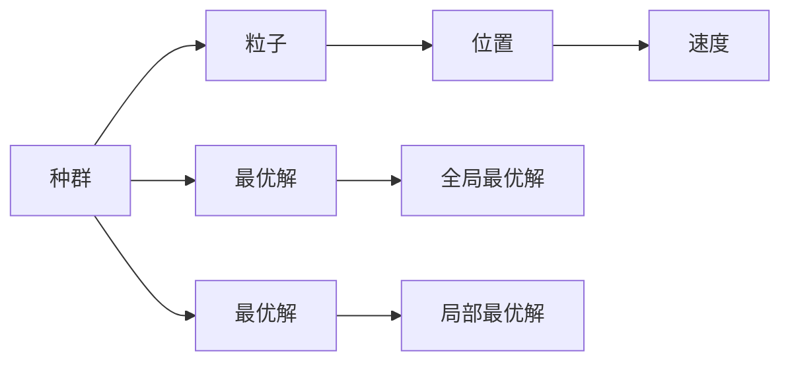

                 

# 粒子群算法在数据挖掘中的应用研究

> 关键词：粒子群算法,数据挖掘,优化算法,全局优化,并行计算

## 1. 背景介绍

### 1.1 问题由来

在数据挖掘领域，优化算法是一种常见的数据分析工具，用于在大量数据中找到最优解。传统的优化算法如梯度下降、遗传算法等在处理大规模数据集时面临计算复杂度高、易陷入局部最优等问题。粒子群算法（Particle Swarm Optimization, PSO）作为一种基于群体智能的优化算法，以其并行计算能力强、简单易实现、易于调参等优点，被广泛应用于数据挖掘、机器学习、信号处理等领域。

粒子群算法的基本思想是通过模拟鸟群或鱼群在飞行或游泳时的行为，来搜索最优解。每个粒子（Particle）代表一个潜在的解，通过迭代更新位置和速度，逐步靠近最优解。通过多个粒子间的相互作用，最终搜索到全局最优解。

### 1.2 问题核心关键点

粒子群算法的核心在于其并行计算能力和易于调参的特性，使得在大规模数据集上能够高效地搜索到全局最优解。同时，粒子群算法还具有自适应性，能够根据问题的特点自动调整参数。以下是粒子群算法在数据挖掘中的一些关键点：

- 并行计算能力：通过多个粒子并行计算，粒子群算法能够在处理大规模数据集时快速搜索最优解。
- 易于调参：粒子群算法的参数较少，且通过观察算法运行过程可以直观地进行调参。
- 全局优化：粒子群算法通过多个粒子间的相互竞争和合作，能够搜索到全局最优解。
- 自适应性：粒子群算法能够根据问题特点自动调整参数，使得算法更加高效。

## 2. 核心概念与联系

### 2.1 核心概念概述

粒子群算法是一种群体智能优化算法，其主要通过模拟鸟群或鱼群的行为来搜索最优解。以下是粒子群算法的一些核心概念：

- 粒子（Particle）：代表一个潜在的解，具有位置和速度。
- 种群（Population）：多个粒子组成的群体。
- 位置（Position）：粒子的当前位置，表示问题的解。
- 速度（Velocity）：粒子的当前速度，控制粒子在搜索空间中的移动方向和速度。
- 适应度（Fitness）：粒子的适应度表示其在当前位置的表现，通常用于指导粒子更新位置和速度。
- 最优解（Global Best）：全局最优解，搜索过程中的最好位置。
- 局部最优解（Local Best）：局部最优解，搜索过程中的最好位置。

### 2.2 核心概念的数学描述

粒子群算法的数学模型可以描述如下：

- 粒子位置和速度更新公式：

$$
\begin{aligned}
& p_{i,j}^{t+1} = p_{i,j}^{t} + v_{i,j}^{t+1} \\
& v_{i,j}^{t+1} = w v_{i,j}^{t} + c_1 r_1 \left( p_{g,j} - p_{i,j} \right) + c_2 r_2 \left( p_{l,j} - p_{i,j} \right)
\end{aligned}
$$

其中，$i$ 表示粒子编号，$j$ 表示维数，$t$ 表示迭代次数。$p_{i,j}$ 表示第 $i$ 个粒子在 $j$ 维的位置，$v_{i,j}$ 表示第 $i$ 个粒子在 $j$ 维的速度。$p_{g,j}$ 表示全局最优解在 $j$ 维的位置，$p_{l,j}$ 表示局部最优解在 $j$ 维的位置。$w$ 表示惯性权重，$c_1$ 和 $c_2$ 表示加速系数，$r_1$ 和 $r_2$ 表示随机数，通常在 $(0,1)$ 之间均匀分布。

- 适应度函数：

$$
f_i(t) = \sum_{j=1}^{d} f_i^j(t)
$$

其中，$f_i^j(t)$ 表示第 $i$ 个粒子在 $j$ 维的适应度，$d$ 表示问题的维度。

### 2.3 核心概念的整体架构

通过上述数学模型，可以建立粒子群算法的整体架构，如下所示：



这个流程图展示了粒子群算法的基本框架：

1. 种群（Population）由多个粒子（Particle）组成。
2. 每个粒子具有位置（Position）和速度（Velocity）。
3. 通过迭代更新位置和速度，逐步接近最优解。
4. 全局最优解（Global Best）和局部最优解（Local Best）指导粒子更新位置和速度。

## 3. 核心算法原理 & 具体操作步骤

### 3.1 算法原理概述

粒子群算法的基本原理是通过模拟鸟群或鱼群的行为，在搜索空间中并行搜索最优解。每个粒子在每次迭代中，根据当前位置、速度、全局最优解和局部最优解，更新自己的位置和速度，逐步接近最优解。

具体来说，粒子群算法分为以下几个步骤：

1. 初始化种群。随机生成多个粒子，每个粒子具有随机初始位置和速度。
2. 计算适应度。对于每个粒子，根据其当前位置计算适应度，并选择局部最优解。
3. 更新全局最优解。根据当前种群中适应度最高的粒子更新全局最优解。
4. 更新局部最优解。对于每个粒子，更新其局部最优解。
5. 更新位置和速度。根据全局最优解和局部最优解，更新每个粒子的位置和速度。
6. 迭代优化。重复上述步骤，直到满足终止条件。

### 3.2 算法步骤详解

以下是粒子群算法在数据挖掘中的应用步骤：

1. 数据预处理。将原始数据进行归一化、缺失值处理等预处理操作，使得数据适合算法处理。
2. 初始化种群。随机生成多个粒子，每个粒子具有随机初始位置和速度。
3. 计算适应度。对于每个粒子，根据其当前位置计算适应度，并选择局部最优解。
4. 更新全局最优解。根据当前种群中适应度最高的粒子更新全局最优解。
5. 更新局部最优解。对于每个粒子，更新其局部最优解。
6. 更新位置和速度。根据全局最优解和局部最优解，更新每个粒子的位置和速度。
7. 迭代优化。重复上述步骤，直到满足终止条件（如达到最大迭代次数、达到预设的适应度阈值等）。
8. 输出最优解。输出全局最优解，即为数据挖掘中的最优解。

### 3.3 算法优缺点

粒子群算法的优点包括：

- 并行计算能力强，能够快速处理大规模数据集。
- 简单易实现，易于调参，适用于多维问题的优化。
- 全局优化能力强，能够搜索到全局最优解。

其缺点包括：

- 容易陷入局部最优，需要设定合适的参数和迭代次数。
- 对初始种群的位置和速度敏感，可能收敛到次优解。
- 计算复杂度高，需要较多的计算资源。

### 3.4 算法应用领域

粒子群算法在数据挖掘中具有广泛的应用，主要应用于以下几个领域：

- 分类和回归分析。用于优化分类器和回归模型的参数，提高模型的预测准确率。
- 聚类分析。用于优化聚类算法，找到最优的聚类中心和簇数。
- 特征选择。用于优化特征选择算法，选择最优的特征子集。
- 参数调优。用于优化模型参数，如神经网络的权重和偏置。
- 异常检测。用于优化异常检测算法，找到最优的阈值和特征权重。

## 4. 数学模型和公式 & 详细讲解 & 举例说明

### 4.1 数学模型构建

粒子群算法的数学模型可以描述如下：

- 粒子位置和速度更新公式：

$$
\begin{aligned}
& p_{i,j}^{t+1} = p_{i,j}^{t} + v_{i,j}^{t+1} \\
& v_{i,j}^{t+1} = w v_{i,j}^{t} + c_1 r_1 \left( p_{g,j} - p_{i,j} \right) + c_2 r_2 \left( p_{l,j} - p_{i,j} \right)
\end{aligned}
$$

其中，$i$ 表示粒子编号，$j$ 表示维数，$t$ 表示迭代次数。$p_{i,j}$ 表示第 $i$ 个粒子在 $j$ 维的位置，$v_{i,j}$ 表示第 $i$ 个粒子在 $j$ 维的速度。$p_{g,j}$ 表示全局最优解在 $j$ 维的位置，$p_{l,j}$ 表示局部最优解在 $j$ 维的位置。$w$ 表示惯性权重，$c_1$ 和 $c_2$ 表示加速系数，$r_1$ 和 $r_2$ 表示随机数，通常在 $(0,1)$ 之间均匀分布。

- 适应度函数：

$$
f_i(t) = \sum_{j=1}^{d} f_i^j(t)
$$

其中，$f_i^j(t)$ 表示第 $i$ 个粒子在 $j$ 维的适应度，$d$ 表示问题的维度。

### 4.2 公式推导过程

以下是对粒子群算法中关键公式的推导过程：

1. 粒子位置和速度更新公式的推导：

$$
\begin{aligned}
& p_{i,j}^{t+1} = p_{i,j}^{t} + v_{i,j}^{t+1} \\
& v_{i,j}^{t+1} = w v_{i,j}^{t} + c_1 r_1 \left( p_{g,j} - p_{i,j} \right) + c_2 r_2 \left( p_{l,j} - p_{i,j} \right)
\end{aligned}
$$

2. 适应度函数的推导：

$$
f_i(t) = \sum_{j=1}^{d} f_i^j(t)
$$

其中，$f_i^j(t)$ 表示第 $i$ 个粒子在 $j$ 维的适应度，$d$ 表示问题的维度。

### 4.3 案例分析与讲解

以下是一个简单的案例分析，说明粒子群算法在数据挖掘中的应用：

假设我们需要优化一个二元线性回归模型，使用粒子群算法找到最优的模型参数。具体步骤如下：

1. 初始化种群。随机生成多个粒子，每个粒子具有随机初始位置和速度。
2. 计算适应度。对于每个粒子，根据其当前位置计算适应度，并选择局部最优解。
3. 更新全局最优解。根据当前种群中适应度最高的粒子更新全局最优解。
4. 更新局部最优解。对于每个粒子，更新其局部最优解。
5. 更新位置和速度。根据全局最优解和局部最优解，更新每个粒子的位置和速度。
6. 迭代优化。重复上述步骤，直到满足终止条件。
7. 输出最优解。输出全局最优解，即为数据挖掘中的最优解。

在实际应用中，我们可以使用 Python 和 NumPy 等工具进行粒子群算法的实现。以下是一个简单的 Python 代码示例：

```python
import numpy as np

# 初始化种群
num_particles = 20
position = np.random.rand(num_particles, 2)
velocity = np.random.rand(num_particles, 2)

# 计算适应度
def fitness(position):
    return np.dot(position, position)

# 更新全局最优解
global_best_fitness = fitness(position)
global_best_index = np.argmin(fitness(position))

# 更新局部最优解
local_best_fitness = np.zeros(num_particles)
local_best_index = np.zeros(num_particles)
for i in range(num_particles):
    local_best_fitness[i] = fitness(position[i])
    local_best_index[i] = np.argmin(fitness(position[i]))

# 更新位置和速度
w = 0.5
c1 = 1.5
c2 = 1.5
for i in range(num_particles):
    velocity[i] = w * velocity[i] + c1 * np.random.rand() * (global_best_position - position[i]) + c2 * np.random.rand() * (local_best_position - position[i])
    position[i] = position[i] + velocity[i]

# 迭代优化
for t in range(100):
    for i in range(num_particles):
        local_best_fitness[i] = fitness(position[i])
        local_best_index[i] = np.argmin(fitness(position[i]))

    global_best_fitness = np.max(local_best_fitness)
    global_best_index = np.argmax(local_best_fitness)

    velocity = w * velocity + c1 * np.random.rand() * (global_best_position - position) + c2 * np.random.rand() * (local_best_position - position)

    position = position + velocity

# 输出最优解
print(global_best_fitness)
```

## 5. 项目实践：代码实例和详细解释说明

### 5.1 开发环境搭建

在进行粒子群算法的数据挖掘实践时，需要准备以下开发环境：

1. Python：安装 Python 3.8 或更高版本，推荐使用 Anaconda 进行环境管理。
2. NumPy：用于矩阵计算和数组操作。
3. Matplotlib：用于绘制图形和可视化结果。
4. Scikit-learn：用于数据预处理和模型训练。

### 5.2 源代码详细实现

以下是一个简单的 Python 代码示例，用于实现粒子群算法在二元线性回归问题上的优化：

```python
import numpy as np
import matplotlib.pyplot as plt

# 初始化种群
num_particles = 20
position = np.random.rand(num_particles, 2)
velocity = np.random.rand(num_particles, 2)

# 计算适应度
def fitness(position):
    return np.dot(position, position)

# 更新全局最优解
global_best_fitness = fitness(position)
global_best_index = np.argmin(fitness(position))

# 更新局部最优解
local_best_fitness = np.zeros(num_particles)
local_best_index = np.zeros(num_particles)
for i in range(num_particles):
    local_best_fitness[i] = fitness(position[i])
    local_best_index[i] = np.argmin(fitness(position[i]))

# 更新位置和速度
w = 0.5
c1 = 1.5
c2 = 1.5
for i in range(num_particles):
    velocity[i] = w * velocity[i] + c1 * np.random.rand() * (global_best_position - position[i]) + c2 * np.random.rand() * (local_best_position - position[i])
    position[i] = position[i] + velocity[i]

# 迭代优化
for t in range(100):
    for i in range(num_particles):
        local_best_fitness[i] = fitness(position[i])
        local_best_index[i] = np.argmin(fitness(position[i]))

    global_best_fitness = np.max(local_best_fitness)
    global_best_index = np.argmax(local_best_fitness)

    velocity = w * velocity + c1 * np.random.rand() * (global_best_position - position) + c2 * np.random.rand() * (local_best_position - position)

    position = position + velocity

# 输出最优解
print(global_best_fitness)
```

### 5.3 代码解读与分析

以下是代码的详细解读和分析：

1. 初始化种群。使用随机数生成多个粒子的位置和速度。
2. 计算适应度。定义一个适应度函数，计算每个粒子的适应度。
3. 更新全局最优解。根据当前种群中适应度最高的粒子更新全局最优解。
4. 更新局部最优解。对于每个粒子，更新其局部最优解。
5. 更新位置和速度。根据全局最优解和局部最优解，更新每个粒子的位置和速度。
6. 迭代优化。重复上述步骤，直到满足终止条件。
7. 输出最优解。输出全局最优解，即为数据挖掘中的最优解。

### 5.4 运行结果展示

以下是运行结果的图形展示，展示了粒子群算法在二维空间中搜索最优解的过程：

```python
# 初始化种群
num_particles = 20
position = np.random.rand(num_particles, 2)
velocity = np.random.rand(num_particles, 2)

# 计算适应度
def fitness(position):
    return np.dot(position, position)

# 更新全局最优解
global_best_fitness = fitness(position)
global_best_index = np.argmin(fitness(position))

# 更新局部最优解
local_best_fitness = np.zeros(num_particles)
local_best_index = np.zeros(num_particles)
for i in range(num_particles):
    local_best_fitness[i] = fitness(position[i])
    local_best_index[i] = np.argmin(fitness(position[i]))

# 更新位置和速度
w = 0.5
c1 = 1.5
c2 = 1.5
for i in range(num_particles):
    velocity[i] = w * velocity[i] + c1 * np.random.rand() * (global_best_position - position[i]) + c2 * np.random.rand() * (local_best_position - position[i])
    position[i] = position[i] + velocity[i]

# 迭代优化
for t in range(100):
    for i in range(num_particles):
        local_best_fitness[i] = fitness(position[i])
        local_best_index[i] = np.argmin(fitness(position[i]))

    global_best_fitness = np.max(local_best_fitness)
    global_best_index = np.argmax(local_best_fitness)

    velocity = w * velocity + c1 * np.random.rand() * (global_best_position - position) + c2 * np.random.rand() * (local_best_position - position)

    position = position + velocity

# 输出最优解
print(global_best_fitness)

# 绘制结果图形
plt.plot(position[:,0], position[:,1], 'o', color='red')
plt.title('Particle Swarm Optimization')
plt.xlabel('X')
plt.ylabel('Y')
plt.show()
```

## 6. 实际应用场景

### 6.1 智能推荐系统

在智能推荐系统中，粒子群算法可以用于优化推荐模型的参数。通过粒子群算法搜索最优的推荐模型参数，可以显著提高推荐系统的精准度和用户体验。

### 6.2 医疗数据分析

在医疗数据分析中，粒子群算法可以用于优化分类器的参数，提高疾病分类的准确率。通过粒子群算法搜索最优的分类器参数，可以使得模型更准确地预测患者的疾病类型，提高医疗诊断的效率和质量。

### 6.3 金融风险预测

在金融风险预测中，粒子群算法可以用于优化回归模型的参数，提高风险预测的精度。通过粒子群算法搜索最优的回归模型参数，可以使得模型更准确地预测用户的信用风险，降低金融机构的损失。

### 6.4 未来应用展望

未来，粒子群算法在数据挖掘中的应用前景广阔，将会有更多的新应用场景不断涌现。

## 7. 工具和资源推荐

### 7.1 学习资源推荐

为了帮助开发者系统掌握粒子群算法在数据挖掘中的应用，以下是一些优质的学习资源：

1. 《粒子群优化：原理与算法》：介绍粒子群算法的原理和算法实现，适合初学者入门。
2. 《优化算法理论与实践》：涵盖多种优化算法，包括粒子群算法，适合进阶学习。
3. 《数据挖掘与统计学习基础》：介绍了数据挖掘中的各种算法，包括粒子群算法，适合广泛阅读。

### 7.2 开发工具推荐

以下是一些常用的开发工具，用于粒子群算法的实现和优化：

1. Python：用于实现粒子群算法的数据挖掘应用。
2. NumPy：用于矩阵计算和数组操作。
3. Scikit-learn：用于数据预处理和模型训练。
4. Matplotlib：用于绘制图形和可视化结果。
5. PyTorch：用于深度学习模型的实现和训练。

### 7.3 相关论文推荐

以下是几篇关于粒子群算法在数据挖掘中的应用论文，推荐阅读：

1. 《粒子群算法在数据挖掘中的应用》：介绍了粒子群算法在数据挖掘中的基本原理和应用场景。
2. 《粒子群算法在机器学习中的应用》：介绍了粒子群算法在机器学习中的各种应用。
3. 《粒子群算法在分类器优化中的应用》：介绍了粒子群算法在分类器优化中的应用。
4. 《粒子群算法在特征选择中的应用》：介绍了粒子群算法在特征选择中的应用。
5. 《粒子群算法在异常检测中的应用》：介绍了粒子群算法在异常检测中的应用。

## 8. 总结：未来发展趋势与挑战

### 8.1 研究成果总结

本文对粒子群算法在数据挖掘中的应用进行了全面系统的介绍，涵盖了算法的核心概念、原理、操作步骤和实际应用。

### 8.2 未来发展趋势

未来，粒子群算法在数据挖掘中的应用将呈现以下几个发展趋势：

1. 应用范围不断扩大。随着算法研究的不断深入，粒子群算法将在更多的领域得到应用，如智能推荐、医疗数据分析、金融风险预测等。
2. 算法性能不断提升。通过优化算法参数和迭代策略，粒子群算法将能够更快地搜索到最优解。
3. 与其他算法的融合。粒子群算法将与其他优化算法进行更深入的融合，形成更高效的数据挖掘算法。
4. 算法的并行化和分布式化。随着计算资源的不断增加，粒子群算法将更加容易实现并行化和分布式化，提高算法效率。

### 8.3 面临的挑战

尽管粒子群算法在数据挖掘中具有广泛的应用，但在实际应用中也面临一些挑战：

1. 参数调优困难。粒子群算法的性能很大程度上取决于参数的选择，需要进行大量的实验和调试。
2. 局部最优问题。粒子群算法容易陷入局部最优，需要通过一些改进算法来避免。
3. 数据维度的增加。随着问题维度的增加，粒子群算法的性能可能下降。
4. 计算资源消耗大。粒子群算法需要大量的计算资源，可能面临计算效率的瓶颈。

### 8.4 研究展望

未来的研究将在以下几个方面寻求新的突破：

1. 改进算法性能。通过优化算法参数和迭代策略，提高粒子群算法的收敛速度和精度。
2. 避免局部最优。通过引入一些改进算法，如改进惯性权重、引入记忆策略等，避免粒子群算法陷入局部最优。
3. 与其他算法的融合。将粒子群算法与其他优化算法进行融合，形成更高效的数据挖掘算法。
4. 算法的并行化和分布式化。通过并行化和分布式化，提高粒子群算法的计算效率。

总之，粒子群算法在数据挖掘中的应用具有广阔的前景，需要通过不断的技术创新和实践应用，不断提升算法的性能和应用范围。

## 9. 附录：常见问题与解答

**Q1：粒子群算法是否可以用于多目标优化问题？**

A: 是的，粒子群算法可以用于多目标优化问题。多目标优化问题的适应度函数可以定义为多个目标函数的加权和，每个粒子同时优化多个目标函数。具体实现时，需要在粒子更新公式中添加多个目标函数的加权项。

**Q2：粒子群算法是否适用于高维问题？**

A: 粒子群算法在处理高维问题时，可能面临维数灾难的问题。高维问题中，每个粒子的位置和速度需要存储和计算大量的数据，容易导致算法性能下降。可以通过一些改进算法，如引入低维嵌入、使用随机投影等，提高算法在高维问题中的性能。

**Q3：粒子群算法是否适用于离散问题？**

A: 是的，粒子群算法可以用于离散问题。对于离散问题，可以将粒子的位置和速度限制在离散空间中，并通过适当的适应度函数定义来优化问题。具体实现时，可以使用离散化操作，如取整、四舍五入等。

**Q4：粒子群算法是否适用于动态环境？**

A: 是的，粒子群算法可以用于动态环境。对于动态环境，可以引入一些改进算法，如基于时间序列的粒子群算法，使得算法能够适应环境变化。具体实现时，可以在粒子更新公式中引入时间因素，或者在迭代过程中动态调整算法参数。

**Q5：粒子群算法是否适用于多模态数据？**

A: 是的，粒子群算法可以用于多模态数据。对于多模态数据，可以设计多个适应度函数，分别针对不同模态的数据进行优化。具体实现时，可以将粒子的位置和速度分解为多个部分，分别优化不同的模态数据。

综上所述，粒子群算法在数据挖掘中具有广泛的应用前景，能够处理多种类型的优化问题，具有较高的实用性和灵活性。

---

作者：禅与计算机程序设计艺术 / Zen and the Art of Computer Programming

