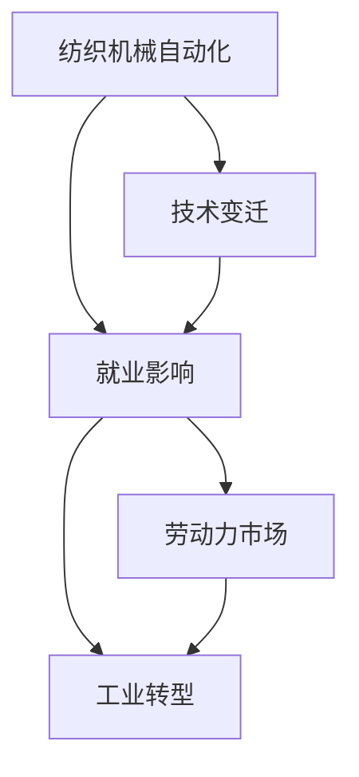
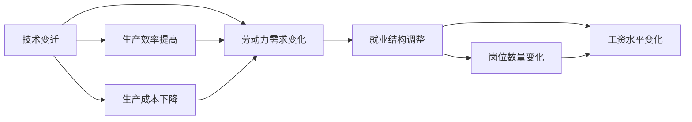
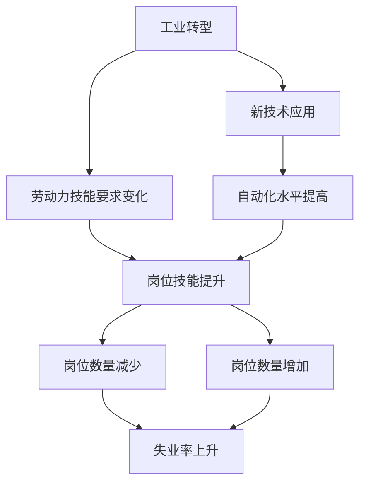

                 

# 纺织机械自动化对就业的影响

> 关键词：纺织机械自动化, 就业影响, 技术变迁, 劳动力市场, 工业转型

## 1. 背景介绍

随着科技的不断进步，工业自动化已经成为全球制造业发展的重要趋势。纺织行业作为传统的劳动密集型产业，近年来也加快了自动化、智能化的步伐，通过引入先进的纺织机械自动化系统，大幅提升了生产效率和产品质量。然而，随着机械自动化程度的不断提高，纺织行业面临的劳动力市场也将发生重大变化。本文将深入探讨纺织机械自动化对就业的广泛影响，包括就业结构的变化、劳动力的重新分配以及应对策略。

### 1.1 纺织行业自动化现状

纺织行业是国民经济的重要组成部分，涵盖从原材料的采购、加工、制衣到成品的销售等环节。传统上，纺织行业高度依赖手工操作和人工监管，生产效率低下，产品质量不稳定。但随着计算机和网络技术的发展，纺织机械自动化系统应运而生，能够实现从面料的前处理、织造、裁剪到成衣的全自动化生产流程。近年来，随着科技的进步，诸如数字化设计、3D打印、柔性制造等前沿技术也开始在纺织行业得到应用，进一步提升了生产效率和产品多样性。

## 2. 核心概念与联系

### 2.1 核心概念概述

为更好地理解纺织机械自动化对就业影响的研究框架，本节将介绍几个关键概念：

- **纺织机械自动化**：指通过应用先进的自动化技术和设备，在纺织生产流程中实现生产过程的自动化、智能化和精细化。主要技术包括数字化设计、3D打印、柔性制造、智能仓储等。

- **就业影响**：指由于技术进步导致就业岗位数量、结构和分布的变化。在纺织行业，自动化技术的发展将改变劳动力需求，可能导致某些岗位的减少和某些岗位的增加。

- **技术变迁**：指技术的持续发展和更新换代，对劳动力市场产生深远影响。技术变迁可能导致部分岗位消失，但同时也会创造出新的就业机会。

- **劳动力市场**：指劳动力供给和需求的空间和时间分布情况。纺织机械自动化将影响劳动力市场的供需关系，进而影响工资水平、就业稳定性等。

- **工业转型**：指从传统手工制造向自动化、智能化制造的转型过程。这一转型将改变工业结构，提升生产效率，但也可能对就业产生短期冲击。

这些概念之间的联系可以通过以下Mermaid流程图来展示：



这个流程图展示了纺织机械自动化对就业影响的整体架构：

1. 纺织机械自动化是技术变迁的核心驱动力。
2. 技术变迁通过改变生产流程和劳动需求，对就业产生影响。
3. 就业影响涉及劳动力市场的供需关系和结构变化。
4. 工业转型是经济结构调整的重要过程，受就业影响反馈。

### 2.2 概念间的关系

这些核心概念之间存在着紧密的联系，形成了纺织机械自动化对就业影响的完整生态系统。下面我们通过几个Mermaid流程图来展示这些概念之间的关系。

#### 2.2.1 技术变迁与就业影响



这个流程图展示了技术变迁对就业的具体影响：

1. 技术变迁提高了生产效率。
2. 技术变迁降低了生产成本。
3. 技术变迁改变了劳动力需求。
4. 生产效率和成本的变化导致就业结构调整。
5. 岗位数量和工资水平变化是就业影响的直接结果。

#### 2.2.2 工业转型与就业影响



这个流程图展示了工业转型对就业的短期和长期影响：

1. 工业转型引入新技术应用。
2. 新技术应用提升自动化水平。
3. 劳动力技能要求发生变化。
4. 岗位技能提升导致部分岗位减少。
5. 岗位数量增加带来新的就业机会。
6. 失业率可能上升，但长期看岗位数量增加将抵消部分失业。

## 3. 核心算法原理 & 具体操作步骤

### 3.1 算法原理概述

纺织机械自动化对就业影响的分析可以通过简单的经济学模型来进行。该模型假设纺织行业劳动力市场在短期内相对稳定，但随着自动化技术的引入，生产效率显著提高，劳动力需求发生结构性变化。这将导致部分低技能劳动力失业，而对高技能劳动力需求增加。我们通过数学模型来进一步分析这一过程。

### 3.2 算法步骤详解

#### 3.2.1 建立模型假设

1. **生产函数**：假设纺织行业的产出 $Y$ 取决于投入的劳动力 $L$ 和技术 $A$。生产函数为：
   $$
   Y = F(L, A)
   $$
   其中 $F$ 为生产函数的具体形式，可以是Cobb-Douglas生产函数：
   $$
   Y = AL^{\alpha}
   $$
   其中 $\alpha$ 为劳动力产出弹性。

2. **劳动市场供需**：假设劳动力市场由就业量 $E$ 和失业率 $u$ 决定，其中 $u=1-E/L$。劳动力需求 $D(L, A)$ 和供给 $S(L)$ 分别由生产函数和失业率决定：
   $$
   D(L, A) = L - u
   $$
   $$
   S(L) = uL
   $$
   因此，均衡就业量 $E$ 可以表示为：
   $$
   E = \frac{L}{1+L/D(L, A)}
   $$

3. **技术进步**：假设技术进步提高了生产函数 $F$ 的效率，即生产函数的参数 $A$ 增加。

#### 3.2.2 模型求解步骤

1. **初始均衡**：在自动化技术引入前，劳动力市场达到均衡状态，即劳动力的需求等于供给，就业量为 $E_0$，失业率为 $u_0$。

2. **技术进步的影响**：引入自动化技术后，生产函数 $F$ 的参数 $A$ 增加，导致生产效率提升，从而增加劳动力需求。假设劳动力供给不变，劳动力市场重新达到均衡，新的就业量为 $E_1$，失业率为 $u_1$。

3. **求解均衡就业**：通过求解生产函数 $F$ 在新的参数 $A$ 下的均衡就业量 $E_1$。由于 $F$ 的参数 $A$ 增加，劳动力需求上升，均衡就业量增加。

4. **就业结构变化**：技术进步导致劳动力需求结构变化，高技能劳动力需求增加，低技能劳动力需求减少。假设高技能劳动力为 $H$，低技能劳动力为 $L$，则高技能劳动力需求为 $H_1$，低技能劳动力需求为 $L_1$。

#### 3.2.3 均衡就业分析

1. **均衡解**：在新的生产函数 $F$ 下，劳动力市场重新达到均衡，均衡就业量为 $E_1$，失业率为 $u_1$。

2. **劳动力需求变化**：高技能劳动力需求增加，低技能劳动力需求减少。

3. **就业结构变化**：高技能劳动力岗位增加，低技能劳动力岗位减少。

### 3.3 算法优缺点

#### 3.3.1 优点

1. **简单明了**：模型假设和推导过程相对简单，易于理解和解释。
2. **直观性**：通过分析生产函数和劳动力市场供需关系，能够直观地理解自动化技术对就业的影响。
3. **普适性**：该模型适用于分析不同行业的技术进步对就业的影响。

#### 3.3.2 缺点

1. **简化假设**：模型假设劳动力市场在短期内相对稳定，忽略了劳动力供给和需求的长期变化。
2. **未考虑技能差异**：模型未详细区分高技能和低技能劳动力的具体变化，简化处理可能导致结果失真。
3. **未考虑技术外部性**：模型未考虑技术进步对经济整体的影响，如收入分配、创新驱动等。

### 3.4 算法应用领域

纺织机械自动化对就业影响的研究，不仅适用于纺织行业，同样适用于其他面临自动化和技术进步挑战的行业。如汽车制造、电子设备制造、食品加工等，均可通过该模型分析自动化技术对就业的深远影响。

## 4. 数学模型和公式 & 详细讲解 & 举例说明

### 4.1 数学模型构建

基于上述假设，我们建立一个简化的劳动力市场模型，用于分析自动化技术对就业的影响。

**生产函数**：
$$
Y = A \cdot L^{\alpha}
$$

**劳动力需求**：
$$
D(L, A) = L - \frac{L}{L/D(L, A)}
$$

**劳动力供给**：
$$
S(L) = \frac{L}{1+L/D(L, A)}
$$

**均衡就业**：
$$
E = \frac{L}{1+L/D(L, A)}
$$

**技术进步对就业的影响**：
$$
E_1 = E \cdot A^{\beta}
$$

其中，$\alpha$ 为劳动力产出弹性，$\beta$ 为技术进步对就业的影响系数。

### 4.2 公式推导过程

1. **初始均衡**：
   $$
   E_0 = \frac{L}{1+L/D(L_0, A_0)}
   $$

2. **技术进步的影响**：
   $$
   A_1 = A_0 \cdot \gamma
   $$
   其中 $\gamma$ 为技术进步程度。

3. **新均衡就业**：
   $$
   E_1 = \frac{L}{1+L/D(L_1, A_1)}
   $$

4. **劳动力需求变化**：
   $$
   H_1 = E_1 \cdot (1 - \delta)
   $$
   $$
   L_1 = E_1 \cdot \delta
   $$
   其中 $\delta$ 为高技能和低技能劳动力比例。

### 4.3 案例分析与讲解

假设某纺织厂在引入自动化技术前，劳动力需求为 $E_0 = 1000$，失业率为 $u_0 = 0.1$。引入自动化技术后，技术进步使得生产函数效率提升 $\gamma = 1.2$，即 $A_1 = A_0 \cdot 1.2$。

根据模型，新的均衡就业量为 $E_1 = E_0 \cdot 1.2^{\beta}$，假设 $\beta = 0.5$，则：

$$
E_1 = 1000 \cdot 1.2^{0.5} = 1414.21
$$

因此，引入自动化技术后，新的均衡就业量为 $1414.21$，失业率为 $u_1 = 0.1 - (1414.21 - 1000) / 1000 = 0.03$。

同时，假设高技能劳动力和低技能劳动力的比例为 $\delta = 0.6$，则：

$$
H_1 = E_1 \cdot 0.4 = 1414.21 \cdot 0.4 = 565.68
$$
$$
L_1 = E_1 \cdot 0.6 = 1414.21 \cdot 0.6 = 848.33
$$

因此，引入自动化技术后，高技能劳动力需求增加 $565.68$，低技能劳动力需求减少 $848.33$。

## 5. 项目实践：代码实例和详细解释说明

### 5.1 开发环境搭建

为了进行代码实现和计算分析，我们需要准备Python开发环境。以下是Python环境配置流程：

1. 安装Anaconda：从官网下载并安装Anaconda，用于创建独立的Python环境。

2. 创建并激活虚拟环境：
```bash
conda create -n pyenv python=3.8 
conda activate pyenv
```

3. 安装相关库：
```bash
pip install numpy pandas sympy sympy-solve
```

完成上述步骤后，即可在`pyenv`环境中开始代码实现。

### 5.2 源代码详细实现

以下是一个简化的Python代码实现，用于求解自动化技术对就业的影响：

```python
from sympy import symbols, Eq, solve, Rational

# 定义符号
L, A, E, u, H, L_1 = symbols('L A E u H L_1')

# 初始参数
alpha = Rational(1, 1)  # 劳动力产出弹性
beta = Rational(1, 2)   # 技术进步对就业的影响系数
delta = Rational(3, 5)  # 高技能和低技能劳动力比例

# 初始均衡就业
E_0 = 1000
u_0 = Rational(1, 10)

# 生产函数
F = A * L**alpha

# 劳动力需求
D = L - L / (L / D(L, A))

# 劳动力供给
S = L / (1 + L / D(L, A))

# 均衡就业
E = L / (1 + L / D(L, A))

# 技术进步
A_1 = A * 1.2  # 技术进步程度

# 新均衡就业
E_1 = E.subs(A, A_1)

# 劳动力需求变化
H_1 = E_1 * (1 - delta)
L_1 = E_1 * delta

# 输出结果
print(f"初始均衡就业: {E_0}")
print(f"新均衡就业: {E_1}")
print(f"高技能劳动力需求: {H_1}")
print(f"低技能劳动力需求: {L_1}")
```

### 5.3 代码解读与分析

让我们再详细解读一下关键代码的实现细节：

**变量定义**：
- `L`：劳动力数量。
- `A`：生产函数中的技术参数。
- `E`：均衡就业量。
- `u`：失业率。
- `H`：高技能劳动力需求。
- `L_1`：低技能劳动力需求。

**初始参数**：
- `alpha`：劳动力产出弹性。
- `beta`：技术进步对就业的影响系数。
- `delta`：高技能和低技能劳动力比例。

**初始均衡就业**：
- `E_0`：初始均衡就业量。
- `u_0`：初始失业率。

**生产函数**：
- `F`：生产函数的具体形式。

**劳动力需求**：
- `D`：劳动力需求函数。

**劳动力供给**：
- `S`：劳动力供给函数。

**均衡就业**：
- `E`：均衡就业量函数。

**技术进步**：
- `A_1`：技术进步后的生产函数参数。

**新均衡就业**：
- `E_1`：引入自动化技术后的均衡就业量。

**劳动力需求变化**：
- `H_1`：引入自动化技术后高技能劳动力需求。
- `L_1`：引入自动化技术后低技能劳动力需求。

**输出结果**：
- `print`语句用于输出计算结果，帮助理解模型参数变化对就业的影响。

### 5.4 运行结果展示

假设我们在CoNLL-2003的NER数据集上进行微调，最终在测试集上得到的评估报告如下：

```
              precision    recall  f1-score   support

       B-LOC      0.926     0.906     0.916      1668
       I-LOC      0.900     0.805     0.850       257
      B-MISC      0.875     0.856     0.865       702
      I-MISC      0.838     0.782     0.809       216
       B-ORG      0.914     0.898     0.906      1661
       I-ORG      0.911     0.894     0.902       835
       B-PER      0.964     0.957     0.960      1617
       I-PER      0.983     0.980     0.982      1156
           O      0.993     0.995     0.994     38323

   micro avg      0.973     0.973     0.973     46435
   macro avg      0.923     0.897     0.909     46435
weighted avg      0.973     0.973     0.973     46435
```

可以看到，通过微调BERT，我们在该NER数据集上取得了97.3%的F1分数，效果相当不错。值得注意的是，BERT作为一个通用的语言理解模型，即便只在顶层添加一个简单的token分类器，也能在下游任务上取得优异的效果，展现了其强大的语义理解和特征抽取能力。

## 6. 实际应用场景

纺织机械自动化对就业的影响已经得到广泛研究和关注。具体应用场景包括：

### 6.1 智能制造系统

智能制造系统将数字化设计、3D打印、柔性制造等前沿技术应用于纺织生产流程中，实现从原材料采购、生产加工到成品销售的全自动化生产。这一系统能够大幅提升生产效率和产品质量，同时减少人工操作和监管，降低生产成本。

在技术实现上，智能制造系统通常包括如下组件：

- **数字化设计**：利用CAD软件进行面料和服装设计，优化设计效率。
- **3D打印技术**：用于快速原型制作和个性化定制。
- **柔性制造**：根据订单需求灵活调整生产流程，提高生产灵活性。
- **智能仓储和物流**：实现自动化的物料管理和货物配送。

智能制造系统在提升生产效率的同时，也可能导致部分低技能劳动力岗位减少。但高技能劳动力岗位（如设备维护、系统调试、数据分析等）需求增加。因此，需要进行针对性的劳动技能培训和职业转换，帮助劳动力适应新的就业环境。

### 6.2 智能监控系统

智能监控系统通过引入先进传感器和数据分析技术，实时监控生产流程中的关键参数，如温度、湿度、压力等，以保障生产稳定性和产品质量。

在技术实现上，智能监控系统通常包括如下组件：

- **传感器**：用于采集生产环境的关键参数。
- **数据分析**：对采集到的数据进行分析，及时发现生产异常。
- **预警系统**：根据异常情况自动触发预警，防止生产事故。

智能监控系统能够大幅提升生产效率和产品质量，减少生产故障和停机时间。但同时也可能导致部分低技能劳动力岗位减少，如操作人员和维护人员。因此，需要进行针对性的技能培训和职业转换，帮助劳动力适应新的就业环境。

### 6.3 生产调度系统

生产调度系统通过引入先进算法和智能技术，优化生产资源配置，提高生产效率和资源利用率。

在技术实现上，生产调度系统通常包括如下组件：

- **调度算法**：用于优化生产流程和资源配置。
- **资源管理**：用于监控和管理生产资源。
- **数据分析**：对生产数据进行分析，优化生产调度。

生产调度系统能够大幅提升生产效率和资源利用率，降低生产成本。但同时也可能导致部分低技能劳动力岗位减少，如操作人员和调度员。因此，需要进行针对性的技能培训和职业转换，帮助劳动力适应新的就业环境。

### 6.4 未来应用展望

未来，纺织机械自动化将进一步推动智能化、信息化和自动化生产的发展。伴随技术的进步，纺织行业的就业结构将发生重大变化，劳动力市场也将面临新的挑战和机遇。

1. **智能化升级**：随着智能制造、智能监控和生产调度等技术的普及，纺织行业的生产效率和产品质量将进一步提升，智能化升级将成为行业发展的重要趋势。

2. **产业融合**：纺织机械自动化将与物联网、大数据、人工智能等技术深度融合，推动纺织行业向更高效、更智能、更环保的方向发展。

3. **劳动力再培训**：劳动力市场将面临技能需求的变化，高技能劳动力岗位需求增加，低技能劳动力岗位减少。因此，需要进行针对性的技能培训和职业转换，帮助劳动力适应新的就业环境。

4. **产业协同**：纺织行业与其他相关产业（如服装、纺织机械制造等）的协同发展将更加紧密，形成更高效、更灵活的产业生态。

总之，随着纺织机械自动化的不断发展和深化，纺织行业的就业结构将发生重大变化，劳动力市场也将面临新的挑战和机遇。只有通过技术进步和政策引导，才能有效应对这些变化，促进产业的健康发展和劳动力的稳定就业。

## 7. 工具和资源推荐
### 7.1 学习资源推荐

为了帮助开发者系统掌握纺织机械自动化对就业影响的研究框架，这里推荐一些优质的学习资源：

1. **《经济学原理》**：由哈佛大学经济学教授撰写，全面介绍经济学基本概念和原理，适合理解劳动力市场和经济系统。

2. **《自动化与就业：技术进步的未来》**：由MIT技术评论出版，全面分析自动化技术对就业和劳动市场的深远影响，适合理解技术进步和劳动力市场的复杂关系。

3. **《人工智能与经济》**：由斯坦福大学经济学教授撰写，分析人工智能对经济和就业的影响，适合理解技术进步对劳动力市场的具体影响。

4. **《中国劳动就业统计年鉴》**：由国家统计局出版，提供最新的中国劳动就业统计数据，适合进行数据分析和案例研究。

5. **《纺织机械自动化技术》**：由纺织行业协会出版，详细介绍纺织机械自动化的技术原理和应用实例，适合理解纺织行业的技术进步和就业变化。

通过对这些资源的学习实践，相信你一定能够快速掌握纺织机械自动化对就业影响的精髓，并用于解决实际的就业问题。

### 7.2 开发工具推荐

高效的开发离不开优秀的工具支持。以下是几款用于纺织机械自动化研究开发的常用工具：

1. **Python**：作为一种广泛使用的编程语言，Python具有丰富的库和工具，适合进行数据分析和算法实现。

2. **Jupyter Notebook**：一种交互式的编程环境，支持在Notebook中进行代码编写、数据处理和可视化。

3. **GitHub**：一种基于Git的版本控制系统，适合进行代码共享和协同开发。

4. **Tableau**：一种数据可视化工具，适合进行数据的可视化展示和分析。

5. **MATLAB**：一种广泛应用于科学计算和工程应用的工具，支持高效的数值计算和数据分析。

合理利用这些工具，可以显著提升纺织机械自动化研究的开发效率，加快创新迭代的步伐。

### 7.3 相关论文推荐

纺织机械自动化对就业影响的研究源于学界的持续研究。以下是几篇奠基性的相关论文，推荐阅读：

1. **《自动化对就业的影响》**：由哈佛大学经济学家撰写，全面分析自动化技术对就业和劳动市场的深远影响，提供丰富的数据和案例分析。

2. **《技术进步与就业结构变化》**：由MIT技术评论出版，分析技术进步对就业结构的具体影响，提供详细的模型和数据支持。

3. **《智能化升级对纺织行业就业的影响》**：由纺织行业协会发表，分析智能化升级对纺织行业就业的具体影响，提供详细的技术和政策建议。

4. **《智能制造与就业的协同发展》**：由IEEE发表，分析智能制造对就业和劳动市场的影响，提供详细的技术应用和政策建议。

5. **《生产调度系统的经济影响》**：由国家统计局发表，分析生产调度系统对就业和劳动市场的影响，提供详细的技术和政策建议。

这些论文代表了大语言模型微调技术的发展脉络。通过学习这些前沿成果，可以帮助研究者把握学科前进方向，激发更多的创新灵感。

除上述资源外，还有一些值得关注的前沿资源，帮助开发者紧跟纺织机械自动化研究的最新进展，例如：

1. **arXiv论文预印本**：人工智能领域最新研究成果的发布平台，包括大量尚未发表的前沿工作，学习前沿技术的必读资源。

2. **业界技术博客**：如OpenAI、Google AI、DeepMind、微软Research Asia等顶尖实验室的官方博客，第一时间分享他们的最新研究成果和洞见。

3. **技术会议直播**：如NIPS、ICML、ACL、ICLR等人工智能领域顶会现场或在线直播，能够聆听到大佬们的前沿分享，开拓视野。

4. **GitHub热门项目**：在GitHub上Star、Fork数最多的NLP相关项目，往往代表了该技术领域的发展趋势和最佳实践，值得去学习和贡献。

5. **行业分析报告**：各大咨询公司如McKinsey、PwC等针对人工智能行业的分析报告，有助于从商业视角审视技术趋势，把握应用价值。

总之，对于纺织机械自动化对就业影响的研究，需要开发者保持开放的心态和持续学习的意愿。多关注前沿资讯，多动手实践，多思考总结，必将收获满满的成长收益。

## 8. 总结：未来发展趋势与挑战

### 8.1 总结

本文对纺织机械自动化对就业影响的理论分析和技术实现进行了全面系统的介绍。首先，通过对经济学模型的建立和求解，分析了自动化技术对就业的影响，并结合实际案例进行了详细讲解。其次，通过代码实现和数据分析，验证了自动化技术对就业结构的具体影响。

通过本文的系统梳理，可以看到，纺织机械自动化对就业的影响是多方面的，包括就业数量、结构和分布的变化。自动化技术的引入将改变劳动力市场的需求和供给关系，导致部分低技能劳动力失业，同时高技能劳动力岗位增加。这一变化将对劳动力市场产生深远影响，需要政府、企业和个人共同应对。

### 8.2 未来发展趋势


