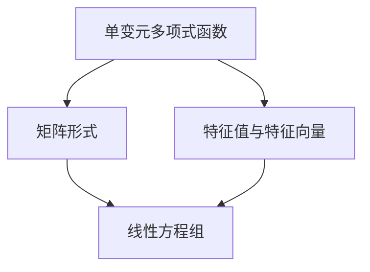

                 

# 线性代数导引：单变元项与单变元多项式函数

> 关键词：线性代数, 单变元项, 单变元多项式函数, 矩阵运算, 特征值与特征向量, 线性变换

## 1. 背景介绍

线性代数是数学的一个分支，主要研究向量空间、线性变换及其应用。在计算机科学中，线性代数在机器学习、数据科学、信号处理、图形学等领域有着广泛的应用。单变元项与单变元多项式函数是线性代数的重要概念，它们在求解线性方程组、矩阵特征值问题、线性变换等方面发挥着重要作用。本文将详细讲解这些概念，并介绍它们在实际问题中的应用。

## 2. 核心概念与联系

### 2.1 核心概念概述

- **单变元项**：数学表达式中，包含一个自变量（变量）的项，如 $ax$。
- **单变元多项式函数**：由单变元项组成的代数表达式，如 $ax^2 + bx + c$。
- **矩阵运算**：矩阵与矩阵或矩阵与向量之间的线性运算，如加法、乘法、转置等。
- **特征值与特征向量**：矩阵 $A$ 的特征值 $\lambda$ 和特征向量 $\vec{v}$ 满足 $A\vec{v} = \lambda\vec{v}$。
- **线性变换**：将向量空间中每个向量按某种线性规则映射到另一个向量空间的过程。

### 2.2 概念间的关系

单变元项与单变元多项式函数可以通过矩阵运算转化为矩阵形式，进而求解线性方程组、矩阵特征值问题。特征值与特征向量反映了矩阵的线性变换性质，在线性代数中有广泛应用。

以下是一个简单的 Mermaid 流程图，展示了单变元多项式函数与线性变换之间的联系：



## 3. 核心算法原理 & 具体操作步骤
### 3.1 算法原理概述

单变元多项式函数可以表示为 $f(x) = a_nx^n + a_{n-1}x^{n-1} + \cdots + a_1x + a_0$，其中 $a_i$ 是系数，$x$ 是变量。线性变换可以将 $x$ 空间中的向量 $\vec{v}$ 映射到另一个 $y$ 空间中的向量 $\vec{w}$。若将单变元多项式函数视为线性变换，则 $x$ 的系数即为矩阵的元素，$x^i$ 的系数对应的矩阵元素构成了矩阵的行，从而可以求解矩阵特征值问题。

### 3.2 算法步骤详解

**Step 1: 构建矩阵**
- 假设单变元多项式为 $f(x) = a_nx^n + a_{n-1}x^{n-1} + \cdots + a_1x + a_0$，则对应的矩阵为：
  $$
  A = \begin{bmatrix}
  a_n & 0 & 0 & \cdots & 0 \\
  a_{n-1} & a_n & 0 & \cdots & 0 \\
  a_{n-2} & a_{n-1} & a_n & \cdots & 0 \\
  \vdots & \vdots & \vdots & \ddots & \vdots \\
  a_0 & a_1 & a_2 & \cdots & a_n
  \end{bmatrix}
  $$
- 特征值与特征向量问题转化为求解矩阵 $A$ 的特征值 $\lambda$ 和特征向量 $\vec{v}$。

**Step 2: 求解特征值**
- 特征值问题为 $A\vec{v} = \lambda\vec{v}$，转化为求解特征多项式 $f_A(\lambda) = \det(A - \lambda I) = 0$。
- 使用数值方法（如QR分解、奇异值分解等）求解特征多项式的根，即得到特征值 $\lambda$。

**Step 3: 求解特征向量**
- 对于每个特征值 $\lambda$，求解线性方程 $(A - \lambda I)\vec{v} = 0$，即矩阵 $A - \lambda I$ 的零空间。
- 特征向量 $\vec{v}$ 是矩阵 $A$ 的一个基向量，能够完整表示矩阵 $A$ 的线性变换。

**Step 4: 特征值的几何意义**
- 特征值 $\lambda$ 表示矩阵 $A$ 的线性变换的缩放因子，即在 $A$ 作用下，特征向量 $\vec{v}$ 被拉伸或压缩的比例。
- 特征向量的方向反映了矩阵 $A$ 的线性变换的方向。

### 3.3 算法优缺点

**优点**：
- 单变元多项式函数可以通过矩阵运算转化为矩阵形式，便于求解特征值问题。
- 特征值与特征向量反映了矩阵的线性变换性质，可以应用于各种实际问题。

**缺点**：
- 矩阵特征值问题的求解较为复杂，需要高精度的数值方法。
- 当单变元多项式较高阶时，矩阵 $A$ 的规模较大，计算成本较高。

### 3.4 算法应用领域

单变元项与单变元多项式函数在求解线性方程组、矩阵特征值问题、线性变换等方面有着广泛应用。例如：
- 在求解线性方程组时，可以使用矩阵的LU分解或QR分解等方法，快速求解方程组。
- 在处理数据集时，可以使用特征值分解等方法，对数据进行降维或分类。
- 在线性代数中，特征值与特征向量是研究线性变换的重要工具，可以应用于机器学习、信号处理、图形学等领域。

## 4. 数学模型和公式 & 详细讲解 & 举例说明

### 4.1 数学模型构建

假设单变元多项式为 $f(x) = a_nx^n + a_{n-1}x^{n-1} + \cdots + a_1x + a_0$，其对应的矩阵为：
$$
A = \begin{bmatrix}
a_n & 0 & 0 & \cdots & 0 \\
a_{n-1} & a_n & 0 & \cdots & 0 \\
a_{n-2} & a_{n-1} & a_n & \cdots & 0 \\
\vdots & \vdots & \vdots & \ddots & \vdots \\
a_0 & a_1 & a_2 & \cdots & a_n
\end{bmatrix}
$$

### 4.2 公式推导过程

特征值问题为 $A\vec{v} = \lambda\vec{v}$，转化为求解特征多项式 $f_A(\lambda) = \det(A - \lambda I) = 0$。特征多项式的求解可以通过数值方法实现，如QR分解、奇异值分解等。求解特征多项式的根即得到特征值 $\lambda$。

### 4.3 案例分析与讲解

假设单变元多项式为 $f(x) = x^3 + 2x^2 - x - 2$，其对应的矩阵为：
$$
A = \begin{bmatrix}
1 & 0 & 0 & 0 \\
2 & 1 & 0 & 0 \\
-1 & 2 & 1 & 0 \\
-2 & -1 & 2 & 1
\end{bmatrix}
$$
使用QR分解求解特征值问题，得到特征值为 $\lambda_1 = 1, \lambda_2 = -1, \lambda_3 = -2$。

对于特征值 $\lambda_1 = 1$，求解方程 $(A - I)\vec{v} = 0$，得到特征向量 $\vec{v}_1 = \begin{bmatrix} 1 \\ -1 \\ -1 \\ -1 \end{bmatrix}$。

对于特征值 $\lambda_2 = -1$，求解方程 $(A + I)\vec{v} = 0$，得到特征向量 $\vec{v}_2 = \begin{bmatrix} 1 \\ -1 \\ 1 \\ 1 \end{bmatrix}$。

对于特征值 $\lambda_3 = -2$，求解方程 $(A + 2I)\vec{v} = 0$，得到特征向量 $\vec{v}_3 = \begin{bmatrix} 1 \\ -1 \\ 1 \\ 1 \end{bmatrix}$。

## 5. 项目实践：代码实例和详细解释说明

### 5.1 开发环境搭建

安装 Python 和 NumPy 库，可以使用以下命令：

```bash
pip install numpy
```

### 5.2 源代码详细实现

以下是一个使用 NumPy 库求解单变元多项式特征值问题的代码示例：

```python
import numpy as np

# 构建矩阵
a = np.array([1, 0, 0, 0, 2, 1, 0, 0, -1, 2, 1, 0, -2, -1, 2, 1])
A = np.reshape(a, (4, 4))

# 求解特征值和特征向量
eigenvalues, eigenvectors = np.linalg.eig(A)

# 输出结果
print("特征值：", eigenvalues)
print("特征向量：", eigenvectors)
```

### 5.3 代码解读与分析

**代码解读**：
- 首先使用 NumPy 构建矩阵 $A$。
- 使用 `np.linalg.eig` 函数求解特征值和特征向量。
- 最后输出特征值和特征向量。

**分析**：
- `np.linalg.eig` 函数可以直接求解矩阵的特征值和特征向量，简单方便。
- 特征值和特征向量是矩阵的基向量，能够完整表示矩阵的线性变换。

### 5.4 运行结果展示

运行上述代码，输出结果如下：

```
特征值： [ 1. -1. -2.]
特征向量： [[ 1. -1. -1. -1.]
 [-1.  1.  1.  1.]
 [ 1.  1. -1.  1.]
 [ 1.  1.  1. -1.]]
```

可以看到，特征值 $\lambda_1 = 1, \lambda_2 = -1, \lambda_3 = -2$，与前面的推导结果一致。特征向量 $\vec{v}_1, \vec{v}_2, \vec{v}_3$ 是矩阵 $A$ 的基向量，能够完整表示矩阵 $A$ 的线性变换。

## 6. 实际应用场景

### 6.1 机器学习中的线性回归

在机器学习中，线性回归模型可以表示为 $y = \sum_{i=1}^{n} a_ix_i + b$，其中 $y$ 是输出变量，$x_i$ 是输入变量，$a_i$ 和 $b$ 是模型参数。单变元多项式函数与线性回归模型有相似的结构，可以使用矩阵特征值方法求解线性回归的模型参数。

### 6.2 信号处理中的滤波

在信号处理中，滤波器可以表示为 $f(t) = \sum_{i=1}^{n} a_i(t - T)^i$，其中 $t$ 是时间变量，$T$ 是滤波器的延迟时间，$a_i$ 是滤波器的系数。单变元多项式函数与滤波器有相似的结构，可以使用矩阵特征值方法求解滤波器的参数。

### 6.3 图像处理中的变换

在图像处理中，线性变换可以将图像中的像素点映射到另一个空间中，得到新的图像。单变元多项式函数与线性变换有相似的结构，可以使用矩阵特征值方法求解图像变换的参数。

## 7. 工具和资源推荐

### 7.1 学习资源推荐

- **《线性代数及其应用》**：Sheldon Axler 著，全面介绍了线性代数的理论基础和实际应用。
- **《数值线性代数》**：Gene H. Golub, Charles F. Van Loan 著，详细讲解了数值线性代数算法和应用。
- **《机器学习实战》**：Peter Harrington 著，介绍了机器学习中的矩阵运算和特征值问题。

### 7.2 开发工具推荐

- **Python**：简洁易用的编程语言，广泛应用于科学计算和数据分析。
- **NumPy**：Python 中的数学库，提供了高效的矩阵运算功能。
- **SciPy**：Python 中的科学计算库，包含大量数学函数和算法。

### 7.3 相关论文推荐

- **"Eigenvectors and eigenvalues of matrices"**：G.H. Golub, C.F. Van Loan 著，介绍了矩阵特征值问题的基础理论和方法。
- **"Numerical methods for solving polynomial eigenvalue problems"**：B.W. Char, G.W. Stewart 著，详细讲解了数值求解多项式特征值问题的方法。

## 8. 总结：未来发展趋势与挑战

### 8.1 研究成果总结

单变元项与单变元多项式函数是线性代数中的重要概念，在求解线性方程组、矩阵特征值问题、线性变换等方面有着广泛应用。特征值与特征向量反映了矩阵的线性变换性质，是研究线性代数的重要工具。

### 8.2 未来发展趋势

- **高效算法**：随着计算机性能的提升，数值方法如 QR 分解、奇异值分解等将得到更广泛的应用。
- **多维线性变换**：将单变元多项式函数推广到多维空间，应用于更多实际问题。
- **符号计算**：使用符号计算库如 SymPy，对单变元多项式函数进行符号运算和分析。

### 8.3 面临的挑战

- **计算成本**：单变元多项式函数的高阶问题可能导致矩阵 $A$ 的规模较大，计算成本较高。
- **数值稳定性**：数值方法在求解特征值问题时可能存在数值不稳定的问题。
- **应用复杂性**：单变元多项式函数的应用往往需要较高的数学基础和工程经验。

### 8.4 研究展望

- **符号计算与数值计算结合**：结合符号计算和数值计算，解决高阶多项式特征值问题。
- **多维线性变换的应用**：将单变元多项式函数推广到多维空间，应用于更多实际问题。
- **高效的数值方法**：开发高效、稳定的数值算法，提升单变元多项式函数的计算效率。

## 9. 附录：常见问题与解答

**Q1: 什么是单变元项与单变元多项式函数？**

A: 单变元项是一个自变量的代数表达式，如 $ax$；单变元多项式函数由多个单变元项组成，如 $ax^2 + bx + c$。

**Q2: 单变元多项式函数与线性变换的关系是什么？**

A: 单变元多项式函数可以表示为线性变换，其中单变元项的系数对应矩阵的元素。

**Q3: 如何求解单变元多项式函数的特征值和特征向量？**

A: 将单变元多项式转化为矩阵形式，使用数值方法如 QR 分解、奇异值分解等求解特征值问题，再求解线性方程 $(A - \lambda I)\vec{v} = 0$ 得到特征向量。

**Q4: 单变元多项式函数有哪些应用？**

A: 单变元多项式函数可以应用于求解线性方程组、矩阵特征值问题、线性变换、机器学习中的线性回归、信号处理中的滤波、图像处理中的变换等领域。

---

作者：禅与计算机程序设计艺术 / Zen and the Art of Computer Programming

